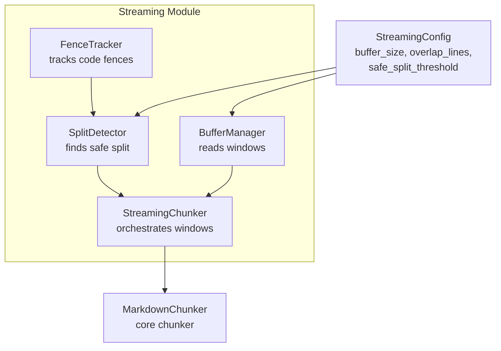
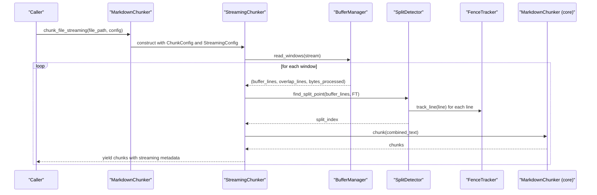
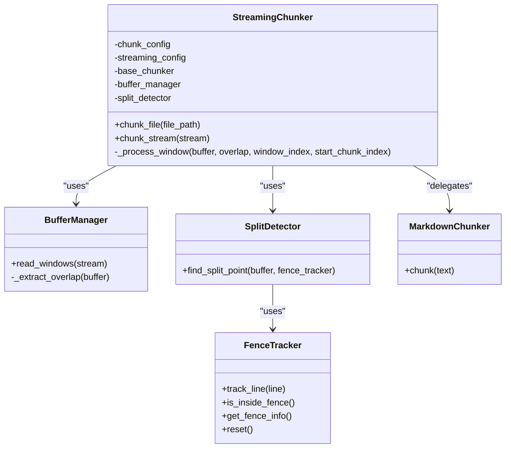
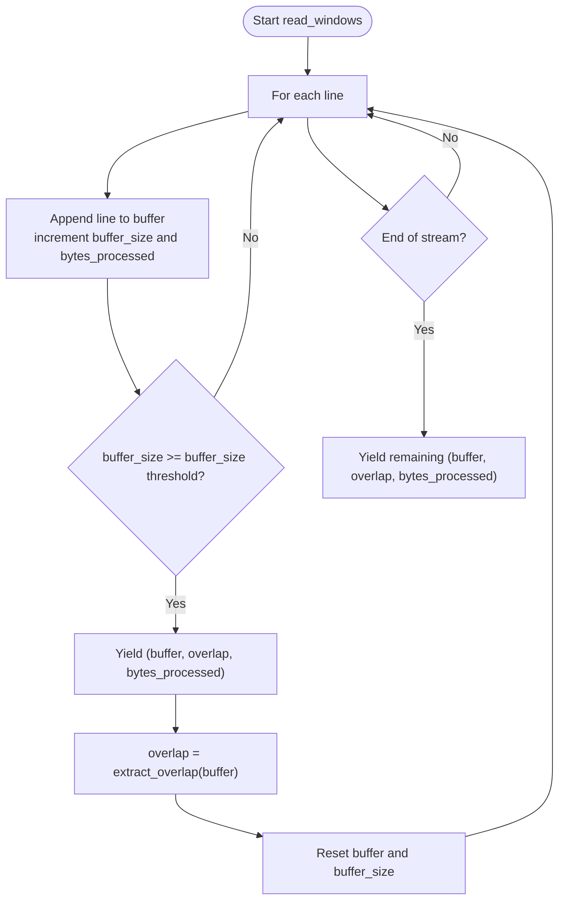
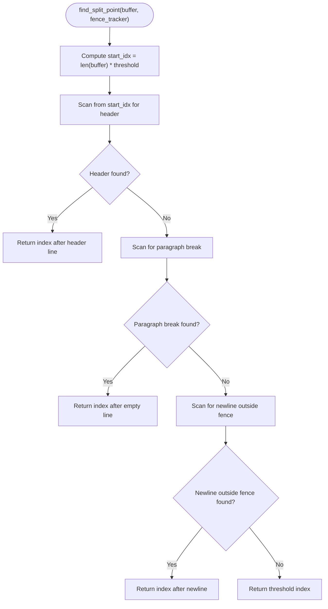
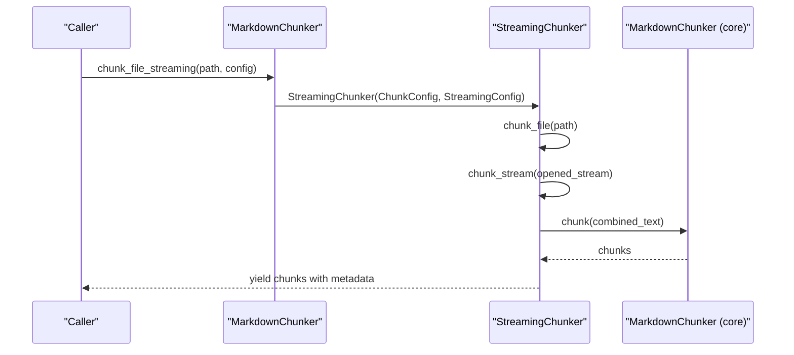
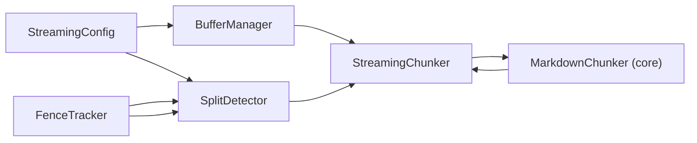

# Streaming Architecture

<cite>
**Referenced Files in This Document**
- [streaming_chunker.py](file://markdown_chunker_v2/streaming/streaming_chunker.py)
- [buffer_manager.py](file://markdown_chunker_v2/streaming/buffer_manager.py)
- [config.py](file://markdown_chunker_v2/streaming/config.py)
- [fence_tracker.py](file://markdown_chunker_v2/streaming/fence_tracker.py)
- [split_detector.py](file://markdown_chunker_v2/streaming/split_detector.py)
- [chunker.py](file://markdown_chunker_v2/chunker.py)
- [test_streaming_processing.py](file://tests/chunker/test_streaming_processing.py)
- [test_streaming_integration.py](file://tests/integration/test_streaming_integration.py)
- [test_streaming_benchmarks.py](file://tests/integration/test_streaming_benchmarks.py)
- [streaming.md](file://docs/api/streaming.md)
- [14-streaming-processing.md](file://docs/research/features/14-streaming-processing.md)
- [provider.py](file://markdown_chunker/provider.py)
- [main.py](file://main.py)
</cite>

## Table of Contents
1. [Introduction](#introduction)
2. [Project Structure](#project-structure)
3. [Core Components](#core-components)
4. [Architecture Overview](#architecture-overview)
5. [Detailed Component Analysis](#detailed-component-analysis)
6. [Dependency Analysis](#dependency-analysis)
7. [Performance Considerations](#performance-considerations)
8. [Troubleshooting Guide](#troubleshooting-guide)
9. [Conclusion](#conclusion)
10. [Appendices](#appendices)

## Introduction
This document explains the streaming architecture used to process large Markdown files efficiently. The streaming pipeline reads input incrementally, manages fixed-size windows with overlap, detects safe split points to avoid breaking atomic blocks, and delegates actual chunking to the core chunker. It ensures memory usage remains bounded while preserving chunk quality and enabling progress tracking.

## Project Structure
The streaming capability is implemented under the streaming module and integrated into the main chunker. The primary files involved are:
- Streaming core: buffer manager, split detector, fence tracker, and streaming chunker
- Integration: MarkdownChunker’s streaming APIs
- Tests and docs: unit, integration, and benchmark tests, plus API and feature docs

**Diagram sources**
- [buffer_manager.py](file://markdown_chunker_v2/streaming/buffer_manager.py#L1-L64)
- [split_detector.py](file://markdown_chunker_v2/streaming/split_detector.py#L1-L98)
- [fence_tracker.py](file://markdown_chunker_v2/streaming/fence_tracker.py#L1-L66)
- [streaming_chunker.py](file://markdown_chunker_v2/streaming/streaming_chunker.py#L1-L105)
- [config.py](file://markdown_chunker_v2/streaming/config.py#L1-L24)
- [chunker.py](file://markdown_chunker_v2/chunker.py#L240-L291)

**Section sources**
- [streaming_chunker.py](file://markdown_chunker_v2/streaming/streaming_chunker.py#L1-L105)
- [buffer_manager.py](file://markdown_chunker_v2/streaming/buffer_manager.py#L1-L64)
- [config.py](file://markdown_chunker_v2/streaming/config.py#L1-L24)
- [fence_tracker.py](file://markdown_chunker_v2/streaming/fence_tracker.py#L1-L66)
- [split_detector.py](file://markdown_chunker_v2/streaming/split_detector.py#L1-L98)
- [chunker.py](file://markdown_chunker_v2/chunker.py#L240-L291)

## Core Components
- StreamingConfig: Controls buffer size, overlap lines, and safe split threshold.
- BufferManager: Reads input line-by-line, yields fixed-size windows with overlap.
- SplitDetector: Finds safe split points prioritizing headers, paragraph breaks, and newline outside fences.
- FenceTracker: Tracks fenced code block state across windows to prevent mid-block splits.
- StreamingChunker: Orchestrates window reading, safe splitting, overlap handling, and yields chunks enriched with streaming metadata.
- MarkdownChunker integration: Exposes chunk_file_streaming and chunk_stream methods that delegate to StreamingChunker.

Key streaming metadata attached to each chunk:
- stream_chunk_index
- stream_window_index
- bytes_processed

**Section sources**
- [config.py](file://markdown_chunker_v2/streaming/config.py#L1-L24)
- [buffer_manager.py](file://markdown_chunker_v2/streaming/buffer_manager.py#L1-L64)
- [split_detector.py](file://markdown_chunker_v2/streaming/split_detector.py#L1-L98)
- [fence_tracker.py](file://markdown_chunker_v2/streaming/fence_tracker.py#L1-L66)
- [streaming_chunker.py](file://markdown_chunker_v2/streaming/streaming_chunker.py#L1-L105)
- [chunker.py](file://markdown_chunker_v2/chunker.py#L240-L291)

## Architecture Overview
The streaming pipeline is a layered, incremental processor:
- Input stream is consumed line-by-line.
- Windows are emitted when buffer_size threshold is reached.
- Overlap lines from the previous window are prepended to the current window to preserve context.
- A safe split point is computed within the window to avoid breaking atomic blocks.
- The core chunker processes the window text and yields chunks.
- Each yielded chunk is annotated with streaming metadata.

**Diagram sources**
- [chunker.py](file://markdown_chunker_v2/chunker.py#L240-L291)
- [streaming_chunker.py](file://markdown_chunker_v2/streaming/streaming_chunker.py#L43-L105)
- [buffer_manager.py](file://markdown_chunker_v2/streaming/buffer_manager.py#L29-L64)
- [split_detector.py](file://markdown_chunker_v2/streaming/split_detector.py#L28-L98)
- [fence_tracker.py](file://markdown_chunker_v2/streaming/fence_tracker.py#L23-L66)

## Detailed Component Analysis

### StreamingChunker
Responsibilities:
- Initialize with ChunkConfig and optional StreamingConfig.
- Read windows from a stream via BufferManager.
- Compute safe split points using SplitDetector.
- Combine overlap with buffer and pass to core MarkdownChunker.
- Attach streaming metadata to each chunk.

**Diagram sources**
- [streaming_chunker.py](file://markdown_chunker_v2/streaming/streaming_chunker.py#L1-L105)
- [buffer_manager.py](file://markdown_chunker_v2/streaming/buffer_manager.py#L1-L64)
- [split_detector.py](file://markdown_chunker_v2/streaming/split_detector.py#L1-L98)
- [fence_tracker.py](file://markdown_chunker_v2/streaming/fence_tracker.py#L1-L66)
- [chunker.py](file://markdown_chunker_v2/chunker.py#L80-L168)

**Section sources**
- [streaming_chunker.py](file://markdown_chunker_v2/streaming/streaming_chunker.py#L18-L105)
- [chunker.py](file://markdown_chunker_v2/chunker.py#L240-L291)

### BufferManager
Responsibilities:
- Accumulate lines until buffer_size threshold is met.
- Emit tuples of (buffer_lines, overlap_lines, bytes_processed).
- On each emission, compute overlap from the end of the buffer.
- Emit remaining buffer at the end.

**Diagram sources**
- [buffer_manager.py](file://markdown_chunker_v2/streaming/buffer_manager.py#L29-L64)

**Section sources**
- [buffer_manager.py](file://markdown_chunker_v2/streaming/buffer_manager.py#L1-L64)

### SplitDetector and FenceTracker
SplitDetector computes a safe split index within a window using a priority order:
1. Header boundary (line before a header)
2. Paragraph boundary (double newline)
3. Newline outside a fence
4. Fallback to threshold position

FenceTracker tracks fenced code block state across lines to avoid splitting mid-block.

**Diagram sources**
- [split_detector.py](file://markdown_chunker_v2/streaming/split_detector.py#L28-L98)
- [fence_tracker.py](file://markdown_chunker_v2/streaming/fence_tracker.py#L23-L66)

**Section sources**
- [split_detector.py](file://markdown_chunker_v2/streaming/split_detector.py#L1-L98)
- [fence_tracker.py](file://markdown_chunker_v2/streaming/fence_tracker.py#L1-L66)

### Integration with MarkdownChunker
MarkdownChunker exposes:
- chunk_file_streaming(file_path, streaming_config) -> Iterator[Chunk]
- chunk_stream(stream, streaming_config) -> Iterator[Chunk]

These methods construct a StreamingChunker with the provided configurations and yield chunks lazily.

**Diagram sources**
- [chunker.py](file://markdown_chunker_v2/chunker.py#L240-L291)
- [streaming_chunker.py](file://markdown_chunker_v2/streaming/streaming_chunker.py#L43-L105)

**Section sources**
- [chunker.py](file://markdown_chunker_v2/chunker.py#L240-L291)
- [streaming_chunker.py](file://markdown_chunker_v2/streaming/streaming_chunker.py#L43-L105)

## Dependency Analysis
- StreamingChunker depends on BufferManager, SplitDetector, and MarkdownChunker.
- SplitDetector depends on FenceTracker to avoid splitting fenced blocks.
- MarkdownChunker integrates StreamingChunker via dedicated streaming methods.
- Tests validate correctness, equivalence to batch processing, and performance characteristics.

**Diagram sources**
- [config.py](file://markdown_chunker_v2/streaming/config.py#L1-L24)
- [buffer_manager.py](file://markdown_chunker_v2/streaming/buffer_manager.py#L1-L64)
- [split_detector.py](file://markdown_chunker_v2/streaming/split_detector.py#L1-L98)
- [fence_tracker.py](file://markdown_chunker_v2/streaming/fence_tracker.py#L1-L66)
- [streaming_chunker.py](file://markdown_chunker_v2/streaming/streaming_chunker.py#L1-L105)
- [chunker.py](file://markdown_chunker_v2/chunker.py#L240-L291)

**Section sources**
- [streaming_chunker.py](file://markdown_chunker_v2/streaming/streaming_chunker.py#L1-L105)
- [buffer_manager.py](file://markdown_chunker_v2/streaming/buffer_manager.py#L1-L64)
- [split_detector.py](file://markdown_chunker_v2/streaming/split_detector.py#L1-L98)
- [fence_tracker.py](file://markdown_chunker_v2/streaming/fence_tracker.py#L1-L66)
- [chunker.py](file://markdown_chunker_v2/chunker.py#L240-L291)

## Performance Considerations
- Memory usage is bounded by buffer_size plus overlap and processing overhead. Tests confirm constant memory scaling with file size.
- Throughput remains high for typical Markdown content, with minimal overhead compared to batch processing.
- Early termination is supported; iterators are lazy and do not process the entire file upfront.
- Benchmark tests compare streaming vs batch latency and throughput, validating acceptable performance characteristics.

Practical tuning tips:
- Increase buffer_size to reduce window transitions and improve throughput for large files.
- Adjust overlap_lines to balance context retention and memory usage.
- Use safe_split_threshold to influence where split detection begins within a window.

**Section sources**
- [test_streaming_benchmarks.py](file://tests/integration/test_streaming_benchmarks.py#L1-L303)
- [streaming.md](file://docs/api/streaming.md#L182-L210)

## Troubleshooting Guide
Common issues and resolutions:
- Out of memory despite streaming: reduce buffer_size and/or overlap_lines; verify max_memory_mb constraints are respected.
- File not found: ensure the file path exists before invoking chunk_file_streaming.
- Encoding issues: explicitly specify UTF-8 encoding when opening streams.
- Unexpected chunk boundaries: adjust buffer_size and overlap_lines; verify safe_split_threshold behavior.

Validation and verification:
- Unit tests confirm fence tracking, split detection, and buffer window behavior.
- Integration tests verify streaming equivalence to batch processing and metadata correctness.
- Benchmark tests measure throughput, latency, and scalability.

**Section sources**
- [test_streaming_processing.py](file://tests/chunker/test_streaming_processing.py#L1-L144)
- [test_streaming_integration.py](file://tests/integration/test_streaming_integration.py#L1-L213)
- [test_streaming_benchmarks.py](file://tests/integration/test_streaming_benchmarks.py#L1-L303)
- [streaming.md](file://docs/api/streaming.md#L263-L292)

## Conclusion
The streaming architecture provides a robust, memory-bounded solution for processing large Markdown files. By combining incremental windowing, overlap-aware processing, and safe split detection, it preserves chunk quality while enabling progress tracking and scalable throughput. Integration with the core chunker ensures consistent behavior and metadata enrichment across modes.

## Appendices

### API Surface and Usage
- chunk_file_streaming(file_path, streaming_config) -> Iterator[Chunk]
- chunk_stream(stream, streaming_config) -> Iterator[Chunk]
- StreamingConfig(buffer_size, overlap_lines, safe_split_threshold)

Streaming metadata fields:
- stream_chunk_index
- stream_window_index
- bytes_processed

**Section sources**
- [chunker.py](file://markdown_chunker_v2/chunker.py#L240-L291)
- [streaming.md](file://docs/api/streaming.md#L1-L120)
- [config.py](file://markdown_chunker_v2/streaming/config.py#L1-L24)

### Dify Plugin Integration
The repository includes a Dify plugin entry point and provider class. The plugin exposes the markdown chunker as a tool within Dify’s knowledge base processing pipelines.

- Entry point: main.py
- Provider: markdown_chunker/provider.py

**Section sources**
- [main.py](file://main.py#L1-L31)
- [provider.py](file://markdown_chunker/provider.py#L1-L33)