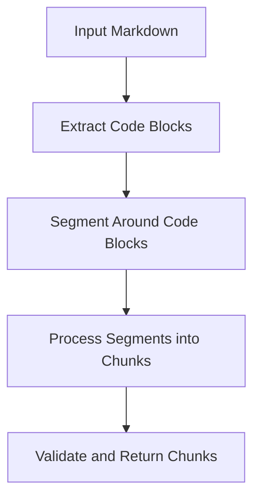
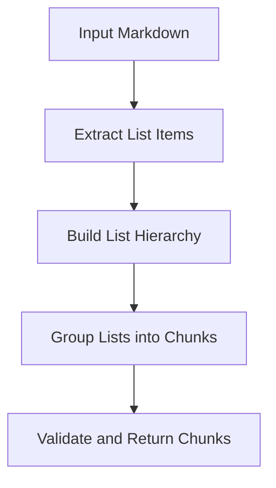
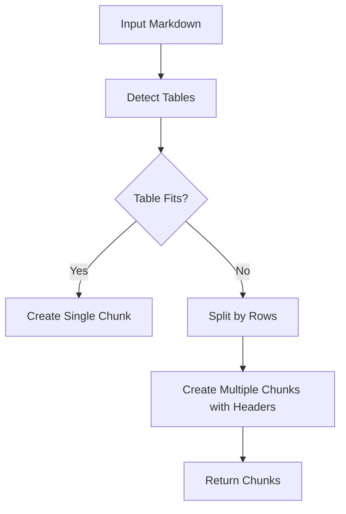
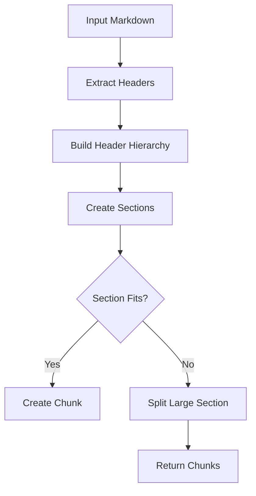
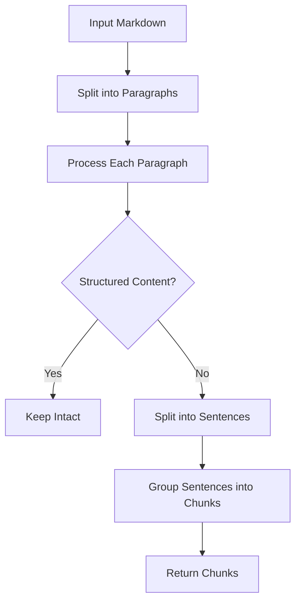
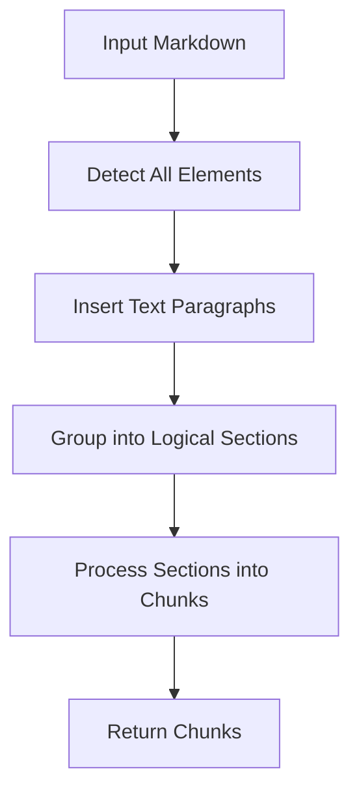
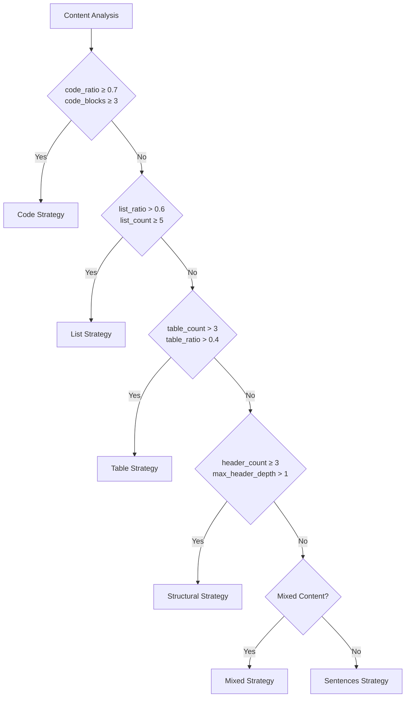
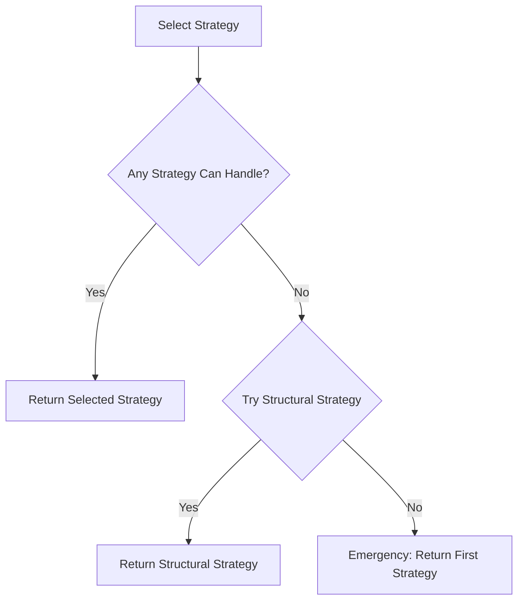

# Chunking Strategies

<cite>
**Referenced Files in This Document**   
- [selector.py](file://markdown_chunker_legacy/chunker/selector.py)
- [base.py](file://markdown_chunker_legacy/chunker/strategies/base.py)
- [code_strategy.py](file://markdown_chunker_legacy/chunker/strategies/code_strategy.py)
- [list_strategy.py](file://markdown_chunker_legacy/chunker/strategies/list_strategy.py)
- [table_strategy.py](file://markdown_chunker_legacy/chunker/strategies/table_strategy.py)
- [structural_strategy.py](file://markdown_chunker_legacy/chunker/strategies/structural_strategy.py)
- [sentences_strategy.py](file://markdown_chunker_legacy/chunker/strategies/sentences_strategy.py)
- [mixed_strategy.py](file://markdown_chunker_legacy/chunker/strategies/mixed_strategy.py)
- [types.py](file://markdown_chunker_legacy/chunker/types.py)
- [types.py](file://markdown_chunker_legacy/parser/types.py)
</cite>

## Table of Contents
1. [Introduction](#introduction)
2. [Code Strategy](#code-strategy)
3. [List Strategy](#list-strategy)
4. [Table Strategy](#table-strategy)
5. [Structural Strategy](#structural-strategy)
6. [Sentences Strategy](#sentences-strategy)
7. [Mixed Strategy](#mixed-strategy)
8. [Strategy Selection](#strategy-selection)
9. [Fallback Mechanism](#fallback-mechanism)
10. [Performance Characteristics](#performance-characteristics)

## Introduction

The Dify Markdown Chunker implements six specialized chunking strategies designed to handle different types of Markdown content. Each strategy is optimized for specific document characteristics and preserves the semantic structure of the content. The system automatically selects the most appropriate strategy based on content analysis metrics, with a priority-based fallback mechanism ensuring reliable processing for any input.

The strategies are:
- **Code Strategy**: For code-heavy documents
- **List Strategy**: For list-heavy documents
- **Table Strategy**: For table-heavy documents  
- **Structural Strategy**: For documents with clear header hierarchy
- **Sentences Strategy**: Universal fallback for any content
- **Mixed Strategy**: For documents with balanced mixed content types

**Section sources**
- [selector.py](file://markdown_chunker_legacy/chunker/selector.py#L1-L466)
- [types.py](file://markdown_chunker_legacy/parser/types.py#L437-L650)

## Code Strategy

The Code Strategy is designed for documents with a high proportion of code content (≥70% code ratio or ≥3 code blocks). It preserves code block atomicity, ensuring that code blocks are never split across chunk boundaries, while maintaining context with surrounding explanatory text.

### Algorithmic Approach
The strategy segments content around code blocks, creating alternating text and code segments. Code segments are always kept atomic, while text segments may be split if they exceed the maximum chunk size. The strategy extracts metadata from code blocks, including programming language, function names, and class names, which are included in the chunk metadata.



**Diagram sources**
- [code_strategy.py](file://markdown_chunker_legacy/chunker/strategies/code_strategy.py#L187-L217)

### Ideal Use Cases
- Technical documentation with extensive code examples
- API references containing code samples
- Tutorial content with code demonstrations
- Source code files with embedded documentation

### Implementation Details
The strategy uses the `FencedBlock` class from the parser to identify code blocks and their metadata. It preserves the complete code block including opening and closing fences. For large text segments between code blocks, it splits at sentence boundaries to maintain readability.

**Section sources**
- [code_strategy.py](file://markdown_chunker_legacy/chunker/strategies/code_strategy.py#L42-L217)
- [types.py](file://markdown_chunker_legacy/parser/types.py#L217-L231)

### Example
**Input:**
```markdown
# API Documentation

The `process()` function handles data:

```python
def process(data):
    return data.upper()
```

This function is thread-safe.
```

**Resulting Chunk Structure:**
- Chunk 1: Header + explanation + code block + note (all together as one chunk)

## List Strategy

The List Strategy handles documents with a high proportion of list content (≥5 lists or ≥60% list content). It preserves list hierarchy and nesting, ensuring parent-child relationships remain intact while grouping related list items together.

### Algorithmic Approach
The strategy first extracts list items and builds a hierarchical structure based on indentation levels. It then groups related list items into chunks, avoiding single-item micro-chunks by grouping multiple items together when possible. When splitting large lists, it duplicates parent items in continuation chunks to maintain context.



**Diagram sources**
- [list_strategy.py](file://markdown_chunker_legacy/chunker/strategies/list_strategy.py#L136-L164)

### Ideal Use Cases
- Feature lists
- Changelogs
- Itemized documentation
- Checklists and task lists
- Configuration options

### Implementation Details
The strategy uses regex patterns to identify different list types (ordered, unordered, task lists) and their nesting levels. It maintains the original formatting of list items, including markers and indentation. For continuation chunks, it includes parent context to preserve the hierarchical relationship.

**Section sources**
- [list_strategy.py](file://markdown_chunker_legacy/chunker/strategies/list_strategy.py#L58-L164)
- [types.py](file://markdown_chunker_legacy/parser/types.py#L288-L310)

### Example
**Input:**
```markdown
# Features

- **Parser Module**
  - AST parsing
  - Code extraction
  
- **Chunker Module**
  - 6 strategies
  - Auto selection
```

**Resulting Chunk Structure:**
- Chunk 1: Header + first main item with sub-items
- Chunk 2: Second main item with sub-items

## Table Strategy

The Table Strategy is designed for documents with a high proportion of table content (≥3 tables or ≥40% table content). It preserves table structure and handles large tables by splitting rows while duplicating headers for readability.

### Algorithmic Approach
The strategy detects tables in the content and processes them as atomic units when they fit within the chunk size limit. For large tables that exceed the size limit, it splits the table by rows, creating multiple chunks with duplicated headers to maintain context and readability.



**Diagram sources**
- [table_strategy.py](file://markdown_chunker_legacy/chunker/strategies/table_strategy.py#L127-L152)

### Ideal Use Cases
- Data documentation
- Comparison tables
- Specification sheets
- Database schema documentation
- Configuration matrices

### Implementation Details
The strategy uses regex patterns to identify table headers, separators, and rows. It calculates the average row size to determine how many rows can fit in each chunk. Each chunk includes the header row and separator to maintain table structure and context.

**Section sources**
- [table_strategy.py](file://markdown_chunker_legacy/chunker/strategies/table_strategy.py#L56-L152)
- [types.py](file://markdown_chunker_legacy/parser/types.py#L321-L334)

### Example
**Input:**
```markdown
# Performance

| Size | Time | Throughput |
|------|------|------------|
| 1KB  | 800ms| 1.3 KB/s   |
| 10KB | 150ms| 66 KB/s    |
```

**Resulting Chunk Structure:**
- Chunk 1: Header + complete table (never split)

## Structural Strategy

The Structural Strategy chunks documents based on header hierarchy, creating semantically meaningful sections while preserving document structure. It is designed for well-structured documents with clear header organization.

### Algorithmic Approach
The strategy identifies headers and builds a hierarchical structure of parent-child relationships. It creates sections based on header boundaries and processes these sections into chunks. For large sections, it uses a block-based packer to split content while preserving atomic elements like code blocks and tables.



**Diagram sources**
- [structural_strategy.py](file://markdown_chunker_legacy/chunker/strategies/structural_strategy.py#L222-L234)

### Ideal Use Cases
- Long-form documentation
- User guides
- Structured articles
- Technical manuals
- API documentation with clear sections

### Implementation Details
The strategy supports both ATX headers (# ## ###) and Setext headers (underlined with = or -). It builds parent-child relationships between headers based on their level and position. Each chunk includes metadata about the header level, text, and path to maintain context.

**Section sources**
- [structural_strategy.py](file://markdown_chunker_legacy/chunker/strategies/structural_strategy.py#L59-L234)
- [types.py](file://markdown_chunker_legacy/parser/types.py#L261-L269)

### Example
**Input:**
```markdown
# Chapter 1

Introduction text.

## Section 1.1

Section content.

## Section 1.2

More content.

# Chapter 2

New chapter.
```

**Resulting Chunk Structure:**
- Chunk 1: Chapter 1 intro
- Chunk 2: Section 1.1
- Chunk 3: Section 1.2
- Chunk 4: Chapter 2

## Sentences Strategy

The Sentences Strategy serves as the universal fallback strategy, capable of handling any type of content by splitting text into sentences and grouping them into appropriately sized chunks.

### Algorithmic Approach
The strategy first splits content into paragraphs, preserving structured elements like headers, lists, and tables as intact units. It then splits regular text paragraphs into sentences using regex patterns and groups sentences into chunks respecting size limits. It preserves paragraph boundaries when possible.



**Diagram sources**
- [sentences_strategy.py](file://markdown_chunker_legacy/chunker/strategies/sentences_strategy.py#L128-L141)

### Ideal Use Cases
- Plain text documents
- Simple content without special structure
- Fallback for unstructured content
- Blog posts and articles
- General text processing

### Implementation Details
The strategy uses multiple regex patterns to identify sentence boundaries, including standard sentence endings, line endings, and quotes. It preserves structured content elements as atomic units and only splits regular text into sentences. This approach maintains the integrity of Markdown elements while providing reliable chunking.

**Section sources**
- [sentences_strategy.py](file://markdown_chunker_legacy/chunker/strategies/sentences_strategy.py#L21-L141)
- [types.py](file://markdown_chunker_legacy/chunker/types.py#L1-L100)

### Example
**Input:**
```markdown
This is a simple document. It has multiple sentences. 
Each sentence is considered for chunking.

This is a new paragraph. It continues the content.
```

**Resulting Chunk Structure:**
- Chunks based on sentence boundaries and size limits

## Mixed Strategy

The Mixed Strategy handles documents with balanced mixed content types, preserving semantic relationships between different elements like code, lists, tables, and text.

### Algorithmic Approach
The strategy detects all content elements (headers, code blocks, lists, tables) and groups them into logical sections based on headers. It then processes these sections into chunks, splitting around indivisible elements like code blocks and tables while balancing chunk sizes adaptively.



**Diagram sources**
- [mixed_strategy.py](file://markdown_chunker_legacy/chunker/strategies/mixed_strategy.py#L172-L184)

### Ideal Use Cases
- General documentation
- README files
- Mixed technical content
- Documentation with various element types
- Content with balanced proportions of different elements

### Implementation Details
The strategy coordinates detection of multiple element types using Stage 1 analysis results when available, with regex-based fallbacks. It treats code blocks, lists, and tables as indivisible elements that should not be split. Text content is used to fill gaps between these atomic elements, creating chunks that preserve semantic relationships.

**Section sources**
- [mixed_strategy.py](file://markdown_chunker_legacy/chunker/strategies/mixed_strategy.py#L75-L184)
- [types.py](file://markdown_chunker_legacy/parser/types.py#L31-L45)

### Example
**Input:**
```markdown
# Overview

This is a description.

## Features

- Feature 1
- Feature 2

```python
example_code()
```
```

**Resulting Chunk Structure:**
- Chunk 1: Overview section
- Chunk 2: Features list + code

## Strategy Selection

The StrategySelector uses content analysis metrics to automatically choose the most appropriate strategy for a given document. It evaluates the content based on several metrics including code ratio, list ratio, table ratio, header structure, and complexity score.

### Content Analysis Metrics
The selection process relies on the following metrics from the ContentAnalysis object:
- **code_ratio**: Percentage of content that is code
- **list_ratio**: Percentage of content in lists  
- **table_ratio**: Percentage of content in tables
- **header_count**: Number of headers by level
- **max_header_depth**: Maximum depth of header hierarchy
- **complexity_score**: Overall document complexity

### Selection Algorithm
The selector uses a priority-based system with quality scoring to determine the best strategy. Strategies are evaluated in priority order, and the first applicable strategy with sufficient quality is selected. The selection follows these rules:



**Diagram sources**
- [selector.py](file://markdown_chunker_legacy/chunker/selector.py#L74-L77)
- [types.py](file://markdown_chunker_legacy/parser/types.py#L437-L650)

The selection process also considers content density rules:
- >50% list elements → prefer list strategy
- >3 tables → prefer table strategy  
- >3 headers with hierarchy → prefer structural strategy

Note that the list strategy is excluded from auto-selection for safety reasons, as it can lose non-list content in mixed documents. It can still be used via explicit strategy override.

**Section sources**
- [selector.py](file://markdown_chunker_legacy/chunker/selector.py#L74-L236)
- [types.py](file://markdown_chunker_legacy/parser/types.py#L437-L650)

## Fallback Mechanism

The system implements a priority-based fallback mechanism to ensure reliable processing when primary strategies cannot handle the content effectively.

### Priority-Based Fallback
When no strategy can handle the content, the system falls back to strategies in order of priority:
1. Structural Strategy (priority 2)
2. Sentences Strategy (priority 6, fallback)

The fallback mechanism is implemented in the StrategySelector's strict selection mode, which first tries strategies by priority and falls back to structural strategy if no safe strategy can handle the content.

### Emergency Fallback
If no strategy can handle the content (which should rarely happen since the Sentences Strategy can handle any content), the system uses an emergency fallback to return the first available strategy.



**Diagram sources**
- [selector.py](file://markdown_chunker_legacy/chunker/selector.py#L130-L149)

The fallback mechanism ensures that the system can process any Markdown document, even if the optimal strategy is not available or cannot handle the specific content structure.

**Section sources**
- [selector.py](file://markdown_chunker_legacy/chunker/selector.py#L130-L149)
- [base.py](file://markdown_chunker_legacy/chunker/strategies/base.py#L46-L127)

## Performance Characteristics

Each strategy has distinct performance characteristics in terms of speed, quality, and suitability for different content types.

### Strategy Comparison

| Strategy | Speed | Quality | Best For | Priority |
|--------|-------|--------|---------|----------|
| Code | Fast | High | Code-heavy documents | 1 |
| Mixed | Medium | High | Balanced mixed content | 3 |
| List | Fast | High | List-heavy documents | 4 |
| Table | Fast | High | Table-heavy documents | 5 |
| Structural | Medium | Very High | Structured documents | 2 |
| Sentences | Very Fast | Medium | Simple text, fallback | 6 |

### Trade-offs
- **Code Strategy**: Fast processing with high quality for code-heavy documents, but may create oversized chunks for large code blocks
- **List Strategy**: Efficient for list processing but excluded from auto-selection due to risk of losing non-list content
- **Table Strategy**: Preserves table integrity but may create multiple chunks for large tables
- **Structural Strategy**: High quality for structured documents but slower due to hierarchical analysis
- **Sentences Strategy**: Fastest processing with universal applicability but lower quality for structured content
- **Mixed Strategy**: Balanced approach for mixed content but more complex processing

The system's automatic strategy selection balances these trade-offs by choosing the most appropriate strategy based on content analysis, ensuring optimal performance and quality for each document type.

**Section sources**
- [selector.py](file://markdown_chunker_legacy/chunker/selector.py#L109-L134)
- [base.py](file://markdown_chunker_legacy/chunker/strategies/base.py#L46-L127)
- [types.py](file://markdown_chunker_legacy/parser/types.py#L437-L650)