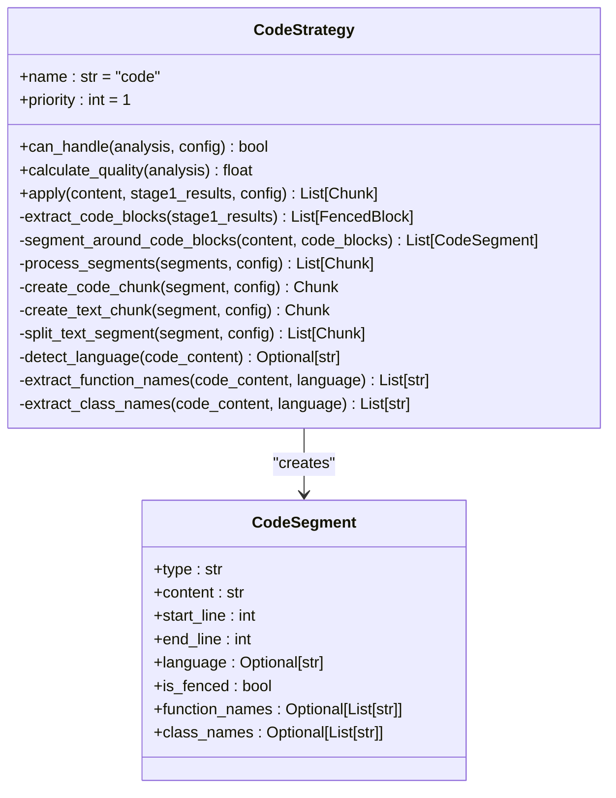
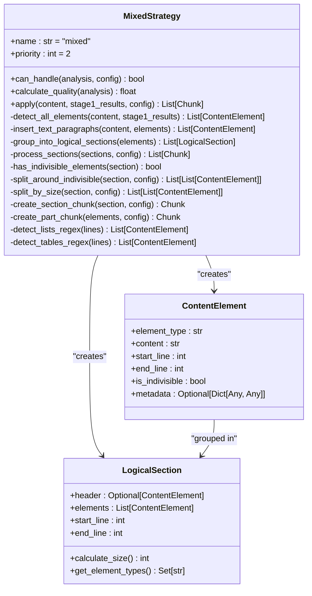
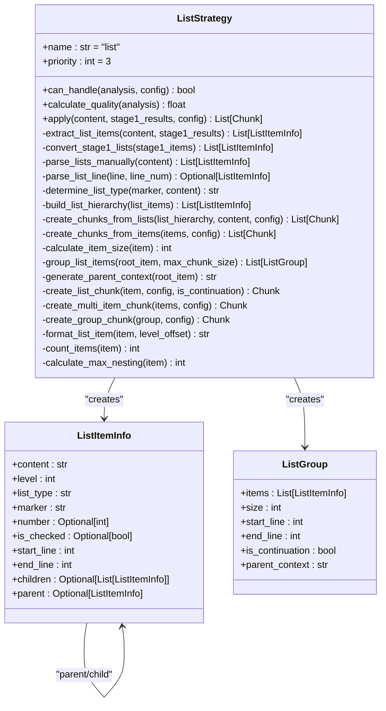
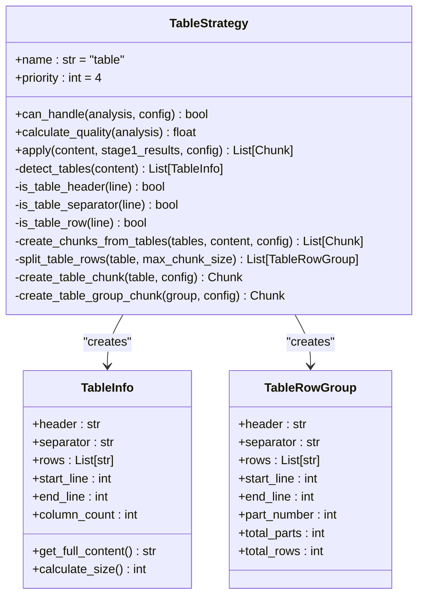
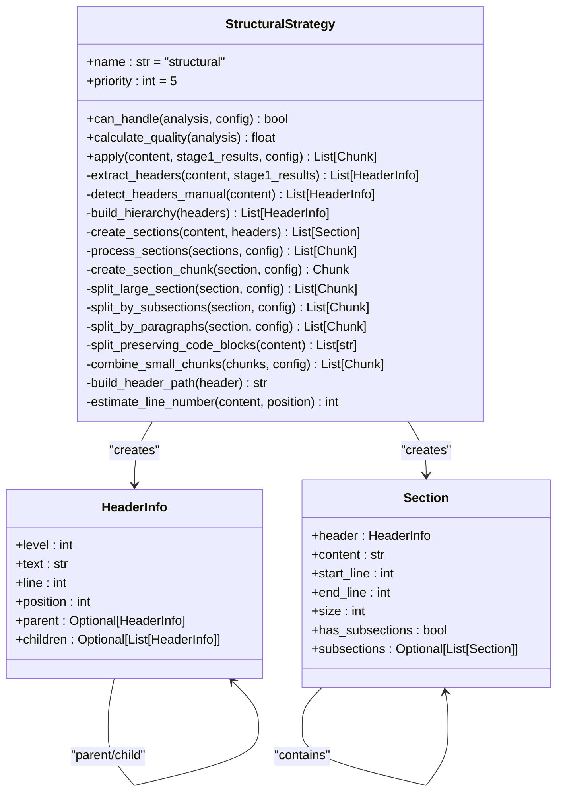
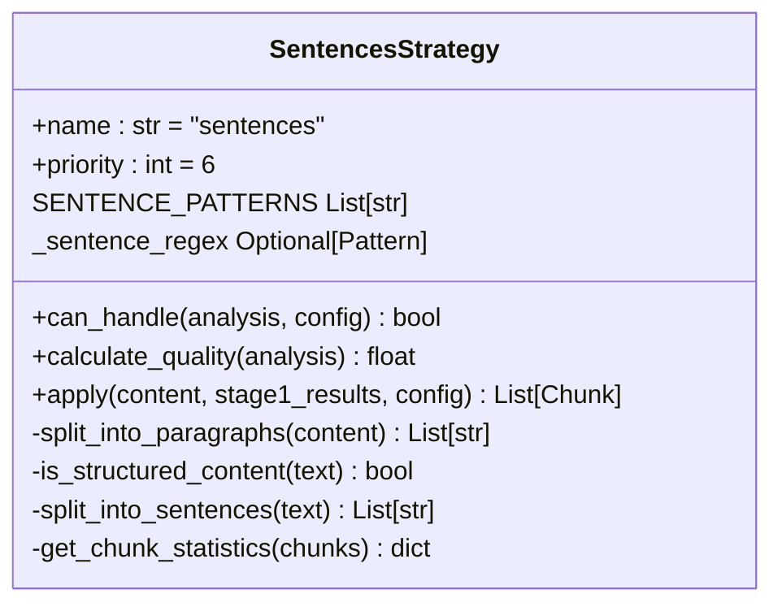

# Chunking Strategies

<cite>
**Referenced Files in This Document**   
- [base.py](file://markdown_chunker/chunker/strategies/base.py)
- [code_strategy.py](file://markdown_chunker/chunker/strategies/code_strategy.py)
- [mixed_strategy.py](file://markdown_chunker/chunker/strategies/mixed_strategy.py)
- [list_strategy.py](file://markdown_chunker/chunker/strategies/list_strategy.py)
- [sentences_strategy.py](file://markdown_chunker/chunker/strategies/sentences_strategy.py)
- [structural_strategy.py](file://markdown_chunker/chunker/strategies/structural_strategy.py)
- [table_strategy.py](file://markdown_chunker/chunker/strategies/table_strategy.py)
- [selector.py](file://markdown_chunker/chunker/selector.py)
</cite>

## Table of Contents
1. [Introduction](#introduction)
2. [Code Strategy](#code-strategy)
3. [Mixed Strategy](#mixed-strategy)
4. [List Strategy](#list-strategy)
5. [Table Strategy](#table-strategy)
6. [Structural Strategy](#structural-strategy)
7. [Sentences Strategy](#sentences-strategy)
8. [Strategy Selection](#strategy-selection)
9. [Common Issues and Mitigations](#common-issues-and-mitigations)
10. [Strategy Selection Guidance](#strategy-selection-guidance)

## Introduction
The Markdown Chunker implements a sophisticated strategy-based system for splitting Markdown documents into meaningful chunks. Each strategy is designed to handle specific document types and content patterns, preserving semantic relationships and context while respecting size constraints. The system uses a priority-based selection mechanism to automatically choose the most appropriate strategy based on content analysis. This document details each chunking strategy, explaining its purpose, implementation logic, ideal use cases, and behavior with concrete examples from the codebase.

**Section sources**
- [base.py](file://markdown_chunker/chunker/strategies/base.py#L1-L380)

## Code Strategy
The Code Strategy specializes in handling documents with large amounts of code, preserving code block atomicity while maintaining context with surrounding text. This strategy is ideal for technical documentation, API references, and tutorials with code examples.

### Purpose and Logic
The Code Strategy identifies code blocks and segments content around them, creating separate chunks for code and associated explanatory text. Code blocks are kept atomic (never split) to preserve their integrity, while large text segments may be split at sentence boundaries. The strategy extracts metadata such as programming language, function names, and class names from code blocks to enhance context.

### Implementation Details
The strategy traverses the AST by first extracting code blocks from the Stage 1 results, then segmenting the content around these blocks. It creates alternating text and code segments, processing each according to its type. Code segments are always kept intact, while text segments are split only if they exceed the maximum chunk size.

### Context Preservation
The strategy preserves context by grouping explanatory text with relevant code blocks. When a code block is surrounded by text, the text is included in the same chunk or adjacent chunks to maintain the relationship between code and explanation.

### Edge Cases
The strategy handles edge cases such as unclosed code fences by attempting to reconstruct the complete code block from the content. It also handles multiple programming languages within a single document by detecting language-specific patterns in the code content.

### Strategy-Specific Parameters
- `code_ratio_threshold`: Minimum ratio of code to total content (default: 0.7)
- `min_code_blocks`: Minimum number of code blocks (default: 3)
- `allow_oversize`: Whether to allow chunks larger than the maximum size for atomic code blocks



**Diagram sources**
- [code_strategy.py](file://markdown_chunker/chunker/strategies/code_strategy.py#L42-L625)

**Section sources**
- [code_strategy.py](file://markdown_chunker/chunker/strategies/code_strategy.py#L1-L625)

## Mixed Strategy
The Mixed Strategy handles documents with multiple content types in significant proportions, preserving semantic relationships between different elements. This strategy is ideal for complex documents with a balanced mix of code, lists, tables, and text.

### Purpose and Logic
The Mixed Strategy detects all content elements (headers, code blocks, lists, tables) and groups them into logical sections based on headers. It processes these sections into chunks, splitting around indivisible elements like code blocks and tables while balancing chunk sizes adaptively.

### Implementation Details
The strategy traverses the AST by detecting all elements and sorting them by position. It inserts text paragraphs between other elements, then groups elements into logical sections based on headers. Sections are processed into chunks, with large sections split around indivisible elements.

### Context Preservation
The strategy preserves context by grouping related elements within logical sections. Elements that belong to the same section (under the same header) are kept together when possible, maintaining the semantic relationship between different content types.

### Edge Cases
The strategy handles edge cases such as missing Stage 1 data by falling back to regex-based detection. It also handles overlapping elements by prioritizing certain element types and ensuring proper ordering.

### Strategy-Specific Parameters
- `min_complexity`: Minimum complexity score for the strategy to handle content
- `max_chunk_size`: Maximum size for each chunk
- `allow_oversize`: Whether to allow oversized chunks for indivisible elements



**Diagram sources**
- [mixed_strategy.py](file://markdown_chunker/chunker/strategies/mixed_strategy.py#L75-L849)

**Section sources**
- [mixed_strategy.py](file://markdown_chunker/chunker/strategies/mixed_strategy.py#L1-L849)

## List Strategy
The List Strategy preserves list hierarchy and handles nested structures, ensuring parent-child relationships remain intact. This strategy is ideal for documents with extensive lists such as checklists, outlines, and specifications.

### Purpose and Logic
The List Strategy extracts list items and builds a hierarchical structure from them. It groups related list items together, duplicating parent items when splitting large lists to maintain context. The strategy handles mixed list types (ordered, unordered, task lists) and maintains numbering for ordered lists.

### Implementation Details
The strategy traverses the AST by extracting list items from the Stage 1 results or parsing them manually. It builds a list hierarchy by establishing parent-child relationships based on indentation levels. The hierarchy is then processed into chunks, with large lists split into groups that fit within size constraints.

### Context Preservation
The strategy preserves context by duplicating parent items in continuation chunks. When a large list is split, each chunk includes the parent item to maintain the hierarchical relationship and provide context for the child items.

### Edge Cases
The strategy handles edge cases such as malformed lists by using regex patterns as a fallback when Stage 1 data is unavailable. It also handles deeply nested lists by calculating the maximum nesting level and preserving the hierarchy.

### Strategy-Specific Parameters
- `list_count_threshold`: Minimum number of lists (default: 5)
- `list_ratio_threshold`: Minimum ratio of list content (default: 0.6)
- `min_chunk_size`: Minimum size for each chunk



**Diagram sources**
- [list_strategy.py](file://markdown_chunker/chunker/strategies/list_strategy.py#L58-L853)

**Section sources**
- [list_strategy.py](file://markdown_chunker/chunker/strategies/list_strategy.py#L1-L853)

## Table Strategy
The Table Strategy preserves table structure and handles large tables by splitting rows while duplicating headers for readability. This strategy is ideal for documents with extensive tabular data such as specifications, API documentation, and data reports.

### Purpose and Logic
The Table Strategy detects markdown tables and processes them into chunks, preserving the table structure and formatting. For large tables, it splits by rows while duplicating headers in each chunk to maintain readability and context.

### Implementation Details
The strategy traverses the AST by detecting tables using regex patterns that match table headers, separators, and rows. It creates chunks from tables, keeping small tables intact and splitting large tables by rows. When splitting, it duplicates the header and separator in each chunk.

### Context Preservation
The strategy preserves context by duplicating table headers in each chunk when a table is split. This ensures that each chunk contains the column names, making the data readable and understandable even when separated from the original table header.

### Edge Cases
The strategy handles edge cases such as tables without headers by still preserving the structure. It also handles wide tables that might exceed chunk size by allowing oversize chunks when necessary.

### Strategy-Specific Parameters
- `table_count_threshold`: Minimum number of tables (default: 3)
- `table_ratio_threshold`: Minimum ratio of table content (default: 0.4)
- `max_chunk_size`: Maximum size for each chunk



**Diagram sources**
- [table_strategy.py](file://markdown_chunker/chunker/strategies/table_strategy.py#L56-L466)

**Section sources**
- [table_strategy.py](file://markdown_chunker/chunker/strategies/table_strategy.py#L1-L466)

## Structural Strategy
The Structural Strategy chunks documents based on header hierarchy, creating semantically meaningful sections while preserving document structure. This strategy is ideal for well-structured documents with clear section organization.

### Purpose and Logic
The Structural Strategy splits content by header boundaries, preserving the header hierarchy in metadata. It combines short sections to meet minimum size requirements and supports multi-level structures (H1-H6). The strategy adds header path information to chunks to maintain context.

### Implementation Details
The strategy traverses the AST by extracting headers from the Stage 1 results or detecting them manually. It builds a header hierarchy by establishing parent-child relationships based on header levels. Sections are created based on header boundaries and processed into chunks, with large sections split by paragraphs or subsections.

### Context Preservation
The strategy preserves context by including header path information in chunk metadata. Each chunk contains the full path from the root header to the current header, allowing reconstruction of the document structure.

### Edge Cases
The strategy handles edge cases such as missing Stage 1 data by falling back to manual header detection. It also handles complex header structures with multiple levels by building a proper hierarchy.

### Strategy-Specific Parameters
- `header_count_threshold`: Minimum number of headers (default: 3)
- `min_chunk_size`: Minimum size for each chunk
- `max_chunk_size`: Maximum size for each chunk



**Diagram sources**
- [structural_strategy.py](file://markdown_chunker/chunker/strategies/structural_strategy.py#L55-L1381)

**Section sources**
- [structural_strategy.py](file://markdown_chunker/chunker/strategies/structural_strategy.py#L1-L1381)

## Sentences Strategy
The Sentences Strategy provides a reliable fallback for any type of content by splitting text into sentences and grouping them into appropriately sized chunks. This strategy is ideal for simple text documents and as a universal fallback.

### Purpose and Logic
The Sentences Strategy splits content into sentences using regex patterns and groups them into chunks respecting size limits. It preserves paragraph boundaries when possible and provides reliable, predictable chunking for any content type.

### Implementation Details
The strategy traverses the AST by first splitting content into paragraphs, then splitting each paragraph into sentences. Sentences are grouped into chunks, with the grouping respecting the maximum chunk size. The strategy preserves structured content (headers, lists, tables) intact when possible.

### Context Preservation
The strategy preserves context by keeping structured content intact and grouping related sentences together. It also preserves paragraph boundaries to maintain the flow of the text.

### Edge Cases
The strategy handles edge cases such as sentences with abbreviations by using sophisticated regex patterns. It also handles structured content by detecting and preserving it.

### Strategy-Specific Parameters
- `max_chunk_size`: Maximum size for each chunk
- `min_chunk_size`: Minimum size for each chunk
- `allow_oversize`: Whether to allow oversized chunks



**Diagram sources**
- [sentences_strategy.py](file://markdown_chunker/chunker/strategies/sentences_strategy.py#L21-L526)

**Section sources**
- [sentences_strategy.py](file://markdown_chunker/chunker/strategies/sentences_strategy.py#L1-L526)

## Strategy Selection
The Strategy Selector evaluates and scores each strategy based on content analysis to determine the optimal strategy for a given document. The selection process uses a combination of priority and quality scoring.

### Selection Process
The selector first checks if a strategy can handle the content based on thresholds (e.g., code ratio, list count). Then it calculates a quality score based on how well-suited the strategy is for the content. The final score combines priority and quality, with higher priority strategies receiving higher weights.

### Scoring Mechanism
Each strategy calculates its quality score based on factors specific to its domain. For example, the Code Strategy gives higher scores for higher code ratios and more code blocks, while the List Strategy scores higher for more lists and higher list ratios.

### Selection Modes
The selector supports two modes:
- **Strict mode**: Selects the first applicable strategy by priority
- **Weighted mode**: Selects the strategy with the highest combined priority and quality score

```mermaid
sequenceDiagram
participant Selector as StrategySelector
participant Analysis as ContentAnalysis
participant Config as ChunkConfig
participant Strategy as BaseStrategy
Selector->>Selector : select_strategy(analysis, config)
alt Strict Mode
loop For each strategy by priority
Strategy->>Strategy : can_handle(analysis, config)
alt Can handle
Selector-->>Selector : Return strategy
break
end
end
else Weighted Mode
loop For each strategy
Strategy->>Strategy : get_metrics(analysis, config)
Strategy-->>Selector : StrategyMetrics
end
Selector->>Selector : Find strategy with highest final_score
Selector-->>Selector : Return best strategy
end
```

**Diagram sources**
- [selector.py](file://markdown_chunker/chunker/selector.py#L23-L322)

**Section sources**
- [selector.py](file://markdown_chunker/chunker/selector.py#L1-L322)

## Common Issues and Mitigations
### Over-chunking
Over-chunking occurs when documents are split into too many small chunks, breaking semantic relationships. Each strategy mitigates this by:
- **Code Strategy**: Grouping related text with code blocks
- **Mixed Strategy**: Combining small adjacent chunks
- **List Strategy**: Grouping multiple root items together
- **Table Strategy**: Keeping small tables intact
- **Structural Strategy**: Combining small sections
- **Sentences Strategy**: Grouping multiple sentences

### Context Loss
Context loss happens when chunks are separated from their surrounding context. Mitigations include:
- **Code Strategy**: Preserving code block atomicity
- **List Strategy**: Duplicating parent items in continuation chunks
- **Table Strategy**: Duplicating headers in split table chunks
- **Structural Strategy**: Adding header path information to chunks

### Edge Case Handling
All strategies include fallback mechanisms for edge cases:
- Using regex patterns when Stage 1 data is unavailable
- Handling malformed content gracefully
- Preserving atomic elements (code blocks, tables) intact
- Validating and fixing chunks after creation

## Strategy Selection Guidance
### When to Force a Specific Strategy
Force a specific strategy when:
- The document has a known structure that matches a particular strategy
- Testing or debugging specific chunking behavior
- The automatic selection is not producing optimal results for a particular use case

### When to Allow Automatic Selection
Allow automatic selection when:
- Processing diverse document types
- The optimal strategy is unclear
- Maximizing adaptability to different content patterns
- Leveraging the system's content analysis capabilities

The automatic selection system is designed to choose the most appropriate strategy based on comprehensive content analysis, making it suitable for most use cases. Forcing a specific strategy should be done only when there's a clear benefit to overriding the automatic selection.