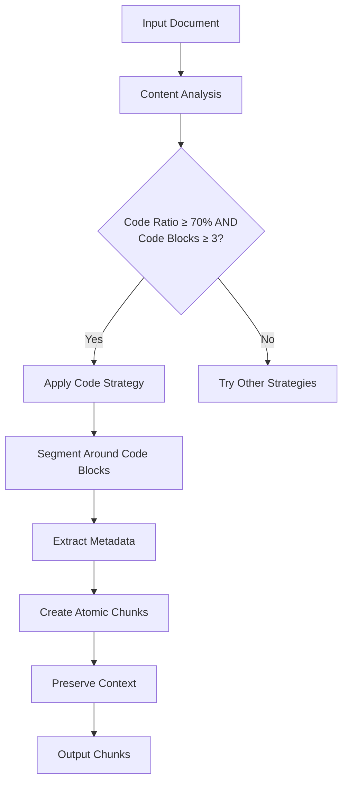
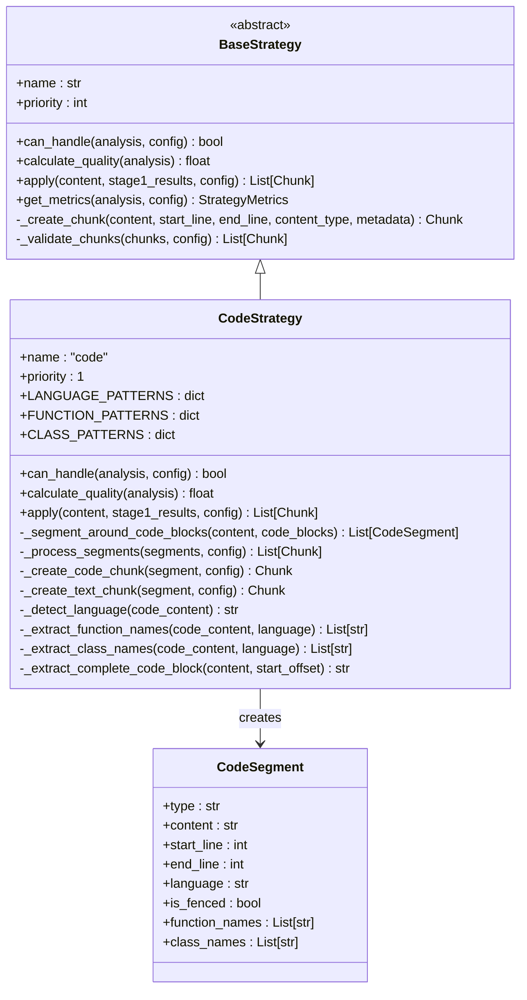
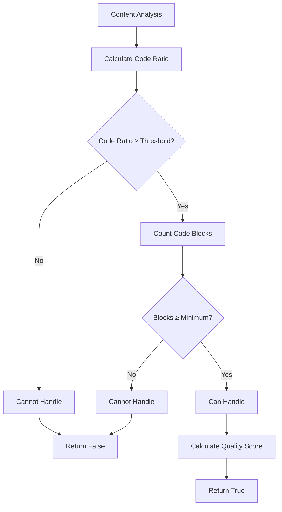
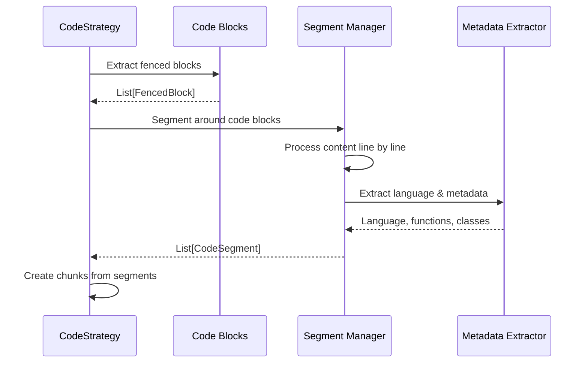
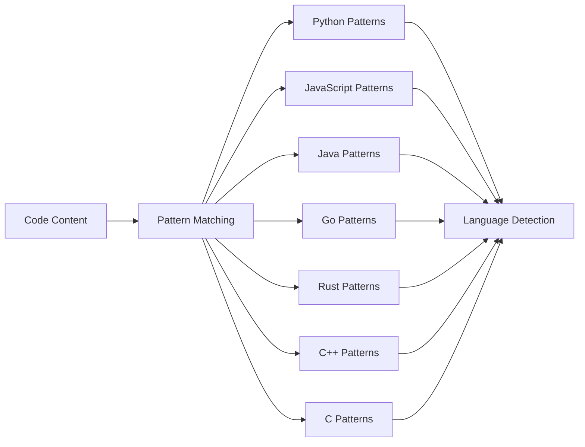
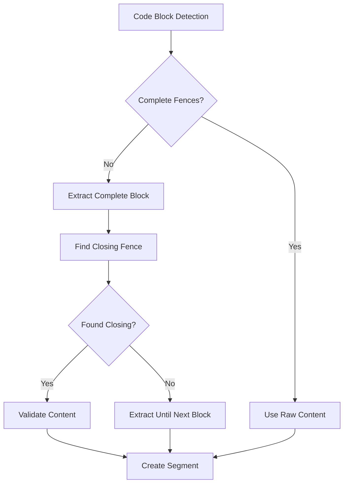
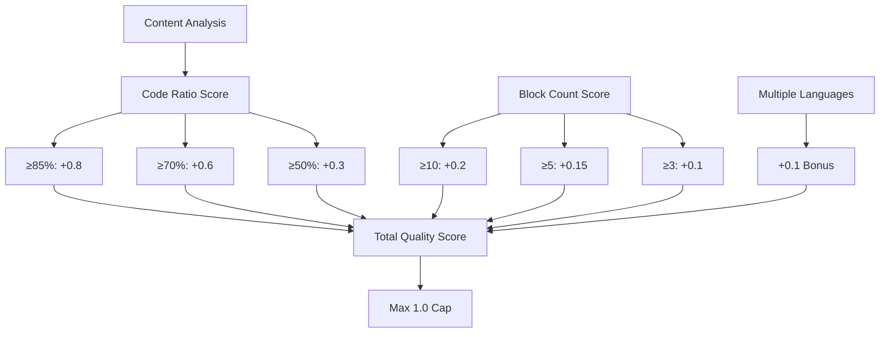
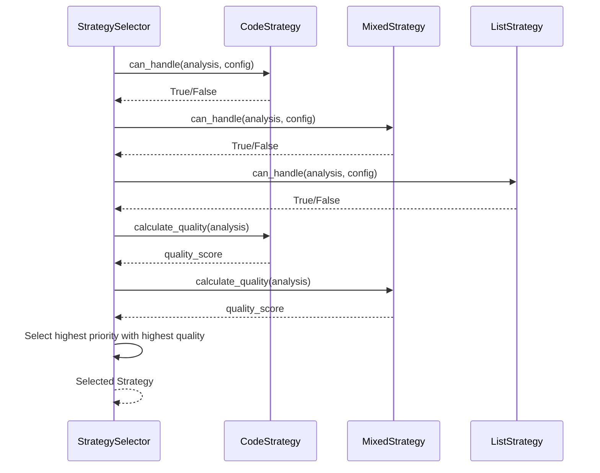

# Code Strategy

<cite>
**Referenced Files in This Document**
- [code_strategy.py](file://markdown_chunker/chunker/strategies/code_strategy.py)
- [base.py](file://markdown_chunker/chunker/strategies/base.py)
- [selector.py](file://markdown_chunker/chunker/selector.py)
- [types.py](file://markdown_chunker/chunker/types.py)
- [test_code_strategy.py](file://tests/chunker/test_code_strategy.py)
- [test_code_strategy_properties.py](file://tests/chunker/test_code_strategy_properties.py)
- [code_heavy.md](file://tests/fixtures/code_heavy.md)
- [edge_cases.md](file://tests/fixtures/edge_cases.md)
- [basic_usage.py](file://examples/basic_usage.py)
</cite>

## Table of Contents
1. [Introduction](#introduction)
2. [Strategy Purpose and Design](#strategy-purpose-and-design)
3. [Core Implementation](#core-implementation)
4. [Content Analysis and Selection Criteria](#content-analysis-and-selection-criteria)
5. [Code Segmentation Logic](#code-segmentation-logic)
6. [Metadata Extraction](#metadata-extraction)
7. [Edge Case Handling](#edge-case-handling)
8. [Quality Scoring System](#quality-scoring-system)
9. [Strategy Selection Process](#strategy-selection-process)
10. [Common Issues and Mitigation](#common-issues-and-mitigation)
11. [Usage Guidelines](#usage-guidelines)
12. [Performance Considerations](#performance-considerations)
13. [Best Practices](#best-practices)

## Introduction

The Code Strategy is a specialized chunking strategy designed for documents containing substantial amounts of code (≥70% code content, ≥3 code blocks). It excels at preserving code block atomicity while maintaining contextual relationships between code and explanatory text, making it ideal for technical documentation, API references, and programming tutorials.

Unlike other strategies that may split code across multiple chunks, the Code Strategy ensures that entire code blocks remain intact, preserving syntax, structure, and semantic meaning. This approach is particularly valuable for Retrieval-Augmented Generation (RAG) systems and AI applications that rely on complete code examples for accurate understanding and response generation.

## Strategy Purpose and Design

### Primary Objectives

The Code Strategy serves several critical purposes in the chunking ecosystem:

1. **Code Block Atomicity**: Never split code blocks across chunks, ensuring complete code examples remain functional
2. **Context Preservation**: Maintain relationships between code and surrounding explanatory text
3. **Language Intelligence**: Detect and extract programming language information for enhanced processing
4. **Function/Class Recognition**: Identify and tag code elements like functions and classes for semantic understanding
5. **Oversize Handling**: Gracefully manage large code blocks that exceed standard chunk size limits

### Design Philosophy

The strategy operates on the principle that code is fundamentally different from prose text. Code blocks represent discrete, self-contained units of functionality that lose meaning when fragmented. By treating code blocks as atomic elements, the strategy ensures that downstream applications receive complete, usable code examples.



**Diagram sources**
- [code_strategy.py](file://markdown_chunker/chunker/strategies/code_strategy.py#L109-L134)
- [selector.py](file://markdown_chunker/chunker/selector.py#L87-L98)

## Core Implementation

### Strategy Architecture

The Code Strategy inherits from the BaseStrategy class and implements the core chunking logic through several key components:



**Diagram sources**
- [code_strategy.py](file://markdown_chunker/chunker/strategies/code_strategy.py#L22-L40)
- [base.py](file://markdown_chunker/chunker/strategies/base.py#L16-L38)

### Strategy Properties

The Code Strategy implements several key properties that define its behavior:

- **Priority**: 1 (highest priority) - Ensures it's considered first when applicable
- **Name**: "code" - Identifies the strategy in logs and analytics
- **Thresholds**: Configurable via ChunkConfig parameters
  - `code_ratio_threshold`: Default 0.7 (70% code content required)
  - `min_code_blocks`: Default 3 (minimum code blocks required)

**Section sources**
- [code_strategy.py](file://markdown_chunker/chunker/strategies/code_strategy.py#L42-L54)
- [types.py](file://markdown_chunker/chunker/types.py#L584-L587)

## Content Analysis and Selection Criteria

### Selection Logic

The Code Strategy determines applicability through a two-part evaluation process:

1. **Code Ratio Analysis**: Measures the proportion of content that consists of code blocks
2. **Block Count Evaluation**: Counts the number of distinct code blocks in the document



**Diagram sources**
- [code_strategy.py](file://markdown_chunker/chunker/strategies/code_strategy.py#L109-L134)

### Threshold Configuration

The strategy uses configurable thresholds to balance sensitivity and specificity:

| Parameter | Default Value | Purpose | Impact |
|-----------|---------------|---------|---------|
| `code_ratio_threshold` | 0.7 (70%) | Minimum code content percentage | Lower values increase sensitivity |
| `min_code_blocks` | 3 | Minimum code blocks required | Fewer blocks may trigger strategy |
| `min_complexity` | 0.3 | Additional complexity requirement | Combined with code metrics |

**Section sources**
- [code_strategy.py](file://markdown_chunker/chunker/strategies/code_strategy.py#L109-L134)
- [types.py](file://markdown_chunker/chunker/types.py#L584-L587)

## Code Segmentation Logic

### Segment Creation Process

The strategy segments content into alternating text and code blocks, creating CodeSegment objects that encapsulate both content type and metadata:



**Diagram sources**
- [code_strategy.py](file://markdown_chunker/chunker/strategies/code_strategy.py#L211-L324)

### Segment Types and Properties

Each CodeSegment contains essential information for proper chunking:

- **Type**: "code" or "text" indicating content nature
- **Content**: The actual text content
- **Position**: Start and end line numbers for reference
- **Language**: Detected programming language
- **Atomic Properties**: Function and class names for semantic understanding
- **Fencing**: Boolean indicating presence of code fences

**Section sources**
- [code_strategy.py](file://markdown_chunker/chunker/strategies/code_strategy.py#L22-L40)

## Metadata Extraction

### Language Detection

The strategy employs sophisticated language detection using pattern matching:



**Diagram sources**
- [code_strategy.py](file://markdown_chunker/chunker/strategies/code_strategy.py#L56-L75)

### Pattern-Based Extraction

The strategy uses regular expressions to identify code elements:

| Element Type | Languages | Pattern Examples |
|--------------|-----------|------------------|
| Functions | All | `\bdef\s+\w+`, `\bfunction\s+\w+`, `\bfn\s+\w+` |
| Classes | All | `\bclass\s+\w+`, `\bstruct\s+\w+` |
| Imports | Python/JS | `\bimport\s+\w+`, `\bfrom\s+\w+` |

**Section sources**
- [code_strategy.py](file://markdown_chunker/chunker/strategies/code_strategy.py#L77-L97)

## Edge Case Handling

### Unclosed Fence Management

The strategy includes robust handling for malformed or unclosed code blocks:



**Diagram sources**
- [code_strategy.py](file://markdown_chunker/chunker/strategies/code_strategy.py#L260-L366)

### Malformed Content Recovery

The strategy implements several recovery mechanisms:

1. **Incomplete Code Blocks**: Attempts to extract complete blocks from partial content
2. **Nested Fences**: Properly handles nested code blocks with varying indentation
3. **Mixed Content**: Manages documents with embedded code in various contexts
4. **Empty Blocks**: Gracefully handles empty or minimal code blocks

**Section sources**
- [code_strategy.py](file://markdown_chunker/chunker/strategies/code_strategy.py#L260-L366)

## Quality Scoring System

### Scoring Algorithm

The Code Strategy calculates quality scores based on multiple factors:



**Diagram sources**
- [code_strategy.py](file://markdown_chunker/chunker/strategies/code_strategy.py#L136-L185)

### Quality Factors

The scoring system considers:

1. **Code Density**: Higher code ratios receive better scores
2. **Block Diversity**: More code blocks improve quality
3. **Language Variety**: Multiple programming languages enhance score
4. **Content Balance**: Well-distributed code and text improves fit

**Section sources**
- [code_strategy.py](file://markdown_chunker/chunker/strategies/code_strategy.py#L136-L185)

## Strategy Selection Process

### Automatic Selection

The StrategySelector evaluates the Code Strategy alongside others using priority and quality:



**Diagram sources**
- [selector.py](file://markdown_chunker/chunker/selector.py#L87-L98)
- [code_strategy.py](file://markdown_chunker/chunker/strategies/code_strategy.py#L136-L185)

### Manual Override Capability

While the Code Strategy operates automatically, manual override is possible through the chunker interface:

**Section sources**
- [selector.py](file://markdown_chunker/chunker/selector.py#L87-L98)
- [basic_usage.py](file://examples/basic_usage.py#L160-L166)

## Common Issues and Mitigation

### Over-Chunking Prevention

The strategy prevents over-chunking through several mechanisms:

1. **Atomic Code Blocks**: Entire code blocks remain together
2. **Oversize Chunking**: Large blocks are allowed to exceed limits when necessary
3. **Context Preservation**: Text segments maintain logical grouping

### Configuration Tuning

Common configuration adjustments for optimal performance:

| Scenario | Recommended Settings | Rationale |
|----------|---------------------|-----------|
| API Documentation | `code_ratio_threshold=0.5`, `min_code_blocks=2` | More sensitive detection |
| Tutorial Documents | `code_ratio_threshold=0.7`, `min_code_blocks=3` | Conservative approach |
| Mixed Content | `code_ratio_threshold=0.4`, `min_code_blocks=1` | Flexible handling |

**Section sources**
- [types.py](file://markdown_chunker/chunker/types.py#L584-L587)

## Usage Guidelines

### When to Force the Strategy

Force the Code Strategy when:

1. **Document Type**: Technical documentation, API references, tutorials
2. **Content Characteristics**: High code density (>70%), multiple code examples
3. **Use Case Requirements**: Need for complete, atomic code examples
4. **Quality Needs**: Importance of code block integrity over chunk count

### Configuration Recommendations

For optimal results:

```python
# For code-heavy documentation
config = ChunkConfig.for_code_heavy()

# For API documentation
config = ChunkConfig(
    code_ratio_threshold=0.5,
    min_code_blocks=2,
    max_chunk_size=6144
)

# For mixed content with code
config = ChunkConfig(
    code_ratio_threshold=0.3,
    min_code_blocks=1
)
```

**Section sources**
- [types.py](file://markdown_chunker/chunker/types.py#L694-L738)
- [basic_usage.py](file://examples/basic_usage.py#L204-L207)

## Performance Considerations

### Processing Efficiency

The Code Strategy balances thoroughness with performance:

1. **Pattern Matching**: Uses efficient regular expressions for language detection
2. **Lazy Evaluation**: Processes content incrementally
3. **Memory Management**: Handles large documents without excessive memory usage
4. **Caching**: Reuses language detection results when possible

### Scalability Factors

Performance scales with:

- **Document Size**: Linear with content length
- **Code Block Count**: Proportional to number of code blocks
- **Language Diversity**: Minimal impact on performance
- **Complexity**: Higher complexity increases processing time slightly

## Best Practices

### Document Preparation

To maximize Code Strategy effectiveness:

1. **Consistent Formatting**: Use standard code fencing (` ``` `)
2. **Clear Separation**: Separate code blocks from explanatory text
3. **Language Specification**: Include language identifiers in code fences
4. **Logical Grouping**: Group related code examples together

### Configuration Optimization

Optimal configuration depends on:

1. **Content Nature**: Different types of technical content require different settings
2. **Use Case**: RAG systems may need different thresholds than simple chunking
3. **Performance Requirements**: Balance quality with processing speed
4. **Output Constraints**: Consider downstream application requirements

### Monitoring and Validation

Key metrics to monitor:

- **Code Block Coverage**: Percentage of code blocks successfully processed
- **Chunk Size Distribution**: Ensure reasonable chunk sizes
- **Metadata Accuracy**: Verify language and element detection
- **Processing Time**: Monitor for performance regressions

**Section sources**
- [test_code_strategy_properties.py](file://tests/chunker/test_code_strategy_properties.py#L93-L382)