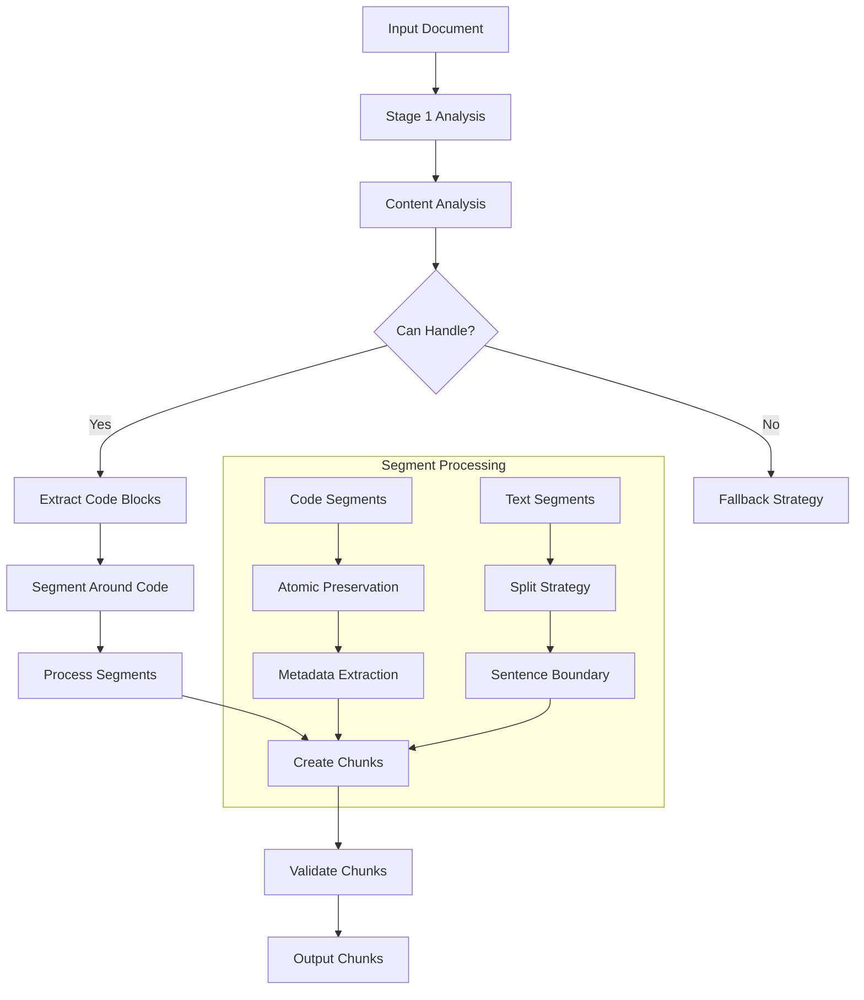
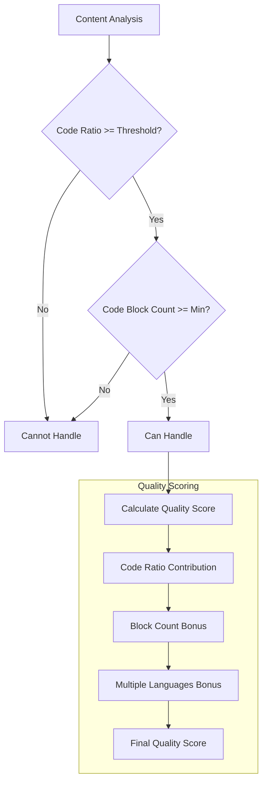
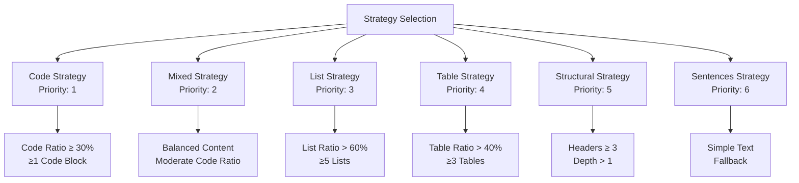
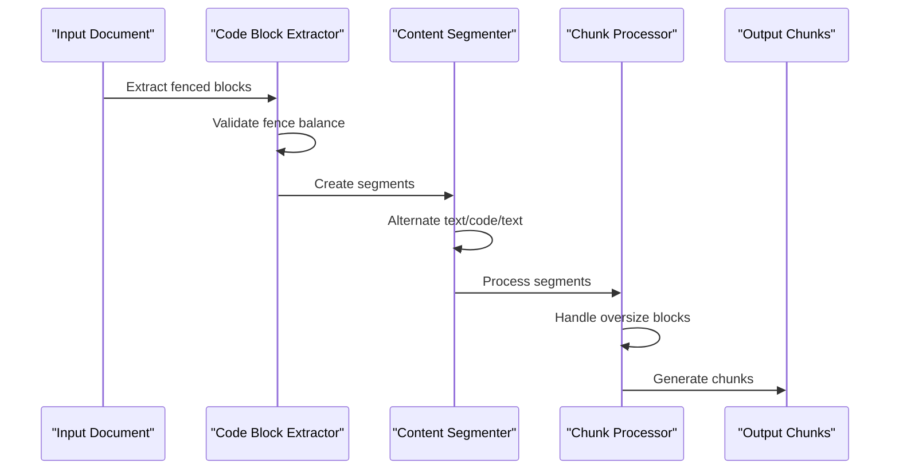
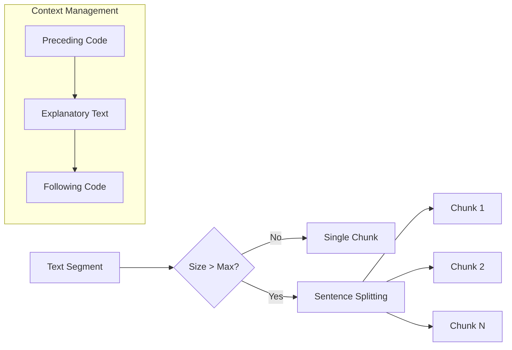

# Code Strategy

<cite>
**Referenced Files in This Document**
- [code_strategy.py](file://markdown_chunker_legacy/chunker/strategies/code_strategy.py)
- [test_code_strategy.py](file://tests/chunker/test_strategies/test_code_strategy.py)
- [test_code_strategy_properties.py](file://tests/chunker/test_code_strategy_properties.py)
- [types.py](file://markdown_chunker_legacy/chunker/types.py)
- [quickstart.md](file://tests/fixtures/corpus/code_heavy/quickstart.md)
- [usage.md](file://tests/fixtures/corpus/code_heavy/usage.md)
- [strategies.md](file://docs/architecture/strategies.md)
- [algorithms-ru.md](file://docs/reference/algorithms-ru.md)
</cite>

## Table of Contents
1. [Introduction](#introduction)
2. [Core Algorithm](#core-algorithm)
3. [Activation Criteria](#activation-criteria)
4. [Priority-Based Selection](#priority-based-selection)
5. [Code Block Preservation](#code-block-preservation)
6. [Language Detection and Metadata Extraction](#language-detection-and-metadata-extraction)
7. [Text Segmentation Strategy](#text-segmentation-strategy)
8. [Oversize Handling](#oversize-handling)
9. [Configuration Options](#configuration-options)
10. [Performance Considerations](#performance-considerations)
11. [Common Issues and Solutions](#common-issues-and-solutions)
12. [Test Suite Examples](#test-suite-examples)
13. [Integration Patterns](#integration-patterns)

## Introduction

The Code Strategy is a specialized chunking strategy designed for documents containing substantial amounts of code. It prioritizes code block atomicity while maintaining contextual relationships between code and explanatory text. This strategy operates with the highest priority (1) and activates when content meets specific code ratio and block count thresholds.

The strategy's primary goal is to preserve the semantic integrity of code blocks while ensuring that surrounding explanatory text remains accessible and contextually relevant. It achieves this through sophisticated segmentation algorithms that respect code boundaries while allowing flexible text processing.

## Core Algorithm

The Code Strategy implements a multi-stage algorithm that processes markdown documents containing significant code content:



**Diagram sources**
- [code_strategy.py](file://markdown_chunker_legacy/chunker/strategies/code_strategy.py#L187-L218)

The algorithm begins by analyzing the document's content composition to determine if the Code Strategy is appropriate. If activated, it extracts all code blocks from the Stage 1 results and segments the content around these blocks into alternating text-code-text sequences.

**Section sources**
- [code_strategy.py](file://markdown_chunker_legacy/chunker/strategies/code_strategy.py#L187-L218)

## Activation Criteria

The Code Strategy activates based on two primary criteria defined by configurable thresholds:

### CODE_RATIO_THRESHOLD

The code ratio threshold determines the minimum percentage of content that must be code for the strategy to activate. By default, this threshold is set to 0.3 (30%), but can be customized through the `code_ratio_threshold` parameter in `ChunkConfig`.

### MIN_CODE_BLOCKS

The minimum number of code blocks required for strategy activation. The default is 1, but can be increased to ensure the strategy only activates for documents with substantial code content.



**Diagram sources**
- [code_strategy.py](file://markdown_chunker_legacy/chunker/strategies/code_strategy.py#L109-L134)
- [code_strategy.py](file://markdown_chunker_legacy/chunker/strategies/code_strategy.py#L136-L185)

The strategy calculates a quality score ranging from 0.0 to 1.0, with higher scores indicating better fit for code-heavy content. The scoring algorithm considers:

- **Code Ratio Contribution**: 0.8 for ≥85%, 0.6 for ≥70%, 0.3 for ≥50%
- **Code Block Count Bonus**: 0.2 for ≥10 blocks, 0.15 for ≥5 blocks, 0.1 for ≥3 blocks
- **Multiple Languages Bonus**: +0.1 for documents containing multiple programming languages

**Section sources**
- [code_strategy.py](file://markdown_chunker_legacy/chunker/strategies/code_strategy.py#L136-L185)

## Priority-Based Selection

The Code Strategy operates with the highest priority (1) among all available chunking strategies. This priority ensures that code-heavy documents receive the most appropriate treatment, taking precedence over other strategies that might be better suited for different content types.



**Diagram sources**
- [strategies.md](file://docs/architecture/strategies.md#L1-L71)

**Section sources**
- [code_strategy.py](file://markdown_chunker_legacy/chunker/strategies/code_strategy.py#L104-L107)

## Code Block Preservation

The Code Strategy implements sophisticated mechanisms to preserve code block atomicity while maintaining contextual relationships with surrounding text.

### Atomic Preservation

Code blocks are never split across chunks. Each code block is treated as an indivisible unit, ensuring that functions, classes, and entire code examples remain intact during the chunking process.

### Fence Preservation

The strategy ensures that code block fences (` ``` `) are preserved in their entirety. This includes both opening and closing fences, maintaining the visual and structural integrity of the code blocks.

### Nested Code Block Handling

The strategy handles nested code blocks appropriately, ensuring that inner code blocks are properly segmented and that parent-child relationships are maintained. This prevents phantom blocks and ensures accurate representation of nested structures.



**Diagram sources**
- [code_strategy.py](file://markdown_chunker_legacy/chunker/strategies/code_strategy.py#L234-L324)

**Section sources**
- [code_strategy.py](file://markdown_chunker_legacy/chunker/strategies/code_strategy.py#L234-L324)

## Language Detection and Metadata Extraction

The Code Strategy includes comprehensive language detection and metadata extraction capabilities:

### Supported Languages

The strategy supports detection and processing of multiple programming languages:

| Language | Detection Patterns | Function Extraction | Class Extraction |
|----------|-------------------|-------------------|------------------|
| Python | `def\s+\w+`, `class\s+\w+`, `import\s+\w+` | `def\s+(\w+)\s*\(` | `class\s+(\w+)` |
| JavaScript | `function\s+\w+`, `const\s+\w+`, `let\s+\w+` | `function\s+(\w+)\s*\(` | `class\s+(\w+)` |
| Java | `public\s+class`, `private\s+\w+`, `public\s+static` | `(?:public\|private\|protected)?\s*(?:static)?\s*\w+\s+(\w+)\s*\(` | `(?:public\|private)?\s*class\s+(\w+)` |
| Go | `func\s+\w+`, `package\s+\w+`, `type\s+\w+` | `func\s+(\w+)\s*\(` | `type\s+(\w+)\s+struct` |
| Rust | `fn\s+\w+`, `struct\s+\w+`, `impl\s+\w+` | `fn\s+(\w+)\s*\(` | `struct\s+(\w+)` |
| C++ | `class\s+\w+`, `struct\s+\w+`, `#include` | `(?:inline\s+)?\w+\s+(\w+)\s*\(` | `class\s+(\w+)` |
| C | `#include`, `struct\s+\w+`, `int\s+main` | `\b\w+\s+(\w+)\s*\(` | `struct\s+(\w+)` |

### Metadata Enrichment

Each code chunk receives comprehensive metadata including:

- **Language identification**: Automatically detected or inferred from code patterns
- **Function names**: Extracted using language-specific regular expressions
- **Class names**: Identified for object-oriented languages
- **Fencing information**: Preservation of code block delimiters
- **Line numbering**: Accurate start and end line positions

**Section sources**
- [code_strategy.py](file://markdown_chunker_legacy/chunker/strategies/code_strategy.py#L56-L97)
- [code_strategy.py](file://markdown_chunker_legacy/chunker/strategies/code_strategy.py#L532-L589)

## Text Segmentation Strategy

For text segments that precede, follow, or lie between code blocks, the Code Strategy employs sophisticated segmentation techniques:

### Sentence-Based Splitting

Large text segments exceeding the maximum chunk size are split using sentence boundaries. The strategy uses simple regex-based sentence detection to maintain readability and semantic coherence.

### Context Preservation

Text segments are carefully crafted to maintain contextual relationships with adjacent code blocks. This ensures that explanatory text remains closely associated with the code it describes.



**Diagram sources**
- [code_strategy.py](file://markdown_chunker_legacy/chunker/strategies/code_strategy.py#L462-L529)

**Section sources**
- [code_strategy.py](file://markdown_chunker_legacy/chunker/strategies/code_strategy.py#L462-L529)

## Oversize Handling

The Code Strategy implements intelligent oversize handling for large code blocks that exceed the configured maximum chunk size:

### Oversize Indicators

When a code block exceeds the maximum chunk size, the strategy marks it as oversize and creates a dedicated chunk for it. This approach ensures that large code blocks are not artificially fragmented while still being included in the chunking process.

### Metadata for Oversize Blocks

Oversize chunks receive special metadata indicating their exceptional nature:

- **allow_oversize**: Boolean flag marking the chunk as oversized
- **oversize_reason**: Explanation ("code_block_atomicity")
- **size validation**: Verification that the chunk exceeds the configured limit

### Strategy Flexibility

The oversize mechanism allows the strategy to handle documents with varying code block sizes while maintaining the principle of code block atomicity.

**Section sources**
- [code_strategy.py](file://markdown_chunker_legacy/chunker/strategies/code_strategy.py#L428-L440)

## Configuration Options

The Code Strategy supports extensive configuration through the `ChunkConfig` class:

### Factory Methods

The library provides specialized factory methods for common use cases:

```python
# For code documentation
config = ChunkConfig.for_code_docs()

# For API documentation
config = ChunkConfig.for_api_docs()

# For RAG systems
config = ChunkConfig.for_dify_rag()

# For search indexing
config = ChunkConfig.for_search_indexing()
```

### Custom Configuration

Users can customize individual parameters:

| Parameter | Default | Description |
|-----------|---------|-------------|
| `max_chunk_size` | 4096 | Maximum size for standard chunks |
| `min_chunk_size` | 512 | Minimum size for chunks |
| `target_chunk_size` | 2048 | Target chunk size |
| `code_ratio_threshold` | 0.3 | Minimum code ratio for activation |
| `min_code_blocks` | 1 | Minimum code blocks for activation |
| `allow_oversize` | True | Enable oversized code block handling |
| `force_strategy` | None | Force specific strategy usage |

### Strategy-Specific Settings

The Code Strategy honors global configuration while maintaining its own specialized parameters for optimal code-heavy document processing.

**Section sources**
- [types.py](file://markdown_chunker_legacy/chunker/types.py#L1-L200)
- [strategies.md](file://docs/architecture/strategies.md#L52-L57)

## Performance Considerations

The Code Strategy is designed with performance optimization in mind, particularly for large code files and documents with numerous code blocks.

### Memory Efficiency

The strategy implements several memory optimization techniques:

- **Streaming processing**: For very large documents, content is processed in manageable chunks
- **Lazy evaluation**: Code blocks are extracted and processed only when needed
- **Minimal state storage**: The strategy maintains minimal state to reduce memory footprint

### Scalability Features

- **Batch processing**: Multiple code blocks can be processed simultaneously
- **Parallel extraction**: Language detection and metadata extraction can occur in parallel
- **Intelligent caching**: Frequently accessed patterns are cached for reuse

### Large File Handling

For documents exceeding typical memory limits, the strategy supports:

- **Chunked processing**: Large files are divided into smaller, manageable pieces
- **Streaming algorithms**: Memory usage remains constant regardless of file size
- **Progressive analysis**: Content is analyzed incrementally to maintain responsiveness

**Section sources**
- [algorithms-ru.md](file://docs/reference/algorithms-ru.md#L508-L3751)

## Common Issues and Solutions

### Issue: Code Blocks Being Split

**Problem**: Code blocks appear to be split across multiple chunks despite the strategy's atomicity guarantee.

**Solution**: Verify that the code blocks are properly formatted with balanced fences. The strategy requires complete code blocks with matching opening and closing fences.

### Issue: Low Code Ratio Despite Code Content

**Problem**: Documents with substantial code content aren't triggering the Code Strategy.

**Solution**: Adjust the `code_ratio_threshold` parameter. For documents with moderate code content, consider lowering the threshold or increasing the `min_code_blocks` requirement.

### Issue: Oversized Code Blocks

**Problem**: Large code blocks are causing performance issues or breaking downstream processing.

**Solution**: Enable oversize handling by setting `allow_oversize=True` in the configuration. This allows large code blocks to be processed as single chunks rather than being artificially split.

### Issue: Nested Code Block Confusion

**Problem**: Nested code blocks are not being handled correctly, leading to phantom blocks or incorrect segmentation.

**Solution**: Ensure that the parser correctly identifies nested structures. The strategy relies on accurate parsing from Stage 1 to handle nested code blocks properly.

**Section sources**
- [test_code_strategy.py](file://tests/chunker/test_strategies/test_code_strategy.py#L548-L549)

## Test Suite Examples

The test suite provides comprehensive examples of Code Strategy behavior across various scenarios:

### Basic Code Document Processing

The strategy successfully processes simple code documents, preserving code blocks while maintaining explanatory text context.

### Realistic Tutorial Chunking

Complex tutorial documents with multiple code examples demonstrate the strategy's ability to handle mixed content types effectively.

### Oversize Code Block Handling

Tests verify that large code blocks are properly identified and processed as oversize chunks, maintaining their atomicity.

### Multiple Language Support

The strategy correctly handles documents containing multiple programming languages, extracting appropriate metadata for each language.

### Property-Based Testing

Extensive property-based tests ensure that code blocks are never split across chunks, validating the strategy's core guarantee.

**Section sources**
- [test_code_strategy.py](file://tests/chunker/test_strategies/test_code_strategy.py#L224-L596)
- [test_code_strategy_properties.py](file://tests/chunker/test_code_strategy_properties.py#L1-L382)

## Integration Patterns

### Dify Workflow Integration

The Code Strategy integrates seamlessly with Dify workflows, automatically selecting the appropriate strategy based on content analysis.

### Python Library Usage

Direct integration with the Python library allows for flexible configuration and custom processing pipelines.

### Configuration Profiles

Predefined configuration profiles optimize the strategy for specific use cases, from API documentation to RAG systems.

### Custom Strategy Selection

Applications can force the Code Strategy for specific documents or use cases where code block preservation is paramount.

**Section sources**
- [quickstart.md](file://tests/fixtures/corpus/code_heavy/quickstart.md#L1-L270)
- [usage.md](file://tests/fixtures/corpus/code_heavy/usage.md#L1-L236)