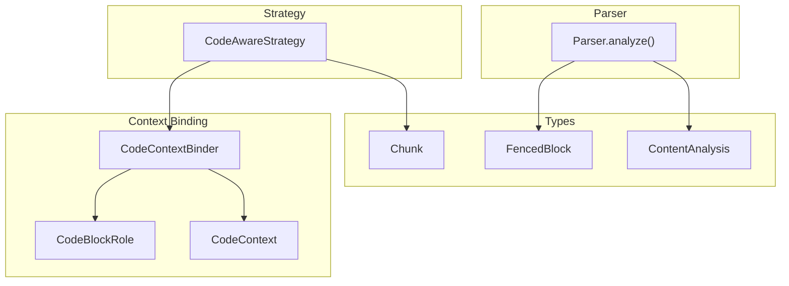
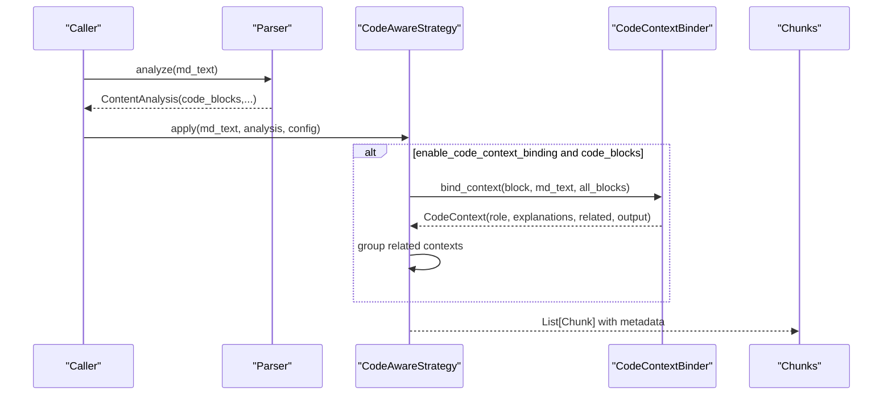
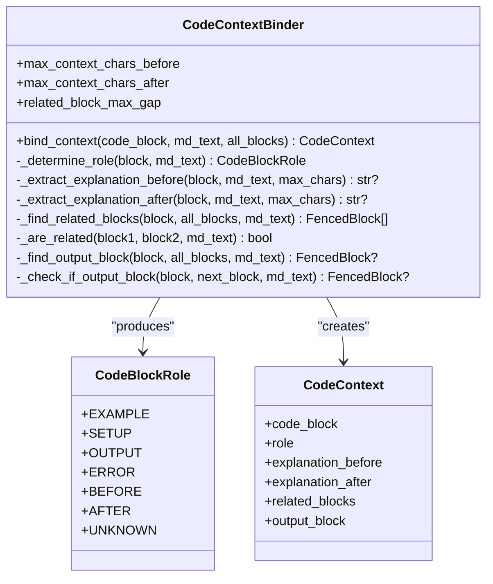
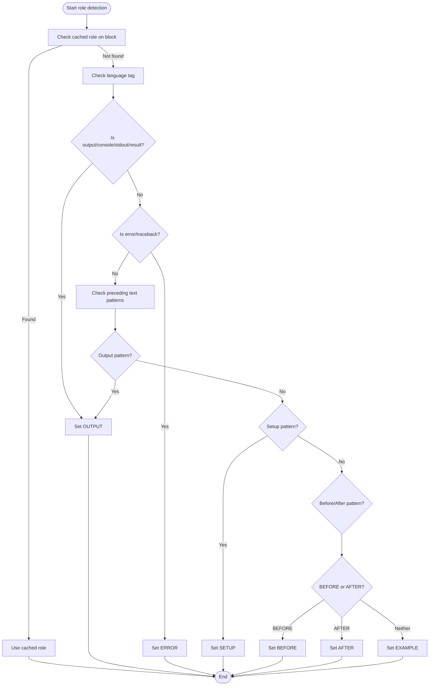
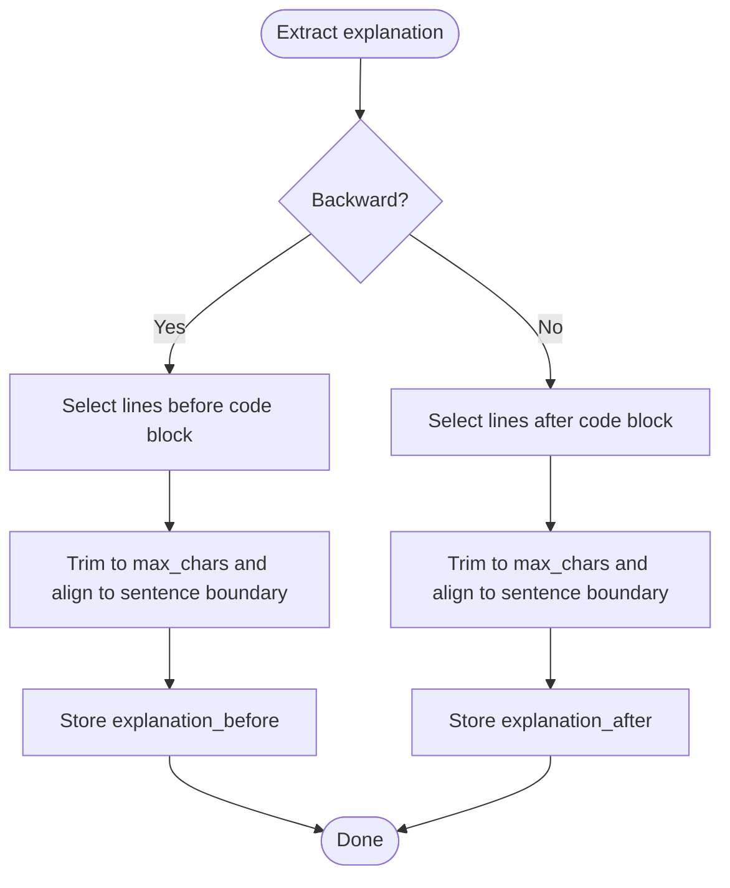
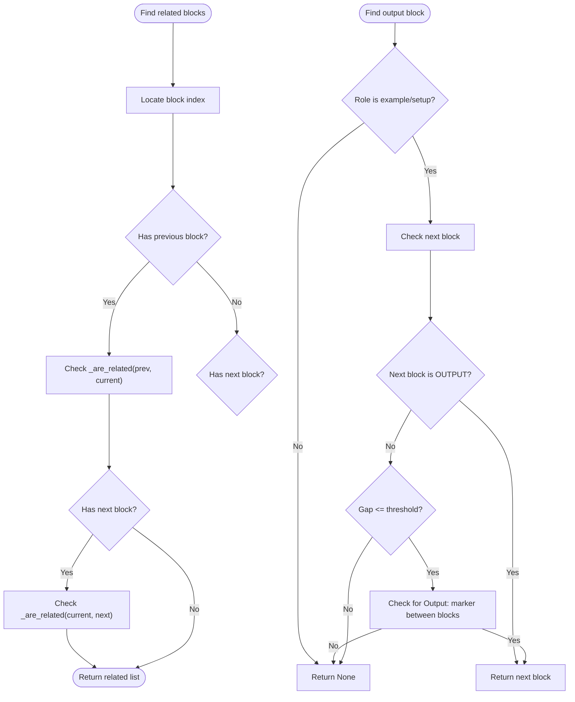
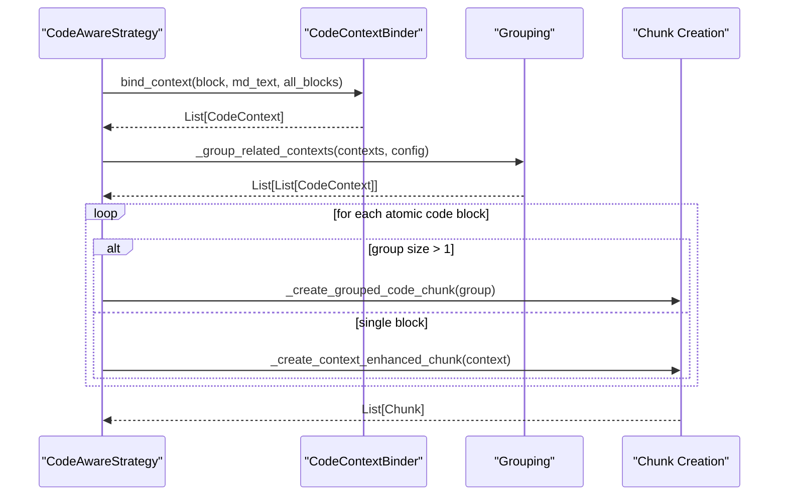
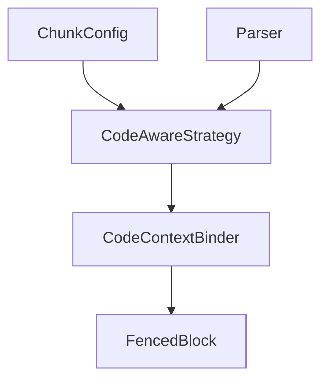

# Code Context Binding

<cite>
**Referenced Files in This Document**
- [code_context.py](file://markdown_chunker_v2/code_context.py)
- [types.py](file://markdown_chunker_v2/types.py)
- [config.py](file://markdown_chunker_v2/config.py)
- [parser.py](file://markdown_chunker_v2/parser.py)
- [code_aware.py](file://markdown_chunker_v2/strategies/code_aware.py)
- [test_code_context_binding.py](file://tests/chunker/test_code_context_binding.py)
- [test_code_context_config.py](file://tests/chunker/test_code_context_config.py)
- [test_code_context_integration.py](file://tests/chunker/test_code_context_integration.py)
- [test_code_context_properties.py](file://tests/chunker/test_code_context_properties.py)
- [06-enhanced-code-context-binding.md](file://docs/research/features/06-enhanced-code-context-binding.md)
</cite>

## Table of Contents
1. [Introduction](#introduction)
2. [Project Structure](#project-structure)
3. [Core Components](#core-components)
4. [Architecture Overview](#architecture-overview)
5. [Detailed Component Analysis](#detailed-component-analysis)
6. [Dependency Analysis](#dependency-analysis)
7. [Performance Considerations](#performance-considerations)
8. [Troubleshooting Guide](#troubleshooting-guide)
9. [Conclusion](#conclusion)
10. [Appendices](#appendices)

## Introduction
This document explains the Code Context Binding feature that enhances how code blocks are chunked and enriched with semantic context. It focuses on:
- Role classification of code blocks (setup, example, output, error, before/after)
- Extraction of surrounding explanations before/after code blocks
- Detection and grouping of related code blocks (sequential examples, before/after, code+output)
- Output block binding to code blocks
- Configuration controls for context extraction and grouping behavior
- Integration with the CodeAwareStrategy and resulting chunk metadata

The goal is to keep code examples close to their explanations and outputs, improving retrieval quality for code-centric knowledge bases.

## Project Structure
The feature spans several modules:
- Types define shared data structures (FencedBlock, Chunk, ContentAnalysis)
- Parser extracts code blocks and other elements
- CodeContextBinder performs role detection, explanation extraction, and relationship detection
- CodeAwareStrategy integrates context binding into the chunking pipeline and emits enriched metadata
- Tests validate behavior, configuration, integration, and properties

**Diagram sources**
- [types.py](file://markdown_chunker_v2/types.py#L72-L108)
- [parser.py](file://markdown_chunker_v2/parser.py#L35-L98)
- [code_context.py](file://markdown_chunker_v2/code_context.py#L17-L62)
- [code_aware.py](file://markdown_chunker_v2/strategies/code_aware.py#L16-L64)

**Section sources**
- [types.py](file://markdown_chunker_v2/types.py#L72-L108)
- [parser.py](file://markdown_chunker_v2/parser.py#L35-L98)
- [code_context.py](file://markdown_chunker_v2/code_context.py#L17-L62)
- [code_aware.py](file://markdown_chunker_v2/strategies/code_aware.py#L16-L64)

## Core Components
- CodeBlockRole: Enumerates roles for code blocks (example, setup, output, error, before, after, unknown).
- CodeContext: Captures role, surrounding explanations, related blocks, and output block for a code block.
- CodeContextBinder: Implements role detection, explanation extraction, related block detection, and output block binding.
- CodeAwareStrategy: Integrates context binding into chunking, groups related contexts, and enriches chunks with metadata.

Key configuration parameters:
- enable_code_context_binding: Toggle for the feature
- max_context_chars_before/max_context_chars_after: Limits for explanation extraction
- related_block_max_gap: Maximum line gap to consider blocks related
- bind_output_blocks: Whether to bind output blocks to code
- preserve_before_after_pairs: Whether to keep before/after pairs together

**Section sources**
- [code_context.py](file://markdown_chunker_v2/code_context.py#L17-L62)
- [code_context.py](file://markdown_chunker_v2/code_context.py#L101-L161)
- [code_aware.py](file://markdown_chunker_v2/strategies/code_aware.py#L16-L64)
- [config.py](file://markdown_chunker_v2/config.py#L12-L79)

## Architecture Overview
The end-to-end flow:
1. Parser analyzes the document and builds ContentAnalysis with code_blocks.
2. CodeAwareStrategy decides whether to enable context binding based on configuration and presence of code.
3. CodeContextBinder binds each code block to its context (role, explanations, related blocks, output).
4. Strategy groups related contexts and creates chunks with enriched metadata.

**Diagram sources**
- [parser.py](file://markdown_chunker_v2/parser.py#L35-L98)
- [code_aware.py](file://markdown_chunker_v2/strategies/code_aware.py#L44-L118)
- [code_context.py](file://markdown_chunker_v2/code_context.py#L119-L161)

## Detailed Component Analysis

### CodeContextBinder
Responsibilities:
- Role determination: language tags, preceding text patterns, before/after heuristics, fallback to example
- Explanation extraction: backward and forward bounded by configured limits
- Related block detection: proximity and role pairing
- Output block detection: pairing with code blocks

**Diagram sources**
- [code_context.py](file://markdown_chunker_v2/code_context.py#L17-L62)
- [code_context.py](file://markdown_chunker_v2/code_context.py#L101-L161)
- [code_context.py](file://markdown_chunker_v2/code_context.py#L162-L512)

**Section sources**
- [code_context.py](file://markdown_chunker_v2/code_context.py#L101-L161)
- [code_context.py](file://markdown_chunker_v2/code_context.py#L162-L512)

### Role Detection Logic
Role detection prioritizes:
- Cached role on the block (if present)
- Language tags (output/console/stdout/result, error/traceback)
- Preceding text patterns (setup, output, before/after)
- Fallback to example

**Diagram sources**
- [code_context.py](file://markdown_chunker_v2/code_context.py#L162-L242)

**Section sources**
- [code_context.py](file://markdown_chunker_v2/code_context.py#L162-L242)

### Explanation Extraction
- Backward extraction: up to N lines before the code block, trimmed to configured max characters and sentence boundaries
- Forward extraction: up to N lines after the code block, trimmed to configured max characters and sentence boundaries

**Diagram sources**
- [code_context.py](file://markdown_chunker_v2/code_context.py#L275-L352)

**Section sources**
- [code_context.py](file://markdown_chunker_v2/code_context.py#L275-L352)

### Related Block Detection and Output Binding
- Related blocks: immediate neighbors with same language and small gap, or before/after pairing, or code/output pairing
- Output binding: checks next block for output role or explicit “Output:” markers between blocks

**Diagram sources**
- [code_context.py](file://markdown_chunker_v2/code_context.py#L353-L495)

**Section sources**
- [code_context.py](file://markdown_chunker_v2/code_context.py#L353-L495)

### CodeAwareStrategy Integration
- Applies either original logic (without context binding) or enhanced logic (with context binding)
- Builds CodeContext for each code block
- Groups related contexts and creates chunks with metadata:
  - code_role or code_roles
  - has_related_code, related_code_count
  - explanation_bound, context_scope
  - has_output_block
  - code_relationship (before_after, code_output, sequential, related)

**Diagram sources**
- [code_aware.py](file://markdown_chunker_v2/strategies/code_aware.py#L139-L235)
- [code_aware.py](file://markdown_chunker_v2/strategies/code_aware.py#L268-L336)
- [code_aware.py](file://markdown_chunker_v2/strategies/code_aware.py#L337-L401)
- [code_aware.py](file://markdown_chunker_v2/strategies/code_aware.py#L403-L443)
- [code_aware.py](file://markdown_chunker_v2/strategies/code_aware.py#L463-L581)

**Section sources**
- [code_aware.py](file://markdown_chunker_v2/strategies/code_aware.py#L139-L235)
- [code_aware.py](file://markdown_chunker_v2/strategies/code_aware.py#L463-L581)

## Dependency Analysis
- CodeContextBinder depends on:
  - FencedBlock (line numbers, language)
  - Regex patterns for role detection
  - Configuration for limits and flags
- CodeAwareStrategy depends on:
  - Parser’s ContentAnalysis for code_blocks
  - CodeContextBinder for context enrichment
  - Chunk metadata schema for output

**Diagram sources**
- [config.py](file://markdown_chunker_v2/config.py#L12-L79)
- [parser.py](file://markdown_chunker_v2/parser.py#L35-L98)
- [code_aware.py](file://markdown_chunker_v2/strategies/code_aware.py#L44-L118)
- [code_context.py](file://markdown_chunker_v2/code_context.py#L101-L161)
- [types.py](file://markdown_chunker_v2/types.py#L72-L108)

**Section sources**
- [config.py](file://markdown_chunker_v2/config.py#L12-L79)
- [parser.py](file://markdown_chunker_v2/parser.py#L35-L98)
- [code_aware.py](file://markdown_chunker_v2/strategies/code_aware.py#L44-L118)
- [code_context.py](file://markdown_chunker_v2/code_context.py#L101-L161)
- [types.py](file://markdown_chunker_v2/types.py#L72-L108)

## Performance Considerations
- Regex-based role detection and explanation extraction are linear in document length.
- Related block detection scans neighboring blocks; worst-case quadratic in number of code blocks if not pruned by grouping.
- Output binding checks next block and a small window; constant-time per block.
- Strategy grouping uses pairwise checks; consider limiting group size or using proximity indices for very large documents.

[No sources needed since this section provides general guidance]

## Troubleshooting Guide
Common issues and resolutions:
- Explanations not appearing:
  - Ensure max_context_chars_before/after are not zero and that the text is within the configured bounds.
  - Verify sentence boundary trimming did not cut off the explanation.
- Related blocks not grouped:
  - Increase related_block_max_gap or adjust language consistency.
  - Confirm preserve_before_after_pairs/bind_output_blocks flags are set appropriately.
- Output not bound:
  - Ensure the output block follows the code block with small enough gap.
  - Use empty language or “Output:” markers between blocks if needed.
- Feature not taking effect:
  - Confirm enable_code_context_binding is True and code blocks exist in the document.

**Section sources**
- [test_code_context_binding.py](file://tests/chunker/test_code_context_binding.py#L151-L250)
- [test_code_context_binding.py](file://tests/chunker/test_code_context_binding.py#L251-L416)
- [test_code_context_binding.py](file://tests/chunker/test_code_context_binding.py#L417-L595)
- [test_code_context_config.py](file://tests/chunker/test_code_context_config.py#L13-L80)
- [test_code_context_integration.py](file://tests/chunker/test_code_context_integration.py#L1-L120)

## Conclusion
Code Context Binding improves chunk quality by:
- Accurately classifying code blocks
- Extracting relevant explanations
- Grouping related blocks and binding outputs
- Emitting rich metadata for downstream retrieval

With configurable limits and flags, it balances context richness with chunk size constraints and preserves user preferences for grouping patterns.

[No sources needed since this section summarizes without analyzing specific files]

## Appendices

### Configuration Reference
- enable_code_context_binding: Enable/disable the feature
- max_context_chars_before: Max characters to extract backward for explanation
- max_context_chars_after: Max characters to extract forward for explanation
- related_block_max_gap: Max line gap to consider blocks related
- bind_output_blocks: Bind output blocks to code blocks
- preserve_before_after_pairs: Keep before/after pairs together

**Section sources**
- [config.py](file://markdown_chunker_v2/config.py#L12-L79)
- [test_code_context_config.py](file://tests/chunker/test_code_context_config.py#L13-L80)
- [test_code_context_config.py](file://tests/chunker/test_code_context_config.py#L81-L160)

### Metadata Enrichment
Chunks produced by CodeAwareStrategy include:
- code_role or code_roles
- has_related_code, related_code_count
- explanation_bound, context_scope
- has_output_block
- code_relationship (before_after, code_output, sequential, related)

**Section sources**
- [code_aware.py](file://markdown_chunker_v2/strategies/code_aware.py#L463-L581)
- [test_code_context_integration.py](file://tests/chunker/test_code_context_integration.py#L120-L210)
- [test_code_context_properties.py](file://tests/chunker/test_code_context_properties.py#L424-L462)

### Feature Origin and Design Notes
- The feature was designed to address user needs for preserving explanations and outputs alongside code.
- It introduces configurable parameters and maintains backward compatibility.

**Section sources**
- [06-enhanced-code-context-binding.md](file://docs/research/features/06-enhanced-code-context-binding.md#L1-L120)
- [06-enhanced-code-context-binding.md](file://docs/research/features/06-enhanced-code-context-binding.md#L217-L245)