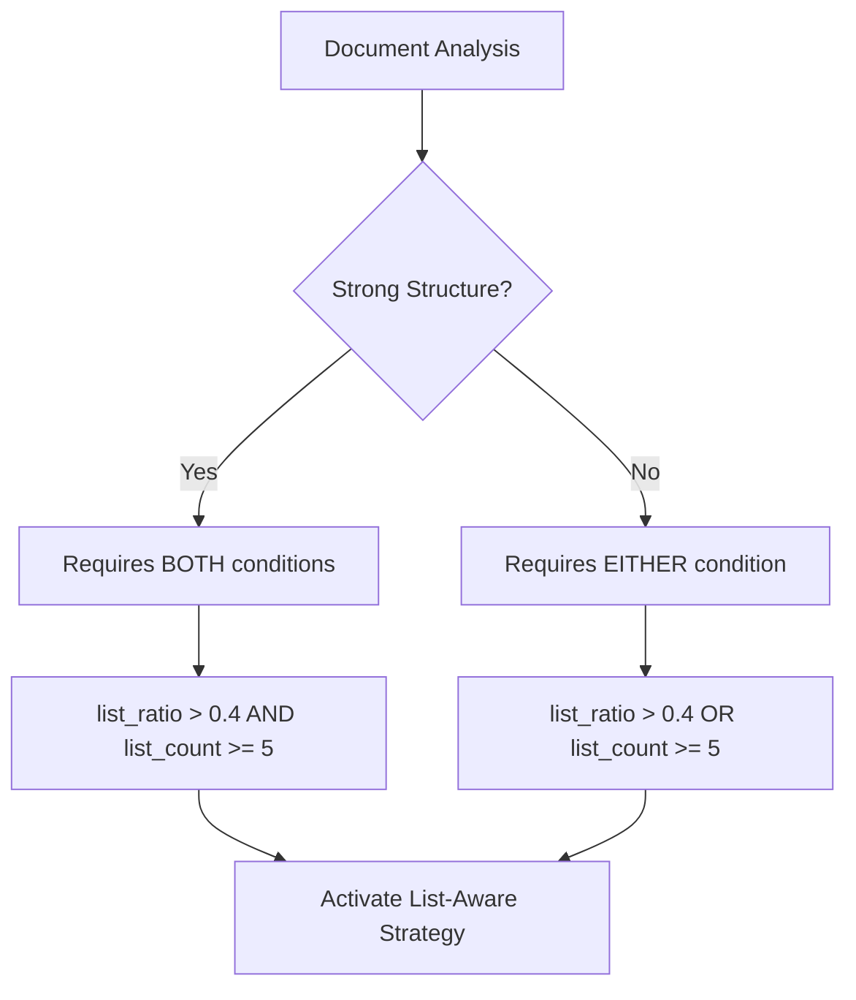
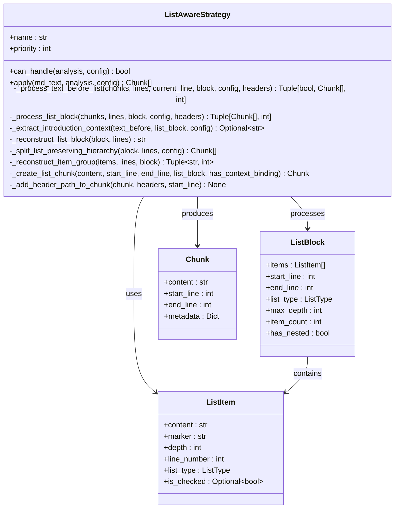
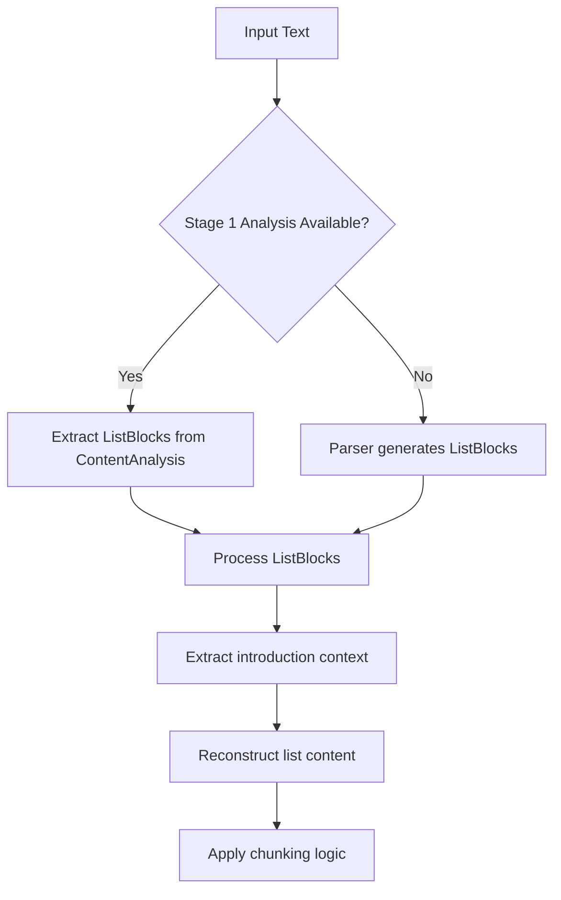
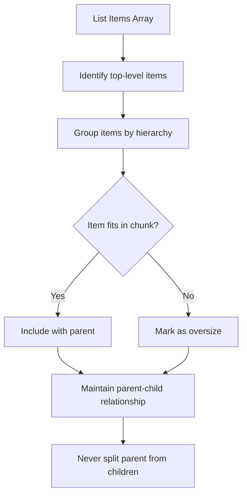
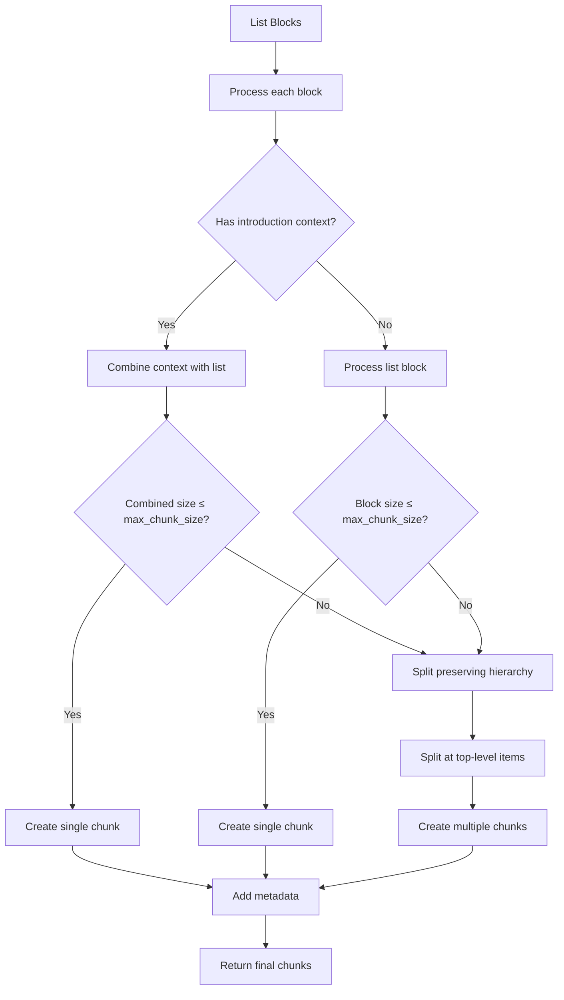

# List Strategy

<cite>
**Referenced Files in This Document**
- [list_aware.py](file://markdown_chunker_v2/strategies/list_aware.py)
- [strategies.md](file://docs/architecture/strategies.md)
- [config.py](file://markdown_chunker_v2/config.py)
- [types.py](file://markdown_chunker_v2/types.py)
- [test_list_aware_fixes.py](file://tests/chunker/test_list_aware_fixes.py)
</cite>

## Update Summary
**Changes Made**
- Updated activation conditions to reflect new 40% list ratio threshold and 5 list item minimum
- Updated priority level from 3 to 2 based on new strategy selection algorithm
- Renamed strategy from "List Strategy" to "List-Aware Strategy" to match implementation
- Updated configuration examples to reflect new ChunkConfig parameters and profiles
- Added information about header_path metadata integration
- Removed outdated references to legacy list_strategy.py

## Table of Contents
1. [Introduction](#introduction)
2. [Activation Conditions](#activation-conditions)
3. [Priority Level](#priority-level)
4. [Core Architecture](#core-architecture)
5. [List Detection and Parsing](#list-detection-and-parsing)
6. [Hierarchy Preservation](#hierarchy-preservation)
7. [Chunk Creation Process](#chunk-creation-process)
8. [Mixed Content Handling](#mixed-content-handling)
9. [Performance Considerations](#performance-considerations)
10. [Configuration Examples](#configuration-examples)
11. [Common Issues and Solutions](#common-issues-and-solutions)
12. [Testing and Validation](#testing-and-validation)
13. [Troubleshooting Guide](#troubleshooting-guide)

## Introduction

The List-Aware Strategy is a specialized chunking strategy designed for documents containing significant amounts of list content. It intelligently preserves list hierarchy, maintains parent-child relationships, and handles various list types including ordered lists, unordered lists, and task lists with checkboxes.

Unlike other strategies that focus on code blocks, tables, or structural elements, the List-Aware Strategy recognizes when a document is primarily composed of lists and applies list-aware chunking techniques to maintain the semantic structure of the content. This strategy is specifically designed for changelogs, release notes, feature lists, task lists, and meeting notes with action items.

**Section sources**
- [strategies.md](file://docs/architecture/strategies.md#L67-L71)

## Activation Conditions

The List-Aware Strategy activates under specific conditions that indicate the document contains substantial list content:

### Threshold-Based Activation

The strategy evaluates two primary criteria:

1. **List Count Threshold**: Documents with 5 or more list items automatically qualify
2. **List Ratio Threshold**: Documents where lists constitute 40% or more of the content qualify

These thresholds are configurable through the `ChunkConfig` parameters:

- `list_count_threshold`: Minimum number of list items required (default: 5)
- `list_ratio_threshold`: Minimum list content ratio (default: 0.4)

### Contextual Activation Logic

The strategy employs different logic based on document structure:



For documents with strong structural hierarchy (many headers, deep hierarchy), the strategy requires both conditions to prevent interference with the Structural Strategy. For documents without strong structure, either condition is sufficient for activation.

**Section sources**
- [list_aware.py](file://markdown_chunker_v2/strategies/list_aware.py#L49-L90)
- [strategies.md](file://docs/architecture/strategies.md#L67-L71)

## Priority Level

The List-Aware Strategy operates with a priority level of 2, which places it in the high priority category. This priority designation reflects its position in the strategy selection algorithm:

### Priority Context

- **High Priority**: The strategy is second in the selection hierarchy, after CodeAwareStrategy (priority 1) and before StructuralStrategy (priority 3)
- **Automatic Selection**: The strategy is part of the automatic strategy selection process based on content analysis
- **Manual Override Capability**: The strategy can be forced using `ChunkConfig.strategy_override="list_aware"`

### Strategy Selection Algorithm

The priority level influences how the strategy competes with other strategies during automatic selection:

```
1. Analyze content:
   - Calculate code_ratio
   - Count code blocks
   - Count tables
   - Calculate list_ratio
   - Count list items
   - Count headers

2. Select strategy (by priority):
   Priority 1: CodeAwareStrategy
      if code_ratio >= 0.30 OR has_code_blocks OR has_tables:
          use CodeAwareStrategy
   
   Priority 2: ListAwareStrategy
      elif list_ratio >= 0.40 OR list_count >= 5:
          use ListAwareStrategy
   
   Priority 3: StructuralStrategy
      elif header_count >= 3:
          use StructuralStrategy
   
   Priority 4: FallbackStrategy
      else:
          use FallbackStrategy
```

**Section sources**
- [list_aware.py](file://markdown_chunker_v2/strategies/list_aware.py#L45-L47)
- [strategies.md](file://docs/architecture/strategies.md#L213-L215)

## Core Architecture

The List-Aware Strategy consists of several interconnected components that work together to provide intelligent list-aware chunking:



**Diagram sources**
- [list_aware.py](file://markdown_chunker_v2/strategies/list_aware.py#L16-L503)
- [types.py](file://markdown_chunker_v2/types.py#L42-L60)

### Key Components

1. **ListBlock**: Represents a contiguous block of list items with metadata about the block
2. **ListItem**: Represents individual list items with complete metadata including depth and type
3. **ListAwareStrategy**: Orchestrates the entire chunking process with sophisticated algorithms for hierarchy preservation

**Section sources**
- [list_aware.py](file://markdown_chunker_v2/strategies/list_aware.py#L16-L503)
- [types.py](file://markdown_chunker_v2/types.py#L12-L70)

## List Detection and Parsing

The strategy employs multiple approaches to detect and parse list items, ensuring robust handling of various list formats:

### List Pattern Recognition

The strategy uses the parser to identify different list types and their structure:

| List Type | Example | Detection Method |
|-----------|---------|------------------|
| Bullet | `- Item content` | Parser identifies `-`, `*`, `+` markers |
| Numbered | `1. Item content` | Parser identifies numbered markers |
| Checkbox | `- [x] Completed task` | Parser identifies checkbox syntax |

### Parsing Process



**Diagram sources**
- [list_aware.py](file://markdown_chunker_v2/strategies/list_aware.py#L92-L140)

### Advanced Parsing Features

1. **Hierarchy Detection**: Automatically determines list nesting level based on indentation
2. **Type Inference**: Smart detection of list types from markers and content patterns
3. **Introduction Context Binding**: Detects and binds introduction paragraphs to lists when appropriate

**Section sources**
- [list_aware.py](file://markdown_chunker_v2/strategies/list_aware.py#L223-L264)
- [types.py](file://markdown_chunker_v2/types.py#L12-L39)

## Hierarchy Preservation

One of the List-Aware Strategy's core strengths is its ability to maintain list hierarchy and parent-child relationships:

### Hierarchical Structure Building

The strategy preserves the complete hierarchy of nested lists:



**Diagram sources**
- [list_aware.py](file://markdown_chunker_v2/strategies/list_aware.py#L280-L369)

### Preservation Features

1. **Depth Tracking**: Maintains accurate nesting levels for all list items
2. **Parent-Child Integrity**: Ensures parent items are always kept with their children
3. **Complete Hierarchy**: Preserves the entire nested structure without splitting mid-hierarchy

### Example Hierarchy

Consider this nested list structure:
```
- Root Item 1
  - Child Item 1.1
  - Child Item 1.2
    - Grandchild 1.2.1
- Root Item 2
```

The strategy preserves this exact hierarchy in the chunked output, ensuring that the relationship between items remains intact. Parent items are never separated from their children, maintaining the semantic meaning of the list structure.

**Section sources**
- [list_aware.py](file://markdown_chunker_v2/strategies/list_aware.py#L280-L369)
- [strategies.md](file://docs/architecture/strategies.md#L73-L74)

## Chunk Creation Process

The chunk creation process involves sophisticated algorithms to balance content preservation with size constraints:

### Chunking Algorithm



**Diagram sources**
- [list_aware.py](file://markdown_chunker_v2/strategies/list_aware.py#L92-L140)

### Size Calculation

The strategy calculates block sizes considering both content and formatting:

- **Base Size**: Length of content including all nested items
- **Context Binding**: Introduction paragraphs are included in size calculations
- **Formatting Preservation**: Original indentation and markers are preserved

### Chunk Types

1. **Single Block Chunks**: Complete list blocks that fit within size constraints
2. **Context-Bound Chunks**: List blocks combined with introduction paragraphs
3. **Split Hierarchy Chunks**: Large list blocks split at top-level items while preserving internal hierarchy

**Section sources**
- [list_aware.py](file://markdown_chunker_v2/strategies/list_aware.py#L192-L221)

## Mixed Content Handling

The List-Aware Strategy excels at handling documents that contain mixed content types:

### Content Integration

Documents often contain a mix of:
- List items
- Regular text paragraphs
- Headers
- Code blocks

The strategy intelligently groups related content while maintaining list structure integrity.

### Task List Support

Special handling for task lists with checkboxes:
- **Checked Status**: Preserves completion state ([x] for completed, [ ] for pending)
- **Mixed Content**: Handles task lists alongside other list types
- **Visual Consistency**: Maintains proper checkbox formatting in chunks

### Example Mixed Document

```markdown
# Project Tasks

## Development Phase
- [ ] Setup project structure
- [x] Configure build system
- [ ] Implement core features

This phase focuses on establishing the foundation.

## Testing Phase
1. Unit tests implementation
2. Integration testing
```

The strategy would create chunks that preserve the task list structure while maintaining the relationship between tasks and their descriptions. Introduction paragraphs are bound to their associated lists when appropriate.

**Section sources**
- [list_aware.py](file://markdown_chunker_v2/strategies/list_aware.py#L142-L191)
- [strategies.md](file://docs/architecture/strategies.md#L75-L77)

## Performance Considerations

The List-Aware Strategy is designed to handle documents with varying degrees of complexity:

### Scalability Factors

1. **List Depth**: Deeply nested lists require more processing but are handled efficiently
2. **Item Count**: Large numbers of list items are processed in linear time
3. **Content Length**: Longer list item content affects processing time proportionally

### Optimization Strategies

1. **Efficient Processing**: Uses optimized algorithms for list detection and hierarchy preservation
2. **Memory Management**: Processes content iteratively to minimize memory usage
3. **Early Binding**: Quickly identifies and binds introduction context to improve chunk quality

### Performance Guidelines

- **Small Lists (< 20 items)**: Processed in milliseconds
- **Medium Lists (20-100 items)**: Processed in tens of milliseconds
- **Large Lists (> 100 items)**: May take hundreds of milliseconds, but scales linearly

### Deep Nesting Considerations

The strategy handles deep nesting gracefully, preserving the complete hierarchy regardless of depth. For typical use cases, the strategy performs efficiently even with moderately deep nesting.

**Section sources**
- [list_aware.py](file://markdown_chunker_v2/strategies/list_aware.py#L92-L140)
- [test_list_aware_fixes.py](file://tests/chunker/test_list_aware_fixes.py#L1-L271)

## Configuration Examples

### Basic Configuration

```python
from markdown_chunker_v2.config import ChunkConfig

# Standard list-aware strategy configuration
config = ChunkConfig(
    max_chunk_size=4096,
    list_count_threshold=5,
    list_ratio_threshold=0.4
)
```

### Force List-Aware Strategy

```python
# Force list-aware strategy regardless of content analysis
config = ChunkConfig(
    max_chunk_size=4096,
    strategy_override="list_aware"
)
```

### Optimized for Changelogs

```python
# Configuration optimized for changelog documents
config = ChunkConfig.for_changelogs()
# Custom thresholds for changelogs: list_ratio_threshold=0.35, list_count_threshold=4
```

### Search Indexing Configuration

```python
# Configuration optimized for search indexing
config = ChunkConfig(
    max_chunk_size=4096,
    min_chunk_size=512,
    overlap_size=200,
    list_ratio_threshold=0.4,
    list_count_threshold=5
)
```

### Custom Thresholds

```python
# Custom thresholds for specific use cases
config = ChunkConfig(
    max_chunk_size=2048,
    list_count_threshold=3,  # Lower threshold for more sensitive detection
    list_ratio_threshold=0.3  # Lower ratio threshold
)
```

**Section sources**
- [config.py](file://markdown_chunker_v2/config.py#L12-L292)
- [strategies.md](file://docs/architecture/strategies.md#L108-L112)

## Common Issues and Solutions

### Issue: Lists Not Being Chunked

**Symptoms**: Documents with many lists aren't being processed by the List-Aware Strategy

**Causes**:
1. Insufficient list count or ratio thresholds
2. Content analysis misclassification
3. Configuration conflicts

**Solutions**:
1. Lower the thresholds: `list_count_threshold=3, list_ratio_threshold=0.3`
2. Force the strategy: `strategy_override="list_aware"`
3. Verify content analysis results

### Issue: Poor Chunk Boundaries

**Symptoms**: List items being split awkwardly or chunks containing unrelated content

**Causes**:
1. Size constraints too restrictive
2. Complex nested structures
3. Mixed content types

**Solutions**:
1. Increase `max_chunk_size`
2. Use `preserve_atomic_blocks=True` (default)
3. Review content structure for optimization

### Issue: Performance Problems with Large Lists

**Symptoms**: Slow processing times with large list documents

**Causes**:
1. Very large list counts
2. Deep nesting structures
3. Complex content within list items

**Solutions**:
1. Process lists in smaller batches
2. Consider alternative strategies for extremely large lists
3. Optimize content structure

### Issue: Header Path Missing

**Symptoms**: Chunks lack header_path metadata

**Causes**:
1. Headers not properly detected
2. List blocks processed before header context applied

**Solutions**:
1. Verify header detection in content analysis
2. Check that _add_header_path_to_chunk is called for all chunks
3. Test with test_list_aware_fixes.py header_path tests

**Section sources**
- [test_list_aware_fixes.py](file://tests/chunker/test_list_aware_fixes.py#L103-L271)
- [list_aware.py](file://markdown_chunker_v2/strategies/list_aware.py#L469-L503)

## Testing and Validation

The List-Aware Strategy includes comprehensive testing to ensure reliability and correctness:

### Test Categories

1. **Unit Tests**: Individual component testing
2. **Integration Tests**: End-to-end functionality
3. **Bug Fix Tests**: Specific fixes for identified issues
4. **Edge Case Tests**: Boundary condition handling

### Key Test Scenarios

#### Basic List Processing
- Simple unordered lists
- Ordered lists with numbering
- Task lists with checkboxes

#### Complex Structures
- Deeply nested lists
- Mixed list types
- Large list collections

#### Edge Cases
- Empty lists
- Single-item lists
- Lists with special characters

### Bug Fix Validation

The strategy includes tests for specific bug fixes:

```python
def test_no_list_duplication_with_introduction():
    """Test that lists are not duplicated when bound with introduction paragraph."""
    # Verifies LISTAWARE-1: No list duplication within single chunk
    pass

def test_header_path_simple_hierarchy():
    """Test header_path is populated for simple hierarchy."""
    # Verifies LISTAWARE-2: header_path properly populated
    pass
```

### Validation Metrics

The strategy provides comprehensive validation metrics:
- **Item Count Accuracy**: Ensures all list items are preserved
- **Hierarchy Integrity**: Validates parent-child relationships
- **Content Completeness**: Verifies no content is lost
- **Metadata Accuracy**: Confirms proper metadata assignment

**Section sources**
- [test_list_aware_fixes.py](file://tests/chunker/test_list_aware_fixes.py#L1-L271)
- [list_aware.py](file://markdown_chunker_v2/strategies/list_aware.py#L92-L140)

## Troubleshooting Guide

### Debugging List-Aware Strategy Issues

#### Enable Debug Logging

```python
import logging
logging.getLogger('markdown_chunker_v2.strategies.list_aware').setLevel(logging.DEBUG)
```

#### Common Debug Information

1. **Selection Reason**: Why the strategy was chosen or rejected
2. **Processing Steps**: Detailed breakdown of chunking process
3. **Size Calculations**: How block sizes were determined
4. **Metadata Assignment**: How header_path and other metadata are set

#### Diagnostic Commands

```python
# Check strategy selection
result = chunker.chunk_with_analysis(content)
print(f"Strategy used: {result.strategy_used}")
print(f"Processing time: {result.processing_time}")

# Analyze list statistics
list_blocks = analysis.list_blocks
print(f"List blocks: {len(list_blocks)}")
print(f"Total list items: {sum(block.item_count for block in list_blocks)}")
```

### Performance Tuning

#### Memory Usage Optimization
- Monitor chunk count for large documents
- Consider batch processing for very large lists
- Use appropriate `max_chunk_size` values

#### Processing Speed Optimization
- Profile chunking operations for bottlenecks
- Consider alternative strategies for specific content types
- Optimize content structure for better chunking

### Configuration Validation

#### Common Configuration Issues
1. **Threshold Conflicts**: Overlapping criteria causing unexpected behavior
2. **Size Constraints**: Too restrictive or too loose size limits
3. **Strategy Override Conflicts**: Manual forcing overriding automatic selection

#### Validation Steps
1. Verify configuration parameters are within valid ranges
2. Test with representative content samples
3. Monitor strategy selection behavior
4. Validate chunk quality and completeness

**Section sources**
- [list_aware.py](file://markdown_chunker_v2/strategies/list_aware.py#L92-L140)
- [test_list_aware_fixes.py](file://tests/chunker/test_list_aware_fixes.py#L1-L271)