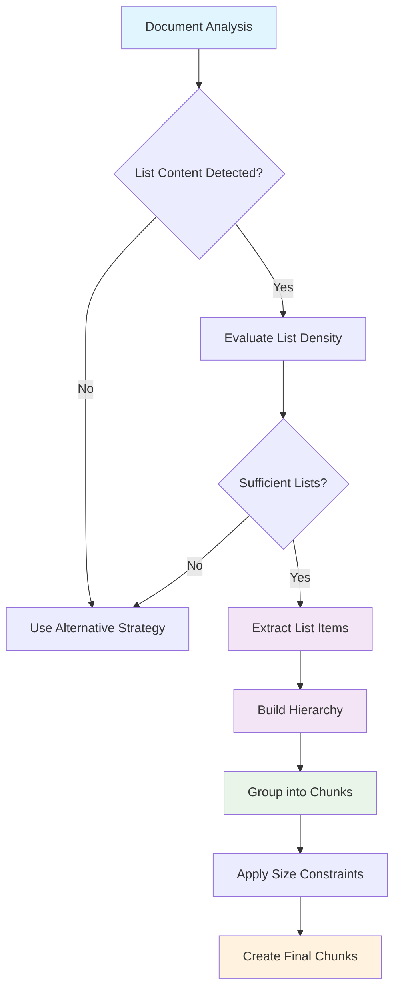
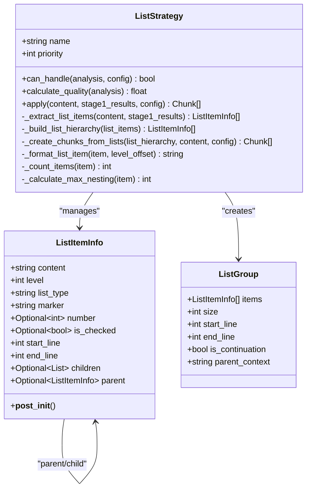
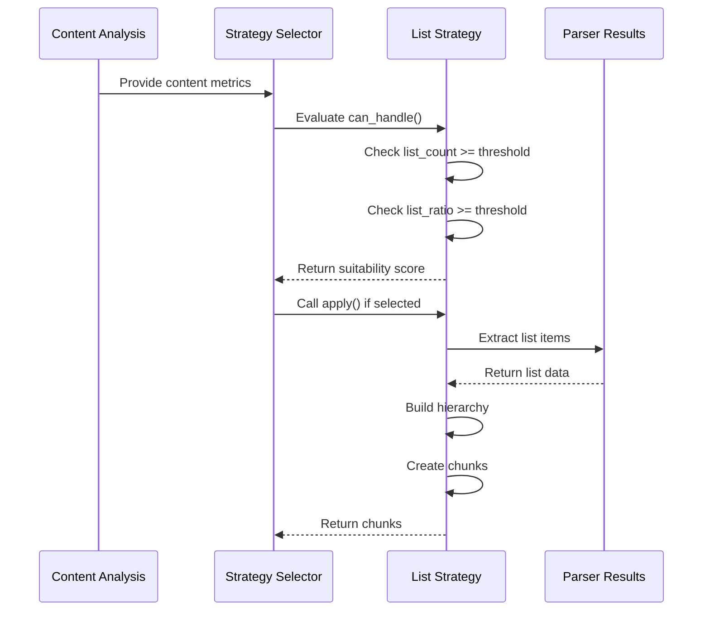
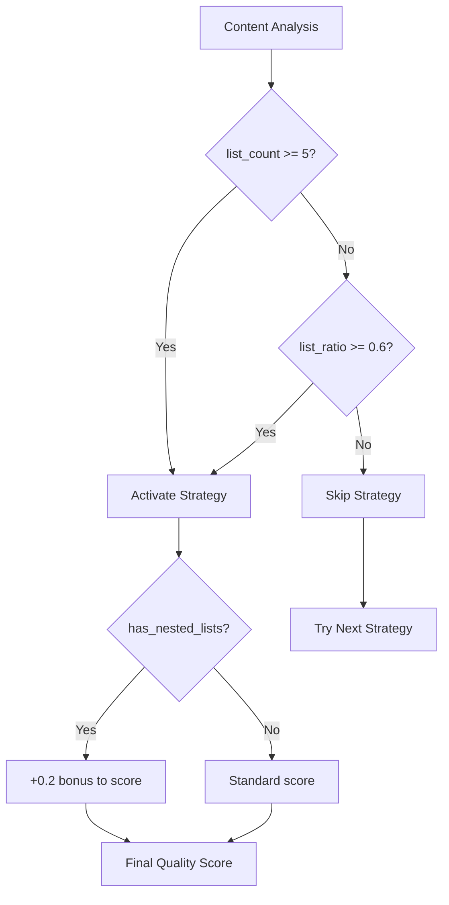
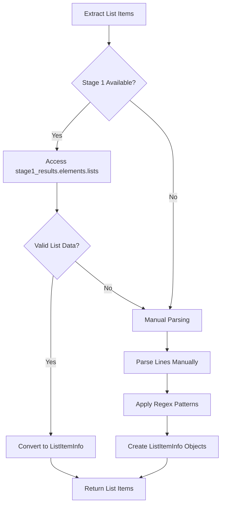
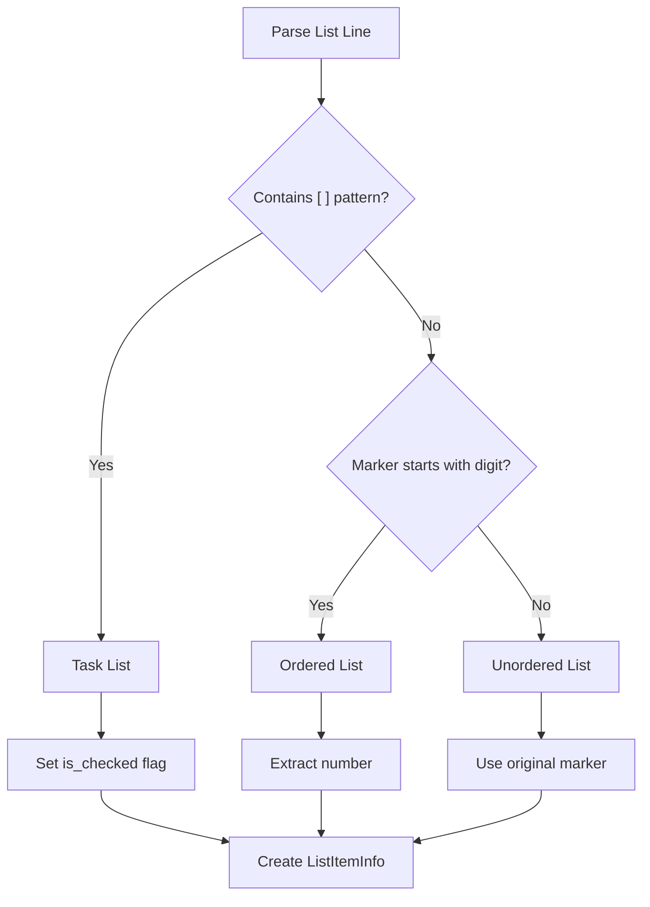
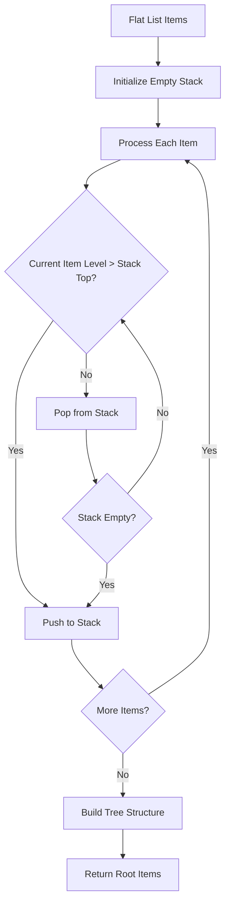
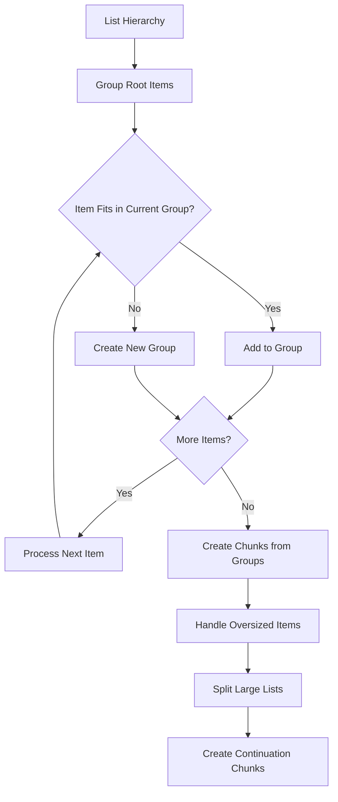
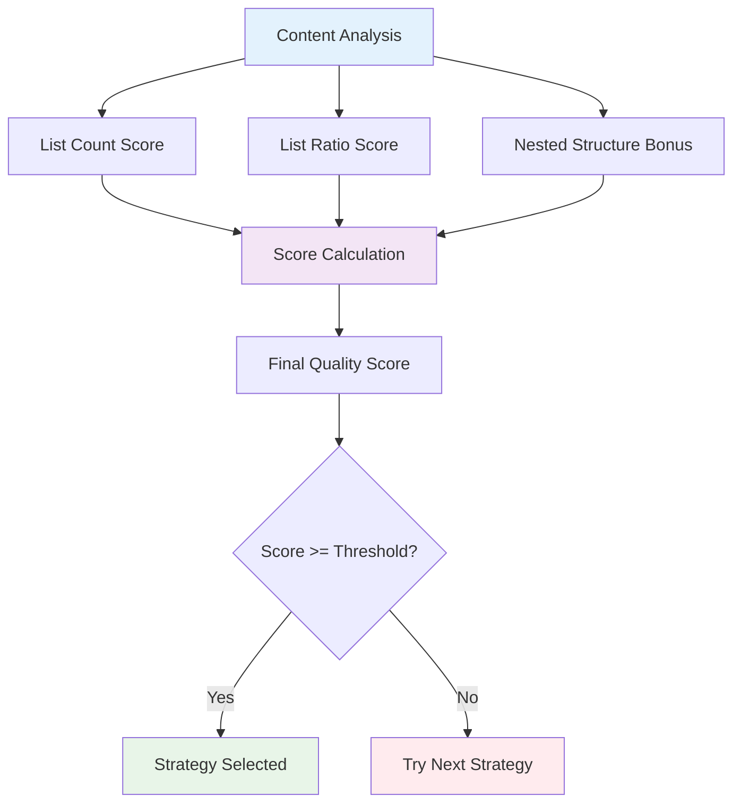
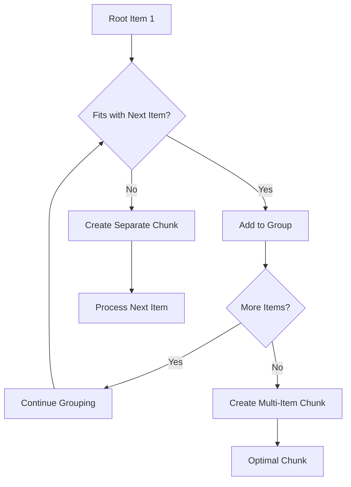

# List Strategy

<cite>
**Referenced Files in This Document**
- [list_strategy.py](file://markdown_chunker/chunker/strategies/list_strategy.py)
- [base.py](file://markdown_chunker/chunker/strategies/base.py)
- [selector.py](file://markdown_chunker/chunker/selector.py)
- [types.py](file://markdown_chunker/chunker/types.py)
- [test_list_strategy.py](file://tests/chunker/test_strategies/test_list_strategy.py)
- [test_list_strategy_properties.py](file://tests/chunker/test_list_strategy_properties.py)
- [list_heavy.md](file://tests/fixtures/list_heavy.md)
- [types.py](file://markdown_chunker/parser/types.py)
</cite>

## Table of Contents
1. [Introduction](#introduction)
2. [Strategy Purpose and Design](#strategy-purpose-and-design)
3. [Core Components](#core-components)
4. [Implementation Architecture](#implementation-architecture)
5. [Content Analysis and Selection Criteria](#content-analysis-and-selection-criteria)
6. [List Extraction and Parsing](#list-extraction-and-parsing)
7. [Hierarchy Building and Structure Management](#hierarchy-building-and-structure-management)
8. [Chunk Creation and Grouping](#chunk-creation-and-grouping)
9. [Quality Scoring and Strategy Evaluation](#quality-scoring-and-strategy-evaluation)
10. [Common Issues and Mitigation Strategies](#common-issues-and-mitigation-strategies)
11. [Usage Guidelines and Best Practices](#usage-guidelines-and-best-practices)
12. [Testing and Validation](#testing-and-validation)
13. [Performance Considerations](#performance-considerations)
14. [Troubleshooting Guide](#troubleshooting-guide)

## Introduction

The List Strategy is a specialized chunking strategy designed specifically for documents containing significant amounts of list content. Unlike other strategies that focus on code blocks, tables, or structural elements, the List Strategy prioritizes preserving list hierarchy and maintaining parent-child relationships between list items. This makes it particularly effective for documents like shopping lists, task checklists, procedural instructions, and any content where the hierarchical nature of lists is crucial for comprehension.

The strategy operates under the principle that list items should be treated as atomic units that maintain their structural relationships during chunking. This ensures that users can understand the complete context of each list item, including its position within the hierarchy and its relationship to parent and child items.

## Strategy Purpose and Design

### Primary Objectives

The List Strategy serves several key purposes:

1. **Preserve List Hierarchy**: Maintain the nested structure of lists where parent items contain child items
2. **Maintain Atomicity**: Treat list items as indivisible units that shouldn't be split across chunks
3. **Handle Mixed List Types**: Support ordered lists, unordered lists, and task lists with checkboxes
4. **Optimize for List Density**: Activate automatically when documents contain sufficient list content
5. **Minimize Micro-Chunks**: Prevent single-item chunks that would fragment the list structure

### Design Philosophy

The strategy follows a hierarchical approach to chunking, recognizing that lists represent natural groupings of related information. Instead of treating each list item independently, it considers the entire list structure, ensuring that related items remain together in the same chunk whenever possible.



**Diagram sources**
- [list_strategy.py](file://markdown_chunker/chunker/strategies/list_strategy.py#L135-L169)

## Core Components

### ListItemInfo Class

The `ListItemInfo` class serves as the fundamental data structure for representing list items throughout the strategy. It encapsulates all necessary information about a list item while maintaining its hierarchical relationships.



**Diagram sources**
- [list_strategy.py](file://markdown_chunker/chunker/strategies/list_strategy.py#L26-L56)

### ListGroup Class

The `ListGroup` class represents a collection of list items that fit within size constraints. It provides the mechanism for grouping related list items together while maintaining the ability to handle large lists that exceed chunk size limits.

**Section sources**
- [list_strategy.py](file://markdown_chunker/chunker/strategies/list_strategy.py#L26-L56)

## Implementation Architecture

### Strategy Selection and Activation

The List Strategy operates through a multi-stage process that begins with content analysis and ends with chunk creation. The strategy is activated when documents meet specific criteria related to list density and content composition.



**Diagram sources**
- [selector.py](file://markdown_chunker/chunker/selector.py#L58-L98)
- [list_strategy.py](file://markdown_chunker/chunker/strategies/list_strategy.py#L89-L101)

### Priority and Quality Scoring

The List Strategy operates with a medium-high priority (priority 3) and employs a sophisticated quality scoring system that considers multiple factors:

| Factor | Weight | Description |
|--------|--------|-------------|
| List Count | 0.6-0.8 | Number of lists in document (≥10: highest, ≥5: high, ≥3: moderate) |
| List Ratio | 0.3-0.3 | Proportion of content that is list items (≥70%: highest, ≥50%: high, ≥30%: moderate) |
| Nested Lists | +0.2 | Bonus for documents with complex nested structures |
| Total Score | Max 1.0 | Combined score for strategy selection |

**Section sources**
- [list_strategy.py](file://markdown_chunker/chunker/strategies/list_strategy.py#L89-L133)

## Content Analysis and Selection Criteria

### Threshold Configuration

The strategy uses configurable thresholds to determine when it should be activated:

| Parameter | Default Value | Purpose |
|-----------|---------------|---------|
| `list_count_threshold` | 5 | Minimum number of lists required |
| `list_ratio_threshold` | 0.6 | Minimum proportion of content that is lists |

These thresholds can be adjusted based on specific use cases and document characteristics. For example, documentation-heavy sites might use lower thresholds, while code-heavy repositories might use higher thresholds.

### Selection Logic

The strategy evaluates content using a dual-criteria approach:

1. **Absolute Count**: Documents with 5 or more lists automatically qualify
2. **Proportional Coverage**: Documents where 60% or more of the content consists of lists qualify
3. **Nested Structure Bonus**: Documents with complex nesting receive additional scoring



**Diagram sources**
- [list_strategy.py](file://markdown_chunker/chunker/strategies/list_strategy.py#L89-L133)

**Section sources**
- [list_strategy.py](file://markdown_chunker/chunker/strategies/list_strategy.py#L89-L133)

## List Extraction and Parsing

### Stage 1 Integration

The strategy first attempts to leverage Stage 1 results for list extraction, falling back to manual parsing when necessary. This approach optimizes performance by utilizing pre-processed data when available.



**Diagram sources**
- [list_strategy.py](file://markdown_chunker/chunker/strategies/list_strategy.py#L171-L218)

### Manual Parsing Patterns

When Stage 1 data is unavailable, the strategy employs sophisticated regex patterns to detect and parse list items:

| Pattern Type | Regex Pattern | Example Match |
|--------------|---------------|---------------|
| Task List | `^(\s*)([-*+])\s+\[([ xX])\]\s+(.+)$` | `- [x] Complete task` |
| Ordered List | `^(\s*)(\d+)\.\s+(.+)$` | `1. Step one` |
| Unordered List | `^(\s*)([-*+])\s+(.+)$` | `- Item with asterisk` |

### List Type Detection

The strategy automatically detects list types based on markers and content patterns:



**Diagram sources**
- [list_strategy.py](file://markdown_chunker/chunker/strategies/list_strategy.py#L351-L371)

**Section sources**
- [list_strategy.py](file://markdown_chunker/chunker/strategies/list_strategy.py#L171-L218)
- [list_strategy.py](file://markdown_chunker/chunker/strategies/list_strategy.py#L270-L371)

## Hierarchy Building and Structure Management

### Hierarchical Structure Construction

The strategy builds a tree-like structure from flat list items using a stack-based approach that respects nesting levels:



**Diagram sources**
- [list_strategy.py](file://markdown_chunker/chunker/strategies/list_strategy.py#L373-L407)

### Parent-Child Relationships

The hierarchy construction ensures that parent-child relationships are maintained:

1. **Level Tracking**: Each item tracks its nesting level (0-based)
2. **Stack Management**: Uses a stack to track current parent items
3. **Relationship Assignment**: Automatically assigns children to parents
4. **Circular Reference Prevention**: Ensures no circular relationships form

### Nested List Handling

The strategy gracefully handles deeply nested lists with multiple levels of indentation:

| Level | Indentation | Marker Example |
|-------|-------------|----------------|
| 0 | 0 spaces | `- Main item` |
| 1 | 2 spaces | `  - Child item` |
| 2 | 4 spaces | `    - Grandchild` |
| 3 | 6 spaces | `      - Great-grandchild` |

**Section sources**
- [list_strategy.py](file://markdown_chunker/chunker/strategies/list_strategy.py#L373-L407)

## Chunk Creation and Grouping

### Grouping Strategy

The strategy employs intelligent grouping to minimize micro-chunks while respecting size constraints:



**Diagram sources**
- [list_strategy.py](file://markdown_chunker/chunker/strategies/list_strategy.py#L409-L452)

### Size Calculation

The strategy calculates item sizes accurately, accounting for:

1. **Content Length**: Actual text content of the item
2. **Formatting**: Marker characters and spacing
3. **Children**: Recursive calculation of all descendant items
4. **Overhead**: Additional characters for list formatting

### Chunk Metadata

Each chunk created by the List Strategy includes comprehensive metadata:

| Metadata Field | Description | Example Value |
|----------------|-------------|---------------|
| `list_type` | Type of list (ordered, unordered, task) | `"ordered"` |
| `item_count` | Total number of items in chunk | `5` |
| `max_nesting` | Maximum nesting level | `3` |
| `has_nested_items` | Whether chunk contains nested lists | `true` |
| `is_continuation` | Whether chunk continues from previous | `false` |
| `grouped_items` | Number of items grouped together | `3` |

**Section sources**
- [list_strategy.py](file://markdown_chunker/chunker/strategies/list_strategy.py#L409-L452)
- [list_strategy.py](file://markdown_chunker/chunker/strategies/list_strategy.py#L454-L498)

## Quality Scoring and Strategy Evaluation

### Quality Metrics

The strategy evaluation system considers multiple factors to determine the optimal strategy for a given document:



**Diagram sources**
- [list_strategy.py](file://markdown_chunker/chunker/strategies/list_strategy.py#L102-L133)

### Scoring Formula

The quality score calculation follows this formula:

```
Score = (List Count Contribution) + (List Ratio Contribution) + (Nested Bonus)
```

Where:
- **List Count Contribution**: 0.8 for ≥10 lists, 0.6 for ≥5 lists, 0.4 for ≥3 lists
- **List Ratio Contribution**: 0.3 for ≥70% ratio, 0.2 for ≥50% ratio, 0.1 for ≥30% ratio
- **Nested Bonus**: +0.2 if document has nested list structures

### Strategy Selection Process

The StrategySelector evaluates all applicable strategies using either strict or weighted selection modes:

1. **Strict Mode**: Selects the first strategy by priority that can handle the content
2. **Weighted Mode**: Calculates combined priority × quality scores and selects the highest

**Section sources**
- [list_strategy.py](file://markdown_chunker/chunker/strategies/list_strategy.py#L102-L133)
- [selector.py](file://markdown_chunker/chunker/selector.py#L58-L133)

## Common Issues and Mitigation Strategies

### Single-Item Micro-Chunks

One of the primary challenges addressed by the List Strategy is the creation of single-item micro-chunks that fragment list structures. The strategy implements several mitigation techniques:

#### Grouping Multiple Items Together

The strategy groups multiple root items together when they fit within size constraints:



**Diagram sources**
- [list_strategy.py](file://markdown_chunker/chunker/strategies/list_strategy.py#L428-L451)

#### Minimum Item Threshold

The strategy enforces a minimum number of items per chunk to prevent fragmentation:

- **Default Minimum**: 2 items per chunk
- **Last Item Handling**: Special logic for the final item in a group
- **Size Flexibility**: Allows slight overage for the last item to avoid single-item chunks

### Oversized List Items

Large list items that exceed chunk size limits are handled through intelligent splitting:

1. **Parent Context Preservation**: Continuation chunks include parent item information
2. **Hierarchical Continuation**: Maintains the relationship between parent and child chunks
3. **Context Injection**: Adds appropriate indentation and formatting for continuation

### Mixed Content Handling

Documents with mixed content types require careful balancing:

- **List Dominance**: Lists take precedence when they constitute a significant portion of content
- **Content Type Awareness**: Considers the overall document structure
- **Fallback Protection**: Ensures alternative strategies are available when lists aren't dominant

**Section sources**
- [list_strategy.py](file://markdown_chunker/chunker/strategies/list_strategy.py#L428-L451)
- [list_strategy.py](file://markdown_chunker/chunker/strategies/list_strategy.py#L454-L498)

## Usage Guidelines and Best Practices

### When to Use the List Strategy

The List Strategy is most effective for:

1. **Documentation with Lists**: Technical documentation containing procedural steps
2. **Task Management**: Documents with task lists and checklists
3. **Instructional Content**: Tutorials and how-to guides with numbered steps
4. **Shopping Lists**: Grocery lists and inventory management documents
5. **Comparison Tables**: Documents that compare features using list structures

### Configuration Recommendations

For optimal results, consider these configuration adjustments:

| Scenario | Recommended Settings | Rationale |
|----------|---------------------|-----------|
| Code Documentation | `list_count_threshold=3, list_ratio_threshold=0.4` | Lower thresholds for mixed content |
| Technical Manuals | `preserve_list_hierarchy=True` | Maintain complex structures |
| API References | `max_chunk_size=3000` | Balance readability with size |
| Chat Applications | `enable_overlap=True` | Maintain context across messages |

### Force Strategy Selection

While the strategy selection is generally automatic, you can force the List Strategy in specific scenarios:

```python
# Force List Strategy for list-heavy documents
config = ChunkConfig(
    list_count_threshold=1,  # Very low threshold
    list_ratio_threshold=0.1  # Minimal list requirement
)
```

### Integration with Other Strategies

The List Strategy works best when combined with other strategies:

1. **Fallback Chain**: Use as fallback for documents with moderate list content
2. **Mixed Content**: Combine with Mixed Strategy for documents containing multiple content types
3. **Structural Strategy**: Coordinate with Structural Strategy for documents with headers and lists

**Section sources**
- [types.py](file://markdown_chunker/chunker/types.py#L588-L589)

## Testing and Validation

### Property-Based Testing

The strategy includes comprehensive property-based tests that verify:

1. **List Structure Preservation**: List items are not reordered or lost
2. **Hierarchy Maintenance**: Nested list structures are preserved
3. **Atomicity**: Individual list items remain intact across chunks
4. **Metadata Accuracy**: Proper metadata is attached to list chunks
5. **Task List Detection**: Checkbox markers are correctly identified

### Test Coverage Areas

The testing framework covers:

- **Basic List Types**: Unordered, ordered, and task lists
- **Nested Structures**: Deeply nested list hierarchies
- **Edge Cases**: Empty lists, single items, and malformed content
- **Performance**: Large documents with thousands of list items
- **Integration**: Interaction with other strategies and components

### Validation Metrics

Key validation metrics include:

| Metric | Expected Range | Purpose |
|--------|----------------|---------|
| Item Preservation | ≥95% | Ensure no list items are lost |
| Hierarchy Integrity | 100% | Verify nested structures are maintained |
| Chunk Size Compliance | ≤max_chunk_size | Respect size constraints |
| Metadata Accuracy | 100% | Ensure proper metadata assignment |

**Section sources**
- [test_list_strategy_properties.py](file://tests/chunker/test_list_strategy_properties.py#L1-386)

## Performance Considerations

### Memory Efficiency

The strategy is designed with memory efficiency in mind:

1. **Streaming Processing**: Processes lists in batches rather than loading entire documents
2. **Lazy Evaluation**: Builds hierarchy only when needed
3. **Size Calculation**: Optimizes size calculations to avoid redundant computations

### Processing Speed

Performance optimizations include:

- **Regex Compilation**: Pre-compiles regex patterns for faster matching
- **Early Termination**: Stops processing when size constraints are met
- **Batch Operations**: Groups similar operations together

### Scalability

The strategy scales effectively with:

- **Document Size**: Linear scaling with document length
- **List Complexity**: Polynomial scaling with nesting depth
- **Memory Usage**: Constant memory overhead per list item

## Troubleshooting Guide

### Common Issues and Solutions

#### Issue: Strategy Not Activating

**Symptoms**: List Strategy not being selected despite having lists
**Causes**: 
- Insufficient list count or ratio
- Configuration thresholds too high
- Stage 1 data unavailable

**Solutions**:
1. Lower `list_count_threshold` and `list_ratio_threshold`
2. Verify Stage 1 results are available
3. Check content analysis metrics

#### Issue: Fragmented List Chunks

**Symptoms**: Single-item chunks breaking up list structures
**Causes**:
- Strict size constraints
- Poor grouping decisions
- Inadequate minimum item thresholds

**Solutions**:
1. Increase `min_chunk_size` relative to typical list item size
2. Adjust grouping logic parameters
3. Review chunk size distribution

#### Issue: Incorrect List Type Detection

**Symptoms**: Task lists misidentified as regular lists
**Causes**:
- Malformed checkbox syntax
- Complex nested content
- Encoding issues

**Solutions**:
1. Verify checkbox syntax follows `- [x]` or `- [ ]` patterns
2. Check for encoding problems in input text
3. Review regex patterns for edge cases

### Debugging Tools

The strategy provides several debugging capabilities:

1. **Selection Reason**: Detailed explanation of strategy selection
2. **Content Analysis**: Breakdown of list metrics and thresholds
3. **Chunk Statistics**: Information about chunk distribution and quality
4. **Hierarchy Validation**: Verification of list structure integrity

**Section sources**
- [list_strategy.py](file://markdown_chunker/chunker/strategies/list_strategy.py#L796-L817)