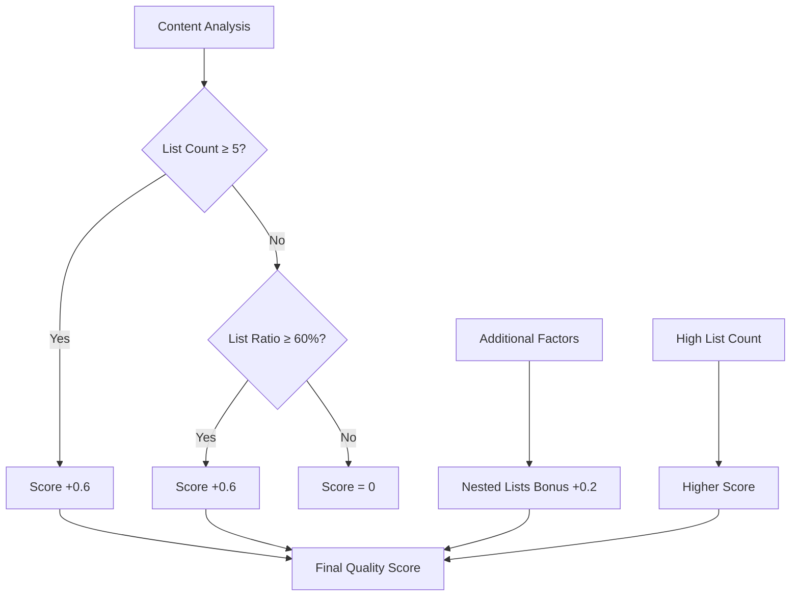
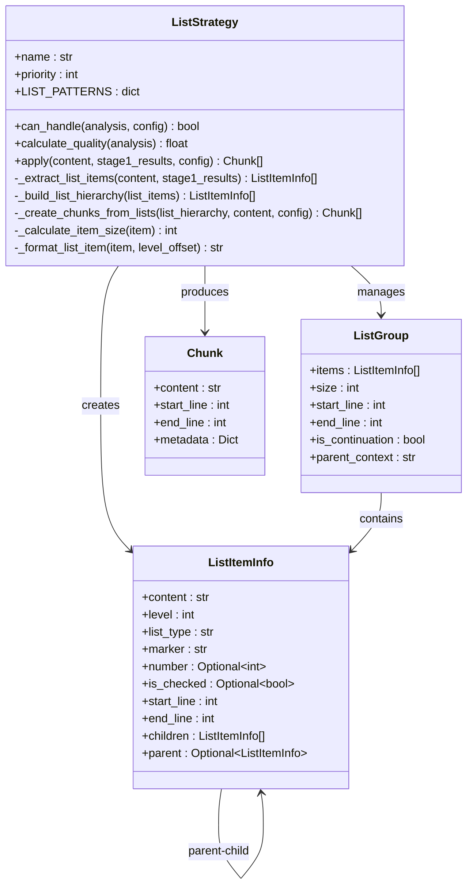
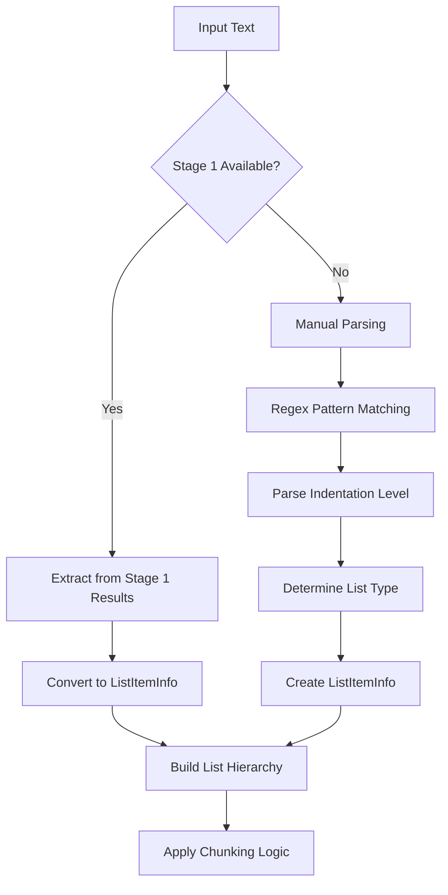
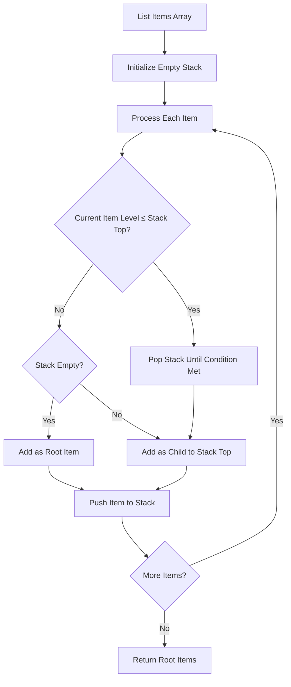
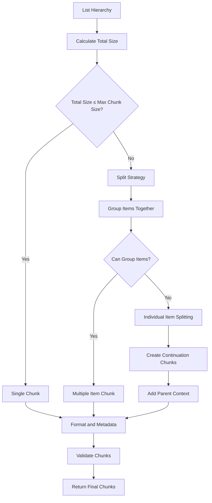

# List Strategy

<cite>
**Referenced Files in This Document**
- [list_strategy.py](file://markdown_chunker_legacy/chunker/strategies/list_strategy.py)
- [test_list_strategy.py](file://tests/chunker/test_strategies/test_list_strategy.py)
- [test_list_strategy_properties.py](file://tests/chunker/test_list_strategy_properties.py)
- [types.py](file://markdown_chunker_legacy/chunker/types.py)
- [list_heavy.md](file://tests/fixtures/list_heavy.md)
- [mixed_list_types.md](file://tests/parser/fixtures/edge_cases/mixed_list_types.md)
- [task_list.md](file://tests/parser/fixtures/edge_cases/task_list.md)
- [list_in_list.md](file://tests/parser/fixtures/nested/list_in_list.md)
</cite>

## Table of Contents
1. [Introduction](#introduction)
2. [Activation Conditions](#activation-conditions)
3. [Priority Level](#priority-level)
4. [Core Architecture](#core-architecture)
5. [List Detection and Parsing](#list-detection-and-parsing)
6. [Hierarchy Preservation](#hierarchy-preservation)
7. [Chunk Creation Process](#chunk-creation-process)
8. [Mixed Content Handling](#mixed-content-handling)
9. [Performance Considerations](#performance-considerations)
10. [Configuration Examples](#configuration-examples)
11. [Common Issues and Solutions](#common-issues-and-solutions)
12. [Testing and Validation](#testing-and-validation)
13. [Troubleshooting Guide](#troubleshooting-guide)

## Introduction

The List Strategy is a specialized chunking strategy designed for documents containing significant amounts of list content. It intelligently preserves list hierarchy, maintains parent-child relationships, and handles various list types including ordered lists, unordered lists, and task lists with checkboxes.

Unlike other strategies that focus on code blocks, tables, or structural elements, the List Strategy recognizes when a document is primarily composed of lists and applies list-aware chunking techniques to maintain the semantic structure of the content.

## Activation Conditions

The List Strategy activates under specific conditions that indicate the document contains substantial list content:

### Threshold-Based Activation

The strategy evaluates two primary criteria:

1. **List Count Threshold**: Documents with 5 or more lists automatically qualify
2. **List Ratio Threshold**: Documents where lists constitute 60% or more of the content qualify

These thresholds are configurable through the `ChunkConfig` parameters:

- `list_count_threshold`: Minimum number of lists required (default: 5)
- `list_ratio_threshold`: Minimum list content ratio (default: 0.6)

### Quality Scoring

The strategy calculates a quality score based on content characteristics:



**Diagram sources**
- [list_strategy.py](file://markdown_chunker_legacy/chunker/strategies/list_strategy.py#L102-L133)

**Section sources**
- [list_strategy.py](file://markdown_chunker_legacy/chunker/strategies/list_strategy.py#L89-L100)
- [types.py](file://markdown_chunker_legacy/chunker/types.py#L588-L592)

## Priority Level

The List Strategy operates with a priority level of 4, which places it in the medium-high priority category. This priority designation reflects several important characteristics:

### Priority Context

- **Medium-High Priority**: The strategy is considered medium priority because it's specifically designed for list-heavy documents and isn't part of the automatic strategy selection process
- **Excluded from Auto Mode**: The strategy is intentionally excluded from automatic mode to prevent inappropriate activation on documents that merely contain lists but aren't truly list-heavy
- **Manual Override Capability**: Despite the priority level, the strategy can still be manually forced using `ChunkConfig.force_strategy="list"`

### Strategy Selection Impact

The priority level influences how the strategy competes with other strategies during automatic selection. While it has sufficient priority to activate when appropriate, it won't dominate the selection process for documents that could benefit from other strategies.

**Section sources**
- [list_strategy.py](file://markdown_chunker_legacy/chunker/strategies/list_strategy.py#L85-L87)

## Core Architecture

The List Strategy consists of several interconnected components that work together to provide intelligent list-aware chunking:



**Diagram sources**
- [list_strategy.py](file://markdown_chunker_legacy/chunker/strategies/list_strategy.py#L26-L56)
- [types.py](file://markdown_chunker_legacy/chunker/types.py#L36-L60)

### Key Components

1. **ListItemInfo**: Represents individual list items with complete metadata including hierarchy information
2. **ListGroup**: Groups related list items that fit within size constraints
3. **ListStrategy**: Orchestrates the entire chunking process with sophisticated algorithms

**Section sources**
- [list_strategy.py](file://markdown_chunker_legacy/chunker/strategies/list_strategy.py#L26-L56)

## List Detection and Parsing

The strategy employs multiple approaches to detect and parse list items, ensuring robust handling of various list formats:

### List Pattern Recognition

The strategy uses regular expressions to identify different list types:

| List Type | Pattern | Example |
|-----------|---------|---------|
| Ordered | `^(\s*)(\d+)\.\s+(.+)$` | `1. Item content` |
| Unordered | `^(\s*)([-*+])\s+(.+)$` | `- Item content` |
| Task | `^(\s*)([-*+])\s+\[([ xX])\]\s+(.+)$` | `- [x] Completed task` |

### Parsing Process



**Diagram sources**
- [list_strategy.py](file://markdown_chunker_legacy/chunker/strategies/list_strategy.py#L171-L217)

### Advanced Parsing Features

1. **Indentation Detection**: Automatically determines list nesting level based on leading whitespace
2. **Type Inference**: Smart detection of list types from both markers and content patterns
3. **Fallback Mechanism**: Graceful degradation when Stage 1 data is unavailable

**Section sources**
- [list_strategy.py](file://markdown_chunker_legacy/chunker/strategies/list_strategy.py#L72-L77)
- [list_strategy.py](file://markdown_chunker_legacy/chunker/strategies/list_strategy.py#L270-L349)

## Hierarchy Preservation

One of the List Strategy's core strengths is its ability to maintain list hierarchy and parent-child relationships:

### Hierarchical Structure Building

The strategy builds a tree-like structure using a stack-based approach:



**Diagram sources**
- [list_strategy.py](file://markdown_chunker_legacy/chunker/strategies/list_strategy.py#L373-L407)

### Preservation Features

1. **Level Tracking**: Maintains accurate nesting levels for all list items
2. **Parent-Child Links**: Establishes bidirectional relationships between parent and child items
3. **Recursive Processing**: Handles arbitrarily deep nesting structures

### Example Hierarchy

Consider this nested list structure:
```
- Root Item 1
  - Child Item 1.1
  - Child Item 1.2
    - Grandchild 1.2.1
- Root Item 2
```

The strategy preserves this exact hierarchy in the chunked output, ensuring that the relationship between items remains intact.

**Section sources**
- [list_strategy.py](file://markdown_chunker_legacy/chunker/strategies/list_strategy.py#L373-L407)

## Chunk Creation Process

The chunk creation process involves sophisticated algorithms to balance content preservation with size constraints:

### Chunking Algorithm



**Diagram sources**
- [list_strategy.py](file://markdown_chunker_legacy/chunker/strategies/list_strategy.py#L409-L500)

### Size Calculation

The strategy calculates item sizes considering both content and formatting overhead:

- **Base Size**: Length of content + marker + formatting overhead (approximately 10 characters)
- **Recursive Addition**: Size of all child items is included in the parent's total size
- **Formatting Overhead**: Additional space for indentation and list markers

### Chunk Types

1. **Single Item Chunks**: Individual list items that fit within size constraints
2. **Multi-Item Chunks**: Groups of related items that fit together
3. **Continuation Chunks**: Split portions of large items with parent context preserved

**Section sources**
- [list_strategy.py](file://markdown_chunker_legacy/chunker/strategies/list_strategy.py#L502-L589)

## Mixed Content Handling

The List Strategy excels at handling documents that contain mixed content types:

### Content Integration

Documents often contain a mix of:
- List items
- Regular text paragraphs
- Headers
- Code blocks

The strategy intelligently groups related content while maintaining list structure integrity.

### Task List Support

Special handling for task lists with checkboxes:
- **Checked Status**: Preserves completion state ([x] for completed, [ ] for pending)
- **Mixed Content**: Handles task lists alongside other list types
- **Visual Consistency**: Maintains proper checkbox formatting in chunks

### Example Mixed Document

```markdown
# Project Tasks

## Development Phase
- [ ] Setup project structure
- [x] Configure build system
- [ ] Implement core features

This phase focuses on establishing the foundation.

## Testing Phase
1. Unit tests implementation
2. Integration testing
```

The strategy would create chunks that preserve the task list structure while maintaining the relationship between tasks and their descriptions.

**Section sources**
- [list_strategy.py](file://markdown_chunker_legacy/chunker/strategies/list_strategy.py#L301-L371)
- [task_list.md](file://tests/parser/fixtures/edge_cases/task_list.md#L1-L6)

## Performance Considerations

The List Strategy is designed to handle documents with varying degrees of complexity:

### Scalability Factors

1. **List Depth**: Deeply nested lists require more recursive processing
2. **Item Count**: Large numbers of list items increase processing time
3. **Content Length**: Longer list item content affects size calculations

### Optimization Strategies

1. **Early Termination**: Stops processing when size constraints are met
2. **Efficient Parsing**: Uses optimized regular expressions for list detection
3. **Memory Management**: Minimizes memory usage through iterative processing

### Performance Guidelines

- **Small Lists (< 20 items)**: Processed in milliseconds
- **Medium Lists (20-100 items)**: Processed in tens of milliseconds
- **Large Lists (> 100 items)**: May take hundreds of milliseconds, but scales linearly

### Deep Nesting Considerations

The strategy handles deep nesting gracefully, but extremely deep structures (beyond 10-15 levels) may impact performance. For typical use cases, the strategy performs efficiently even with moderately deep nesting.

**Section sources**
- [list_strategy.py](file://markdown_chunker_legacy/chunker/strategies/list_strategy.py#L782-L798)
- [test_list_strategy.py](file://tests/chunker/test_strategies/test_list_strategy.py#L604-L626)

## Configuration Examples

### Basic Configuration

```python
from markdown_chunker.chunker.types import ChunkConfig

# Standard list strategy configuration
config = ChunkConfig(
    max_chunk_size=4096,
    list_count_threshold=5,
    list_ratio_threshold=0.6
)
```

### Force List Strategy

```python
# Force list strategy regardless of content analysis
config = ChunkConfig(
    max_chunk_size=4096,
    force_strategy="list"
)
```

### Optimized for Chat Context

```python
# Smaller chunks suitable for chat contexts
config = ChunkConfig.for_chat_context()
# Adjusts list thresholds for smaller chunks
```

### Search Indexing Configuration

```python
# Configuration optimized for search indexing
config = ChunkConfig.for_search_indexing()
# Includes list hierarchy preservation
```

### Custom Thresholds

```python
# Custom thresholds for specific use cases
config = ChunkConfig(
    max_chunk_size=2048,
    list_count_threshold=3,  # Lower threshold for more sensitive detection
    list_ratio_threshold=0.4  # Lower ratio threshold
)
```

**Section sources**
- [types.py](file://markdown_chunker_legacy/chunker/types.py#L980-L1014)

## Common Issues and Solutions

### Issue: Lists Not Being Chunked

**Symptoms**: Documents with many lists aren't being processed by the List Strategy

**Causes**:
1. Insufficient list count or ratio thresholds
2. Content analysis misclassification
3. Configuration conflicts

**Solutions**:
1. Lower the thresholds: `list_count_threshold=3, list_ratio_threshold=0.4`
2. Force the strategy: `force_strategy="list"`
3. Verify content analysis results

### Issue: Poor Chunk Boundaries

**Symptoms**: List items being split awkwardly or chunks containing unrelated content

**Causes**:
1. Size constraints too restrictive
2. Complex nested structures
3. Mixed content types

**Solutions**:
1. Increase `max_chunk_size`
2. Use `preserve_list_hierarchy=True` (default)
3. Review content structure for optimization

### Issue: Performance Problems with Large Lists

**Symptoms**: Slow processing times with large list documents

**Causes**:
1. Very large list counts
2. Deep nesting structures
3. Complex content within list items

**Solutions**:
1. Process lists in smaller batches
2. Consider alternative strategies for extremely large lists
3. Optimize content structure

### Issue: Task List Formatting Loss

**Symptoms**: Checkbox formatting disappearing in chunks

**Causes**:
1. Improper list type detection
2. Content modification during chunking

**Solutions**:
1. Verify task list patterns are correctly recognized
2. Check for content filtering issues
3. Ensure proper metadata preservation

**Section sources**
- [test_list_strategy.py](file://tests/chunker/test_strategies/test_list_strategy.py#L127-L137)
- [test_list_strategy.py](file://tests/chunker/test_strategies/test_list_strategy.py#L432-L458)

## Testing and Validation

The List Strategy includes comprehensive testing to ensure reliability and correctness:

### Test Categories

1. **Unit Tests**: Individual component testing
2. **Integration Tests**: End-to-end functionality
3. **Property-Based Tests**: Mathematical guarantees
4. **Edge Case Tests**: Boundary condition handling

### Key Test Scenarios

#### Basic List Processing
- Simple unordered lists
- Ordered lists with numbering
- Task lists with checkboxes

#### Complex Structures
- Deeply nested lists
- Mixed list types
- Large list collections

#### Edge Cases
- Empty lists
- Single-item lists
- Lists with special characters

### Property-Based Testing

The strategy includes property-based tests that verify mathematical guarantees:

```python
# Example property: List structure preservation
@given(markdown_text=markdown_with_lists(min_items=5, max_items=20))
def test_property_list_structure_preserved(self, markdown_text):
    # Verifies that no list items are lost or reordered
    chunks = chunker.chunk(markdown_text)
    original_items = extract_list_items(markdown_text)
    chunk_items = extract_list_items_from_chunks(chunks)
    assert len(chunk_items) >= len(original_items)
```

### Validation Metrics

The strategy provides comprehensive validation metrics:
- **Item Count Accuracy**: Ensures all list items are preserved
- **Hierarchy Integrity**: Validates parent-child relationships
- **Content Completeness**: Verifies no content is lost
- **Metadata Accuracy**: Confirms proper metadata assignment

**Section sources**
- [test_list_strategy_properties.py](file://tests/chunker/test_list_strategy_properties.py#L108-L388)
- [test_list_strategy.py](file://tests/chunker/test_strategies/test_list_strategy.py#L1-L802)

## Troubleshooting Guide

### Debugging List Strategy Issues

#### Enable Debug Logging

```python
import logging
logging.getLogger('markdown_chunker.chunker.strategies.list_strategy').setLevel(logging.DEBUG)
```

#### Common Debug Information

1. **Selection Reason**: Why the strategy was chosen or rejected
2. **Quality Score**: Numerical evaluation of strategy suitability
3. **Processing Steps**: Detailed breakdown of chunking process
4. **Size Calculations**: How item sizes were determined

#### Diagnostic Commands

```python
# Check strategy selection
result = chunker.chunk_with_analysis(content)
print(f"Strategy used: {result.strategy_used}")
print(f"Selection reason: {result.selection_reason}")

# Analyze list statistics
stats = strategy.get_list_statistics(result.chunks)
print(f"List chunks: {stats['total_chunks']}")
print(f"List types: {stats['list_types']}")
```

### Performance Tuning

#### Memory Usage Optimization
- Monitor chunk count for large documents
- Consider batch processing for very large lists
- Use appropriate `max_chunk_size` values

#### Processing Speed Optimization
- Profile chunking operations for bottlenecks
- Consider alternative strategies for specific content types
- Optimize content structure for better chunking

### Configuration Validation

#### Common Configuration Issues
1. **Threshold Conflicts**: Overlapping criteria causing unexpected behavior
2. **Size Constraints**: Too restrictive or too loose size limits
3. **Force Strategy Conflicts**: Manual forcing overriding automatic selection

#### Validation Steps
1. Verify configuration parameters are within valid ranges
2. Test with representative content samples
3. Monitor strategy selection behavior
4. Validate chunk quality and completeness

**Section sources**
- [list_strategy.py](file://markdown_chunker_legacy/chunker/strategies/list_strategy.py#L800-L817)