# Mixed Strategy

<cite>
**Referenced Files in This Document**
- [mixed_strategy.py](file://markdown_chunker_legacy/chunker/strategies/mixed_strategy.py)
- [test_mixed_strategy.py](file://tests/chunker/test_strategies/test_mixed_strategy.py)
- [test_mixed_strategy_properties.py](file://tests/chunker/test_mixed_strategy_properties.py)
- [mixed.md](file://tests/fixtures/mixed.md)
- [mixed_content.md](file://tests/parser/fixtures/nested/mixed_content.md)
- [base.py](file://markdown_chunker_legacy/chunker/strategies/base.py)
- [selector.py](file://markdown_chunker_legacy/chunker/selector.py)
- [types.py](file://markdown_chunker_legacy/chunker/types.py)
- [core.py](file://markdown_chunker_legacy/chunker/core.py)
</cite>

## Table of Contents
1. [Introduction](#introduction)
2. [Strategy Overview](#strategy-overview)
3. [Activation Conditions](#activation-conditions)
4. [Priority Level](#priority-level)
5. [Core Components](#core-components)
6. [Implementation Details](#implementation-details)
7. [Content Detection and Analysis](#content-detection-and-analysis)
8. [Chunk Creation Process](#chunk-creation-process)
9. [Handling Mixed Content Types](#handling-mixed-content-types)
10. [Configuration Examples](#configuration-examples)
11. [Performance Considerations](#performance-considerations)
12. [Common Issues and Solutions](#common-issues-and-solutions)
13. [Testing and Validation](#testing-and-validation)
14. [Best Practices](#best-practices)

## Introduction

The Mixed Strategy is a sophisticated chunking strategy designed to handle documents containing multiple content types in significant proportions. Unlike specialized strategies that focus on single content types (code, lists, tables), the Mixed Strategy intelligently manages documents with diverse semantic elements, preserving their relationships while creating semantically meaningful chunks.

This strategy serves as a bridge between specialized strategies, providing flexibility for general documentation that combines text, code blocks, lists, and tables within the same document. It balances code preservation with text chunking, ensuring that each content type maintains its integrity while contributing to cohesive chunks.

## Strategy Overview

The Mixed Strategy operates on the principle that documents with mixed content types require a nuanced approach to chunking. It identifies multiple content elements within a document and groups them logically, respecting semantic boundaries while optimizing for content preservation and readability.

### Key Characteristics

- **Multi-type Support**: Handles documents with code blocks, lists, tables, and text in significant proportions
- **Semantic Preservation**: Maintains relationships between related content elements
- **Intelligent Splitting**: Splits around indivisible elements while balancing chunk sizes
- **Flexible Configuration**: Adapts to various document structures and content distributions

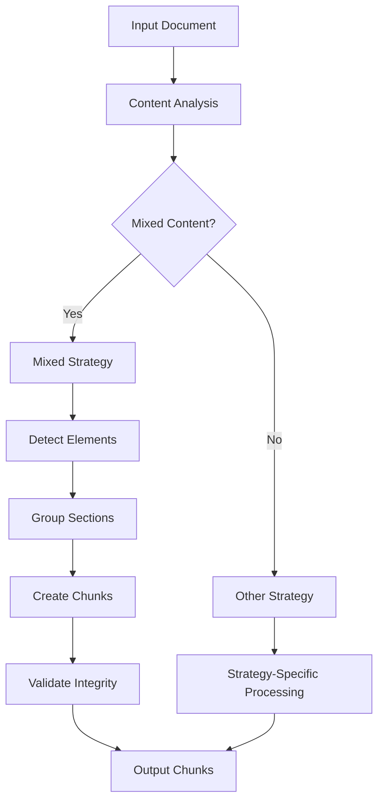
```mermaid
flowchart TD
A["Input Document"] --> B["Content Analysis"]
B --> C{"Mixed Content?"}
C --> |Yes| D["Mixed Strategy"]
C --> |No| E["Other Strategy"]
D --> F["Detect Elements"]
F --> G["Group Sections"]
G --> H["Create Chunks"]
H --> I["Validate Integrity"]
I --> J["Output Chunks"]
E --> K["Strategy-Specific Processing"]
K --> J
```

**Diagram sources**
- [mixed_strategy.py](file://markdown_chunker_legacy/chunker/strategies/mixed_strategy.py#L172-L201)
- [base.py](file://markdown_chunker_legacy/chunker/strategies/base.py#L16-L45)

## Activation Conditions

The Mixed Strategy activates under specific conditions that indicate the presence of mixed content requiring intelligent handling. These conditions are carefully balanced to ensure the strategy is applied appropriately.

### Primary Activation Criteria

The strategy evaluates several factors to determine activation:

1. **Code Ratio Constraint**: `0.1 < code_ratio < 0.7`
   - Ensures code doesn't dominate (which would trigger CodeStrategy)
   - Allows moderate code presence (at least 10%, but less than 70%)

2. **Content Diversity**: `(list_ratio > 0.1 or table_ratio > 0.1)`
   - Requires significant presence of either lists or tables
   - Prevents activation for purely text-heavy documents

3. **Text Proportion**: `text_ratio > 0.2`
   - Maintains minimum text content requirement
   - Ensures substantial prose content exists

4. **Complexity Threshold**: `complexity_score >= min_complexity`
   - Requires sufficient document complexity
   - Prevents activation for simple documents

### Quality Scoring

The strategy calculates a quality score that influences selection probability:

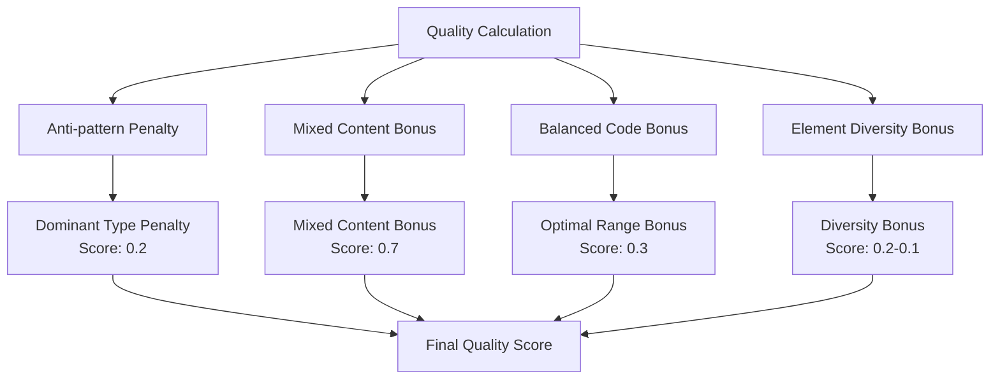
```mermaid
flowchart TD
A["Quality Calculation"] --> B["Anti-pattern Penalty"]
A --> C["Mixed Content Bonus"]
A --> D["Balanced Code Bonus"]
A --> E["Element Diversity Bonus"]
B --> F["Dominant Type Penalty<br/>Score: 0.2"]
C --> G["Mixed Content Bonus<br/>Score: 0.7"]
D --> H["Optimal Range Bonus<br/>Score: 0.3"]
E --> I["Diversity Bonus<br/>Score: 0.2-0.1"]
F --> J["Final Quality Score"]
G --> J
H --> J
I --> J
```

**Diagram sources**
- [mixed_strategy.py](file://markdown_chunker_legacy/chunker/strategies/mixed_strategy.py#L120-L170)

**Section sources**
- [mixed_strategy.py](file://markdown_chunker_legacy/chunker/strategies/mixed_strategy.py#L99-L118)
- [test_mixed_strategy.py](file://tests/chunker/test_strategies/test_mixed_strategy.py#L102-L144)

## Priority Level

The Mixed Strategy operates with a priority level of 3, positioning it as a medium-priority strategy in the selection hierarchy. This priority reflects its role as a general-purpose solution that should be considered after more specialized strategies but before fallback options.

### Priority Context

According to Requirement 6.5, the priority hierarchy follows this order:
1. **Highest Priority**: Specialized strategies (Code, List, Table)
2. **Medium Priority**: Mixed Strategy (Priority 3)
3. **Low Priority**: Structural and Sentences strategies

This prioritization ensures that:
- Documents with clear single-content-type characteristics use specialized strategies
- Mixed documents receive appropriate treatment without unnecessary fallbacks
- The system maintains predictable strategy selection behavior

### Priority Impact on Selection

The priority level affects the final selection score calculation:

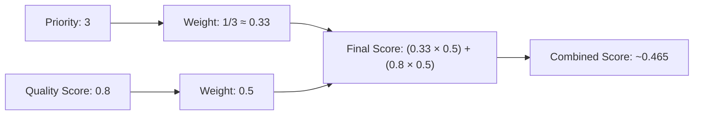
```mermaid
graph LR
A["Priority: 3"] --> B["Weight: 1/3 ≈ 0.33"]
C["Quality Score: 0.8"] --> D["Weight: 0.5"]
B --> E["Final Score: (0.33 × 0.5) + (0.8 × 0.5)"]
D --> E
E --> F["Combined Score: ~0.465"]
```

**Diagram sources**
- [base.py](file://markdown_chunker_legacy/chunker/strategies/base.py#L112-L116)

**Section sources**
- [test_mixed_strategy.py](file://tests/chunker/test_strategies/test_mixed_strategy.py#L95-L100)
- [selector.py](file://markdown_chunker_legacy/chunker/selector.py#L248-L255)

## Core Components

The Mixed Strategy consists of several interconnected components that work together to provide comprehensive mixed content handling.

### ContentElement Class

Represents individual content elements with type and position information:

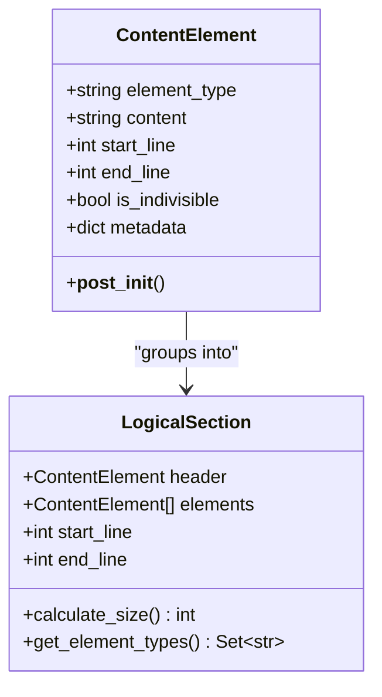
```mermaid
classDiagram
class ContentElement {
+string element_type
+string content
+int start_line
+int end_line
+bool is_indivisible
+dict metadata
+__post_init__()
}
class LogicalSection {
+ContentElement header
+ContentElement[] elements
+int start_line
+int end_line
+calculate_size() int
+get_element_types() Set~str~
}
ContentElement --> LogicalSection : "groups into"
```

**Diagram sources**
- [mixed_strategy.py](file://markdown_chunker_legacy/chunker/strategies/mixed_strategy.py#L31-L73)

### Strategy Implementation

The main MixedStrategy class inherits from BaseStrategy and implements the core chunking logic:

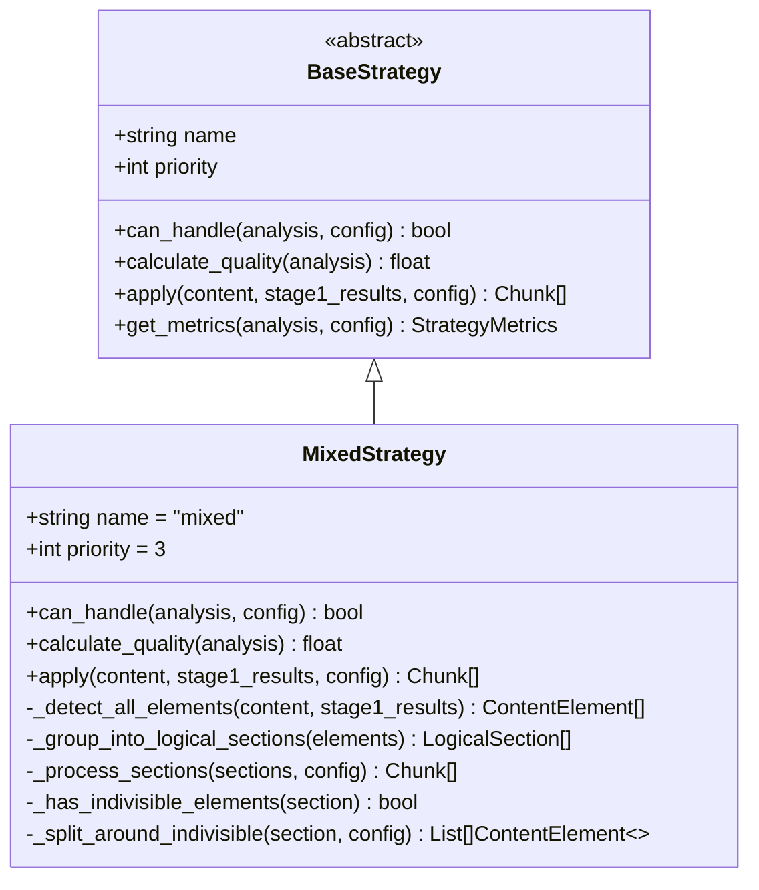
```mermaid
classDiagram
class BaseStrategy {
<<abstract>>
+string name
+int priority
+can_handle(analysis, config) bool
+calculate_quality(analysis) float
+apply(content, stage1_results, config) Chunk[]
+get_metrics(analysis, config) StrategyMetrics
}
class MixedStrategy {
+string name = "mixed"
+int priority = 3
+can_handle(analysis, config) bool
+calculate_quality(analysis) float
+apply(content, stage1_results, config) Chunk[]
-_detect_all_elements(content, stage1_results) ContentElement[]
-_group_into_logical_sections(elements) LogicalSection[]
-_process_sections(sections, config) Chunk[]
-_has_indivisible_elements(section) bool
-_split_around_indivisible(section, config) List[]ContentElement~~
}
BaseStrategy <|-- MixedStrategy
```

**Diagram sources**
- [mixed_strategy.py](file://markdown_chunker_legacy/chunker/strategies/mixed_strategy.py#L75-L97)
- [base.py](file://markdown_chunker_legacy/chunker/strategies/base.py#L16-L45)

**Section sources**
- [mixed_strategy.py](file://markdown_chunker_legacy/chunker/strategies/mixed_strategy.py#L31-L73)
- [mixed_strategy.py](file://markdown_chunker_legacy/chunker/strategies/mixed_strategy.py#L75-L97)

## Implementation Details

The Mixed Strategy employs a multi-stage approach to handle complex documents effectively.

### Element Detection Process

The strategy begins by detecting all content elements in the document:

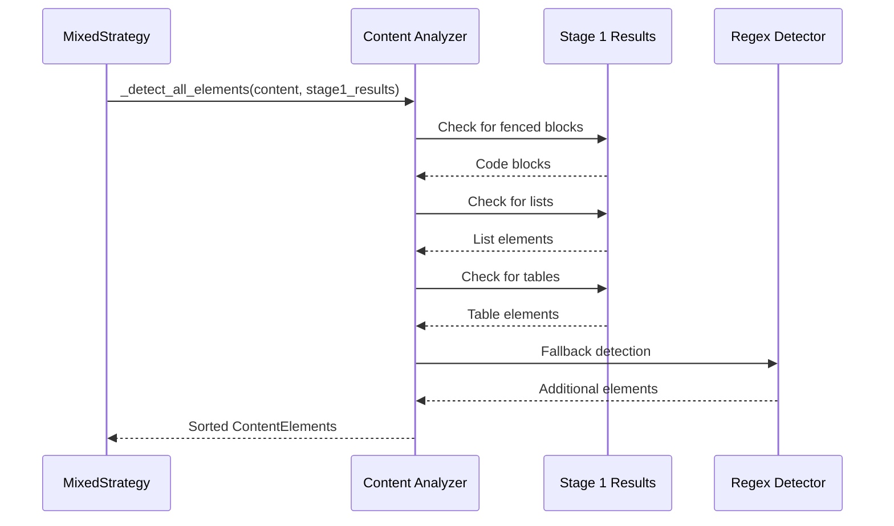
```mermaid
sequenceDiagram
participant MS as MixedStrategy
participant ContentAnalyzer as Content Analyzer
participant Stage1 as Stage 1 Results
participant Regex as Regex Detector
MS->>ContentAnalyzer : _detect_all_elements(content, stage1_results)
ContentAnalyzer->>Stage1 : Check for fenced blocks
Stage1-->>ContentAnalyzer : Code blocks
ContentAnalyzer->>Stage1 : Check for lists
Stage1-->>ContentAnalyzer : List elements
ContentAnalyzer->>Stage1 : Check for tables
Stage1-->>ContentAnalyzer : Table elements
ContentAnalyzer->>Regex : Fallback detection
Regex-->>ContentAnalyzer : Additional elements
ContentAnalyzer-->>MS : Sorted ContentElements
```

**Diagram sources**
- [mixed_strategy.py](file://markdown_chunker_legacy/chunker/strategies/mixed_strategy.py#L203-L359)

### Logical Section Grouping

After detection, elements are grouped into logical sections based on headers:

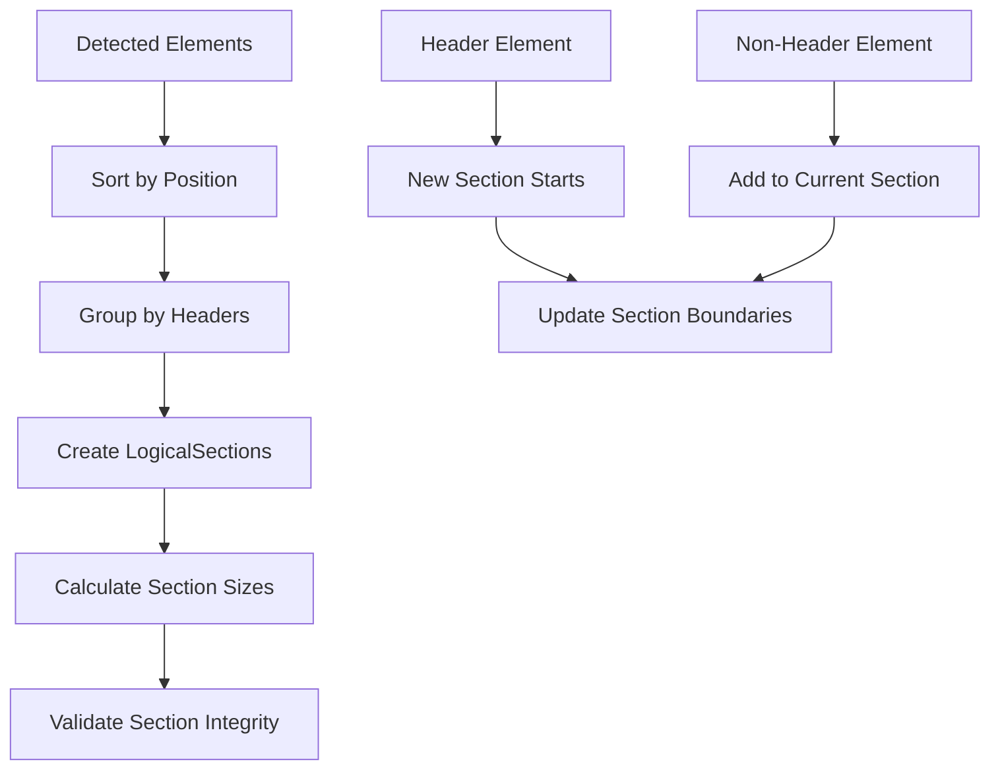
```mermaid
flowchart TD
A["Detected Elements"] --> B["Sort by Position"]
B --> C["Group by Headers"]
C --> D["Create LogicalSections"]
D --> E["Calculate Section Sizes"]
E --> F["Validate Section Integrity"]
G["Header Element"] --> H["New Section Starts"]
I["Non-Header Element"] --> J["Add to Current Section"]
H --> K["Update Section Boundaries"]
J --> K
```

**Diagram sources**
- [mixed_strategy.py](file://markdown_chunker_legacy/chunker/strategies/mixed_strategy.py#L469-L513)

### Chunk Creation Algorithm

The strategy creates chunks using intelligent splitting logic:

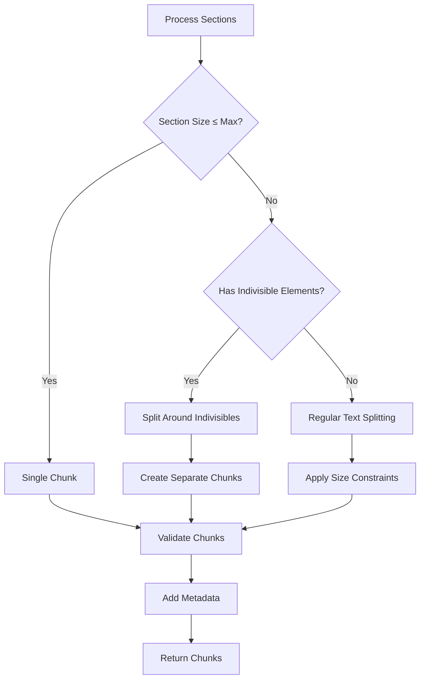
```mermaid
flowchart TD
A["Process Sections"] --> B{"Section Size ≤ Max?"}
B --> |Yes| C["Single Chunk"]
B --> |No| D{"Has Indivisible Elements?"}
D --> |Yes| E["Split Around Indivisibles"]
D --> |No| F["Regular Text Splitting"]
E --> G["Create Separate Chunks"]
F --> H["Apply Size Constraints"]
C --> I["Validate Chunks"]
G --> I
H --> I
I --> J["Add Metadata"]
J --> K["Return Chunks"]
```

**Diagram sources**
- [mixed_strategy.py](file://markdown_chunker_legacy/chunker/strategies/mixed_strategy.py#L515-L552)

**Section sources**
- [mixed_strategy.py](file://markdown_chunker_legacy/chunker/strategies/mixed_strategy.py#L203-L359)
- [mixed_strategy.py](file://markdown_chunker_legacy/chunker/strategies/mixed_strategy.py#L469-L552)

## Content Detection and Analysis

The Mixed Strategy employs sophisticated content detection mechanisms to identify and categorize different element types within documents.

### Element Type Recognition

The strategy recognizes six primary content types:

| Element Type | Detection Method | Indivisibility | Metadata |
|--------------|------------------|----------------|----------|
| **Header** | Regex pattern `^#{1,6}\s+` | No | Level, content |
| **Code** | Stage 1 fenced blocks | Yes | Language, fence type |
| **List** | Stage 1 lists or regex | Yes | Type, item count, nesting |
| **Table** | Stage 1 tables or regex | Yes | Columns, rows, alignment |
| **Text** | Paragraph gaps | No | Content only |
| **Indivisible** | Atomic elements | Yes | Type-specific |

### Detection Fallback Mechanism

The strategy implements a robust fallback system:

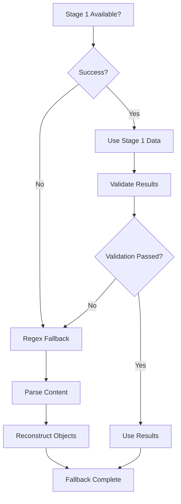
```mermaid
flowchart TD
A["Stage 1 Available?"] --> B{"Success?"}
B --> |Yes| C["Use Stage 1 Data"]
B --> |No| D["Regex Fallback"]
C --> E["Validate Results"]
D --> F["Parse Content"]
E --> G{"Validation Passed?"}
G --> |Yes| H["Use Results"]
G --> |No| D
F --> I["Reconstruct Objects"]
I --> J["Fallback Complete"]
H --> J
```

**Diagram sources**
- [mixed_strategy.py](file://markdown_chunker_legacy/chunker/strategies/mixed_strategy.py#L255-L351)

### Content Reconstruction

For Stage 1 elements, the strategy reconstructs content to maintain integrity:

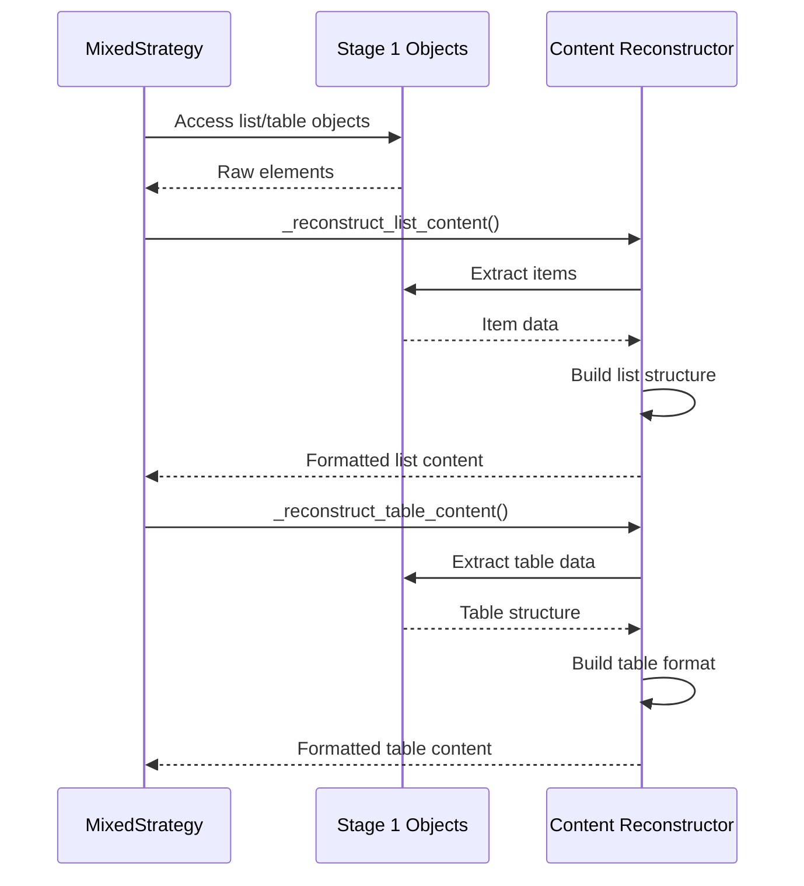
```mermaid
sequenceDiagram
participant MS as MixedStrategy
participant Stage1 as Stage 1 Objects
participant Reconstructor as Content Reconstructor
MS->>Stage1 : Access list/table objects
Stage1-->>MS : Raw elements
MS->>Reconstructor : _reconstruct_list_content()
Reconstructor->>Stage1 : Extract items
Stage1-->>Reconstructor : Item data
Reconstructor->>Reconstructor : Build list structure
Reconstructor-->>MS : Formatted list content
MS->>Reconstructor : _reconstruct_table_content()
Reconstructor->>Stage1 : Extract table data
Stage1-->>Reconstructor : Table structure
Reconstructor->>Reconstructor : Build table format
Reconstructor-->>MS : Formatted table content
```

**Diagram sources**
- [mixed_strategy.py](file://markdown_chunker_legacy/chunker/strategies/mixed_strategy.py#L361-L402)

**Section sources**
- [mixed_strategy.py](file://markdown_chunker_legacy/chunker/strategies/mixed_strategy.py#L203-L359)
- [test_mixed_strategy.py](file://tests/chunker/test_strategies/test_mixed_strategy.py#L498-L560)

## Chunk Creation Process

The Mixed Strategy implements a sophisticated chunk creation process that balances content preservation with size constraints.

### Section-Based Processing

The strategy processes documents section by section, respecting semantic boundaries:

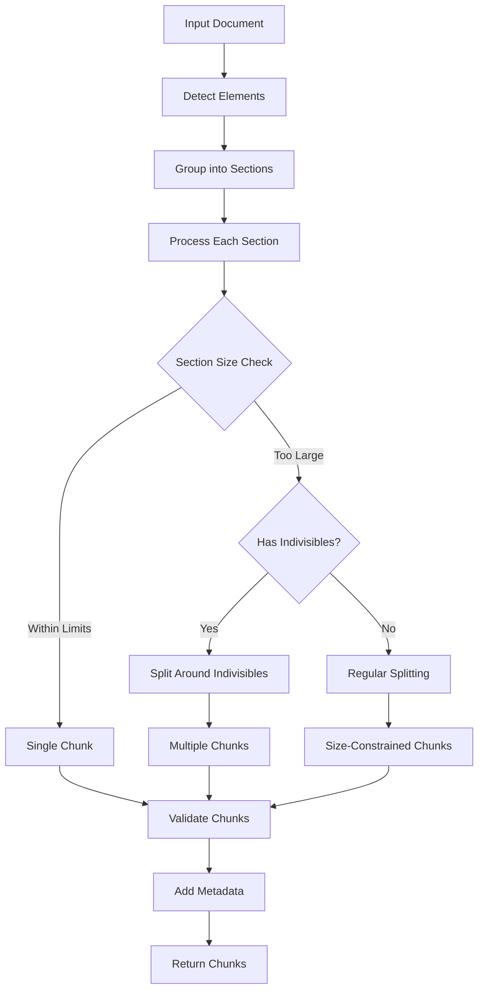
```mermaid
flowchart TD
A["Input Document"] --> B["Detect Elements"]
B --> C["Group into Sections"]
C --> D["Process Each Section"]
D --> E{"Section Size Check"}
E --> |Within Limits| F["Single Chunk"]
E --> |Too Large| G{"Has Indivisibles?"}
G --> |Yes| H["Split Around Indivisibles"]
G --> |No| I["Regular Splitting"]
H --> J["Multiple Chunks"]
I --> K["Size-Constrained Chunks"]
F --> L["Validate Chunks"]
J --> L
K --> L
L --> M["Add Metadata"]
M --> N["Return Chunks"]
```

**Diagram sources**
- [mixed_strategy.py](file://markdown_chunker_legacy/chunker/strategies/mixed_strategy.py#L515-L552)

### Indivisible Element Handling

The strategy treats certain elements as indivisible to maintain content integrity:

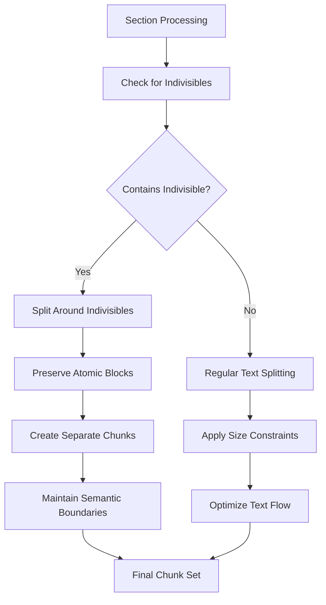
```mermaid
flowchart TD
A["Section Processing"] --> B["Check for Indivisibles"]
B --> C{"Contains Indivisible?"}
C --> |Yes| D["Split Around Indivisibles"]
C --> |No| E["Regular Text Splitting"]
D --> F["Preserve Atomic Blocks"]
F --> G["Create Separate Chunks"]
E --> H["Apply Size Constraints"]
G --> I["Maintain Semantic Boundaries"]
H --> J["Optimize Text Flow"]
I --> K["Final Chunk Set"]
J --> K
```

**Diagram sources**
- [mixed_strategy.py](file://markdown_chunker_legacy/chunker/strategies/mixed_strategy.py#L554-L605)

### Metadata Enrichment

Each chunk receives comprehensive metadata for downstream processing:

| Metadata Field | Purpose | Example Values |
|----------------|---------|----------------|
| **content_type** | Strategy identification | "mixed" |
| **element_types** | Content composition | "code,list,text" |
| **element_count** | Total elements | 5 |
| **has_code** | Presence indicator | true/false |
| **has_list** | Presence indicator | true/false |
| **has_table** | Presence indicator | true/false |
| **allow_oversize** | Size exception flag | true/false |
| **oversize_reason** | Exception reason | "indivisible_element" |

**Section sources**
- [mixed_strategy.py](file://markdown_chunker_legacy/chunker/strategies/mixed_strategy.py#L515-L702)
- [test_mixed_strategy.py](file://tests/chunker/test_strategies/test_mixed_strategy.py#L239-L242)

## Handling Mixed Content Types

The Mixed Strategy excels at managing documents with complex content combinations, particularly those with mixed elements like code blocks within list items or tables in sections.

### Code Blocks in Lists

Documents with code blocks embedded within list items require careful handling to maintain both list structure and code integrity:

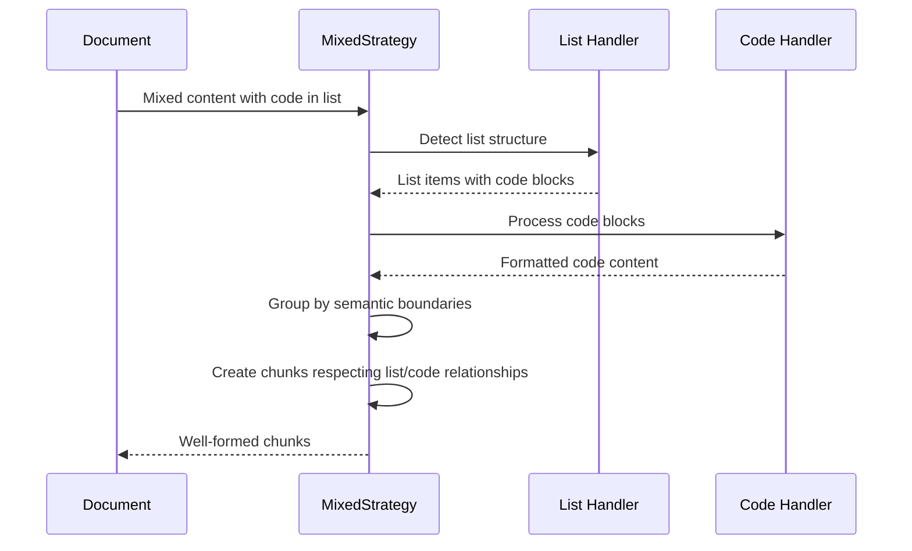
```mermaid
sequenceDiagram
participant Doc as Document
participant MS as MixedStrategy
participant List as List Handler
participant Code as Code Handler
Doc->>MS : Mixed content with code in list
MS->>List : Detect list structure
List-->>MS : List items with code blocks
MS->>Code : Process code blocks
Code-->>MS : Formatted code content
MS->>MS : Group by semantic boundaries
MS->>MS : Create chunks respecting list/code relationships
MS-->>Doc : Well-formed chunks
```

**Diagram sources**
- [mixed_content.md](file://tests/parser/fixtures/nested/mixed_content.md#L1-L35)

### Table Integration Challenges

Tables present unique challenges in mixed content scenarios:

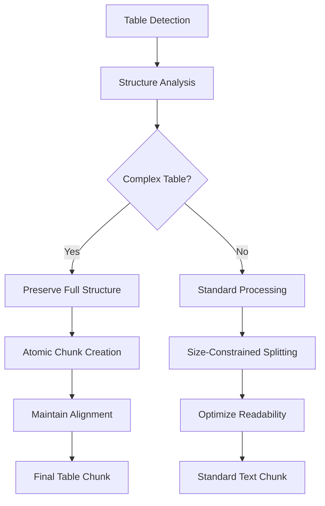
```mermaid
flowchart TD
A["Table Detection"] --> B["Structure Analysis"]
B --> C{"Complex Table?"}
C --> |Yes| D["Preserve Full Structure"]
C --> |No| E["Standard Processing"]
D --> F["Atomic Chunk Creation"]
E --> G["Size-Constrained Splitting"]
F --> H["Maintain Alignment"]
G --> I["Optimize Readability"]
H --> J["Final Table Chunk"]
I --> K["Standard Text Chunk"]
```

**Diagram sources**
- [mixed_strategy.py](file://markdown_chunker_legacy/chunker/strategies/mixed_strategy.py#L310-L331)

### Section Boundary Preservation

The strategy maintains semantic boundaries while allowing flexibility for mixed content:

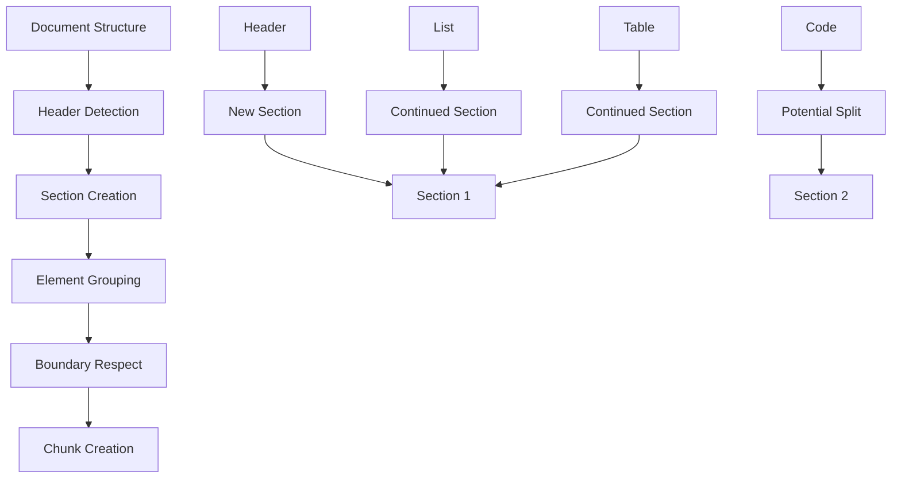
```mermaid
graph TD
A["Document Structure"] --> B["Header Detection"]
B --> C["Section Creation"]
C --> D["Element Grouping"]
D --> E["Boundary Respect"]
E --> F["Chunk Creation"]
G["Header"] --> H["New Section"]
I["List"] --> J["Continued Section"]
K["Table"] --> L["Continued Section"]
M["Code"] --> N["Potential Split"]
H --> O["Section 1"]
J --> O
L --> O
N --> P["Section 2"]
```

**Diagram sources**
- [mixed_strategy.py](file://markdown_chunker_legacy/chunker/strategies/mixed_strategy.py#L469-L513)

**Section sources**
- [mixed.md](file://tests/fixtures/mixed.md#L1-L51)
- [mixed_content.md](file://tests/parser/fixtures/nested/mixed_content.md#L1-L35)

## Configuration Examples

The Mixed Strategy responds to various configuration parameters that influence its behavior and effectiveness.

### Standard Mixed Content Configuration

```python
from markdown_chunker import ChunkConfig

# Basic mixed content configuration
config = ChunkConfig(
    max_chunk_size=2048,      # Moderate chunk size
    min_chunk_size=256,       # Minimum size constraint
    target_chunk_size=1024,   # Target size
    min_complexity=0.3,       # Minimum complexity threshold
    allow_oversize=True,      # Allow oversized chunks
    preserve_code_blocks=True, # Preserve code integrity
    preserve_tables=True,     # Maintain table structure
    preserve_list_hierarchy=True # Keep list structure
)
```

### Code-Heavy Mixed Documents

For documents with significant code content but mixed elements:

```python
# Configuration optimized for code-heavy mixed documents
config = ChunkConfig(
    max_chunk_size=3072,      # Larger chunks for code
    min_complexity=0.4,       # Higher complexity threshold
    code_ratio_threshold=0.3, # Lower code threshold for mixed
    preserve_code_blocks=True,
    overlap_size=150          # Moderate overlap
)
```

### Documentation-Focused Configuration

For general documentation with balanced content types:

```python
# Documentation-focused mixed strategy
config = ChunkConfig(
    max_chunk_size=2500,      # Balanced chunk size
    min_complexity=0.2,       # Lower complexity threshold
    preserve_code_blocks=True,
    preserve_tables=True,
    preserve_list_hierarchy=True,
    enable_overlap=True,      # Enable overlap for context
    overlap_size=100         # Small overlap
)
```

### Performance-Optimized Configuration

For large documents requiring efficient processing:

```python
# Performance-optimized mixed strategy
config = ChunkConfig(
    max_chunk_size=4096,      # Maximum chunk size
    min_complexity=0.5,       # Higher complexity requirement
    allow_oversize=True,      # Allow oversized chunks
    enable_fallback=False,    # Disable fallback for speed
    block_based_splitting=True # Use block-based splitting
)
```

**Section sources**
- [types.py](file://markdown_chunker_legacy/chunker/types.py#L500-L626)

## Performance Considerations

The Mixed Strategy implements several performance optimizations to handle complex documents efficiently while maintaining accuracy.

### Complexity Management

The strategy employs complexity scoring to manage computational overhead:

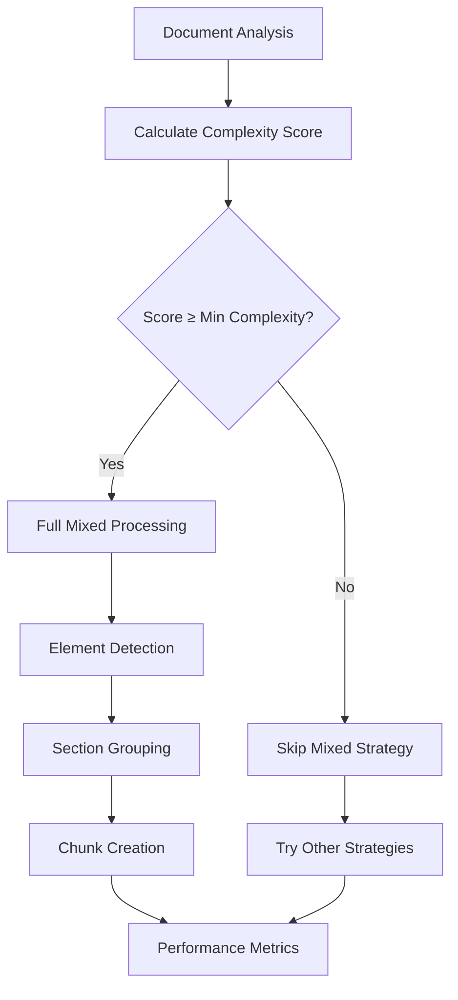
```mermaid
flowchart TD
A["Document Analysis"] --> B["Calculate Complexity Score"]
B --> C{"Score ≥ Min Complexity?"}
C --> |Yes| D["Full Mixed Processing"]
C --> |No| E["Skip Mixed Strategy"]
D --> F["Element Detection"]
F --> G["Section Grouping"]
G --> H["Chunk Creation"]
E --> I["Try Other Strategies"]
H --> J["Performance Metrics"]
I --> J
```

**Diagram sources**
- [mixed_strategy.py](file://markdown_chunker_legacy/chunker/strategies/mixed_strategy.py#L115-L118)

### Memory Optimization

The strategy minimizes memory usage through efficient data structures:

| Optimization Technique | Benefit | Implementation |
|----------------------|---------|----------------|
| **Lazy Loading** | Reduced startup time | Elements processed on-demand |
| **Streaming Processing** | Lower memory footprint | Sections processed individually |
| **Efficient Sorting** | Faster element grouping | Optimized sorting algorithms |
| **Metadata Caching** | Reduced computation | Cached element type information |

### Processing Time Optimization

The strategy implements several techniques to minimize processing time:

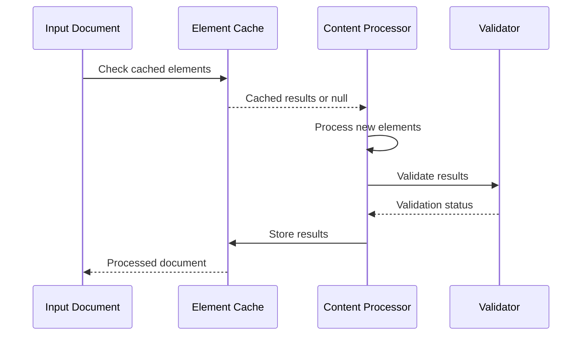
```mermaid
sequenceDiagram
participant Input as Input Document
participant Cache as Element Cache
participant Processor as Content Processor
participant Validator as Validator
Input->>Cache : Check cached elements
Cache-->>Processor : Cached results or null
Processor->>Processor : Process new elements
Processor->>Validator : Validate results
Validator-->>Processor : Validation status
Processor->>Cache : Store results
Cache-->>Input : Processed document
```

**Diagram sources**
- [mixed_strategy.py](file://markdown_chunker_legacy/chunker/strategies/mixed_strategy.py#L203-L359)

### Scalability Considerations

The strategy scales effectively with document size:

- **Linear Element Detection**: O(n) complexity for element identification
- **Logarithmic Sorting**: O(n log n) for element ordering
- **Constant-Time Metadata**: O(1) access to element metadata
- **Adaptive Chunking**: Scales with content complexity

**Section sources**
- [mixed_strategy.py](file://markdown_chunker_legacy/chunker/strategies/mixed_strategy.py#L203-L359)
- [test_mixed_strategy_properties.py](file://tests/chunker/test_mixed_strategy_properties.py#L521-L558)

## Common Issues and Solutions

The Mixed Strategy addresses several common challenges encountered when processing mixed content documents.

### Optimal Chunk Boundary Determination

Determining optimal chunk boundaries in heterogeneous content presents several challenges:

#### Challenge: Semantic vs. Size Constraints

**Problem**: Balancing semantic boundaries with size constraints can lead to unnatural splits.

**Solution**: The strategy prioritizes semantic boundaries while allowing controlled size violations for indivisible elements.

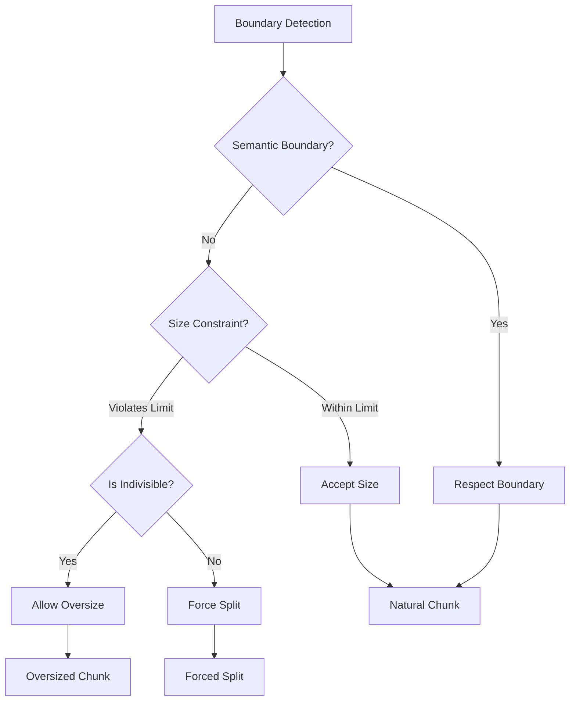
```mermaid
flowchart TD
A["Boundary Detection"] --> B{"Semantic Boundary?"}
B --> |Yes| C["Respect Boundary"]
B --> |No| D{"Size Constraint?"}
D --> |Violates Limit| E{"Is Indivisible?"}
D --> |Within Limit| F["Accept Size"]
E --> |Yes| G["Allow Oversize"]
E --> |No| H["Force Split"]
C --> I["Natural Chunk"]
F --> I
G --> J["Oversized Chunk"]
H --> K["Forced Split"]
```

**Diagram sources**
- [mixed_strategy.py](file://markdown_chunker_legacy/chunker/strategies/mixed_strategy.py#L533-L552)

#### Challenge: Code Block Integrity

**Problem**: Code blocks may be split across chunks, breaking syntax validity.

**Solution**: Code blocks are treated as indivisible elements, preventing splitting.

### Content Loss Prevention

The strategy implements multiple safeguards to prevent content loss:

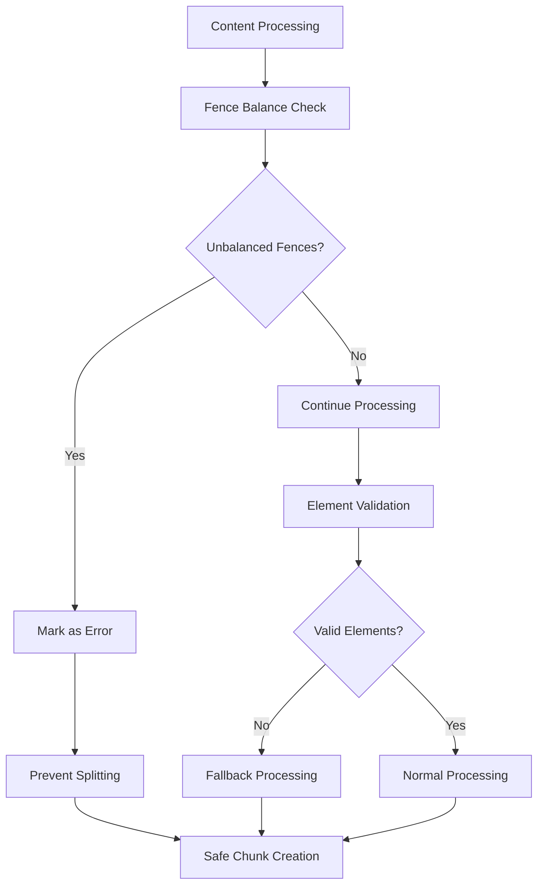
```mermaid
flowchart TD
A["Content Processing"] --> B["Fence Balance Check"]
B --> C{"Unbalanced Fences?"}
C --> |Yes| D["Mark as Error"]
C --> |No| E["Continue Processing"]
D --> F["Prevent Splitting"]
E --> G["Element Validation"]
G --> H{"Valid Elements?"}
H --> |No| I["Fallback Processing"]
H --> |Yes| J["Normal Processing"]
F --> K["Safe Chunk Creation"]
I --> K
J --> K
```

**Diagram sources**
- [base.py](file://markdown_chunker_legacy/chunker/strategies/base.py#L261-L294)

### Mixed Content Type Conflicts

Different content types may conflict in mixed documents:

#### List-Code Conflicts

**Issue**: Lists containing code blocks require careful handling to maintain both structures.

**Resolution**: The strategy detects nested content and creates appropriate chunk boundaries.

#### Table-Code Conflicts

**Issue**: Tables with code cells need special handling to preserve formatting.

**Resolution**: Tables are processed as atomic units, with code cells maintained within table structure.

### Performance Optimization Issues

#### Large Document Handling

**Challenge**: Processing very large mixed documents efficiently.

**Solution**: The strategy implements streaming processing and lazy evaluation to handle large documents without excessive memory usage.

#### Complex Document Structures

**Challenge**: Documents with deeply nested or complex structures.

**Solution**: The strategy uses iterative processing with configurable depth limits and timeout mechanisms.

**Section sources**
- [mixed_strategy.py](file://markdown_chunker_legacy/chunker/strategies/mixed_strategy.py#L199-L201)
- [base.py](file://markdown_chunker_legacy/chunker/strategies/base.py#L180-L241)

## Testing and Validation

The Mixed Strategy undergoes comprehensive testing to ensure reliability and accuracy across diverse document types.

### Unit Testing Framework

The strategy includes extensive unit tests covering core functionality:

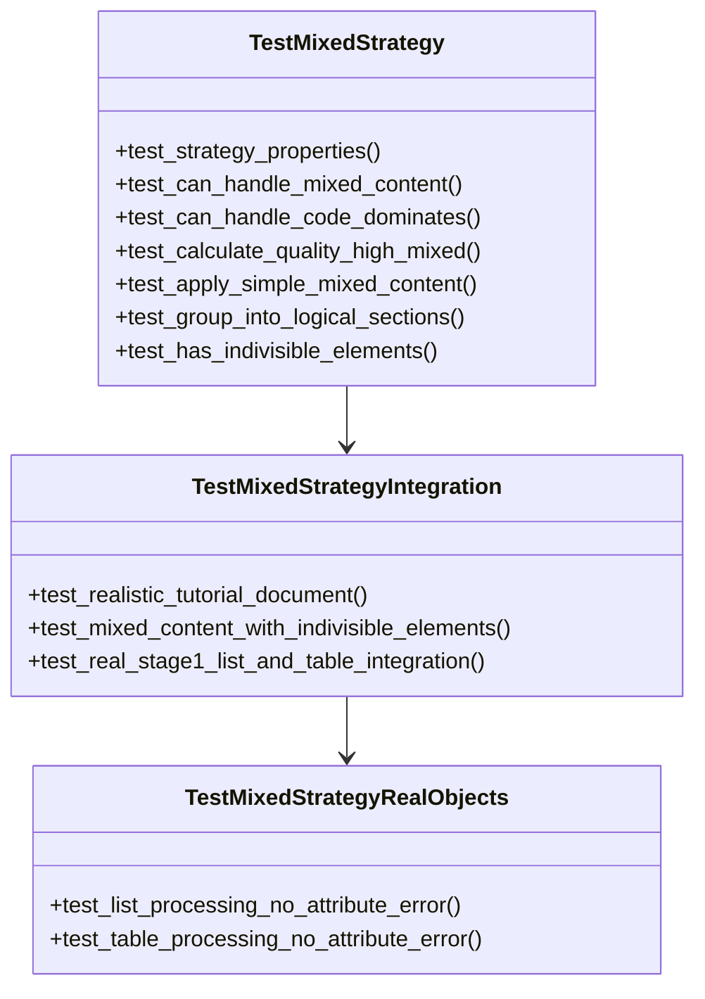
```mermaid
classDiagram
class TestMixedStrategy {
+test_strategy_properties()
+test_can_handle_mixed_content()
+test_can_handle_code_dominates()
+test_calculate_quality_high_mixed()
+test_apply_simple_mixed_content()
+test_group_into_logical_sections()
+test_has_indivisible_elements()
}
class TestMixedStrategyIntegration {
+test_realistic_tutorial_document()
+test_mixed_content_with_indivisible_elements()
+test_real_stage1_list_and_table_integration()
}
class TestMixedStrategyRealObjects {
+test_list_processing_no_attribute_error()
+test_table_processing_no_attribute_error()
}
TestMixedStrategy --> TestMixedStrategyIntegration
TestMixedStrategyIntegration --> TestMixedStrategyRealObjects
```

**Diagram sources**
- [test_mixed_strategy.py](file://tests/chunker/test_strategies/test_mixed_strategy.py#L92-L560)

### Property-Based Testing

The strategy employs property-based testing to validate correctness across a wide range of inputs:

#### Hypothesis Strategies

The testing framework generates diverse mixed content documents:

```mermaid
flowchart TD
A["Property-Based Testing"] --> B["Code Section Generator"]
A --> C["List Section Generator"]
A --> D["Table Section Generator"]
A --> E["Text Section Generator"]
B --> F["Random Code Blocks"]
C --> G["Random Lists"]
D --> H["Random Tables"]
E --> I["Random Text"]
F --> J["Mixed Document Generator"]
G --> J
H --> J
I --> J
J --> K["Property Validation"]
```

**Diagram sources**
- [test_mixed_strategy_properties.py](file://tests/chunker/test_mixed_strategy_properties.py#L30-L148)

### Validation Properties

The strategy tests several critical properties:

| Property | Description | Validation Method |
|----------|-------------|------------------|
| **Content Preservation** | All content preserved across chunks | Word-level comparison |
| **Section Boundaries** | Headers and sections preserved | Header extraction and comparison |
| **Appropriate Strategies** | Mixed strategy used for mixed content | Strategy selection validation |
| **Metadata Consistency** | Chunk metadata consistent and accurate | Metadata validation |
| **Complex Document Handling** | Handles complex mixed documents | Large document testing |

### Integration Testing

The strategy undergoes integration testing with real-world documents:

```mermaid
sequenceDiagram
participant Test as Integration Test
participant Chunker as MarkdownChunker
participant Mixed as MixedStrategy
participant Validator as Content Validator
Test->>Chunker : Process mixed document
Chunker->>Mixed : Apply mixed strategy
Mixed->>Mixed : Detect elements
Mixed->>Mixed : Group sections
Mixed->>Mixed : Create chunks
Mixed-->>Chunker : Return chunks
Chunker->>Validator : Validate results
Validator-->>Test : Validation report
```

**Diagram sources**
- [test_mixed_strategy.py](file://tests/chunker/test_strategies/test_mixed_strategy.py#L311-L496)

**Section sources**
- [test_mixed_strategy.py](file://tests/chunker/test_strategies/test_mixed_strategy.py#L1-L560)
- [test_mixed_strategy_properties.py](file://tests/chunker/test_mixed_strategy_properties.py#L1-L558)

## Best Practices

Effective use of the Mixed Strategy requires understanding its strengths, limitations, and optimal usage patterns.

### When to Use Mixed Strategy

The Mixed Strategy is most effective for:

1. **Documentation with Multiple Content Types**: Documents containing code, lists, tables, and text
2. **Tutorial Materials**: Educational content with examples and explanations
3. **API Documentation**: Reference materials with code samples and structured information
4. **Technical Guides**: Documents combining prose with technical examples

### Configuration Guidelines

#### Size Configuration

- **Max Chunk Size**: Start with 2048-4096 characters for mixed content
- **Min Chunk Size**: Set to 256-512 for balanced processing
- **Target Size**: Use 1024-2048 for optimal readability

#### Content Preservation Settings

- **preserve_code_blocks**: Always enable for code-containing documents
- **preserve_tables**: Enable for documents with tabular data
- **preserve_list_hierarchy**: Essential for list-heavy content

#### Complexity Thresholds

- **min_complexity**: Start with 0.3 for general mixed content
- **Adjust based on document type**: Higher values for simpler documents

### Performance Optimization

#### Large Document Handling

For large documents:
- Enable streaming processing when available
- Use appropriate chunk size limits
- Monitor memory usage during processing

#### Mixed Content Optimization

For documents with complex mixed content:
- Increase complexity threshold for simpler documents
- Use targeted configuration for specific content types
- Consider preprocessing for extremely complex documents

### Error Handling

#### Common Error Patterns

1. **Unbalanced Code Fences**: Indicates splitting of code blocks
   - Solution: Enable code block preservation
   - Prevention: Use appropriate chunk size limits

2. **Missing Content**: Content appears to be lost
   - Solution: Check content preservation settings
   - Debug: Enable detailed logging

3. **Poor Chunk Quality**: Chunks are too large or small
   - Solution: Adjust size configuration
   - Optimization: Use content-aware sizing

### Monitoring and Debugging

#### Strategy Selection Monitoring

Monitor strategy selection to ensure appropriate strategy usage:

```python
# Enable detailed logging for strategy selection
import logging
logging.getLogger('markdown_chunker.chunker.selector').setLevel(logging.DEBUG)

# Process document and check strategy
result = chunker.chunk(document, include_analysis=True)
print(f"Strategy used: {result.strategy_used}")
print(f"Chunks created: {len(result.chunks)}")
```

#### Content Quality Assessment

Assess chunk quality using metadata:

```python
# Analyze chunk composition
for chunk in result.chunks:
    element_types = chunk.metadata.get('element_types', '').split(',')
    print(f"Chunk: {chunk.size} chars, types: {element_types}")
```

### Integration Patterns

#### RAG System Integration

For Retrieval-Augmented Generation systems:

```python
# Optimized configuration for RAG
rag_config = ChunkConfig(
    max_chunk_size=1024,      # Smaller chunks for better retrieval
    min_chunk_size=128,       # Minimum size for meaningful content
    target_chunk_size=512,    # Balanced size for RAG
    overlap_size=100,         # Moderate overlap for context
    enable_overlap=True,      # Enable overlap for RAG
    min_complexity=0.2,       # Lower complexity for varied content
    preserve_code_blocks=True # Important for technical content
)
```

#### Documentation Pipeline Integration

For documentation processing pipelines:

```python
# Documentation-optimized configuration
doc_config = ChunkConfig(
    max_chunk_size=2048,      # Larger chunks for documentation
    min_complexity=0.3,       # Moderate complexity for mixed docs
    preserve_code_blocks=True,
    preserve_tables=True,
    preserve_list_hierarchy=True,
    allow_oversize=True       # Allow oversized chunks for integrity
)
```

**Section sources**
- [types.py](file://markdown_chunker_legacy/chunker/types.py#L500-L626)
- [core.py](file://markdown_chunker_legacy/chunker/core.py#L41-L118)