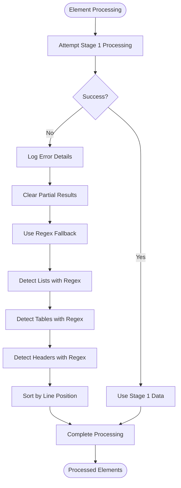

# Mixed Strategy

<cite>
**Referenced Files in This Document**
- [mixed_strategy.py](file://markdown_chunker/chunker/strategies/mixed_strategy.py)
- [selector.py](file://markdown_chunker/chunker/selector.py)
- [base.py](file://markdown_chunker/chunker/strategies/base.py)
- [logical_blocks.py](file://markdown_chunker/chunker/logical_blocks.py)
- [analyzer.py](file://markdown_chunker/parser/analyzer.py)
- [core.py](file://markdown_chunker/chunker/core.py)
- [test_mixed_strategy_properties.py](file://tests/chunker/test_mixed_strategy_properties.py)
- [test_mixed_strategy_stage1_integration.py](file://tests/chunker/test_mixed_strategy_stage1_integration.py)
- [mixed.md](file://tests/fixtures/mixed.md)
- [list_heavy.md](file://tests/fixtures/list_heavy.md)
- [code_heavy.md](file://tests/fixtures/code_heavy.md)
</cite>

## Table of Contents
1. [Introduction](#introduction)
2. [Purpose and Design Philosophy](#purpose-and-design-philosophy)
3. [Core Components](#core-components)
4. [Strategy Selection Logic](#strategy-selection-logic)
5. [Content Detection and Analysis](#content-detection-and-analysis)
6. [Element Processing Pipeline](#element-processing-pipeline)
7. [Section Building and Chunking](#section-building-and-chunking)
8. [Error Handling and Fallback Mechanisms](#error-handling-and-fallback-mechanisms)
9. [Integration with Strategy Selector](#integration-with-strategy-selector)
10. [Performance Considerations](#performance-considerations)
11. [Common Issues and Solutions](#common-issues-and-solutions)
12. [Best Practices](#best-practices)
13. [Conclusion](#conclusion)

## Introduction

The Mixed Strategy is a sophisticated chunking approach designed specifically for documents containing multiple content types in significant proportions. Unlike specialized strategies that focus on single content types (code, lists, tables), the Mixed Strategy intelligently handles documents with diverse semantic elements while preserving their inherent relationships and structure.

This strategy serves as the cornerstone for documents that don't fit neatly into specialized categories, enabling semantic-aware chunking that maintains the integrity of complex markdown documents containing code blocks, lists, tables, and text paragraphs in varying proportions.

## Purpose and Design Philosophy

### Core Mission

The Mixed Strategy's primary purpose is to provide intelligent, semantic-aware chunking for documents with mixed content types. It recognizes that many real-world markdown documents contain multiple element types that work together to convey information, and it preserves these relationships during the chunking process.

### Design Principles

1. **Semantic Preservation**: Maintain relationships between related content elements
2. **Intelligent Detection**: Automatically identify and categorize different content types
3. **Flexible Processing**: Adapt to various content combinations and proportions
4. **Robust Fallbacks**: Gracefully handle parsing failures and edge cases
5. **Structure Awareness**: Respect document hierarchy and logical organization

### Ideal Use Cases

The Mixed Strategy is ideal for:
- Technical documentation with code examples, lists, and tables
- API reference materials with examples and parameter descriptions
- Tutorial documents combining explanations with code snippets
- Documentation that includes both narrative text and structured data
- Complex documents with multiple content types in significant proportions

## Core Components

The Mixed Strategy consists of several interconnected components that work together to achieve semantic-aware chunking:


**Diagram sources**
- [mixed_strategy.py](file://markdown_chunker/chunker/strategies/mixed_strategy.py#L31-L73)
- [selector.py](file://markdown_chunker/chunker/selector.py#L24-L322)

**Section sources**
- [mixed_strategy.py](file://markdown_chunker/chunker/strategies/mixed_strategy.py#L31-L73)
- [base.py](file://markdown_chunker/chunker/strategies/base.py#L16-L380)

## Strategy Selection Logic

### Content Analysis Metrics

The Mixed Strategy evaluates documents based on several key metrics extracted from Stage 1 analysis:

| Metric | Threshold | Purpose |
|--------|-----------|---------|
| Code Ratio | 0.1 < ratio < 0.7 | Ensures mixed content isn't dominated by code |
| List Ratio | > 0.1 | Indicates presence of structured content |
| Table Ratio | > 0.1 | Indicates tabular data presence |
| Text Ratio | > 0.2 | Ensures sufficient narrative content |
| Complexity Score | ≥ min_complexity | Validates document complexity |

### Selection Criteria

The strategy determines applicability using the following logic:


**Diagram sources**
- [mixed_strategy.py](file://markdown_chunker/chunker/strategies/mixed_strategy.py#L99-L118)

### Quality Scoring Algorithm

The Mixed Strategy calculates quality scores based on content balance and diversity:


**Diagram sources**
- [mixed_strategy.py](file://markdown_chunker/chunker/strategies/mixed_strategy.py#L120-L170)

**Section sources**
- [mixed_strategy.py](file://markdown_chunker/chunker/strategies/mixed_strategy.py#L99-L170)
- [analyzer.py](file://markdown_chunker/parser/analyzer.py#L224-L294)

## Content Detection and Analysis

### Element Detection Pipeline

The Mixed Strategy employs a sophisticated multi-stage detection pipeline that prioritizes Stage 1 data while maintaining robust fallback mechanisms:


**Diagram sources**
- [mixed_strategy.py](file://markdown_chunker/chunker/strategies/mixed_strategy.py#L203-L359)

### Content Element Types

The strategy recognizes six distinct content element types, each with specific processing characteristics:

| Element Type | Indivisible | Metadata | Processing Notes |
|--------------|-------------|----------|------------------|
| Header | No | Level, Text | Starts new logical sections |
| Code | Yes | Language, Fence type | Atomic, cannot be split |
| List | Yes | Type, Item count, Nesting | Atomic, preserves structure |
| Table | Yes | Columns, Rows, Headers | Atomic, preserves layout |
| Text | No | None | Paragraph-level content |

### Stage 1 Integration

The Mixed Strategy leverages Stage 1 analysis data when available, falling back to regex detection when necessary:


**Diagram sources**
- [mixed_strategy.py](file://markdown_chunker/chunker/strategies/mixed_strategy.py#L203-L359)

**Section sources**
- [mixed_strategy.py](file://markdown_chunker/chunker/strategies/mixed_strategy.py#L203-L359)

## Element Processing Pipeline

### Content Element Reconstruction

For Stage 1 elements, the Mixed Strategy reconstructs content to preserve formatting and structure:

#### List Reconstruction
- Maintains indentation levels
- Preserves task list checkboxes
- Recreates original list markers
- Handles nested list structures

#### Table Reconstruction
- Preserves column alignments
- Maintains header structure
- Restores separator rows
- Keeps data cell formatting

### Text Paragraph Insertion

The strategy intelligently inserts text paragraphs between other elements to maintain document flow:


**Diagram sources**
- [mixed_strategy.py](file://markdown_chunker/chunker/strategies/mixed_strategy.py#L404-L467)

**Section sources**
- [mixed_strategy.py](file://markdown_chunker/chunker/strategies/mixed_strategy.py#L361-L403)
- [mixed_strategy.py](file://markdown_chunker/chunker/strategies/mixed_strategy.py#L404-L467)

## Section Building and Chunking

### Logical Section Formation

The Mixed Strategy groups related elements into logical sections based on document structure:


**Diagram sources**
- [mixed_strategy.py](file://markdown_chunker/chunker/strategies/mixed_strategy.py#L47-L73)

### Section Processing Strategies

The Mixed Strategy applies different processing approaches based on section characteristics:

#### Small Sections (≤ max_chunk_size)
- Processed as single chunks
- Preserves all content relationships
- Maintains semantic integrity

#### Large Sections (> max_chunk_size)
- Split based on indivisible elements
- Prevents breaking atomic content
- Maintains logical boundaries


**Diagram sources**
- [mixed_strategy.py](file://markdown_chunker/chunker/strategies/mixed_strategy.py#L515-L552)

### Chunk Creation and Metadata

Each chunk receives comprehensive metadata to support downstream processing:

| Metadata Field | Purpose | Example |
|----------------|---------|---------|
| element_types | Comma-separated types | "code,list,table,text" |
| element_count | Total element count | 5 |
| has_code | Boolean flag | true |
| has_list | Boolean flag | true |
| has_table | Boolean flag | true |
| strategy | Strategy name | "mixed" |
| content_type | Content type | "mixed" |

**Section sources**
- [mixed_strategy.py](file://markdown_chunker/chunker/strategies/mixed_strategy.py#L470-L552)
- [mixed_strategy.py](file://markdown_chunker/chunker/strategies/mixed_strategy.py#L644-L702)

## Error Handling and Fallback Mechanisms

### Robust Error Recovery

The Mixed Strategy implements comprehensive error handling to ensure reliable operation:

#### Stage 1 Processing Failures
- **Attribute Errors**: Gracefully handle missing fields in Stage 1 objects
- **Type Errors**: Validate object types before processing
- **Partial Failures**: Continue processing available elements when some fail

#### Regex Fallback Strategy
When Stage 1 data is unavailable or corrupted, the Mixed Strategy falls back to regex-based detection:



**Diagram sources**
- [mixed_strategy.py](file://markdown_chunker/chunker/strategies/mixed_strategy.py#L255-L359)

### Malformed Content Handling

The strategy includes specific mechanisms for handling malformed content:

#### Malformed Lists
- **Nested Issues**: Handle improperly nested list items
- **Marker Variations**: Support various list marker formats
- **Indentation Problems**: Gracefully handle inconsistent indentation

#### Malformed Tables
- **Missing Headers**: Create placeholder headers when absent
- **Alignment Issues**: Infer alignment from content patterns
- **Row Mismatches**: Handle tables with varying column counts

**Section sources**
- [mixed_strategy.py](file://markdown_chunker/chunker/strategies/mixed_strategy.py#L255-L359)
- [mixed_strategy.py](file://markdown_chunker/chunker/strategies/mixed_strategy.py#L704-L849)

## Integration with Strategy Selector

### Strategy Selection Process

The Mixed Strategy participates in the broader strategy selection ecosystem:


**Diagram sources**
- [selector.py](file://markdown_chunker/chunker/selector.py#L58-L133)

### Priority and Competition

The Mixed Strategy operates with a priority of 2, positioning it as a high-priority option that competes with other strategies:

| Strategy | Priority | Competitors | Mixed Strategy Role |
|----------|----------|-------------|-------------------|
| CodeStrategy | 1 | MixedStrategy | Specialized vs. General |
| MixedStrategy | 2 | CodeStrategy, ListStrategy, TableStrategy | General-purpose fallback |
| ListStrategy | 3 | MixedStrategy | List-focused specialization |
| TableStrategy | 4 | MixedStrategy | Table-focused specialization |
| StructuralStrategy | 5 | MixedStrategy | Structure-focused specialization |
| SentencesStrategy | 6 | All others | Universal fallback |

**Section sources**
- [selector.py](file://markdown_chunker/chunker/selector.py#L24-L322)
- [mixed_strategy.py](file://markdown_chunker/chunker/strategies/mixed_strategy.py#L75-L98)

## Performance Considerations

### Computational Complexity

The Mixed Strategy's complexity varies based on document characteristics:

#### Time Complexity
- **Element Detection**: O(n) where n is document lines
- **Section Building**: O(m) where m is detected elements
- **Chunking**: O(k) where k is section count

#### Space Complexity
- **Element Storage**: O(m) for detected elements
- **Section Memory**: O(k) for section structures
- **Metadata**: O(p) for chunk metadata

### Optimization Strategies

The strategy implements several optimization techniques:

1. **Early Termination**: Stop processing when document doesn't meet criteria
2. **Lazy Loading**: Defer expensive operations until needed
3. **Caching**: Reuse computed values when possible
4. **Batch Processing**: Process multiple elements efficiently

### Performance Monitoring

The Mixed Strategy integrates with the chunker's performance monitoring system to track:
- Detection timing
- Processing throughput
- Memory usage
- Error rates

## Common Issues and Solutions

### Issue Categories

#### Content Detection Problems
**Problem**: Incorrect element type identification
**Solution**: Implement regex fallback with confidence scoring

#### Section Boundary Issues
**Problem**: Poor section segmentation
**Solution**: Enhance header detection and text paragraph insertion

#### Chunk Size Violations
**Problem**: Chunks exceeding size limits
**Solution**: Implement smarter splitting around indivisible elements

#### Metadata Loss
**Problem**: Important information missing from chunks
**Solution**: Comprehensive metadata tracking and validation

### Debugging Strategies

#### Logging and Monitoring
- Enable detailed logging for element detection
- Monitor strategy selection decisions
- Track performance metrics

#### Validation Tools
- Content completeness validation
- Semantic relationship preservation checking
- Cross-validation with other strategies

**Section sources**
- [test_mixed_strategy_properties.py](file://tests/chunker/test_mixed_strategy_properties.py#L197-L557)
- [test_mixed_strategy_stage1_integration.py](file://tests/chunker/test_mixed_strategy_stage1_integration.py#L1-449)

## Best Practices

### When to Use Mixed Strategy

#### Recommended Scenarios
- Documents with multiple content types in significant proportions
- Technical documentation with examples and explanations
- API reference materials with code, lists, and tables
- Tutorial documents combining narrative with practical examples

#### Avoid When
- Document is predominantly one content type (use specialized strategies)
- Document is extremely simple (use SentencesStrategy)
- Performance is critical and semantic preservation isn't needed

### Configuration Guidelines

#### Optimal Settings
```python
config = ChunkConfig(
    max_chunk_size=2048,  # Balance size and semantic integrity
    min_chunk_size=256,   # Minimum meaningful content
    enable_overlap=True,   # Preserve context across chunks
    min_complexity=0.3    # Minimum complexity threshold
)
```

#### Strategy Override
```python
# Force Mixed Strategy for specific documents
chunker = MarkdownChunker(config)
chunks = chunker.chunk(document, strategy="mixed")
```

### Integration Patterns

#### Automatic Selection
```python
# Let the system choose the best strategy
chunker = MarkdownChunker()
result = chunker.chunk(document, include_analysis=True)
print(f"Selected strategy: {result.strategy_used}")
```

#### Manual Control
```python
# Force Mixed Strategy for known mixed documents
config = ChunkConfig.for_mixed_content()
chunker = MarkdownChunker(config)
chunks = chunker.chunk(document, strategy="mixed")
```

## Conclusion

The Mixed Strategy represents a sophisticated approach to chunking documents with multiple content types. By intelligently detecting and processing diverse content elements while preserving semantic relationships, it enables effective processing of complex markdown documents that would challenge simpler, specialized strategies.

Its robust error handling, flexible fallback mechanisms, and comprehensive metadata tracking make it a reliable choice for production systems requiring semantic-aware chunking. The strategy's integration with the broader strategy selection ecosystem ensures optimal performance across a wide variety of document types and content combinations.

Through careful implementation of content detection, logical section building, and intelligent chunking algorithms, the Mixed Strategy maintains the integrity of complex documents while providing the flexibility needed for modern document processing applications.