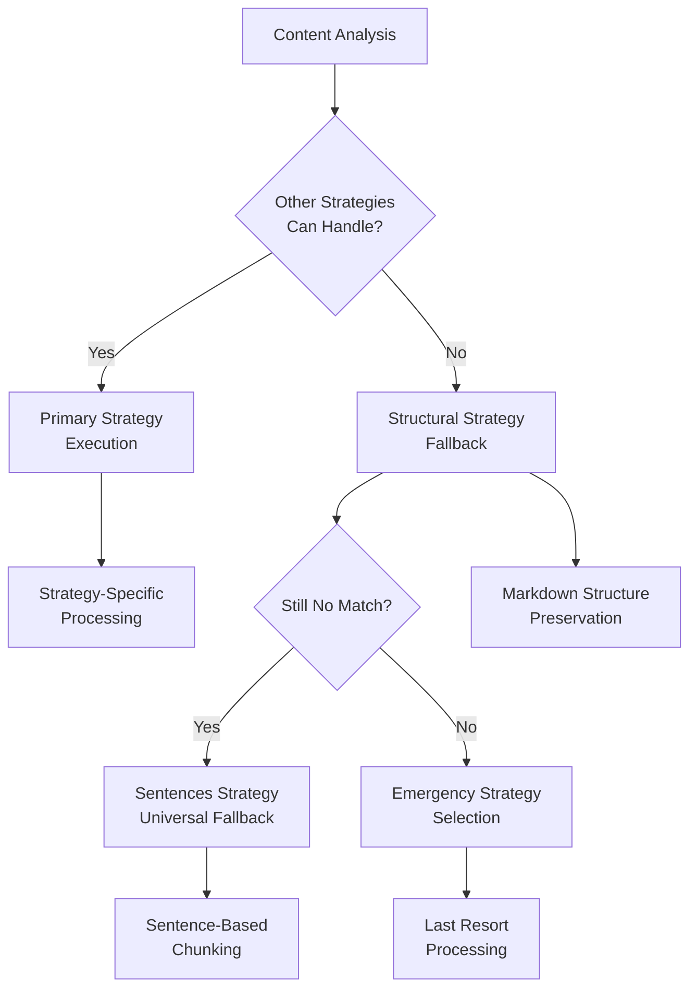
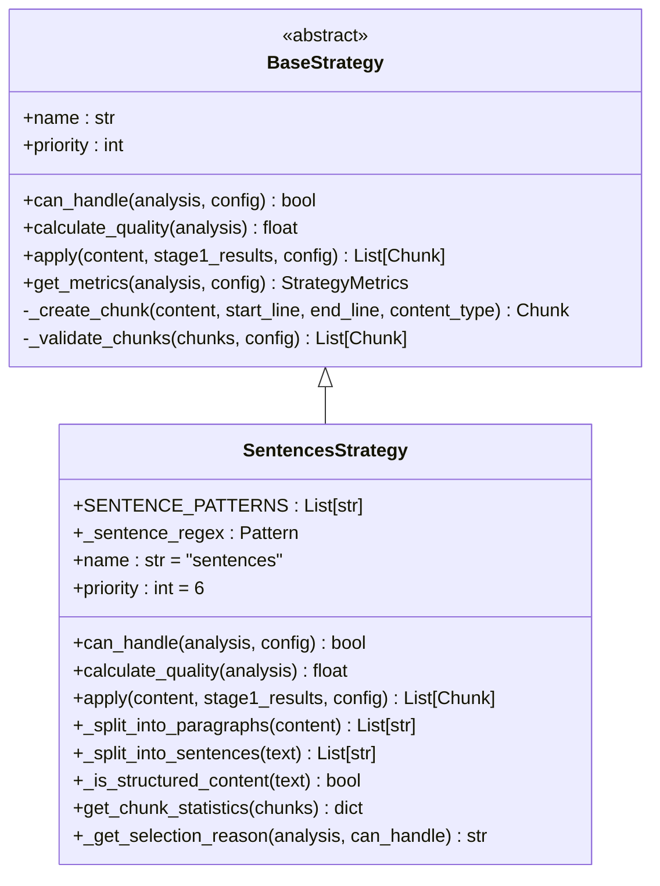
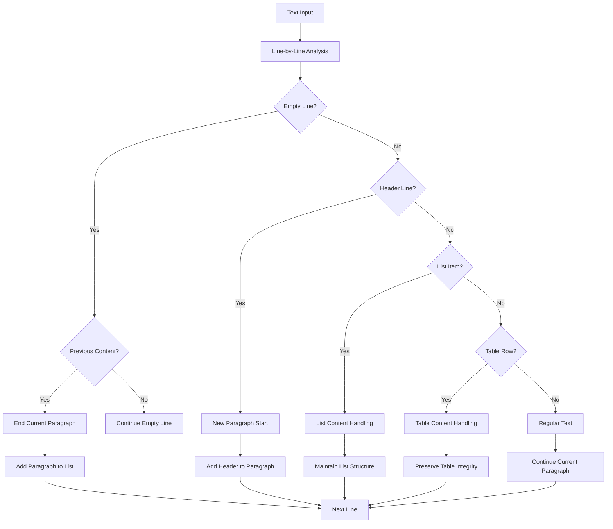
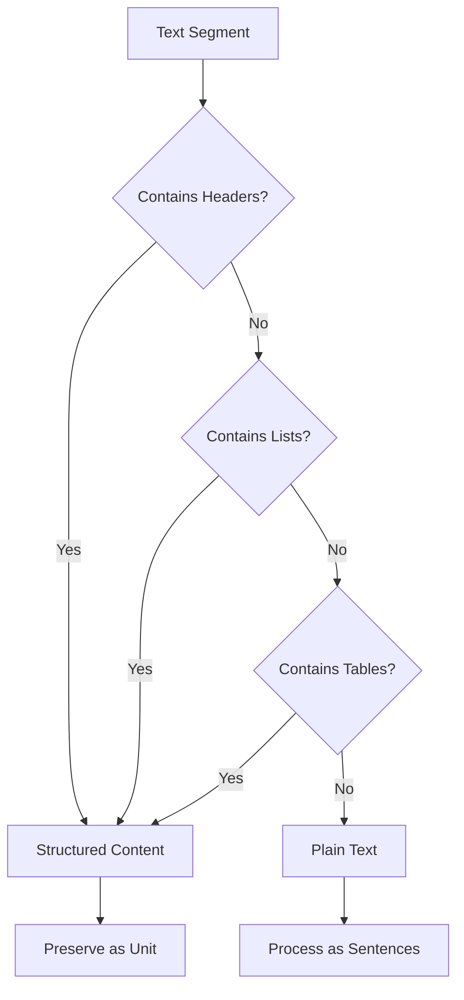
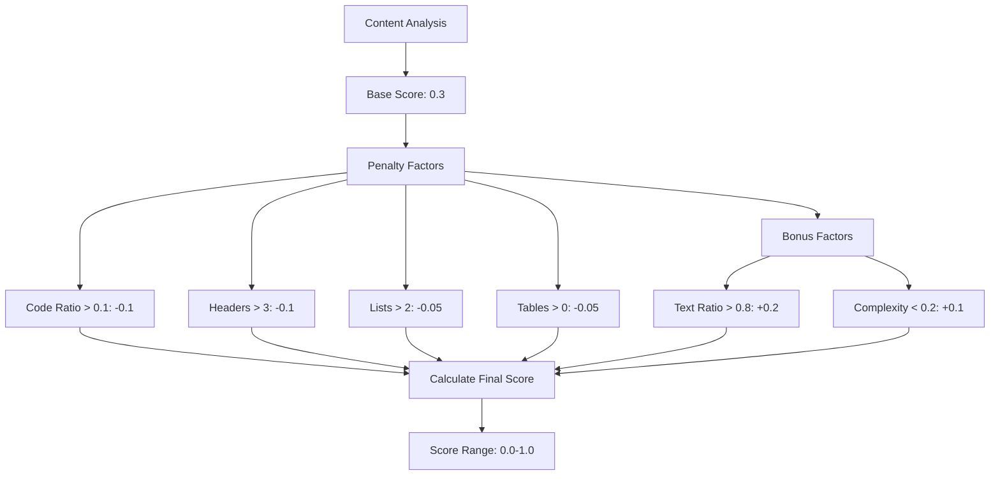
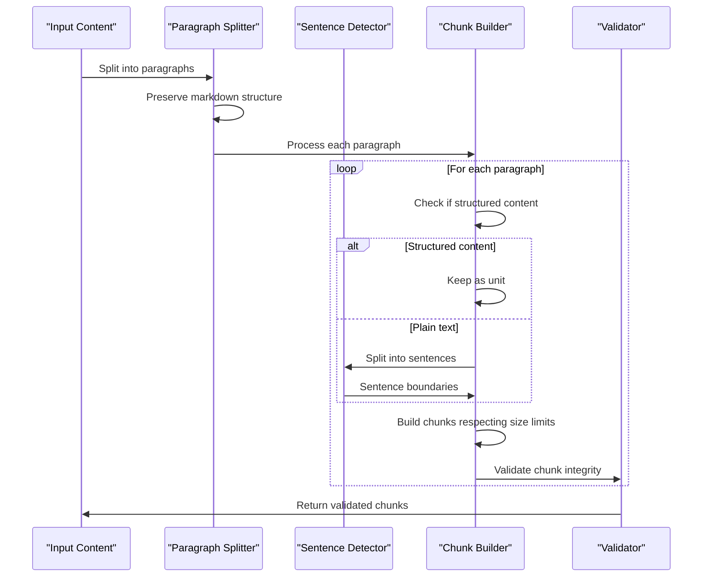
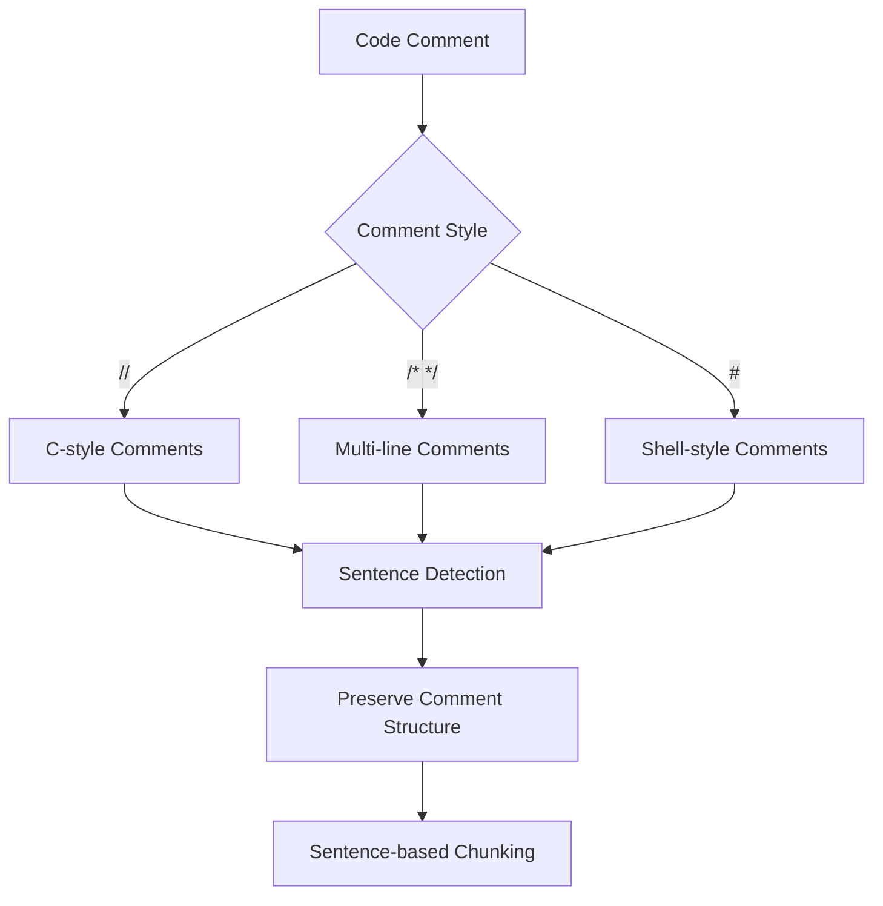
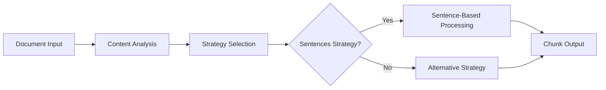
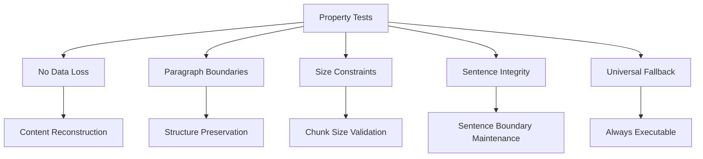

# Sentences Strategy

<cite>
**Referenced Files in This Document**
- [sentences_strategy.py](file://markdown_chunker_legacy/chunker/strategies/sentences_strategy.py)
- [test_sentences_strategy.py](file://tests/chunker/test_strategies/test_sentences_strategy.py)
- [test_sentences_strategy_properties.py](file://tests/chunker/test_sentences_strategy_properties.py)
- [base.py](file://markdown_chunker_legacy/chunker/strategies/base.py)
- [types.py](file://markdown_chunker_legacy/chunker/types.py)
- [selector.py](file://markdown_chunker_legacy/chunker/selector.py)
- [mixed.md](file://tests/fixtures/mixed.md)
- [edge_cases.md](file://tests/fixtures/edge_cases.md)
</cite>

## Table of Contents
1. [Introduction](#introduction)
2. [Strategy Overview](#strategy-overview)
3. [Implementation Architecture](#implementation-architecture)
4. [Sentence Boundary Detection Algorithm](#sentence-boundary-detection-algorithm)
5. [Paragraph Processing and Structure Preservation](#paragraph-processing-and-structure-preservation)
6. [Quality Calculation and Strategy Selection](#quality-calculation-and-strategy-selection)
7. [Chunk Creation Process](#chunk-creation-process)
8. [Edge Case Handling](#edge-case-handling)
9. [Performance Characteristics](#performance-characteristics)
10. [Configuration and Usage](#configuration-and-usage)
11. [Testing and Validation](#testing-and-validation)
12. [Common Issues and Solutions](#common-issues-and-solutions)

## Introduction

The Sentences Strategy serves as the universal fallback mechanism in the markdown chunking system, designed to handle any type of content reliably when specialized strategies cannot be applied. As the lowest priority strategy (priority 6), it ensures that no content remains unprocessed, providing a safety net for all text processing scenarios.

This strategy implements sophisticated sentence boundary detection while preserving markdown structure, making it particularly effective for plain text documents and mixed-content scenarios where other strategies might struggle.

## Strategy Overview

### Core Characteristics

The Sentences Strategy possesses several key attributes that define its role in the chunking ecosystem:

- **Universal Compatibility**: Can handle any content type (always returns `True` for `can_handle`)
- **Fallback Priority**: Operates as the last-resort strategy when no other strategy applies
- **Sentence-Based Processing**: Breaks content into grammatically correct sentences
- **Structure Preservation**: Maintains markdown elements like headers, lists, and tables
- **Efficient Performance**: Optimized for speed while maintaining accuracy

### Priority and Role in Strategy Selection

As the highest priority fallback strategy, the Sentences Strategy operates according to the following selection logic:



**Diagram sources**
- [selector.py](file://markdown_chunker_legacy/chunker/selector.py#L121-L156)

**Section sources**
- [sentences_strategy.py](file://markdown_chunker_legacy/chunker/strategies/sentences_strategy.py#L58-L74)
- [base.py](file://markdown_chunker_legacy/chunker/strategies/base.py#L36-L45)

## Implementation Architecture

### Class Structure and Inheritance

The Sentences Strategy inherits from the BaseStrategy class, implementing all required abstract methods while adding specialized functionality for sentence-based chunking.



**Diagram sources**
- [base.py](file://markdown_chunker_legacy/chunker/strategies/base.py#L16-L95)
- [sentences_strategy.py](file://markdown_chunker_legacy/chunker/strategies/sentences_strategy.py#L21-L60)

### Key Components

The strategy consists of several interconnected components that work together to provide robust sentence-based chunking:

1. **Sentence Pattern Engine**: Regex-based sentence boundary detection
2. **Paragraph Analyzer**: Markdown structure preservation logic
3. **Quality Calculator**: Strategy suitability assessment
4. **Chunk Validator**: Output quality assurance
5. **Utility Functions**: Supporting sentence processing operations

**Section sources**
- [sentences_strategy.py](file://markdown_chunker_legacy/chunker/strategies/sentences_strategy.py#L21-L526)

## Sentence Boundary Detection Algorithm

### Sentence Pattern Configuration

The strategy employs a sophisticated regex-based approach to identify sentence boundaries, using multiple patterns to handle various punctuation scenarios:

```mermaid
flowchart TD
A["Input Text"] --> B["Regex Compilation"]
B --> C["Pattern 1: Standard Endings"]
B --> D["Pattern 2: Line Endings"]
B --> E["Pattern 3: Quote Preceding"]
C --> F["Match [.!?]+\\s+(?=[A-ZА-Я])"]
D --> G["Match [.!?]+$"]
E --> H["Match [.!?]+(?=\\s*[\"'])"]
F --> I["Sentence Boundary Detection"]
G --> I
H --> I
I --> J["Text Splitting"]
J --> K["Sentence Assembly"]
K --> L["Final Sentence Array"]
```

**Diagram sources**
- [sentences_strategy.py](file://markdown_chunker_legacy/chunker/strategies/sentences_strategy.py#L35-L43)

### Pattern Details

The sentence detection algorithm uses three primary regex patterns:

1. **Standard Sentence Endings**: Matches punctuation followed by uppercase letter
   - Pattern: `r"([.!?]+)\s+(?=[A-ZА-Я])"`
   - Purpose: Identifies sentence boundaries after proper punctuation

2. **Line End Sentence Endings**: Handles punctuation at line endings
   - Pattern: `r"([.!?]+)$"`
   - Purpose: Captures sentences that end at the end of lines

3. **Quote-Preceding Endings**: Manages punctuation before quotation marks
   - Pattern: `r'([.!?]+)(?=\s*["\'])'`
   - Purpose: Handles sentences ending with quotes

### Fallback Mechanisms

When the primary regex approach fails to detect sentences, the strategy implements several fallback mechanisms:

- **Simple Period Splitting**: Basic text splitting by periods
- **Single Sentence Return**: Entire text as single sentence
- **Empty Result Handling**: Graceful handling of edge cases

**Section sources**
- [sentences_strategy.py](file://markdown_chunker_legacy/chunker/strategies/sentences_strategy.py#L391-L446)

## Paragraph Processing and Structure Preservation

### Paragraph Detection Logic

The strategy implements intelligent paragraph detection that respects markdown structure while maintaining text continuity:



**Diagram sources**
- [sentences_strategy.py](file://markdown_chunker_legacy/chunker/strategies/sentences_strategy.py#L263-L356)

### Structure Preservation Features

The paragraph processing system maintains several markdown elements intact:

- **Headers**: Treated as standalone paragraphs
- **Lists**: Preserved as cohesive units
- **Tables**: Kept intact without sentence splitting
- **Code Blocks**: Handled as atomic elements

### Structured Content Detection

The strategy includes sophisticated logic to identify and preserve structured content:



**Diagram sources**
- [sentences_strategy.py](file://markdown_chunker_legacy/chunker/strategies/sentences_strategy.py#L358-L389)

**Section sources**
- [sentences_strategy.py](file://markdown_chunker_legacy/chunker/strategies/sentences_strategy.py#L263-L389)

## Quality Calculation and Strategy Selection

### Quality Scoring Algorithm

The Sentences Strategy calculates quality scores based on content characteristics, balancing universality with effectiveness:



**Diagram sources**
- [sentences_strategy.py](file://markdown_chunker_legacy/chunker/strategies/sentences_strategy.py#L76-L126)

### Selection Reason Generation

The strategy provides clear rationale for its selection decisions:

| Content Characteristics | Selection Reason |
|------------------------|------------------|
| High text ratio (>0.8) | "High text ratio - sentences strategy is well-suited" |
| Low complexity (<0.2) | "Low complexity content - sentences strategy is appropriate" |
| General case | "Universal fallback strategy - can handle any content" |

### Quality Thresholds

The scoring system establishes clear thresholds for strategy effectiveness:

- **Excellent Fit**: Score > 0.6 (high text ratio, low complexity)
- **Good Fit**: Score 0.3-0.6 (balanced content)
- **Limited Fit**: Score < 0.3 (structured content)

**Section sources**
- [sentences_strategy.py](file://markdown_chunker_legacy/chunker/strategies/sentences_strategy.py#L76-L126)
- [sentences_strategy.py](file://markdown_chunker_legacy/chunker/strategies/sentences_strategy.py#L448-L459)

## Chunk Creation Process

### Processing Pipeline

The chunk creation process follows a sophisticated pipeline that balances sentence integrity with size constraints:



**Diagram sources**
- [sentences_strategy.py](file://markdown_chunker_legacy/chunker/strategies/sentences_strategy.py#L128-L261)

### Size Constraint Management

The strategy implements intelligent size management that prioritizes sentence integrity:

1. **Size Checking**: Every addition checks against `max_chunk_size`
2. **Oversize Handling**: Allows reasonable tolerance for sentence boundaries
3. **Atomic Element Protection**: Prevents splitting of code blocks and tables
4. **Graceful Degradation**: Creates oversized chunks when necessary

### Metadata Generation

Each chunk receives comprehensive metadata for tracking and analysis:

- **Strategy Identification**: "sentences" strategy marker
- **Content Type**: "text" with sentence-specific indicators
- **Sentence Count**: Number of sentences per chunk
- **Size Information**: Character count and line count
- **Boundary Data**: Start/end line numbers

**Section sources**
- [sentences_strategy.py](file://markdown_chunker_legacy/chunker/strategies/sentences_strategy.py#L128-L261)

## Edge Case Handling

### Abbreviation and Special Case Management

The strategy handles various edge cases that commonly occur in real-world text:

#### Abbreviation Challenges
- **Scientific Notation**: Handles "U.S.A.", "Dr.", "Inc." appropriately
- **Technical Terms**: Manages programming abbreviations and acronyms
- **International Content**: Supports multiple languages and character sets

#### Code Comment Processing
While primarily designed for plain text, the strategy handles code comments effectively:



#### Mixed Content Scenarios
The strategy gracefully handles documents containing multiple content types:

- **Code with Documentation**: Separates code blocks from explanatory text
- **Tables with Descriptions**: Preserves table integrity while processing surrounding text
- **Lists with Notes**: Maintains list structure while processing adjacent content

### Error Recovery Mechanisms

The strategy implements robust error recovery for problematic content:

1. **Empty Content Handling**: Returns empty chunk list for whitespace-only input
2. **Malformed Structure**: Gracefully processes incomplete markdown elements
3. **Unicode Support**: Handles international characters and special symbols
4. **Large Content**: Manages very long sentences and paragraphs

**Section sources**
- [sentences_strategy.py](file://markdown_chunker_legacy/chunker/strategies/sentences_strategy.py#L115-L126)
- [test_sentences_strategy.py](file://tests/chunker/test_strategies/test_sentences_strategy.py#L115-L134)

## Performance Characteristics

### Efficiency Metrics

The Sentences Strategy is designed for optimal performance while maintaining accuracy:

#### Time Complexity
- **Sentence Detection**: O(n) where n is text length
- **Paragraph Analysis**: O(n) for line-by-line processing
- **Chunk Building**: O(n) with constant-time additions
- **Quality Calculation**: O(1) constant time operations

#### Memory Usage
- **Regex Compilation**: Singleton pattern prevents repeated compilation
- **Intermediate Storage**: Minimal temporary storage during processing
- **Output Optimization**: Efficient chunk creation with metadata

### Performance Optimization Features

1. **Compiled Regex**: Sentence patterns compiled once and reused
2. **Lazy Evaluation**: Processing occurs only when needed
3. **Batch Operations**: Multiple sentences processed efficiently
4. **Memory Pooling**: Reuse of temporary data structures

### Comparison with Other Strategies

| Strategy | Priority | Speed | Accuracy | Use Case |
|----------|----------|-------|----------|----------|
| Sentences | 6 (lowest) | Fastest | Good | Universal fallback |
| Code | 1 (highest) | Medium | Excellent | Code-heavy documents |
| Structural | 2 | Medium | Excellent | Structured content |
| List/Table | 3 | Medium | Excellent | List/table-heavy content |

**Section sources**
- [sentences_strategy.py](file://markdown_chunker_legacy/chunker/strategies/sentences_strategy.py#L407-L411)

## Configuration and Usage

### Basic Configuration

The Sentences Strategy operates with standard chunking configuration:

```python
from markdown_chunker.chunker.types import ChunkConfig

# Default configuration suitable for most use cases
config = ChunkConfig(
    max_chunk_size=1000,  # Characters per chunk
    min_chunk_size=200,   # Minimum chunk size
    allow_oversize=False  # Allow oversized chunks
)
```

### Force Strategy Usage

While the strategy automatically activates as fallback, you can force its use for specific scenarios:

#### When to Force Sentences Strategy
1. **Simple Text Documents**: Pure text without markdown elements
2. **Fallback Guarantee**: When reliability is paramount
3. **Testing and Debugging**: For consistent baseline comparisons
4. **Edge Case Handling**: When other strategies fail unexpectedly

#### Configuration Examples

```python
# Force sentences strategy for plain text
config = ChunkConfig(max_chunk_size=500, min_chunk_size=100)

# Optimize for large documents
config = ChunkConfig(max_chunk_size=2000, min_chunk_size=500)

# Strict size enforcement
config = ChunkConfig(max_chunk_size=800, min_chunk_size=200, allow_oversize=False)
```

### Integration Patterns

The strategy integrates seamlessly with the chunking pipeline:



**Diagram sources**
- [selector.py](file://markdown_chunker_legacy/chunker/selector.py#L121-L156)

**Section sources**
- [types.py](file://markdown_chunker_legacy/chunker/types.py#L1-L200)

## Testing and Validation

### Comprehensive Test Suite

The Sentences Strategy includes extensive testing covering multiple scenarios:

#### Unit Tests Coverage
- **Basic Functionality**: Sentence and paragraph splitting
- **Edge Cases**: Empty text, single sentences, malformed content
- **Quality Calculation**: Different content types and ratios
- **Chunk Statistics**: Output validation and metrics

#### Integration Tests
- **Realistic Documents**: Mixed content with various structures
- **Fallback Behavior**: Ensuring reliability as backup strategy
- **Performance Benchmarks**: Efficiency validation under load

#### Property-Based Testing
The strategy employs hypothesis-based property testing to validate correctness:



**Diagram sources**
- [test_sentences_strategy_properties.py](file://tests/chunker/test_sentences_strategy_properties.py#L77-L344)

### Test Fixtures and Examples

The test suite includes diverse examples demonstrating strategy capabilities:

#### Mixed Content Example
From [`mixed.md`](file://tests/fixtures/mixed.md), the strategy handles documents containing:
- Headers and subheaders
- Code blocks with syntax highlighting
- Nested lists with multiple levels
- Tables with various alignments
- Regular text paragraphs

#### Edge Case Examples
From [`edge_cases.md`](file://tests/fixtures/edge_cases.md), the strategy manages:
- Empty sections and whitespace
- Malformed markdown elements
- Unicode characters and special symbols
- Very long lines and paragraphs
- Nested structures and complex formatting

**Section sources**
- [test_sentences_strategy.py](file://tests/chunker/test_strategies/test_sentences_strategy.py#L1-392)
- [test_sentences_strategy_properties.py](file://tests/chunker/test_sentences_strategy_properties.py#L1-344)

## Common Issues and Solutions

### Sentence Splitting Problems

#### Issue: Incorrect Sentence Boundaries
**Symptoms**: Sentences split at inappropriate locations
**Causes**: 
- Abbreviations treated as sentence endings
- Quotation marks causing premature splits
- Complex punctuation combinations

**Solutions**:
1. Review and adjust sentence patterns if custom requirements
2. Use structured content detection to preserve important segments
3. Implement post-processing cleanup for edge cases

#### Issue: Poor Sentence Detection in Code Comments
**Symptoms**: Code comments split into nonsensical fragments
**Causes**: 
- Comments contain multiple sentences
- Technical terms confuse the detector
- Mixed programming languages

**Solutions**:
1. Separate code processing from comment processing
2. Use specialized parsers for code comments
3. Implement language-specific sentence detection

### Performance Issues

#### Issue: Slow Processing on Large Documents
**Symptoms**: High memory usage and slow execution
**Causes**:
- Very long sentences exceeding typical patterns
- Complex nested structures
- Unicode-heavy content

**Solutions**:
1. Increase `max_chunk_size` to reduce chunk count
2. Implement streaming processing for extremely large documents
3. Use parallel processing for independent sections

#### Issue: Memory Consumption
**Symptoms**: Out-of-memory errors with large inputs
**Causes**:
- Aggressive chunk size limits
- Large intermediate data structures
- Inefficient temporary storage

**Solutions**:
1. Optimize chunk size configurations
2. Implement iterative processing
3. Use memory-efficient data structures

### Configuration Challenges

#### Issue: Oversized Chunks Despite Settings
**Symptoms**: Chunks exceed configured limits
**Causes**:
- Single sentences exceeding size limits
- Atomic elements preventing splitting
- Tolerance settings

**Solutions**:
1. Enable `allow_oversize` for critical content
2. Adjust tolerance factors for specific use cases
3. Implement custom size enforcement logic

#### Issue: Insufficient Chunking Granularity
**Symptoms**: Too few chunks for indexing/search
**Causes**:
- Large `max_chunk_size` settings
- Content with few sentence boundaries
- Structured content preservation

**Solutions**:
1. Reduce `max_chunk_size` for finer granularity
2. Implement hierarchical chunking
3. Use multiple strategies for different content types

### Best Practices

1. **Content Analysis**: Understand your content type before forcing strategy
2. **Configuration Tuning**: Adjust settings based on document characteristics
3. **Monitoring**: Track chunk statistics for optimization
4. **Testing**: Validate with representative content samples
5. **Fallback Planning**: Design systems to handle strategy failures gracefully

**Section sources**
- [test_sentences_strategy.py](file://tests/chunker/test_strategies/test_sentences_strategy.py#L320-L392)