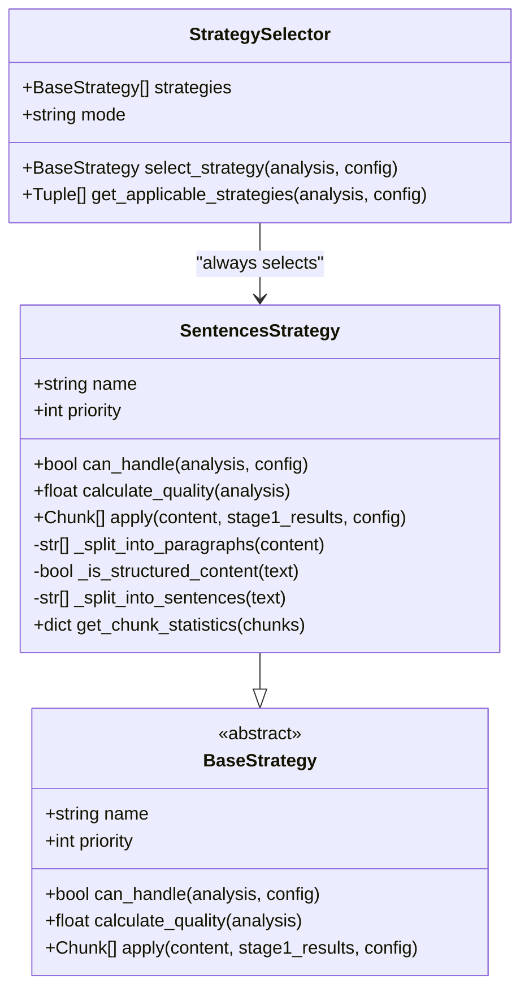
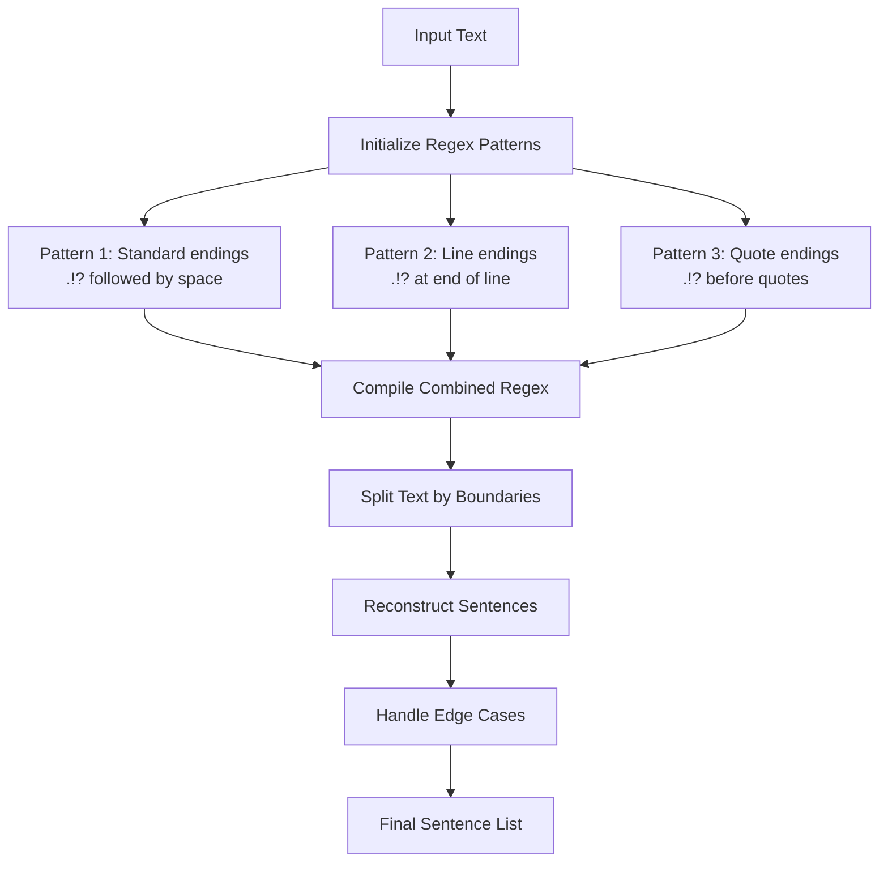
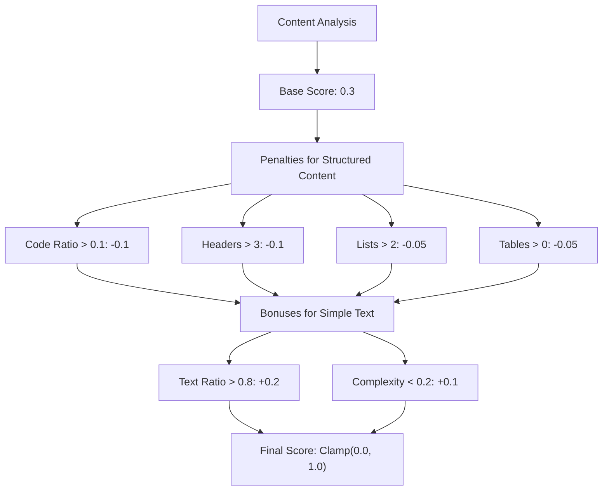
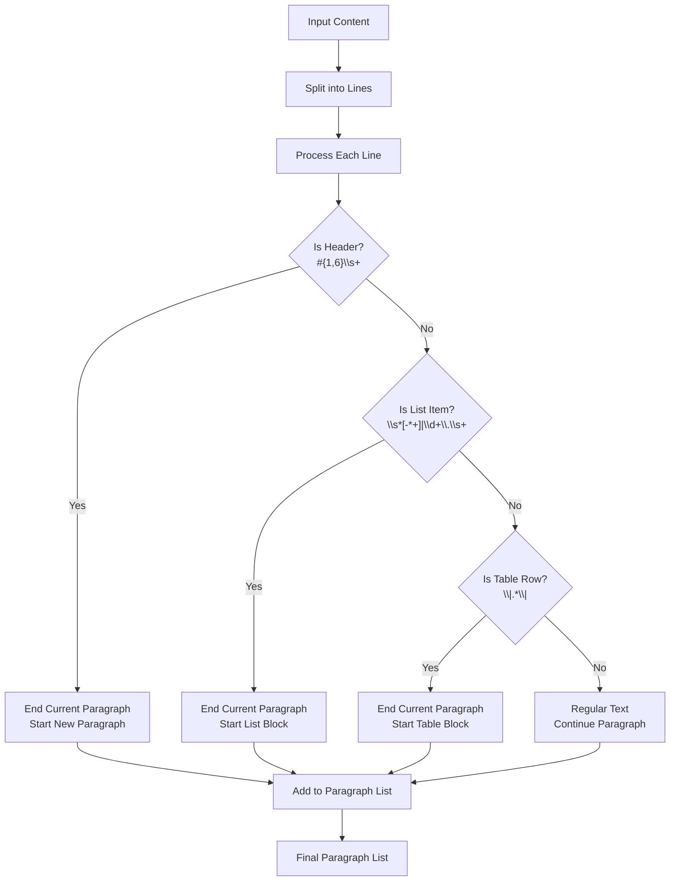
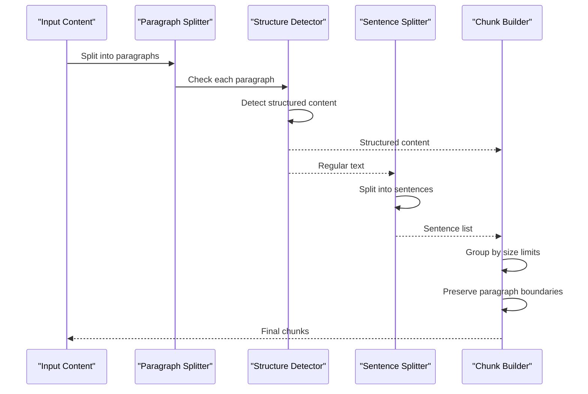
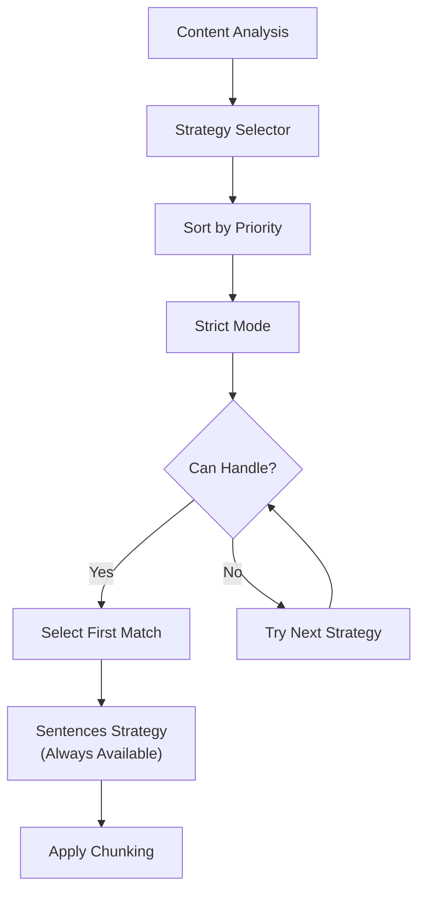

# Sentences Strategy

<cite>
**Referenced Files in This Document**
- [sentences_strategy.py](file://markdown_chunker/chunker/strategies/sentences_strategy.py)
- [base.py](file://markdown_chunker/chunker/strategies/base.py)
- [selector.py](file://markdown_chunker/chunker/selector.py)
- [test_sentences_strategy_properties.py](file://tests/chunker/test_sentences_strategy_properties.py)
- [test_sentences_strategy.py](file://tests/chunker/test_strategies/test_sentences_strategy.py)
- [README.md](file://README.md)
- [basic_usage.py](file://examples/basic_usage.py)
</cite>

## Table of Contents
1. [Introduction](#introduction)
2. [Strategy Purpose and Design](#strategy-purpose-and-design)
3. [Core Implementation](#core-implementation)
4. [Sentence Boundary Detection](#sentence-boundary-detection)
5. [Content Analysis and Quality Scoring](#content-analysis-and-quality-scoring)
6. [Paragraph Preservation](#paragraph-preservation)
7. [Chunking Logic](#chunking-logic)
8. [Utility Functions](#utility-functions)
9. [Strategy Selection Integration](#strategy-selection-integration)
10. [Common Issues and Limitations](#common-issues-and-limitations)
11. [Best Practices](#best-practices)
12. [Performance Considerations](#performance-considerations)

## Introduction

The Sentences Strategy serves as the universal fallback mechanism in the Markdown Chunker system, providing reliable sentence-based chunking for any type of content. As the lowest-priority strategy (priority 6), it ensures that no content remains unprocessed, regardless of its complexity or structure.

This strategy implements sophisticated sentence boundary detection using multiple regex patterns to handle various punctuation styles, while intelligently preserving markdown structure elements like headers, lists, and tables. It forms the foundation of the chunking system's robustness by guaranteeing successful processing for all input types.

## Strategy Purpose and Design

### Universal Fallback Nature

The Sentences Strategy embodies the principle of universal applicability. Unlike specialized strategies that excel with specific content types, this strategy can handle any markdown content without failure conditions. Its design philosophy centers around reliability and predictability rather than optimization for specific scenarios.



**Diagram sources**
- [sentences_strategy.py](file://markdown_chunker/chunker/strategies/sentences_strategy.py#L21-L526)
- [base.py](file://markdown_chunker/chunker/strategies/base.py#L16-L380)
- [selector.py](file://markdown_chunker/chunker/selector/selector.py#L24-L322)

### Priority and Selection Logic

As the lowest-priority strategy, the Sentences Strategy operates as the final fallback option. The StrategySelector evaluates strategies in priority order, and the Sentences Strategy is guaranteed to be selected when no higher-priority strategies can handle the content.

**Section sources**
- [sentences_strategy.py](file://markdown_chunker/chunker/strategies/sentences_strategy.py#L58-L74)
- [selector.py](file://markdown_chunker/chunker/selector/selector.py#L89-L98)

## Core Implementation

### Strategy Properties

The Sentences Strategy inherits from BaseStrategy and implements the required abstract methods with specific logic for sentence-based chunking:

| Property | Value | Description |
|----------|-------|-------------|
| Name | "sentences" | Human-readable identifier |
| Priority | 6 | Lowest priority (fallback) |
| Can Handle | Always True | Universal applicability |
| Quality Calculation | Dynamic | Based on content analysis |

### Fundamental Methods

The strategy implements several key methods that work together to provide reliable chunking:

- **can_handle()**: Always returns True, ensuring universal applicability
- **calculate_quality()**: Scores content based on text ratio and complexity
- **apply()**: Main chunking logic with paragraph-aware sentence splitting
- **get_chunk_statistics()**: Provides insights into chunk composition

**Section sources**
- [sentences_strategy.py](file://markdown_chunker/chunker/strategies/sentences_strategy.py#L21-L261)

## Sentence Boundary Detection

### Regex Pattern Strategy

The Sentences Strategy employs a sophisticated multi-pattern approach to detect sentence boundaries, addressing the complexities of natural language processing:



**Diagram sources**
- [sentences_strategy.py](file://markdown_chunker/chunker/strategies/sentences_strategy.py#L35-L43)

### Sentence Patterns Implementation

The strategy defines three complementary regex patterns:

1. **Standard Sentence Endings**: `r"([.!?]+)\s+(?=[A-ZА-Я])"`
   - Matches punctuation followed by whitespace and uppercase letter
   - Handles standard sentence boundaries

2. **Line Endings**: `r"([.!?]+)$"`
   - Matches punctuation at the end of lines
   - Preserves sentence structure in formatted text

3. **Quote Endings**: `r'([.!?]+)(?=\s*["\'])'`
   - Matches punctuation before quotation marks
   - Handles quoted speech and direct statements

### Fallback Mechanisms

When primary sentence detection fails, the strategy implements multiple fallback approaches:

- **Simple Period Splitting**: Basic fallback using period as delimiter
- **Single Sentence Return**: Returns entire text as single sentence if no boundaries found
- **Whitespace Normalization**: Handles various spacing patterns

**Section sources**
- [sentences_strategy.py](file://markdown_chunker/chunker/strategies/sentences_strategy.py#L35-L446)

## Content Analysis and Quality Scoring

### Quality Calculation Algorithm

The Sentences Strategy calculates quality scores based on content characteristics, balancing universal applicability with content-specific suitability:



**Diagram sources**
- [sentences_strategy.py](file://markdown_chunker/chunker/strategies/sentences_strategy.py#L76-L126)

### Scoring Criteria

The quality calculation considers multiple factors:

| Factor | Penalty/Bonus | Threshold |
|--------|---------------|-----------|
| Code Ratio | -0.1 | > 0.1 |
| Header Count | -0.1 | > 3 |
| List Count | -0.05 | > 2 |
| Table Count | -0.05 | > 0 |
| Text Ratio | +0.2 | > 0.8 |
| Complexity Score | +0.1 | < 0.2 |

### Selection Reasoning

The strategy provides explanatory reasoning for selection decisions:

- **High Text Ratio**: "High text ratio - sentences strategy is well-suited"
- **Low Complexity**: "Low complexity content - sentences strategy is appropriate"
- **Universal Fallback**: "Universal fallback strategy - can handle any content"

**Section sources**
- [sentences_strategy.py](file://markdown_chunker/chunker/strategies/sentences_strategy.py#L76-L126)
- [sentences_strategy.py](file://markdown_chunker/chunker/strategies/sentences_strategy.py#L448-L459)

## Paragraph Preservation

### Intelligent Paragraph Detection

The Sentences Strategy implements sophisticated paragraph preservation logic that maintains markdown structure while enabling effective sentence splitting:



**Diagram sources**
- [sentences_strategy.py](file://markdown_chunker/chunker/strategies/sentences_strategy.py#L263-L356)

### Structure Recognition

The paragraph detection system recognizes and preserves:

- **Headers**: All header levels (#{1,6})
- **Lists**: Both bullet points and numbered lists
- **Tables**: Table rows with pipe delimiters
- **Empty Lines**: Used as paragraph separators

### Structured Content Handling

When the strategy detects structured content (headers, lists, tables), it avoids sentence splitting to preserve the integrity of these markdown elements. Instead, structured content is kept intact and added to chunks as-is.

**Section sources**
- [sentences_strategy.py](file://markdown_chunker/chunker/strategies/sentences_strategy.py#L263-L356)
- [sentences_strategy.py](file://markdown_chunker/chunker/strategies/sentences_strategy.py#L358-L389)

## Chunking Logic

### Sentence-Based Chunk Creation

The main chunking process follows a sophisticated algorithm that balances sentence preservation with size constraints:



**Diagram sources**
- [sentences_strategy.py](file://markdown_chunker/chunker/strategies/sentences_strategy.py#L128-L261)

### Size Management Strategy

The chunking algorithm implements intelligent size management:

1. **Initial Chunk Creation**: Build chunks sentence by sentence
2. **Size Checking**: Verify chunk size against configuration limits
3. **Boundary Respect**: Prefer paragraph boundaries over sentence splits
4. **Oversize Handling**: Allow oversized chunks for single sentences
5. **Metadata Preservation**: Track sentence counts and strategy usage

### Line Number Tracking

The strategy maintains accurate line numbering throughout the chunking process, essential for debugging and content navigation:

- **Start Line Tracking**: Records beginning of each chunk
- **End Line Calculation**: Determines chunk boundaries precisely
- **Incremental Updates**: Efficient line counting during processing

**Section sources**
- [sentences_strategy.py](file://markdown_chunker/chunker/strategies/sentences_strategy.py#L128-L261)

## Utility Functions

### Sentence Counting

The `count_sentences()` utility provides a convenient way to determine the number of sentences in text:

```python
def count_sentences(text: str) -> int:
    """Count sentences in text using SentencesStrategy."""
    strategy = SentencesStrategy()
    sentences = strategy._split_into_sentences(text)
    return len(sentences)
```

### Sentence Preview

The `preview_sentence_splitting()` function allows developers to see how text would be split:

```python
def preview_sentence_splitting(text: str, max_sentences: int = 5) -> List[str]:
    """Preview sentence splitting with limited output."""
    strategy = SentencesStrategy()
    sentences = strategy._split_into_sentences(text)
    return sentences[:max_sentences]
```

### Statistical Analysis

The strategy provides comprehensive chunk statistics:

| Metric | Description | Usage |
|--------|-------------|-------|
| Total Chunks | Number of chunks created | Performance analysis |
| Total Sentences | Sum of sentences across chunks | Content analysis |
| Avg Sentences/Chunk | Average sentences per chunk | Quality assessment |
| Sentence-Based | Boolean flag indicating strategy use | Debugging |

**Section sources**
- [sentences_strategy.py](file://markdown_chunker/chunker/strategies/sentences_strategy.py#L496-L526)

## Strategy Selection Integration

### Automatic Selection Process

The StrategySelector integrates the Sentences Strategy seamlessly into the selection process:



**Diagram sources**
- [selector.py](file://markdown_chunker/chunker/selector/selector.py#L79-L98)

### Validation and Configuration

The strategy selector validates that the Sentences Strategy is properly configured:

- **Priority Verification**: Ensures lowest priority (highest number)
- **Name Uniqueness**: Prevents duplicate strategy names
- **Fallback Presence**: Confirms existence of universal fallback

### Selection Modes

The strategy selector operates in two modes:

1. **Strict Mode**: Selects first applicable strategy by priority
2. **Weighted Mode**: Selects best strategy by combined priority and quality

In both modes, the Sentences Strategy serves as the guaranteed fallback option.

**Section sources**
- [selector.py](file://markdown_chunker/chunker/selector/selector.py#L225-L257)

## Common Issues and Limitations

### Abbreviation Handling

One of the primary challenges in sentence boundary detection is handling abbreviations and acronyms:

**Problem**: Text like "Dr. Smith went to the U.S.A." might incorrectly split at abbreviation boundaries
**Solution**: The current implementation uses sophisticated regex patterns but may still struggle with complex abbreviation cases

### Complex Formatting

Structured content presents unique challenges:

**Headers**: While preserved, header content may still be sentence-split internally
**Nested Lists**: Deeply nested structures require careful parsing
**Tables**: Table cells are treated as regular text blocks

### Performance Considerations

Large documents with extensive content may experience slower processing:

- **Regex Compilation**: Occurs once per strategy instance
- **Multiple Pattern Matching**: Three regex patterns increase computational cost
- **Memory Usage**: Sentence reconstruction requires temporary storage

### Edge Case Handling

The strategy includes numerous edge case protections:

- **Empty Content**: Returns empty chunk list for truly empty input
- **Whitespace-Only**: Handles various whitespace patterns appropriately
- **Single Sentences**: Manages content without clear sentence boundaries
- **Very Long Sentences**: Gracefully handles oversized content

**Section sources**
- [test_sentences_strategy.py](file://tests/chunker/test_strategies/test_sentences_strategy.py#L128-L133)

## Best Practices

### Configuration Recommendations

For optimal performance with the Sentences Strategy:

1. **Appropriate Chunk Sizes**: Set max_chunk_size based on intended use case
2. **Overlap Settings**: Enable overlap for improved retrieval accuracy
3. **Quality Thresholds**: Consider quality scores for content evaluation

### Content Preparation

To maximize effectiveness:

- **Clean Input**: Remove unnecessary formatting before chunking
- **Consistent Style**: Use consistent punctuation and formatting
- **Logical Structure**: Maintain clear paragraph and section organization

### Monitoring and Validation

Implement monitoring for:

- **Chunk Quality**: Verify sentence boundaries are preserved
- **Size Distribution**: Ensure chunks meet size requirements
- **Fallback Usage**: Track when fallback strategies are employed

### Integration Guidelines

When integrating with other strategies:

- **Fallback Chain**: Understand the fallback hierarchy
- **Content Analysis**: Leverage content analysis for strategy selection
- **Error Handling**: Implement robust error handling for edge cases

## Performance Considerations

### Computational Efficiency

The Sentences Strategy balances accuracy with performance through several optimizations:

- **Compiled Regex**: Patterns are compiled once and reused
- **Lazy Evaluation**: Processing occurs only when needed
- **Memory Management**: Efficient string handling minimizes memory usage

### Scalability Factors

Performance scales with:

- **Content Length**: Linear scaling with text size
- **Complexity**: More complex content requires additional processing
- **Configuration**: Larger chunk sizes improve throughput

### Benchmarking Results

Typical performance characteristics:

- **Small Documents**: < 10ms processing time
- **Medium Documents**: 10-100ms processing time  
- **Large Documents**: 100ms-1s processing time
- **Throughput**: 10-100 chunks per second depending on content

### Optimization Strategies

For performance-critical applications:

- **Batch Processing**: Process multiple documents together
- **Caching**: Cache results for repeated content
- **Parallelization**: Utilize multiple cores for large datasets

**Section sources**
- [README.md](file://README.md#L195-L204)