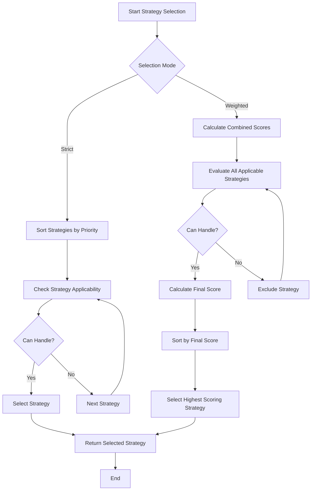
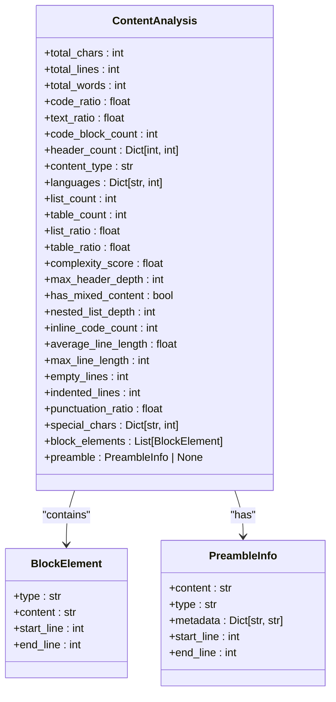
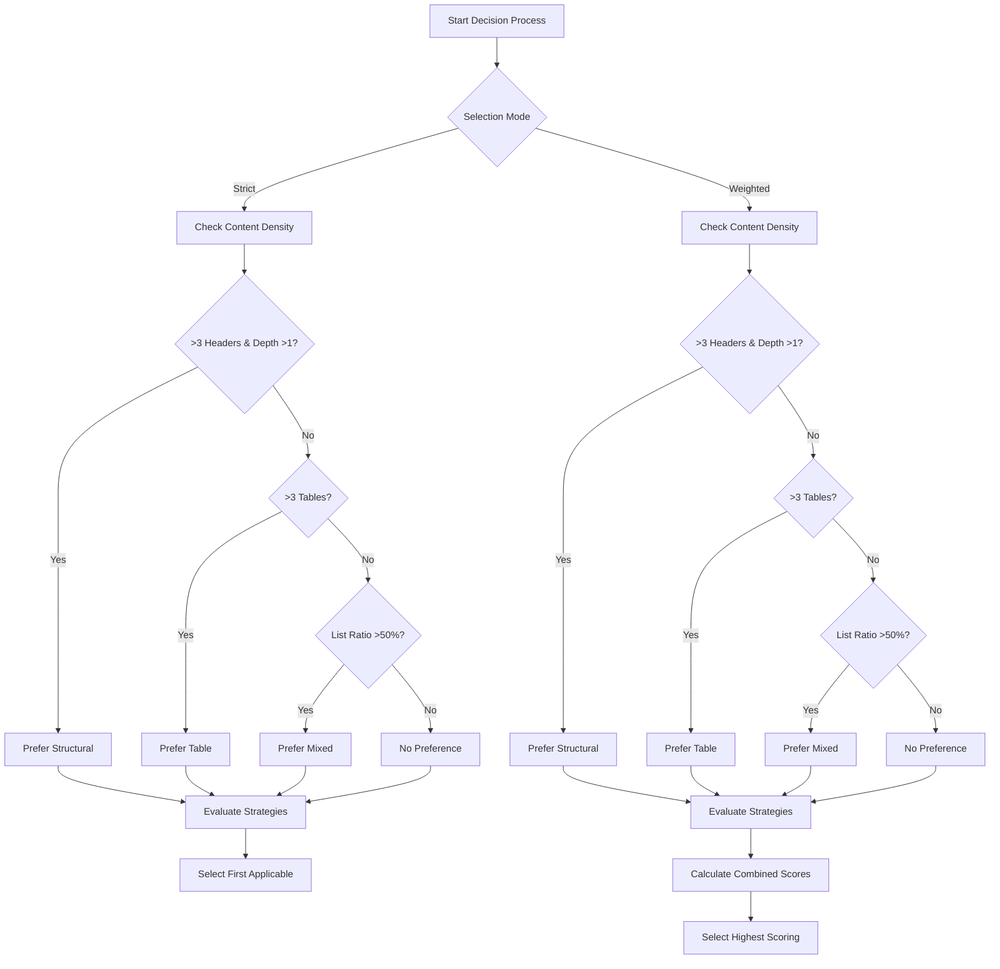
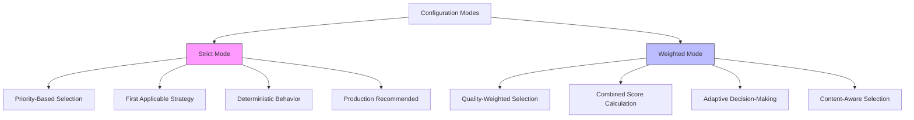
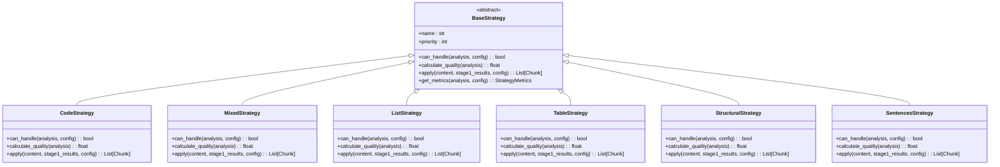
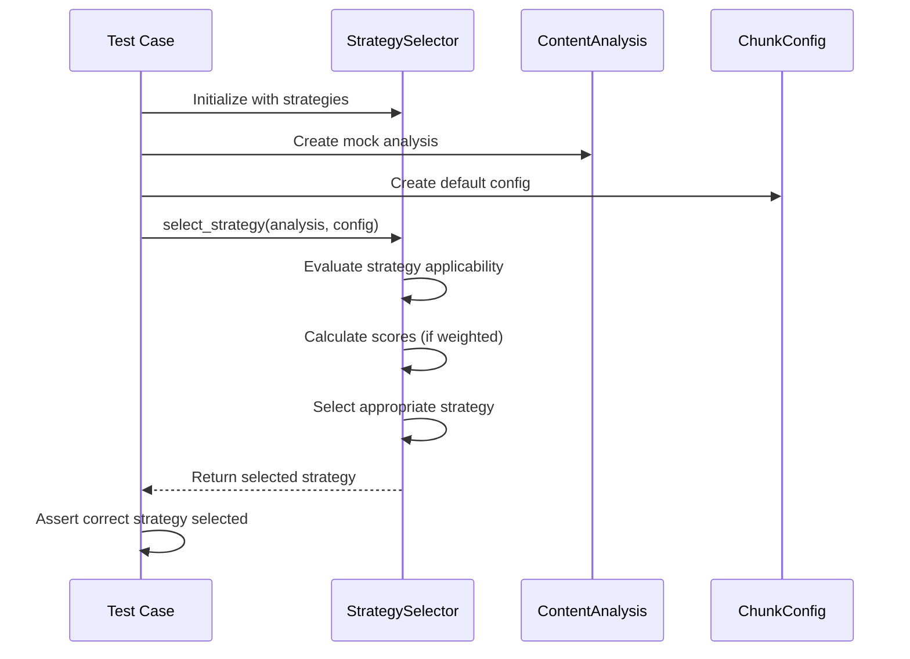
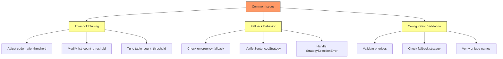
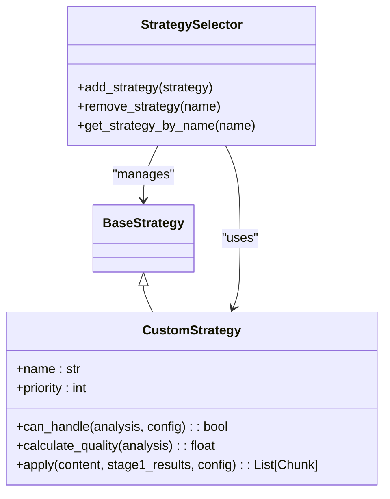

# Strategy Selection

<cite>
**Referenced Files in This Document**   
- [selector.py](file://markdown_chunker_legacy/chunker/selector.py)
- [base.py](file://markdown_chunker_legacy/chunker/strategies/base.py)
- [code_strategy.py](file://markdown_chunker_legacy/chunker/strategies/code_strategy.py)
- [list_strategy.py](file://markdown_chunker_legacy/chunker/strategies/list_strategy.py)
- [mixed_strategy.py](file://markdown_chunker_legacy/chunker/strategies/mixed_strategy.py)
- [structural_strategy.py](file://markdown_chunker_legacy/chunker/strategies/structural_strategy.py)
- [table_strategy.py](file://markdown_chunker_legacy/chunker/strategies/table_strategy.py)
- [sentences_strategy.py](file://markdown_chunker_legacy/chunker/strategies/sentences_strategy.py)
- [types.py](file://markdown_chunker_legacy/chunker/types.py)
- [algorithms.md](file://docs/reference/algorithms.md)
- [test_strategy_selector.py](file://tests/chunker/test_strategy_selector.py)
</cite>

## Table of Contents
1. [Introduction](#introduction)
2. [Strategy Selection Mechanism](#strategy-selection-mechanism)
3. [Content Analysis Metrics](#content-analysis-metrics)
4. [Priority-Based Scoring System](#priority-based-scoring-system)
5. [Decision Tree Logic](#decision-tree-logic)
6. [Configuration Modes](#configuration-modes)
7. [Strategy Implementation Details](#strategy-implementation-details)
8. [Testing and Examples](#testing-and-examples)
9. [Common Issues and Troubleshooting](#common-issues-and-troubleshooting)
10. [Extending the Strategy Selection](#extending-the-strategy-selection)
11. [Conclusion](#conclusion)

## Introduction
The Strategy Selection mechanism is a core component of the markdown-chunker system, responsible for automatically choosing the most appropriate chunking strategy based on the content's characteristics. This document provides a comprehensive analysis of how the StrategySelector uses content analysis metrics to make intelligent decisions about which strategy to apply. The system evaluates various content features such as code ratio, list count, table count, and complexity score to determine the optimal approach for processing different types of Markdown documents. The selection process is governed by a priority-based scoring system and decision tree logic that ensures the most suitable strategy is chosen for each document type, from code-heavy technical documentation to mixed-content articles and structured documentation.

**Section sources**
- [selector.py](file://markdown_chunker_legacy/chunker/selector.py#L1-L57)
- [algorithms.md](file://docs/reference/algorithms.md#L1-L23)

## Strategy Selection Mechanism
The Strategy Selection mechanism is implemented through the StrategySelector class, which orchestrates the decision-making process for choosing the most appropriate chunking strategy. This mechanism operates by evaluating multiple strategies against the content analysis metrics and selecting the best fit based on configurable selection modes. The selector supports two primary modes: strict and weighted, each with distinct decision-making approaches. In strict mode, the selector prioritizes strategies based on their predefined priority levels, selecting the first applicable strategy in priority order. In weighted mode, the selector calculates a combined score that considers both priority and quality metrics, allowing for more nuanced decision-making that balances strategy priority with content suitability.

The selection process begins with the initialization of the StrategySelector with a list of available strategies, which are automatically sorted by priority. When a document needs to be processed, the selector receives the content analysis results from the Stage 1 processing and evaluates each strategy's applicability. The mechanism includes safety features such as excluding the list strategy from automatic selection due to potential mixed-content risks, and implementing fallback mechanisms to ensure that a valid strategy is always selected even when primary strategies cannot handle the content.



**Diagram sources**
- [selector.py](file://markdown_chunker_legacy/chunker/selector.py#L37-L77)
- [test_strategy_selector.py](file://tests/chunker/test_strategy_selector.py#L51-L84)

**Section sources**
- [selector.py](file://markdown_chunker_legacy/chunker/selector.py#L19-L57)
- [test_strategy_selector.py](file://tests/chunker/test_strategy_selector.py#L51-L84)

## Content Analysis Metrics
The Strategy Selection mechanism relies on a comprehensive set of content analysis metrics to evaluate document characteristics and determine the most appropriate chunking strategy. These metrics are generated during Stage 1 processing and provide quantitative measurements of various content features that influence strategy selection. The primary metrics include code_ratio, list_count, table_count, and complexity_score, each serving as a key indicator for specific content types and influencing the decision-making process.

The code_ratio metric represents the proportion of code content in the document, calculated as the total characters in code blocks divided by the total document characters. This metric is crucial for identifying code-heavy documents that would benefit from the CodeStrategy. The list_count metric tracks the number of list elements in the document, helping to identify list-heavy content that might be better processed with the ListStrategy. Similarly, the table_count metric counts the number of tables in the document, indicating whether TableStrategy would be appropriate.

The complexity_score is a composite metric that evaluates the overall structural complexity of the document by considering multiple factors such as the presence of code blocks, headers, lists, tables, and multiple programming languages. This score ranges from 0.0 to 1.0, with higher values indicating more complex documents. Additional metrics include header_count (by level), languages (by occurrence), list_ratio, table_ratio, max_header_depth, has_mixed_content, nested_list_depth, inline_code_count, average_line_length, max_line_length, empty_lines, indented_lines, punctuation_ratio, and special_chars, all of which contribute to a comprehensive understanding of the document's structure and content composition.



**Diagram sources**
- [types.py](file://markdown_chunker_legacy/chunker/types.py#L449-L603)
- [analyzer.py](file://markdown_chunker_legacy/parser/analyzer.py#L153-L258)

**Section sources**
- [types.py](file://markdown_chunker_legacy/chunker/types.py#L449-L603)
- [analyzer.py](file://markdown_chunker_legacy/parser/analyzer.py#L153-L258)

## Priority-Based Scoring System
The priority-based scoring system is a fundamental component of the Strategy Selection mechanism, providing a structured approach to ranking and selecting chunking strategies. Each strategy is assigned a priority value, with lower numbers indicating higher priority. The system uses these priorities to establish a hierarchy that guides the selection process, ensuring that more specialized strategies are considered first when their conditions are met.

The priority system works in conjunction with quality scoring to create a comprehensive evaluation framework. When operating in strict mode, the selector evaluates strategies in priority order and selects the first one that can handle the content. This approach ensures predictable behavior and prioritizes specialized strategies for specific content types. For example, the CodeStrategy has the highest priority (1) because code-heavy documents require specialized handling to preserve code block integrity.

In weighted mode, the system combines priority with quality scoring to create a final score that balances strategy priority with content suitability. The final score is calculated using a weighted formula that gives equal importance to priority weight (1/priority) and quality score. This approach allows for more nuanced decision-making, where a lower-priority strategy with a significantly higher quality score might be selected over a higher-priority strategy with a marginal quality advantage.

The scoring system also includes mechanisms to boost preferred strategies based on content density analysis. When the content analysis suggests a particular strategy would be particularly well-suited (e.g., structural strategy for documents with deep header hierarchies), that strategy receives a score boost of 0.2, increasing its likelihood of selection in weighted mode. This dynamic adjustment allows the system to adapt to content characteristics while maintaining the overall priority hierarchy.

```mermaid
flowchart TD
A[Start Scoring] --> B[Get Strategy Priority]
B --> C[Calculate Priority Weight]
C --> D[Get Quality Score]
D --> E{Can Handle Content?}
E --> |No| F[Final Score = 0]
E --> |Yes| G[Calculate Final Score]
G --> H[Apply Content Density Boost]
H --> I[Return Final Score]
C --> |priority_weight = 1 / priority| C
G --> |final_score = (priority_weight * 0.5) + (quality_score * 0.5)| G
H --> |If preferred strategy: final_score += 0.2| H
```

**Diagram sources**
- [base.py](file://markdown_chunker_legacy/chunker/strategies/base.py#L113-L116)
- [selector.py](file://markdown_chunker_legacy/chunker/selector.py#L208-L210)

**Section sources**
- [base.py](file://markdown_chunker_legacy/chunker/strategies/base.py#L96-L116)
- [selector.py](file://markdown_chunker_legacy/chunker/selector.py#L208-L210)

## Decision Tree Logic
The decision tree logic in the Strategy Selection mechanism implements a systematic approach to strategy selection based on content analysis metrics and predefined rules. This logic follows a hierarchical decision process that evaluates multiple conditions to determine the most appropriate strategy for a given document. The decision tree is documented in algorithms.md and implemented in the selector.py file, providing a transparent and predictable selection process.

The decision tree begins by checking the selection mode (strict or weighted) and then proceeds through a series of evaluations based on content density. The system first checks for structural preference by evaluating the number of headers and maximum header depth. Documents with more than three headers and a maximum depth greater than one are considered strong candidates for the StructuralStrategy. If structural preference is not indicated, the system checks for table preference, selecting the TableStrategy for documents with more than three tables.

The decision tree then evaluates list content, though with a safety consideration: the ListStrategy is excluded from automatic selection due to potential mixed-content risks, even when list_ratio exceeds 50%. Instead, the system suggests "mixed" as the preferred strategy in such cases. This safety measure prevents the loss of non-list content in mixed documents while still acknowledging the significant presence of list elements.

The decision tree also incorporates fallback mechanisms to ensure robustness. If no strategy can handle the content in strict mode, the system implements an emergency fallback to the first safe strategy. In weighted mode, if no strategy can handle the content, a StrategySelectionError is raised. This hierarchical approach ensures that the system can handle a wide variety of document types while maintaining content integrity and processing reliability.



**Diagram sources**
- [selector.py](file://markdown_chunker_legacy/chunker/selector.py#L237-L277)
- [algorithms.md](file://docs/reference/algorithms.md#L80-L104)

**Section sources**
- [selector.py](file://markdown_chunker_legacy/chunker/selector.py#L237-L277)
- [algorithms.md](file://docs/reference/algorithms.md#L80-L104)

## Configuration Modes
The Strategy Selection mechanism supports two distinct configuration modes: strict and weighted, each designed for different use cases and requirements. These modes provide flexibility in how strategies are selected, allowing users to choose between predictable priority-based selection and more nuanced quality-weighted selection.

In strict mode, the selector operates on a simple priority-based system where strategies are evaluated in order of their priority, and the first applicable strategy is selected. This mode provides deterministic behavior and is particularly useful in production environments where predictability and consistency are paramount. The strict mode is the default selection mode and ensures that specialized strategies are given precedence when their conditions are met.

The weighted mode, in contrast, employs a more sophisticated selection algorithm that combines strategy priority with quality scoring to determine the best fit. In this mode, all applicable strategies are evaluated, and a final score is calculated for each based on a weighted combination of priority and quality metrics. This approach allows for more adaptive decision-making, where a lower-priority strategy with significantly higher content suitability might be selected over a higher-priority strategy with only marginal advantages.

The choice between these modes can be configured through the mode parameter when initializing the StrategySelector. The system validates the mode parameter during initialization, raising a ValueError if an invalid mode is specified. This configuration flexibility enables users to balance between the reliability of priority-based selection and the adaptability of quality-weighted selection based on their specific requirements and content characteristics.



**Diagram sources**
- [selector.py](file://markdown_chunker_legacy/chunker/selector.py#L37-L51)
- [test_strategy_selector.py](file://tests/chunker/test_strategy_selector.py#L71-L83)

**Section sources**
- [selector.py](file://markdown_chunker_legacy/chunker/selector.py#L37-L51)
- [test_strategy_selector.py](file://tests/chunker/test_strategy_selector.py#L71-L83)

## Strategy Implementation Details
The Strategy Selection mechanism comprises several specialized strategies, each designed to handle specific content types and patterns. These strategies inherit from the BaseStrategy abstract class and implement the required methods for content handling, quality calculation, and application. The implementation details reveal a sophisticated system that balances content preservation with chunk size constraints.

The CodeStrategy (priority 1) is designed for code-heavy documents with a code_ratio ≥ 0.7 and at least three code blocks. It preserves code block atomicity, extracts code metadata (language, functions, classes), and groups related text with code blocks. The strategy allows oversize chunks for large code blocks and maintains context between code and explanations.

The MixedStrategy (priority 2) handles documents with multiple content types in significant proportions. It segments content around code blocks, groups related elements logically, and preserves semantic relationships. This strategy is particularly effective for complex documents with mixed code, lists, tables, and text.

The ListStrategy (priority 3) preserves list hierarchy and handles nested structures, ensuring parent-child relationships remain intact. However, it is excluded from automatic selection for safety reasons, as it might lose non-list content in mixed documents.

The TableStrategy (priority 4) specializes in documents with multiple tables, preserving table integrity and handling complex table structures. The StructuralStrategy (priority 5) focuses on documents with hierarchical structures, using headers as natural chunk boundaries.

Finally, the SentencesStrategy (priority 6) serves as the fallback strategy, capable of handling any content by splitting at sentence boundaries. This comprehensive strategy ecosystem ensures that virtually any Markdown document can be processed effectively.



**Diagram sources**
- [base.py](file://markdown_chunker_legacy/chunker/strategies/base.py#L16-L45)
- [code_strategy.py](file://markdown_chunker_legacy/chunker/strategies/code_strategy.py#L42-L54)
- [mixed_strategy.py](file://markdown_chunker_legacy/chunker/strategies/mixed_strategy.py#L75-L87)
- [list_strategy.py](file://markdown_chunker_legacy/chunker/strategies/list_strategy.py#L58-L69)
- [structural_strategy.py](file://markdown_chunker_legacy/chunker/strategies/structural_strategy.py#L67-L78)
- [table_strategy.py](file://markdown_chunker_legacy/chunker/strategies/table_strategy.py#L55-L66)
- [sentences_strategy.py](file://markdown_chunker_legacy/chunker/strategies/sentences_strategy.py#L56-L67)

**Section sources**
- [base.py](file://markdown_chunker_legacy/chunker/strategies/base.py#L16-L45)
- [code_strategy.py](file://markdown_chunker_legacy/chunker/strategies/code_strategy.py#L42-L54)
- [mixed_strategy.py](file://markdown_chunker_legacy/chunker/strategies/mixed_strategy.py#L75-L87)
- [list_strategy.py](file://markdown_chunker_legacy/chunker/strategies/list_strategy.py#L58-L69)
- [structural_strategy.py](file://markdown_chunker_legacy/chunker/strategies/structural_strategy.py#L67-L78)
- [table_strategy.py](file://markdown_chunker_legacy/chunker/strategies/table_strategy.py#L55-L66)
- [sentences_strategy.py](file://markdown_chunker_legacy/chunker/strategies/sentences_strategy.py#L56-L67)

## Testing and Examples
The Strategy Selection mechanism is thoroughly tested through a comprehensive suite of unit tests that validate both individual strategy behavior and the overall selection logic. The test_strategy_selector.py file contains extensive test cases that cover various scenarios, including strict and weighted mode selection, edge cases, and error handling.

Key test examples demonstrate how different content profiles trigger specific strategies. For instance, a document with a high code ratio (≥0.7) and multiple code blocks will trigger the CodeStrategy in strict mode, while a document with balanced proportions of code, text, and lists will activate the MixedStrategy. The tests also verify the fallback behavior, ensuring that the SentencesStrategy is selected when no other strategy can handle the content.

The testing framework includes validation of strategy metrics, selection explanations, and configuration validation. Tests confirm that the system correctly identifies duplicate strategy priorities, missing fallback strategies, and duplicate strategy names. The explain_selection method is tested to ensure it provides detailed information about the selection process, including content analysis metrics and strategy evaluation scores.

Performance testing is also conducted to ensure the selection process is efficient even with complex documents. The tests verify that the selector can handle various document sizes and structures without significant performance degradation, maintaining responsiveness in real-world usage scenarios.



**Diagram sources**
- [test_strategy_selector.py](file://tests/chunker/test_strategy_selector.py#L51-L438)
- [test_strategy_selector.py](file://tests/chunker/test_strategy_selector.py#L213-L252)

**Section sources**
- [test_strategy_selector.py](file://tests/chunker/test_strategy_selector.py#L51-L438)

## Common Issues and Troubleshooting
Several common issues can arise when working with the Strategy Selection mechanism, primarily related to threshold tuning, fallback behavior, and configuration validation. Understanding these issues and their solutions is crucial for effective system operation and troubleshooting.

One common issue is threshold tuning, where the default thresholds for strategy activation may not align with specific content characteristics. For example, the CodeStrategy requires a code_ratio ≥ 0.7, which might be too high for some documentation that contains substantial code examples but also extensive explanations. Similarly, the ListStrategy requires either ≥5 lists or ≥60% list content, which might not capture documents with moderate list usage.

Fallback behavior can also present challenges. When primary strategies cannot process content, the system either uses an emergency fallback (in strict mode) or raises a StrategySelectionError (in weighted mode). This behavior ensures robustness but might mask underlying issues with strategy configuration or content analysis.

Configuration issues are another common problem area. The system validates strategy configurations and reports issues such as duplicate priorities, missing fallback strategies, and duplicate strategy names. These validation checks help prevent configuration errors but require attention during system setup and strategy management.

To address these issues, the system provides several troubleshooting tools. The explain_selection method offers detailed insights into the selection process, showing content analysis metrics and strategy evaluation scores. The get_strategy_metrics method provides comprehensive information about all strategies' applicability and scores, helping identify why certain strategies were or weren't selected.



**Diagram sources**
- [selector.py](file://markdown_chunker_legacy/chunker/selector.py#L369-L401)
- [test_strategy_selector.py](file://tests/chunker/test_strategy_selector.py#L253-L305)

**Section sources**
- [selector.py](file://markdown_chunker_legacy/chunker/selector.py#L369-L401)
- [test_strategy_selector.py](file://tests/chunker/test_strategy_selector.py#L253-L305)

## Extending the Strategy Selection
Extending the Strategy Selection mechanism involves creating new strategy classes that inherit from BaseStrategy and implementing the required methods. This extensibility allows users to customize the system for specific content types or processing requirements. To add a custom strategy, developers must implement the name, priority, can_handle, calculate_quality, and apply methods, ensuring the new strategy integrates seamlessly with the existing selection logic.

The system provides methods for dynamic strategy management, including add_strategy and remove_strategy, which allow strategies to be added or removed from the selector at runtime. This flexibility enables adaptive configuration based on specific use cases or content characteristics. When adding a new strategy, the system automatically validates that the strategy name is unique and re-sorts the strategies by priority.

Custom strategies should follow the same design principles as the built-in strategies, focusing on specific content patterns and providing appropriate quality scoring. The can_handle method should define clear criteria for when the strategy is applicable, while the calculate_quality method should provide a meaningful score that reflects how well the strategy fits the content.

The system's modular design makes it relatively straightforward to extend, with clear interfaces and comprehensive testing. Developers can leverage the existing test framework to validate new strategies and ensure they integrate correctly with the selection mechanism. This extensibility ensures that the system can adapt to evolving requirements and new content types over time.



**Diagram sources**
- [selector.py](file://markdown_chunker_legacy/chunker/selector.py#L418-L450)
- [base.py](file://markdown_chunker_legacy/chunker/strategies/base.py#L31-L45)

**Section sources**
- [selector.py](file://markdown_chunker_legacy/chunker/selector.py#L418-L450)
- [base.py](file://markdown_chunker_legacy/chunker/strategies/base.py#L31-L45)

## Conclusion
The Strategy Selection mechanism represents a sophisticated and adaptive system for automatically choosing the most appropriate chunking strategy based on content analysis metrics. By leveraging a combination of priority-based selection, quality scoring, and decision tree logic, the system effectively handles a wide variety of Markdown document types, from code-heavy technical documentation to mixed-content articles and structured documentation.

The mechanism's design balances predictability with adaptability, offering both strict and weighted selection modes to accommodate different use cases and requirements. The comprehensive content analysis metrics provide a detailed understanding of document characteristics, enabling informed strategy selection decisions. The priority-based scoring system ensures that specialized strategies are given appropriate precedence while allowing for nuanced decision-making in weighted mode.

The system's robustness is enhanced by safety features such as excluding the ListStrategy from automatic selection and implementing fallback mechanisms to handle edge cases. Comprehensive testing and validation ensure reliable operation, while the explain_selection functionality provides transparency into the decision-making process.

The extensible design allows for the addition of custom strategies, ensuring the system can adapt to evolving requirements and new content types. This combination of sophistication, reliability, and flexibility makes the Strategy Selection mechanism a powerful component of the markdown-chunker system, capable of delivering optimal chunking results across diverse content landscapes.

**Section sources**
- [selector.py](file://markdown_chunker_legacy/chunker/selector.py#L1-L466)
- [algorithms.md](file://docs/reference/algorithms.md#L1-L657)