# Structural Strategy

<cite>
**Referenced Files in This Document**
- [structural_strategy.py](file://markdown_chunker/chunker/strategies/structural_strategy.py)
- [selector.py](file://markdown_chunker/chunker/selector.py)
- [section_builder.py](file://markdown_chunker/chunker/section_builder.py)
- [types.py](file://markdown_chunker/chunker/types.py)
- [base.py](file://markdown_chunker/chunker/strategies/base.py)
- [basic_usage.py](file://examples/basic_usage.py)
- [structural.md](file://tests/fixtures/structural.md)
- [mixed.md](file://tests/fixtures/mixed.md)
</cite>

## Table of Contents
1. [Introduction](#introduction)
2. [Purpose and Philosophy](#purpose-and-philosophy)
3. [Core Architecture](#core-architecture)
4. [Implementation Details](#implementation-details)
5. [Strategy Selection Logic](#strategy-selection-logic)
6. [Header Detection and Hierarchy Building](#header-detection-and-hierarchy-building)
7. [Section Creation and Processing](#section-creation-and-processing)
8. [Chunk Generation and Optimization](#chunk-generation-and-optimization)
9. [Phase 2 Implementation](#phase-2-implementation)
10. [Common Issues and Mitigation](#common-issues-and-mitigation)
11. [Configuration and Usage Guidelines](#configuration-and-usage-guidelines)
12. [Performance Considerations](#performance-considerations)
13. [Best Practices](#best-practices)

## Introduction

The Structural Strategy is a sophisticated chunking approach designed specifically for Markdown documents with clear hierarchical structure. Unlike other strategies that focus on content type (code, lists, tables) or sentence boundaries, the Structural Strategy prioritizes document organization by leveraging header hierarchies to create semantically meaningful chunks that preserve the natural structure of well-organized documentation.

This strategy transforms the way we think about document chunking by recognizing that many technical documents, API references, user manuals, and educational materials are structured around headers that define logical sections and subsections. By respecting these structural boundaries, the strategy ensures that chunks remain coherent and maintain their informational integrity.

## Purpose and Philosophy

### Core Philosophy

The Structural Strategy operates on the principle that **document structure is the primary organizing principle** for many types of content. When a document has a clear header hierarchy (H1-H6), these headers naturally define logical sections that should be treated as cohesive units during chunking.

### Ideal Use Cases

The strategy excels in scenarios where:
- Documents have 3+ headers with multiple levels of hierarchy
- Content is well-organized with clear section boundaries
- Preservation of document structure is crucial for understanding
- The document serves as reference material (API docs, manuals, specifications)
- Users need to navigate between related sections

### Key Benefits

1. **Semantic Coherence**: Chunks maintain logical relationships between related content
2. **Structure Preservation**: Natural document boundaries are respected
3. **Navigation Support**: Header path information enables intelligent navigation
4. **Context Maintenance**: Related content stays together in the same chunk
5. **Hierarchical Awareness**: Deep structure is preserved through metadata

## Core Architecture

The Structural Strategy follows a multi-phase approach that combines header detection, hierarchy building, section creation, and intelligent chunking:

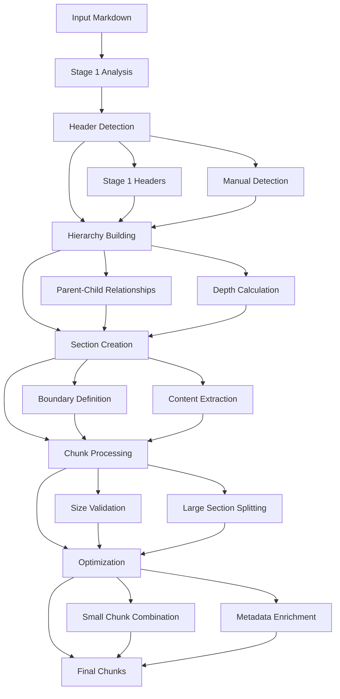

**Diagram sources**
- [structural_strategy.py](file://markdown_chunker/chunker/strategies/structural_strategy.py#L198-L244)

## Implementation Details

### Strategy Class Structure

The Structural Strategy inherits from `BaseStrategy` and implements the complete chunking pipeline:

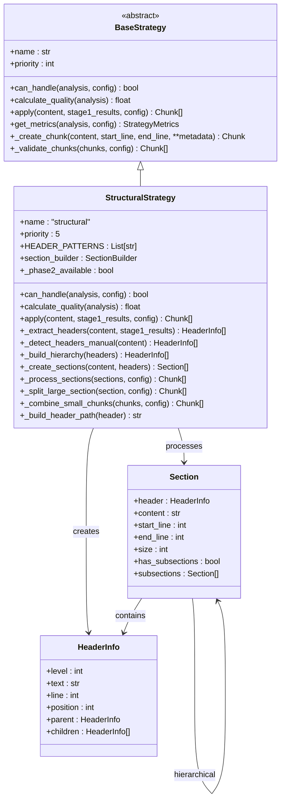

**Diagram sources**
- [structural_strategy.py](file://markdown_chunker/chunker/strategies/structural_strategy.py#L22-L49)
- [base.py](file://markdown_chunker/chunker/strategies/base.py#L16-L94)

### Header Detection Patterns

The strategy supports multiple header formats commonly found in Markdown documents:

| Pattern Type | Regex Pattern | Example | Level Determination |
|--------------|---------------|---------|-------------------|
| ATX Headers | `^(#{1,6})\s+(.+?)(?:\s*#*)?$` | `# Title`, `## Section`, `### Subsection` | Number of `#` characters |
| Setext Headers (H1) | `^(.+?)\n([=]{3,})$` | `Title<br>=====` | Underlined with `===` |
| Setext Headers (H2) | `^(.+?)\n([-]{3,})$` | `Title<br>-----` | Underlined with `---` |

**Section sources**
- [structural_strategy.py](file://markdown_chunker/chunker/strategies/structural_strategy.py#L69-L75)

### Priority and Quality Scoring

The strategy operates with medium-low priority (5) and calculates quality based on several factors:

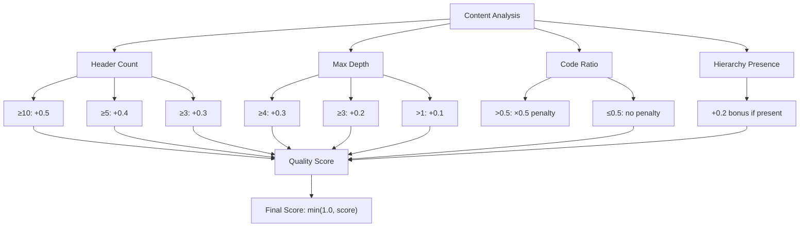

**Diagram sources**
- [structural_strategy.py](file://markdown_chunker/chunker/strategies/structural_strategy.py#L140-L196)

**Section sources**
- [structural_strategy.py](file://markdown_chunker/chunker/strategies/structural_strategy.py#L140-L196)

## Strategy Selection Logic

### Can Handle Evaluation

The strategy determines applicability based on two primary criteria:

1. **Minimum Header Count**: At least `header_count_threshold` headers (default: 3)
2. **Maximum Header Depth**: Document must have multiple levels of hierarchy (`max_header_depth > 1`)

### Automatic Selection Process

The StrategySelector evaluates strategies in priority order, selecting the first one that can handle the content:

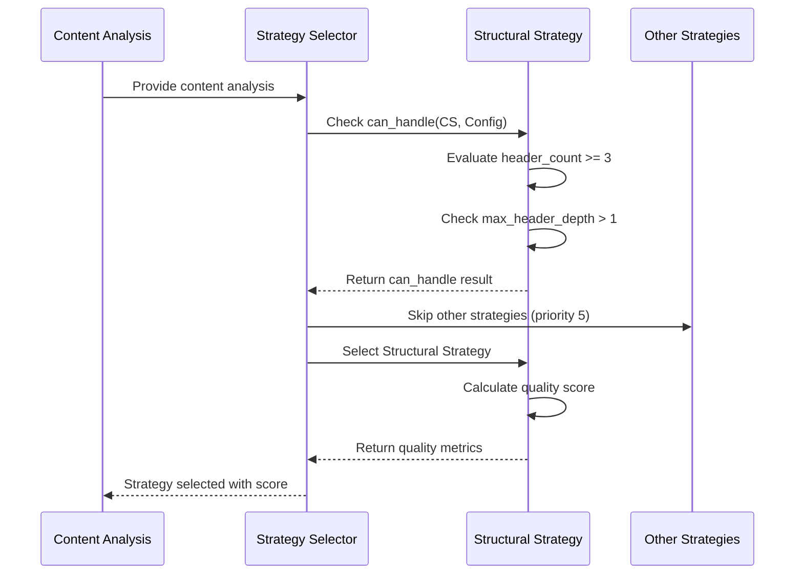

**Diagram sources**
- [selector.py](file://markdown_chunker/chunker/selector.py#L79-L98)
- [structural_strategy.py](file://markdown_chunker/chunker/strategies/structural_strategy.py#L113-L138)

**Section sources**
- [selector.py](file://markdown_chunker/chunker/selector.py#L79-L98)
- [structural_strategy.py](file://markdown_chunker/chunker/strategies/structural_strategy.py#L113-L138)

## Header Detection and Hierarchy Building

### Dual Detection Approach

The strategy employs a two-tier header detection system:

#### Phase 1: Stage 1 Results Utilization
When Stage 1 processing is available, the strategy first attempts to use pre-detected headers from the parsing phase:

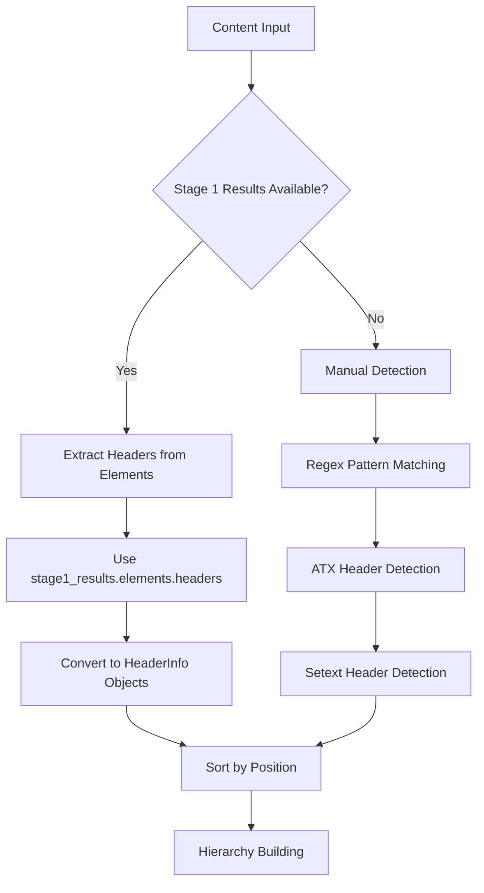

**Diagram sources**
- [structural_strategy.py](file://markdown_chunker/chunker/strategies/structural_strategy.py#L245-L275)

#### Phase 2: Manual Detection Fallback
When Stage 1 results are unavailable or headers are missing, the strategy falls back to manual detection using regex patterns:

**Section sources**
- [structural_strategy.py](file://markdown_chunker/chunker/strategies/structural_strategy.py#L245-L322)

### Hierarchy Building Algorithm

The hierarchy construction uses a stack-based approach to establish parent-child relationships:

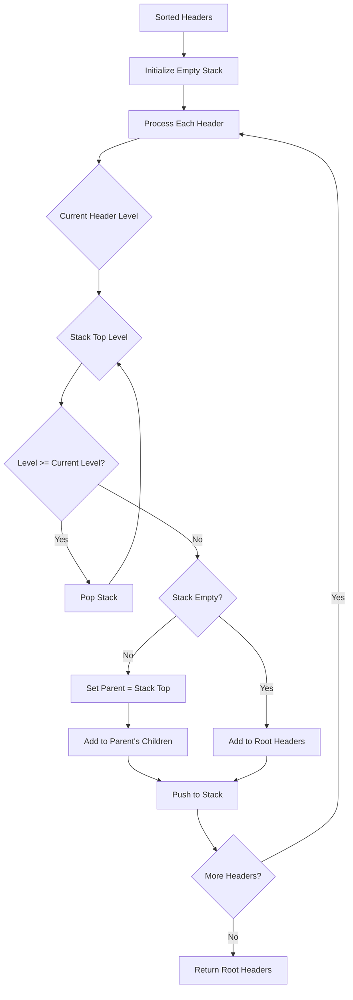

**Diagram sources**
- [structural_strategy.py](file://markdown_chunker/chunker/strategies/structural_strategy.py#L324-L356)

**Section sources**
- [structural_strategy.py](file://markdown_chunker/chunker/strategies/structural_strategy.py#L324-L356)

### Header Path Construction

The strategy builds hierarchical paths for navigation and metadata enrichment:


**Diagram sources**
- [structural_strategy.py](file://markdown_chunker/chunker/strategies/structural_strategy.py#L760-L779)

**Section sources**
- [structural_strategy.py](file://markdown_chunker/chunker/strategies/structural_strategy.py#L760-L779)

## Section Creation and Processing

### Section Definition

Each section is defined by a header and encompasses all content up to the next header of the same or higher level:

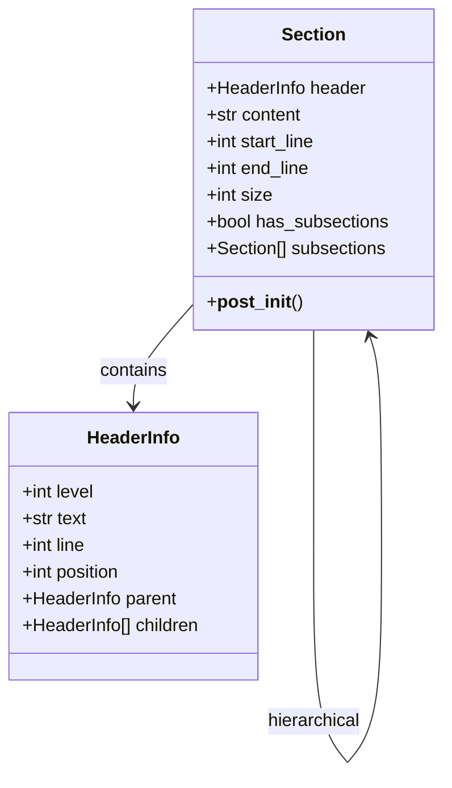

**Diagram sources**
- [structural_strategy.py](file://markdown_chunker/chunker/strategies/structural_strategy.py#L38-L52)

### Section Creation Process

The strategy creates sections by defining boundaries between headers:

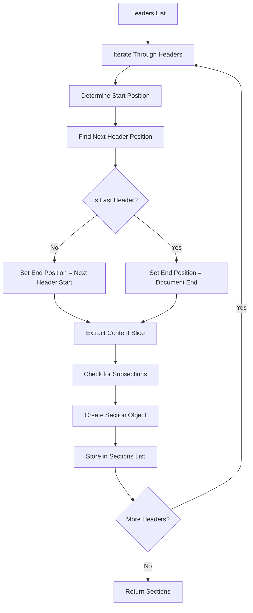

**Diagram sources**
- [structural_strategy.py](file://markdown_chunker/chunker/strategies/structural_strategy.py#L359-L419)

**Section sources**
- [structural_strategy.py](file://markdown_chunker/chunker/strategies/structural_strategy.py#L359-L419)

## Chunk Generation and Optimization

### Large Section Handling

When sections exceed the maximum chunk size, the strategy employs intelligent splitting:

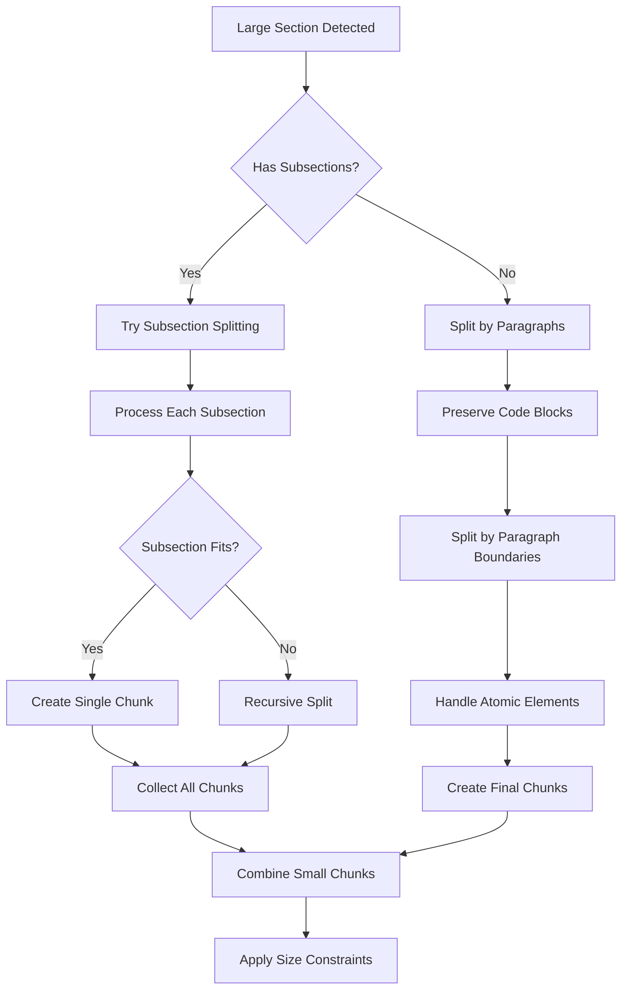

**Diagram sources**
- [structural_strategy.py](file://markdown_chunker/chunker/strategies/structural_strategy.py#L485-L532)

### Small Chunk Combination

To avoid creating too many small chunks, the strategy combines adjacent chunks when beneficial:

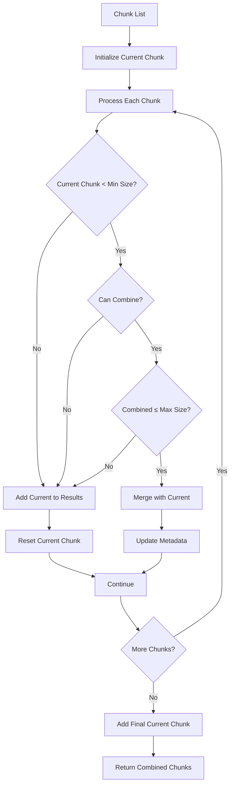

**Diagram sources**
- [structural_strategy.py](file://markdown_chunker/chunker/strategies/structural_strategy.py#L707-L758)

**Section sources**
- [structural_strategy.py](file://markdown_chunker/chunker/strategies/structural_strategy.py#L707-L758)

### Metadata Enrichment

Each chunk receives comprehensive metadata for navigation and context:

| Metadata Field | Description | Example Value |
|----------------|-------------|---------------|
| `header_level` | Numeric header level (1-6) | `2` |
| `header_text` | Header title text | `"Installation"` |
| `header_path` | Full hierarchical path | `"/Documentation/Getting Started/Installation"` |
| `has_subsections` | Whether section has child sections | `true` |
| `parent_header_path` | Path to parent section | `"/Documentation/Getting Started"` |
| `section_part` | Indicates chunk is part of larger section | `true` |
| `original_section_size` | Size of original section | `1500` |

**Section sources**
- [structural_strategy.py](file://markdown_chunker/chunker/strategies/structural_strategy.py#L452-L483)

## Phase 2 Implementation

### Section Builder Integration

Phase 2 introduces the SectionBuilder for enhanced semantic quality:

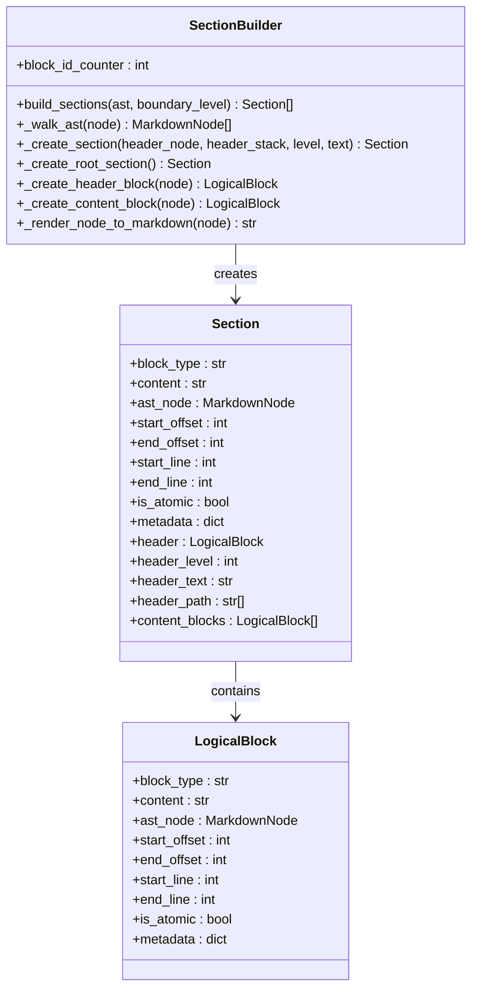

**Diagram sources**
- [section_builder.py](file://markdown_chunker/chunker/section_builder.py#L43-L341)

### Enhanced Chunking Pipeline

Phase 2 provides improved chunking through AST-based section building:

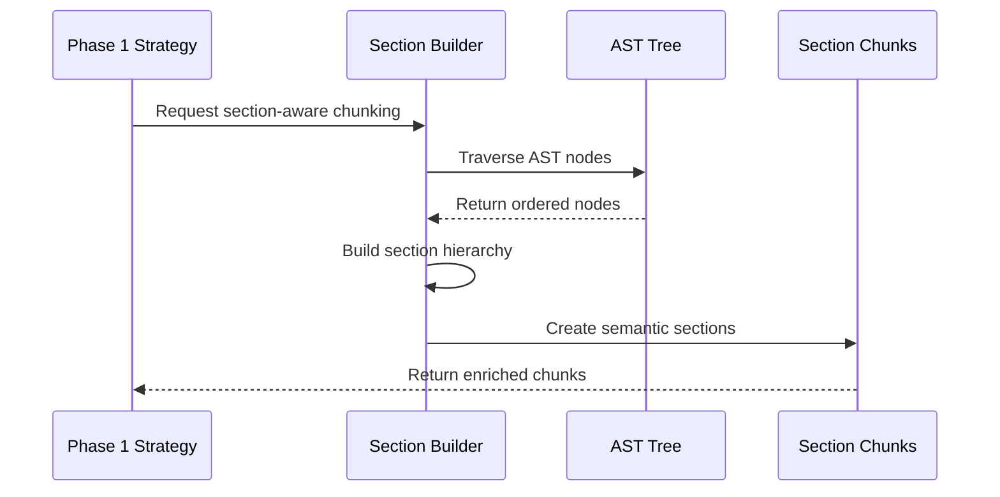

**Diagram sources**
- [section_builder.py](file://markdown_chunker/chunker/section_builder.py#L62-L130)

**Section sources**
- [section_builder.py](file://markdown_chunker/chunker/section_builder.py#L62-L130)

## Common Issues and Mitigation

### Issue 1: Large Sections with No Subsections

**Problem**: A section is too large to fit in a single chunk but lacks subsections for splitting.

**Solution**: The strategy falls back to paragraph-based splitting while preserving atomic elements:

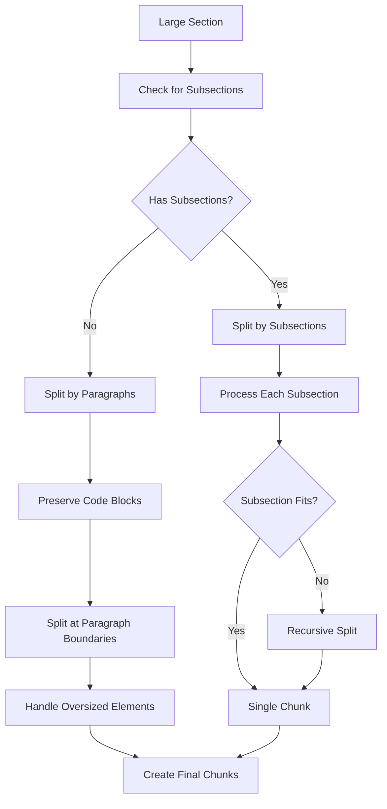

**Diagram sources**
- [structural_strategy.py](file://markdown_chunker/chunker/strategies/structural_strategy.py#L485-L532)

### Issue 2: Deeply Nested Structures

**Problem**: Documents with excessive header nesting can lead to complex chunking decisions.

**Solution**: The strategy maintains hierarchy awareness through metadata and provides flexible boundary levels:

**Section sources**
- [structural_strategy.py](file://markdown_chunker/chunker/strategies/structural_strategy.py#L485-L532)

### Issue 3: Mixed Content in Sections

**Problem**: Sections containing code blocks, tables, and text require careful handling to avoid breaking atomic elements.

**Solution**: The strategy preserves atomic elements as single units while intelligently splitting surrounding content:

**Section sources**
- [structural_strategy.py](file://markdown_chunker/chunker/strategies/structural_strategy.py#L534-L611)

## Configuration and Usage Guidelines

### Recommended Configuration Profiles

#### For Structured Documentation
```python
config = ChunkConfig.for_structured_docs()
# Optimized for: Well-organized docs with clear sections
# Settings: header_count_threshold=2, smaller chunks, overlap=150
```

#### For API Documentation
```python
config = ChunkConfig.for_code_heavy()
# Optimized for: API references with code examples
# Settings: header_count_threshold=3, larger chunks, overlap=300
```

### Force Strategy Selection

While the strategy selector automatically chooses the best approach, you can force the Structural Strategy:

```python
# Force structural strategy regardless of content analysis
chunks = chunker.chunk(content, strategy="structural")

# Or use with specific configuration
config = ChunkConfig(
    header_count_threshold=2,  # More aggressive structural detection
    max_chunk_size=3000,       # Medium-sized chunks
    overlap_size=150           # Moderate overlap
)
chunks = chunker.chunk(content, config=config, strategy="structural")
```

### When to Force Structural Strategy

Force the Structural Strategy when:
- Document has clear header hierarchy but low header count
- Content analysis incorrectly identifies document type
- Specific navigation requirements demand structure preservation
- Testing or debugging with known structured content

**Section sources**
- [types.py](file://markdown_chunker/chunker/types.py#L740-L781)

## Performance Considerations

### Memory Usage

The Structural Strategy's memory consumption depends on:
- **Header Count**: More headers require more memory for hierarchy storage
- **Section Complexity**: Deep hierarchies increase memory overhead
- **Content Size**: Larger documents require more processing capacity

### Processing Time

Processing time scales with:
- **Document Length**: Linear scaling with content size
- **Header Density**: More headers increase parsing complexity
- **Hierarchy Depth**: Deeper structures require more tree traversal

### Optimization Strategies

1. **Early Termination**: Stop processing when chunks meet requirements
2. **Lazy Loading**: Process sections only when needed
3. **Caching**: Cache header detection results for repeated processing
4. **Streaming**: Use streaming mode for very large documents

## Best Practices

### Document Preparation

1. **Clear Header Structure**: Use consistent header levels throughout the document
2. **Meaningful Titles**: Ensure header text accurately describes content
3. **Logical Organization**: Arrange headers in a natural reading order
4. **Appropriate Depth**: Limit header nesting to 4-6 levels for readability

### Configuration Tuning

1. **Adjust Thresholds**: Modify `header_count_threshold` based on document characteristics
2. **Size Balancing**: Balance `max_chunk_size` and `min_chunk_size` for optimal results
3. **Overlap Settings**: Use moderate overlap (10-20%) for RAG applications
4. **Priority Management**: Understand how strategy priorities affect selection

### Metadata Utilization

1. **Navigation**: Use `header_path` for intelligent document navigation
2. **Filtering**: Leverage `header_level` for content categorization
3. **Context**: Utilize `parent_header_path` for hierarchical browsing
4. **Quality**: Monitor chunk sizes and combine small chunks for efficiency

### Integration Patterns

1. **Fallback Strategy**: Always configure a fallback strategy for edge cases
2. **Validation**: Validate chunk metadata for consistency
3. **Monitoring**: Track strategy selection and performance metrics
4. **Testing**: Test with representative document samples

**Section sources**
- [structural_strategy.py](file://markdown_chunker/chunker/strategies/structural_strategy.py#L113-L138)