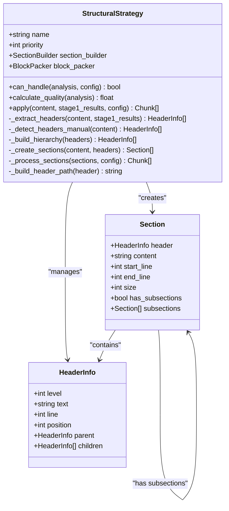
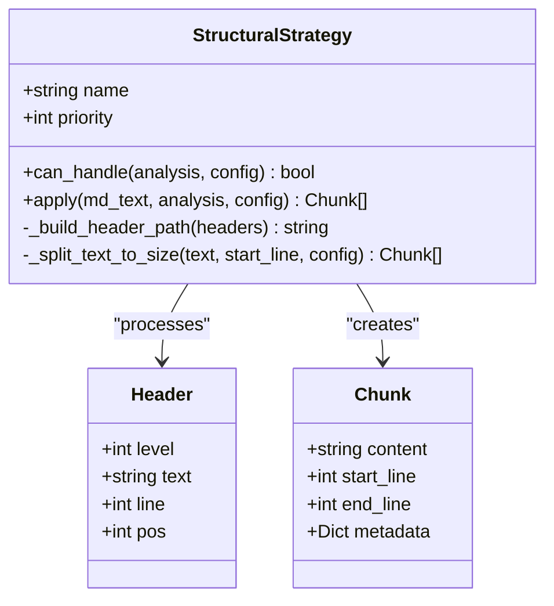
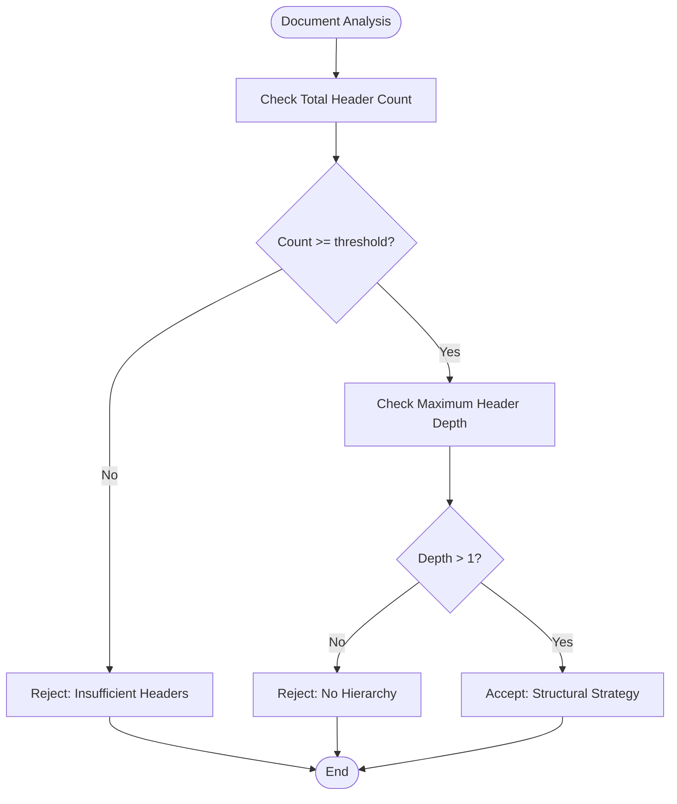
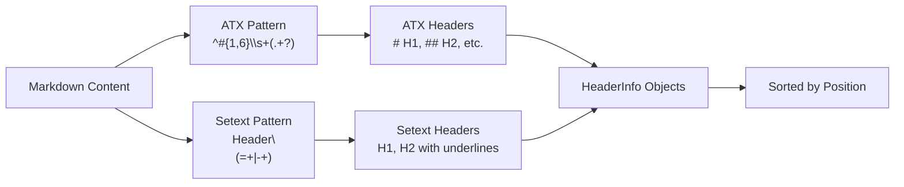
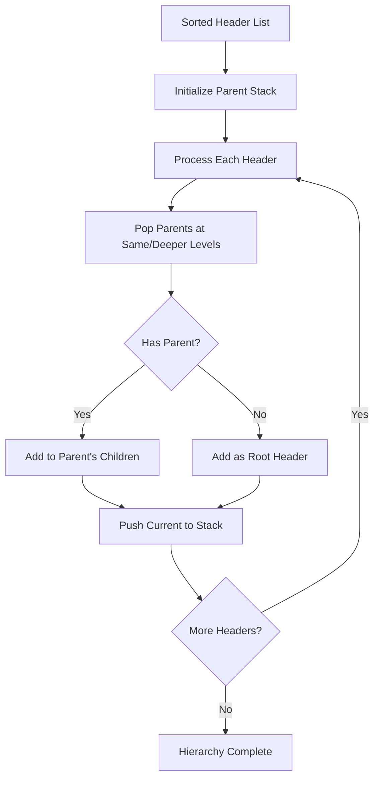
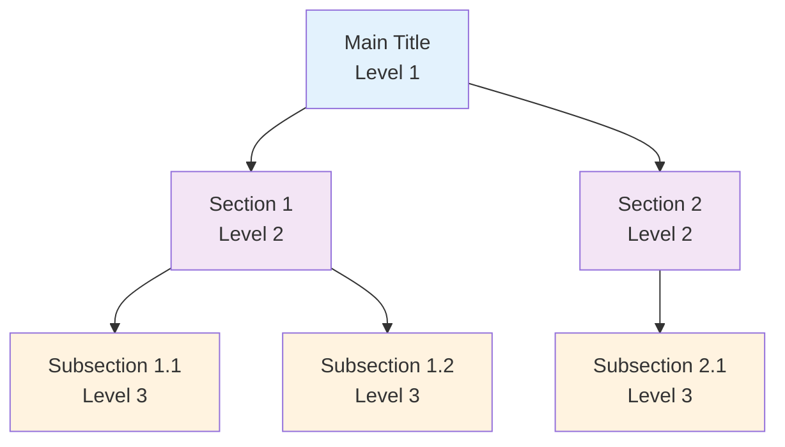
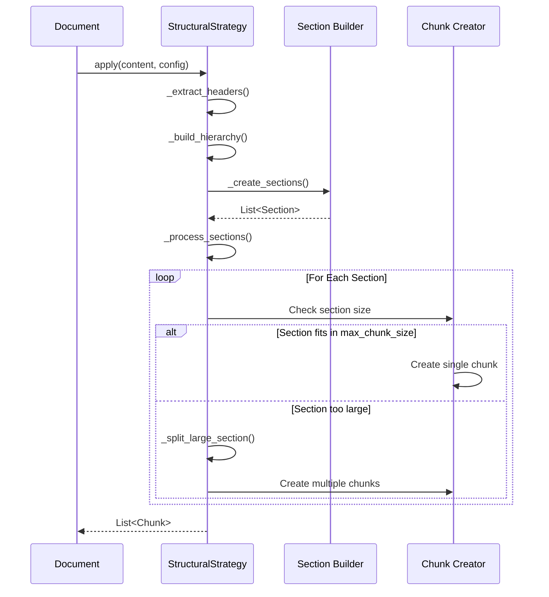
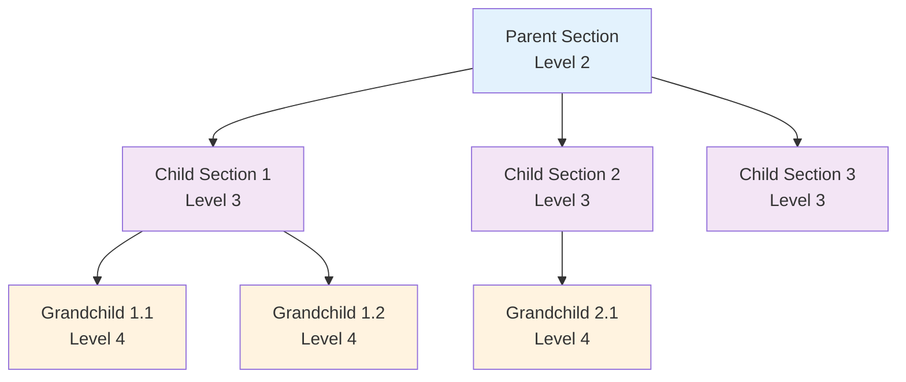
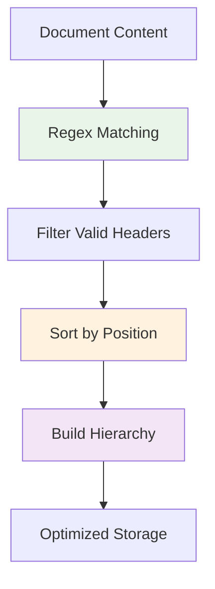

# Structural Strategy

<cite>
**Referenced Files in This Document**
- [structural_strategy.py](file://markdown_chunker_legacy/chunker/strategies/structural_strategy.py)
- [structural.py](file://markdown_chunker_v2/strategies/structural.py)
- [test_structural_strategy.py](file://tests/chunker/test_strategies/test_structural_strategy.py)
- [structural.md](file://tests/fixtures/structural.md)
- [edge_cases.md](file://tests/fixtures/edge_cases.md)
- [config.py](file://markdown_chunker_v2/config.py)
- [types.py](file://markdown_chunker_v2/types.py)
- [types.py](file://markdown_chunker_legacy/chunker/types.py)
</cite>

## Table of Contents
1. [Introduction](#introduction)
2. [Implementation Overview](#implementation-overview)
3. [Activation Conditions](#activation-conditions)
4. [Priority Level](#priority-level)
5. [Header Detection and Parsing](#header-detection-and-parsing)
6. [Hierarchical Structure Management](#hierarchical-structure-management)
7. [Chunk Creation Process](#chunk-creation-process)
8. [Multi-Level Header Support](#multi-level-header-support)
9. [Configuration Options](#configuration-options)
10. [Performance Considerations](#performance-considerations)
11. [Common Issues and Solutions](#common-issues-and-solutions)
12. [Best Practices](#best-practices)
13. [Integration Examples](#integration-examples)

## Introduction

The Structural Strategy is a sophisticated chunking approach designed specifically for markdown documents with clear hierarchical structure. It operates on the principle that well-structured documents benefit from being split according to their natural header hierarchy, preserving semantic relationships and maintaining contextual coherence across chunk boundaries.

Unlike simpler strategies that treat documents as flat text streams, the Structural Strategy recognizes the inherent organization in documents with multiple header levels and creates chunks that respect this hierarchy. This approach is particularly valuable for long-form documentation, user guides, API references, and any content where maintaining section relationships is crucial for comprehension.

## Implementation Overview

The Structural Strategy implementation consists of two main variants: the legacy implementation in `markdown_chunker_legacy` and the simplified v2 implementation in `markdown_chunker_v2`.

### Legacy Implementation Architecture



**Diagram sources**
- [structural_strategy.py](file://markdown_chunker_legacy/chunker/strategies/structural_strategy.py#L26-L800)

### V2 Implementation Architecture



**Diagram sources**
- [structural.py](file://markdown_chunker_v2/strategies/structural.py#L15-L151)
- [types.py](file://markdown_chunker_v2/types.py#L52-L66)

**Section sources**
- [structural_strategy.py](file://markdown_chunker_legacy/chunker/strategies/structural_strategy.py#L59-L136)
- [structural.py](file://markdown_chunker_v2/strategies/structural.py#L15-L31)

## Activation Conditions

The Structural Strategy activates under specific conditions that ensure it only processes documents with sufficient structural characteristics. These conditions are carefully designed to prevent inappropriate use while maximizing effectiveness for suitable documents.

### Core Activation Criteria

The strategy evaluates two primary factors during the activation phase:

1. **Minimum Header Count**: Documents must contain a configurable minimum number of headers
2. **Header Hierarchy Depth**: The document must demonstrate multi-level structure

### Implementation Details



**Diagram sources**
- [structural_strategy.py](file://markdown_chunker_legacy/chunker/strategies/structural_strategy.py#L137-L162)

### Threshold Configuration

The activation threshold is controlled through the `header_count_threshold` parameter, which defaults to 3 but can be adjusted based on specific requirements:

| Threshold Value | Activation Criteria | Use Case |
|----------------|-------------------|----------|
| 1 | Any document with headers | Extremely permissive |
| 2 | Minimal header requirement | Aggressive structural detection |
| 3 | Standard threshold | Balanced approach |
| 5+ | Conservative filtering | High-quality content only |

**Section sources**
- [structural_strategy.py](file://markdown_chunker_legacy/chunker/strategies/structural_strategy.py#L137-L162)
- [config.py](file://markdown_chunker_v2/config.py#L41-L42)

## Priority Level

The Structural Strategy operates with a priority level of 2, positioning it strategically within the chunking pipeline. This priority reflects its role as a specialized strategy that should be considered after simpler approaches but before fallback mechanisms.

### Priority Hierarchy

```mermaid
graph TD
Strategy1[Code-Aware Strategy<br/>Priority: 1] --> Strategy2[Structural Strategy<br/>Priority: 2]
Strategy2 --> Strategy3[List Strategy<br/>Priority: 3]
Strategy3 --> Strategy4[Table Strategy<br/>Priority: 4]
Strategy4 --> Strategy5[Sentence Strategy<br/>Priority: 5]
Style Strategy1 Fill:#e1f5fe
Style Strategy2 Fill:#f3e5f5
Style Strategy3 Fill:#fff3e0
Style Strategy4 Fill:#fce4ec
Style Strategy5 Fill:#f1f8e9
```

### Strategic Positioning

The priority level 2 designation serves several important purposes:

1. **Resource Efficiency**: Structural Strategy is computationally more expensive than simpler strategies
2. **Quality Assurance**: It only activates when structural characteristics are present
3. **Fallback Protection**: Allows sentence-based strategies to handle unstructured content
4. **Pipeline Optimization**: Ensures appropriate strategy selection order

**Section sources**
- [structural_strategy.py](file://markdown_chunker_legacy/chunker/strategies/structural_strategy.py#L133-L135)
- [structural.py](file://markdown_chunker_v2/strategies/structural.py#L29-L30)

## Header Detection and Parsing

The Structural Strategy employs sophisticated header detection mechanisms capable of recognizing both ATX-style (`# Header`) and Setext-style (`Header\n=====`) headers. This dual approach ensures compatibility with various markdown conventions.

### Header Pattern Recognition



**Diagram sources**
- [structural_strategy.py](file://markdown_chunker_legacy/chunker/strategies/structural_strategy.py#L73-L80)

### Header Information Structure

Each detected header is encapsulated in a `HeaderInfo` dataclass containing essential metadata:

| Field | Type | Purpose |
|-------|------|---------|
| `level` | int | Header level (1-6) |
| `text` | string | Clean header text |
| `line` | int | Line number (1-indexed) |
| `position` | int | Character position in document |
| `parent` | HeaderInfo | Parent header in hierarchy |
| `children` | List[HeaderInfo] | Child headers in hierarchy |

### Multi-Format Support

The strategy handles various header formats seamlessly:

#### ATX Headers
- `# Main Title` (Level 1)
- `## Section` (Level 2)  
- `### Subsection` (Level 3)
- `###### Last Level` (Level 6)

#### Setext Headers
- `Main Title` with `==========` underline (Level 1)
- `Section Title` with `---------` underline (Level 2)

**Section sources**
- [structural_strategy.py](file://markdown_chunker_legacy/chunker/strategies/structural_strategy.py#L272-L349)
- [structural.py](file://markdown_chunker_v2/strategies/structural.py#L56-L58)

## Hierarchical Structure Management

The heart of the Structural Strategy lies in its ability to build and maintain header hierarchies. This process transforms flat header lists into structured trees that preserve the relationships between parent and child sections.

### Hierarchy Building Algorithm



**Diagram sources**
- [structural_strategy.py](file://markdown_chunker_legacy/chunker/strategies/structural_strategy.py#L351-L384)

### Parent-Child Relationships

The hierarchy construction establishes clear parent-child relationships:



### Path Construction

Header paths provide hierarchical navigation information:

| Header Level | Path Example | Use Case |
|-------------|--------------|----------|
| Root | `/Main Title` | Top-level sections |
| Level 1 | `/Chapter 1/Introduction` | Chapter with subsection |
| Level 2 | `/Chapter 1/Section 1.1/Details` | Nested subsections |

**Section sources**
- [structural_strategy.py](file://markdown_chunker_legacy/chunker/strategies/structural_strategy.py#L351-L384)
- [structural.py](file://markdown_chunker_v2/strategies/structural.py#L121-L150)

## Chunk Creation Process

The chunk creation process transforms hierarchical sections into appropriately sized chunks while preserving structural relationships and meeting configuration requirements.

### Section-Based Chunking



**Diagram sources**
- [structural_strategy.py](file://markdown_chunker_legacy/chunker/strategies/structural_strategy.py#L222-L270)

### Size Management Strategies

The strategy employs multiple approaches for handling oversized sections:

1. **Intact Section Preservation**: Keep large sections whole when within tolerance
2. **Subsection Splitting**: Divide sections by their internal hierarchy
3. **Paragraph-Based Splitting**: Break down sections into smaller chunks
4. **Block-Based Splitting**: Preserve atomic elements like code blocks

### Metadata Enrichment

Each chunk receives comprehensive metadata:

| Metadata Field | Purpose | Example |
|---------------|---------|---------|
| `header_level` | Current header level | 2 |
| `header_text` | Current header text | "Installation" |
| `header_path` | Full path to header | `/Getting Started/Installation` |
| `parent_header_path` | Path to parent header | `/Getting Started` |
| `has_subsections` | Presence of child sections | true/false |

**Section sources**
- [structural_strategy.py](file://markdown_chunker_legacy/chunker/strategies/structural_strategy.py#L448-L510)
- [structural.py](file://markdown_chunker_v2/strategies/structural.py#L80-L118)

## Multi-Level Header Support

The Structural Strategy excels at handling documents with complex multi-level header structures, from simple two-level documents to intricate six-level hierarchies.

### Supported Header Levels


### Nesting Level Handling

The strategy automatically adapts to varying nesting depths:

#### Level 1-2 Documents
- Simple chapter-section structure
- Suitable for basic documentation
- Easy to process and understand

#### Level 3-4 Documents  
- Detailed technical documentation
- API references with multiple categories
- User guides with subsections

#### Level 5-6 Documents
- Comprehensive technical manuals
- Academic papers with extensive hierarchy
- Software documentation with fine-grained organization

### Subsection Relationship Preservation

The strategy maintains relationships between parent and child sections:



**Section sources**
- [test_structural_strategy.py](file://tests/chunker/test_strategies/test_structural_strategy.py#L154-L212)
- [structural.md](file://tests/fixtures/structural.md#L1-L50)

## Configuration Options

The Structural Strategy offers extensive configuration options to adapt to different document types and use cases.

### Core Configuration Parameters

| Parameter | Type | Default | Description |
|-----------|------|---------|-------------|
| `header_count_threshold` | int | 3 | Minimum headers for activation |
| `max_chunk_size` | int | 4096 | Maximum chunk size in characters |
| `min_chunk_size` | int | 512 | Minimum chunk size in characters |
| `structure_threshold` | int | 3 | V2: Minimum headers for structural strategy |

### Advanced Configuration Options

#### Phase 1 (Legacy) Options
- `allow_oversize`: Allow chunks larger than max_chunk_size
- `preserve_code_blocks`: Keep code blocks intact
- `preserve_tables`: Preserve table structure
- `block_based_splitting`: Use block-based packing

#### Phase 2 (Enhanced) Options
- `section_boundary_level`: Target boundary level (1-6)
- `min_content_per_chunk`: Minimum actual content
- `preserve_markdown_structure`: Maintain markdown formatting

### Configuration Examples

#### Documentation-Focused Configuration
```python
config = ChunkConfig(
    max_chunk_size=4096,
    min_chunk_size=512,
    structure_threshold=3,
    extract_preamble=True,
    overlap_size=200
)
```

#### Code Documentation Configuration
```python
config = ChunkConfig.for_code_heavy()
# Equivalent to:
# max_chunk_size=6144
# min_chunk_size=1024
# code_threshold=0.5
# overlap_size=300
```

#### Minimal Configuration
```python
config = ChunkConfig.minimal()
# Equivalent to:
# max_chunk_size=1024
# min_chunk_size=256
# overlap_size=50
```

**Section sources**
- [config.py](file://markdown_chunker_v2/config.py#L12-L46)
- [types.py](file://markdown_chunker_legacy/chunker/types.py#L532-L595)

## Performance Considerations

The Structural Strategy's performance characteristics depend on document structure, header complexity, and configuration parameters.

### Computational Complexity

#### Time Complexity
- **Header Detection**: O(n) where n is document length
- **Hierarchy Building**: O(m²) where m is header count
- **Section Creation**: O(n) for content extraction
- **Chunk Processing**: O(k) where k is final chunk count

#### Space Complexity
- **Header Storage**: O(m) for header information
- **Hierarchy Tree**: O(m) for parent-child relationships
- **Section Objects**: O(k) for final chunks

### Performance Optimization Strategies

#### Efficient Header Processing


#### Memory Management
- Lazy loading of section content
- Streaming processing for large documents
- Efficient metadata storage

#### Scalability Considerations

| Document Size | Expected Performance | Recommendations |
|--------------|---------------------|-----------------|
| Small (< 1KB) | Excellent (< 10ms) | Use default settings |
| Medium (1-10KB) | Good (< 50ms) | Monitor chunk count |
| Large (10-100KB) | Acceptable (< 200ms) | Consider streaming |
| Very Large (> 100KB) | Variable | Use streaming config |

### Deeply Nested Document Handling

Deeply nested documents require special consideration:

#### Nesting Depth Impact
- **Level 1-3**: Standard processing overhead
- **Level 4-6**: Increased hierarchy traversal cost
- **Level 7+**: Significant performance impact

#### Optimization Techniques
1. **Early Termination**: Stop processing beyond practical levels
2. **Memory Pooling**: Reuse header objects for similar documents
3. **Parallel Processing**: Distribute chunk creation tasks

**Section sources**
- [structural_strategy.py](file://markdown_chunker_legacy/chunker/strategies/structural_strategy.py#L137-L221)

## Common Issues and Solutions

Understanding common issues helps prevent problems and optimize strategy usage.

### Inconsistent Heading Levels

#### Problem
Documents with irregular heading patterns or missing levels can confuse the strategy.

#### Solution
```python
# Robust header detection with fallback
def robust_header_detection(content):
    # Try Stage 1 results first
    if hasattr(stage1_results, "elements") and stage1_results.elements.headers:
        return process_stage1_headers(stage1_results.elements.headers)
    
    # Fallback to manual detection with validation
    headers = manual_header_detection(content)
    return validate_and_clean_headers(headers)
```

### Empty or Minimal Sections

#### Problem
Empty sections or sections with insufficient content cause processing issues.

#### Solution
```python
# Section validation
def validate_section(section):
    if not section.content.strip():
        return False
    if len(section.content) < config.min_content_per_chunk:
        return False
    return True
```

### Code Block Integrity

#### Problem
Code blocks spanning chunk boundaries lose their formatting.

#### Solution
The strategy employs several approaches:
1. **Atomic Blocks**: Treat code blocks as indivisible units
2. **Fence Validation**: Ensure proper code fence closure
3. **Oversize Chunks**: Allow oversized chunks for complete blocks

### Performance Degradation

#### Problem
Very large documents with complex hierarchies slow down processing.

#### Solution
```python
# Performance optimization
config = ChunkConfig(
    max_chunk_size=2048,  # Reduce chunk size
    enable_streaming=True,  # Enable streaming
    streaming_threshold=5*1024*1024  # 5MB threshold
)
```

**Section sources**
- [test_structural_strategy.py](file://tests/chunker/test_strategies/test_structural_strategy.py#L259-L275)
- [edge_cases.md](file://tests/fixtures/edge_cases.md#L1-L62)

## Best Practices

Following established best practices ensures optimal Structural Strategy performance and results.

### Document Preparation

#### Header Consistency
- Use consistent header patterns throughout the document
- Maintain logical hierarchy progression
- Avoid skipping header levels unnecessarily

#### Content Organization
- Place substantial content under each header
- Avoid overly broad or narrow sections
- Use descriptive header text for better chunk context

### Configuration Guidelines

#### Threshold Tuning
```python
# Conservative approach for high-quality content
config = ChunkConfig(structure_threshold=5)

# Aggressive approach for diverse content
config = ChunkConfig(structure_threshold=2)
```

#### Size Optimization
```python
# For RAG applications
config = ChunkConfig(
    max_chunk_size=1024,
    min_chunk_size=256,
    overlap_size=100
)

# For documentation
config = ChunkConfig(
    max_chunk_size=4096,
    min_chunk_size=512,
    overlap_size=200
)
```

### Integration Patterns

#### Strategy Selection
```python
# Multi-strategy approach
def select_strategy(content, config):
    analysis = analyze_content(content)
    
    if analysis.header_count >= config.structure_threshold:
        return StructuralStrategy()
    
    # Fallback to other strategies
    return SentenceStrategy()
```

#### Quality Validation
```python
# Post-processing validation
def validate_chunks(chunks):
    for chunk in chunks:
        # Check header path consistency
        if not validate_header_path(chunk.metadata):
            log_warning("Invalid header path")
        
        # Verify content completeness
        if not verify_content_integrity(chunk.content):
            log_warning("Incomplete content")
```

## Integration Examples

Real-world integration scenarios demonstrate the Structural Strategy's versatility.

### API Documentation Chunking

```python
# API documentation processing
api_doc = """
# API Reference

## Authentication
### Token-based Authentication
### OAuth 2.0

## Endpoints
### Users
#### GET /users
#### POST /users
### Products
#### GET /products
#### POST /products
"""

config = ChunkConfig(
    max_chunk_size=2048,
    structure_threshold=3,
    extract_preamble=True
)

# Results in focused chunks for API documentation
```

### Technical Manual Processing

```python
# Technical manual with complex hierarchy
manual = """
# User Manual

## Getting Started
### Installation
### First Setup
### Basic Configuration

## Advanced Features
### Customization
#### Theme Settings
#### Plugin Configuration
### Performance Tuning
#### Memory Management
#### CPU Optimization

## Troubleshooting
### Common Issues
### Diagnostic Tools
### Contact Support
"""

# Creates logical chunks for each manual section
```

### Tutorial Series Organization

```python
# Tutorial series with progressive learning
tutorial = """
# Python Programming Tutorial

## Lesson 1: Introduction
### What is Python?
### Installation Guide
### Your First Program

## Lesson 2: Variables and Data Types
### Numbers
### Strings
### Lists and Tuples

## Lesson 3: Control Structures
### Conditional Statements
### Loops
### Functions
"""

# Maintains tutorial flow across chunks
```

### Real-World Test Cases

The test fixtures demonstrate various structural patterns:

#### Structured Document Example
The [structural.md](file://tests/fixtures/structural.md) fixture shows a well-organized document with:
- Multiple header levels (H1-H4)
- Clear subsection relationships
- Logical content distribution

#### Edge Case Handling
The [edge_cases.md](file://tests/fixtures/edge_cases.md) fixture tests robustness with:
- Empty sections
- Code blocks
- Special characters
- Unicode content

**Section sources**
- [test_structural_strategy.py](file://tests/chunker/test_strategies/test_structural_strategy.py#L453-L571)
- [structural.md](file://tests/fixtures/structural.md#L1-L50)
- [edge_cases.md](file://tests/fixtures/edge_cases.md#L1-L62)