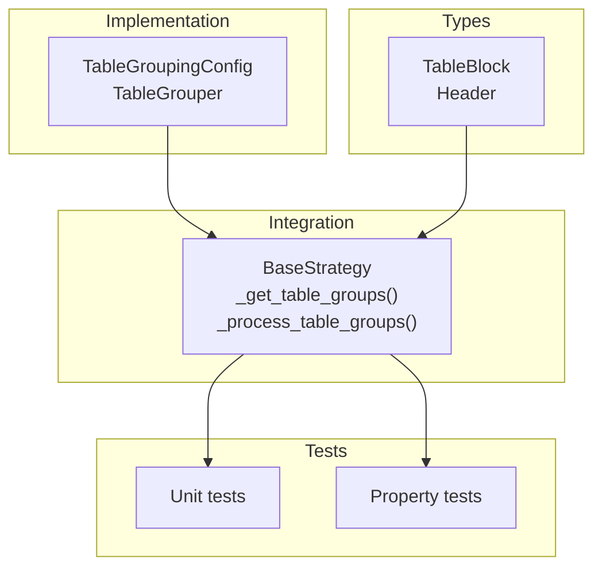
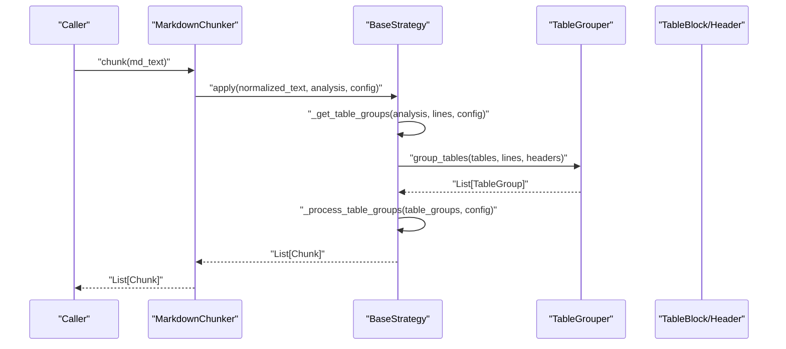
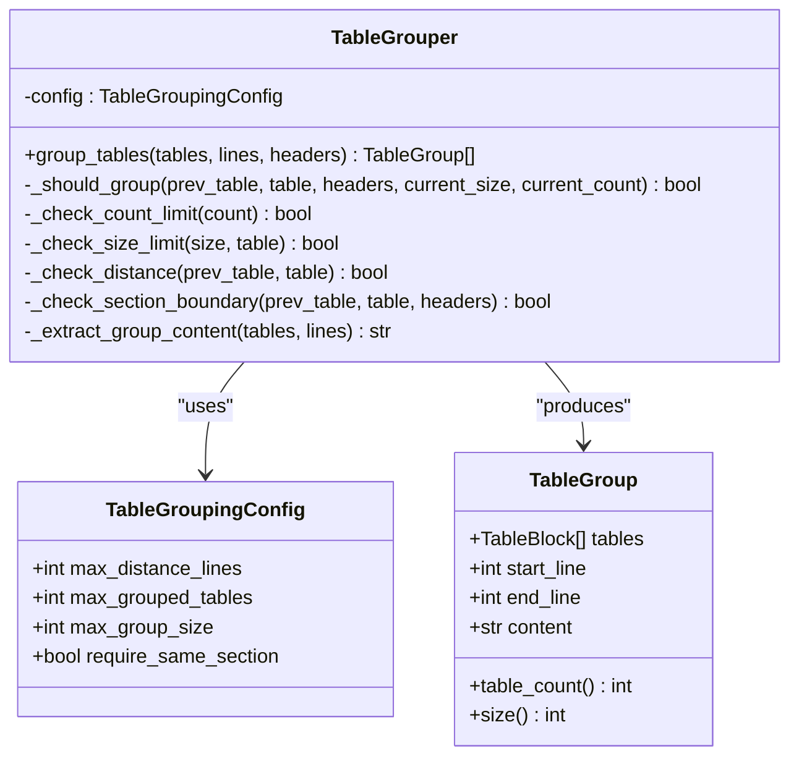
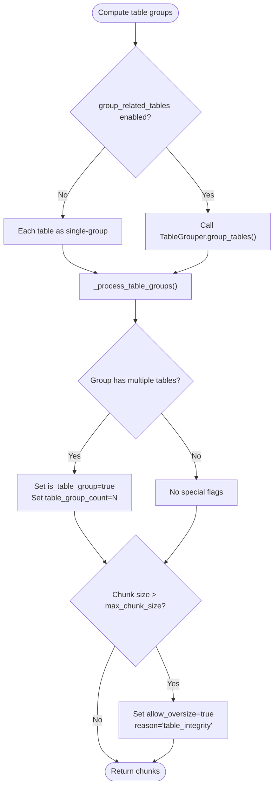
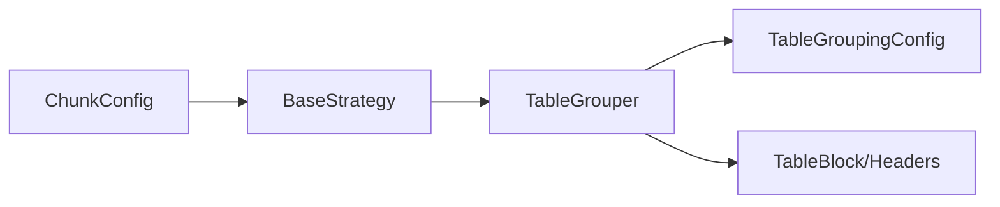

# Table Grouping

<cite>
**Referenced Files in This Document**
- [table_grouping.py](file://markdown_chunker_v2/table_grouping.py)
- [config.py](file://markdown_chunker_v2/config.py)
- [base.py](file://markdown_chunker_v2/strategies/base.py)
- [types.py](file://markdown_chunker_v2/types.py)
- [test_table_grouping_unit.py](file://tests/test_table_grouping_unit.py)
- [test_table_grouping_properties.py](file://tests/test_table_grouping_properties.py)
- [api_reference.md](file://tests/fixtures/table_grouping/api_reference.md)
- [close_tables.md](file://tests/fixtures/table_grouping/close_tables.md)
</cite>

## Table of Contents
1. [Introduction](#introduction)
2. [Project Structure](#project-structure)
3. [Core Components](#core-components)
4. [Architecture Overview](#architecture-overview)
5. [Detailed Component Analysis](#detailed-component-analysis)
6. [Dependency Analysis](#dependency-analysis)
7. [Performance Considerations](#performance-considerations)
8. [Troubleshooting Guide](#troubleshooting-guide)
9. [Conclusion](#conclusion)
10. [Appendices](#appendices)

## Introduction
This document explains the table grouping feature that consolidates nearby tables into cohesive chunks to improve retrieval quality for table-heavy documents (e.g., API references, data reports). It covers the design, configuration, runtime integration, and validation through unit and property-based tests.

## Project Structure
The table grouping feature spans a small set of modules:
- Implementation: table grouping logic and configuration
- Integration: strategy-level helpers to build table groups and attach metadata
- Types: shared data structures used across parsing and chunking
- Tests: unit and property-based validation of grouping behavior and strategy compatibility

**Diagram sources**
- [table_grouping.py](file://markdown_chunker_v2/table_grouping.py#L1-L332)
- [base.py](file://markdown_chunker_v2/strategies/base.py#L289-L377)
- [types.py](file://markdown_chunker_v2/types.py#L118-L170)
- [test_table_grouping_unit.py](file://tests/test_table_grouping_unit.py#L1-L387)
- [test_table_grouping_properties.py](file://tests/test_table_grouping_properties.py#L1-L659)

**Section sources**
- [table_grouping.py](file://markdown_chunker_v2/table_grouping.py#L1-L332)
- [base.py](file://markdown_chunker_v2/strategies/base.py#L289-L377)
- [types.py](file://markdown_chunker_v2/types.py#L118-L170)
- [test_table_grouping_unit.py](file://tests/test_table_grouping_unit.py#L1-L387)
- [test_table_grouping_properties.py](file://tests/test_table_grouping_properties.py#L1-L659)

## Core Components
- TableGroupingConfig: Tunable constraints for grouping (distance, group size, group count, section boundary enforcement).
- TableGrouper: Greedy grouping engine that merges adjacent tables meeting constraints.
- BaseStrategy helpers: Strategy-level orchestration to compute table groups and attach metadata.
- Types: TableBlock and Header define the building blocks used by grouping.

Key behaviors:
- Proximity: Tables within a configurable line distance are candidates for grouping.
- Section boundary: By default, grouping stops across headers unless disabled.
- Limits: Maximum number of tables per group and maximum combined size are enforced.
- Content assembly: Group content includes tables and normalized text between them.

**Section sources**
- [table_grouping.py](file://markdown_chunker_v2/table_grouping.py#L14-L53)
- [table_grouping.py](file://markdown_chunker_v2/table_grouping.py#L82-L171)
- [base.py](file://markdown_chunker_v2/strategies/base.py#L289-L377)
- [types.py](file://markdown_chunker_v2/types.py#L118-L170)

## Architecture Overview
The table grouping pipeline integrates with the chunking strategy layer. When enabled, strategies compute table groups and emit chunks with metadata indicating whether a chunk contains a single table or a group.

**Diagram sources**
- [base.py](file://markdown_chunker_v2/strategies/base.py#L289-L377)
- [table_grouping.py](file://markdown_chunker_v2/table_grouping.py#L102-L171)
- [types.py](file://markdown_chunker_v2/types.py#L118-L170)

## Detailed Component Analysis

### TableGroupingConfig and TableGrouper
- Configuration parameters:
  - max_distance_lines: Maximum gap between tables to consider grouping.
  - max_grouped_tables: Upper bound on tables per group.
  - max_group_size: Upper bound on combined content length for a group.
  - require_same_section: Enforce grouping only within the same header section.
- Validation ensures non-negative distances, reasonable group sizes, and positive limits.
- Grouping algorithm:
  - Greedy scan over sorted tables.
  - Early exits on constraint violations.
  - Section boundary checks using header positions.
  - Content assembly includes tables and normalized inter-table text.

**Diagram sources**
- [table_grouping.py](file://markdown_chunker_v2/table_grouping.py#L14-L53)
- [table_grouping.py](file://markdown_chunker_v2/table_grouping.py#L54-L81)
- [table_grouping.py](file://markdown_chunker_v2/table_grouping.py#L82-L171)

**Section sources**
- [table_grouping.py](file://markdown_chunker_v2/table_grouping.py#L14-L53)
- [table_grouping.py](file://markdown_chunker_v2/table_grouping.py#L82-L171)

### Strategy Integration and Metadata
- BaseStrategy provides:
  - _get_table_groups: Computes groups using config.get_table_grouper() or falls back to single-table groups.
  - _process_table_groups: Converts groups to chunks, sets content_type="table", and adds is_table_group and table_group_count metadata for multi-table groups.
- Oversize handling: If a table group exceeds max_chunk_size, it marks allow_oversize with reason "table_integrity".

**Diagram sources**
- [base.py](file://markdown_chunker_v2/strategies/base.py#L289-L377)
- [config.py](file://markdown_chunker_v2/config.py#L232-L248)

**Section sources**
- [base.py](file://markdown_chunker_v2/strategies/base.py#L289-L377)
- [config.py](file://markdown_chunker_v2/config.py#L232-L248)

### Configuration and Defaults
- ChunkConfig exposes:
  - group_related_tables: Enables table grouping (disabled by default).
  - table_grouping_config: Optional TableGroupingConfig instance.
  - get_table_grouper(): Returns TableGrouper when enabled; None otherwise.
- Validation ensures consistent defaults and safe limits.

**Section sources**
- [config.py](file://markdown_chunker_v2/config.py#L118-L121)
- [config.py](file://markdown_chunker_v2/config.py#L232-L248)

### Data Types Used by Grouping
- TableBlock: Holds table content and line range.
- Header: Used to enforce section boundaries during grouping.

**Section sources**
- [types.py](file://markdown_chunker_v2/types.py#L118-L170)

### Unit Tests: Behavior Validation
- Configuration validation: Negative distance, zero/max tables, too-small group size.
- Integration: Disabled vs enabled behavior, single-table vs multi-table grouping, section boundary respect, size and count limits.
- Fixtures: API reference and close tables documents exercise grouping scenarios.

**Section sources**
- [test_table_grouping_unit.py](file://tests/test_table_grouping_unit.py#L23-L61)
- [test_table_grouping_unit.py](file://tests/test_table_grouping_unit.py#L63-L93)
- [test_table_grouping_unit.py](file://tests/test_table_grouping_unit.py#L95-L118)
- [test_table_grouping_unit.py](file://tests/test_table_grouping_unit.py#L119-L169)
- [test_table_grouping_unit.py](file://tests/test_table_grouping_unit.py#L170-L197)
- [test_table_grouping_unit.py](file://tests/test_table_grouping_unit.py#L198-L221)
- [test_table_grouping_unit.py](file://tests/test_table_grouping_unit.py#L222-L287)
- [test_table_grouping_unit.py](file://tests/test_table_grouping_unit.py#L289-L387)
- [api_reference.md](file://tests/fixtures/table_grouping/api_reference.md#L1-L46)
- [close_tables.md](file://tests/fixtures/table_grouping/close_tables.md#L1-L18)

### Property-Based Tests: Behavioral Guarantees
- Proximity grouping: Close tables remain in the same chunk when grouping is enabled.
- Section boundary respect: Tables separated by headers are not grouped when require_same_section is true.
- Disabled behavior preservation: Disabling grouping yields no is_table_group metadata.
- Metadata correctness: Multi-table chunks carry is_table_group and table_group_count; single-table chunks do not.
- Strategy compatibility: Works across code-aware, structural, and fallback strategies.
- Size and count limits: Enforced for grouped chunks.

**Section sources**
- [test_table_grouping_properties.py](file://tests/test_table_grouping_properties.py#L116-L158)
- [test_table_grouping_properties.py](file://tests/test_table_grouping_properties.py#L165-L205)
- [test_table_grouping_properties.py](file://tests/test_table_grouping_properties.py#L212-L244)
- [test_table_grouping_properties.py](file://tests/test_table_grouping_properties.py#L251-L330)
- [test_table_grouping_properties.py](file://tests/test_table_grouping_properties.py#L344-L451)
- [test_table_grouping_properties.py](file://tests/test_table_grouping_properties.py#L458-L559)
- [test_table_grouping_properties.py](file://tests/test_table_grouping_properties.py#L566-L659)

## Dependency Analysis
- Coupling:
  - TableGrouper depends on TableGroupingConfig and uses TableBlock/Headers.
  - BaseStrategy depends on ChunkConfig for enabling grouping and on TableGrouper to compute groups.
- Cohesion:
  - Grouping logic is encapsulated in TableGrouper; strategy-level helpers coordinate metadata and oversize handling.
- External dependencies:
  - No external libraries; relies on built-in types and dataclasses.

**Diagram sources**
- [config.py](file://markdown_chunker_v2/config.py#L232-L248)
- [base.py](file://markdown_chunker_v2/strategies/base.py#L289-L377)
- [table_grouping.py](file://markdown_chunker_v2/table_grouping.py#L14-L53)
- [types.py](file://markdown_chunker_v2/types.py#L118-L170)

**Section sources**
- [config.py](file://markdown_chunker_v2/config.py#L232-L248)
- [base.py](file://markdown_chunker_v2/strategies/base.py#L289-L377)
- [table_grouping.py](file://markdown_chunker_v2/table_grouping.py#L14-L53)
- [types.py](file://markdown_chunker_v2/types.py#L118-L170)

## Performance Considerations
- Complexity: Grouping runs in linear time relative to the number of tables, with constant-time checks per candidate pair.
- Memory: Minimal overhead; groups are lists of references to TableBlock plus assembled content strings.
- Practical tips:
  - Tune max_grouped_tables and max_group_size to balance recall and chunk size.
  - Keep require_same_section enabled for document-like structures to avoid cross-section fragmentation.
  - Use strategy_override to target documents with heavy tables and headers.

[No sources needed since this section provides general guidance]

## Troubleshooting Guide
Common issues and resolutions:
- Grouping not taking effect:
  - Ensure group_related_tables is True and table_grouping_config is provided or defaults are acceptable.
  - Verify that tables are sorted by start_line and headers are available in analysis.
- Unexpected separation across sections:
  - Disable require_same_section if grouping across sections is desired.
- Oversized chunks:
  - Reduce max_grouped_tables or max_group_size to keep chunks within max_chunk_size.
- Mixed content types:
  - Strategy-level helpers already handle content_type detection when merging atomic blocks; table groups are emitted as content_type="table".

**Section sources**
- [config.py](file://markdown_chunker_v2/config.py#L232-L248)
- [base.py](file://markdown_chunker_v2/strategies/base.py#L335-L377)
- [table_grouping.py](file://markdown_chunker_v2/table_grouping.py#L173-L226)

## Conclusion
Table grouping improves retrieval quality for table-heavy documents by keeping related tables together, preserving inter-table context, and attaching clear metadata. It is opt-in, configurable, and compatible across all strategies. The provided tests confirm correctness under varied scenarios, including proximity, section boundaries, limits, and strategy compatibility.

[No sources needed since this section summarizes without analyzing specific files]

## Appendices

### Configuration Options Summary
- group_related_tables: Enable/disable grouping (default: disabled).
- table_grouping_config:
  - max_distance_lines: Max gap between tables to group.
  - max_grouped_tables: Max tables per group.
  - max_group_size: Max combined content length for a group.
  - require_same_section: Enforce grouping within the same header section.

**Section sources**
- [config.py](file://markdown_chunker_v2/config.py#L118-L121)
- [table_grouping.py](file://markdown_chunker_v2/table_grouping.py#L14-L53)