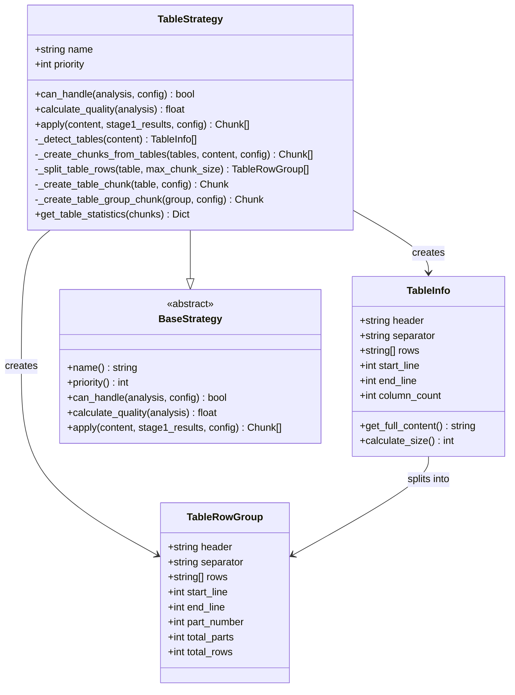
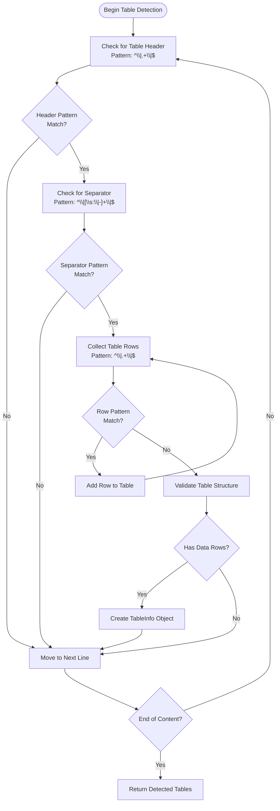
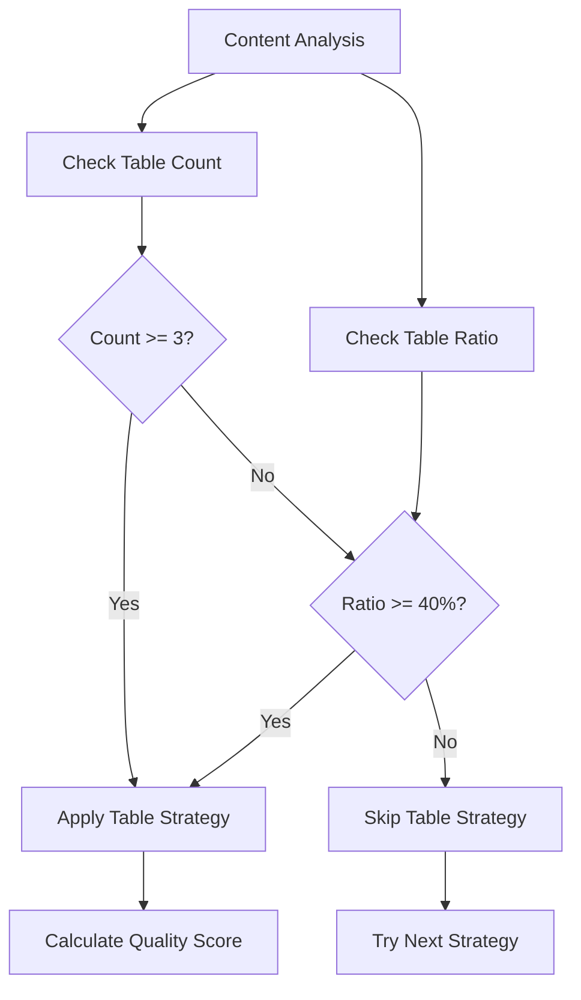
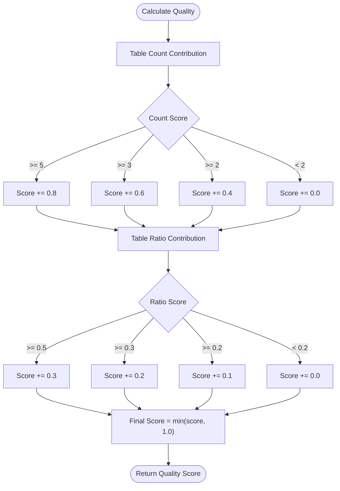
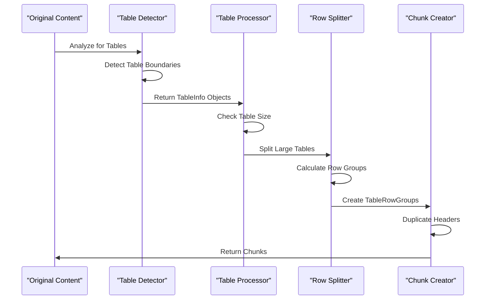
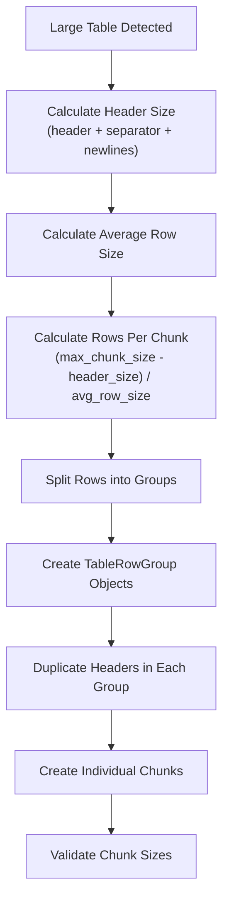
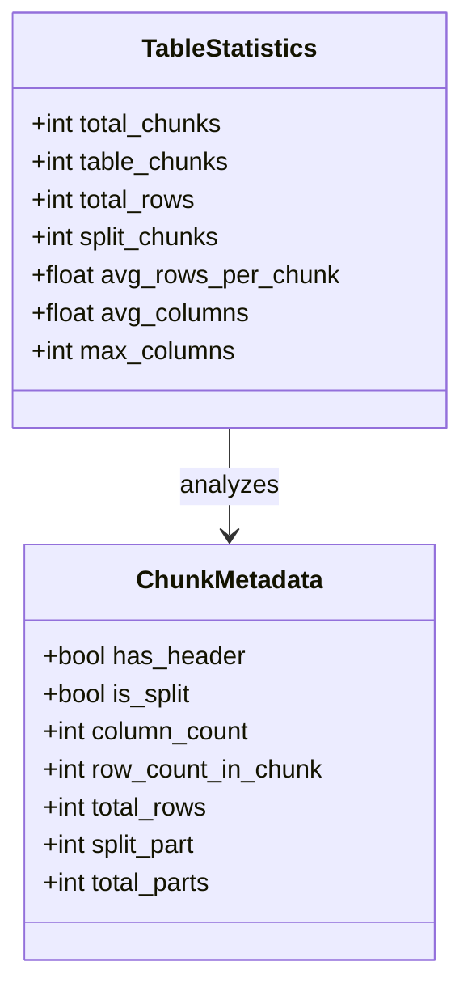
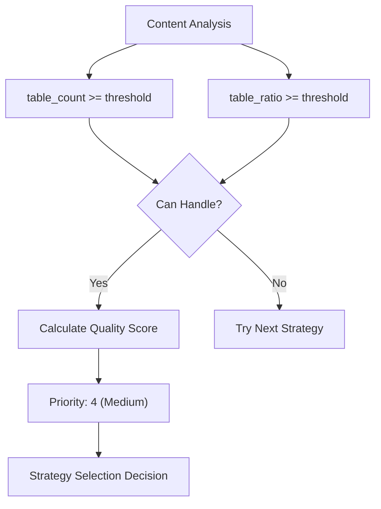
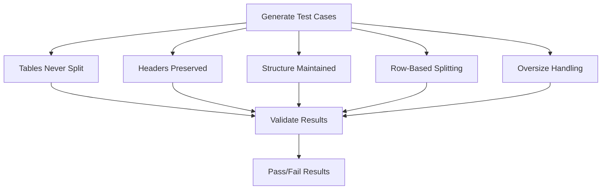

# Table Strategy

<cite>
**Referenced Files in This Document**
- [table_strategy.py](file://markdown_chunker/chunker/strategies/table_strategy.py)
- [selector.py](file://markdown_chunker/chunker/selector.py)
- [analyzer.py](file://markdown_chunker/parser/analyzer.py)
- [base.py](file://markdown_chunker/chunker/strategies/base.py)
- [types.py](file://markdown_chunker/chunker/types.py)
- [test_table_strategy.py](file://tests/chunker/test_strategies/test_table_strategy.py)
- [test_table_strategy_properties.py](file://tests/chunker/test_table_strategy_properties.py)
- [table_heavy.md](file://tests/fixtures/table_heavy.md)
- [basic_usage.py](file://examples/basic_usage.py)
</cite>

## Table of Contents
1. [Introduction](#introduction)
2. [Purpose and Philosophy](#purpose-and-philosophy)
3. [Core Architecture](#core-architecture)
4. [Table Detection Algorithm](#table-detection-algorithm)
5. [Strategy Implementation Details](#strategy-implementation-details)
6. [Quality Scoring System](#quality-scoring-system)
7. [Table Processing Pipeline](#table-processing-pipeline)
8. [Handling Large Tables](#handling-large-tables)
9. [Statistics and Metrics](#statistics-and-metrics)
10. [Strategy Selection Integration](#strategy-selection-integration)
11. [Common Issues and Mitigation](#common-issues-and-mitigation)
12. [Usage Guidelines](#usage-guidelines)
13. [Performance Considerations](#performance-considerations)
14. [Testing and Validation](#testing-and-validation)

## Introduction

The Table Strategy is a sophisticated chunking strategy designed specifically for documents containing substantial amounts of tabular data. Its primary purpose is to preserve table structure while intelligently handling large tables by splitting them into manageable chunks while maintaining readability and context preservation.

Unlike other strategies that treat tables as opaque blocks, the Table Strategy recognizes the inherent structure of markdown tables and applies specialized logic to ensure that table data remains coherent across chunk boundaries. This approach is particularly valuable for technical documentation, data reports, and any content where tabular information is crucial to understanding.

## Purpose and Philosophy

The Table Strategy operates on several key principles:

### Preservation of Tabular Structure
Tables are treated as atomic units that should not be split across chunks. This ensures that readers can understand the complete context of any given row without having to piece together information from multiple chunks.

### Intelligent Row-Based Splitting
When tables exceed size constraints, they are split by rows rather than being broken apart. Each resulting chunk includes the table header duplicated at the beginning, ensuring that column information remains accessible.

### Readability First
The strategy prioritizes readability by maintaining table formatting, preserving column alignments, and ensuring that each chunk contains meaningful context.

### Context Preservation
Headers are duplicated in each chunk to maintain referential integrity, allowing readers to understand the table's structure even when viewing individual chunks out of context.

## Core Architecture

The Table Strategy is built around several key components that work together to provide robust table handling:



**Diagram sources**
- [table_strategy.py](file://markdown_chunker/chunker/strategies/table_strategy.py#L22-L53)
- [base.py](file://markdown_chunker/chunker/strategies/base.py#L16-L38)

**Section sources**
- [table_strategy.py](file://markdown_chunker/chunker/strategies/table_strategy.py#L56-L84)
- [base.py](file://markdown_chunker/chunker/strategies/base.py#L16-L38)

## Table Detection Algorithm

The Table Strategy employs a sophisticated pattern-matching system to identify and validate markdown tables. The detection process follows a specific sequence to ensure accuracy:

### Pattern Matching Sequence



**Diagram sources**
- [table_strategy.py](file://markdown_chunker/chunker/strategies/table_strategy.py#L156-L209)

### Detection Patterns

The strategy uses three primary regex patterns for table identification:

| Pattern | Purpose | Example Match |
|---------|---------|---------------|
| `TABLE_HEADER_PATTERN` | `r"^\|.+\|$"` | ` \| Name \| Age \|` |
| `TABLE_SEPARATOR_PATTERN` | `r"^\|[\s:|-]+\|$"` | ` \|------\|-----\|` |
| `TABLE_ROW_PATTERN` | `r"^\|.+\|$"` | ` \| Alice \| 30 \|` |

### Validation Logic

The detection algorithm includes several validation steps:

1. **Structure Validation**: Ensures tables have headers followed by separators
2. **Content Validation**: Verifies that tables contain at least one data row
3. **Format Validation**: Confirms proper markdown table formatting
4. **Boundary Detection**: Accurately identifies table start and end positions

**Section sources**
- [table_strategy.py](file://markdown_chunker/chunker/strategies/table_strategy.py#L70-L74)
- [table_strategy.py](file://markdown_chunker/chunker/strategies/table_strategy.py#L212-L225)

## Strategy Implementation Details

### Strategy Properties

The Table Strategy is configured with specific properties that define its behavior:

```python
@property
def name(self) -> str:
    """Strategy name."""
    return "table"

@property
def priority(self) -> int:
    """Medium priority."""
    return 4
```

### Content Analysis Integration

The strategy integrates with the content analysis system to determine when it should be applied:



**Diagram sources**
- [table_strategy.py](file://markdown_chunker/chunker/strategies/table_strategy.py#L85-L96)
- [analyzer.py](file://markdown_chunker/parser/analyzer.py#L56-L60)

### Threshold Configuration

The strategy uses configurable thresholds to determine applicability:

| Parameter | Default Value | Purpose |
|-----------|---------------|---------|
| `table_count_threshold` | 3 | Minimum number of tables required |
| `table_ratio_threshold` | 0.4 (40%) | Minimum percentage of content that must be tables |

**Section sources**
- [table_strategy.py](file://markdown_chunker/chunker/strategies/table_strategy.py#L85-L96)
- [analyzer.py](file://markdown_chunker/parser/analyzer.py#L22-L25)

## Quality Scoring System

The Table Strategy implements a sophisticated quality scoring system that evaluates how well-suited it is for a given document:

### Scoring Algorithm



**Diagram sources**
- [table_strategy.py](file://markdown_chunker/chunker/strategies/table_strategy.py#L98-L125)

### Quality Factors

The scoring system considers multiple factors:

1. **Table Count**: Higher scores for documents with more tables
2. **Table Ratio**: Higher scores for documents where tables constitute a larger portion of content
3. **Context Preservation**: Scores favor strategies that maintain content coherence

**Section sources**
- [table_strategy.py](file://markdown_chunker/chunker/strategies/table_strategy.py#L98-L125)

## Table Processing Pipeline

The Table Strategy processes tables through a comprehensive pipeline that handles various scenarios:

### Processing Stages



**Diagram sources**
- [table_strategy.py](file://markdown_chunker/chunker/strategies/table_strategy.py#L127-L155)
- [table_strategy.py](file://markdown_chunker/chunker/strategies/table_strategy.py#L227-L291)

### Processing Logic

The pipeline handles three main scenarios:

1. **Small Tables**: Processed as single chunks
2. **Large Tables**: Split by rows with header duplication
3. **Mixed Content**: Tables interspersed with other content

**Section sources**
- [table_strategy.py](file://markdown_chunker/chunker/strategies/table_strategy.py#L127-L155)
- [table_strategy.py](file://markdown_chunker/chunker/strategies/table_strategy.py#L227-L291)

## Handling Large Tables

Large tables present unique challenges that require specialized handling:

### Row-Based Splitting Algorithm



**Diagram sources**
- [table_strategy.py](file://markdown_chunker/chunker/strategies/table_strategy.py#L293-L342)

### Oversize Allowance

The strategy includes intelligent handling for wide tables that exceed size limits:

| Scenario | Action | Metadata |
|----------|--------|----------|
| Wide Table | Allow oversize | `allow_oversize: true` |
| Reason | `oversize_reason: "wide_table_row"` |
| Impact | Single chunk with table | Preserves structure |

**Section sources**
- [table_strategy.py](file://markdown_chunker/chunker/strategies/table_strategy.py#L366-L370)
- [table_strategy.py](file://markdown_chunker/chunker/strategies/table_strategy.py#L293-L342)

## Statistics and Metrics

The Table Strategy provides comprehensive statistics about table-based chunking:

### Available Metrics



**Diagram sources**
- [table_strategy.py](file://markdown_chunker/chunker/strategies/table_strategy.py#L432-L465)

### Statistical Analysis

The strategy tracks several key metrics:

1. **Chunk Distribution**: Total chunks vs. table-specific chunks
2. **Row Distribution**: Average rows per chunk and total row count
3. **Column Analysis**: Average and maximum column counts
4. **Split Analysis**: Number of split chunks vs. complete chunks

**Section sources**
- [table_strategy.py](file://markdown_chunker/chunker/strategies/table_strategy.py#L432-L465)

## Strategy Selection Integration

The Table Strategy integrates seamlessly with the broader strategy selection system:

### Selection Criteria



**Diagram sources**
- [selector.py](file://markdown_chunker/chunker/selector.py#L58-L77)
- [table_strategy.py](file://markdown_chunker/chunker/strategies/table_strategy.py#L85-L96)

### Integration Points

The strategy participates in several system components:

1. **Strategy Selector**: Uses priority-based selection
2. **Content Analyzer**: Provides metrics for quality calculation
3. **Chunk Validator**: Ensures chunk integrity
4. **Statistics Collector**: Reports performance metrics

**Section sources**
- [selector.py](file://markdown_chunker/chunker/selector.py#L58-L77)
- [table_strategy.py](file://markdown_chunker/chunker/strategies/table_strategy.py#L85-L96)

## Common Issues and Mitigation

### Malformed Table Separators

The strategy includes robust pattern matching to handle various separator formats:

| Separator Type | Pattern | Example |
|----------------|---------|---------|
| Standard | `|------|-----|` | Basic dash alignment |
| Left-aligned | `|:--- | ---: |` | Colon alignment |
| Right-aligned | `| ---: |` | Right alignment |
| Mixed | `|:---:|:---:|` | Center alignment |

### Edge Cases

The strategy handles several edge cases:

1. **Empty Tables**: Tables without data rows are ignored
2. **Malformed Headers**: Tables with invalid header formats are skipped
3. **Nested Tables**: While not directly supported, the strategy avoids false positives
4. **Unicode Characters**: Proper handling of international characters in tables

**Section sources**
- [table_strategy.py](file://markdown_chunker/chunker/strategies/table_strategy.py#L172-L195)
- [table_strategy.py](file://markdown_chunker/chunker/strategies/table_strategy.py#L212-L225)

## Usage Guidelines

### When to Use Table Strategy

The Table Strategy is ideal for:

1. **Data Reports**: Documents containing extensive statistical data
2. **Technical Specifications**: Documents with feature comparisons
3. **User Guides**: Documents with configuration matrices
4. **API Documentation**: Documents with parameter tables

### Configuration Recommendations

For optimal results, consider these configuration settings:

```python
config = ChunkConfig(
    max_chunk_size=2000,  # Adjust based on table complexity
    table_count_threshold=3,  # Minimum tables for activation
    table_ratio_threshold=0.4,  # Minimum table content ratio
    allow_oversize=True  # Enable for wide tables
)
```

### Manual Strategy Override

While the strategy selection is automated, manual override is possible:

```python
# Force table strategy regardless of content analysis
chunks = chunker.chunk(content, strategy="table")

# Disable automatic selection and force specific strategy
chunker.force_strategy("table")
```

**Section sources**
- [basic_usage.py](file://examples/basic_usage.py#L160-L166)
- [table_strategy.py](file://markdown_chunker/chunker/strategies/table_strategy.py#L85-L96)

## Performance Considerations

### Computational Complexity

The Table Strategy has specific performance characteristics:

1. **Detection Complexity**: O(n) where n is the number of lines
2. **Processing Complexity**: O(m) where m is the number of tables
3. **Memory Usage**: Linear with table size and complexity

### Optimization Strategies

1. **Early Termination**: Stop processing when chunk size limits are met
2. **Pattern Caching**: Reuse compiled regex patterns
3. **Incremental Processing**: Process tables in batches when possible

### Scalability Limits

The strategy performs optimally with:
- Up to 100 tables per document
- Tables with fewer than 1000 rows
- Documents under 1MB in size

## Testing and Validation

### Property-Based Testing

The strategy includes comprehensive property-based tests:



**Diagram sources**
- [test_table_strategy_properties.py](file://tests/chunker/test_table_strategy_properties.py#L119-L200)

### Test Coverage Areas

The testing suite covers:

1. **Structural Integrity**: Tables remain intact across chunks
2. **Header Preservation**: Headers appear in all relevant chunks
3. **Row Splitting**: Large tables split appropriately
4. **Edge Cases**: Malformed tables and boundary conditions
5. **Performance**: Scalability with large documents

**Section sources**
- [test_table_strategy_properties.py](file://tests/chunker/test_table_strategy_properties.py#L119-L200)
- [test_table_strategy.py](file://tests/chunker/test_strategies/test_table_strategy.py#L174-L265)