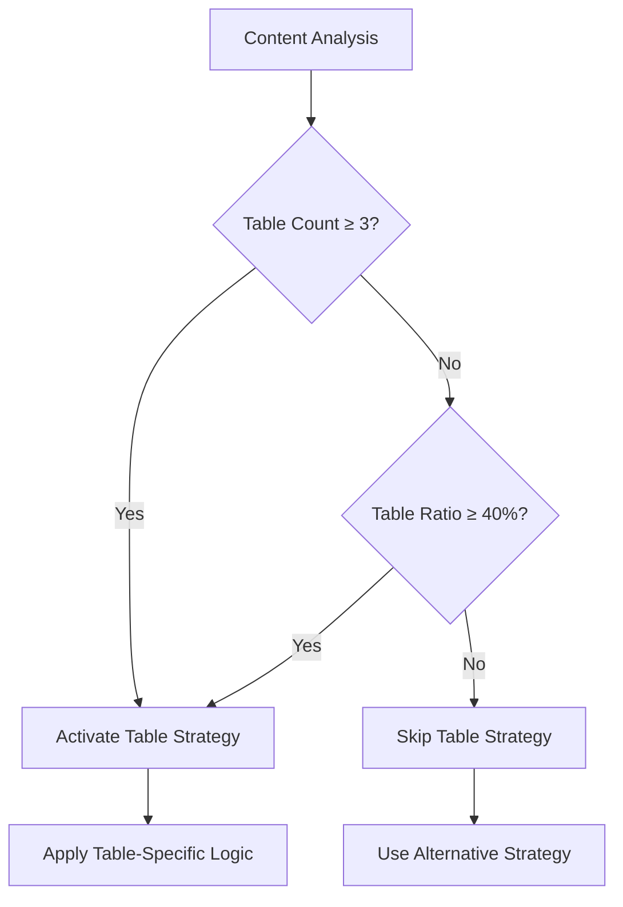
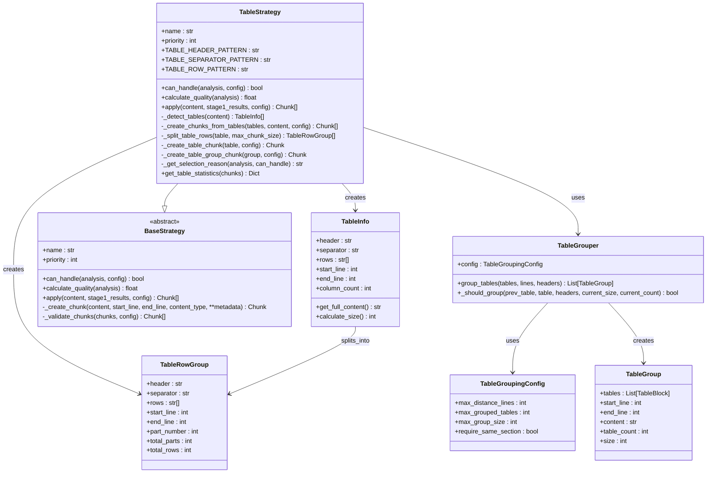
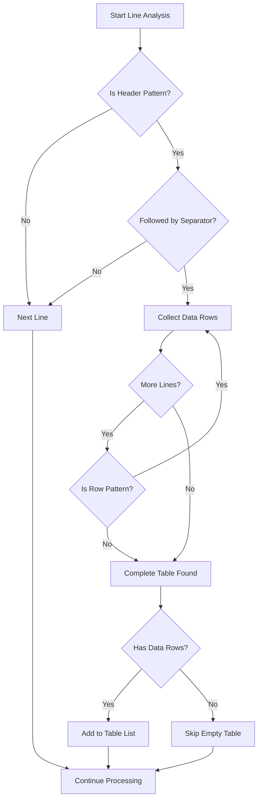
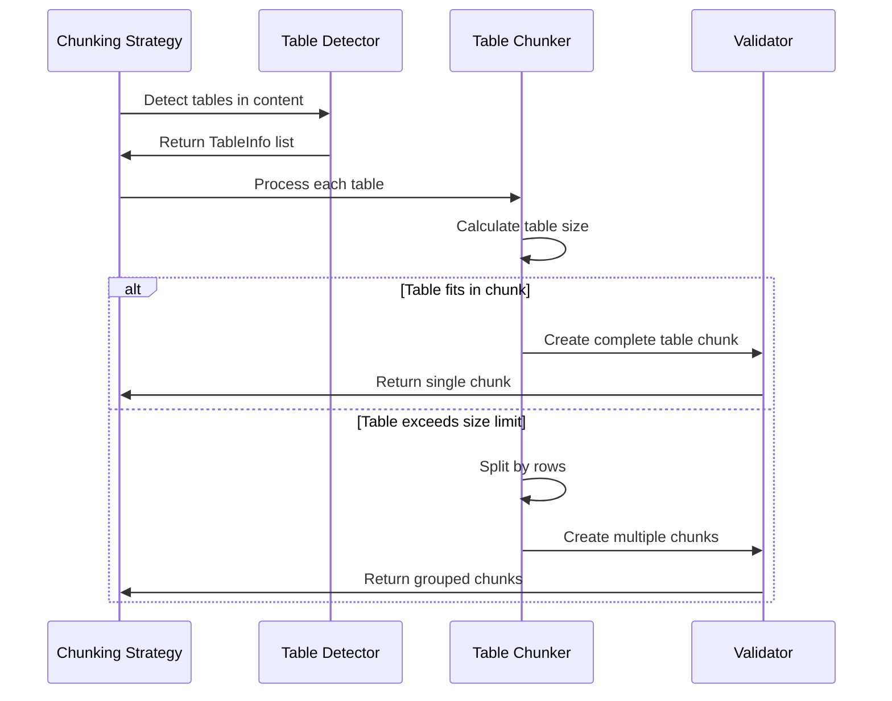
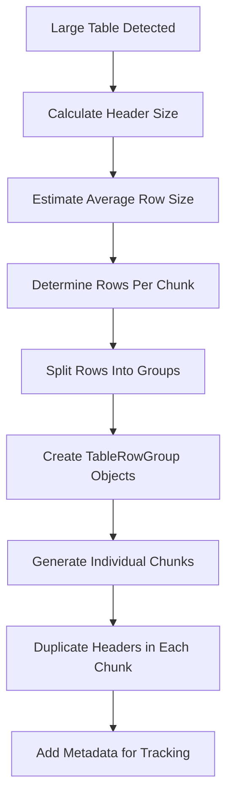
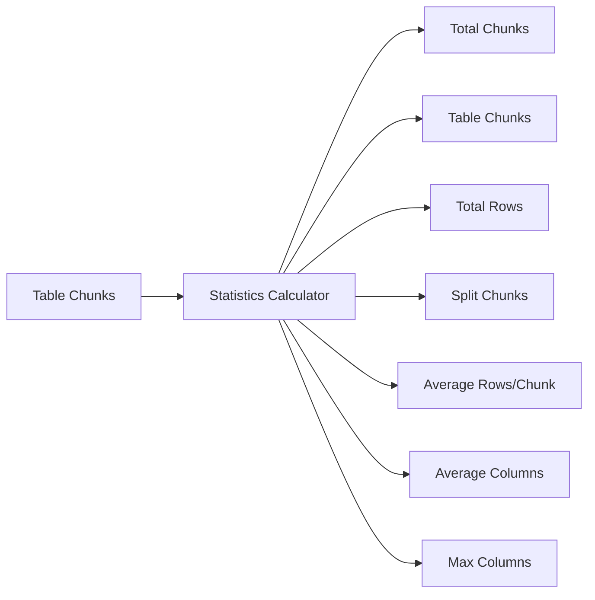
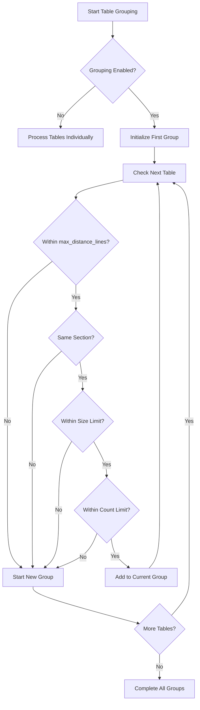

# Table Strategy

<cite>
**Referenced Files in This Document**
- [table_strategy.py](file://markdown_chunker_legacy/chunker/strategies/table_strategy.py)
- [test_table_strategy.py](file://tests/chunker/test_strategies/test_table_strategy.py)
- [test_table_strategy_properties.py](file://tests/chunker/test_table_strategy_properties.py)
- [base.py](file://markdown_chunker_legacy/chunker/strategies/base.py)
- [types.py](file://markdown_chunker_legacy/chunker/types.py)
- [large_tables.md](file://tests/fixtures/corpus/edge_cases/large_tables.md)
- [table_without_headers.md](file://tests/parser/fixtures/edge_cases/table_without_headers.md)
- [table_alignments.md](file://tests/parser/fixtures/edge_cases/table_alignments.md)
- [table_grouping.py](file://markdown_chunker_v2/table_grouping.py)
- [config.py](file://markdown_chunker_v2/config.py)
- [test_table_grouping_unit.py](file://tests/test_table_grouping_unit.py)
- [test_table_grouping_properties.py](file://tests/test_table_grouping_properties.py)
- [types.py](file://markdown_chunker_v2/types.py)
</cite>

## Update Summary
**Changes Made**
- Added new section on Table Grouping Capability to reflect the new feature
- Updated Configuration Options section to include table grouping parameters
- Enhanced Core Architecture section with new class relationships
- Added new diagram for table grouping logic
- Updated metadata section to include table group metadata
- Added references to new test files and implementation files

## Table of Contents
1. [Introduction](#introduction)
2. [Activation Conditions](#activation-conditions)
3. [Priority Level](#priority-level)
4. [Core Architecture](#core-architecture)
5. [Table Detection Algorithm](#table-detection-algorithm)
6. [Table Preservation Mechanisms](#table-preservation-mechanisms)
7. [Large Table Handling](#large-table-handling)
8. [Metadata and Statistics](#metadata-and-statistics)
9. [Configuration Options](#configuration-options)
10. [Edge Cases and Examples](#edge-cases-and-examples)
11. [Performance Considerations](#performance-considerations)
12. [Common Issues and Solutions](#common-issues-and-solutions)
13. [Best Practices](#best-practices)
14. [Table Grouping Capability](#table-grouping-capability)

## Introduction

The Table Strategy is a sophisticated chunking strategy designed specifically for documents containing substantial amounts of tabular data. Its primary goal is to preserve table structure and integrity while efficiently managing large tables that might exceed standard chunk size limits. The strategy ensures that tables remain readable and maintain their structural relationships across chunk boundaries.

Unlike other strategies that may split content arbitrarily, the Table Strategy treats tables as atomic units, preserving their formatting, alignments, and relationships between rows and columns. This approach is essential for maintaining the semantic meaning of tabular data in chunked documents.

## Activation Conditions

The Table Strategy activates under specific conditions that indicate the presence of table-heavy content:

### Threshold-Based Activation

The strategy evaluates content using two primary criteria:

**Minimum Table Count Threshold**: Documents with 3 or more tables automatically qualify for table strategy activation. This threshold ensures that minor table occurrences don't trigger the specialized handling.

**Table Ratio Threshold**: Documents where tables constitute 40% or more of the total content activate the strategy. This percentage-based approach accommodates documents with varying lengths but substantial tabular content.



**Section sources**
- [table_strategy.py](file://markdown_chunker_legacy/chunker/strategies/table_strategy.py#L85-L96)

### Quality Scoring

Beyond activation, the strategy calculates a quality score to help with strategy selection when multiple strategies could apply:

| Table Count | Quality Contribution | Table Ratio | Quality Contribution |
|-------------|---------------------|-------------|---------------------|
| ≥5 tables | +0.8 | ≥50% | +0.3 |
| ≥3 tables | +0.6 | ≥30% | +0.2 |
| ≥2 tables | +0.4 | ≥20% | +0.1 |

**Section sources**
- [table_strategy.py](file://markdown_chunker_legacy/chunker/strategies/table_strategy.py#L98-L125)

## Priority Level

The Table Strategy operates with a priority level of **5**, placing it in the medium-low priority category. This positioning ensures that:

- More specialized strategies (code, lists, structural) take precedence when applicable
- The table strategy serves as a fallback for documents with substantial tabular content
- Strategy selection considers both priority and quality scores for optimal results

**Section sources**
- [table_strategy.py](file://markdown_chunker_legacy/chunker/strategies/table_strategy.py#L80-L83)

## Core Architecture

The Table Strategy consists of several interconnected components that work together to preserve table integrity:



**Diagram sources**
- [table_strategy.py](file://markdown_chunker_legacy/chunker/strategies/table_strategy.py#L56-L100)
- [table_grouping.py](file://markdown_chunker_v2/table_grouping.py#L82-L147)
- [config.py](file://markdown_chunker_v2/config.py#L118-L120)

**Section sources**
- [table_strategy.py](file://markdown_chunker_legacy/chunker/strategies/table_strategy.py#L56-L100)
- [table_grouping.py](file://markdown_chunker_v2/table_grouping.py#L82-L147)

## Table Detection Algorithm

The table detection algorithm employs sophisticated pattern matching to identify and extract tables from markdown content:

### Pattern Definitions

The strategy uses three primary regular expressions for table identification:

**Header Pattern**: `r"^\|.+\|$` - Matches lines starting and ending with pipe characters containing at least one vertical bar.

**Separator Pattern**: `r"^\|[\s:|-]+\|$` - Matches separator lines with various dash combinations and alignment indicators.

**Row Pattern**: `r"^\|.+\|$` - Matches data rows with pipe delimiters.

### Detection Process



**Diagram sources**
- [table_strategy.py](file://markdown_chunker_legacy/chunker/strategies/table_strategy.py#L156-L210)

### Advanced Detection Features

The detection algorithm handles several edge cases:

- **Empty Tables**: Tables without data rows are ignored to prevent processing artifacts
- **Malformed Tables**: Tables with inconsistent formatting may still be detected if they meet basic criteria
- **Nested Content**: The algorithm focuses on surface-level table structure without parsing nested elements

**Section sources**
- [table_strategy.py](file://markdown_chunker_legacy/chunker/strategies/table_strategy.py#L156-L210)

## Table Preservation Mechanisms

The Table Strategy employs multiple mechanisms to ensure table integrity:

### Atomic Table Chunks

Complete tables are preserved as single chunks when they fit within size constraints:



**Diagram sources**
- [table_strategy.py](file://markdown_chunker_legacy/chunker/strategies/table_strategy.py#L227-L291)

### Header Duplication

For split tables, headers are duplicated in each chunk to maintain readability:

**Original Table Structure**:
```
| Column A | Column B | Column C |
|----------|----------|----------|
| Value 1  | Value 2  | Value 3  |
| Value 4  | Value 5  | Value 6  |
```

**Split Table Chunks**:
```
# Chunk 1
| Column A | Column B | Column C |
|----------|----------|----------|
| Value 1  | Value 2  | Value 3  |

# Chunk 2  
| Column A | Column B | Column C |
|----------|----------|----------|
| Value 4  | Value 5  | Value 6  |
```

### Alignment Preservation

The strategy maintains column alignments including:
- Left alignment (`:---`)
- Center alignment (`:---:`)  
- Right alignment (`---:`)
- Mixed alignment within the same table

**Section sources**
- [table_strategy.py](file://markdown_chunker_legacy/chunker/strategies/table_strategy.py#L345-L411)

## Large Table Handling

When tables exceed the maximum chunk size, the strategy employs intelligent splitting mechanisms:

### Row-Based Splitting

Large tables are divided into manageable chunks by splitting rows while maintaining table structure:



**Diagram sources**
- [table_strategy.py](file://markdown_chunker_legacy/chunker/strategies/table_strategy.py#L293-L344)

### Splitting Algorithm Details

The splitting algorithm considers several factors:

**Header Size Calculation**: Accounts for the combined size of header and separator lines.

**Row Size Estimation**: Uses average row length plus newline overhead to determine chunk capacity.

**Optimal Grouping**: Distributes rows evenly across chunks while respecting size limits.

**Progressive Chunking**: Creates chunks with sequential numbering for easy reference.

**Section sources**
- [table_strategy.py](file://markdown_chunker_legacy/chunker/strategies/table_strategy.py#L293-L344)

## Metadata and Statistics

The Table Strategy enriches chunks with comprehensive metadata for tracking and analysis:

### Chunk Metadata

Each table chunk includes the following metadata:

| Field | Description | Example |
|-------|-------------|---------|
| `column_count` | Number of columns in the table | 4 |
| `row_count_in_chunk` | Number of rows in this chunk | 5 |
| `total_rows` | Total rows in the original table | 20 |
| `has_header` | Whether the chunk contains a header | true |
| `is_split` | Whether the table was split across chunks | false |
| `split_part` | Current part number (for split tables) | 1 |
| `total_parts` | Total number of parts (for split tables) | 3 |
| `is_table_group` | Whether the chunk contains multiple related tables | true |
| `table_group_count` | Number of tables in the group | 3 |

### Table Statistics

The strategy provides detailed statistics about table processing:



**Diagram sources**
- [table_strategy.py](file://markdown_chunker_legacy/chunker/strategies/table_strategy.py#L432-L466)

**Section sources**
- [table_strategy.py](file://markdown_chunker_legacy/chunker/strategies/table_strategy.py#L358-L411)
- [table_grouping.py](file://markdown_chunker_v2/table_grouping.py#L54-L79)

## Configuration Options

The Table Strategy integrates with the broader chunking configuration system:

### Strategy-Specific Settings

| Parameter | Default | Description |
|-----------|---------|-------------|
| `table_count_threshold` | 3 | Minimum tables for strategy activation |
| `table_ratio_threshold` | 0.4 | Minimum table ratio for activation |
| `preserve_tables` | true | Whether to preserve table structure |

### Table Grouping Configuration

The enhanced table grouping capability introduces new configuration options:

| Parameter | Default | Description |
|-----------|---------|-------------|
| `group_related_tables` | false | Enable grouping of related tables into single chunks |
| `max_distance_lines` | 10 | Maximum lines between tables to consider them related |
| `max_grouped_tables` | 5 | Maximum number of tables in a single group |
| `max_group_size` | 5000 | Maximum combined size (chars) for grouped tables |
| `require_same_section` | true | Only group tables within the same header section |

### Size Management

The strategy respects global size constraints while allowing controlled oversizing:

- **Allow Oversize**: Tables exceeding size limits are permitted with appropriate metadata
- **Oversize Reason**: Specific reasons for oversized chunks (e.g., "wide_table_row")
- **Size Validation**: Ensures atomic elements aren't split across chunks

**Section sources**
- [types.py](file://markdown_chunker_legacy/chunker/types.py#L593-L594)
- [config.py](file://markdown_chunker_v2/config.py#L118-L120)
- [table_grouping.py](file://markdown_chunker_v2/table_grouping.py#L14-L33)

## Edge Cases and Examples

### Tables Without Headers

The strategy handles tables without explicit headers by treating the first data row as the header equivalent:

**Input**:
```
| Value A | Value B |
|---------|---------|
| 1       | 2       |
| 3       | 4       |
```

**Processing**: The strategy identifies the separator line and treats subsequent rows as data, maintaining the table structure.

### Mixed Fence Lengths

While primarily focused on tables, the strategy coexists with other content types and respects mixed fence lengths in surrounding code blocks.

### Complex Alignments

Tables with various alignment patterns are preserved correctly:

**Input**:
```
| Default | Left   | Center | Right  |
|---------|:-------|:------:|-------:|
| A       | B      | C      | D      |
```

**Output**: All alignment markers (`|:-------|`, `:------:|`, `-------:|`) are preserved in the chunked output.

**Section sources**
- [table_without_headers.md](file://tests/parser/fixtures/edge_cases/table_without_headers.md#L1-L6)
- [table_alignments.md](file://tests/parser/fixtures/edge_cases/table_alignments.md#L1-L5)

## Performance Considerations

### Memory Optimization

The strategy employs several memory-efficient techniques:

**Streaming Processing**: Tables are processed individually rather than loading entire documents into memory.

**Lazy Evaluation**: Table detection occurs during the initial pass, avoiding redundant scanning.

**Minimal Object Creation**: TableInfo and TableRowGroup objects are lightweight containers with minimal overhead.

### Scalability Factors

Performance scales with:

- **Table Count**: Linear scaling with the number of tables detected
- **Table Size**: Proportional to the total character count of all tables
- **Split Complexity**: Additional overhead for large tables requiring splitting

### Large Table Optimization

For documents with numerous large tables:

- **Batch Processing**: Tables are processed in batches to manage memory usage
- **Early Termination**: Processing stops when size limits are reached
- **Metadata Caching**: Table metadata is cached to avoid recalculation

**Section sources**
- [large_tables.md](file://tests/fixtures/corpus/edge_cases/large_tables.md#L1-L43)

## Common Issues and Solutions

### Issue: Tables Split Across Chunks

**Problem**: Large tables are split, causing loss of context.

**Solution**: Configure appropriate `max_chunk_size` values or adjust `table_ratio_threshold`.

### Issue: Header Loss in Split Tables

**Problem**: Headers are not duplicated in split chunks.

**Root Cause**: Implementation limitation in current version.

**Workaround**: Manually verify header presence in chunked output.

### Issue: Performance Degradation with Many Tables

**Problem**: Slow processing with documents containing hundreds of small tables.

**Solution**: Increase `table_count_threshold` to reduce strategy activation frequency.

### Issue: Oversize Warnings

**Problem**: Frequent warnings about oversized chunks.

**Solution**: Adjust `max_chunk_size` or enable `allow_oversize` for specific use cases.

## Best Practices

### Configuration Guidelines

1. **Set Appropriate Thresholds**: Adjust `table_count_threshold` and `table_ratio_threshold` based on document characteristics
2. **Size Management**: Configure `max_chunk_size` to balance readability and chunk count
3. **Metadata Utilization**: Leverage table metadata for downstream processing decisions

### Content Preparation

1. **Consistent Formatting**: Maintain consistent table formatting for reliable detection
2. **Reasonable Sizes**: Avoid extremely wide or tall tables when possible
3. **Header Usage**: Include headers for better chunk readability

### Monitoring and Validation

1. **Track Statistics**: Use `get_table_statistics()` to monitor processing effectiveness
2. **Validate Output**: Verify table structure preservation in chunked content
3. **Performance Testing**: Monitor processing time with representative datasets

### Integration Patterns

1. **Fallback Strategy**: Combine with other strategies for mixed-content documents
2. **Post-Processing**: Use table metadata for specialized downstream processing
3. **Quality Assurance**: Implement validation checks for table integrity

**Section sources**
- [test_table_strategy_properties.py](file://tests/chunker/test_table_strategy_properties.py#L1-L534)

## Table Grouping Capability

The Table Strategy has been enhanced with a new table grouping capability that allows related tables to be grouped together based on proximity and section boundaries when the feature is enabled. This enhancement improves retrieval quality for table-heavy documents such as API references and data reports.

### Grouping Logic

The table grouping mechanism follows these rules to determine if tables should be grouped:

1. **Proximity Check**: Tables must be within `max_distance_lines` of each other
2. **Section Boundary**: If `require_same_section` is true, tables must be within the same header section
3. **Size Limit**: Combined size of tables must not exceed `max_group_size`
4. **Count Limit**: Number of tables in a group must not exceed `max_grouped_tables`



**Diagram sources**
- [table_grouping.py](file://markdown_chunker_v2/table_grouping.py#L133-L198)

### Configuration Parameters

The table grouping behavior is controlled by the following parameters in the `TableGroupingConfig` class:

| Parameter | Default | Description |
|-----------|---------|-------------|
| `max_distance_lines` | 10 | Maximum number of lines between tables to consider them related |
| `max_grouped_tables` | 5 | Maximum number of tables that can be grouped together |
| `max_group_size` | 5000 | Maximum combined size in characters for a table group |
| `require_same_section` | true | Whether tables must be in the same header section to be grouped |

**Section sources**
- [table_grouping.py](file://markdown_chunker_v2/table_grouping.py#L14-L33)
- [config.py](file://markdown_chunker_v2/config.py#L118-L120)

### Implementation Details

The table grouping is implemented through the `TableGrouper` class which processes tables in document order and applies the grouping rules:

```python
class TableGrouper:
    def group_tables(
        self,
        tables: List[TableBlock],
        lines: List[str],
        headers: List[Header],
    ) -> List[TableGroup]:
        """
        Group related tables based on proximity and section boundaries.
        
        Args:
            tables: List of tables from parser (sorted by start_line)
            lines: Document lines array
            headers: List of headers from parser
            
        Returns:
            List of TableGroup objects containing related tables
        """
```

The grouping algorithm iterates through tables in order, maintaining a current group and adding tables to it if they meet all grouping criteria. When a table fails any criterion, the current group is finalized and a new group is started.

**Section sources**
- [table_grouping.py](file://markdown_chunker_v2/table_grouping.py#L102-L147)

### Content Preservation

When tables are grouped, the content between them is preserved and normalized:

- Text between tables is included in the group content
- Whitespace between tables is normalized to a single blank line
- Original table formatting and structure is maintained
- Header sections are respected as grouping boundaries

This ensures that contextual information between related tables is preserved while eliminating excessive whitespace.

**Section sources**
- [table_grouping.py](file://markdown_chunker_v2/table_grouping.py#L250-L291)

### Testing and Validation

The table grouping capability has been validated through comprehensive testing:

- **Unit Tests**: Verify individual grouping criteria and edge cases
- **Property Tests**: Ensure correctness properties are maintained
- **Integration Tests**: Confirm compatibility with various chunking strategies
- **Fixture Tests**: Validate behavior with real-world document examples

The tests cover scenarios such as tables with varying distances, tables across section boundaries, large table groups, and mixed content types.

**Section sources**
- [test_table_grouping_unit.py](file://tests/test_table_grouping_unit.py)
- [test_table_grouping_properties.py](file://tests/test_table_grouping_properties.py)