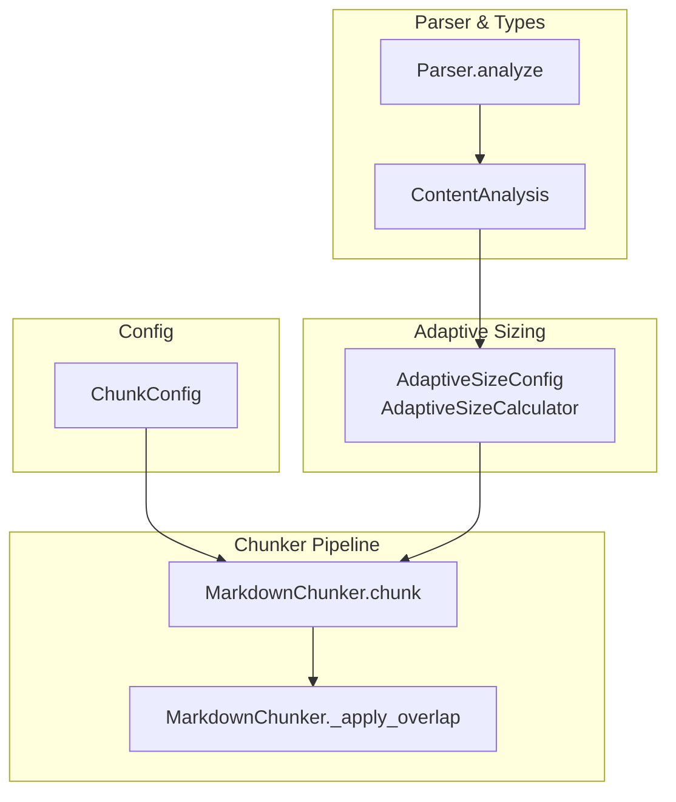
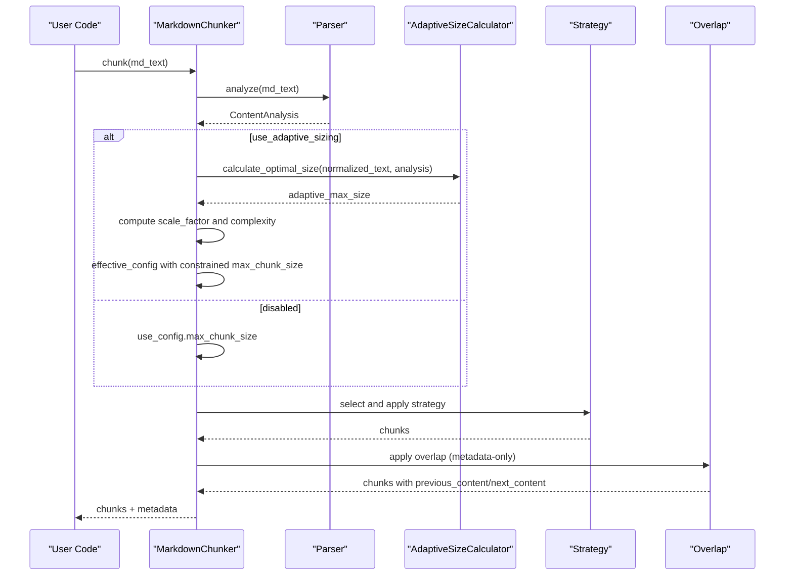
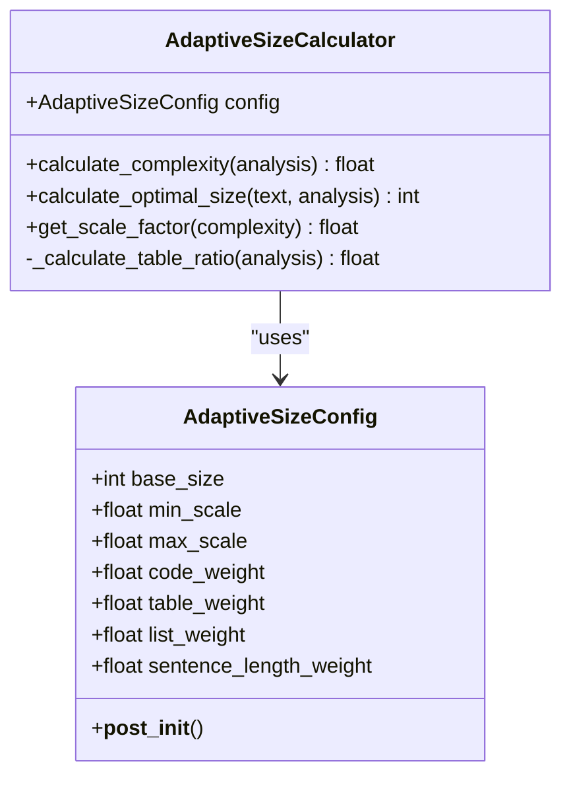
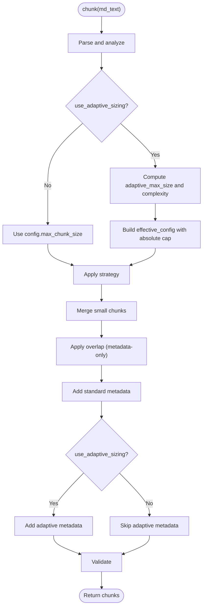
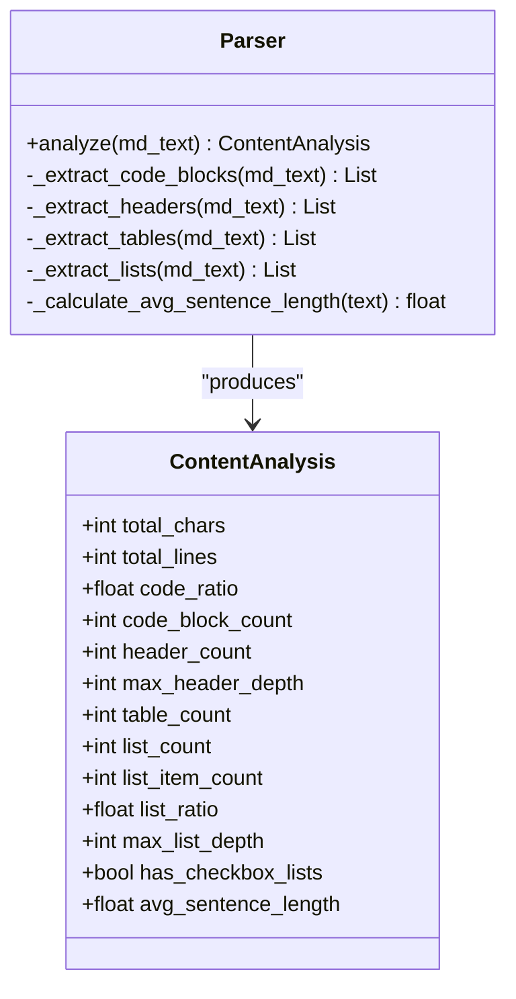
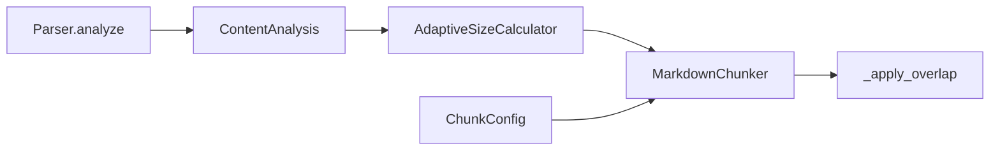

# Adaptive Sizing

<cite>
**Referenced Files in This Document**
- [adaptive_sizing.py](file://markdown_chunker_v2/adaptive_sizing.py)
- [chunker.py](file://markdown_chunker_v2/chunker.py)
- [config.py](file://markdown_chunker_v2/config.py)
- [parser.py](file://markdown_chunker_v2/parser.py)
- [types.py](file://markdown_chunker_v2/types.py)
- [test_adaptive_sizing.py](file://tests/chunker/test_adaptive_sizing.py)
- [test_adaptive_sizing_properties.py](file://tests/chunker/test_adaptive_sizing_properties.py)
- [test_adaptive_sizing_integration.py](file://tests/integration/test_adaptive_sizing_integration.py)
- [test_adaptive_sizing_performance.py](file://tests/performance/test_adaptive_sizing_performance.py)
- [validate_adaptive_sizing.py](file://scripts/validate_adaptive_sizing.py)
- [demo_adaptive_overlap.py](file://demo_adaptive_overlap.py)
- [adaptive-sizing-migration.md](file://docs/guides/adaptive-sizing-migration.md)
- [09-adaptive-chunk-sizing.md](file://docs/research/features/09-adaptive-chunk-sizing.md)
</cite>

## Table of Contents
1. [Introduction](#introduction)
2. [Project Structure](#project-structure)
3. [Core Components](#core-components)
4. [Architecture Overview](#architecture-overview)
5. [Detailed Component Analysis](#detailed-component-analysis)
6. [Dependency Analysis](#dependency-analysis)
7. [Performance Considerations](#performance-considerations)
8. [Troubleshooting Guide](#troubleshooting-guide)
9. [Conclusion](#conclusion)
10. [Appendices](#appendices)

## Introduction
Adaptive Sizing automatically adjusts chunk sizes based on content complexity. It analyzes the document’s composition (code ratio, table presence, list density, and sentence length) to compute a complexity score and derive an optimal chunk size. This enables:
- Larger chunks for code-heavy and table-heavy content (preserving atomic blocks)
- Smaller chunks for simple text
- Consistent, content-aware chunk distributions without manual tuning

Adaptive sizing is opt-in and integrates seamlessly with the chunker pipeline, adding metadata fields for diagnostics and enabling optional overlap scaling.

## Project Structure
Adaptive sizing spans several modules:
- Configuration and sizing logic: adaptive sizing classes and configuration
- Chunker integration: pipeline hooks to compute adaptive size and enrich metadata
- Parser and types: content analysis used by the calculator
- Tests and demos: unit, property-based, integration, and performance validations

**Diagram sources**
- [adaptive_sizing.py](file://markdown_chunker_v2/adaptive_sizing.py#L1-L185)
- [chunker.py](file://markdown_chunker_v2/chunker.py#L50-L134)
- [parser.py](file://markdown_chunker_v2/parser.py#L35-L101)
- [types.py](file://markdown_chunker_v2/types.py#L148-L184)
- [config.py](file://markdown_chunker_v2/config.py#L14-L118)

**Section sources**
- [adaptive_sizing.py](file://markdown_chunker_v2/adaptive_sizing.py#L1-L185)
- [chunker.py](file://markdown_chunker_v2/chunker.py#L50-L134)
- [parser.py](file://markdown_chunker_v2/parser.py#L35-L101)
- [types.py](file://markdown_chunker_v2/types.py#L148-L184)
- [config.py](file://markdown_chunker_v2/config.py#L14-L118)

## Core Components
- AdaptiveSizeConfig: Defines base_size, min_scale, max_scale, and weighted factors for complexity calculation.
- AdaptiveSizeCalculator: Stateless calculator that computes complexity and optimal size from ContentAnalysis.
- MarkdownChunker: Integrates adaptive sizing into the chunking pipeline, computes effective max size, and enriches chunks with metadata.
- Parser and ContentAnalysis: Provide metrics (code_ratio, table_ratio, list_ratio, avg_sentence_length) used by the calculator.
- ChunkConfig: Holds global chunking parameters and toggles adaptive sizing.

Key behaviors:
- Complexity score is a weighted sum of normalized factors (≤1.0).
- Optimal size is derived from base_size × scale_factor, bounded by min_scale and max_scale.
- Effective max size respects absolute max_chunk_size limit.
- Metadata fields include adaptive_size, content_complexity, size_scale_factor.

**Section sources**
- [adaptive_sizing.py](file://markdown_chunker_v2/adaptive_sizing.py#L14-L185)
- [chunker.py](file://markdown_chunker_v2/chunker.py#L50-L134)
- [parser.py](file://markdown_chunker_v2/parser.py#L35-L101)
- [types.py](file://markdown_chunker_v2/types.py#L148-L184)
- [config.py](file://markdown_chunker_v2/config.py#L14-L118)

## Architecture Overview
Adaptive sizing sits between parsing and strategy application in the chunker pipeline. It computes a complexity score and optimal size, then constrains the effective max_chunk_size to respect the absolute limit. Overlap is applied afterward with adaptive caps.

**Diagram sources**
- [chunker.py](file://markdown_chunker_v2/chunker.py#L50-L134)
- [chunker.py](file://markdown_chunker_v2/chunker.py#L172-L243)
- [adaptive_sizing.py](file://markdown_chunker_v2/adaptive_sizing.py#L133-L156)
- [parser.py](file://markdown_chunker_v2/parser.py#L35-L101)

## Detailed Component Analysis

### AdaptiveSizeConfig and AdaptiveSizeCalculator
- Configuration validation enforces:
  - Positive base_size and scales
  - min_scale < max_scale
  - Non-negative weights
  - Weights sum ≈ 1.0 (tolerance)
- Complexity calculation:
  - Normalizes code_ratio, table_ratio, list_ratio, and sentence_length factor
  - Computes weighted sum; caps at 1.0
- Optimal size:
  - scale_factor = min_scale + complexity × (max_scale − min_scale)
  - target_size = base_size × scale_factor
  - Final size clamped to [base_size × min_scale, base_size × max_scale]

**Diagram sources**
- [adaptive_sizing.py](file://markdown_chunker_v2/adaptive_sizing.py#L14-L185)

**Section sources**
- [adaptive_sizing.py](file://markdown_chunker_v2/adaptive_sizing.py#L14-L185)

### MarkdownChunker Integration
- Pipeline stage for adaptive sizing:
  - Parse once
  - If enabled, compute adaptive_max_size and complexity
  - Create effective config with max_chunk_size constrained by absolute limit
  - Apply strategy, merge small chunks, apply overlap, add metadata, validate
- Metadata enrichment:
  - adaptive_size, content_complexity, size_scale_factor
- Overlap scaling:
  - Effective overlap cap = min(config.overlap_size, chunk_size × 0.35)
  - Extraction respects word boundaries

**Diagram sources**
- [chunker.py](file://markdown_chunker_v2/chunker.py#L50-L134)
- [chunker.py](file://markdown_chunker_v2/chunker.py#L172-L243)

**Section sources**
- [chunker.py](file://markdown_chunker_v2/chunker.py#L50-L134)
- [chunker.py](file://markdown_chunker_v2/chunker.py#L172-L243)

### Parser and ContentAnalysis
- Parser.analyze extracts:
  - Code blocks, headers, tables, lists
  - Metrics: total_chars, total_lines, code_ratio, table_count, list_count, list_ratio, max_list_depth, has_checkbox_lists, avg_sentence_length
- These metrics feed AdaptiveSizeCalculator to compute complexity and optimal size.

**Diagram sources**
- [parser.py](file://markdown_chunker_v2/parser.py#L35-L101)
- [types.py](file://markdown_chunker_v2/types.py#L148-L184)

**Section sources**
- [parser.py](file://markdown_chunker_v2/parser.py#L35-L101)
- [types.py](file://markdown_chunker_v2/types.py#L148-L184)

### Configuration Profiles and Tuning
- ChunkConfig supports:
  - use_adaptive_sizing toggle
  - adaptive_config for fine-tuning
  - Predefined profiles for code-heavy and text-heavy documents
- Tuning guidance:
  - Adjust base_size for typical content density
  - Adjust min_scale/max_scale for variance
  - Adjust weights to prioritize code, tables, lists, or sentence length

**Section sources**
- [config.py](file://markdown_chunker_v2/config.py#L14-L118)
- [config.py](file://markdown_chunker_v2/config.py#L290-L342)
- [config.py](file://markdown_chunker_v2/config.py#L306-L342)
- [adaptive-sizing-migration.md](file://docs/guides/adaptive-sizing-migration.md#L122-L206)

### Tests and Validation
- Unit tests verify:
  - Configuration validation (weights sum, scale bounds)
  - Complexity scoring directionality (code-heavy increases complexity)
  - Size calculation bounds and scaling behavior
  - Custom weights influence outcomes
- Property-based tests enforce:
  - Monotonicity with code_ratio
  - Output bounds for any configuration
  - Determinism and predictable weight effects
- Integration tests confirm:
  - Adaptive sizing disabled by default
  - Metadata fields appear when enabled
  - Absolute max_chunk_size respected
  - Profiles and custom configs honored
- Performance tests confirm:
  - Minimal overhead (<5% of parsing time)
  - Linear scaling maintained
  - Acceptable metadata overhead

**Section sources**
- [test_adaptive_sizing.py](file://tests/chunker/test_adaptive_sizing.py#L1-L346)
- [test_adaptive_sizing_properties.py](file://tests/chunker/test_adaptive_sizing_properties.py#L1-L293)
- [test_adaptive_sizing_integration.py](file://tests/integration/test_adaptive_sizing_integration.py#L1-L252)
- [test_adaptive_sizing_performance.py](file://tests/performance/test_adaptive_sizing_performance.py#L1-L286)

### Demos and Scripts
- Demo script illustrates adaptive overlap scaling (35% of chunk size) and compares fixed vs adaptive approaches.
- Validation script runs adaptive sizing across corpus files and reports complexity and scale statistics.

**Section sources**
- [demo_adaptive_overlap.py](file://demo_adaptive_overlap.py#L1-L166)
- [validate_adaptive_sizing.py](file://scripts/validate_adaptive_sizing.py#L1-L186)

## Dependency Analysis
Adaptive sizing depends on:
- Parser and ContentAnalysis for metrics
- ChunkConfig for enabling and tuning
- Chunker pipeline for integration and metadata enrichment

**Diagram sources**
- [parser.py](file://markdown_chunker_v2/parser.py#L35-L101)
- [types.py](file://markdown_chunker_v2/types.py#L148-L184)
- [adaptive_sizing.py](file://markdown_chunker_v2/adaptive_sizing.py#L133-L156)
- [chunker.py](file://markdown_chunker_v2/chunker.py#L50-L134)
- [config.py](file://markdown_chunker_v2/config.py#L14-L118)

**Section sources**
- [parser.py](file://markdown_chunker_v2/parser.py#L35-L101)
- [types.py](file://markdown_chunker_v2/types.py#L148-L184)
- [adaptive_sizing.py](file://markdown_chunker_v2/adaptive_sizing.py#L133-L156)
- [chunker.py](file://markdown_chunker_v2/chunker.py#L50-L134)
- [config.py](file://markdown_chunker_v2/config.py#L14-L118)

## Performance Considerations
- Overhead:
  - Size calculation overhead is negligible compared to parsing
  - Total chunking time impact is minimal
  - Metadata overhead is modest (3 fields per chunk)
- Scaling:
  - Linear scaling maintained under adaptive sizing
- Practical tips:
  - Keep use_adaptive_sizing enabled for varied content
  - Use profiles for code-heavy or text-heavy content
  - Monitor complexity distribution to tune weights if needed

**Section sources**
- [test_adaptive_sizing_performance.py](file://tests/performance/test_adaptive_sizing_performance.py#L1-L286)
- [adaptive-sizing-migration.md](file://docs/guides/adaptive-sizing-migration.md#L442-L464)

## Troubleshooting Guide
Common issues and resolutions:
- Weights do not sum to 1.0:
  - Ensure weights sum to 1.0 (±0.01 tolerance)
- Invalid scale range:
  - Ensure min_scale < max_scale
- Unexpected chunk sizes:
  - Atomic blocks (code, tables) may force larger chunks
  - Section boundaries and min/max constraints can affect sizes
- Uniform content:
  - Adaptive sizing may provide minimal benefit if complexity is near 1.0 across chunks

Diagnostic steps:
- Inspect chunk.metadata for adaptive_size, content_complexity, size_scale_factor
- Compare adaptive_size vs actual chunk size to infer causes (atomic blocks, merges, constraints)
- Use validation script to assess corpus-wide complexity and scale distributions

**Section sources**
- [adaptive_sizing.py](file://markdown_chunker_v2/adaptive_sizing.py#L37-L87)
- [chunker.py](file://markdown_chunker_v2/chunker.py#L304-L343)
- [validate_adaptive_sizing.py](file://scripts/validate_adaptive_sizing.py#L1-L186)
- [adaptive-sizing-migration.md](file://docs/guides/adaptive-sizing-migration.md#L352-L413)

## Conclusion
Adaptive Sizing provides a robust, content-aware mechanism to optimize chunk sizes without manual tuning. By combining parser metrics with configurable weights and scaling, it improves retrieval precision and chunk quality across diverse content types. The opt-in design ensures backward compatibility, while metadata fields offer insights for monitoring and tuning.

## Appendices

### Quick Start and Migration
- Enable adaptive sizing by setting use_adaptive_sizing=True in ChunkConfig
- Optionally configure AdaptiveSizeConfig (base_size, min_scale, max_scale, weights)
- Use predefined profiles for code-heavy or text-heavy content
- Review migration guide for configuration and behavior changes

**Section sources**
- [config.py](file://markdown_chunker_v2/config.py#L290-L342)
- [adaptive-sizing-migration.md](file://docs/guides/adaptive-sizing-migration.md#L36-L119)

### Research Background
- Feature research outlines the rationale, architecture, and expected improvements
- Demonstrates expected size ranges for different content types

**Section sources**
- [09-adaptive-chunk-sizing.md](file://docs/research/features/09-adaptive-chunk-sizing.md#L1-L390)