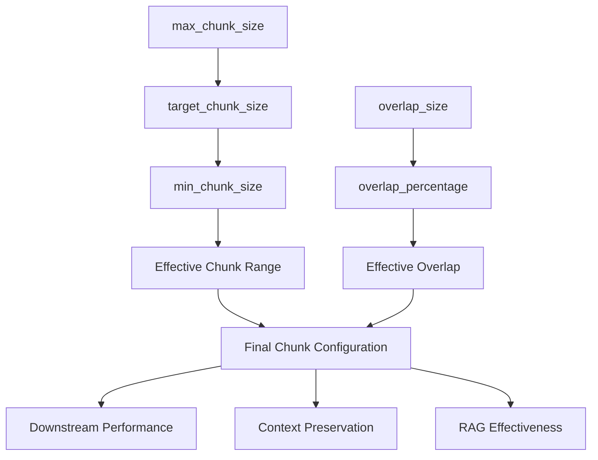
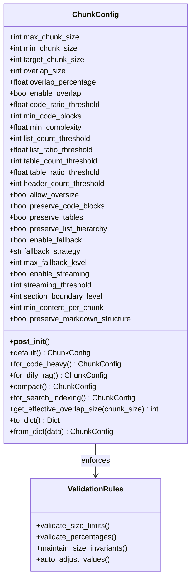
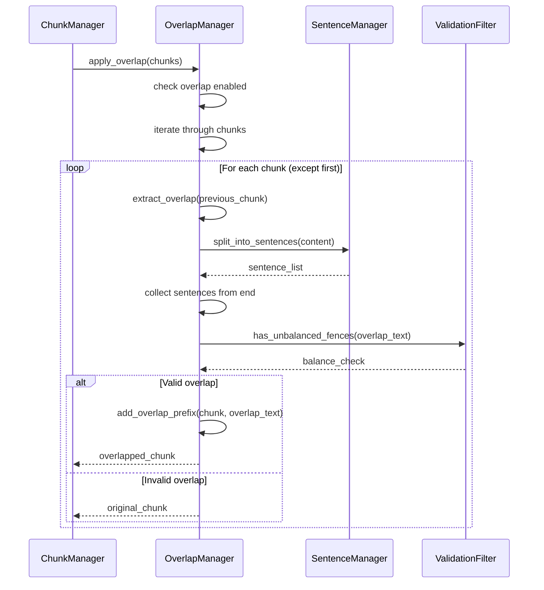
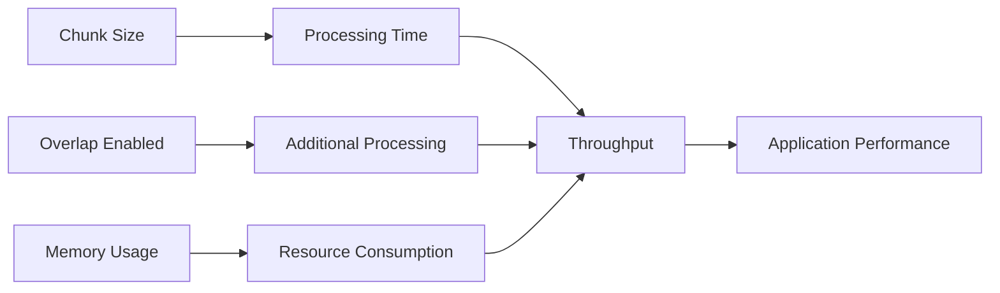

# Chunk Sizing Configuration

<cite>
**Referenced Files in This Document**
- [markdown_chunker/chunker/types.py](file://markdown_chunker/chunker/types.py)
- [markdown_chunker/chunker/components/overlap_manager.py](file://markdown_chunker/chunker/components/overlap_manager.py)
- [markdown_chunker/chunker/validator.py](file://markdown_chunker/chunker/validator.py)
- [tests/chunker/test_chunk_config_validation.py](file://tests/chunker/test_chunk_config_validation.py)
- [tests/chunker/test_components/test_overlap_manager.py](file://tests/chunker/test_components/test_overlap_manager.py)
- [tests/chunker/test_config_profiles.py](file://tests/chunker/test_config_profiles.py)
- [examples/basic_usage.py](file://examples/basic_usage.py)
- [benchmarks/benchmark_chunker.py](file://benchmarks/benchmark_chunker.py)
</cite>

## Table of Contents
1. [Introduction](#introduction)
2. [Core Configuration Parameters](#core-configuration-parameters)
3. [ChunkConfig Dataclass Structure](#chunkconfig-dataclass-structure)
4. [Overlap Management System](#overlap-management-system)
5. [Factory Configuration Profiles](#factory-configuration-profiles)
6. [Performance Impact Analysis](#performance-impact-analysis)
7. [Practical Implementation Examples](#practical-implementation-examples)
8. [Common Issues and Solutions](#common-issues-and-solutions)
9. [Best Practices](#best-practices)
10. [Troubleshooting Guide](#troubleshooting-guide)

## Introduction

The Dify Markdown Chunker provides sophisticated chunk sizing configuration through the `ChunkConfig` dataclass, which controls output granularity and context preservation in RAG (Retrieval-Augmented Generation) systems and search indexing applications. The system balances three critical factors: chunk size, overlap management, and downstream performance optimization.

Chunk sizing directly impacts the effectiveness of downstream applications by determining how content is segmented and how context is maintained across boundaries. Proper configuration ensures optimal retrieval accuracy while maintaining processing efficiency.

## Core Configuration Parameters

### Size Control Parameters

The chunk sizing system operates through four primary size-related parameters that work together to define the chunking behavior:



**Diagram sources**
- [markdown_chunker/chunker/types.py](file://markdown_chunker/chunker/types.py#L574-L582)

#### max_chunk_size
- **Default**: 4096 characters
- **Purpose**: Maximum allowable chunk size before oversizing occurs
- **Impact**: Controls memory usage and processing time
- **Constraint**: Must be greater than min_chunk_size

#### min_chunk_size  
- **Default**: 512 characters
- **Purpose**: Minimum chunk size to prevent overly fragmented output
- **Impact**: Prevents context loss in small chunks
- **Constraint**: Must be less than or equal to max_chunk_size

#### target_chunk_size
- **Default**: 2048 characters
- **Purpose**: Optimal chunk size aiming for balanced content
- **Impact**: Influences average chunk size distribution
- **Constraint**: Must be between min_chunk_size and max_chunk_size

#### overlap_size
- **Default**: 200 characters
- **Purpose**: Fixed-size overlap between adjacent chunks
- **Impact**: Maintains context continuity across chunk boundaries
- **Constraint**: Subject to percentage and size limitations

**Section sources**
- [markdown_chunker/chunker/types.py](file://markdown_chunker/chunker/types.py#L574-L582)

## ChunkConfig Dataclass Structure

The `ChunkConfig` dataclass serves as the central configuration hub for all chunking behavior, providing comprehensive control over size limits, strategy selection, and overlap management.



**Diagram sources**
- [markdown_chunker/chunker/types.py](file://markdown_chunker/chunker/types.py#L497-L1027)

### Validation and Auto-Adjustment

The `ChunkConfig` implements comprehensive validation through the `__post_init__` method, automatically adjusting invalid configurations to maintain system stability:

#### Size Limit Validation
- Ensures `max_chunk_size > 0`
- Validates `min_chunk_size > 0`
- Automatically adjusts `min_chunk_size` if it exceeds `max_chunk_size`
- Constrains `target_chunk_size` within valid bounds

#### Percentage Validation
- Validates overlap percentages (0.0 to 1.0)
- Validates strategy thresholds (0.0 to 1.0)
- Ensures percentage-based calculations remain valid

#### Invariant Maintenance
- Enforces `min_chunk_size ≤ target_chunk_size ≤ max_chunk_size`
- Maintains logical consistency across all size parameters

**Section sources**
- [markdown_chunker/chunker/types.py](file://markdown_chunker/chunker/types.py#L620-L664)

## Overlap Management System

The `OverlapManager` component handles the complex task of creating contextual continuity between adjacent chunks while preserving sentence boundaries and avoiding data corruption.



**Diagram sources**
- [markdown_chunker/chunker/components/overlap_manager.py](file://markdown_chunker/chunker/components/overlap_manager.py#L37-L78)

### Overlap Calculation Logic

The overlap system employs sophisticated algorithms to determine optimal overlap sizes while maintaining content integrity:

#### Effective Overlap Size Calculation
The system calculates effective overlap using a priority-based approach:

1. **Fixed-size overlap** takes precedence when `overlap_size > 0`
2. **Percentage-based overlap** serves as fallback when fixed size is zero
3. **Safety limits** prevent overlap from dominating chunk content

#### Sentence Boundary Preservation
The overlap manager implements intelligent sentence splitting to maintain natural text flow:

- Uses regex pattern `[.!?]+\s+` to identify sentence boundaries
- Collects sentences from the end of previous chunks
- Implements tolerance mechanisms for edge cases
- Truncates content while preserving meaningful boundaries

#### Safety Constraints
Multiple safety mechanisms prevent data corruption:

- **Ratio constraint**: Overlap cannot exceed 45% of resulting chunk content
- **Size constraint**: Total chunk size must not exceed `max_chunk_size`
- **Fence validation**: Prevents unbalanced code block inclusion
- **Boundary preservation**: Maintains markdown structure integrity

**Section sources**
- [markdown_chunker/chunker/components/overlap_manager.py](file://markdown_chunker/chunker/components/overlap_manager.py#L109-L142)
- [markdown_chunker/chunker/components/overlap_manager.py](file://markdown_chunker/chunker/components/overlap_manager.py#L155-L239)

## Factory Configuration Profiles

The system provides specialized factory methods for common use cases, each optimized for specific downstream applications and performance characteristics.

| Profile | Purpose | max_chunk_size | overlap_size | enable_overlap | Use Case |
|---------|---------|----------------|--------------|----------------|----------|
| `default()` | General documents | 4096 | 200 | True | Balanced processing |
| `for_code_heavy()` | Code documentation | 6144 | 300 | True | Technical content |
| `for_dify_rag()` | RAG systems | 3072 | 150 | True | Information retrieval |
| `compact()` | Fine-grained chunks | 2048 | 100 | True | Search applications |
| `for_search_indexing()` | Search optimization | 1024 | 100 | True | Indexing systems |
| `for_fast_processing()` | High throughput | 8192 | 100 | False | Batch processing |

### Profile-Specific Optimizations

#### Code-Heavy Documents
- **Larger chunks**: 6144 character maximum for complete code blocks
- **Aggressive detection**: 0.5 threshold for code content identification
- **Extended overlap**: 300 characters for context preservation
- **Preserve integrity**: Maintains code block boundaries

#### RAG-Optimized Configuration
- **Moderate chunks**: 3072 character maximum for balanced retrieval
- **Strategic overlap**: 150 characters for context continuity
- **Strict limits**: Disables oversize chunks for consistency
- **Structure preservation**: Maintains markdown hierarchy

#### Search-Indexing Focus
- **Small chunks**: 1024 character maximum for granular matching
- **Consistent overlap**: 100 characters for reliable boundaries
- **High granularity**: Enables precise content targeting
- **Minimal fragmentation**: Balances size and context

**Section sources**
- [markdown_chunker/chunker/types.py](file://markdown_chunker/chunker/types.py#L666-L1027)

## Performance Impact Analysis

Chunk sizing configuration significantly affects system performance across multiple dimensions, influencing processing time, memory usage, and downstream application effectiveness.

### Processing Time Correlation



**Diagram sources**
- [benchmarks/benchmark_chunker.py](file://benchmarks/benchmark_chunker.py#L64-L115)

#### Size-Based Performance Factors

| Chunk Size Range | Typical Processing Time | Throughput | Memory Usage |
|------------------|------------------------|------------|--------------|
| 512-1024 chars | 100-300ms | 3-10 KB/s | Low |
| 2048-4096 chars | 300-800ms | 5-15 KB/s | Medium |
| 8192+ chars | 1-3 seconds | 2-8 KB/s | High |

#### Overlap Impact Analysis

Overlap configuration affects performance through multiple mechanisms:

- **Additional computation**: Sentence boundary detection and text manipulation
- **Memory overhead**: Storing and processing overlap content
- **Complexity multiplier**: Increased processing for boundary preservation
- **Trade-off optimization**: Balancing context preservation vs. performance

### Downstream Application Effects

#### RAG System Performance
- **Precision vs. Recall**: Smaller chunks improve precision, larger chunks enhance recall
- **Context window utilization**: Overlap size affects available context per query
- **Retrieval efficiency**: Chunk size influences search index density and query performance

#### Search Indexing Impact
- **Granularity control**: Smaller chunks enable finer search targeting
- **Index size**: Chunk size directly affects index storage requirements
- **Query accuracy**: Fragmentation level impacts search result relevance

**Section sources**
- [benchmarks/benchmark_chunker.py](file://benchmarks/benchmark_chunker.py#L64-L115)

## Practical Implementation Examples

### Basic Configuration Setup

```python
# Standard configuration for general use
config = ChunkConfig(
    max_chunk_size=2048,
    min_chunk_size=256,
    target_chunk_size=1024,
    overlap_size=100,
    enable_overlap=True
)

# Create chunker with custom configuration
chunker = MarkdownChunker(config)
```

### RAG System Optimization

```python
# Optimized for Dify RAG systems
config = ChunkConfig.for_dify_rag()

# Custom RAG configuration
config = ChunkConfig(
    max_chunk_size=3072,
    min_chunk_size=256,
    target_chunk_size=1536,
    overlap_size=150,
    enable_overlap=True,
    allow_oversize=False
)
```

### Search Application Tuning

```python
# Optimized for search indexing
config = ChunkConfig.for_search_indexing()

# Custom search configuration
config = ChunkConfig(
    max_chunk_size=1024,
    min_chunk_size=100,
    target_chunk_size=512,
    overlap_size=100,
    enable_overlap=True,
    preserve_code_blocks=True,
    preserve_list_hierarchy=True
)
```

### Performance-Critical Scenarios

```python
# High-throughput configuration
config = ChunkConfig.for_fast_processing()

# Memory-constrained environment
config = ChunkConfig(
    max_chunk_size=1024,
    min_chunk_size=128,
    overlap_size=50,
    enable_overlap=False,
    enable_streaming=True
)
```

**Section sources**
- [examples/basic_usage.py](file://examples/basic_usage.py#L115-L137)
- [tests/chunker/test_config_profiles.py](file://tests/chunker/test_config_profiles.py#L9-L70)

## Common Issues and Solutions

### Issue: Overly Fragmented Output

**Symptoms**: Too many small chunks with poor context continuity
**Causes**: 
- `min_chunk_size` set too low
- `max_chunk_size` too restrictive
- Insufficient overlap

**Solutions**:
```python
# Increase minimum chunk size
config = ChunkConfig(
    min_chunk_size=512,  # Default: 256 → 512
    max_chunk_size=4096, # Default: 2048 → 4096
    overlap_size=200     # Default: 100 → 200
)
```

### Issue: Context Loss at Boundaries

**Symptoms**: Important information split across chunk boundaries
**Causes**:
- `overlap_size` too small
- `enable_overlap` disabled
- Aggressive sentence boundary detection

**Solutions**:
```python
# Increase overlap size
config = ChunkConfig(
    overlap_size=300,    # Default: 200
    enable_overlap=True, # Default: True
    overlap_percentage=0.2  # Increase from 0.1
)
```

### Issue: Memory Exhaustion

**Symptoms**: Out-of-memory errors during processing
**Causes**:
- `max_chunk_size` too large
- `allow_oversize` enabled for large documents
- Insufficient streaming configuration

**Solutions**:
```python
# Reduce maximum chunk size
config = ChunkConfig(
    max_chunk_size=2048,  # Default: 4096
    enable_streaming=True, # Enable for large documents
    streaming_threshold=5*1024*1024  # 5MB threshold
)
```

### Issue: Poor Retrieval Accuracy

**Symptoms**: Irrelevant or incomplete search results
**Causes**:
- Chunk size mismatch with content type
- Inadequate overlap for context preservation
- Suboptimal strategy selection

**Solutions**:
```python
# Use content-type specific profiles
if content_type == "code":
    config = ChunkConfig.for_code_heavy()
elif content_type == "documentation":
    config = ChunkConfig.for_structured_docs()
elif content_type == "search":
    config = ChunkConfig.for_search_indexing()
```

**Section sources**
- [tests/chunker/test_overlap_properties.py](file://tests/chunker/test_overlap_properties.py#L339-L415)

## Best Practices

### Configuration Selection Guidelines

#### Content Type Considerations
- **Code-heavy documents**: Use `for_code_heavy()` or custom with large chunks and extended overlap
- **Documentation**: Use `for_structured_docs()` for hierarchical content preservation
- **RAG applications**: Use `for_dify_rag()` for balanced retrieval performance
- **Search systems**: Use `for_search_indexing()` for granular matching
- **Batch processing**: Use `for_fast_processing()` for throughput optimization

#### Performance Optimization
- **Memory-constrained environments**: Reduce chunk sizes and disable overlap when possible
- **High-throughput scenarios**: Increase chunk sizes and disable overlap
- **Quality-critical applications**: Use conservative overlap settings and structured strategies

#### Strategy Selection
- **Automatic selection**: Let the system choose based on content analysis
- **Manual override**: Specify strategy for known content types
- **Hybrid approach**: Combine automatic selection with manual overrides

### Validation and Monitoring

#### Configuration Validation
```python
# Validate configuration before deployment
def validate_config(config: ChunkConfig) -> bool:
    # Check size invariants
    assert config.min_chunk_size <= config.target_chunk_size <= config.max_chunk_size
    
    # Verify overlap constraints
    if config.enable_overlap:
        assert config.overlap_size > 0 or config.overlap_percentage > 0
    
    # Check strategy thresholds
    assert 0.0 <= config.code_ratio_threshold <= 1.0
    assert 0.0 <= config.list_ratio_threshold <= 1.0
    
    return True
```

#### Performance Monitoring
- Track chunk count distribution
- Monitor processing time per document size
- Measure overlap effectiveness
- Evaluate downstream application performance

**Section sources**
- [markdown_chunker/chunker/validator.py](file://markdown_chunker/chunker/validator.py#L71-L151)

## Troubleshooting Guide

### Diagnostic Tools and Techniques

#### Configuration Analysis
```python
# Analyze current configuration
def analyze_config(config: ChunkConfig) -> dict:
    return {
        "size_limits": {
            "max_chunk_size": config.max_chunk_size,
            "min_chunk_size": config.min_chunk_size,
            "target_chunk_size": config.target_chunk_size
        },
        "overlap_settings": {
            "enabled": config.enable_overlap,
            "fixed_size": config.overlap_size,
            "percentage": config.overlap_percentage,
            "effective_size": config.get_effective_overlap_size(2048)
        },
        "strategy_thresholds": {
            "code_ratio": config.code_ratio_threshold,
            "list_ratio": config.list_ratio_threshold,
            "table_ratio": config.table_ratio_threshold
        }
    }
```

#### Performance Profiling
```python
# Profile chunking performance
def profile_chunking(text: str, config: ChunkConfig) -> dict:
    chunker = MarkdownChunker(config)
    
    start_time = time.time()
    result = chunker.chunk_with_analysis(text)
    processing_time = time.time() - start_time
    
    return {
        "processing_time": processing_time,
        "chunk_count": len(result.chunks),
        "average_chunk_size": sum(c.size for c in result.chunks) / len(result.chunks),
        "overlap_stats": chunker.overlap_manager.calculate_overlap_statistics(result.chunks)
    }
```

### Common Error Patterns

#### Validation Failures
- **Size invariants violated**: Check that min ≤ target ≤ max
- **Invalid percentages**: Ensure all ratios are between 0.0 and 1.0
- **Negative values**: Verify all size parameters are positive

#### Runtime Issues
- **Memory exhaustion**: Reduce chunk sizes or enable streaming
- **Slow processing**: Increase chunk sizes or disable overlap
- **Poor quality**: Adjust strategy thresholds or increase overlap

#### Integration Problems
- **Dify compatibility**: Use Dify-specific profiles
- **API constraints**: Match configuration to service limits
- **Workflow integration**: Align chunking with downstream processing

**Section sources**
- [tests/chunker/test_chunk_config_validation.py](file://tests/chunker/test_chunk_config_validation.py#L13-L207)