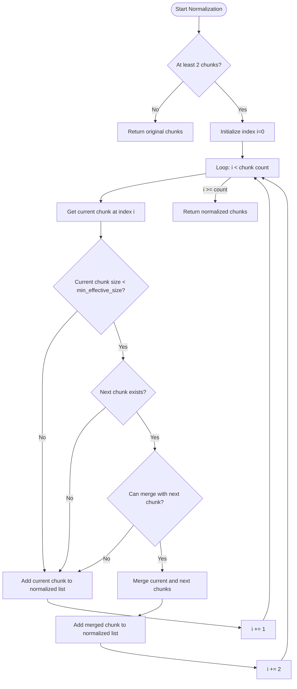
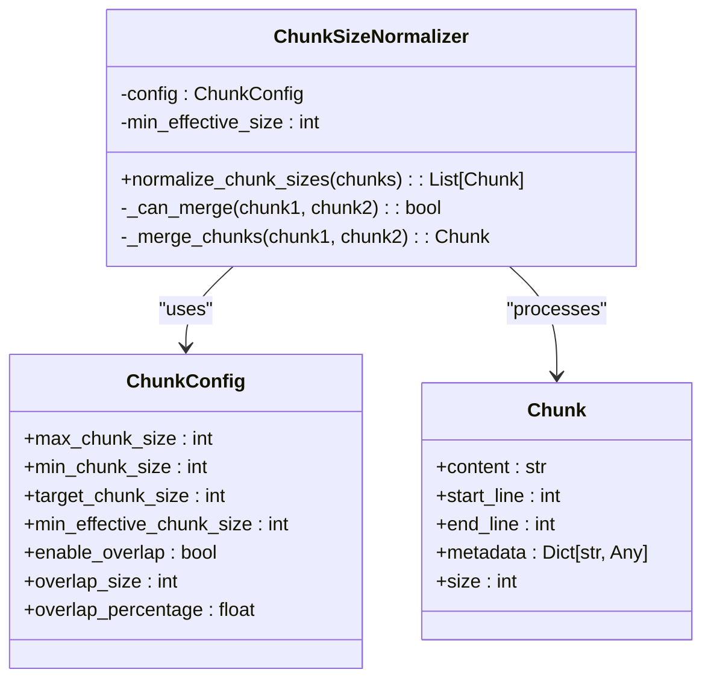
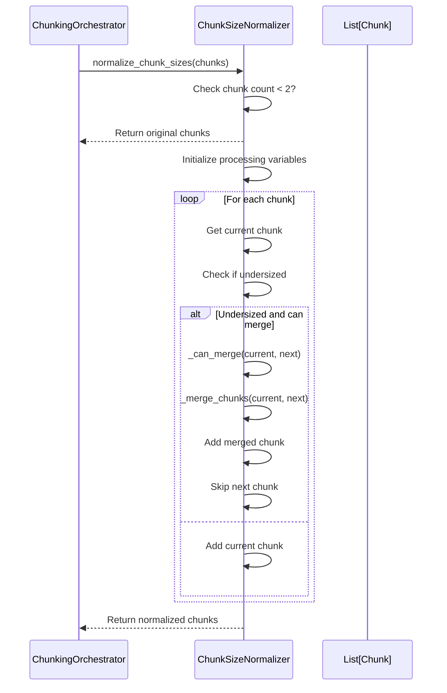

# Chunk Size Normalizer

<cite>
**Referenced Files in This Document**   
- [chunk_size_normalizer.py](file://markdown_chunker/chunker/chunk_size_normalizer.py)
- [types.py](file://markdown_chunker/chunker/types.py)
- [orchestrator.py](file://markdown_chunker/chunker/orchestrator.py)
</cite>

## Table of Contents
1. [Introduction](#introduction)
2. [Core Functionality](#core-functionality)
3. [Configuration and Parameters](#configuration-and-parameters)
4. [Processing Logic](#processing-logic)
5. [Integration with Chunking Pipeline](#integration-with-chunking-pipeline)
6. [Performance Considerations](#performance-considerations)

## Introduction

The Chunk Size Normalizer is a post-processing component designed to improve the distribution of chunk sizes in the markdown chunking system. It addresses the issue of size variance by implementing a simplified single-pass merging algorithm that combines undersized adjacent chunks when possible. This component is part of a comprehensive solution to ensure more consistent chunk sizes, which is critical for downstream applications like retrieval-augmented generation (RAG) systems.

The normalizer operates as part of the block-based post-processing pipeline, working in conjunction with other components to enhance the quality of chunked output. It specifically targets the problem of undersized chunks that can occur during the initial chunking process, particularly when dealing with documents that have complex structures or varying content density.

**Section sources**
- [chunk_size_normalizer.py](file://markdown_chunker/chunker/chunk_size_normalizer.py#L1-L156)
- [orchestrator.py](file://markdown_chunker/chunker/orchestrator.py#L485-L569)

## Core Functionality

The Chunk Size Normalizer implements a linear single-pass merging algorithm to reduce size variance among chunks. The core functionality revolves around identifying undersized chunks and determining whether they can be merged with their adjacent neighbors to create more optimally sized chunks.

The normalizer evaluates two primary conditions before merging chunks:
1. The current chunk must be undersized (smaller than the minimum effective size threshold)
2. The combined size of the current chunk and the next chunk must not exceed the maximum chunk size limit

When both conditions are met, the chunks are merged into a single chunk with combined content and metadata. The merging process preserves important metadata from both chunks, including content type information and structural context.

**Diagram sources **
- [chunk_size_normalizer.py](file://markdown_chunker/chunker/chunk_size_normalizer.py#L23-L56)

**Section sources**
- [chunk_size_normalizer.py](file://markdown_chunker/chunker/chunk_size_normalizer.py#L23-L56)

## Configuration and Parameters

The Chunk Size Normalizer is configured through the ChunkConfig object, which provides the necessary parameters for its operation. The key configuration parameter is `min_effective_chunk_size`, which determines the threshold below which chunks are considered undersized and candidates for merging.

The minimum effective chunk size is automatically calculated as 40% of the maximum chunk size when not explicitly set. This default value represents a balance between eliminating very small chunks and avoiding excessive merging that could create overly large chunks.

**Diagram sources **
- [types.py](file://markdown_chunker/chunker/types.py#L501-L800)
- [chunk_size_normalizer.py](file://markdown_chunker/chunker/chunk_size_normalizer.py#L11-L156)

**Section sources**
- [types.py](file://markdown_chunker/chunker/types.py#L631-L678)

## Processing Logic

The processing logic of the Chunk Size Normalizer follows a systematic approach to identify and merge undersized chunks. The algorithm operates in a single pass through the chunk list, examining each chunk and its potential to merge with the next chunk in sequence.

The merging process involves several critical checks:
- Section path consistency: Both chunks must have the same section path to ensure structural integrity
- Size constraints: The combined size must not exceed the maximum chunk size limit
- Content type preservation: When merging chunks with different content types, the resulting chunk's metadata preserves the most specific content type

When chunks are merged, the normalizer creates a new chunk with combined content separated by a double newline. The metadata from the first chunk is preserved, with additional information about the merge operation added. Special handling is implemented for different content types (code, table, list) to ensure that relevant metadata is preserved from either of the original chunks.

The normalizer also includes logic to handle cases where the merged chunk slightly exceeds the maximum size limit. In such cases, the chunk is flagged as allowing oversize with a specific reason code, providing transparency about the size violation.

**Section sources**
- [chunk_size_normalizer.py](file://markdown_chunker/chunker/chunk_size_normalizer.py#L58-L148)

## Integration with Chunking Pipeline

The Chunk Size Normalizer is integrated into the overall chunking pipeline as part of the block-based post-processing stage. It is invoked by the ChunkingOrchestrator after the initial chunking strategy has been applied and before final validation steps.

The normalizer is conditionally applied based on the configuration setting `min_effective_chunk_size > 0`. When enabled, it operates as one of several post-processing components that work together to improve chunk quality, alongside block-based overlap management and header path validation.

The integration follows a fail-safe approach: if the normalizer encounters any errors during processing, the original chunks are preserved and a warning is logged. This ensures that the chunking process can continue even if the normalization step fails, maintaining the overall reliability of the system.

**Diagram sources **
- [orchestrator.py](file://markdown_chunker/chunker/orchestrator.py#L485-L569)
- [chunk_size_normalizer.py](file://markdown_chunker/chunker/chunk_size_normalizer.py#L23-L56)

**Section sources**
- [orchestrator.py](file://markdown_chunker/chunker/orchestrator.py#L485-L569)

## Performance Considerations

The Chunk Size Normalizer is designed with performance efficiency in mind, implementing a single-pass algorithm that processes chunks in O(n) time complexity. This linear approach ensures that the normalization process scales efficiently with the number of chunks, making it suitable for processing large documents.

The algorithm minimizes memory usage by creating a new list of normalized chunks rather than modifying the original list in place. This approach, while using additional memory, provides better performance by avoiding the costly operations of list insertion and deletion.

The normalizer includes several optimizations to reduce unnecessary processing:
- Early termination for lists with fewer than two chunks
- Direct size comparisons without additional computation
- Efficient metadata merging that avoids deep copying when possible

These performance characteristics make the Chunk Size Normalizer a lightweight post-processing step that adds minimal overhead to the overall chunking process while significantly improving the quality of the output.

**Section sources**
- [chunk_size_normalizer.py](file://markdown_chunker/chunker/chunk_size_normalizer.py#L23-L56)
- [orchestrator.py](file://markdown_chunker/chunker/orchestrator.py#L485-L569)