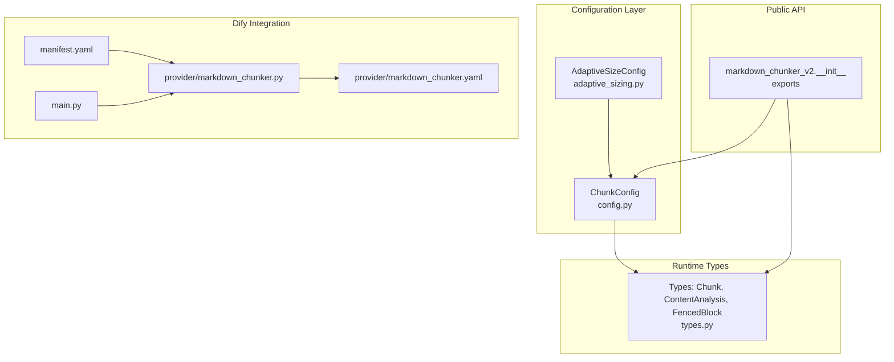
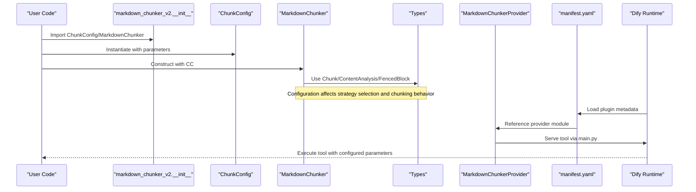
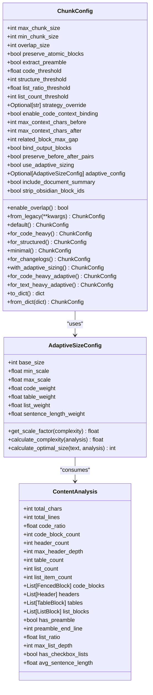

# Chunker Configuration

<cite>
**Referenced Files in This Document**
- [config.py](file://markdown_chunker_v2/config.py)
- [adaptive_sizing.py](file://markdown_chunker_v2/adaptive_sizing.py)
- [types.py](file://markdown_chunker_v2/types.py)
- [__init__.py](file://markdown_chunker_v2/__init__.py)
- [config.md](file://docs/api/config.md)
- [README.md](file://README.md)
- [usage.md](file://docs/usage.md)
- [main.py](file://main.py)
- [manifest.yaml](file://manifest.yaml)
- [markdown_chunker.py](file://provider/markdown_chunker.py)
- [markdown_chunker.yaml](file://provider/markdown_chunker.yaml)
</cite>

## Table of Contents
1. [Introduction](#introduction)
2. [Project Structure](#project-structure)
3. [Core Components](#core-components)
4. [Architecture Overview](#architecture-overview)
5. [Detailed Component Analysis](#detailed-component-analysis)
6. [Dependency Analysis](#dependency-analysis)
7. [Performance Considerations](#performance-considerations)
8. [Troubleshooting Guide](#troubleshooting-guide)
9. [Conclusion](#conclusion)
10. [Appendices](#appendices)

## Introduction
This document explains the Chunker Configuration for the Advanced Markdown Chunker, focusing on the simplified configuration model introduced in v2. It covers the core configuration class, adaptive sizing, and how configuration integrates with the Dify plugin ecosystem. It also provides guidance on tuning parameters for different content types and environments.

## Project Structure
The configuration system centers around a compact set of parameters that control chunk size limits, strategy selection thresholds, overlap behavior, and optional advanced features like adaptive sizing and code-context binding.

**Diagram sources**
- [config.py](file://markdown_chunker_v2/config.py#L1-L120)
- [adaptive_sizing.py](file://markdown_chunker_v2/adaptive_sizing.py#L1-L60)
- [types.py](file://markdown_chunker_v2/types.py#L1-L120)
- [__init__.py](file://markdown_chunker_v2/__init__.py#L1-L35)
- [manifest.yaml](file://manifest.yaml#L1-L49)
- [markdown_chunker.py](file://provider/markdown_chunker.py#L1-L36)
- [markdown_chunker.yaml](file://provider/markdown_chunker.yaml#L1-L23)
- [main.py](file://main.py#L1-L31)

**Section sources**
- [config.py](file://markdown_chunker_v2/config.py#L1-L120)
- [__init__.py](file://markdown_chunker_v2/__init__.py#L1-L35)
- [manifest.yaml](file://manifest.yaml#L1-L49)
- [markdown_chunker.py](file://provider/markdown_chunker.py#L1-L36)
- [markdown_chunker.yaml](file://provider/markdown_chunker.yaml#L1-L23)
- [main.py](file://main.py#L1-L31)

## Core Components
- ChunkConfig: Central configuration class with 8 core parameters plus optional adaptive sizing and code-context binding features. It validates parameters and provides convenience constructors for common use cases.
- AdaptiveSizeConfig: Optional configuration for adaptive chunk sizing based on content complexity.
- Types: Shared data structures used by the chunker and configuration, including Chunk, ContentAnalysis, and FencedBlock.

Key responsibilities:
- Define size bounds and overlap behavior
- Control strategy selection thresholds
- Toggle advanced features (adaptive sizing, code-context binding)
- Provide serialized forms for persistence and transport

**Section sources**
- [config.py](file://markdown_chunker_v2/config.py#L14-L120)
- [adaptive_sizing.py](file://markdown_chunker_v2/adaptive_sizing.py#L14-L87)
- [types.py](file://markdown_chunker_v2/types.py#L120-L220)

## Architecture Overview
The configuration integrates with the chunker runtime and Dify plugin:

**Diagram sources**
- [__init__.py](file://markdown_chunker_v2/__init__.py#L1-L35)
- [config.py](file://markdown_chunker_v2/config.py#L1-L120)
- [types.py](file://markdown_chunker_v2/types.py#L120-L220)
- [manifest.yaml](file://manifest.yaml#L1-L49)
- [markdown_chunker.py](file://provider/markdown_chunker.py#L1-L36)
- [main.py](file://main.py#L1-L31)

## Detailed Component Analysis

### ChunkConfig: Core Configuration
ChunkConfig consolidates the chunking behavior into a concise set of parameters:
- Size limits: max_chunk_size, min_chunk_size, overlap_size
- Behavior toggles: preserve_atomic_blocks, extract_preamble
- Strategy thresholds: code_threshold, structure_threshold, list_ratio_threshold, list_count_threshold
- Strategy override: strategy_override
- Adaptive sizing: use_adaptive_sizing, adaptive_config
- Code-context binding: enable_code_context_binding, max_context_chars_before, max_context_chars_after, related_block_max_gap, bind_output_blocks, preserve_before_after_pairs
- Hierarchical chunking: include_document_summary
- Preprocessing: strip_obsidian_block_ids

Validation and normalization:
- Validates size parameters and adjusts min_chunk_size if needed
- Validates threshold ranges and strategy override values
- Validates code-context binding parameters
- Auto-creates AdaptiveSizeConfig when adaptive sizing is enabled

Convenience constructors:
- default(), for_code_heavy(), for_structured(), minimal(), for_changelogs()
- with_adaptive_sizing(), for_code_heavy_adaptive(), for_text_heavy_adaptive()

Serialization:
- to_dict() and from_dict() support persistence and migration from legacy formats

Migration helpers:
- from_legacy() maps old parameter names and warns about deprecated parameters

**Section sources**
- [config.py](file://markdown_chunker_v2/config.py#L14-L120)
- [config.py](file://markdown_chunker_v2/config.py#L100-L198)
- [config.py](file://markdown_chunker_v2/config.py#L199-L254)
- [config.py](file://markdown_chunker_v2/config.py#L255-L314)
- [config.py](file://markdown_chunker_v2/config.py#L315-L353)
- [config.py](file://markdown_chunker_v2/config.py#L354-L426)

### AdaptiveSizeConfig: Adaptive Chunk Sizing
Adaptive sizing computes an optimal chunk size based on content complexity:
- base_size: baseline chunk size for medium complexity
- min_scale, max_scale: scaling bounds
- Weights: code_weight, table_weight, list_weight, sentence_length_weight (must sum to 1.0)
- Validation ensures positivity, ordering, and weight sum constraints

Calculation pipeline:
- ContentAnalysis provides code_ratio, table_ratio, list_ratio, avg_sentence_length
- Complexity score is a weighted sum normalized to [0.0, 1.0]
- Scale factor derived from complexity and scale range
- Optimal size clamped between min and max scaled base_size

**Section sources**
- [adaptive_sizing.py](file://markdown_chunker_v2/adaptive_sizing.py#L14-L87)
- [adaptive_sizing.py](file://markdown_chunker_v2/adaptive_sizing.py#L89-L183)
- [types.py](file://markdown_chunker_v2/types.py#L148-L184)

### Types Used by Configuration
Shared types used across the chunker and configuration:
- Chunk: chunk representation with content, line numbers, and metadata
- ContentAnalysis: metrics and extracted elements used for strategy selection and adaptive sizing
- FencedBlock: code block representation used by code-context binding

These types define the contract for configuration-driven behavior and metadata enrichment.

**Section sources**
- [types.py](file://markdown_chunker_v2/types.py#L120-L220)
- [types.py](file://markdown_chunker_v2/types.py#L148-L184)
- [types.py](file://markdown_chunker_v2/types.py#L186-L275)

### Dify Plugin Integration
The plugin exposes the chunker as a Dify tool:
- manifest.yaml defines plugin metadata, resource limits, and entrypoint
- provider/markdown_chunker.yaml registers the provider and tool
- provider/markdown_chunker.py implements the ToolProvider
- main.py sets up the plugin runtime and entrypoint

This enables configuration to be passed through Dify workflow nodes and parameters.

**Section sources**
- [manifest.yaml](file://manifest.yaml#L1-L49)
- [markdown_chunker.yaml](file://provider/markdown_chunker.yaml#L1-L23)
- [markdown_chunker.py](file://provider/markdown_chunker.py#L1-L36)
- [main.py](file://main.py#L1-L31)

## Dependency Analysis
Configuration dependencies and relationships:

**Diagram sources**
- [config.py](file://markdown_chunker_v2/config.py#L14-L120)
- [adaptive_sizing.py](file://markdown_chunker_v2/adaptive_sizing.py#L14-L87)
- [types.py](file://markdown_chunker_v2/types.py#L148-L184)

**Section sources**
- [config.py](file://markdown_chunker_v2/config.py#L14-L120)
- [adaptive_sizing.py](file://markdown_chunker_v2/adaptive_sizing.py#L14-L87)
- [types.py](file://markdown_chunker_v2/types.py#L148-L184)

## Performance Considerations
- Adaptive sizing introduces negligible overhead (<0.1%) and adds metadata fields per chunk.
- Overlap behavior is configurable and adaptive; actual overlap respects size constraints.
- Strategy selection is deterministic and efficient, relying on ContentAnalysis metrics.

[No sources needed since this section provides general guidance]

## Troubleshooting Guide
Common configuration issues and resolutions:
- Invalid size parameters: Ensure max_chunk_size > 0, min_chunk_size > 0, and min_chunk_size ≤ max_chunk_size; overlap_size ≥ 0 and overlap_size < max_chunk_size.
- Threshold out of range: code_threshold and list_ratio_threshold must be between 0 and 1; structure_threshold ≥ 1; list_count_threshold ≥ 1.
- Strategy override: strategy_override must be one of code_aware, list_aware, structural, fallback, or None.
- Adaptive sizing misconfiguration: base_size must be positive; min_scale and max_scale must be positive with min_scale < max_scale; weights must be non-negative and sum to 1.0.
- Code-context binding parameters: max_context_chars_before and max_context_chars_after must be non-negative; related_block_max_gap must be ≥ 1.

Validation and migration:
- ChunkConfig validates parameters on construction and adjusts min_chunk_size if needed.
- from_legacy() maps old parameter names and emits deprecation warnings for removed parameters.

**Section sources**
- [config.py](file://markdown_chunker_v2/config.py#L100-L198)
- [config.py](file://markdown_chunker_v2/config.py#L199-L254)
- [config.py](file://markdown_chunker_v2/config.py#L255-L314)
- [config.py](file://markdown_chunker_v2/config.py#L315-L353)
- [config.py](file://markdown_chunker_v2/config.py#L354-L426)
- [adaptive_sizing.py](file://markdown_chunker_v2/adaptive_sizing.py#L37-L87)

## Conclusion
The v2 configuration system simplifies chunker behavior to a manageable set of parameters while retaining powerful features like adaptive sizing and code-context binding. It integrates cleanly with the Dify plugin ecosystem and provides robust validation and migration support. Choose appropriate profiles and tune thresholds for your content type to achieve optimal chunking quality and performance.

[No sources needed since this section summarizes without analyzing specific files]

## Appendices

### Configuration Profiles and Tuning
- default(): General-purpose configuration with balanced sizes and overlap.
- for_code_heavy(): Larger chunks and lower code threshold for code-heavy docs.
- for_structured(): Lower structure threshold for documents with many headers.
- minimal(): Small chunks for fine-grained processing.
- with_adaptive_sizing(): Enables adaptive sizing with default weights.
- for_code_heavy_adaptive(): Optimized weights for code-heavy content.
- for_text_heavy_adaptive(): Optimized weights for text-heavy content.

**Section sources**
- [config.py](file://markdown_chunker_v2/config.py#L255-L353)
- [README.md](file://README.md#L638-L747)
- [config.md](file://docs/api/config.md#L186-L258)

### Dify Workflow Parameters
- max_chunk_size: Maximum chunk size in characters
- strategy: auto, code_aware, list_aware, structural, fallback
- enable_overlap: Toggle overlap (use overlap_size > 0)
- include_metadata: Embed metadata in chunk text (default true)

**Section sources**
- [README.md](file://README.md#L158-L221)
- [usage.md](file://docs/usage.md#L1-L60)