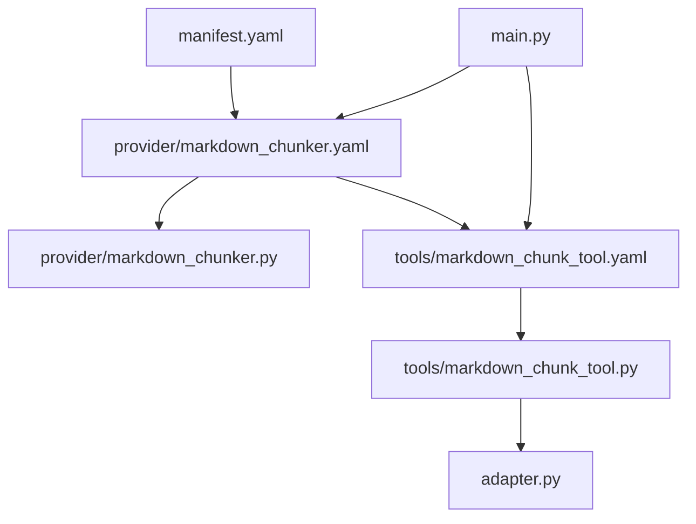
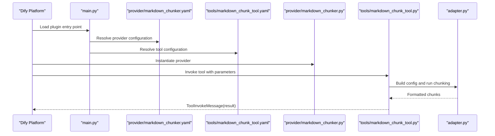
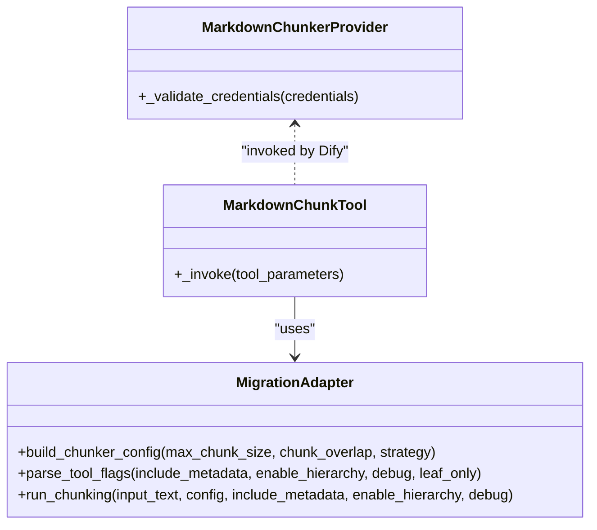
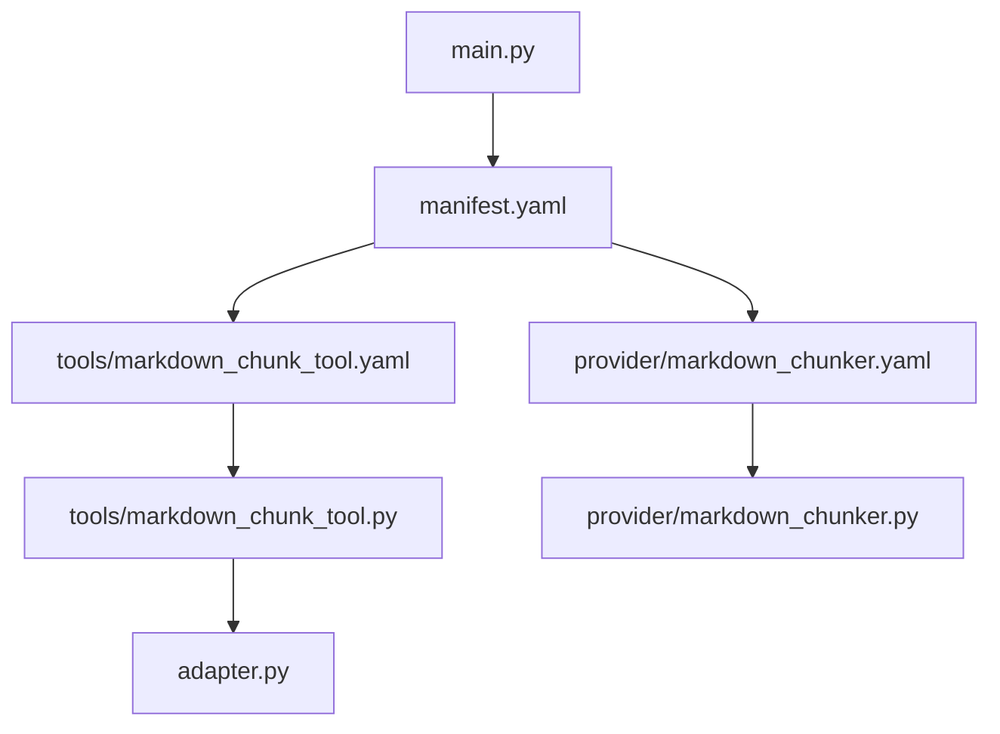
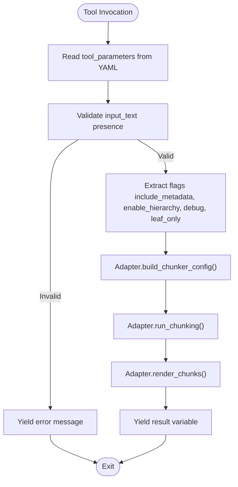

# Configuration Files

<cite>
**Referenced Files in This Document**
- [manifest.yaml](file://manifest.yaml)
- [provider/markdown_chunker.yaml](file://provider/markdown_chunker.yaml)
- [tools/markdown_chunk_tool.yaml](file://tools/markdown_chunk_tool.yaml)
- [main.py](file://main.py)
- [provider/markdown_chunker.py](file://provider/markdown_chunker.py)
- [tools/markdown_chunk_tool.py](file://tools/markdown_chunk_tool.py)
- [adapter.py](file://adapter.py)
- [tests/test_manifest.py](file://tests/test_manifest.py)
- [tests/test_provider_yaml.py](file://tests/test_provider_yaml.py)
- [tests/test_tool_yaml.py](file://tests/test_tool_yaml.py)
- [docs/reference/output-format.md](file://docs/reference/output-format.md)
</cite>

## Table of Contents
1. [Introduction](#introduction)
2. [Project Structure](#project-structure)
3. [Core Components](#core-components)
4. [Architecture Overview](#architecture-overview)
5. [Detailed Component Analysis](#detailed-component-analysis)
6. [Dependency Analysis](#dependency-analysis)
7. [Performance Considerations](#performance-considerations)
8. [Troubleshooting Guide](#troubleshooting-guide)
9. [Conclusion](#conclusion)
10. [Appendices](#appendices)

## Introduction
This document explains the configuration files that define the Dify plugin and tool for advanced Markdown chunking. It focuses on:
- The plugin manifest and provider configuration
- The tool definition and its parameters, labels, descriptions, and output schema
- How YAML configuration maps to the Python implementation
- Multi-language support across English, Chinese, and Russian
- Guidance for extending configurations and maintaining backward compatibility

## Project Structure
The configuration files are organized under dedicated directories:
- Plugin manifest and provider: manifest.yaml and provider/markdown_chunker.yaml
- Tool definition and implementation: tools/markdown_chunk_tool.yaml and tools/markdown_chunk_tool.py
- Plugin entry point: main.py
- Provider class: provider/markdown_chunker.py
- Adapter bridging to chunkana: adapter.py

**Diagram sources**
- [manifest.yaml](file://manifest.yaml#L1-L49)
- [provider/markdown_chunker.yaml](file://provider/markdown_chunker.yaml#L1-L23)
- [tools/markdown_chunk_tool.yaml](file://tools/markdown_chunk_tool.yaml#L1-L178)
- [main.py](file://main.py#L1-L38)
- [provider/markdown_chunker.py](file://provider/markdown_chunker.py#L1-L36)
- [tools/markdown_chunk_tool.py](file://tools/markdown_chunk_tool.py#L1-L126)
- [adapter.py](file://adapter.py#L1-L352)

**Section sources**
- [manifest.yaml](file://manifest.yaml#L1-L49)
- [provider/markdown_chunker.yaml](file://provider/markdown_chunker.yaml#L1-L23)
- [tools/markdown_chunk_tool.yaml](file://tools/markdown_chunk_tool.yaml#L1-L178)
- [main.py](file://main.py#L1-L38)
- [provider/markdown_chunker.py](file://provider/markdown_chunker.py#L1-L36)
- [tools/markdown_chunk_tool.py](file://tools/markdown_chunk_tool.py#L1-L126)
- [adapter.py](file://adapter.py#L1-L352)

## Core Components
- Plugin manifest (manifest.yaml): Declares plugin metadata, icon, resource limits, permissions, and tool references.
- Provider YAML (provider/markdown_chunker.yaml): Defines provider identity, localized labels/descriptions, tags, tool references, and Python source mapping.
- Tool YAML (tools/markdown_chunk_tool.yaml): Defines tool identity, human and LLM descriptions, parameters with types, defaults, forms, labels, descriptions, options, output schema, and Python source mapping.
- Plugin entry point (main.py): Initializes the Dify plugin runtime with a request timeout.
- Provider class (provider/markdown_chunker.py): Implements ToolProvider for the plugin.
- Tool class (tools/markdown_chunk_tool.py): Implements Tool invocation and delegates chunking to the adapter.
- Adapter (adapter.py): Bridges the tool’s parameters to chunkana, handles validation, rendering, and output filtering.

**Section sources**
- [manifest.yaml](file://manifest.yaml#L1-L49)
- [provider/markdown_chunker.yaml](file://provider/markdown_chunker.yaml#L1-L23)
- [tools/markdown_chunk_tool.yaml](file://tools/markdown_chunk_tool.yaml#L1-L178)
- [main.py](file://main.py#L1-L38)
- [provider/markdown_chunker.py](file://provider/markdown_chunker.py#L1-L36)
- [tools/markdown_chunk_tool.py](file://tools/markdown_chunk_tool.py#L1-L126)
- [adapter.py](file://adapter.py#L1-L352)

## Architecture Overview
The Dify plugin integrates a provider and a tool. The provider YAML references the tool YAML, and both YAML files point to their Python implementations. The tool’s Python class invokes the adapter, which uses chunkana to produce chunks and formats them according to configuration.

**Diagram sources**
- [main.py](file://main.py#L1-L38)
- [provider/markdown_chunker.yaml](file://provider/markdown_chunker.yaml#L1-L23)
- [tools/markdown_chunk_tool.yaml](file://tools/markdown_chunk_tool.yaml#L1-L178)
- [provider/markdown_chunker.py](file://provider/markdown_chunker.py#L1-L36)
- [tools/markdown_chunk_tool.py](file://tools/markdown_chunk_tool.py#L1-L126)
- [adapter.py](file://adapter.py#L1-L352)

## Detailed Component Analysis

### Plugin Manifest (manifest.yaml)
Purpose:
- Declares plugin metadata, icon, privacy policy, resource limits, permissions, tool references, and runtime metadata.
- Specifies the plugin type, author, name, and version.
- Defines minimum Dify version and supported architectures.
- References the provider YAML for tool definitions.

Key sections and roles:
- identity: author, name, label, description, icon, tags
- resource: memory limit
- permission: tool/model enabled flags
- plugins.tools: list of provider YAML paths
- meta: version, arch, runner language/version, entrypoint
- minimum_dify_version: compatibility requirement
- tags: marketplace categorization

Localization:
- Supports multi-language labels and descriptions for the plugin.

Backward compatibility:
- The manifest version and runner metadata ensure compatibility with Dify runtime expectations.

**Section sources**
- [manifest.yaml](file://manifest.yaml#L1-L49)
- [tests/test_manifest.py](file://tests/test_manifest.py#L46-L77)

### Provider YAML (provider/markdown_chunker.yaml)
Purpose:
- Defines provider identity, localized labels/descriptions, tags, tool references, and Python source mapping.

Structure and purpose:
- identity: author, name, label (en_US, zh_Hans, ru_RU), description (en_US, zh_Hans, ru_RU), icon, tags
- tools: list of tool YAML paths
- extra.python.source: provider Python implementation path

Relationship to Python:
- The extra.python.source maps to provider/markdown_chunker.py, which implements ToolProvider.

Multi-language labels:
- The identity.label and identity.description sections include entries for en_US, zh_Hans, and ru_RU.

Validation:
- Tests ensure presence of identity fields, localization completeness, tags presence, tool reference correctness, and Python source mapping.

**Section sources**
- [provider/markdown_chunker.yaml](file://provider/markdown_chunker.yaml#L1-L23)
- [provider/markdown_chunker.py](file://provider/markdown_chunker.py#L1-L36)
- [tests/test_provider_yaml.py](file://tests/test_provider_yaml.py#L1-L95)

### Tool YAML (tools/markdown_chunk_tool.yaml)
Purpose:
- Defines tool identity, human and LLM descriptions, parameters, output schema, and Python source mapping.

Structure and purpose:
- identity: name, author, label (en_US, zh_Hans, ru_RU), icon
- description.human: user-facing description
- description.llm: prompt-friendly description
- parameters: list of parameter definitions with:
  - name, type, required, default, form
  - label (en_US, zh_Hans, ru_RU)
  - human_description (en_US, zh_Hans, ru_RU)
  - llm_description
  - options for select types
- output_schema: object with result property referencing a general structure schema
- extra.python.source: tool Python implementation path

Parameters overview:
- input_text (string, required, form=llm)
- max_chunk_size (number, optional, default=4096, form=form)
- chunk_overlap (number, optional, default=200, form=form)
- strategy (select, optional, default=auto, options include auto, code_aware, list_aware, structural, fallback)
- include_metadata (boolean, optional, default=true, form=form)
- enable_hierarchy (boolean, optional, default=false, form=form)
- debug (boolean, optional, default=false, form=form)
- leaf_only (boolean, optional, default=false, form=form)

Output schema:
- result references a general structure schema for Dify compatibility.

Multi-language labels:
- All parameters and options include labels for en_US, zh_Hans, and ru_RU.

Validation:
- Tests ensure identity presence, description presence, parameter completeness, localization completeness, strategy options localization, output schema reference, and Python source mapping.

**Section sources**
- [tools/markdown_chunk_tool.yaml](file://tools/markdown_chunk_tool.yaml#L1-L178)
- [tools/markdown_chunk_tool.py](file://tools/markdown_chunk_tool.py#L1-L126)
- [tests/test_tool_yaml.py](file://tests/test_tool_yaml.py#L1-L188)
- [docs/reference/output-format.md](file://docs/reference/output-format.md#L99-L282)

### Relationship Between YAML and Python Implementation
- Provider YAML references provider/markdown_chunker.py via extra.python.source.
- Tool YAML references tools/markdown_chunk_tool.py via extra.python.source.
- The Tool class reads parameters from the YAML and delegates chunking to the adapter.
- The adapter translates parameters into chunkana configuration, validates inputs, and renders outputs according to include_metadata and hierarchy flags.

**Diagram sources**
- [provider/markdown_chunker.py](file://provider/markdown_chunker.py#L1-L36)
- [tools/markdown_chunk_tool.py](file://tools/markdown_chunk_tool.py#L1-L126)
- [adapter.py](file://adapter.py#L1-L352)

**Section sources**
- [provider/markdown_chunker.py](file://provider/markdown_chunker.py#L1-L36)
- [tools/markdown_chunk_tool.py](file://tools/markdown_chunk_tool.py#L1-L126)
- [adapter.py](file://adapter.py#L1-L352)

### Annotated Examples: Identity, Description, Parameters, and Output Schema
- Identity:
  - Provider identity includes author, name, localized label and description, icon, and tags.
  - Tool identity includes name, author, localized label, and icon.
- Description:
  - Tool description has human and llm subsections for UI and LLM prompts.
- Parameters:
  - Each parameter defines name, type, required/default, form, label, human_description, llm_description, and options for select types.
- Output schema:
  - The result property references a general structure schema for Dify compatibility.

These sections are validated by tests that assert presence and localization of labels and descriptions, parameter completeness, and output schema references.

**Section sources**
- [provider/markdown_chunker.yaml](file://provider/markdown_chunker.yaml#L1-L23)
- [tools/markdown_chunk_tool.yaml](file://tools/markdown_chunk_tool.yaml#L1-L178)
- [tests/test_provider_yaml.py](file://tests/test_provider_yaml.py#L1-L95)
- [tests/test_tool_yaml.py](file://tests/test_tool_yaml.py#L1-L188)

### Multi-Language Labels (en_US, zh_Hans, ru_RU)
- Both provider and tool YAML include label and description entries for en_US, zh_Hans, and ru_RU.
- Tests enforce that these locales are present and non-empty for identities, parameters, and strategy options.
- The Dify marketplace guidance emphasizes English as the primary UI language and encourages multi-language support.

**Section sources**
- [provider/markdown_chunker.yaml](file://provider/markdown_chunker.yaml#L1-L23)
- [tools/markdown_chunk_tool.yaml](file://tools/markdown_chunk_tool.yaml#L1-L178)
- [tests/test_provider_yaml.py](file://tests/test_provider_yaml.py#L1-L95)
- [tests/test_tool_yaml.py](file://tests/test_tool_yaml.py#L1-L188)

### Extending Configuration Files for Custom Deployments
Guidance derived from repository structure and tests:
- Add new parameters to tools/markdown_chunk_tool.yaml with appropriate types, defaults, forms, labels, and descriptions.
- Update provider/markdown_chunker.yaml to include new tool references in the tools list if applicable.
- Ensure extra.python.source in YAML matches the actual Python implementation path.
- Maintain backward compatibility by keeping existing parameters and defaults unchanged, and by adding new optional parameters with sensible defaults.
- Preserve multi-language completeness for new fields and options.

Evidence from tests:
- Provider YAML tests validate identity completeness, localization, tags presence, tool reference, and Python source mapping.
- Tool YAML tests validate identity presence, description presence, parameter completeness, localization, strategy options localization, output schema reference, and Python source mapping.

**Section sources**
- [tests/test_provider_yaml.py](file://tests/test_provider_yaml.py#L1-L95)
- [tests/test_tool_yaml.py](file://tests/test_tool_yaml.py#L1-L188)

## Dependency Analysis
The configuration files define static contracts that the Python runtime consumes. The adapter encapsulates the chunkana integration and output formatting logic, while the tool class orchestrates parameter extraction and message emission.

**Diagram sources**
- [tools/markdown_chunk_tool.yaml](file://tools/markdown_chunk_tool.yaml#L1-L178)
- [tools/markdown_chunk_tool.py](file://tools/markdown_chunk_tool.py#L1-L126)
- [adapter.py](file://adapter.py#L1-L352)
- [provider/markdown_chunker.yaml](file://provider/markdown_chunker.yaml#L1-L23)
- [provider/markdown_chunker.py](file://provider/markdown_chunker.py#L1-L36)
- [manifest.yaml](file://manifest.yaml#L1-L49)
- [main.py](file://main.py#L1-L38)

**Section sources**
- [tools/markdown_chunk_tool.yaml](file://tools/markdown_chunk_tool.yaml#L1-L178)
- [tools/markdown_chunk_tool.py](file://tools/markdown_chunk_tool.py#L1-L126)
- [adapter.py](file://adapter.py#L1-L352)
- [provider/markdown_chunker.yaml](file://provider/markdown_chunker.yaml#L1-L23)
- [provider/markdown_chunker.py](file://provider/markdown_chunker.py#L1-L36)
- [manifest.yaml](file://manifest.yaml#L1-L49)
- [main.py](file://main.py#L1-L38)

## Performance Considerations
- The plugin entry point sets a generous request timeout suitable for large documents.
- The adapter separates chunking from rendering to ensure boundary invariance and efficient output formatting.
- Output filtering allows returning only leaf chunks in hierarchical mode for vector database indexing.

[No sources needed since this section provides general guidance]

## Troubleshooting Guide
Common issues and checks:
- Missing or empty localized labels/descriptions: Verify en_US, zh_Hans, and ru_RU entries in identity and parameter sections.
- Incorrect tool or provider references: Ensure tools list and extra.python.source paths match actual files.
- Parameter completeness: Confirm required parameters exist and have correct types, defaults, and forms.
- Output schema mismatch: Ensure result property references the general structure schema.
- Runtime errors: The tool yields informative messages for validation and runtime errors.

**Section sources**
- [tests/test_provider_yaml.py](file://tests/test_provider_yaml.py#L1-L95)
- [tests/test_tool_yaml.py](file://tests/test_tool_yaml.py#L1-L188)
- [tools/markdown_chunk_tool.py](file://tools/markdown_chunk_tool.py#L1-L126)

## Conclusion
The configuration files define a robust, localized, and compatible Dify plugin. The YAML manifests declare identities, parameters, and outputs, while the Python classes implement provider and tool logic with an adapter for chunkana integration. Multi-language support and strict validation tests ensure a consistent user experience across locales. Extensions should preserve backward compatibility and maintain localization completeness.

[No sources needed since this section summarizes without analyzing specific files]

## Appendices

### Appendix A: Parameter Flow from YAML to Python

**Diagram sources**
- [tools/markdown_chunk_tool.py](file://tools/markdown_chunk_tool.py#L1-L126)
- [adapter.py](file://adapter.py#L1-L352)