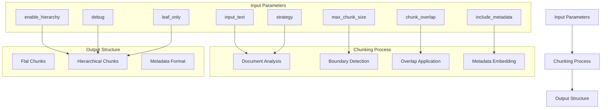

# Configuration Parameters

<cite>
**Referenced Files in This Document**   
- [markdown_chunk_tool.yaml](file://tools/markdown_chunk_tool.yaml)
- [markdown_chunk_tool.py](file://tools/markdown_chunk_tool.py)
- [adapter.py](file://adapter.py)
- [output_filter.py](file://output_filter.py)
- [configuration.md](file://docs/reference/configuration.md)
- [troubleshooting.md](file://docs/guides/troubleshooting.md)
</cite>

## Table of Contents
1. [Introduction](#introduction)
2. [Parameter Overview](#parameter-overview)
3. [Detailed Parameter Analysis](#detailed-parameter-analysis)
4. [Form-Based vs LLM-Visible Parameters](#form-based-vs-llm-visible-parameters)
5. [Configuration Patterns and Best Practices](#configuration-patterns-and-best-practices)
6. [Common Pitfalls and Troubleshooting](#common-pitfalls-and-troubleshooting)
7. [Conclusion](#conclusion)

## Introduction

The dify-markdown-chunker-1 plugin provides a comprehensive configuration system for controlling how Markdown documents are processed and chunked for retrieval-augmented generation (RAG) systems. This document details each configuration parameter, including their types, default values, valid ranges, and functional impact on the chunking behavior. The parameters are designed to balance ease of use through the Dify plugin interface while providing advanced control over document processing, structure preservation, and metadata handling.

The configuration system supports two distinct parameter categories: form-based parameters that appear in the Dify UI for user configuration, and LLM-visible parameters that are directly accessible to the language model. This separation allows for both user-friendly configuration and direct programmatic control over the chunking process.

**Section sources**
- [markdown_chunk_tool.yaml](file://tools/markdown_chunk_tool.yaml#L23-L168)

## Parameter Overview

The dify-markdown-chunker-1 plugin exposes eight primary configuration parameters that control various aspects of the chunking process. These parameters can be categorized into three groups: input specification, chunking behavior control, and output formatting.

The parameters include:
- **input_text**: The Markdown content to be processed (required)
- **max_chunk_size**: Controls the maximum size of generated chunks
- **chunk_overlap**: Determines the amount of text overlap between consecutive chunks
- **strategy**: Selects the algorithm used for chunking
- **include_metadata**: Controls whether metadata is embedded in chunk text
- **enable_hierarchy**: Enables hierarchical relationships between chunks
- **debug**: Activates debug mode for comprehensive output
- **leaf_only**: Filters output to include only leaf chunks in hierarchical mode

These parameters work together to determine how documents are segmented, what contextual information is preserved, and how the output is structured for downstream applications like vector database indexing or search systems.



**Diagram sources**
- [markdown_chunk_tool.yaml](file://tools/markdown_chunk_tool.yaml#L23-L168)
- [adapter.py](file://adapter.py#L71-L352)

## Detailed Parameter Analysis

### input_text

The `input_text` parameter specifies the Markdown content to be processed by the chunker. This is the only required parameter and serves as the primary input for the entire chunking process.

**Parameter Details:**
- **Type**: string
- **Required**: true
- **Form visibility**: LLM (not shown in form)
- **Default value**: None (required parameter)
- **Functional impact**: This parameter contains the complete Markdown document that will be analyzed, segmented, and transformed according to the other configuration parameters. The quality and structure of this input directly affect the effectiveness of the chunking process.

When the chunker processes the input text, it first performs structural analysis to identify elements like headers, code blocks, lists, and tables. This analysis informs the chunking strategy selection and boundary determination. The input text is preserved in its entirety through the processing pipeline, with chunks representing contiguous segments of the original content.

**Section sources**
- [markdown_chunk_tool.yaml](file://tools/markdown_chunk_tool.yaml#L23-L37)

### max_chunk_size

The `max_chunk_size` parameter controls the maximum size of each generated chunk in characters. This parameter is crucial for ensuring compatibility with downstream systems that have token or character limits, such as LLM context windows.

**Parameter Details:**
- **Type**: number
- **Required**: false
- **Form visibility**: form
- **Default value**: 4096
- **Valid range**: 512-16384 characters
- **Functional impact**: This parameter sets an upper limit on chunk size, but the actual chunk sizes may be smaller depending on document structure and the selected strategy. The chunker respects natural boundaries like section headers, code blocks, and list items, often creating chunks smaller than the maximum size to preserve semantic coherence.

Larger values create fewer, more comprehensive chunks with greater context, which can improve retrieval quality but may exceed system limits. Smaller values create more granular chunks that fit better within context windows but may lack sufficient context for accurate understanding.

**Section sources**
- [markdown_chunk_tool.yaml](file://tools/markdown_chunk_tool.yaml#L38-L52)
- [troubleshooting.md](file://docs/guides/troubleshooting.md#L56)

### chunk_overlap

The `chunk_overlap` parameter determines the number of characters that overlap between consecutive chunks. This overlap helps preserve context across chunk boundaries, improving the coherence of retrieved information.

**Parameter Details:**
- **Type**: number
- **Required**: false
- **Form visibility**: form
- **Default value**: 200
- **Valid range**: 0 to 35% of max_chunk_size
- **Functional impact**: The behavior of overlap depends on the `include_metadata` setting:
  - When `include_metadata=true`: Overlap content is stored in metadata fields (previous_content/next_content)
  - When `include_metadata=false`: Overlap is embedded directly into the chunk text as previous_content + main + next_content

The plugin automatically caps the overlap at 35% of the chunk size to prevent excessive duplication. A value of 0 disables overlap entirely. The overlap helps maintain context when chunks are processed independently, reducing the risk of information fragmentation.

**Section sources**
- [markdown_chunk_tool.yaml](file://tools/markdown_chunk_tool.yaml#L53-L67)
- [adapter.py](file://adapter.py#L243-L296)
- [troubleshooting.md](file://docs/guides/troubleshooting.md#L57)

### strategy

The `strategy` parameter selects the algorithm used for chunking the document, with different strategies optimized for various document types and structures.

**Parameter Details:**
- **Type**: select
- **Required**: false
- **Form visibility**: form
- **Default value**: auto
- **Valid options**: auto, code_aware, list_aware, structural, fallback
- **Functional impact**: The strategy determines how the document is segmented:
  - **auto**: Automatically detects the best strategy based on content analysis (code ratio, structure complexity)
  - **code_aware**: Preserves code blocks and their context, ideal for technical documentation
  - **list_aware**: Preserves list hierarchy and item relationships
  - **structural**: Header-based chunking that follows document outline
  - **fallback**: Simple splitting without structural awareness

The auto strategy analyzes the document to determine the optimal approach, making it suitable for diverse content. Specialized strategies provide better results for documents with specific characteristics, such as code-heavy files or list-intensive documentation.

**Section sources**
- [markdown_chunk_tool.yaml](file://tools/markdown_chunk_tool.yaml#L68-L108)

### include_metadata

The `include_metadata` parameter controls whether metadata is embedded in the chunk text, providing additional context and structural information.

**Parameter Details:**
- **Type**: boolean
- **Required**: false
- **Form visibility**: form
- **Default value**: true
- **Functional impact**: 
  - When enabled: Chunks include a `<metadata>` block containing fields like content_type, header_path, line numbers, and overlap context
  - When disabled: No metadata block; overlap is embedded directly into the chunk text as previous_content + main + next_content

Metadata enhances retrieval by providing structural context and navigation information, making it easier to understand a chunk's position within the original document. Disabling metadata creates cleaner text output but removes valuable contextual information that can improve search relevance.

**Section sources**
- [markdown_chunk_tool.yaml](file://tools/markdown_chunk_tool.yaml#L109-L123)
- [adapter.py](file://adapter.py#L209-L233)

### enable_hierarchy

The `enable_hierarchy` parameter creates parent-child relationships between chunks, establishing a navigable structure that reflects the document's organization.

**Parameter Details:**
- **Type**: boolean
- **Required**: false
- **Form visibility**: form
- **Default value**: false
- **Functional impact**: When enabled, the chunker returns a hierarchical structure with navigation metadata including:
  - parent_id: Reference to parent chunk
  - children_ids: List of child chunk identifiers
  - sibling_ids: References to sibling chunks
  - level: Depth in the hierarchy
  - header_path: Full path of headers to this chunk

This hierarchical structure enables multi-level retrieval and context navigation, allowing systems to access both detailed content and broader context. It's particularly valuable for complex documents with deep sectioning, enabling more sophisticated information retrieval patterns.

**Section sources**
- [markdown_chunk_tool.yaml](file://tools/markdown_chunk_tool.yaml#L124-L138)
- [adapter.py](file://adapter.py#L171-L191)

### debug

The `debug` parameter enables debug mode, which modifies the output to include comprehensive information for troubleshooting and analysis.

**Parameter Details:**
- **Type**: boolean
- **Required**: false
- **Form visibility**: form
- **Default value**: false
- **Functional impact**: When enabled with `enable_hierarchy=true`, the chunker includes all chunks in the hierarchy:
  - Root chunks (document-level)
  - Intermediate chunks (section-level)
  - Leaf chunks (content-level)

By default, only leaf chunks are returned. The debug mode is essential for understanding the chunking process, verifying hierarchy construction, and diagnosing issues with document segmentation. Future versions will extend this mode to control metadata field filtering and expose additional debug information.

**Section sources**
- [markdown_chunk_tool.yaml](file://tools/markdown_chunk_tool.yaml#L139-L153)
- [adapter.py](file://adapter.py#L174-L177)

### leaf_only

The `leaf_only` parameter controls whether only leaf chunks are returned in hierarchical mode, filtering out structural nodes.

**Parameter Details:**
- **Type**: boolean
- **Required**: false
- **Form visibility**: form
- **Default value**: false
- **Functional impact**: When enabled, the chunker excludes internal nodes (sections with children) from the output, returning only content-bearing leaf chunks. This is recommended for vector database indexing where the focus is on content chunks rather than structural headers.

The parameter works in conjunction with `enable_hierarchy` and `debug`:
- When `enable_hierarchy=false`: `leaf_only` has no effect
- When `enable_hierarchy=true` and `debug=false`: `leaf_only` filters the output
- When `debug=true`: All chunks are returned regardless of `leaf_only`

This parameter helps optimize storage and retrieval by eliminating structural nodes that may not be relevant for content search.

**Section sources**
- [markdown_chunk_tool.yaml](file://tools/markdown_chunk_tool.yaml#L154-L167)
- [output_filter.py](file://output_filter.py#L55-L58)

## Form-Based vs LLM-Visible Parameters

The dify-markdown-chunker-1 plugin distinguishes between two types of parameters based on their visibility and intended audience:

### Form-Based Parameters

Form-based parameters appear in the Dify plugin interface and are designed for user configuration through a graphical interface. These parameters are typically optional with sensible defaults and include:

- max_chunk_size
- chunk_overlap  
- strategy
- include_metadata
- enable_hierarchy
- debug
- leaf_only

These parameters are marked with `form: form` in the configuration and are intended for users who want to customize the chunking behavior without needing to understand the underlying implementation details.

### LLM-Visible Parameters

LLM-visible parameters are directly accessible to the language model and are typically required inputs for the tool. The only LLM-visible parameter is:

- input_text

Marked with `form: llm` in the configuration, this parameter is passed directly to the tool when invoked by the LLM. It represents the primary content to be processed and is essential for the chunking operation.

This distinction allows for a clean separation between user-configurable settings and required inputs, enabling both flexible configuration and reliable programmatic use.

**Section sources**
- [markdown_chunk_tool.yaml](file://tools/markdown_chunk_tool.yaml#L27-L28)
- [markdown_chunk_tool.yaml](file://tools/markdown_chunk_tool.yaml#L42-L43)

## Configuration Patterns and Best Practices

### Use Case-Based Configuration

Different use cases require different parameter configurations to optimize performance and effectiveness.

#### RAG Systems
For retrieval-augmented generation systems, use:
```yaml
max_chunk_size: 2048
chunk_overlap: 100
strategy: auto
include_metadata: true
```

This configuration balances context preservation with manageable chunk sizes, while metadata enhances retrieval relevance.

#### Search Indexing
For search systems, prioritize content discoverability:
```yaml
max_chunk_size: 4096
chunk_overlap: 200
strategy: structural
include_metadata: true
enable_hierarchy: true
leaf_only: true
```

The hierarchical structure with leaf-only filtering ensures that search results focus on substantive content while maintaining navigational context.

#### Code Documentation
For technical documentation with code examples:
```yaml
max_chunk_size: 6144
chunk_overlap: 200
strategy: code_aware
include_metadata: true
```

Larger chunks accommodate code blocks, while the code-aware strategy preserves the relationship between code and explanatory text.

### Parameter Interactions

Understanding how parameters interact is crucial for effective configuration:

- **max_chunk_size and chunk_overlap**: The overlap is automatically capped at 35% of the chunk size to prevent excessive duplication
- **enable_hierarchy and debug**: Debug mode overrides leaf_only to show all chunk types
- **include_metadata and chunk_overlap**: With metadata enabled, overlap is stored in metadata fields; without metadata, it's embedded in the text
- **strategy and document type**: Auto strategy works well for mixed content, while specialized strategies excel with homogeneous documents

### Optimization Guidelines

1. **Start with defaults**: The default values work well for most general-purpose use cases
2. **Adjust chunk size based on LLM context**: Ensure chunks fit comfortably within your target model's context window
3. **Use appropriate overlap**: 5-10% of chunk size typically provides sufficient context without excessive duplication
4. **Enable hierarchy for complex documents**: Use enable_hierarchy with leaf_only for vector database indexing
5. **Leverage auto strategy**: Let the system determine the best approach based on content analysis

**Section sources**
- [configuration.md](file://docs/reference/configuration.md#L47-L98)
- [configuration.md](file://docs/reference/configuration.md#L62-L73)

## Common Pitfalls and Troubleshooting

### Invalid Parameter Combinations

Certain parameter combinations can lead to suboptimal results or errors:

**Issue**: Overlap too large for chunk size
```yaml
# ❌ Invalid configuration
max_chunk_size: 1000
chunk_overlap: 500  # Exceeds 35% cap (350 max)
```

**Solution**: Keep overlap below 35% of chunk size:
```yaml
# ✅ Valid configuration  
max_chunk_size: 2048
chunk_overlap: 200  # ~10% of chunk size
```

**Issue**: Conflicting hierarchy settings
```yaml
# Potentially confusing
enable_hierarchy: true
debug: true
leaf_only: true  # debug overrides leaf_only
```

**Solution**: Understand the precedence: debug mode shows all chunks regardless of leaf_only setting.

### Performance Considerations

- **Large chunk sizes**: May exceed LLM context limits and reduce retrieval precision
- **Excessive overlap**: Increases storage requirements and processing time
- **Hierarchy with debug**: Returns all chunks, significantly increasing output size
- **Auto strategy**: Performs content analysis, adding minimal overhead

### Troubleshooting Steps

1. **Verify parameter ranges**: Ensure values fall within valid ranges
2. **Check hierarchy settings**: Understand how enable_hierarchy, debug, and leaf_only interact
3. **Validate metadata usage**: Confirm include_metadata setting matches your retrieval needs
4. **Test with sample content**: Use representative documents to evaluate configuration effectiveness
5. **Monitor output size**: Ensure chunks are appropriate for your downstream systems

**Section sources**
- [troubleshooting.md](file://docs/guides/troubleshooting.md#L52-L69)
- [configuration.md](file://docs/reference/configuration.md#L407-L412)

## Conclusion

The dify-markdown-chunker-1 plugin offers a sophisticated configuration system that balances ease of use with powerful control over document chunking. By understanding the eight core parameters—input_text, max_chunk_size, chunk_overlap, strategy, include_metadata, enable_hierarchy, debug, and leaf_only—users can optimize the chunking process for their specific use cases.

The parameters work together to control document segmentation, context preservation, and output structure, with careful consideration given to the interactions between settings. The distinction between form-based and LLM-visible parameters provides a clean separation between user configuration and programmatic use.

For optimal results, start with the default configuration and adjust parameters based on specific requirements, considering factors like document type, downstream system constraints, and retrieval goals. The comprehensive parameter system enables everything from simple text splitting to sophisticated hierarchical chunking with rich metadata, making the plugin adaptable to a wide range of document processing needs.