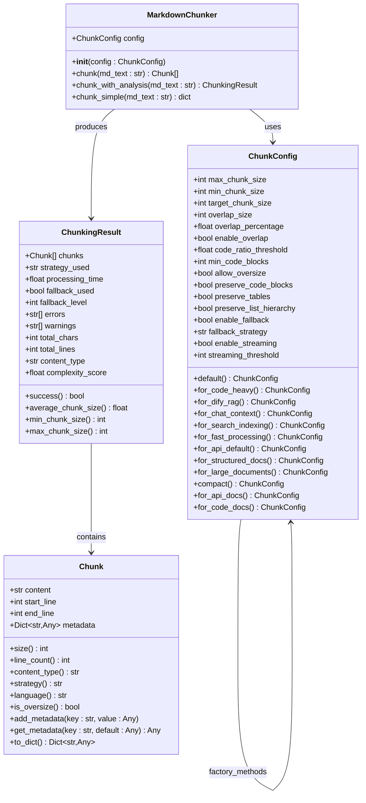
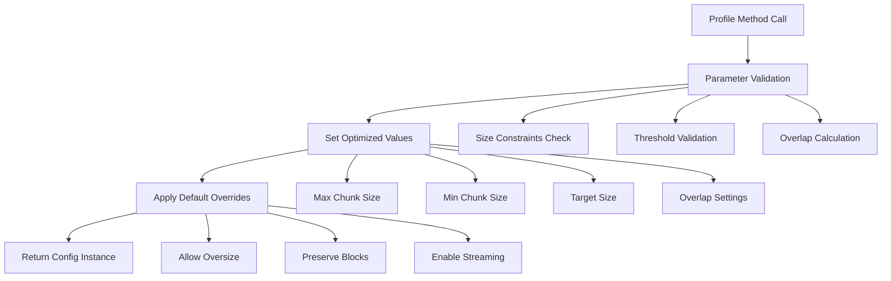
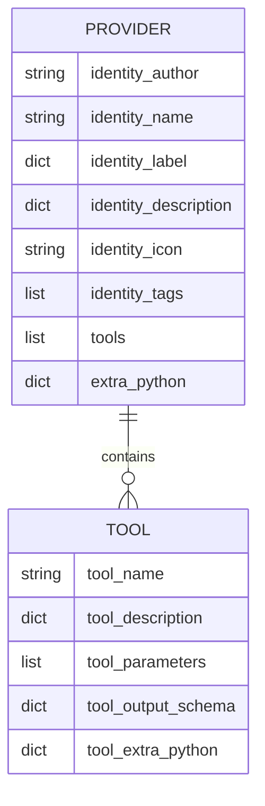

# Configuration Profiles

<cite>
**Referenced Files in This Document**
- [markdown_chunker.yaml](file://provider/markdown_chunker.yaml)
- [types.py](file://markdown_chunker/chunker/types.py)
- [dify_integration.py](file://examples/dify_integration.py)
- [rag_integration.py](file://examples/rag_integration.py)
- [api_usage.py](file://examples/api_usage.py)
- [test_config_profiles.py](file://tests/chunker/test_config_profiles.py)
- [technical_spec.md](file://tests/fixtures/real_documents/technical_spec.md)
- [markdown_chunk_tool.yaml](file://tools/markdown_chunk_tool.yaml)
</cite>

## Table of Contents
1. [Introduction](#introduction)
2. [Profile Architecture Overview](#profile-architecture-overview)
3. [Predefined Configuration Profiles](#predefined-configuration-profiles)
4. [Profile Implementation Details](#profile-implementation-details)
5. [YAML Configuration Files](#yaml-configuration-files)
6. [Programmatic Profile Usage](#programmatic-profile-usage)
7. [Custom Profile Creation](#custom-profile-creation)
8. [Best Practices](#best-practices)
9. [Real-World Usage Examples](#real-world-usage-examples)
10. [Troubleshooting](#troubleshooting)

## Introduction

Configuration profiles in the Markdown Chunker system provide pre-defined, optimized settings for specific document types and use cases. These profiles encapsulate optimal chunking parameters for different scenarios, from technical documentation to RAG (Retrieval-Augmented Generation) applications, ensuring consistent and high-quality results across various content domains.

The profile system serves as a factory method pattern implementation within the `ChunkConfig` class, offering developers quick access to proven configurations without requiring deep understanding of chunking parameters. Each profile is carefully tuned for specific content characteristics and application requirements.

## Profile Architecture Overview

The configuration profile system is built around the `ChunkConfig` class and implements a comprehensive factory method pattern. The architecture consists of several key components:



**Diagram sources**
- [types.py](file://markdown_chunker/chunker/types.py#L498-L1061)

**Section sources**
- [types.py](file://markdown_chunker/chunker/types.py#L498-L1061)

## Predefined Configuration Profiles

The system provides eight primary configuration profiles, each optimized for specific use cases and content types:

### 1. Default Profile (`ChunkConfig.default()`)

The baseline configuration for general-purpose document processing with balanced settings suitable for most markdown documents.

**Key Characteristics:**
- `max_chunk_size`: 4096 characters
- `min_chunk_size`: 512 characters  
- `target_chunk_size`: 2048 characters
- `overlap_size`: 200 characters
- `enable_overlap`: True
- `allow_oversize`: True

### 2. Code-Heavy Profile (`ChunkConfig.for_code_heavy()`)

Optimized for technical documentation containing extensive code examples and programming content.

**Key Characteristics:**
- `max_chunk_size`: 6144 characters (larger for complete code blocks)
- `target_chunk_size`: 3072 characters
- `code_ratio_threshold`: 0.5 (more aggressive code detection)
- `min_code_blocks`: 2
- `overlap_size`: 300 characters
- `preserve_code_blocks`: True

### 3. RAG Profile (`ChunkConfig.for_dify_rag()`)

Tailored specifically for Retrieval-Augmented Generation systems, particularly optimized for Dify RAG applications.

**Key Characteristics:**
- `max_chunk_size`: 3072 characters
- `min_chunk_size`: 256 characters
- `target_chunk_size`: 1536 characters
- `overlap_size`: 150 characters
- `enable_overlap`: True
- `preserve_code_blocks`: True
- `preserve_list_hierarchy`: True
- `allow_oversize`: False

### 4. Chat Context Profile (`ChunkConfig.for_chat_context()`)

Designed for LLM chat contexts and conversational AI applications.

**Key Characteristics:**
- `max_chunk_size`: 1536 characters
- `min_chunk_size`: 200 characters
- `overlap_size`: 200 characters
- `enable_overlap`: True
- `code_ratio_threshold`: 0.5
- `list_count_threshold`: 4
- `table_count_threshold`: 2

### 5. Search Indexing Profile (`ChunkConfig.for_search_indexing()`)

Optimized for search engine indexing and semantic search applications.

**Key Characteristics:**
- `max_chunk_size`: 1024 characters
- `min_chunk_size`: 100 characters
- `overlap_size`: 100 characters
- `enable_overlap`: True
- `code_ratio_threshold`: 0.4
- `list_count_threshold`: 6
- `table_count_threshold`: 3
- `preserve_list_hierarchy`: True

### 6. Fast Processing Profile (`ChunkConfig.for_fast_processing()`)

Maximizes throughput for batch processing scenarios where speed is prioritized over chunk quality.

**Key Characteristics:**
- `max_chunk_size`: 8192 characters
- `min_chunk_size`: 1024 characters
- `target_chunk_size`: 4096 characters
- `overlap_size`: 100 characters
- `enable_overlap`: False
- `allow_oversize`: True
- `enable_streaming`: True

### 7. Structured Documents Profile (`ChunkConfig.for_structured_docs()`)

Optimized for well-organized documentation with clear hierarchical structure.

**Key Characteristics:**
- `max_chunk_size`: 3072 characters
- `target_chunk_size`: 1536 characters
- `header_count_threshold`: 2 (aggressive structural detection)
- `preserve_list_hierarchy`: True
- `overlap_size`: 150 characters

### 8. Large Documents Profile (`ChunkConfig.for_large_documents()`)

Designed for processing large documents exceeding 10MB with memory-efficient streaming.

**Key Characteristics:**
- `max_chunk_size`: 8192 characters
- `target_chunk_size`: 4096 characters
- `enable_streaming`: True
- `overlap_size`: 400 characters
- `overlap_percentage`: 0.05 (smaller percentage)

**Section sources**
- [types.py](file://markdown_chunker/chunker/types.py#L667-L1061)
- [test_config_profiles.py](file://tests/chunker/test_config_profiles.py#L1-L69)

## Profile Implementation Details

Each profile is implemented as a class method within the `ChunkConfig` class, utilizing the factory pattern to create optimized configurations. The implementation follows a consistent pattern across all profiles:



**Diagram sources**
- [types.py](file://markdown_chunker/chunker/types.py#L667-L1061)

### Profile Parameter Tuning

Each profile applies specific parameter adjustments based on the target use case:

| Profile | Max Size | Min Size | Target Size | Overlap | Purpose |
|---------|----------|----------|-------------|---------|---------|
| Default | 4096 | 512 | 2048 | 200 | General use |
| Code-Heavy | 6144 | 512 | 3072 | 300 | Technical docs |
| RAG | 3072 | 256 | 1536 | 150 | Retrieval systems |
| Chat Context | 1536 | 200 | 1536 | 200 | LLM contexts |
| Search Indexing | 1024 | 100 | 1024 | 100 | Search apps |
| Fast Processing | 8192 | 1024 | 4096 | 100 | Batch processing |
| Structured Docs | 3072 | 512 | 1536 | 150 | Hierarchical content |
| Large Documents | 8192 | 1024 | 4096 | 400 | Memory efficiency |

**Section sources**
- [types.py](file://markdown_chunker/chunker/types.py#L667-L1061)

## YAML Configuration Files

The system supports external YAML configuration files for profile management and deployment. These files define provider metadata and tool configurations that integrate with various platforms like Dify.

### Provider Configuration Structure

The provider YAML file defines the main chunker provider with metadata and tool references:



**Diagram sources**
- [markdown_chunker.yaml](file://provider/markdown_chunker.yaml#L1-L23)
- [markdown_chunk_tool.yaml](file://tools/markdown_chunk_tool.yaml#L1-L128)

### Tool Configuration Parameters

Individual tools support flexible parameter configuration through YAML:

| Parameter | Type | Default | Description |
|-----------|------|---------|-------------|
| `max_chunk_size` | number | 1000 | Maximum chunk size in characters |
| `chunk_overlap` | number | 100 | Characters to overlap between chunks |
| `strategy` | select | auto | Chunking strategy selection |
| `include_metadata` | boolean | true | Include structural metadata |

**Section sources**
- [markdown_chunker.yaml](file://provider/markdown_chunker.yaml#L1-L23)
- [markdown_chunk_tool.yaml](file://tools/markdown_chunk_tool.yaml#L1-L128)

## Programmatic Profile Usage

The Python API provides multiple approaches for loading and applying configuration profiles:

### Basic Profile Application

```python
from markdown_chunker import MarkdownChunker, ChunkConfig

# Load predefined profile
config = ChunkConfig.for_dify_rag()
chunker = MarkdownChunker(config)

# Process document
result = chunker.chunk_with_analysis(markdown_content)
```

### Dynamic Profile Selection

```python
def get_optimal_profile(content_type: str) -> ChunkConfig:
    """Select appropriate profile based on content type."""
    profiles = {
        'technical': ChunkConfig.for_code_heavy(),
        'api': ChunkConfig.for_api_docs(),
        'chat': ChunkConfig.for_chat_context(),
        'search': ChunkConfig.for_search_indexing(),
        'general': ChunkConfig.default()
    }
    return profiles.get(content_type, profiles['general'])
```

### Profile Comparison and Testing

```python
def compare_profiles(markdown_text: str):
    """Compare different profiles on the same content."""
    profiles = {
        'Default': ChunkConfig.default(),
        'Code Heavy': ChunkConfig.for_code_heavy(),
        'RAG': ChunkConfig.for_dify_rag(),
        'Fast': ChunkConfig.for_fast_processing()
    }
    
    for name, config in profiles.items():
        chunker = MarkdownChunker(config)
        result = chunker.chunk_with_analysis(markdown_text)
        
        print(f"{name}:")
        print(f"  Chunks: {result.total_chunks}")
        print(f"  Avg Size: {result.average_chunk_size:.1f}")
        print(f"  Strategy: {result.strategy_used}")
```

**Section sources**
- [dify_integration.py](file://examples/dify_integration.py#L140-L190)
- [api_usage.py](file://examples/api_usage.py#L209-L267)

## Custom Profile Creation

Developers can create custom profiles tailored to specific domain requirements or organizational standards:

### Domain-Specific Profiles

```python
@dataclass
class CustomChunkConfig(ChunkConfig):
    """Custom configuration for specific domain requirements."""
    
    @classmethod
    def for_academic_papers(cls) -> "CustomChunkConfig":
        """Optimized for academic paper processing."""
        return cls(
            max_chunk_size=2048,
            min_chunk_size=300,
            target_chunk_size=1024,
            overlap_size=150,
            enable_overlap=True,
            preserve_code_blocks=False,
            preserve_tables=True,
            preserve_list_hierarchy=True,
            code_ratio_threshold=0.2,
            list_count_threshold=3,
            table_count_threshold=2
        )
    
    @classmethod
    def for_legal_documents(cls) -> "CustomChunkConfig":
        """Optimized for legal document processing."""
        return cls(
            max_chunk_size=4096,
            min_chunk_size=1000,
            target_chunk_size=2048,
            overlap_size=300,
            enable_overlap=True,
            preserve_code_blocks=False,
            preserve_tables=True,
            preserve_list_hierarchy=True,
            code_ratio_threshold=0.1,
            list_count_threshold=5,
            table_count_threshold=3
        )
```

### Environment-Based Configuration

```python
def create_environment_profile(environment: str) -> ChunkConfig:
    """Create profile based on deployment environment."""
    if environment == 'production':
        return ChunkConfig.for_dify_rag()
    elif environment == 'development':
        return ChunkConfig.for_chat_context()
    elif environment == 'batch':
        return ChunkConfig.for_fast_processing()
    else:
        return ChunkConfig.default()
```

### Versioned Profile Management

```python
class ProfileManager:
    """Manage multiple versions of chunking profiles."""
    
    def __init__(self):
        self.profiles = {}
        self.load_profiles()
    
    def load_profiles(self):
        """Load all available profiles."""
        self.profiles = {
            'v1.0-default': ChunkConfig.default(),
            'v1.0-rag': ChunkConfig.for_dify_rag(),
            'v1.1-code': ChunkConfig.for_code_heavy(),
            'v2.0-search': ChunkConfig.for_search_indexing()
        }
    
    def get_profile(self, name: str, version: str = None) -> ChunkConfig:
        """Get specific profile version."""
        if version:
            key = f"{version}-{name}"
            return self.profiles.get(key, self.profiles[name])
        return self.profiles[name]
```

**Section sources**
- [types.py](file://markdown_chunker/chunker/types.py#L667-L1061)

## Best Practices

### Profile Selection Guidelines

1. **Content Analysis First**: Analyze your document content before selecting a profile
2. **Performance vs Quality Trade-off**: Choose between fast processing and optimal chunk quality
3. **Domain Specialization**: Select profiles optimized for your specific content type
4. **Testing and Validation**: Test profiles with representative samples

### Configuration Management

1. **Version Control**: Store custom profiles in version control systems
2. **Documentation**: Document the rationale behind custom profile choices
3. **Monitoring**: Track performance metrics across different profiles
4. **A/B Testing**: Compare profiles on production data

### Team Collaboration

1. **Standard Profiles**: Establish company-wide standard profiles
2. **Profile Registry**: Maintain a central registry of approved configurations
3. **Review Process**: Implement review process for custom profile creation
4. **Training**: Train team members on profile selection criteria

### Deployment Considerations

1. **Environment-Specific Profiles**: Use different profiles for different environments
2. **Resource Constraints**: Consider memory and processing limitations
3. **Scalability**: Design profiles for horizontal scaling requirements
4. **Monitoring**: Implement monitoring for profile performance

**Section sources**
- [technical_spec.md](file://tests/fixtures/real_documents/technical_spec.md#L278-L350)

## Real-World Usage Examples

### Dify Integration Example

The Dify integration demonstrates practical profile usage in a production RAG system:

```python
# RAG-optimized configuration for Dify
config = ChunkConfig.for_dify_rag()

# Process documents with metadata enrichment
chunker = MarkdownChunker(config)
result = chunker.chunk_with_analysis(document_content)

# Format for Dify API compatibility
dify_chunks = []
for chunk in result.chunks:
    dify_chunk = {
        "content": chunk.content,
        "metadata": {
            "source": "documentation",
            "chunk_id": f"chunk_{chunk.start_line}_{chunk.end_line}",
            "lines": f"{chunk.start_line}-{chunk.end_line}",
            "size": chunk.size,
            "type": chunk.content_type,
            "strategy": result.strategy_used
        }
    }
    dify_chunks.append(dify_chunk)
```

### RAG Pipeline Integration

```python
def prepare_for_vector_database(documents: List[Dict]) -> List[Dict]:
    """Prepare documents for vector database storage."""
    chunker = MarkdownChunker(ChunkConfig.for_dify_rag())
    
    all_chunks = []
    for doc in documents:
        doc_id = doc['id']
        content = doc['content']
        
        result = chunker.chunk_with_analysis(content)
        
        for chunk in result.chunks:
            all_chunks.append({
                'id': f"{doc_id}_chunk_{chunk.index}",
                'doc_id': doc_id,
                'text': chunk.content,
                'metadata': {
                    'doc_id': doc_id,
                    'chunk_index': chunk.index,
                    'total_chunks': len(result.chunks),
                    'lines': f"{chunk.start_line}-{chunk.end_line}",
                    'size': chunk.size,
                    'strategy': result.strategy_used,
                    'content_type': result.content_type,
                    **chunk.metadata
                }
            })
    
    return all_chunks
```

### Context Window Optimization

```python
def optimize_for_llm_context(markdown_text: str, context_window: int = 4096):
    """Optimize chunks for different LLM context windows."""
    configs = {
        "GPT-3.5 (4K)": ChunkConfig(max_chunk_size=1536),
        "GPT-4 (8K)": ChunkConfig(max_chunk_size=3072),
        "GPT-4 (32K)": ChunkConfig(max_chunk_size=6144),
    }
    
    results = {}
    for model, config in configs.items():
        chunker = MarkdownChunker(config)
        result = chunker.chunk_with_analysis(markdown_text)
        
        results[model] = {
            "max_chunk_size": config.max_chunk_size,
            "chunks_generated": len(result.chunks),
            "avg_chunk_size": result.average_chunk_size,
            "estimated_tokens": sum(chunk.size / 4 for chunk in result.chunks)
        }
    
    return results
```

**Section sources**
- [dify_integration.py](file://examples/dify_integration.py#L1-L487)
- [rag_integration.py](file://examples/rag_integration.py#L1-L432)

## Troubleshooting

### Common Profile Issues

1. **Oversized Chunks**: Reduce `max_chunk_size` or increase `code_ratio_threshold`
2. **Too Many Small Chunks**: Increase `max_chunk_size` or adjust `min_chunk_size`
3. **Poor Context Preservation**: Enable overlap or reduce `overlap_size`
4. **Performance Issues**: Use faster profiles or enable streaming

### Debugging Profile Selection

```python
def debug_profile_selection(markdown_text: str, profile_name: str):
    """Debug profile configuration and results."""
    profile_map = {
        'default': ChunkConfig.default(),
        'code_heavy': ChunkConfig.for_code_heavy(),
        'rag': ChunkConfig.for_dify_rag(),
        'chat': ChunkConfig.for_chat_context(),
        'search': ChunkConfig.for_search_indexing()
    }
    
    config = profile_map.get(profile_name, ChunkConfig.default())
    chunker = MarkdownChunker(config)
    result = chunker.chunk_with_analysis(markdown_text)
    
    print(f"Profile: {profile_name}")
    print(f"Parameters: {config.to_dict()}")
    print(f"Results: {result.get_summary()}")
    print(f"Strategy: {result.strategy_used}")
    
    return result
```

### Performance Monitoring

```python
def monitor_profile_performance(profiles: List[str], test_documents: List[str]):
    """Monitor performance across different profiles."""
    results = {}
    
    for profile_name in profiles:
        profile_results = []
        
        for doc in test_documents:
            config = getattr(ChunkConfig, f"for_{profile_name}")()
            chunker = MarkdownChunker(config)
            
            start_time = time.time()
            result = chunker.chunk_with_analysis(doc)
            end_time = time.time()
            
            profile_results.append({
                'chunks': len(result.chunks),
                'avg_size': result.average_chunk_size,
                'processing_time': end_time - start_time,
                'strategy': result.strategy_used
            })
        
        results[profile_name] = profile_results
    
    return results
```

### Validation and Testing

```python
def validate_profile_compatibility(profile_name: str, content_samples: List[str]):
    """Validate profile behavior across content samples."""
    config = getattr(ChunkConfig, f"for_{profile_name}")()
    chunker = MarkdownChunker(config)
    
    validation_results = []
    
    for i, sample in enumerate(content_samples):
        try:
            result = chunker.chunk_with_analysis(sample)
            
            # Validate chunk sizes
            for chunk in result.chunks:
                assert chunk.size <= config.max_chunk_size, f"Chunk too large in sample {i}"
                assert chunk.size >= config.min_chunk_size, f"Chunk too small in sample {i}"
            
            # Validate metadata completeness
            for chunk in result.chunks:
                assert 'content_type' in chunk.metadata, f"Missing content_type in sample {i}"
                assert 'strategy' in chunk.metadata, f"Missing strategy in sample {i}"
            
            validation_results.append({
                'sample': i,
                'success': True,
                'chunks': len(result.chunks),
                'avg_size': result.average_chunk_size
            })
            
        except Exception as e:
            validation_results.append({
                'sample': i,
                'success': False,
                'error': str(e)
            })
    
    return validation_results
```

**Section sources**
- [test_config_profiles.py](file://tests/chunker/test_config_profiles.py#L1-L69)