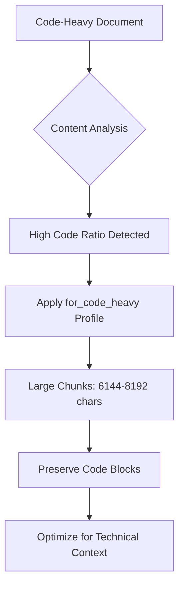
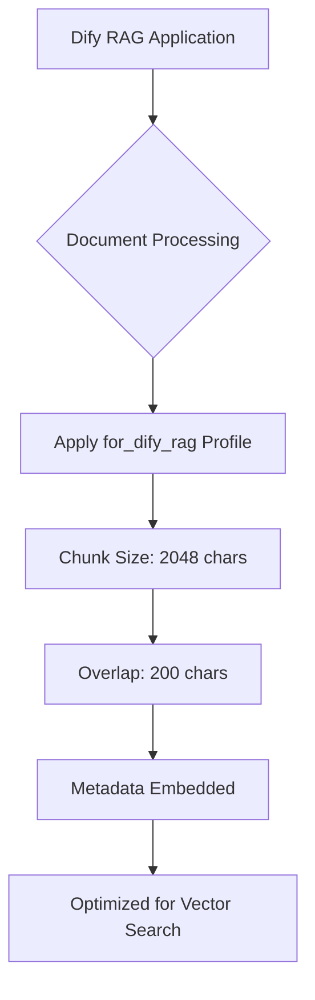
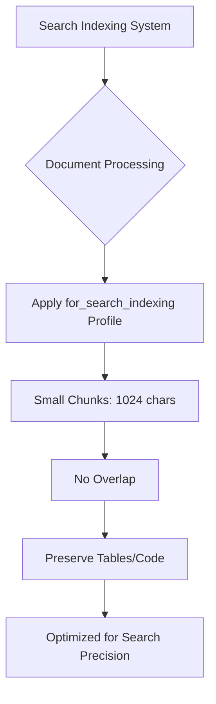
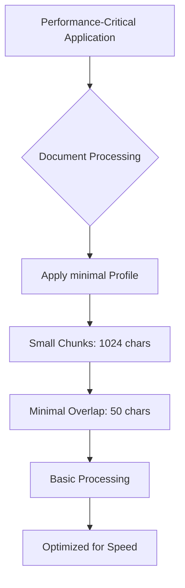
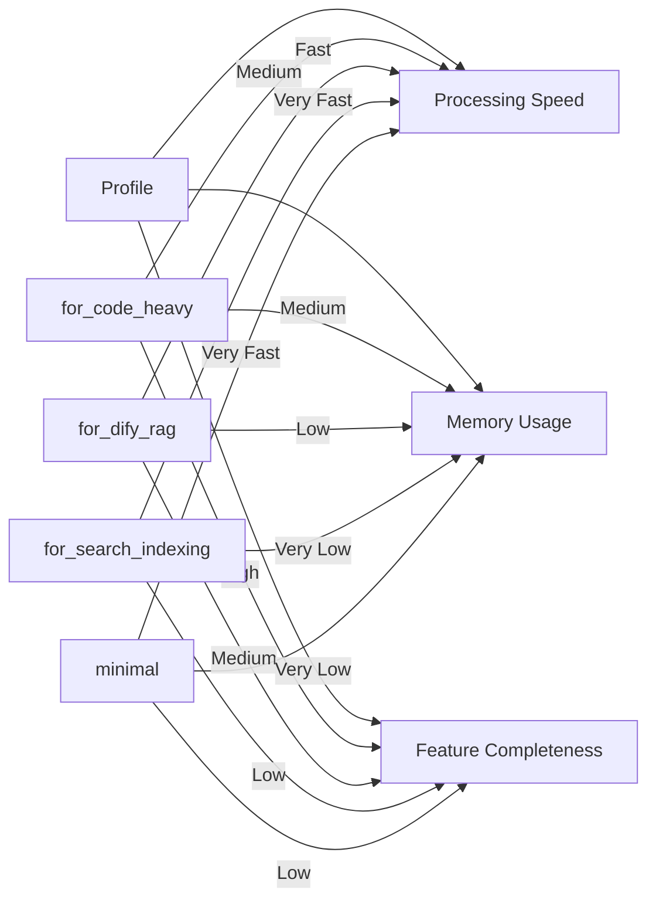

# Configuration Profiles

<cite>
**Referenced Files in This Document**   
- [configuration.md](file://docs/reference/configuration.md)
- [config.md](file://docs/api/config.md)
- [technical_spec.md](file://tests/fixtures/real_documents/technical_spec.md)
- [README.md](file://README.md)
- [adaptive-sizing-migration.md](file://docs/guides/adaptive-sizing-migration.md)
- [performance.md](file://docs/guides/performance.md)
</cite>

## Table of Contents
1. [Introduction](#introduction)
2. [Predefined Configuration Profiles](#predefined-configuration-profiles)
3. [Profile Usage Examples](#profile-usage-examples)
4. [Performance Comparison](#performance-comparison)
5. [Custom Profile Creation](#custom-profile-creation)
6. [Migration Considerations](#migration-considerations)
7. [Best Practices](#best-practices)

## Introduction

The Advanced Markdown Chunker provides configuration profiles to optimize chunking behavior for different document types and use cases. These profiles encapsulate optimal parameter combinations that address specific content characteristics such as code-heavy documentation, list-heavy changelogs, or scientific papers with mathematical formulas.

Configuration profiles are implemented through the `ChunkConfig` class, which offers predefined methods for common scenarios. These profiles simplify configuration by setting appropriate values for parameters like `max_chunk_size`, `overlap_size`, and strategy thresholds based on the expected document characteristics.

The profiles system enables users to quickly select appropriate configurations without needing to understand all the underlying parameters, while still allowing customization when needed. This approach balances ease of use with flexibility, making the chunker accessible to both beginners and advanced users.

**Section sources**
- [configuration.md](file://docs/reference/configuration.md#configuration-profiles)
- [config.md](file://docs/api/config.md#configuration-profiles)

## Predefined Configuration Profiles

The Advanced Markdown Chunker provides several predefined configuration profiles optimized for specific document types and use cases. These profiles are implemented as static methods on the `ChunkConfig` class and set optimal parameter combinations for different scenarios.

### for_code_heavy Profile

The `for_code_heavy` profile is optimized for technical documentation and code-heavy content. This profile prioritizes preserving code blocks and maintaining context around code examples.

Key characteristics:
- **Large chunk sizes**: `max_chunk_size` set to 6144-8192 characters to accommodate complete code examples
- **Low code threshold**: `code_threshold` reduced to 0.2-0.3 to trigger code-aware strategy more readily
- **Code context preservation**: Enhanced settings to keep code blocks intact and preserve surrounding context
- **Minimal overlap**: Reduced `overlap_size` to minimize redundancy while maintaining context

This profile is ideal for processing API documentation, programming language references, and technical tutorials where code examples are central to the content.


```mermaid
flowchart TD
A[Code-Heavy Document] --> B{Content Analysis}
B --> C[High Code Ratio Detected]
C --> D[Apply for_code_heavy Profile]
D --> E[Large Chunks: 6144-8192 chars]
E --> F[Preserve Code Blocks]
F --> G[Optimize for Technical Context]
```

**Diagram sources**
- [technical_spec.md](file://tests/fixtures/real_documents/technical_spec.md#322-code-heavy-profile)
- [config.md](file://docs/api/config.md#for_code_heavy)

### for_dify_rag Profile

The `for_dify_rag` profile is specifically optimized for Retrieval-Augmented Generation (RAG) applications within the Dify platform. This profile balances chunk size, overlap, and metadata to maximize retrieval quality.

Key characteristics:
- **Medium chunk sizes**: `max_chunk_size` set to 2048 characters for optimal embedding performance
- **Significant overlap**: `chunk_overlap` set to 200 characters (approximately 10% of chunk size) to preserve semantic continuity
- **Metadata embedding**: `include_metadata` enabled by default to provide additional context for embeddings
- **Automatic strategy selection**: Allows the system to choose the most appropriate strategy based on content analysis

This profile is recommended for knowledge base ingestion, document processing pipelines, and any RAG application where retrieval quality is paramount.


```mermaid
flowchart TD
A[Dify RAG Application] --> B{Document Processing}
B --> C[Apply for_dify_rag Profile]
C --> D[Chunk Size: 2048 chars]
D --> E[Overlap: 200 chars]
E --> F[Metadata Embedded]
F --> G[Optimized for Vector Search]
```

**Diagram sources**
- [technical_spec.md](file://tests/fixtures/real_documents/technical_spec.md#323-rag-profile)
- [configuration.md](file://docs/reference/configuration.md#plugin-ui-configuration)

### for_search_indexing Profile

The `for_search_indexing` profile is designed for search engine optimization and information retrieval systems. This profile creates smaller, more focused chunks that improve search precision.

Key characteristics:
- **Small chunk sizes**: `max_chunk_size` set to 1024 characters to create focused, topic-specific chunks
- **No overlap**: `chunk_overlap` disabled to avoid redundancy in search results
- **Atomic block preservation**: Settings optimized to keep tables and code blocks intact
- **Clean output**: Minimal metadata to reduce noise in search indexing

This profile is ideal for creating search indexes, document databases, and any application where precise information retrieval is more important than contextual continuity.


```mermaid
flowchart TD
A[Search Indexing System] --> B{Document Processing}
B --> C[Apply for_search_indexing Profile]
C --> D[Small Chunks: 1024 chars]
D --> E[No Overlap]
E --> F[Preserve Tables/Code]
F --> G[Optimized for Search Precision]
```

**Diagram sources**
- [technical_spec.md](file://tests/fixtures/real_documents/technical_spec.md#324-search-indexing-profile)
- [configuration.md](file://docs/reference/configuration.md#configuration-profiles)

### minimal Profile

The `minimal` profile provides the most basic configuration with minimal processing overhead. This profile is optimized for performance and simplicity.

Key characteristics:
- **Small chunk sizes**: `max_chunk_size` set to 1024 characters
- **Minimal overlap**: `overlap_size` reduced to 50 characters
- **Basic processing**: Disables advanced features to maximize processing speed
- **Simple configuration**: Fewest parameters modified from defaults

This profile is suitable for applications where processing speed is critical, documents are relatively uniform, or when the user wants maximum control over the chunking process.


```mermaid
flowchart TD
A[Performance-Critical Application] --> B{Document Processing}
B --> C[Apply minimal Profile]
C --> D[Small Chunks: 1024 chars]
D --> E[Minimal Overlap: 50 chars]
E --> F[Basic Processing]
F --> G[Optimized for Speed]
```

**Diagram sources**
- [config.md](file://docs/api/config.md#minimal)
- [performance.md](file://docs/guides/performance.md#configuration-impact)

## Profile Usage Examples

The configuration profiles can be used directly in Python code to quickly set up the chunker for specific use cases. The following examples demonstrate how to use the predefined profiles in practice.

### Basic Profile Usage

```python
from chunkana import MarkdownChunker, ChunkConfig

# For code-heavy documentation
config = ChunkConfig.for_code_heavy()
chunker = MarkdownChunker(config)

# For Dify RAG applications
config = ChunkConfig.for_dify_rag()
chunker = MarkdownChunker(config)

# For search indexing
config = ChunkConfig.for_search_indexing()
chunker = MarkdownChunker(config)

# For minimal processing
config = ChunkConfig.minimal()
chunker = MarkdownChunker(config)
```

**Section sources**
- [README.md](file://README.md#configuration-profiles)
- [configuration.md](file://docs/reference/configuration.md#configuration-profiles)

### Customizing Profile Settings

While the predefined profiles provide good defaults, they can be further customized to meet specific requirements:

```python
from chunkana import MarkdownChunker, ChunkConfig

# Start with a predefined profile and modify specific parameters
config = ChunkConfig.for_code_heavy()
config.max_chunk_size = 10240  # Increase for very large code examples
config.enable_code_context_binding = True  # Add advanced code context binding

chunker = MarkdownChunker(config)
```

This approach allows users to benefit from the optimized defaults while still having the flexibility to adjust parameters for their specific use case.

**Section sources**
- [configuration.md](file://docs/reference/configuration.md#configuration-patterns)

## Performance Comparison

Different configuration profiles have distinct performance characteristics that affect processing speed, memory usage, and output quality. Understanding these trade-offs helps in selecting the appropriate profile for a given use case.

### Processing Speed and Memory Usage

| Profile | Processing Speed | Memory Usage | Feature Completeness |
|--------|------------------|--------------|---------------------|
| for_code_heavy | Medium | Medium | High |
| for_dify_rag | Fast | Low | Medium |
| for_search_indexing | Very Fast | Very Low | Low |
| minimal | Very Fast | Very Low | Low |

The `for_code_heavy` profile typically has the highest processing overhead due to its larger chunk sizes and more complex processing requirements for code context preservation. In contrast, the `minimal` and `for_search_indexing` profiles are optimized for speed and low memory usage.


```mermaid
flowchart LR
A[Profile] --> B[Processing Speed]
A --> C[Memory Usage]
A --> D[Feature Completeness]
E[for_code_heavy] --> |Medium| B
E --> |Medium| C
E --> |High| D
F[for_dify_rag] --> |Fast| B
F --> |Low| C
F --> |Medium| D
G[for_search_indexing] --> |Very Fast| B
G --> |Very Low| C
G --> |Low| D
H[minimal] --> |Very Fast| B
H --> |Very Low| C
H --> |Low| D
```

**Diagram sources**
- [configuration.md](file://docs/reference/configuration.md#configuration-impact)
- [performance.md](file://docs/guides/performance.md#configuration-impact)

### Chunk Size Distribution

The choice of profile significantly affects the resulting chunk size distribution:

- **for_code_heavy**: Larger chunks (6144-8192 characters) to accommodate complete code examples
- **for_dify_rag**: Medium chunks (2048 characters) for optimal embedding performance
- **for_search_indexing**: Small chunks (1024 characters) for precise search results
- **minimal**: Small chunks (1024 characters) with minimal processing

The chunk size directly impacts downstream applications. Larger chunks provide more context but may include irrelevant information, while smaller chunks are more focused but may lack necessary context.

**Section sources**
- [config.md](file://docs/api/config.md#configuration-profiles)
- [performance.md](file://docs/guides/performance.md#chunk-size-impact)

## Custom Profile Creation

While the predefined profiles cover many common use cases, advanced users may need to create custom profiles tailored to their specific requirements. The system provides several approaches for creating custom configurations.

### Content-Adaptive Configuration

Custom profiles can be created based on content analysis, allowing the system to automatically select the most appropriate configuration:

```python
from chunkana import MarkdownChunker, ChunkConfig

def create_adaptive_config(md_text: str) -> ChunkConfig:
    """Create configuration based on content analysis."""
    chunker = MarkdownChunker()
    analysis = chunker.analyze_content(md_text)
    
    if analysis.code_ratio > 0.5:
        # Code-heavy document
        return ChunkConfig.for_code_heavy()
    elif analysis.list_ratio > 0.4:
        # List-heavy document
        config = ChunkConfig.default()
        config.strategy_override = "list_aware"
        config.list_ratio_threshold = 0.35
        return config
    else:
        # Standard document
        return ChunkConfig.for_dify_rag()

# Use adaptive configuration
config = create_adaptive_config(markdown_text)
chunker = MarkdownChunker(config)
```

This approach analyzes the document content and selects or creates an appropriate configuration profile based on the detected characteristics.

**Section sources**
- [configuration.md](file://docs/reference/configuration.md#content-adaptive-configuration)

### Environment-Based Configuration

Custom profiles can also be created based on environment variables, allowing configuration to be controlled externally:

```python
import os
from chunkana import ChunkConfig

def create_config_from_env() -> ChunkConfig:
    """Create configuration from environment variables."""
    return ChunkConfig(
        max_chunk_size=int(os.getenv("CHUNK_SIZE", "4096")),
        overlap_size=int(os.getenv("CHUNK_OVERLAP", "200")),
        include_metadata=os.getenv("INCLUDE_METADATA", "true").lower() == "true",
        strategy_override=os.getenv("STRATEGY_OVERRIDE", None)
    )

config = create_config_from_env()
```

This approach enables different configurations for development, testing, and production environments without changing code.

**Section sources**
- [configuration.md](file://docs/reference/configuration.md#environment-based-configuration)

### JSON and YAML Configuration

For complex custom profiles, configurations can be stored in JSON or YAML files:

```python
import json
from chunkana import ChunkConfig

def load_config_from_json(file_path: str) -> ChunkConfig:
    """Load configuration from JSON file."""
    with open(file_path, 'r') as f:
        config_data = json.load(f)
    return ChunkConfig(**config_data)
```

```yaml
# chunkana_config.yaml
max_chunk_size: 4096
overlap_size: 200
include_metadata: true
use_adaptive_sizing: true
adaptive_config:
  base_size: 1500
  min_scale: 0.5
  max_scale: 1.5
```

This approach allows for version control of configurations and easy sharing between team members.

**Section sources**
- [configuration.md](file://docs/reference/configuration.md#configuration-files)

## Migration Considerations

When moving from basic to advanced profile usage, several considerations ensure a smooth transition and optimal results.

### Backward Compatibility

The configuration profiles system maintains backward compatibility with existing configurations:

- Predefined profiles do not modify behavior unexpectedly
- Custom configurations can extend predefined profiles
- Parameter names and defaults remain consistent
- Legacy configuration methods are still supported

When migrating, users can start with a predefined profile and gradually customize it, ensuring that changes are incremental and testable.

**Section sources**
- [configuration.md](file://docs/reference/configuration.md#configuration-impact)

### Testing and Validation

Before deploying new profiles in production, thorough testing is essential:

```python
# Test configuration impact
config = ChunkConfig.for_dify_rag()
chunker = MarkdownChunker(config)
result = chunker.chunk(markdown_text, include_analysis=True)

print(f"Strategy used: {result.strategy_used}")
print(f"Chunks: {len(result.chunks)}")
print(f"Average size: {result.average_chunk_size:.0f} chars")
print(f"Processing time: {result.processing_time:.3f}s")
```

This testing approach helps verify that the chosen profile produces the expected results and performance characteristics.

**Section sources**
- [adaptive-sizing-migration.md](file://docs/guides/adaptive-sizing-migration.md#testing-your-migration)

### Performance Monitoring

When using advanced profiles, monitor performance metrics to ensure they meet requirements:

- Processing time per document
- Memory usage during processing
- Chunk size distribution
- Retrieval quality in downstream applications

The system provides built-in analysis features to help with this monitoring, including detailed chunking results with performance metrics.

**Section sources**
- [performance.md](file://docs/guides/performance.md#performance-thresholds)

## Best Practices

### Profile Selection Guidelines

Select the appropriate profile based on the document type and use case:

- **Code-heavy documents**: Use `for_code_heavy` for technical documentation, API references, and programming tutorials
- **RAG applications**: Use `for_dify_rag` for knowledge bases and document processing pipelines
- **Search indexing**: Use `for_search_indexing` for search engines and information retrieval systems
- **Performance-critical applications**: Use `minimal` for high-throughput processing

### Hybrid Approach

For complex applications, consider a hybrid approach that combines multiple profiles:

```python
# Use different profiles for different document types
if is_code_document(document):
    config = ChunkConfig.for_code_heavy()
elif is_search_document(document):
    config = ChunkConfig.for_search_indexing()
else:
    config = ChunkConfig.for_dify_rag()
```

This approach optimizes processing for each document type while maintaining consistency within categories.

### Documentation and Version Control

Store custom profiles in version control with clear documentation:

- Include comments explaining the rationale for parameter choices
- Document testing results and performance characteristics
- Specify the intended use cases for each custom profile
- Include examples of documents the profile is optimized for

This practice ensures that configurations are maintainable and understandable by other team members.

**Section sources**
- [configuration.md](file://docs/reference/configuration.md#best-practices)
- [performance.md](file://docs/guides/performance.md#optimization-guide)