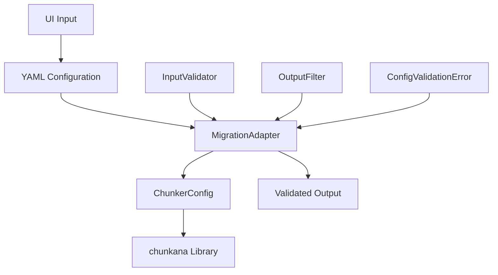
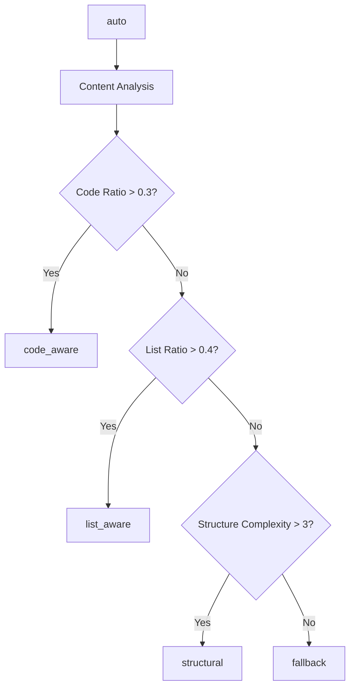
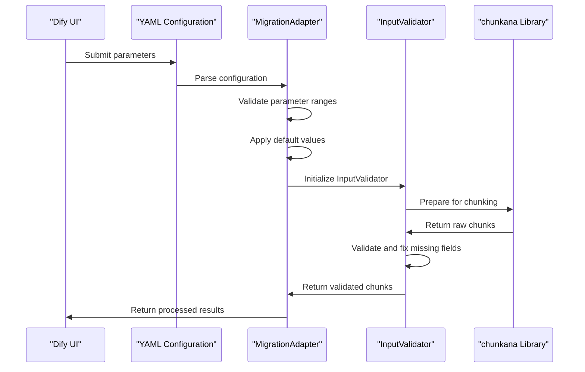
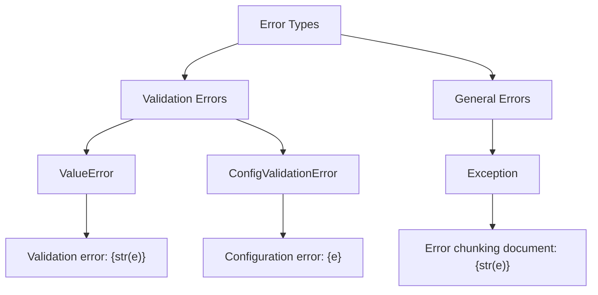

# Configuration Validation

<cite>
**Referenced Files in This Document**   
- [input_validator.py](file://input_validator.py)
- [adapter.py](file://adapter.py)
- [tools/markdown_chunk_tool.py](file://tools/markdown_chunk_tool.py)
- [tools/markdown_chunk_tool.yaml](file://tools/markdown_chunk_tool.yaml)
- [docs/reference/configuration.md](file://docs/reference/configuration.md)
</cite>

## Table of Contents
1. [Introduction](#introduction)
2. [Validation Architecture](#validation-architecture)
3. [Parameter Validation Rules](#parameter-validation-rules)
4. [Validation Process Flow](#validation-process-flow)
5. [Error Handling and Messages](#error-handling-and-messages)
6. [Plugin vs Direct Validation](#plugin-vs-direct-validation)
7. [Configuration Examples](#configuration-examples)
8. [Best Practices](#best-practices)

## Introduction

The configuration validation system in dify-markdown-chunker-1 ensures robust parameter validation for both the Dify plugin interface and direct chunkana usage. This system prevents invalid configurations that could lead to poor chunking results or system errors. The validation framework operates at multiple levels, from UI input validation through YAML parsing to runtime checks, providing comprehensive protection against configuration issues.

The validation system is designed to handle two primary use cases: plugin-level validation through the Dify interface and full validation when using the chunkana library directly. Both approaches share common validation rules but differ in their implementation and enforcement mechanisms. The system validates critical parameters such as max_chunk_size (512-16384), chunk_overlap (capped at 35% of chunk size), and strategy options, ensuring optimal chunking performance and reliability.

**Section sources**
- [docs/reference/configuration.md](file://docs/reference/configuration.md#L1-L530)

## Validation Architecture

The validation architecture in dify-markdown-chunker-1 follows a multi-layered approach that separates concerns between input validation, configuration mapping, and error handling. At the core of this architecture is the MigrationAdapter class, which serves as a compatibility layer between the Dify plugin interface and the underlying chunkana library.



**Diagram sources **
- [adapter.py](file://adapter.py#L43-L352)
- [input_validator.py](file://input_validator.py#L14-L46)

The architecture consists of several key components:
- **MigrationAdapter**: Translates plugin parameters to chunkana configuration while applying validation rules
- **InputValidator**: Validates and fixes data from the chunkana library output
- **ChunkerConfig**: Represents the validated configuration for the chunking process
- **OutputFilter**: Filters hierarchical chunks based on configuration parameters

This layered approach ensures that validation occurs at multiple points in the processing pipeline, providing defense in depth against invalid configurations.

**Section sources**
- [adapter.py](file://adapter.py#L43-L352)
- [input_validator.py](file://input_validator.py#L14-L46)

## Parameter Validation Rules

The configuration validation system enforces strict rules for all parameters to ensure optimal chunking performance and prevent common issues. These rules apply to both plugin-level and direct chunkana usage, with some differences in enforcement.

### Core Parameter Rules

| Parameter | Type | Valid Range | Default Value | Description |
|---------|------|------------|--------------|-------------|
| `max_chunk_size` | number | 512-16384 | 4096 | Maximum chunk size in characters |
| `chunk_overlap` | number | 0 to 35% of max_chunk_size | 200 | Overlap between consecutive chunks |
| `strategy` | select | auto, code_aware, list_aware, structural, fallback | auto | Chunking strategy selection |

The `max_chunk_size` parameter has a minimum value of 512 characters to prevent excessively small chunks that would degrade retrieval performance, and a maximum of 16384 characters to prevent memory issues and ensure reasonable processing times. The `chunk_overlap` parameter is capped at 35% of the `max_chunk_size` to prevent overlap from consuming too much of the chunk's content space.

### Strategy Options

The validation system supports five distinct chunking strategies, each optimized for different content types:



**Diagram sources **
- [docs/reference/configuration.md](file://docs/reference/configuration.md#L204-L213)

The `auto` strategy uses content analysis to determine the optimal approach, while the other strategies force specific behaviors:
- **code_aware**: Preserves code blocks and their context
- **list_aware**: Maintains list hierarchy and indentation
- **structural**: Uses header-based chunking for document structure
- **fallback**: Simple splitting without structural awareness

These validation rules prevent common configuration issues such as setting an overlap larger than the chunk size or using incompatible strategy combinations.

**Section sources**
- [docs/reference/configuration.md](file://docs/reference/configuration.md#L34-L37)
- [tools/markdown_chunk_tool.yaml](file://tools/markdown_chunk_tool.yaml#L38-L108)

## Validation Process Flow

The validation process follows a structured flow from UI input through YAML parsing to runtime checks, ensuring comprehensive validation at each stage of configuration processing.



**Diagram sources **
- [adapter.py](file://adapter.py#L71-L81)
- [input_validator.py](file://input_validator.py#L17-L46)

The process begins with UI input validation, where the Dify interface enforces basic parameter constraints. When the configuration is processed, the MigrationAdapter performs several validation steps:

1. **Parameter extraction**: Extracts values from tool parameters with defaults
2. **Range validation**: Ensures max_chunk_size is between 512-16384
3. **Overlap capping**: Limits chunk_overlap to 35% of max_chunk_size
4. **Strategy mapping**: Converts UI strategy selections to chunkana equivalents
5. **Default application**: Applies default values from config_defaults_snapshot.json

After the initial validation, the system proceeds to runtime validation during the chunking process. The InputValidator class checks each chunk for required fields and applies defaults when necessary, particularly for metadata fields like is_leaf and is_root.

This multi-stage validation process ensures that configurations are validated both before processing begins and during runtime, providing comprehensive protection against invalid configurations.

**Section sources**
- [adapter.py](file://adapter.py#L71-L81)
- [input_validator.py](file://input_validator.py#L17-L46)
- [tools/markdown_chunk_tool.py](file://tools/markdown_chunk_tool.py#L74-L126)

## Error Handling and Messages

The configuration validation system implements comprehensive error handling to provide clear feedback when invalid configurations are detected. This includes both validation errors for configuration issues and general errors for runtime exceptions.

### Error Types and Handling

The system distinguishes between two main types of errors:



**Diagram sources **
- [tools/markdown_chunk_tool.py](file://tools/markdown_chunk_tool.py#L122-L125)
- [docs/reference/configuration.md](file://docs/reference/configuration.md#L416-L428)

Validation errors are raised as ValueError exceptions when input parameters fail validation checks, such as when max_chunk_size is set below 512 or chunk_overlap exceeds 35% of the chunk size. These errors are caught and formatted as "Validation error: {str(e)}" messages.

General errors are caught as Exception and formatted as "Error chunking document: {str(e)}" messages. This distinction helps users identify whether the issue is with their configuration or with the document processing itself.

### Example Error Scenarios

Invalid configurations trigger specific error messages:

- **Too small max_chunk_size**: "Validation error: max_chunk_size must be between 512 and 16384"
- **Excessive overlap**: "Validation error: chunk_overlap exceeds 35% of max_chunk_size"
- **Missing input_text**: "Error: input_text is required and cannot be empty"
- **Invalid strategy**: "Validation error: strategy must be one of auto, code_aware, list_aware, structural, fallback"

The InputValidator class also handles missing metadata fields by applying defaults and logging warnings:

```python
if "is_leaf" not in metadata:
    metadata["is_leaf"] = True
    logger.warning(f"[ChunkanaAdapter] Chunk {i} missing is_leaf, defaulting to True")
```

This approach ensures that the system remains resilient to incomplete data while informing users of potential issues.

**Section sources**
- [tools/markdown_chunk_tool.py](file://tools/markdown_chunk_tool.py#L122-L125)
- [input_validator.py](file://input_validator.py#L32-L37)
- [docs/reference/configuration.md](file://docs/reference/configuration.md#L416-L428)

## Plugin vs Direct Validation

The configuration validation system differs between plugin-level usage and direct chunkana usage, reflecting the different contexts and requirements of each approach.

### Plugin-Level Validation

When using the Dify plugin interface, validation occurs primarily through the YAML configuration and the MigrationAdapter class. The plugin enforces constraints through the tool parameters defined in markdown_chunk_tool.yaml:

```yaml
- name: max_chunk_size
  type: number
  required: false
  default: 4096
  form: form
  human_description:
    en_US: "Maximum size of each chunk in characters (default: 4096)"
```

The plugin-level validation is more restrictive, with certain advanced features disabled to maintain simplicity. For example, the overlap is capped at 35% of the chunk size, and only the five predefined strategies are available.

### Direct Chunkana Validation

When using chunkana directly, validation is more flexible and comprehensive. The ChunkConfig class provides full validation through its validate() method:

```python
from chunkana import ChunkConfig, ConfigValidationError

try:
    config = ChunkConfig(
        max_chunk_size=100,  # Invalid: too small
        overlap_size=5000    # Invalid: larger than chunk size
    )
    config.validate()
except ConfigValidationError as e:
    print(f"Configuration error: {e}")
    print(f"Suggestions: {e.suggestions}")
```

Direct usage allows access to advanced features not available in the plugin UI, such as:
- Adaptive sizing configuration
- Code-context binding parameters
- Table grouping options
- Custom strategy thresholds
- Streaming processing settings

The ConfigValidationError provides detailed feedback with suggestions for correcting invalid configurations, making it easier to debug complex setups.

### Key Differences

| Aspect | Plugin-Level | Direct Chunkana |
|------|-------------|----------------|
| Validation Scope | Limited to UI parameters | Comprehensive configuration |
| Overlap Control | Capped at 35% of chunk size | Full control with validation |
| Strategy Options | 5 predefined strategies | Custom strategy configuration |
| Advanced Features | Limited | Full access |
| Error Feedback | Basic error messages | Detailed suggestions |
| Configuration Source | YAML/JSON | Python objects |

This dual approach allows users to choose the appropriate level of control based on their needs, from simple plugin usage for standard scenarios to advanced direct usage for specialized requirements.

**Section sources**
- [tools/markdown_chunk_tool.yaml](file://tools/markdown_chunk_tool.yaml#L38-L108)
- [docs/reference/configuration.md](file://docs/reference/configuration.md#L106-L238)

## Configuration Examples

The configuration validation system supports various use cases through different parameter combinations. These examples demonstrate valid configurations for common scenarios.

### Basic RAG Configuration

For standard retrieval-augmented generation use cases, a balanced configuration provides good performance:

```yaml
- node: chunk_for_rag
  type: tool
  tool: advanced_markdown_chunker
  config:
    max_chunk_size: 2048
    chunk_overlap: 100
    strategy: auto
    include_metadata: true
```

This configuration uses the auto strategy to automatically select the best approach based on content analysis, with moderate chunk size and overlap for optimal retrieval performance.

### Hierarchical Processing

For documents requiring parent-child relationships between chunks:

```yaml
- node: hierarchical_chunks
  type: tool
  tool: advanced_markdown_chunker
  config:
    max_chunk_size: 4096
    enable_hierarchy: true
    leaf_only: true
    debug: false
```

This configuration enables hierarchical chunking while returning only leaf chunks for vector database indexing, filtering out structural headers.

### Code Documentation Processing

For code-heavy documents, a specialized configuration preserves context:

```yaml
- node: code_docs_chunks
  type: tool
  tool: advanced_markdown_chunker
  config:
    max_chunk_size: 6144
    chunk_overlap: 200
    strategy: code_aware
    include_metadata: true
```

Using a larger chunk size and code-aware strategy ensures that code blocks remain intact and have sufficient context.

### Clean Text Output

For applications requiring clean text without metadata:

```yaml
- node: clean_text_chunks
  type: tool
  tool: advanced_markdown_chunker
  config:
    max_chunk_size: 2048
    chunk_overlap: 100
    include_metadata: false
```

Setting include_metadata to false embeds overlap directly in the chunk text rather than using metadata fields.

These examples demonstrate how the validation system ensures that all configurations adhere to the defined rules while supporting diverse use cases.

**Section sources**
- [docs/reference/configuration.md](file://docs/reference/configuration.md#L49-L98)

## Best Practices

To maximize the effectiveness of the configuration validation system, follow these best practices for both plugin and direct usage.

### Plugin Configuration Guidelines

1. **Start with defaults**: The default parameters (max_chunk_size=4096, chunk_overlap=200, strategy=auto) work well for most RAG use cases
2. **Use hierarchical mode judiciously**: Only enable enable_hierarchy when you need parent-child relationships for multi-level retrieval
3. **Consider the overlap cap**: Remember that chunk_overlap is capped at 35% of max_chunk_size in the plugin interface
4. **Use leaf_only for vector databases**: When indexing in vector databases, set leaf_only=true to exclude structural headers
5. **Validate input text**: Always ensure input_text is provided and not empty

### Direct Chunkana Usage

1. **Use predefined profiles**: Start with predefined configuration profiles like ChunkConfig.for_dify_rag() or ChunkConfig.for_code_heavy()
2. **Implement content-adaptive configuration**: Analyze document content to select optimal parameters:
   ```python
   def adaptive_config(md_text: str) -> ChunkConfig:
       # Analyze content and return appropriate configuration
   ```
3. **Balance performance and features**: Disable advanced features like adaptive sizing in production for consistent performance
4. **Always validate configurations**: Call config.validate() before using a configuration in production
5. **Use environment-specific configurations**: Maintain different configurations for development, testing, and production environments

### Common Patterns

```python
# Development configuration with full features
dev_config = ChunkConfig(
    use_adaptive_sizing=True,
    enable_code_context_binding=True,
    group_related_tables=True,
    debug_mode=True
)

# Production configuration optimized for performance
prod_config = ChunkConfig(
    max_chunk_size=2048,
    overlap_size=100,
    include_metadata=True,
    strategy_override=None,
    use_adaptive_sizing=False
)

# Vector database indexing configuration
vector_config = ChunkConfig(
    enable_hierarchy=True,
    leaf_only=True,
    include_metadata=True,
    debug_mode=False
)
```

Following these best practices ensures reliable and effective use of the configuration validation system, preventing common issues and optimizing performance for different use cases.

**Section sources**
- [docs/reference/configuration.md](file://docs/reference/configuration.md#L458-L501)