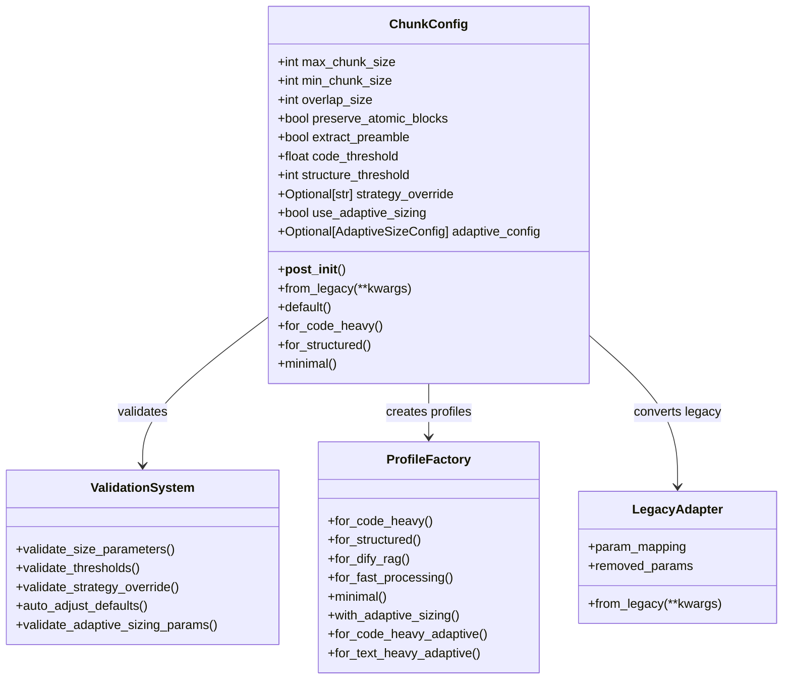
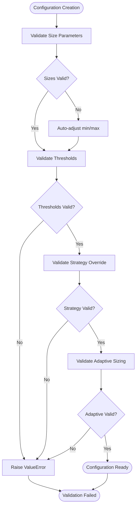

# Configuration

<cite>
**Referenced Files in This Document**   
- [markdown_chunker_v2/config.py](file://markdown_chunker_v2/config.py)
- [markdown_chunker_v2/types.py](file://markdown_chunker_v2/types.py)
- [markdown_chunker/chunker/types.py](file://markdown_chunker/chunker/types.py)
- [markdown_chunker_legacy/chunker/types.py](file://markdown_chunker_legacy/chunker/types.py)
- [examples/basic_usage.py](file://examples/basic_usage.py)
- [examples/api_usage.py](file://examples/api_usage.py)
- [examples/dify_integration.py](file://examples/dify_integration.py)
- [tests/chunker/test_config_profiles.py](file://tests/chunker/test_config_profiles.py)
- [tests/chunker/test_chunk_config_validation.py](file://tests/chunker/test_chunk_config_validation.py)
- [docs/architecture/dify-integration.md](file://docs/architecture/dify-integration.md)
- [docs/reference/configuration.md](file://docs/reference/configuration.md)
- [markdown_chunker_v2/adaptive_sizing.py](file://markdown_chunker_v2/adaptive_sizing.py)
- [docs/guides/adaptive-sizing-migration.md](file://docs/guides/adaptive-sizing-migration.md)
- [docs/api/config.md](file://docs/api/config.md)
</cite>

## Update Summary
**Changes Made**   
- Added new section on Adaptive Sizing Configuration to document the new adaptive chunk sizing feature
- Added new section on Adaptive Sizing Profiles to document configuration profiles for adaptive sizing
- Updated Core Configuration Parameters section to include new adaptive sizing parameters
- Updated Configuration Profiles section to include adaptive sizing profiles
- Updated Best Practices section to include tuning recommendations for adaptive sizing
- Updated Troubleshooting section to include issues related to adaptive sizing
- Added new section on Adaptive Sizing Behavior and Metadata to document behavior changes and new metadata fields

## Table of Contents
1. [Introduction](#introduction)
2. [Configuration Architecture](#configuration-architecture)
3. [Core Configuration Parameters](#core-configuration-parameters)
4. [Configuration Profiles](#configuration-profiles)
5. [Adaptive Sizing Configuration](#adaptive-sizing-configuration)
6. [Adaptive Sizing Profiles](#adaptive-sizing-profiles)
7. [Validation System](#validation-system)
8. [Context-Specific Configurations](#context-specific-configurations)
9. [Adaptive Sizing Behavior and Metadata](#adaptive-sizing-behavior-and-metadata)
10. [Best Practices](#best-practices)
11. [Troubleshooting](#troubleshooting)
12. [Migration Guide](#migration-guide)

## Introduction

The Markdown chunker provides a sophisticated configuration system that allows fine-tuned control over how markdown documents are split into semantic chunks. The configuration system balances simplicity with flexibility, offering both manual parameter tuning and pre-configured profiles for common use cases.

The configuration system operates at two levels:
- **V2 Configuration**: Simplified 8-parameter system for modern usage
- **Legacy Configuration**: Comprehensive 32-parameter system for backward compatibility

Both systems share the same core validation logic while providing different interfaces for different use cases.

## Configuration Architecture

The configuration system is built around the `ChunkConfig` dataclass, which encapsulates all chunking behavior parameters. The architecture follows a layered approach:



**Diagram sources**
- [markdown_chunker_v2/config.py](file://markdown_chunker_v2/config.py#L12-L170)

**Section sources**
- [markdown_chunker_v2/config.py](file://markdown_chunker_v2/config.py#L12-L170)

## Core Configuration Parameters

### Size Parameters

The size parameters control the fundamental chunking behavior:

| Parameter | Type | Default | Description |
|-----------|------|---------|-------------|
| `max_chunk_size` | int | 4096 | Maximum size of a chunk in characters |
| `min_chunk_size` | int | 512 | Minimum size of a chunk in characters |
| `overlap_size` | int | 200 | Size of overlap between chunks (0 = disabled) |

**Key Behaviors:**
- Chunks automatically adjust when `min_chunk_size > max_chunk_size`
- Overlap size must be less than `max_chunk_size`
- Zero overlap disables overlap functionality

### Behavioral Parameters

These parameters control chunking behavior:

| Parameter | Type | Default | Description |
|-----------|------|---------|-------------|
| `preserve_atomic_blocks` | bool | True | Keep code blocks and tables intact |
| `extract_preamble` | bool | True | Extract content before first header as preamble |

**Key Behaviors:**
- Atomic blocks (code, tables) are never split across chunks
- Preamble extraction improves semantic coherence for some document types

### Strategy Selection Parameters

Parameters that influence strategy selection:

| Parameter | Type | Default | Description |
|-----------|------|---------|-------------|
| `code_threshold` | float | 0.3 | Code ratio threshold for CodeAwareStrategy |
| `structure_threshold` | int | 3 | Minimum headers for StructuralStrategy |

**Key Behaviors:**
- Code threshold determines when code-focused strategies activate
- Structure threshold influences when structural analysis is prioritized

### Strategy Override

| Parameter | Type | Default | Description |
|-----------|------|---------|-------------|
| `strategy_override` | Optional[str] | None | Force specific strategy (code_aware, structural, fallback) |

### Adaptive Sizing Parameters

New parameters for the adaptive sizing feature:

| Parameter | Type | Default | Description |
|-----------|------|---------|-------------|
| `use_adaptive_sizing` | bool | False | Enable adaptive chunk sizing based on content complexity |
| `adaptive_config` | Optional[AdaptiveSizeConfig] | None | Configuration for adaptive sizing behavior (auto-created with defaults if use_adaptive_sizing=True) |

**Key Behaviors:**
- When `use_adaptive_sizing` is True, chunk sizes are automatically adjusted based on content complexity
- `adaptive_config` uses default values if not provided when adaptive sizing is enabled
- Adaptive sizing considers code ratio, table ratio, list ratio, and sentence length to determine optimal chunk size

**Section sources**
- [markdown_chunker_v2/config.py](file://markdown_chunker_v2/config.py#L31-L46)
- [markdown_chunker_v2/adaptive_sizing.py](file://markdown_chunker_v2/adaptive_sizing.py#L14-L85)

## Configuration Profiles

The configuration system provides factory methods for common use cases, each optimized for specific document types and processing requirements.

### Available Profiles

#### Code-Heavy Documents
```python
config = ChunkConfig.for_code_heavy()
# Optimized for technical documentation
# - max_chunk_size: 8192
# - min_chunk_size: 1024
# - overlap_size: 100
# - code_threshold: 0.2
```

#### Structured Documents
```python
config = ChunkConfig.for_structured()
# Balanced approach for well-structured content
# - max_chunk_size: 4096
# - min_chunk_size: 512
# - overlap_size: 200
# - structure_threshold: 2
```

#### Minimal Configuration
```python
config = ChunkConfig.minimal()
# Small chunks for testing/debugging
# - max_chunk_size: 1024
# - min_chunk_size: 256
# - overlap_size: 50
```

### Profile Comparison

| Profile | Max Size | Min Size | Overlap | Code Thresh | Use Case |
|---------|----------|----------|---------|-------------|----------|
| `for_code_heavy()` | 8192 | 1024 | 100 | 0.2 | API docs, tutorials |
| `for_structured()` | 4096 | 512 | 200 | 3 | Documentation sites |
| `minimal()` | 1024 | 256 | 50 | N/A | Testing, development |

**Section sources**
- [markdown_chunker_v2/config.py](file://markdown_chunker_v2/config.py#L142-L170)
- [tests/chunker/test_config_profiles.py](file://tests/chunker/test_config_profiles.py#L6-L69)

## Adaptive Sizing Configuration

The adaptive sizing feature automatically adjusts chunk sizes based on content complexity, using the `AdaptiveSizeConfig` class to control the behavior.

### AdaptiveSizeConfig Parameters

| Parameter | Type | Default | Description |
|-----------|------|---------|-------------|
| `base_size` | int | 1500 | Base chunk size for medium complexity content |
| `min_scale` | float | 0.5 | Minimum scaling factor (for simple text) |
| `max_scale` | float | 1.5 | Maximum scaling factor (for complex code) |
| `code_weight` | float | 0.4 | Weight for code ratio in complexity calculation |
| `table_weight` | float | 0.3 | Weight for table ratio in complexity calculation |
| `list_weight` | float | 0.2 | Weight for list ratio in complexity calculation |
| `sentence_length_weight` | float | 0.1 | Weight for sentence length in complexity calculation |

**Key Behaviors:**
- Complexity score is calculated as a weighted sum of content factors (0.0 = simple, 1.0 = complex)
- Scale factor is linearly interpolated between min_scale and max_scale based on complexity
- Adaptive size = base_size × scale_factor, constrained by min/max scale
- All weights must sum to 1.0 (±0.001 tolerance)

### Example Configurations

**Default Adaptive Configuration:**
```python
config = ChunkConfig(
    use_adaptive_sizing=True,
    adaptive_config=AdaptiveSizeConfig(
        base_size=1500,
        min_scale=0.5,   # 750 chars minimum
        max_scale=1.5,   # 2250 chars maximum
    )
)
```

**Code-Heavy Document Configuration:**
```python
config = ChunkConfig(
    use_adaptive_sizing=True,
    adaptive_config=AdaptiveSizeConfig(
        base_size=2000,
        min_scale=0.7,   # 1400 chars minimum
        max_scale=1.8,   # 3600 chars maximum
        code_weight=0.6, # Higher weight for code
    )
)
```

**Text-Heavy Document Configuration:**
```python
config = ChunkConfig(
    use_adaptive_sizing=True,
    adaptive_config=AdaptiveSizeConfig(
        base_size=1200,
        min_scale=0.5,   # 600 chars minimum
        max_scale=1.2,   # 1440 chars maximum
        sentence_length_weight=0.4, # Higher weight for text complexity
    )
)
```

**Section sources**
- [markdown_chunker_v2/adaptive_sizing.py](file://markdown_chunker_v2/adaptive_sizing.py#L14-L85)
- [docs/guides/adaptive-sizing-migration.md](file://docs/guides/adaptive-sizing-migration.md#L68-L164)

## Adaptive Sizing Profiles

The configuration system provides factory methods for common adaptive sizing use cases.

### Available Adaptive Profiles

#### Default Adaptive Sizing
```python
config = ChunkConfig.with_adaptive_sizing()
# Configuration with adaptive sizing enabled (default profile)
# - max_chunk_size: 4096
# - min_chunk_size: 512
# - overlap_size: 200
# - use_adaptive_sizing: True
# - adaptive_config: base_size=1500, min_scale=0.5, max_scale=1.5
```

#### Code-Heavy Documents with Adaptive Sizing
```python
config = ChunkConfig.for_code_heavy_adaptive()
# Configuration for code-heavy documents with adaptive sizing
# - max_chunk_size: 8192
# - min_chunk_size: 1024
# - overlap_size: 100
# - code_threshold: 0.2
# - use_adaptive_sizing: True
# - adaptive_config: base_size=2000, min_scale=0.7, max_scale=1.8, code_weight=0.6
```

#### Text-Heavy Documents with Adaptive Sizing
```python
config = ChunkConfig.for_text_heavy_adaptive()
# Configuration for text-heavy documents with adaptive sizing
# - max_chunk_size: 4096
# - min_chunk_size: 512
# - overlap_size: 200
# - use_adaptive_sizing: True
# - adaptive_config: base_size=1200, min_scale=0.5, max_scale=1.2, sentence_length_weight=0.4
```

### Adaptive Profile Comparison

| Profile | Base Size | Min Scale | Max Scale | Code Weight | Use Case |
|---------|-----------|-----------|-----------|-------------|----------|
| `with_adaptive_sizing()` | 1500 | 0.5 | 1.5 | 0.4 | General purpose adaptive |
| `for_code_heavy_adaptive()` | 2000 | 0.7 | 1.8 | 0.6 | Technical documentation |
| `for_text_heavy_adaptive()` | 1200 | 0.5 | 1.2 | 0.2 | Blogs, articles, notes |

**Section sources**
- [markdown_chunker_v2/config.py](file://markdown_chunker_v2/config.py#L290-L341)
- [docs/guides/adaptive-sizing-migration.md](file://docs/guides/adaptive-sizing-migration.md#L107-L118)

## Validation System

The configuration validation system ensures parameter integrity and provides automatic adjustments when necessary.

### Validation Rules



**Diagram sources**
- [markdown_chunker_v2/config.py](file://markdown_chunker_v2/config.py#L47-L74)

### Automatic Adjustments

The validation system performs several automatic corrections:

1. **Size Relationship Adjustment**: When `min_chunk_size > max_chunk_size`, `min_chunk_size` becomes `max_chunk_size // 2`
2. **Target Size Adjustment**: `target_chunk_size` is constrained to stay within size bounds
3. **Percentage Validation**: Threshold values are clamped to [0.0, 1.0] range
4. **Adaptive Sizing Adjustment**: When `use_adaptive_sizing` is True and `adaptive_config` is None, a default `AdaptiveSizeConfig` is created

### Validation Examples

```python
# Automatic adjustment example
config = ChunkConfig(max_chunk_size=500)  # min_chunk_size becomes 250
assert config.min_chunk_size == 250

# Threshold validation
try:
    config = ChunkConfig(code_threshold=1.5)  # Raises ValueError
except ValueError as e:
    assert "must be between 0 and 1" in str(e)

# Adaptive sizing validation
config = ChunkConfig(use_adaptive_sizing=True)
assert config.adaptive_config is not None  # Auto-created default config
```

**Section sources**
- [markdown_chunker_v2/config.py](file://markdown_chunker_v2/config.py#L47-L74)
- [tests/chunker/test_chunk_config_validation.py](file://tests/chunker/test_chunk_config_validation.py#L13-L207)

## Context-Specific Configurations

### Dify RAG Integration

For RAG (Retrieval-Augmented Generation) applications, the chunker provides specialized configurations:

```python
# Dify RAG optimized configuration
config = ChunkConfig(
    max_chunk_size=3072,    # Optimal for embedding models
    min_chunk_size=256,     # Small chunks for precision
    overlap_size=150,       # Context preservation
    code_threshold=0.6,     # Moderate code detection
    structure_threshold=3,  # Standard structural analysis
)
```

### API Documentation

Optimized for API reference materials with extensive code examples:

```python
# API documentation configuration
config = ChunkConfig(
    max_chunk_size=6144,    # Larger chunks for code blocks
    min_chunk_size=1024,    # Minimum code block size
    overlap_size=300,       # Extended overlap for context
    code_threshold=0.5,     # Aggressive code detection,
    use_adaptive_sizing=True,  # Enable adaptive sizing for mixed content
    adaptive_config=AdaptiveSizeConfig(
        base_size=2000,
        min_scale=0.7,
        max_scale=1.8,
        code_weight=0.6
    )
)
```

### Chat/LLM Context

Configured for optimal performance in conversational AI contexts:

```python
# Chat context configuration
config = ChunkConfig(
    max_chunk_size=1536,    # Fits typical context windows
    min_chunk_size=200,     # Small chunks for flexibility
    overlap_size=200,       # Context preservation
    structure_threshold=2,  # Lighter structural analysis
    use_adaptive_sizing=True,  # Enable adaptive sizing for better coherence
    adaptive_config=AdaptiveSizeConfig(
        base_size=1200,
        min_scale=0.5,
        max_scale=1.2
    )
)
```

**Section sources**
- [examples/dify_integration.py](file://examples/dify_integration.py#L76-L132)
- [docs/architecture/dify-integration.md](file://docs/architecture/dify-integration.md#L70-L82)

## Adaptive Sizing Behavior and Metadata

The adaptive sizing feature introduces new behavior patterns and metadata fields to provide insights into the chunking process.

### Chunk Size Distribution

When adaptive sizing is enabled, chunk sizes vary based on content complexity:

| Content Type | Complexity | Scale Factor | Adaptive Size (base=1500) |
|--------------|------------|--------------|---------------------------|
| Simple text, short sentences | 0.0 | 0.5 | 750 chars |
| Mixed content | 0.5 | 1.0 | 1500 chars |
| Code-heavy documentation | 1.0 | 1.5 | 2250 chars |

**Note:** Actual chunk size may differ from adaptive size due to:
- Atomic block preservation (code blocks, tables)
- Header boundaries
- Min/max size constraints
- Strategy-specific splitting rules

### New Metadata Fields

When adaptive sizing is enabled, chunks include additional metadata fields:

| Field | Type | Description |
|-------|------|-------------|
| `adaptive_size` | `int` | Calculated optimal chunk size |
| `content_complexity` | `float` | Complexity score 0.0-1.0 |
| `size_scale_factor` | `float` | Applied scaling factor |

**Example:**
```python
chunks = chunker.chunk(document)

for chunk in chunks:
    if 'adaptive_size' in chunk.metadata:
        print(f"Complexity: {chunk.metadata['content_complexity']:.2f}")
        print(f"Adaptive Size: {chunk.metadata['adaptive_size']} chars")
        print(f"Actual Size: {len(chunk.content)} chars")
```

**Section sources**
- [docs/guides/adaptive-sizing-migration.md](file://docs/guides/adaptive-sizing-migration.md#L208-L249)
- [markdown_chunker_v2/types.py](file://markdown_chunker_v2/types.py#L200-L235)

## Best Practices

### Configuration Selection Guidelines

1. **Start with Profiles**: Use predefined profiles as starting points
2. **Consider Use Case**: Choose profiles matching your document type
3. **Validate Parameters**: Always validate custom configurations
4. **Monitor Performance**: Track chunking performance and quality metrics

### Parameter Tuning Strategies

#### For Code Documentation
- Increase `max_chunk_size` to accommodate large code blocks
- Lower `code_threshold` for early code strategy activation
- Enable overlap for better context preservation
- Use adaptive sizing with higher `base_size` and `code_weight`

#### For General Documentation
- Use default or structured profiles
- Balance overlap size with memory constraints
- Monitor chunk coherence and semantic integrity
- Consider adaptive sizing for mixed content

#### For RAG Applications
- Optimize for embedding model constraints
- Use moderate overlap for context preservation
- Consider chunk size relative to embedding dimensions
- Enable adaptive sizing to optimize for content complexity

### Performance Optimization

```python
# Fast processing configuration
config = ChunkConfig(
    max_chunk_size=8192,    # Larger chunks reduce overhead
    min_chunk_size=1024,    # Skip small chunk processing
    overlap_size=0,         # Disable overlap for speed
    structure_threshold=5,  # Reduce structural analysis
)
```

### Quality Assurance

```python
# Quality-focused configuration
config = ChunkConfig(
    max_chunk_size=2048,    # Balanced chunk size
    min_chunk_size=256,     # Prevent overly small chunks
    overlap_size=200,       # Preserve context
    code_threshold=0.3,     # Conservative code detection
    structure_threshold=3,  # Standard structural analysis
    use_adaptive_sizing=True,  # Optimize for content complexity
    adaptive_config=AdaptiveSizeConfig(
        base_size=1500,
        min_scale=0.5,
        max_scale=1.5
    )
)
```

### Adaptive Sizing Tuning

When using adaptive sizing, consider these tuning recommendations:

1. **Adjust base_size** based on typical content:
   - 1000-1500 for simple notes and blogs
   - 1500-2000 for mixed documentation
   - 2000-2500 for code-heavy technical docs

2. **Adjust scale range** based on content variance:
   - 0.8-1.2 for uniform content
   - 0.6-1.4 for some variation
   - 0.5-1.5 for mixed content (default)

3. **Adjust complexity weights** to prioritize content types:
   - Increase `code_weight` for technical documentation
   - Increase `table_weight` for data-heavy content
   - Increase `list_weight` for structured documentation
   - Adjust `sentence_length_weight` based on text complexity

**Section sources**
- [docs/guides/adaptive-sizing-migration.md](file://docs/guides/adaptive-sizing-migration.md#L122-L206)
- [docs/api/config.md](file://docs/api/config.md#L168-L182)

## Troubleshooting

### Common Configuration Issues

#### Invalid Size Relationships
```python
# Problem: min_chunk_size > max_chunk_size
config = ChunkConfig(max_chunk_size=500, min_chunk_size=1000)
# Automatically adjusted to min_chunk_size = 250
```

#### Threshold Validation Errors
```python
# Problem: Threshold out of range
config = ChunkConfig(code_threshold=1.5)  # Raises ValueError
```

#### Strategy Override Errors
```python
# Problem: Invalid strategy
config = ChunkConfig(strategy_override="invalid")  # Raises ValueError
```

#### Adaptive Sizing Issues

**Weights Don't Sum to 1.0:**
```python
# Error: Weights must sum to 1.0
config = AdaptiveSizeConfig(
    code_weight=0.4,
    table_weight=0.3,
    list_weight=0.2
    # Missing sentence_length_weight - sum = 0.9
)
```

**Scale Range Invalid:**
```python
# Error: min_scale must be less than max_scale
config = AdaptiveSizeConfig(
    min_scale=1.2,
    max_scale=1.0  # Invalid
)
```

**Unexpected Chunk Sizes:**
```python
# Debug adaptive sizing
for chunk in chunks:
    adaptive = chunk.metadata.get('adaptive_size', 'N/A')
    actual = len(chunk.content)
    complexity = chunk.metadata.get('content_complexity', 'N/A')
    
    print(f"Adaptive: {adaptive}, Actual: {actual}, Complexity: {complexity}")
    
    if actual > adaptive * 1.5:
        print("  → Likely atomic block (code/table) preserved")
    elif actual < adaptive * 0.5:
        print("  → Likely forced merge due to min_chunk_size")
```

### Debugging Configuration Problems

1. **Enable Logging**: Use the chunker's logging capabilities
2. **Validate Manually**: Check parameter relationships
3. **Test with Samples**: Validate configurations with representative documents
4. **Monitor Metrics**: Track chunk size distribution and strategy usage
5. **Check Adaptive Metadata**: Examine `content_complexity`, `adaptive_size`, and `size_scale_factor` for adaptive sizing issues

### Migration from Legacy Configuration

When migrating from legacy configurations:

```python
# Legacy to V2 migration
legacy_config = {
    "max_chunk_size": 4096,
    "min_chunk_size": 512,
    "enable_overlap": True,
    "overlap_size": 200
}

# Convert to V2
v2_config = ChunkConfig.from_legacy(**legacy_config)
```

**Section sources**
- [markdown_chunker_v2/config.py](file://markdown_chunker_v2/config.py#L81-L135)

## Migration Guide

### From Legacy to V2 Configuration

The V2 configuration system simplifies the 32-parameter legacy system to 8 core parameters:

#### Parameter Mapping

| Legacy Parameter | V2 Equivalent | Notes |
|------------------|---------------|-------|
| `max_size` | `max_chunk_size` | Renamed parameter |
| `min_size` | `min_chunk_size` | Renamed parameter |
| `enable_overlap` | `overlap_size > 0` | Boolean converted to size |
| `block_based_splitting` | Always enabled | Removed parameter |
| `preserve_code_blocks` | `preserve_atomic_blocks` | Always enabled |
| `preserve_tables` | `preserve_atomic_blocks` | Always enabled |

#### Removed Parameters

Parameters that are no longer configurable in V2:
- `enable_deduplication`: Always enabled
- `enable_regression_validation`: Always enabled
- `enable_header_path_validation`: Always enabled
- `use_enhanced_parser`: Always enabled
- `enable_sentence_splitting`: Removed
- `enable_paragraph_merging`: Removed
- `enable_list_preservation`: Always enabled
- `enable_metadata_enrichment`: Always enabled
- `enable_size_normalization`: Removed
- `enable_fallback_strategy`: Always enabled

### Migration Examples

```python
# Legacy configuration
legacy_config = ChunkConfig(
    max_chunk_size=4096,
    min_chunk_size=512,
    enable_overlap=True,
    overlap_size=200,
    code_ratio_threshold=0.7,
    header_count_threshold=3
)

# Equivalent V2 configuration
v2_config = ChunkConfig(
    max_chunk_size=4096,
    min_chunk_size=512,
    overlap_size=200,
    code_threshold=0.7,
    structure_threshold=3
)
```

### Backward Compatibility

The V2 system maintains backward compatibility through the `from_legacy()` method, which handles parameter mapping and deprecation warnings.

**Section sources**
- [markdown_chunker_v2/config.py](file://markdown_chunker_v2/config.py#L81-L135)