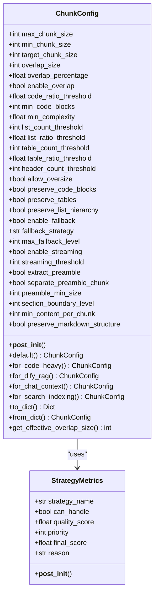
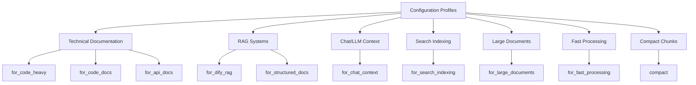
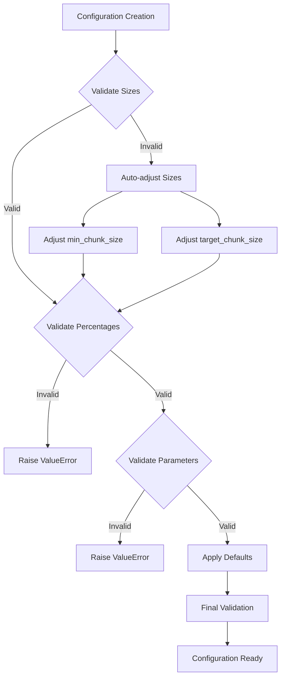

# Configuration

<cite>
**Referenced Files in This Document**
- [markdown_chunker/chunker/types.py](file://markdown_chunker/chunker/types.py)
- [markdown_chunker/chunker/validator.py](file://markdown_chunker/chunker/validator.py)
- [markdown_chunker/chunker/components/metadata_enricher.py](file://markdown_chunker/chunker/components/metadata_enricher.py)
- [markdown_chunker/chunker/components/fallback_manager.py](file://markdown_chunker/chunker/components/fallback_manager.py)
- [provider/markdown_chunker.yaml](file://provider/markdown_chunker.yaml)
- [tools/markdown_chunk_tool.yaml](file://tools/markdown_chunk_tool.yaml)
- [examples/basic_usage.py](file://examples/basic_usage.py)
- [examples/api_usage.py](file://examples/api_usage.py)
- [tests/chunker/test_chunk_config_validation.py](file://tests/chunker/test_chunk_config_validation.py)
- [tests/chunker/test_config_profiles.py](file://tests/chunker/test_config_profiles.py)
- [tests/chunker/test_fallback_properties.py](file://tests/chunker/test_fallback_properties.py)
- [tests/chunker/test_components/test_metadata_enricher.py](file://tests/chunker/test_components/test_metadata_enricher.py)
</cite>

## Table of Contents
1. [Introduction](#introduction)
2. [Core Configuration Structure](#core-configuration-structure)
3. [Size and Boundary Parameters](#size-and-boundary-parameters)
4. [Strategy Selection Thresholds](#strategy-selection-thresholds)
5. [Behavior Flags and Options](#behavior-flags-and-options)
6. [Configuration Profiles](#configuration-profiles)
7. [Custom ChunkConfig Objects](#custom-chunkconfig-objects)
8. [YAML Configuration Examples](#yaml-configuration-examples)
9. [Validation and Error Handling](#validation-and-error-handling)
10. [Best Practices](#best-practices)
11. [Troubleshooting](#troubleshooting)

## Introduction

The Markdown Chunker provides a sophisticated configuration system that allows fine-tuned control over how markdown documents are processed and segmented. The core configuration is encapsulated in the `ChunkConfig` class, which manages all aspects of the chunking process including size limits, strategy selection thresholds, overlap settings, and behavior flags.

The configuration system is designed with several key principles:
- **Sensible defaults** for most use cases
- **Factory methods** for common scenarios  
- **Comprehensive validation** to prevent invalid configurations
- **Flexible customization** through direct parameter modification
- **Automatic adjustment** of related parameters when conflicts occur

## Core Configuration Structure

The `ChunkConfig` class serves as the central configuration container for all chunking operations. It uses Python dataclasses with built-in validation to ensure configuration integrity.



**Diagram sources**
- [markdown_chunker/chunker/types.py](file://markdown_chunker/chunker/types.py#L497-L1061)

**Section sources**
- [markdown_chunker/chunker/types.py](file://markdown_chunker/chunker/types.py#L497-L1061)

## Size and Boundary Parameters

### Core Size Parameters

The size parameters control the fundamental boundaries of chunk creation:

| Parameter | Default | Purpose | Constraints |
|-----------|---------|---------|-------------|
| `max_chunk_size` | 4096 | Maximum chunk size in characters | Must be positive, larger than min_chunk_size |
| `min_chunk_size` | 512 | Minimum chunk size in characters | Must be positive, ≤ max_chunk_size |
| `target_chunk_size` | 2048 | Desired chunk size in characters | Must be between min_chunk_size and max_chunk_size |

### Overlap Configuration

Overlap parameters control how chunks connect to maintain context:

| Parameter | Default | Purpose | Constraints |
|-----------|---------|---------|-------------|
| `overlap_size` | 200 | Fixed overlap size in characters | Must be non-negative |
| `overlap_percentage` | 0.1 (10%) | Percentage of chunk size for overlap | Must be between 0.0 and 1.0 |
| `enable_overlap` | True | Whether to create overlapping chunks | Boolean flag |

The effective overlap size is calculated as:
```
effective_overlap = min(overlap_size, chunk_size * overlap_percentage, quarter_limit)
```

Where `quarter_limit = chunk_size // 4`.

**Section sources**
- [markdown_chunker/chunker/types.py](file://markdown_chunker/chunker/types.py#L575-L582)
- [markdown_chunker/chunker/types.py](file://markdown_chunker/chunker/types.py#L997-L1001)

## Strategy Selection Thresholds

Strategy thresholds determine which chunking strategy is selected based on document characteristics:

### Code Detection Thresholds

| Parameter | Default | Purpose | Range |
|-----------|---------|---------|-------|
| `code_ratio_threshold` | 0.3 | Minimum code content ratio for code strategy | 0.0 - 1.0 |
| `min_code_blocks` | 1 | Minimum code blocks for code strategy | Integer ≥ 0 |

### List Detection Thresholds

| Parameter | Default | Purpose | Range |
|-----------|---------|---------|-------|
| `list_count_threshold` | 5 | Minimum lists for list strategy | Integer ≥ 0 |
| `list_ratio_threshold` | 0.6 | Minimum list content ratio for list strategy | 0.0 - 1.0 |

### Table Detection Thresholds

| Parameter | Default | Purpose | Range |
|-----------|---------|---------|-------|
| `table_count_threshold` | 3 | Minimum tables for table strategy | Integer ≥ 0 |
| `table_ratio_threshold` | 0.4 | Minimum table content ratio for table strategy | 0.0 - 1.0 |

### Structural Detection Thresholds

| Parameter | Default | Purpose | Range |
|-----------|---------|---------|-------|
| `header_count_threshold` | 3 | Minimum headers for structural strategy | Integer ≥ 0 |
| `min_complexity` | 0.3 | Minimum complexity score for mixed strategy | 0.0 - 1.0 |

**Section sources**
- [markdown_chunker/chunker/types.py](file://markdown_chunker/chunker/types.py#L584-L593)

## Behavior Flags and Options

### Preservation Flags

These flags control how specific content types are handled:

| Flag | Default | Effect |
|------|---------|--------|
| `allow_oversize` | True | Allow chunks larger than max_chunk_size for indivisible elements |
| `preserve_code_blocks` | True | Keep code blocks intact when possible |
| `preserve_tables` | True | Keep tables intact when possible |
| `preserve_list_hierarchy` | True | Maintain list nesting structure |

### Fallback Configuration

Fallback settings provide robustness against strategy failures:

| Parameter | Default | Purpose |
|-----------|---------|---------|
| `enable_fallback` | True | Enable automatic fallback to alternative strategies |
| `fallback_strategy` | "sentences" | Strategy to use when primary fails |
| `max_fallback_level` | 4 | Maximum depth of fallback attempts |

### Performance Settings

| Parameter | Default | Purpose |
|-----------|---------|---------|
| `enable_streaming` | False | Enable memory-efficient processing for large documents |
| `streaming_threshold` | 10MB | Size threshold for enabling streaming |

### Phase 2 Settings

Phase 2 introduces semantic quality parameters:

| Parameter | Default | Purpose |
|-----------|---------|---------|
| `section_boundary_level` | 2 | Header level that defines section boundaries (1-6) |
| `min_content_per_chunk` | 50 | Minimum actual content per chunk (excluding headers) |
| `preserve_markdown_structure` | True | Maintain markdown formatting structure |

**Section sources**
- [markdown_chunker/chunker/types.py](file://markdown_chunker/chunker/types.py#L594-L618)

## Configuration Profiles

The system provides pre-configured profiles optimized for specific use cases:

### Available Profiles



**Diagram sources**
- [markdown_chunker/chunker/types.py](file://markdown_chunker/chunker/types.py#L694-L1061)

### Profile Details

#### Technical Documentation Profiles

**`for_code_heavy()`**
- **Max Chunk Size**: 6144
- **Target Size**: 3072
- **Code Ratio**: 0.5
- **Overlap**: 300
- **Use Case**: API documentation, tutorials with extensive code examples

**`for_code_docs()`**
- **Max Chunk Size**: 2048
- **Min Chunk Size**: 128
- **Overlap**: 100
- **Code Ratio**: 0.8
- **Use Case**: Pure code documentation, reference materials

**`for_api_docs()`**
- **Max Chunk Size**: 3072
- **Overlap**: 150
- **Code Ratio**: 0.6
- **Lists**: 3+ items
- **Tables**: 2+ tables
- **Use Case**: API reference documentation

#### RAG and Search Profiles

**`for_dify_rag()`**
- **Max Chunk Size**: 3072
- **Min Chunk Size**: 256
- **Target Size**: 1536
- **Overlap**: 150
- **Preserve**: Code blocks, list hierarchy
- **Oversize**: Disabled
- **Use Case**: Retrieval-Augmented Generation systems

**`for_search_indexing()`**
- **Max Chunk Size**: 1024
- **Min Chunk Size**: 100
- **Overlap**: 100
- **Code Ratio**: 0.4
- **Lists**: 6+ items
- **Tables**: 3+ tables
- **Use Case**: Search engine indexing

#### Application-Specific Profiles

**`for_chat_context()`**
- **Max Chunk Size**: 1536
- **Min Chunk Size**: 200
- **Overlap**: 200
- **Code Ratio**: 0.5
- **Lists**: 4+ items
- **Tables**: 2+ tables
- **Complexity**: 0.1
- **Use Case**: Chatbot/Large Language Model contexts

**`for_structured_docs()`**
- **Max Chunk Size**: 3072
- **Target Size**: 1536
- **Headers**: 2+ headers
- **Lists**: Preserve hierarchy
- **Overlap**: 150
- **Use Case**: Well-structured documentation

#### Performance Profiles

**`for_fast_processing()`**
- **Max Chunk Size**: 8192
- **Min Chunk Size**: 1024
- **Overlap**: 100
- **Oversize**: Enabled
- **Streaming**: Enabled
- **Use Case**: Batch processing, maximum throughput

**`for_large_documents()`**
- **Max Chunk Size**: 8192
- **Target Size**: 4096
- **Streaming**: Enabled
- **Overlap**: 400
- **Overlap Percentage**: 0.05
- **Use Case**: Books, long articles (>10MB)

**`compact()`**
- **Max Chunk Size**: 2048
- **Min Chunk Size**: 256
- **Target Size**: 1024
- **Overlap**: 100
- **Use Case**: Fine-grained processing, precise matching

**Section sources**
- [markdown_chunker/chunker/types.py](file://markdown_chunker/chunker/types.py#L694-L1061)

## Custom ChunkConfig Objects

Creating custom configurations allows precise tailoring of chunking behavior:

### Basic Custom Configuration

```python
# Custom configuration with specific parameters
config = ChunkConfig(
    max_chunk_size=2048,
    min_chunk_size=200,
    target_chunk_size=1024,
    enable_overlap=True,
    overlap_size=100,
    code_ratio_threshold=0.7,
    list_ratio_threshold=0.5,
    table_ratio_threshold=0.3
)
```

### Advanced Custom Configuration

```python
# Advanced configuration for specialized use cases
config = ChunkConfig(
    max_chunk_size=4096,
    min_chunk_size=512,
    target_chunk_size=2048,
    enable_overlap=True,
    overlap_size=200,
    overlap_percentage=0.1,
    
    # Strategy thresholds
    code_ratio_threshold=0.3,
    min_code_blocks=1,
    list_count_threshold=5,
    list_ratio_threshold=0.6,
    table_count_threshold=3,
    table_ratio_threshold=0.4,
    header_count_threshold=3,
    min_complexity=0.3,
    
    # Behavior flags
    allow_oversize=True,
    preserve_code_blocks=True,
    preserve_tables=True,
    preserve_list_hierarchy=True,
    
    # Fallback settings
    enable_fallback=True,
    fallback_strategy="sentences",
    max_fallback_level=4,
    
    # Performance settings
    enable_streaming=False,
    streaming_threshold=10 * 1024 * 1024,
    
    # Phase 2 settings
    section_boundary_level=2,
    min_content_per_chunk=50,
    preserve_markdown_structure=True
)
```

### Configuration Serialization

The `ChunkConfig` class provides JSON serialization capabilities:

```python
# Convert to dictionary
config_dict = config.to_dict()

# Create from dictionary
restored_config = ChunkConfig.from_dict(config_dict)
```

**Section sources**
- [markdown_chunker/chunker/types.py](file://markdown_chunker/chunker/types.py#L1003-L1028)
- [tests/chunker/test_serialization.py](file://tests/chunker/test_serialization.py#L152-L193)

## YAML Configuration Examples

### Dify Provider Configuration

The Dify provider uses a YAML configuration file to define tool parameters:

```yaml
identity:
  author: asukhodko
  name: markdown_chunker
  label:
    en_US: Advanced Markdown Chunker
    zh_Hans: 高级 Markdown 分块器
    ru_RU: Продвинутый Markdown чанкер
  description:
    en_US: Advanced Markdown chunking with structural awareness for better RAG performance
    zh_Hans: 具有结构感知的高级 Markdown 分块，提升 RAG 性能
    ru_RU: Продвинутое чанкование Markdown с учётом структуры для улучшения RAG
  icon: icon.svg
  tags:
    - productivity
    - business

tools:
  - tools/markdown_chunk_tool.yaml

extra:
  python:
    source: provider/markdown_chunker.py
```

**Section sources**
- [provider/markdown_chunker.yaml](file://provider/markdown_chunker.yaml#L1-L23)

### Tool Configuration

The tool configuration defines parameters available in the Dify interface:

```yaml
identity:
  name: markdown_chunk_tool
  author: asukhodko
  label:
    en_US: Markdown Chunker
    zh_Hans: Markdown 分块器
    ru_RU: Markdown чанкер

description:
  human:
    en_US: Advanced Markdown chunking with structural awareness for better RAG performance
    zh_Hans: 具有结构感知的高级 Markdown 分块，提升 RAG 性能
    ru_RU: Продвинутое чанкование Markdown с учётом структуры для улучшения RAG
  llm: |
    A tool for chunking Markdown documents with structural awareness.
    
    This tool analyzes Markdown content and intelligently splits it into chunks while preserving document structure,
    maintaining semantic context, supporting configurable chunk size and overlap, and providing rich metadata.

parameters:
  - name: input_text
    type: string
    required: true
    form: llm
    label:
      en_US: Input Text
    human_description:
      en_US: The Markdown text content to be chunked
    
  - name: max_chunk_size
    type: number
    required: false
    default: 1000
    form: form
    label:
      en_US: Max Chunk Size
    human_description:
      en_US: "Maximum size of each chunk in characters (default: 1000)"
    
  - name: chunk_overlap
    type: number
    required: false
    default: 100
    form: form
    label:
      en_US: Chunk Overlap
    human_description:
      en_US: "Number of characters to overlap between consecutive chunks (default: 100)"
    
  - name: strategy
    type: select
    required: false
    default: auto
    form: form
    label:
      en_US: Chunking Strategy
    human_description:
      en_US: "Strategy for chunking the document (default: auto - automatically detect best strategy)"
    options:
      - value: auto
        label:
          en_US: Auto (detect best strategy)
      - value: code
        label:
          en_US: Code-focused
      - value: structural
        label:
          en_US: Structural (headers)
      - value: mixed
        label:
          en_US: Mixed content
    
  - name: include_metadata
    type: boolean
    required: false
    default: true
    form: form
    label:
      en_US: Include Metadata
    human_description:
      en_US: "Include structural metadata with each chunk (default: true)"

output_schema:
  type: object
  properties:
    result:
      $ref: "https://dify.ai/schemas/v1/general_structure.json"

extra:
  python:
    source: tools/markdown_chunk_tool.py
```

**Section sources**
- [tools/markdown_chunk_tool.yaml](file://tools/markdown_chunk_tool.yaml#L1-L128)

## Validation and Error Handling

### Configuration Validation

The `ChunkConfig` class performs comprehensive validation during initialization:



**Diagram sources**
- [markdown_chunker/chunker/types.py](file://markdown_chunker/chunker/types.py#L621-L665)

### Validation Rules

The validation system enforces several critical rules:

| Rule | Constraint | Action |
|------|------------|--------|
| Positive Sizes | `max_chunk_size > 0`, `min_chunk_size > 0` | Raise ValueError |
| Size Relationship | `min_chunk_size ≤ target_chunk_size ≤ max_chunk_size` | Auto-adjust |
| Percentage Range | `0.0 ≤ percentage ≤ 1.0` | Raise ValueError |
| Non-negative Values | `overlap_size ≥ 0`, `preamble_min_size ≥ 0` | Raise ValueError |
| Header Level Range | `1 ≤ section_boundary_level ≤ 6` | Raise ValueError |
| Content Requirement | `min_content_per_chunk ≥ 0` | Raise ValueError |

### Error Handling Patterns

The system provides multiple layers of error handling:

```python
# Validation errors are caught and reported
try:
    config = ChunkConfig(max_chunk_size=500, min_chunk_size=1000)
except ValueError as e:
    print(f"Configuration error: {e}")

# Runtime validation ensures data integrity
validator = DataCompletenessValidator(tolerance=0.05)
result = validator.validate_chunks(input_text, chunks)
if not result.is_valid:
    print(f"Validation failed: {result.get_summary()}")
```

**Section sources**
- [markdown_chunker/chunker/types.py](file://markdown_chunker/chunker/types.py#L621-L665)
- [markdown_chunker/chunker/validator.py](file://markdown_chunker/chunker/validator.py#L1-L354)

## Best Practices

### Choosing Appropriate Profiles

Select configuration profiles based on your specific use case:

#### For RAG Applications
- Use `ChunkConfig.for_dify_rag()` for optimal semantic search
- Consider `ChunkConfig.for_search_indexing()` for search-heavy workloads
- Adjust overlap size based on retrieval precision requirements

#### For Code Documentation
- Use `ChunkConfig.for_code_heavy()` for API documentation
- Use `ChunkConfig.for_code_docs()` for pure code reference
- Enable `preserve_code_blocks=True` for code integrity

#### For Chat/LLM Applications
- Use `ChunkConfig.for_chat_context()` for conversational AI
- Adjust chunk sizes based on model context window limits
- Enable overlap for context continuity

#### For Large Documents
- Use `ChunkConfig.for_large_documents()` for books or manuals
- Enable streaming for memory efficiency
- Consider `ChunkConfig.compact()` for detailed processing

### Tuning Strategy Thresholds

Adjust strategy thresholds based on document characteristics:

```python
# For highly code-heavy documents
config = ChunkConfig(
    code_ratio_threshold=0.5,  # Lower threshold for more code detection
    min_code_blocks=2,         # Fewer blocks needed
    list_ratio_threshold=0.4,  # Lower list threshold
    table_ratio_threshold=0.3  # Lower table threshold
)

# For text-heavy documents
config = ChunkConfig(
    code_ratio_threshold=0.1,  # Higher threshold to avoid code strategy
    list_ratio_threshold=0.8,  # Higher threshold for list detection
    table_ratio_threshold=0.2  # Lower threshold for table detection
)
```

### Performance Optimization

Optimize for different performance requirements:

```python
# For maximum throughput
config = ChunkConfig.for_fast_processing()

# For memory efficiency
config = ChunkConfig(
    max_chunk_size=4096,
    enable_streaming=True,
    streaming_threshold=5 * 1024 * 1024  # 5MB threshold
)

# For balanced performance
config = ChunkConfig(
    max_chunk_size=2048,
    enable_overlap=True,
    overlap_size=100
)
```

### Metadata Enrichment

Configure metadata enrichment based on downstream requirements:

```python
# For search applications
config = ChunkConfig(
    extract_preamble=True,
    separate_preamble_chunk=True,
    preamble_min_size=50
)

# For structured analysis
config = ChunkConfig(
    preserve_markdown_structure=True,
    section_boundary_level=2  # H2 headers
)
```

## Troubleshooting

### Common Configuration Issues

#### Issue: Invalid Configuration Errors
**Symptoms**: `ValueError` during configuration creation
**Causes**: 
- Negative size values
- Invalid percentage ranges
- Size relationship violations

**Solutions**:
```python
# Fix size relationship issues
config = ChunkConfig(
    max_chunk_size=2000,  # Ensure larger than min
    min_chunk_size=1000,  # Adjust accordingly
    target_chunk_size=1500  # Falls between min and max
)

# Fix percentage issues
config = ChunkConfig(overlap_percentage=0.15)  # Valid range 0.0-1.0
```

#### Issue: Poor Chunk Quality
**Symptoms**: Irregular chunk sizes, poor semantic boundaries
**Causes**:
- Incorrect strategy thresholds
- Inappropriate size settings
- Missing content preservation flags

**Solutions**:
```python
# Adjust strategy thresholds
config = ChunkConfig(
    code_ratio_threshold=0.3,  # Increase for more code detection
    list_ratio_threshold=0.6,  # Adjust based on content
    preserve_list_hierarchy=True  # Maintain structure
)

# Optimize size settings
config = ChunkConfig(
    max_chunk_size=3000,  # Adjust based on content
    enable_overlap=True,   # Maintain context
    overlap_size=150       # Appropriate overlap
)
```

#### Issue: Fallback Strategy Failures
**Symptoms**: Primary strategy fails, fallback produces poor results
**Causes**:
- Inappropriate fallback configuration
- Content that doesn't fit any strategy

**Solutions**:
```python
# Improve fallback configuration
config = ChunkConfig(
    enable_fallback=True,
    fallback_strategy="sentences",  # Reliable fallback
    max_fallback_level=2           # Limit fallback depth
)

# Add content preprocessing
# Consider extracting preamble or simplifying complex structures
```

### Debugging Configuration Issues

Enable detailed logging to understand configuration behavior:

```python
import logging
from markdown_chunker import MarkdownChunker

# Enable debug logging
logging.basicConfig(level=logging.DEBUG)

# Test configuration impact
chunker = MarkdownChunker(config)
result = chunker.chunk_with_analysis(document_content)

# Analyze results
print(f"Strategy used: {result.strategy_used}")
print(f"Chunks created: {len(result.chunks)}")
print(f"Average chunk size: {result.average_chunk_size:.1f}")
print(f"Fallback used: {result.fallback_used}")
```

### Performance Monitoring

Monitor configuration performance impacts:

```python
# Measure processing time
import time

start_time = time.time()
chunks = chunker.chunk(document_content)
processing_time = time.time() - start_time

print(f"Processing time: {processing_time:.3f}s")
print(f"Chunks per second: {len(chunks) / processing_time:.2f}")
```

**Section sources**
- [tests/chunker/test_chunk_config_validation.py](file://tests/chunker/test_chunk_config_validation.py#L1-L207)
- [tests/chunker/test_fallback_properties.py](file://tests/chunker/test_fallback_properties.py#L1-L472)