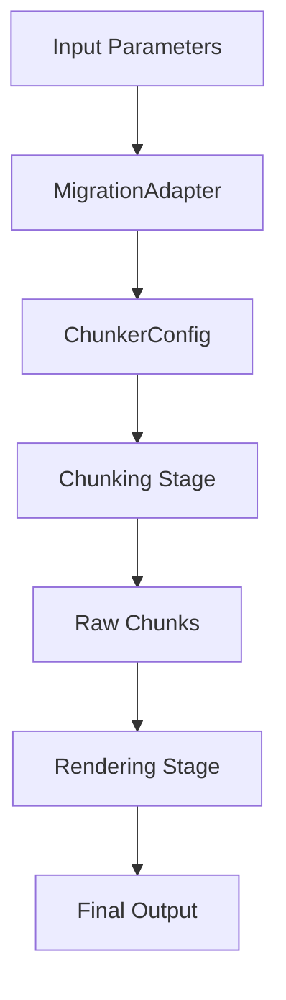
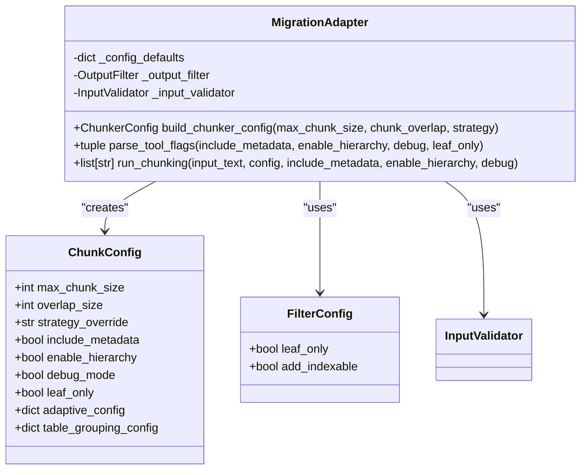
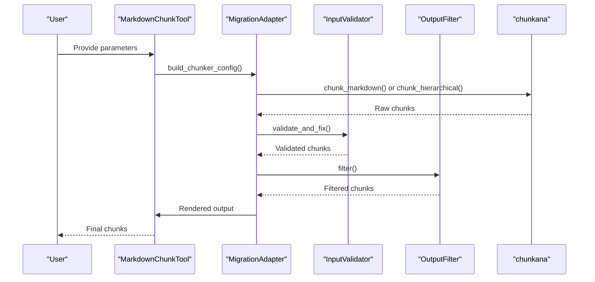
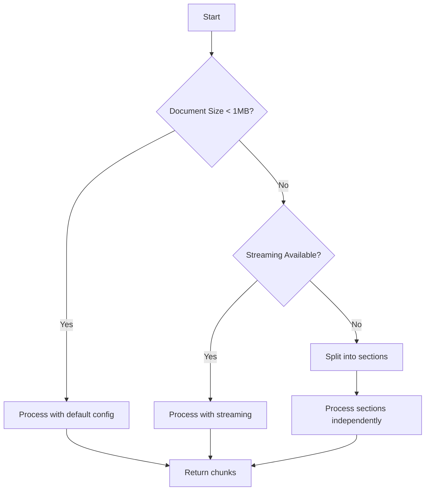

# Configuration

<cite>
**Referenced Files in This Document**   
- [markdown_chunker.yaml](file://provider/markdown_chunker.yaml)
- [markdown_chunk_tool.yaml](file://tools/markdown_chunk_tool.yaml)
- [adapter.py](file://adapter.py)
- [input_validator.py](file://input_validator.py)
- [output_filter.py](file://output_filter.py)
- [configuration.md](file://docs/reference/configuration.md)
- [performance.md](file://docs/guides/performance.md)
- [debug-explain-mode.md](file://docs/research/features/10-debug-explain-mode.md)
</cite>

## Table of Contents
1. [Introduction](#introduction)
2. [Configuration System Overview](#configuration-system-overview)
3. [Core Configuration Parameters](#core-configuration-parameters)
4. [Configuration Profiles](#configuration-profiles)
5. [YAML Configuration Format](#yaml-configuration-format)
6. [Configuration Validation](#configuration-validation)
7. [Advanced Configuration Settings](#advanced-configuration-settings)
8. [Performance Tuning](#performance-tuning)
9. [Best Practices](#best-practices)
10. [Practical Examples](#practical-examples)

## Introduction

The dify-markdown-chunker-1 configuration system provides a flexible and powerful way to control the behavior of the Markdown chunking process. The system supports both simple UI-based configuration through Dify tool parameters and advanced direct configuration through the underlying chunkana library. This document details all configurable parameters, configuration profiles for different document types, the YAML-based configuration format, validation mechanisms, and practical examples for various use cases.

**Section sources**
- [configuration.md](file://docs/reference/configuration.md#L1-L530)

## Configuration System Overview

The configuration system operates at two levels: the Dify plugin UI level and the direct chunkana library level. The plugin UI provides a simplified interface with essential parameters, while direct library usage exposes advanced features for fine-grained control.

The configuration process follows a migration adapter pattern, where the `MigrationAdapter` class in `adapter.py` translates plugin parameters into chunkana configuration objects. This ensures backward compatibility while leveraging the advanced capabilities of the chunkana engine.

The system uses a two-stage processing pipeline:
1. **Chunking stage**: Boundary-invariant processing that determines chunk boundaries
2. **Rendering stage**: Format-dependent processing that applies metadata embedding and output formatting

This separation ensures that chunk boundaries remain consistent regardless of output formatting options like metadata inclusion.


```mermaid
graph TD
A[Input Parameters] --> B[MigrationAdapter]
B --> C[ChunkerConfig]
C --> D[Chunking Stage]
D --> E[Raw Chunks]
E --> F[Rendering Stage]
F --> G[Final Output]
```

**Diagram sources **
- [adapter.py](file://adapter.py#L151-L155)

**Section sources**
- [adapter.py](file://adapter.py#L1-L352)
- [configuration.md](file://docs/reference/configuration.md#L1-L530)

## Core Configuration Parameters

The configuration system exposes several key parameters that control the chunking behavior, including chunk size limits, strategy thresholds, metadata options, and streaming settings.

### Chunk Size and Overlap Parameters

The system provides parameters to control the size of chunks and the overlap between consecutive chunks:

| Parameter | Type | Default | Range | Description |
|---------|------|---------|-------|-------------|
| `max_chunk_size` | number | 4096 | 512-16384 | Maximum chunk size in characters |
| `chunk_overlap` | number | 200 | 0-35% of chunk_size | Overlap between consecutive chunks |

The `max_chunk_size` parameter sets the upper limit for chunk size, while `chunk_overlap` controls the amount of context preserved between chunks. The overlap is capped at 35% of the chunk size to prevent excessive duplication.

### Chunking Strategy Parameters

The system supports multiple chunking strategies that can be selected based on document characteristics:

| Parameter | Type | Default | Options | Description |
|---------|------|---------|---------|-------------|
| `strategy` | select | auto | auto, code_aware, list_aware, structural, fallback | Strategy for chunking the document |

The `auto` strategy automatically detects the best approach based on content analysis, while specific strategies preserve different document structures:
- `code_aware`: Preserves code blocks and their context
- `list_aware`: Preserves list hierarchy and nesting
- `structural`: Uses header-based segmentation
- `fallback`: Simple splitting without structural awareness

### Metadata and Output Control Parameters

Several parameters control metadata inclusion and output formatting:

| Parameter | Type | Default | Description |
|---------|------|---------|-------------|
| `include_metadata` | boolean | true | Embed metadata in chunk text |
| `enable_hierarchy` | boolean | false | Create parent-child relationships between chunks |
| `debug` | boolean | false | Include all chunk types (root, intermediate, leaf) |
| `leaf_only` | boolean | false | Return only leaf chunks (content only, no headers) |

When `include_metadata` is enabled, chunks include a metadata block with information like content type, header path, and line numbers. The `enable_hierarchy` parameter creates a hierarchical structure with navigation metadata, while `leaf_only` filters out structural headers for vector database indexing.


```mermaid
classDiagram
class ChunkConfig {
+int max_chunk_size
+int overlap_size
+str strategy_override
+bool include_metadata
+bool enable_hierarchy
+bool debug_mode
+bool leaf_only
+dict adaptive_config
+dict table_grouping_config
}
class FilterConfig {
+bool leaf_only
+bool add_indexable
}
class MigrationAdapter {
-dict _config_defaults
-OutputFilter _output_filter
-InputValidator _input_validator
+ChunkerConfig build_chunker_config(max_chunk_size, chunk_overlap, strategy)
+tuple parse_tool_flags(include_metadata, enable_hierarchy, debug, leaf_only)
+list[str] run_chunking(input_text, config, include_metadata, enable_hierarchy, debug)
}
MigrationAdapter --> ChunkConfig : "creates"
MigrationAdapter --> FilterConfig : "uses"
MigrationAdapter --> InputValidator : "uses"
```

**Diagram sources **
- [adapter.py](file://adapter.py#L94-L119)
- [output_filter.py](file://output_filter.py#L16-L22)

**Section sources**
- [markdown_chunk_tool.yaml](file://tools/markdown_chunk_tool.yaml#L38-L167)
- [configuration.md](file://docs/reference/configuration.md#L30-L45)

## Configuration Profiles

The system supports configuration profiles optimized for different document types and use cases. These profiles adjust parameters to handle specific content characteristics effectively.

### Code-Heavy Documents

For documents with significant code content, such as technical documentation or source code files, the following configuration is recommended:

```yaml
config:
  max_chunk_size: 6144
  chunk_overlap: 200
  strategy: code_aware
  include_metadata: true
  enable_code_context_binding: true
  preserve_before_after_pairs: true
```

This profile uses larger chunk sizes to accommodate complete code blocks, enables code-aware strategy to preserve code structure, and activates code context binding to maintain relationships between code and explanatory text.

### List-Heavy Documents

For documents dominated by lists, such as changelogs or feature lists, use:

```yaml
config:
  strategy: list_aware
  list_ratio_threshold: 0.35
  max_chunk_size: 4096
  chunk_overlap: 100
```

This configuration lowers the list ratio threshold to trigger list-aware processing earlier and preserves list hierarchy across chunk boundaries.

### Scientific and Technical Documents

For scientific documents with mathematical formulas, tables, and complex structures:

```yaml
config:
  max_chunk_size: 4096
  chunk_overlap: 200
  strategy: structural
  group_related_tables: true
  table_grouping_config:
    max_distance_lines: 15
    require_same_section: true
  use_adaptive_sizing: true
  adaptive_config:
    base_size: 1500
    min_scale: 0.5
    max_scale: 1.5
    code_weight: 0.4
    table_weight: 0.3
    list_weight: 0.2
```

This profile enables table grouping to keep related tables together, uses adaptive sizing to adjust chunk size based on content complexity, and preserves structural relationships.

### GitHub READMEs and Technical Documentation

For processing GitHub README files and similar technical documentation:

```yaml
config:
  max_chunk_size: 4096
  chunk_overlap: 200
  strategy: auto
  include_metadata: true
  enable_hierarchy: true
  leaf_only: true
```

This configuration enables hierarchical chunking to capture the document structure while returning only leaf chunks for vector database indexing, ensuring that only content chunks are stored.

**Section sources**
- [configuration.md](file://docs/reference/configuration.md#L271-L296)
- [performance.md](file://docs/guides/performance.md#L73-L83)

## YAML Configuration Format

The configuration system uses a YAML-based format for both the plugin definition and tool parameters. The primary configuration files are `markdown_chunker.yaml` and `markdown_chunk_tool.yaml`.

### Plugin Configuration (markdown_chunker.yaml)

The main plugin configuration file defines the plugin identity and references the tool configuration:

```yaml
identity:
  author: asukhodko
  name: markdown_chunker
  label:
    en_US: Advanced Markdown Chunker
    zh_Hans: 高级 Markdown 分块器
    ru_RU: Продвинутый Markdown чанкер
  description:
    en_US: Advanced Markdown chunking powered by chunkana library with structural awareness for better RAG performance
    zh_Hans: 基于 chunkana 库的高级 Markdown 分块，具有结构感知，提升 RAG 性能
    ru_RU: Продвинутое чанкование Markdown на основе библиотеки chunkana с учётом структуры для улучшения RAG
  icon: icon.svg
  tags:
    - productivity
    - business

tools:
  - tools/markdown_chunk_tool.yaml

extra:
  python:
    source: provider/markdown_chunker.py
```

### Tool Configuration (markdown_chunk_tool.yaml)

The tool configuration file defines the parameters available to users and their properties:

```yaml
identity:
  name: markdown_chunk_tool
  author: asukhodko
  label:
    en_US: Markdown Chunker
    zh_Hans: Markdown 分块器
    ru_RU: Markdown чанкер
  icon: icon.svg

description:
  human:
    en_US: Advanced Markdown chunking with structural awareness for better RAG performance. Powered by chunkana engine, intelligently splits documents while preserving context and structure.
    zh_Hans: 具有结构感知的高级 Markdown 分块，提升 RAG 性能。由 chunkana 引擎驱动，智能分割文档，同时保留上下文和结构。
    ru_RU: Продвинутое чанкование Markdown с учётом структуры для улучшения RAG. Работает на движке chunkana, интеллектуально разделяет документы, сохраняя контекст и структуру.
  llm: |
    A tool for chunking Markdown documents with structural awareness, powered by the chunkana engine.
    
    This tool analyzes Markdown content and intelligently splits it into chunks while preserving document structure,
    maintaining semantic context, supporting configurable chunk size and overlap, and providing rich metadata.
    
    Use this tool when you need to process large Markdown documents for RAG systems.

parameters:
  - name: input_text
    type: string
    required: true
    form: llm
    label:
      en_US: Input Text
      zh_Hans: 输入文本
      ru_RU: Входной текст
    human_description:
      en_US: The Markdown text content to be chunked
      zh_Hans: 要分块的 Markdown 文本内容
      ru_RU: Текстовое содержимое Markdown для разделения на части
    llm_description: The Markdown document text that needs to be split into chunks for processing

  - name: max_chunk_size
    type: number
    required: false
    default: 4096
    form: form
    label:
      en_US: Max Chunk Size
      zh_Hans: 最大块大小
      ru_RU: Максимальный размер части
    human_description:
      en_US: "Maximum size of each chunk in characters (default: 4096)"
      zh_Hans: "每个块的最大字符数（默认：4096）"
      ru_RU: "Максимальный размер каждой части в символах (по умолчанию: 4096)"
    llm_description: Maximum number of characters allowed in each chunk. Larger values create bigger chunks with more context.

  # Additional parameters...
```

The configuration format supports internationalization with multiple language options for labels and descriptions, making the tool accessible to users worldwide.

**Section sources**
- [markdown_chunker.yaml](file://provider/markdown_chunker.yaml#L1-L23)
- [markdown_chunk_tool.yaml](file://tools/markdown_chunk_tool.yaml#L1-L178)

## Configuration Validation

The system includes robust validation mechanisms to ensure configuration integrity and handle edge cases gracefully.

### Input Validation

The `InputValidator` class in `input_validator.py` validates and fixes data from the chunkana library to ensure resilience to library changes and missing fields:

```python
class InputValidator:
    """Validates and fixes data from chunkana library."""

    def validate_and_fix(
        self, chunks: list[dict[str, Any]]
    ) -> list[dict[str, Any]]:
        """
        Validate chunks and set default values for missing fields.

        Args:
            chunks: Raw chunks from chunkana

        Returns:
            Validated chunks with defaults applied
        """
        for i, chunk in enumerate(chunks):
            metadata = chunk.get("metadata", {})

            # Set default for is_leaf if missing
            if "is_leaf" not in metadata:
                metadata["is_leaf"] = True
                logger.warning(
                    f"[ChunkanaAdapter] Chunk {i} missing is_leaf, defaulting to True"
                )

            # Set default for is_root if missing
            if "is_root" not in metadata:
                metadata["is_root"] = False

            chunk["metadata"] = metadata

        return chunks
```

This validation ensures that critical metadata fields like `is_leaf` and `is_root` are always present, setting sensible defaults when they are missing from the chunkana output.

### Configuration Defaults

The system maintains a snapshot of configuration defaults in `config_defaults_snapshot.json` to ensure backward compatibility:

```json
{
  "captured_at": "pre-migration",
  "defaults": {
    "max_chunk_size": 4096,
    "min_chunk_size": 512,
    "overlap_size": 200,
    "preserve_atomic_blocks": true,
    "extract_preamble": true,
    "code_threshold": 0.3,
    "structure_threshold": 3,
    "list_ratio_threshold": 0.4,
    "list_count_threshold": 5,
    "strategy_override": null,
    "enable_code_context_binding": true,
    "max_context_chars_before": 500,
    "max_context_chars_after": 300,
    "related_block_max_gap": 5,
    "bind_output_blocks": true,
    "preserve_before_after_pairs": true,
    "enable_overlap": true
  }
}
```

These defaults are loaded by the `MigrationAdapter` and merged with user-provided parameters, ensuring consistent behavior across versions.

### Output Filtering

The `OutputFilter` class in `output_filter.py` handles filtering of hierarchical output for downstream consumers:

```python
class OutputFilter:
    """Filters hierarchical output for downstream consumers."""

    def __init__(self, config: FilterConfig | None = None) -> None:
        self.config = config or FilterConfig()

    def filter(
        self, chunks: list[dict[str, Any]], debug: bool = False
    ) -> list[dict[str, Any]]:
        """
        Filter chunks for indexing.

        Args:
            chunks: Raw result from chunkana
            debug: Include all chunks for debugging

        Returns:
            Filtered list of chunks with indexable field
        """
        # Add indexable field (respecting library value)
        chunks = self._add_indexable_field(chunks)

        if debug:
            return chunks  # All chunks for debugging

        # Exclude root chunk
        chunks = [
            c for c in chunks if not c.get("metadata", {}).get("is_root", False)
        ]

        # Optionally: filter for indexing (uses indexable, not just is_leaf)
        if self.config.leaf_only:
            chunks = self._filter_for_indexing(chunks)

        return chunks
```

This filtering ensures that only appropriate chunks are returned based on the configuration, such as excluding root chunks and filtering for leaf-only mode.


```mermaid
sequenceDiagram
participant User as "User"
participant Tool as "MarkdownChunkTool"
participant Adapter as "MigrationAdapter"
participant Validator as "InputValidator"
participant Filter as "OutputFilter"
participant Chunker as "chunkana"
User->>Tool : Provide parameters
Tool->>Adapter : build_chunker_config()
Adapter->>Chunker : chunk_markdown() or chunk_hierarchical()
Chunker-->>Adapter : Raw chunks
Adapter->>Validator : validate_and_fix()
Validator-->>Adapter : Validated chunks
Adapter->>Filter : filter()
Filter-->>Adapter : Filtered chunks
Adapter->>Tool : Rendered output
Tool-->>User : Final chunks
```

**Diagram sources **
- [input_validator.py](file://input_validator.py#L14-L45)
- [output_filter.py](file://output_filter.py#L24-L58)
- [adapter.py](file://adapter.py#L151-L155)

**Section sources**
- [input_validator.py](file://input_validator.py#L1-L46)
- [output_filter.py](file://output_filter.py#L1-L116)
- [config_defaults_snapshot.json](file://tests/config_defaults_snapshot.json#L1-L22)

## Advanced Configuration Settings

The system supports several advanced configuration settings that provide fine-grained control over the chunking process.

### Debug and Explain Mode

The debug mode provides detailed insights into the chunking process, including all chunk types (root, intermediate, and leaf) when hierarchical chunking is enabled. This is particularly useful for understanding the chunking decisions and debugging suboptimal results.

The explain mode, documented in `debug-explain-mode.md`, provides detailed explanations of why specific chunking decisions were made:

```python
class ExplainResult:
    """Full result with explanations."""
    chunks: list[Chunk]
    strategy_used: str
    explanations: list[ChunkExplanation]
    global_decisions: list[Decision]
    
    def print_report(self) -> None:
        """Print human-readable report."""
        print(f"=== Chunking Explanation ===\n")
        print(f"Strategy: {self.strategy_used}")
        print(f"Total chunks: {len(self.chunks)}\n")
        
        print("Global Decisions:")
        for decision in self.global_decisions:
            print(f"  - {decision.description}")
            print(f"    Reason: {decision.reason}")
        
        print("\nChunk Details:")
        for explanation in self.explanations:
            print(f"\n  Chunk {explanation.chunk_index} "
                  f"(lines {explanation.start_line}-{explanation.end_line}):")
            for decision in explanation.decisions:
                print(f"    - {decision.description}")
```

This feature helps users understand why the chunker made specific decisions about boundaries and strategy selection, making it easier to debug and optimize results.

### Strategy Overrides

The system allows for strategy overrides to force specific chunking behavior regardless of content analysis:

```python
def build_chunker_config(
    self,
    max_chunk_size: int = 4096,
    chunk_overlap: int = 200,
    strategy: str = "auto",
) -> ChunkerConfig:
    """Build ChunkerConfig from tool parameters."""
    strategy_override = None if strategy == "auto" else strategy
    
    config_dict = self._config_defaults.copy()
    config_dict.update(
        {
            "max_chunk_size": max_chunk_size,
            "overlap_size": chunk_overlap,
            "strategy_override": strategy_override,
            "validate_invariants": True,
            "strict_mode": False,
        }
    )
    
    unsupported_params = {"enable_overlap"}
    filtered_config = {
        k: v for k, v in config_dict.items() if k not in unsupported_params
    }
    
    return ChunkerConfig(**filtered_config)
```

When `strategy` is set to a specific value (e.g., "code_aware"), the `strategy_override` parameter is set accordingly. When set to "auto", the override is `None`, allowing the system to automatically select the best strategy based on content analysis.

### Adaptive Sizing

The adaptive sizing feature automatically adjusts chunk size based on content complexity:

```python
config = ChunkConfig(
    use_adaptive_sizing=True,
    adaptive_config=AdaptiveSizeConfig(
        base_size=1500,
        min_scale=0.5,
        max_scale=1.5,
        code_weight=0.4,
        table_weight=0.3,
        list_weight=0.2,
        sentence_length_weight=0.1
    )
)
```

This configuration dynamically scales chunk size between 750 and 2250 characters based on the content's complexity, with different weights assigned to code, tables, lists, and sentence length.

**Section sources**
- [debug-explain-mode.md](file://docs/research/features/10-debug-explain-mode.md#L1-L405)
- [adapter.py](file://adapter.py#L94-L119)

## Performance Tuning

The configuration system provides several options for performance tuning based on specific use cases and requirements.

### Performance Characteristics

The system exhibits linear scaling with document size, with predictable performance across different document categories:

| Metric | Value | Context |
|--------|-------|---------|  
| Typical Processing Speed | 5-15ms per 10KB | Medium-sized documents |
| Throughput | 500-2000 KB/s | Varies by content type |
| Memory Efficiency | <0.2 MB per KB | Excluding Python base |
| Scaling | Linear (R² > 0.95) | Up to 1MB documents |

### Configuration Impact on Performance

Different configuration profiles have varying performance impacts:

| Profile | max_chunk_size | overlap_size | Performance Impact | Use Case |
|---------|----------------|--------------|--------------------|-----------|
| Default | 4096 | 200 | Baseline | General purpose |
| Code Heavy | 8192 | 100 | ~10% slower | Technical docs |
| Structured | 4096 | 200 | Baseline | User guides |
| Minimal | 1024 | 50 | ~15% faster | Small chunks |
| No Overlap | 4096 | 0 | ~5% faster | No context needed |

The v2 architecture uses metadata-only overlap, resulting in minimal overhead compared to legacy architectures with physical text duplication.

### Optimization Recommendations

For optimal performance, consider the following recommendations:

1. **Reuse chunker instances** across multiple documents to avoid initialization overhead
2. **Use appropriate configuration profiles** for common use cases
3. **Validate document size** before processing to handle large documents appropriately
4. **Monitor memory usage** in production environments
5. **Disable overlap** when context preservation is not needed to reduce processing time


```mermaid
flowchart TD
A[Start] --> B{Document Size < 1MB?}
B --> |Yes| C[Process with default config]
B --> |No| D{Streaming Available?}
D --> |Yes| E[Process with streaming]
D --> |No| F[Split into sections]
F --> G[Process sections independently]
C --> H[Return chunks]
E --> H
G --> H
```

**Diagram sources **
- [performance.md](file://docs/guides/performance.md#L20-L25)
- [performance.md](file://docs/guides/performance.md#L128-L134)

**Section sources**
- [performance.md](file://docs/guides/performance.md#L1-L502)

## Best Practices

Following these best practices will help ensure optimal configuration and performance:

### Configuration Management

1. **Start with defaults**: The default parameters work well for most RAG use cases
2. **Use hierarchical mode carefully**: Only enable when you need parent-child relationships
3. **Consider chunk_overlap cap**: The plugin caps overlap at 35% of chunk size
4. **Use leaf_only for vector DB**: Filters out structural headers, returning only content chunks

### Environment-Specific Configuration

Use different configurations for different environments:

```python
import os
from chunkana import ChunkConfig

def create_config_from_env() -> ChunkConfig:
    """Create configuration from environment variables."""
    return ChunkConfig(
        max_chunk_size=int(os.getenv("CHUNK_SIZE", "4096")),
        overlap_size=int(os.getenv("CHUNK_OVERLAP", "200")),
        include_metadata=os.getenv("INCLUDE_METADATA", "true").lower() == "true",
        strategy_override=os.getenv("STRATEGY_OVERRIDE", None)
    )

config = create_config_from_env()
```

This approach allows for environment-specific tuning without code changes.

### Content-Adaptive Configuration

Create configurations based on content analysis:

```python
def adaptive_config(md_text: str) -> ChunkConfig:
    """Create configuration based on content analysis."""
    # Quick analysis
    chunker = MarkdownChunker()
    analysis = chunker.analyze_content(md_text)
    
    if analysis.code_ratio > 0.5:
        # Code-heavy document
        return ChunkConfig(
            max_chunk_size=6144,
            strategy_override="code_aware",
            enable_code_context_binding=True,
            preserve_before_after_pairs=True
        )
    elif analysis.list_ratio > 0.4:
        # List-heavy document
        return ChunkConfig(
            strategy_override="list_aware",
            list_ratio_threshold=0.35
        )
    elif analysis.table_count > 3:
        # Table-heavy document
        return ChunkConfig(
            group_related_tables=True,
            table_grouping_config=TableGroupingConfig(
                max_distance_lines=15,
                require_same_section=True
            )
        )
    else:
        # Standard document
        return ChunkConfig.for_dify_rag()

# Use adaptive configuration
config = adaptive_config(markdown_text)
chunker = MarkdownChunker(config)
```

This approach optimizes the configuration for the specific characteristics of each document.

**Section sources**
- [configuration.md](file://docs/reference/configuration.md#L457-L501)

## Practical Examples

Here are practical examples of custom configurations for specific scenarios:

### Processing GitHub READMEs

For GitHub README files, which typically contain a mix of code, text, and structure:

```yaml
- node: process_readme
  type: tool
  tool: advanced_markdown_chunker
  config:
    max_chunk_size: 4096
    chunk_overlap: 200
    strategy: auto
    include_metadata: true
    enable_hierarchy: true
    leaf_only: true
```

This configuration enables hierarchical chunking to capture the document structure while returning only leaf chunks for vector database indexing, ensuring that only content chunks are stored.

### Technical Documentation Processing

For technical documentation with extensive code examples:

```yaml
- node: process_docs
  type: tool
  tool: advanced_markdown_chunker
  config:
    max_chunk_size: 6144
    chunk_overlap: 200
    strategy: code_aware
    include_metadata: true
    enable_hierarchy: true
```

This configuration uses larger chunk sizes to accommodate complete code blocks and enables code-aware strategy to preserve code structure and context.

### Clean Text Output for Analysis

For scenarios requiring clean text output without metadata:

```yaml
- node: clean_output
  type: tool
  tool: advanced_markdown_chunker
  config:
    max_chunk_size: 2048
    chunk_overlap: 100
    include_metadata: false
```

This configuration disables metadata embedding, instead embedding the overlap directly into the chunk text as `previous_content + main + next_content`.

### Debugging and Analysis

For debugging chunking behavior and understanding decisions:

```yaml
- node: debug_chunks
  type: tool
  tool: advanced_markdown_chunker
  config:
    max_chunk_size: 4096
    enable_hierarchy: true
    debug: true
    leaf_only: false
```

This configuration enables debug mode to include all chunks (root, intermediate, and leaf), providing complete visibility into the hierarchical structure for analysis.

**Section sources**
- [configuration.md](file://docs/reference/configuration.md#L48-L98)