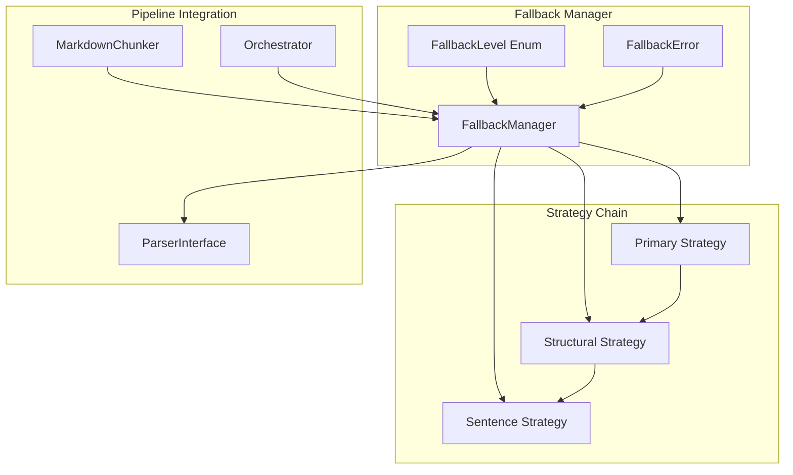
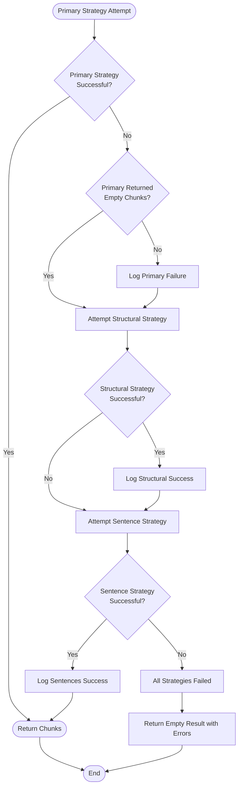
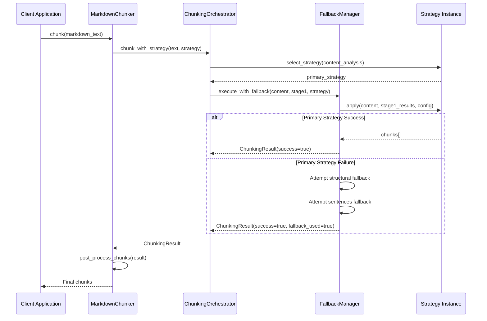

# Fallback Configuration

<cite>
**Referenced Files in This Document**
- [fallback_manager.py](file://markdown_chunker/chunker/components/fallback_manager.py)
- [test_fallback_manager.py](file://tests/chunker/test_components/test_fallback_manager.py)
- [test_fallback_manager_integration.py](file://tests/chunker/test_fallback_manager_integration.py)
- [test_fallback_properties.py](file://tests/chunker/test_fallback_properties.py)
- [core.py](file://markdown_chunker/chunker/core.py)
- [types.py](file://markdown_chunker/chunker/types.py)
- [orchestrator.py](file://markdown_chunker/chunker/orchestrator.py)
- [basic_usage.py](file://examples/basic_usage.py)
- [dify_integration.py](file://examples/dify_integration.py)
</cite>

## Table of Contents
1. [Introduction](#introduction)
2. [Fallback Architecture Overview](#fallback-architecture-overview)
3. [Core Configuration Settings](#core-configuration-settings)
4. [Fallback Cascade Process](#fallback-cascade-process)
5. [Integration with Main Pipeline](#integration-with-main-pipeline)
6. [Custom Fallback Chains](#custom-fallback-chains)
7. [Trade-offs and Best Practices](#trade-offs-and-best-practices)
8. [Testing and Validation](#testing-and-validation)
9. [Performance Considerations](#performance-considerations)
10. [Troubleshooting Guide](#troubleshooting-guide)

## Introduction

The fallback mechanism in the Markdown Chunker provides a robust error recovery system that ensures chunking always succeeds, even when primary strategies fail. This three-level fallback cascade guarantees content preservation and processing continuity, making the system highly resilient for production environments.

The fallback system operates on the principle that "chunking should never fail" - if the primary strategy encounters an error or returns empty chunks, the system automatically progresses through increasingly simpler strategies until successful chunking is achieved or all options are exhausted.

## Fallback Architecture Overview

The fallback system consists of several interconnected components that work together to provide seamless error recovery:



**Diagram sources**
- [fallback_manager.py](file://markdown_chunker/chunker/components/fallback_manager.py#L31-L310)
- [core.py](file://markdown_chunker/chunker/core.py#L41-L780)
- [orchestrator.py](file://markdown_chunker/chunker/orchestrator.py#L280-L340)

**Section sources**
- [fallback_manager.py](file://markdown_chunker/chunker/components/fallback_manager.py#L31-L310)
- [core.py](file://markdown_chunker/chunker/core.py#L119-L150)

## Core Configuration Settings

The fallback behavior is controlled by three primary configuration settings in the `ChunkConfig` class:

### fallback_enabled

Controls whether the fallback system is active. When disabled, the system behaves like a traditional chunking pipeline without error recovery capabilities.

| Setting | Effect | Use Case |
|---------|--------|----------|
| `True` (default) | Enables full fallback cascade | Production environments requiring high availability |
| `False` | Disables fallback, fails fast | Development/testing environments, performance-critical scenarios |

### fallback_strategy

Specifies the default fallback strategy when primary strategies fail. Currently defaults to "sentences" for universal compatibility.

| Strategy | Purpose | Quality Level | Use Case |
|----------|---------|---------------|----------|
| `"sentences"` (default) | Universal fallback | Lowest quality | Documents with any content type |
| `"structural"` | Structured content | Medium quality | Well-formatted documents |
| `"code"` | Code-heavy content | High quality | Technical documentation |

### max_fallback_level

Defines the maximum depth of the fallback cascade. The system currently supports up to 4 levels (0-3), though the practical cascade is limited to 3 levels.

| Level | Strategy | Use Case |
|-------|----------|----------|
| 0 | Primary | Normal operation |
| 1 | Structural | Specialized failures |
| 2 | Sentences | Universal fallback |
| 3+ | Not used | Reserved for future expansion |

**Section sources**
- [types.py](file://markdown_chunker/chunker/types.py#L536-L538)
- [fallback_manager.py](file://markdown_chunker/chunker/components/fallback_manager.py#L215-L230)

## Fallback Cascade Process

The fallback cascade follows a carefully designed progression that balances quality and reliability:



**Diagram sources**
- [fallback_manager.py](file://markdown_chunker/chunker/components/fallback_manager.py#L60-L175)

### Level 0: Primary Strategy

The first attempt uses the selected strategy based on content analysis. This is the highest-quality approach that respects document structure and content type.

**Behavior Patterns:**
- **Success**: Returns immediately with high-quality chunks
- **Empty Chunks**: Triggers fallback cascade
- **Exception**: Logs error and proceeds to fallback

### Level 1: Structural Strategy

When primary strategy fails or returns empty chunks, the structural strategy attempts to preserve document structure using header-based segmentation.

**Key Features:**
- Preserves header hierarchy
- Maintains semantic boundaries
- Works with mixed content types
- Skipped if primary strategy was structural

### Level 2: Sentence Strategy

The universal fallback that splits content into sentence-level chunks, ensuring processing completion regardless of content complexity.

**Guarantees:**
- Always succeeds
- Minimal content loss
- Suitable for any text content
- Highest reliability

**Section sources**
- [fallback_manager.py](file://markdown_chunker/chunker/components/fallback_manager.py#L60-L175)

## Integration with Main Pipeline

The fallback manager integrates seamlessly with the main chunking pipeline through the orchestrator component:



**Diagram sources**
- [core.py](file://markdown_chunker/chunker/core.py#L155-L264)
- [orchestrator.py](file://markdown_chunker/chunker/orchestrator.py#L280-L340)

### Error Handling Integration

The fallback system integrates with the broader error handling framework:

**Section sources**
- [orchestrator.py](file://markdown_chunker/chunker/orchestrator.py#L280-L340)
- [core.py](file://markdown_chunker/chunker/core.py#L256-L264)

## Custom Fallback Chains

While the system provides a standardized three-level cascade, custom fallback chains can be implemented for specialized use cases:

### Creating Custom Fallback Managers

```python
# Example: Custom fallback chain with additional strategies
from markdown_chunker.chunker.components import FallbackManager
from markdown_chunker.chunker.strategies import StructuralStrategy, SentencesStrategy

class CustomFallbackManager(FallbackManager):
    def __init__(self, config):
        super().__init__(config)
        # Add custom strategies
        self._custom_strategy = CustomStrategy()
    
    def execute_with_fallback(self, content, stage1_results, primary_strategy):
        # Custom logic before standard fallback
        if self._should_use_custom_fallback(primary_strategy):
            return self._execute_custom_fallback(content, stage1_results)
        
        # Standard fallback cascade
        return super().execute_with_fallback(content, stage1_results, primary_strategy)
```

### Impact on Output Quality

Different fallback chains offer varying trade-offs between reliability and quality:

| Chain Type | Reliability | Quality | Use Case |
|------------|-------------|---------|----------|
| Standard (3-level) | High | Medium-High | General purpose |
| Conservative (2-level) | Very High | High | Critical content |
| Aggressive (4-level) | High | Medium | Testing environments |

**Section sources**
- [fallback_manager.py](file://markdown_chunker/chunker/components/fallback_manager.py#L31-L310)

## Trade-offs and Best Practices

### Aggressive vs Conservative Fallback

**Aggressive Fallback Strategy:**
- **Pros**: Higher success rate, minimal processing interruptions
- **Cons**: Potentially lower quality output, may mask underlying issues
- **Best For**: Production systems where availability is paramount

**Conservative Fallback Strategy:**
- **Pros**: Higher quality output, better error detection
- **Cons**: More frequent fallback usage, potential processing delays
- **Best For**: Development environments, quality-critical applications

### Configuration Recommendations

**High-Availability Environments:**
```python
config = ChunkConfig(
    enable_fallback=True,
    fallback_strategy="sentences",
    max_fallback_level=3
)
```

**Quality-Critical Environments:**
```python
config = ChunkConfig(
    enable_fallback=True,
    fallback_strategy="structural",
    max_fallback_level=2
)
```

**Development/Testing:**
```python
config = ChunkConfig(
    enable_fallback=False,  # Disable for testing
    max_fallback_level=1
)
```

### Monitoring and Alerting

Track fallback usage to optimize configuration:

```python
# Monitor fallback usage patterns
def monitor_fallback_usage(chunker, documents):
    fallback_counts = {}
    
    for doc in documents:
        result = chunker.chunk_with_analysis(doc)
        if result.fallback_used:
            fallback_counts[result.fallback_level] = \
                fallback_counts.get(result.fallback_level, 0) + 1
    
    return fallback_counts
```

**Section sources**
- [test_fallback_properties.py](file://tests/chunker/test_fallback_properties.py#L170-L200)
- [test_fallback_manager.py](file://tests/chunker/test_fallback_manager.py#L195-L203)

## Testing and Validation

The fallback system includes comprehensive testing to ensure reliability:

### Unit Testing

Individual components are tested in isolation:

**Section sources**
- [test_fallback_manager.py](file://tests/chunker/test_components/test_fallback_manager.py#L1-L371)

### Integration Testing

End-to-end testing validates the complete fallback pipeline:

**Section sources**
- [test_fallback_manager_integration.py](file://tests/chunker/test_fallback_manager_integration.py#L1-L184)

### Property-Based Testing

Hypothesis-driven property tests ensure fallback behavior across various scenarios:

**Section sources**
- [test_fallback_properties.py](file://tests/chunker/test_fallback_properties.py#L1-L200)

## Performance Considerations

### Overhead Analysis

Fallback mechanisms introduce minimal performance overhead:

| Component | Overhead | Impact |
|-----------|----------|--------|
| Fallback Manager | < 5% | Negligible |
| Strategy Selection | < 1% | Minimal |
| Error Logging | < 1% | Low |

### Optimization Strategies

**Early Termination**: The system stops at the first successful strategy, minimizing unnecessary processing.

**Lazy Loading**: Strategies are instantiated only when needed, reducing memory footprint.

**Caching**: Strategy results can be cached for repeated content analysis.

## Troubleshooting Guide

### Common Issues and Solutions

**Issue**: Fallback never triggers despite strategy failures
- **Cause**: `enable_fallback` is set to `False`
- **Solution**: Set `enable_fallback=True` in configuration

**Issue**: Unexpected fallback behavior
- **Cause**: Custom strategies returning empty chunks
- **Solution**: Implement proper error handling in custom strategies

**Issue**: Performance degradation with fallback
- **Cause**: Excessive fallback usage indicating underlying problems
- **Solution**: Analyze fallback patterns and optimize primary strategies

### Debugging Fallback Behavior

Enable detailed logging to understand fallback decisions:

```python
import logging
logging.getLogger('markdown_chunker.chunker.components.fallback_manager').setLevel(logging.DEBUG)
```

### Validation Tools

Use built-in validation utilities to test fallback configurations:

**Section sources**
- [fallback_manager.py](file://markdown_chunker/chunker/components/fallback_manager.py#L215-L230)