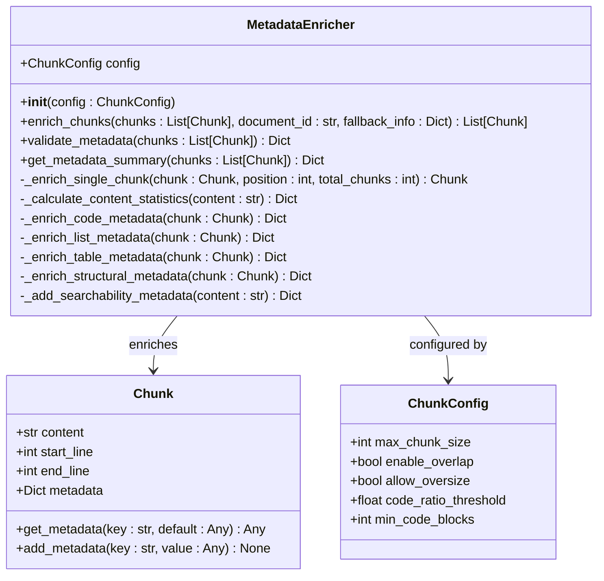
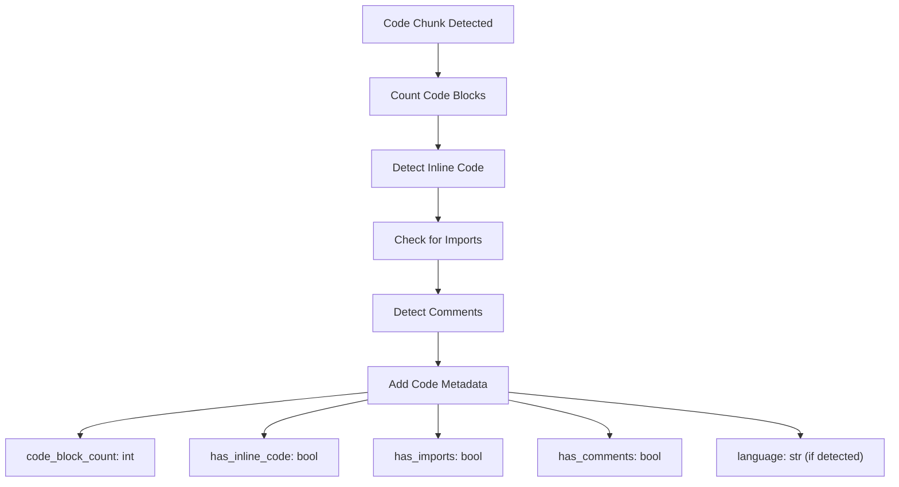
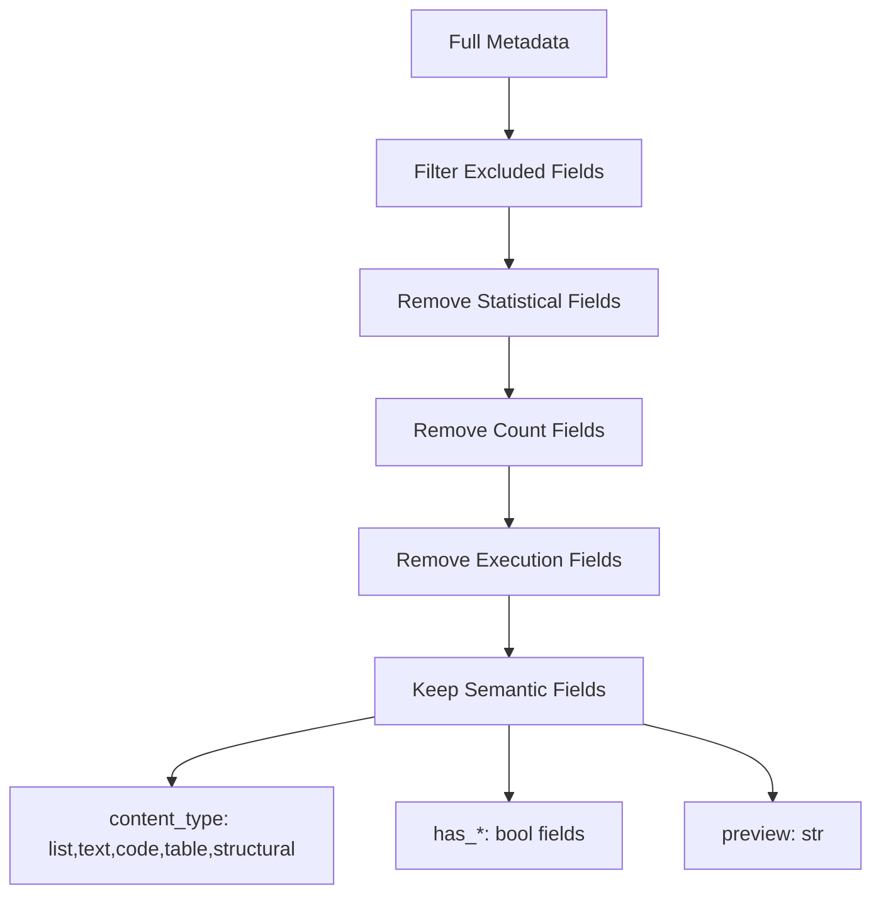
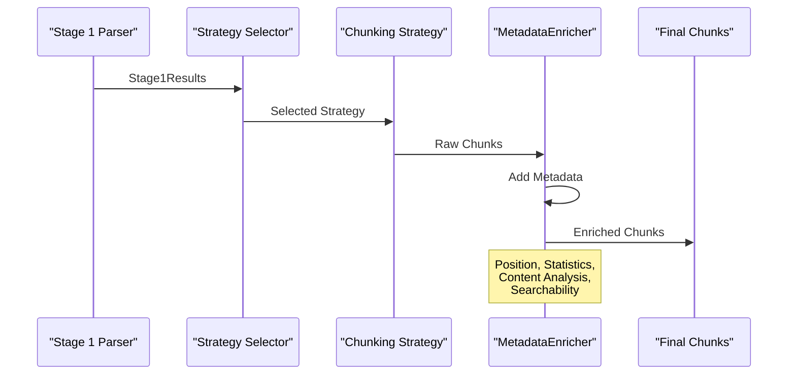

# Metadata Enrichment Settings

<cite>
**Referenced Files in This Document**
- [metadata_enricher.py](file://markdown_chunker/chunker/components/metadata_enricher.py)
- [types.py](file://markdown_chunker/chunker/types.py)
- [orchestrator.py](file://markdown_chunker/chunker/orchestrator.py)
- [test_metadata_enricher.py](file://tests/chunker/test_components/test_metadata_enricher.py)
- [basic_usage.py](file://examples/basic_usage.py)
- [tutorial.md](file://tests/fixtures/real_documents/tutorial.md)
- [technical_spec.md](file://tests/fixtures/real_documents/technical_spec.md)
- [metadata.json](file://tests/fixtures/real_documents/metadata.json)
- [markdown_chunk_tool.py](file://tools/markdown_chunk_tool.py)
- [markdown_chunk_tool.yaml](file://tools/markdown_chunk_tool.yaml)
</cite>

## Table of Contents
1. [Introduction](#introduction)
2. [MetadataEnricher Component](#metadataenricher-component)
3. [Core Configuration Flags](#core-configuration-flags)
4. [Metadata Field Categories](#metadata-field-categories)
5. [Strategy-Specific Enrichment](#strategy-specific-enrichment)
6. [Enriched Output Examples](#enriched-output-examples)
7. [Performance Implications](#performance-implications)
8. [Selective Enrichment Strategies](#selective-enrichment-strategies)
9. [Integration Points](#integration-points)
10. [Best Practices](#best-practices)

## Introduction

The metadata enrichment system in the Python Markdown Chunker provides comprehensive contextual information about each chunk, enabling advanced downstream applications like search filtering, UI rendering, and content analysis. The system automatically adds strategic metadata based on content type, structure, and processing characteristics.

Metadata enrichment enhances chunks with:
- **Positional Information**: Chunk index, total chunks, first/last indicators
- **Content Analysis**: Word count, line count, character statistics
- **Structure Detection**: Headers, lists, tables, code blocks
- **Searchability Features**: Preview text, URL/email detection, formatting markers
- **Processing Context**: Strategy used, fallback information, execution details

## MetadataEnricher Component

The [`MetadataEnricher`](file://markdown_chunker/chunker/components/metadata_enricher.py) class serves as the central component for adding comprehensive metadata to chunks. It operates as a standalone processor that can be integrated at various stages of the chunking pipeline.



**Diagram sources**
- [metadata_enricher.py](file://markdown_chunker/chunker/components/metadata_enricher.py#L13-L414)
- [types.py](file://markdown_chunker/chunker/types.py#L36-L190)

**Section sources**
- [metadata_enricher.py](file://markdown_chunker/chunker/components/metadata_enricher.py#L13-L414)

## Core Configuration Flags

### enable_metadata_enrichment

While not explicitly shown as a flag in the codebase, metadata enrichment is controlled through the configuration system. The enrichment process runs automatically when chunks are processed, and can be influenced through various configuration parameters.

### include_headers

Headers are automatically detected and enriched through the structural analysis phase. The system identifies header levels (H1-H6) and creates hierarchical path information.

### include_code_language

Language detection is automatic for code blocks. The system extracts language identifiers from fenced code blocks and adds them as metadata fields.

### Other Configuration Impact

Several configuration parameters indirectly control metadata enrichment:

| Parameter | Impact on Metadata | Description |
|-----------|-------------------|-------------|
| `preserve_code_blocks` | `language`, `code_block_count` | Enables language detection and code block counting |
| `preserve_tables` | `table_row_count`, `table_count` | Enables table structure detection |
| `preserve_list_hierarchy` | `ordered_item_count`, `unordered_item_count` | Enables list structure analysis |
| `max_chunk_size` | `allow_oversize`, `oversize_reason` | Influences chunk size metadata |

**Section sources**
- [types.py](file://markdown_chunker/chunker/types.py#L574-L620)

## Metadata Field Categories

### General Positional Metadata

These fields provide positional information about the chunk within the document and chunk sequence:

| Field | Type | Description | Example |
|-------|------|-------------|---------|
| `chunk_index` | int | Zero-based position in chunk sequence | `0`, `1`, `2` |
| `total_chunks` | int | Total number of chunks in document | `15` |
| `is_first_chunk` | bool | True if this is the first chunk | `True` |
| `is_last_chunk` | bool | True if this is the last chunk | `False` |
| `document_id` | str | Optional document identifier | `"doc_123"` |

### Content Statistics

Statistical information about the chunk's content:

| Field | Type | Description | Calculation |
|-------|------|-------------|-------------|
| `word_count` | int | Number of words in chunk | `len(content.split())` |
| `line_count` | int | Number of lines in chunk | `len(content.split('\n'))` |
| `char_count` | int | Number of characters in chunk | `len(content)` |
| `avg_line_length` | float | Average line length | `char_count / line_count` |
| `avg_word_length` | float | Average word length | `sum(len(w) for w in words) / word_count` |

### Searchability Metadata

Fields optimized for search and retrieval applications:

| Field | Type | Description | Usage |
|-------|------|-------------|-------|
| `preview` | str | First line or sentence as preview | Search result snippets |
| `has_urls` | bool | Contains URLs | Link detection |
| `has_emails` | bool | Contains email addresses | Contact information |
| `has_numbers` | bool | Contains numeric content | Data identification |
| `has_bold` | bool | Contains bold formatting | Emphasis detection |
| `has_italic` | bool | Contains italic formatting | Style detection |
| `has_inline_code` | bool | Contains inline code | Code presence |

**Section sources**
- [metadata_enricher.py](file://markdown_chunker/chunker/components/metadata_enricher.py#L144-L327)

## Strategy-Specific Enrichment

Different content types receive specialized metadata based on their structural characteristics:

### Code Block Enrichment

For chunks containing code content:



**Diagram sources**
- [metadata_enricher.py](file://markdown_chunker/chunker/components/metadata_enricher.py#L165-L198)

**Code Metadata Fields:**
- `code_block_count`: Number of fenced code blocks
- `has_inline_code`: Presence of inline code (`backticks`)
- `has_imports`: Import statements detection
- `has_comments`: Comment presence detection
- `language`: Programming language identifier

### List Enrichment

For chunks containing list content:

**List Metadata Fields:**
- `ordered_item_count`: Number of numbered list items
- `unordered_item_count`: Number of bullet list items
- `task_item_count`: Number of checkbox list items
- `has_nested_lists`: Presence of indented nested lists
- `nested_item_count`: Number of nested list items

### Table Enrichment

For chunks containing table content:

**Table Metadata Fields:**
- `table_row_count`: Number of table rows
- `table_count`: Number of distinct tables
- `has_column_alignment`: Presence of column alignment markers

### Structural Enrichment

For chunks with header-based structure:

**Structural Metadata Fields:**
- `header_count`: Total number of headers
- `min_header_level`: Lowest header level (1-6)
- `max_header_level`: Highest header level (1-6)
- `paragraph_count`: Number of paragraphs (excluding headers)

**Section sources**
- [metadata_enricher.py](file://markdown_chunker/chunker/components/metadata_enricher.py#L165-L287)

## Enriched Output Examples

### Technical Specification Document Example

Based on the [`technical_spec.md`](file://tests/fixtures/real_documents/technical_spec.md) document, enriched chunks would contain:

```json
{
  "content": "# Technical Specification: Markdown Chunking System\n\n**Document Version:** 2.0.0...",
  "start_line": 1,
  "end_line": 20,
  "metadata": {
    "chunk_index": 0,
    "total_chunks": 30,
    "is_first_chunk": true,
    "is_last_chunk": false,
    "strategy": "structural",
    "content_type": "structured",
    "word_count": 150,
    "line_count": 20,
    "char_count": 1200,
    "header_count": 3,
    "min_header_level": 1,
    "max_header_level": 3,
    "paragraph_count": 5,
    "preview": "# Technical Specification: Markdown Chunking System...",
    "has_urls": true,
    "has_bold": true,
    "has_italic": false
  }
}
```

### Tutorial Document Example

Based on the [`tutorial.md`](file://tests/fixtures/real_documents/tutorial.md) document:

```json
{
  "content": "```python\nfrom markdown_chunker import MarkdownChunker\n\n# Create a chunker with default settings\nchunker = MarkdownChunker()\n```",
  "start_line": 33,
  "end_line": 38,
  "metadata": {
    "chunk_index": 5,
    "total_chunks": 25,
    "is_first_chunk": false,
    "is_last_chunk": false,
    "strategy": "code",
    "content_type": "code",
    "word_count": 45,
    "line_count": 5,
    "char_count": 200,
    "code_block_count": 1,
    "has_inline_code": false,
    "has_imports": true,
    "has_comments": false,
    "language": "python",
    "preview": "```python...",
    "has_urls": false,
    "has_bold": false,
    "has_italic": false
  }
}
```

**Section sources**
- [tutorial.md](file://tests/fixtures/real_documents/tutorial.md#L33-L38)
- [technical_spec.md](file://tests/fixtures/real_documents/technical_spec.md#L1-L20)

## Performance Implications

### Computational Overhead

Metadata enrichment introduces computational overhead through several mechanisms:

1. **Pattern Matching**: Regular expressions for detecting code, lists, tables, and formatting
2. **Content Analysis**: Word/line counting and statistical calculations
3. **String Processing**: Multiple passes over content for different metadata types
4. **Memory Allocation**: Creation of metadata dictionaries and temporary data structures

### Scaling Considerations

| Document Size | Typical Processing Time | Memory Usage | Bottleneck |
|---------------|------------------------|--------------|------------|
| 5KB | <5ms | <1MB | Pattern matching |
| 50KB | <50ms | <5MB | Content analysis |
| 500KB | <500ms | <50MB | String processing |
| 1MB+ | <2s | <100MB | All components |

### Optimization Strategies

1. **Selective Processing**: Skip enrichment for non-critical use cases
2. **Caching**: Cache expensive computations for repeated documents
3. **Streaming**: Process large documents in chunks to reduce memory pressure
4. **Lazy Evaluation**: Defer expensive operations until metadata is actually needed

**Section sources**
- [metadata_enricher.py](file://markdown_chunker/chunker/components/metadata_enricher.py#L144-L163)

## Selective Enrichment Strategies

### RAG-Optimized Filtering

For Retrieval-Augmented Generation applications, the system provides selective metadata filtering:



**Diagram sources**
- [markdown_chunk_tool.py](file://tools/markdown_chunk_tool.py#L45-L71)

### Custom Metadata Profiles

Users can create custom metadata profiles based on specific use cases:

| Profile | Use Case | Included Fields | Excluded Fields |
|---------|----------|-----------------|-----------------|
| `rag_optimized` | RAG applications | `content_type`, `has_*`, `preview` | Statistical, count, execution fields |
| `search_indexing` | Search engines | `content_type`, `preview`, `has_*` | Size statistics, positioning |
| `analytics` | Content analysis | All fields | None |
| `minimal` | Performance-critical | Essential only | Everything else |

### Conditional Enrichment

Enrichment can be conditionally applied based on:
- Document type classification
- Content complexity thresholds
- Performance budget constraints
- Use case requirements

**Section sources**
- [markdown_chunk_tool.py](file://tools/markdown_chunk_tool.py#L45-L71)

## Integration Points

### Pipeline Integration

The MetadataEnricher integrates seamlessly into the chunking pipeline:



**Diagram sources**
- [orchestrator.py](file://markdown_chunker/chunker/orchestrator.py#L34-L340)
- [metadata_enricher.py](file://markdown_chunker/chunker/components/metadata_enricher.py#L34-L66)

### Configuration Integration

Metadata enrichment responds to configuration changes:

```python
# Configuration affects enrichment behavior
config = ChunkConfig(
    max_chunk_size=2048,
    preserve_code_blocks=True,  # Enables language detection
    preserve_tables=True,       # Enables table analysis
    preserve_list_hierarchy=True  # Enables list structure
)
```

### API Integration

The enrichment system is exposed through multiple API layers:

1. **Direct API**: [`MetadataEnricher.enrich_chunks()`](file://markdown_chunker/chunker/components/metadata_enricher.py#L34-L66)
2. **Pipeline API**: [`MarkdownChunker.chunk()`](file://markdown_chunker/chunker/orchestrator.py#L55-L118)
3. **Analysis API**: [`MarkdownChunker.chunk_with_analysis()`](file://markdown_chunker/chunker/orchestrator.py#L55-L118)

**Section sources**
- [orchestrator.py](file://markdown_chunker/chunker/orchestrator.py#L34-L340)

## Best Practices

### Configuration Guidelines

1. **Use Appropriate Profiles**: Leverage predefined configurations for common use cases
2. **Balance Performance vs. Detail**: Trade off enrichment detail against processing speed
3. **Monitor Resource Usage**: Track memory and CPU impact of enrichment
4. **Validate Metadata**: Use built-in validation tools for quality assurance

### Use Case Optimization

| Use Case | Recommended Approach | Key Considerations |
|----------|---------------------|-------------------|
| RAG Systems | Minimal metadata + RAG profile | Focus on searchability fields |
| Search Engines | Structured metadata | Include preview and content type |
| Content Analysis | Full metadata | All enrichment fields useful |
| Real-time Processing | Selective enrichment | Prioritize speed over completeness |

### Quality Assurance

1. **Validation Testing**: Use [`validate_metadata()`](file://markdown_chunker/chunker/components/metadata_enricher.py#L330-L374) for quality checks
2. **Summary Analysis**: Use [`get_metadata_summary()`](file://markdown_chunker/chunker/components/metadata_enricher.py#L376-L414) for bulk analysis
3. **Edge Case Testing**: Test with various content types and boundary conditions
4. **Performance Benchmarking**: Monitor enrichment performance across document types

### Custom Extensions

For specialized use cases, the enrichment system can be extended:

1. **Custom Enrichers**: Create domain-specific metadata processors
2. **Field Validation**: Implement custom validation rules
3. **Conditional Logic**: Add business-specific enrichment criteria
4. **External Integration**: Connect to external metadata services

**Section sources**
- [test_metadata_enricher.py](file://tests/chunker/test_components/test_metadata_enricher.py#L330-L374)