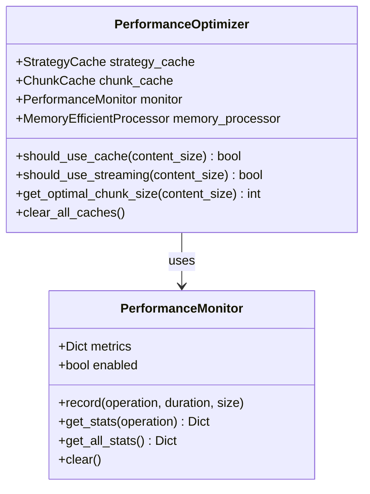
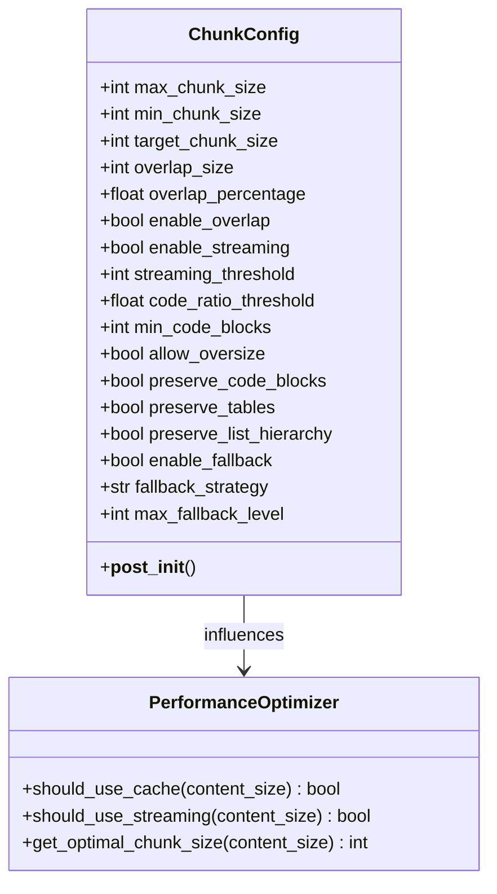
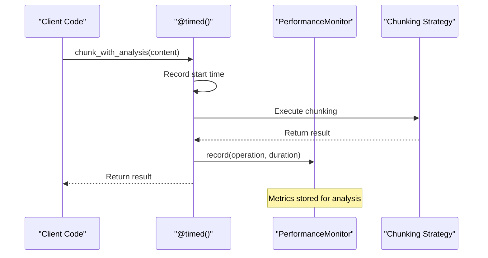
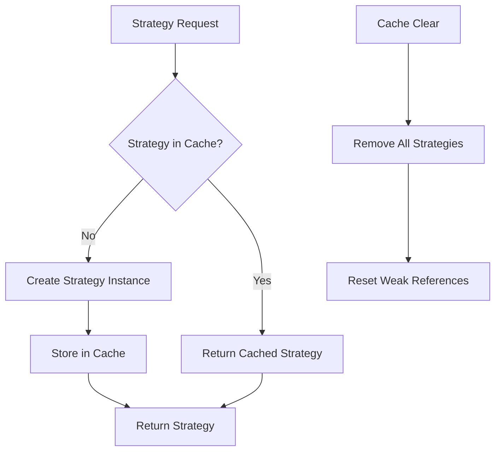
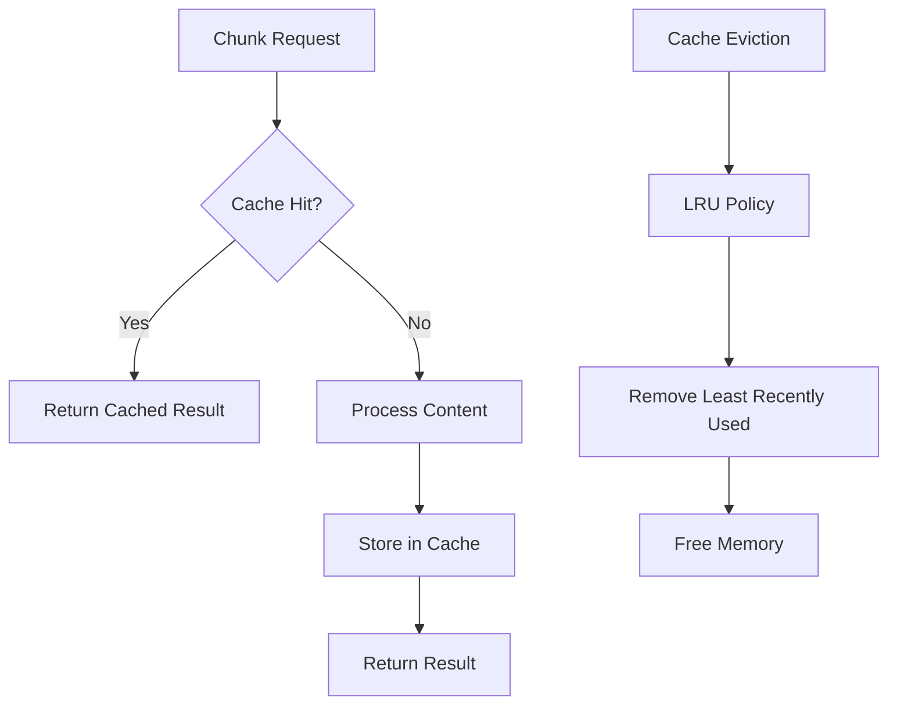
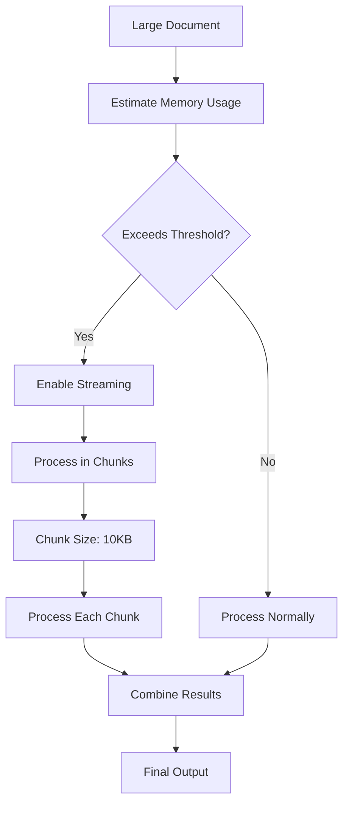
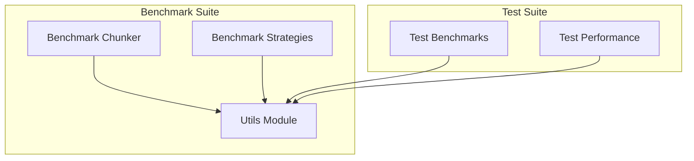
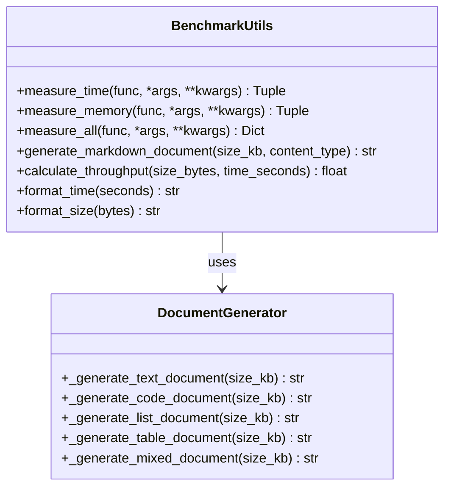
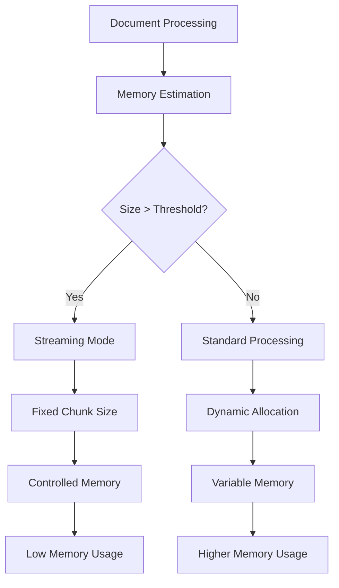

# Performance Configuration

<cite>
**Referenced Files in This Document**
- [markdown_chunker/chunker/performance.py](file://markdown_chunker/chunker/performance.py)
- [markdown_chunker/chunker/types.py](file://markdown_chunker/chunker/types.py)
- [markdown_chunker/chunker/core.py](file://markdown_chunker/chunker/core.py)
- [benchmarks/benchmark_chunker.py](file://benchmarks/benchmark_chunker.py)
- [benchmarks/benchmark_strategies.py](file://benchmarks/benchmark_strategies.py)
- [benchmarks/utils.py](file://benchmarks/utils.py)
- [tests/performance/test_benchmarks.py](file://tests/performance/test_benchmarks.py)
- [tests/chunker/test_performance.py](file://tests/chunker/test_performance.py)
- [examples/basic_usage.py](file://examples/basic_usage.py)
- [examples/dify_integration.py](file://examples/dify_integration.py)
</cite>

## Table of Contents
1. [Introduction](#introduction)
2. [Performance Monitoring System](#performance-monitoring-system)
3. [Core Performance Configuration](#core-performance-configuration)
4. [Performance Optimization Features](#performance-optimization-features)
5. [Configuration Profiles for Different Scenarios](#configuration-profiles-for-different-scenarios)
6. [Benchmarking and Testing](#benchmarking-and-testing)
7. [High-Performance Scenarios](#high-performance-scenarios)
8. [Memory Management and Resource Optimization](#memory-management-and-resource-optimization)
9. [Performance Tuning Guidelines](#performance-tuning-guidelines)
10. [Troubleshooting Performance Issues](#troubleshooting-performance-issues)

## Introduction

The Python Markdown Chunker provides a comprehensive performance configuration system designed to optimize chunking operations across different use cases and environments. This system enables fine-grained control over processing speed, memory usage, and accuracy trade-offs through configurable performance flags, monitoring capabilities, and optimization strategies.

The performance configuration system operates on multiple levels:
- **Runtime Monitoring**: Real-time performance tracking and metrics collection
- **Strategy Optimization**: Intelligent selection of chunking strategies based on content characteristics
- **Resource Management**: Memory-efficient processing for large documents
- **Scalability Controls**: Configurable limits for high-throughput scenarios

## Performance Monitoring System

### PerformanceMonitor Component

The [`PerformanceMonitor`](file://markdown_chunker/chunker/performance.py#L32-L82) class serves as the core component for tracking and analyzing chunking performance metrics.



**Diagram sources**
- [markdown_chunker/chunker/performance.py](file://markdown_chunker/chunker/performance.py#L32-L82)
- [markdown_chunker/chunker/performance.py](file://markdown_chunker/chunker/performance.py#L210-L243)

#### Key Features

| Feature | Description | Configuration |
|---------|-------------|---------------|
| **Operation Tracking** | Records timing for each chunking operation | Automatic via `timed()` decorator |
| **Metric Collection** | Stores duration, size, and timestamp for each operation | Configurable retention |
| **Statistics Calculation** | Provides averages, min/max values, and throughput | Real-time computation |
| **Performance Alerts** | Identifies operations exceeding thresholds | Customizable thresholds |

#### Performance Metrics Available

The monitor collects comprehensive metrics including:

- **Timing Metrics**: Operation duration, average processing time, throughput calculations
- **Size Metrics**: Chunk sizes, memory usage estimates, data throughput
- **Quality Metrics**: Strategy effectiveness, fallback usage rates
- **Resource Metrics**: Memory consumption, cache hit rates

**Section sources**
- [markdown_chunker/chunker/performance.py](file://markdown_chunker/chunker/performance.py#L32-L82)

### Performance Monitoring Activation

Performance monitoring is controlled through the `enable_performance_monitoring` parameter in the [`MarkdownChunker`](file://markdown_chunker/chunker/core.py#L65-L80) constructor:

```python
# Enable performance monitoring
chunker = MarkdownChunker(enable_performance_monitoring=True)

# Collect metrics during processing
chunks = chunker.chunk(large_document)

# Retrieve performance statistics
stats = chunker.get_performance_stats()
print(f"Average chunk time: {stats['chunk']['avg_time']:.3f}s")
```

**Section sources**
- [markdown_chunker/chunker/core.py](file://markdown_chunker/chunker/core.py#L65-L80)
- [markdown_chunker/chunker/core.py](file://markdown_chunker/chunker/core.py#L661-L718)

## Core Performance Configuration

### ChunkConfig Performance Parameters

The [`ChunkConfig`](file://markdown_chunker/chunker/types.py#L498-L608) class provides extensive performance tuning options:



**Diagram sources**
- [markdown_chunker/chunker/types.py](file://markdown_chunker/chunker/types.py#L498-L608)
- [markdown_chunker/chunker/performance.py](file://markdown_chunker/chunker/performance.py#L210-L243)

#### Key Performance Parameters

| Parameter | Purpose | Default | Impact |
|-----------|---------|---------|---------|
| `max_chunk_size` | Maximum chunk size in characters | 4096 | Higher values improve throughput but reduce granularity |
| `min_chunk_size` | Minimum chunk size in characters | 512 | Prevents overly small chunks that waste processing |
| `target_chunk_size` | Desired average chunk size | 2048 | Balances processing efficiency with semantic coherence |
| `overlap_size` | Context overlap between chunks | 200 | Enables context preservation for RAG applications |
| `overlap_percentage` | Percentage of chunk size for overlap | 0.1 | Dynamic overlap sizing based on chunk size |
| `enable_overlap` | Enable context overlap | True | Increases processing time but improves semantic continuity |
| `enable_streaming` | Enable memory-efficient streaming | False | Reduces memory usage for large documents |
| `streaming_threshold` | Size threshold for streaming | 10MB | Automatically switches to streaming mode |

**Section sources**
- [markdown_chunker/chunker/types.py](file://markdown_chunker/chunker/types.py#L498-L608)

### Timing and Measurement Features

The system provides sophisticated timing capabilities through the `timed()` decorator and performance monitoring infrastructure:



**Diagram sources**
- [markdown_chunker/chunker/performance.py](file://markdown_chunker/chunker/performance.py#L84-L104)

**Section sources**
- [markdown_chunker/chunker/performance.py](file://markdown_chunker/chunker/performance.py#L84-L104)

## Performance Optimization Features

### Strategy Caching System

The [`StrategyCache`](file://markdown_chunker/chunker/performance.py#L13-L30) implements lazy loading and caching for chunking strategies:



**Diagram sources**
- [markdown_chunker/chunker/performance.py](file://markdown_chunker/chunker/performance.py#L13-L30)

#### Benefits of Strategy Caching

- **Reduced Initialization Overhead**: Strategies are created only when needed
- **Memory Efficiency**: Weak references prevent memory leaks
- **Improved Performance**: Repeated operations reuse cached instances

**Section sources**
- [markdown_chunker/chunker/performance.py](file://markdown_chunker/chunker/performance.py#L13-L30)

### Chunk Result Caching

The [`ChunkCache`](file://markdown_chunker/chunker/performance.py#L121-L166) provides intelligent caching for chunk results:



**Diagram sources**
- [markdown_chunker/chunker/performance.py](file://markdown_chunker/chunker/performance.py#L121-L166)

#### Cache Configuration Options

| Parameter | Description | Default | Tuning Guidance |
|-----------|-------------|---------|-----------------|
| `max_size` | Maximum number of cached results | 100 | Increase for frequent identical processing |
| `Content Hashing` | MD5 hash of content + config | Automatic | Ensures cache key uniqueness |
| `LRU Eviction` | Least recently used policy | Built-in | Maintains optimal cache utilization |

**Section sources**
- [markdown_chunker/chunker/performance.py](file://markdown_chunker/chunker/performance.py#L121-L166)

### Memory-Efficient Processing

The [`MemoryEfficientProcessor`](file://markdown_chunker/chunker/performance.py#L184-L208) handles large documents with controlled memory usage:



**Diagram sources**
- [markdown_chunker/chunker/performance.py](file://markdown_chunker/chunker/performance.py#L184-L208)

#### Memory Optimization Strategies

- **Streaming Mode**: Processes documents in fixed-size chunks (10KB default)
- **Memory Estimation**: Rough calculation of processing overhead (50% of content size)
- **Automatic Threshold Detection**: Switches to streaming for documents >1MB

**Section sources**
- [markdown_chunker/chunker/performance.py](file://markdown_chunker/chunker/performance.py#L184-L208)

## Configuration Profiles for Different Scenarios

### Default Configuration

The [`default()`](file://markdown_chunker/chunker/types.py#L667-L692) configuration provides balanced settings for general use:

```python
config = ChunkConfig.default()
# max_chunk_size: 4096
# min_chunk_size: 512  
# target_chunk_size: 2048
# enable_overlap: True
# overlap_size: 200
```

### Code-Heavy Documents

Optimized for technical documentation with extensive code examples:

```python
config = ChunkConfig.for_code_heavy()
# max_chunk_size: 6144
# target_chunk_size: 3072
# code_ratio_threshold: 0.5
# overlap_size: 300
# preserve_code_blocks: True
```

### RAG-Optimized Configuration

Designed for Retrieval-Augmented Generation applications:

```python
config = ChunkConfig.for_dify_rag()
# max_chunk_size: 2048
# overlap_size: 200
# enable_overlap: True
# target_chunk_size: 2048
```

### Search Indexing Profile

Optimized for search engine indexing:

```python
config = ChunkConfig.for_search_indexing()
# max_chunk_size: 1024
# enable_overlap: False
# preserve_code_blocks: False
```

### Chat Context Profile

Tailored for LLM chat applications:

```python
config = ChunkConfig.for_chat_context()
# max_chunk_size: 1536 (optimal for embedding models)
# overlap_size: 150
# enable_overlap: True
```

**Section sources**
- [markdown_chunker/chunker/types.py](file://markdown_chunker/chunker/types.py#L667-L800)

## Benchmarking and Testing

### Benchmark Infrastructure

The system includes comprehensive benchmarking capabilities through the [`benchmarks`](file://benchmarks/) directory:



**Diagram sources**
- [benchmarks/benchmark_chunker.py](file://benchmarks/benchmark_chunker.py#L1-L195)
- [benchmarks/benchmark_strategies.py](file://benchmarks/benchmark_strategies.py#L1-L96)
- [tests/performance/test_benchmarks.py](file://tests/performance/test_benchmarks.py#L1-L319)

### Performance Testing Framework

The [`test_benchmarks`](file://tests/performance/test_benchmarks.py) module validates performance requirements:

| Test Category | Purpose | Targets |
|---------------|---------|---------|
| **Small Documents** | < 1KB content | < 0.1s processing time |
| **Medium Documents** | ~10KB content | < 1.0s processing time |
| **Large Documents** | ~100KB content | < 5.0s processing time |
| **Memory Usage** | Consistent memory behavior | No significant growth |
| **Performance Regression** | Detect performance degradation | < 100ms variance |

### Benchmark Utilities

The [`utils.py`](file://benchmarks/utils.py) module provides essential benchmarking functions:



**Diagram sources**
- [benchmarks/utils.py](file://benchmarks/utils.py#L12-L259)

**Section sources**
- [benchmarks/benchmark_chunker.py](file://benchmarks/benchmark_chunker.py#L1-L195)
- [benchmarks/benchmark_strategies.py](file://benchmarks/benchmark_strategies.py#L1-L96)
- [tests/performance/test_benchmarks.py](file://tests/performance/test_benchmarks.py#L1-L319)
- [benchmarks/utils.py](file://benchmarks/utils.py#L1-L259)

## High-Performance Scenarios

### Large Document Processing

For documents exceeding 1MB, the system automatically enables streaming mode:

```python
# Automatic streaming for large documents
config = ChunkConfig(streaming_threshold=10*1024*1024)  # 10MB
chunker = MarkdownChunker(config)

# Manual streaming control
if len(large_document) > config.streaming_threshold:
    # Process in chunks to control memory usage
    processor = MemoryEfficientProcessor(chunk_size=10000)
    results = processor.process_in_chunks(large_document, chunker.chunk)
```

### High-Throughput Applications

For applications requiring maximum throughput:

```python
# Optimized configuration for speed
config = ChunkConfig(
    max_chunk_size=8192,      # Larger chunks reduce overhead
    min_chunk_size=1024,      # Prevents tiny chunks
    enable_overlap=False,     # Disable overlap for speed
    enable_fallback=False,    # Skip fallback for consistency
    allow_oversize=True       # Allow oversized chunks when needed
)

# Enable caching for repeated processing
chunker = MarkdownChunker(config, enable_performance_monitoring=True)
```

### Batch Processing Optimization

For processing multiple documents efficiently:

```python
# Pre-warm strategies
chunker = MarkdownChunker()

# Process multiple documents with shared resources
documents = [doc1, doc2, doc3]
results = []

for doc in documents:
    # Reuse cached strategies
    result = chunker.chunk(doc)
    results.append(result)
    
    # Clear caches periodically for memory management
    if len(results) % 100 == 0:
        chunker.clear_caches()
```

**Section sources**
- [markdown_chunker/chunker/performance.py](file://markdown_chunker/chunker/performance.py#L210-L243)
- [markdown_chunker/chunker/types.py](file://markdown_chunker/chunker/types.py#L783-L800)

## Memory Management and Resource Optimization

### Memory Usage Patterns

The system implements several memory optimization strategies:



**Diagram sources**
- [markdown_chunker/chunker/performance.py](file://markdown_chunker/chunker/performance.py#L184-L208)

### Resource-Constrained Environments

For environments with limited memory:

```python
# Conservative memory configuration
config = ChunkConfig(
    max_chunk_size=2048,      # Smaller chunks
    min_chunk_size=256,       # Prevent tiny chunks
    enable_streaming=True,    # Force streaming
    streaming_threshold=5*1024*1024,  # 5MB threshold
    enable_overlap=False      # Disable overlap
)

# Manual memory management
chunker = MarkdownChunker(config)

# Process documents individually and clear caches
for document in document_list:
    result = chunker.chunk(document)
    # Process result immediately
    process_chunks(result)
    # Clear caches to free memory
    chunker.clear_caches()
```

### Cache Size Management

Control cache sizes to balance performance and memory usage:

```python
# Configure chunk cache size
chunk_cache = ChunkCache(max_size=50)  # Reduced from default 100

# Monitor cache performance
optimizer = PerformanceOptimizer()
print(f"Cache hit rate: {optimizer.cache_hit_rate:.2%}")
print(f"Current cache size: {chunk_cache.size()}")

# Adjust based on memory constraints
if memory_available < 1024*1024*100:  # 100MB
    chunk_cache.max_size = 25  # Reduce cache size
```

**Section sources**
- [markdown_chunker/chunker/performance.py](file://markdown_chunker/chunker/performance.py#L121-L166)
- [markdown_chunker/chunker/performance.py](file://markdown_chunker/chunker/performance.py#L210-L243)

## Performance Tuning Guidelines

### Balancing Speed and Accuracy

Different use cases require different trade-offs:

| Use Case | Priority | Recommended Settings | Expected Performance |
|----------|----------|---------------------|---------------------|
| **Real-time Chat** | Speed | `max_chunk_size=1536, enable_overlap=True` | < 50ms per chunk |
| **RAG Systems** | Accuracy | `max_chunk_size=2048, overlap_size=200` | < 200ms per chunk |
| **Search Indexing** | Speed | `max_chunk_size=1024, enable_overlap=False` | < 100ms per chunk |
| **Documentation** | Quality | `max_chunk_size=4096, preserve_structure=True` | < 500ms per chunk |

### Computational Intensity Considerations

For computationally intensive strategies:

```python
# Code-heavy documents benefit from specialized strategies
config = ChunkConfig.for_code_heavy()

# Mixed content documents may require fallback strategies
config = ChunkConfig(
    enable_fallback=True,
    fallback_strategy="sentences",
    max_fallback_level=3
)

# Monitor fallback usage
chunker = MarkdownChunker(config, enable_performance_monitoring=True)
result = chunker.chunk(mixed_document)

if result.fallback_used:
    print(f"Fallback strategy activated at level {result.fallback_level}")
    # Consider adjusting thresholds for better automatic selection
```

### Performance Monitoring Best Practices

```python
# Enable comprehensive monitoring
chunker = MarkdownChunker(
    enable_performance_monitoring=True
)

# Monitor key metrics
stats = chunker.get_performance_stats()
print(f"Strategy selection time: {stats.get('strategy_selection', {}).get('avg_time', 0):.3f}s")
print(f"Average chunk processing: {stats.get('chunk', {}).get('avg_time', 0):.3f}s")
print(f"Overlap processing: {stats.get('overlap', {}).get('avg_time', 0):.3f}s")

# Set performance alerts
def check_performance_alerts(stats):
    chunk_time = stats.get('chunk', {}).get('avg_time', 0)
    if chunk_time > 0.5:  # 500ms threshold
        print("Warning: Chunk processing time exceeded threshold")
    
    strategy_time = stats.get('strategy_selection', {}).get('avg_time', 0)
    if strategy_time > 0.1:  # 100ms threshold
        print("Warning: Strategy selection time excessive")

check_performance_alerts(stats)
```

**Section sources**
- [markdown_chunker/chunker/core.py](file://markdown_chunker/chunker/core.py#L661-L718)
- [tests/chunker/test_performance.py](file://tests/chunker/test_performance.py#L295-L447)

## Troubleshooting Performance Issues

### Common Performance Problems

#### Slow Chunking Operations

**Symptoms**: Processing times consistently exceed expectations

**Diagnostic Steps**:
```python
# Enable detailed monitoring
chunker = MarkdownChunker(enable_performance_monitoring=True)

# Analyze performance bottlenecks
stats = chunker.get_performance_stats()
print("Performance Analysis:")
for operation, metrics in stats.items():
    print(f"{operation}: avg={metrics['avg_time']:.3f}s, count={metrics['count']}")

# Check strategy selection time
selection_time = stats.get('strategy_selection', {}).get('avg_time', 0)
if selection_time > 0.1:
    print("Consider reducing strategy complexity or increasing thresholds")
```

**Solutions**:
- Increase `max_chunk_size` to reduce overhead
- Disable `enable_overlap` for speed-critical applications
- Use specific strategies instead of automatic selection
- Enable caching for repeated processing

#### High Memory Usage

**Symptoms**: Memory consumption grows unexpectedly

**Diagnostic Steps**:
```python
# Monitor cache sizes
chunker = MarkdownChunker()
chunker.chunk(sample_document)  # Warm up
print(f"Cache size: {chunker._performance_optimizer.chunk_cache.size()}")

# Enable streaming for large documents
config = ChunkConfig(
    enable_streaming=True,
    streaming_threshold=5*1024*1024  # 5MB
)
chunker = MarkdownChunker(config)
```

**Solutions**:
- Enable streaming mode for large documents
- Reduce cache sizes
- Clear caches periodically
- Use smaller chunk sizes

#### Poor Strategy Selection

**Symptoms**: Inappropriate strategies selected for content type

**Diagnostic Steps**:
```python
# Analyze strategy usage
result = chunker.chunk_with_analysis(problematic_document)
print(f"Selected strategy: {result.strategy_used}")
print(f"Content type: {result.content_type}")
print(f"Complexity score: {result.complexity_score}")

# Check thresholds
config = result.chunks[0].metadata.get('config')
print(f"Code ratio threshold: {config.code_ratio_threshold}")
print(f"List ratio threshold: {config.list_ratio_threshold}")
```

**Solutions**:
- Adjust content analysis thresholds
- Use specific strategies for known content types
- Customize configuration profiles
- Implement custom strategy selection logic

### Performance Debugging Tools

```python
# Comprehensive performance analysis
def debug_performance(chunker, document):
    print("=== Performance Debug Analysis ===")
    
    # Warm up
    chunker.chunk(document[:1000])  # Small warm-up
    
    # Full analysis
    start_time = time.time()
    result = chunker.chunk_with_analysis(document)
    total_time = time.time() - start_time
    
    print(f"Total processing time: {total_time:.3f}s")
    print(f"Strategy used: {result.strategy_used}")
    print(f"Chunks generated: {len(result.chunks)}")
    print(f"Processing time: {result.processing_time:.3f}s")
    
    # Detailed breakdown
    stats = chunker.get_performance_stats()
    for operation, metrics in stats.items():
        if metrics['count'] > 0:
            print(f"{operation}: {metrics['avg_time']:.3f}s avg over {metrics['count']} runs")
    
    return result

# Usage
result = debug_performance(chunker, large_document)
```

**Section sources**
- [tests/chunker/test_performance.py](file://tests/chunker/test_performance.py#L295-L447)
- [markdown_chunker/chunker/core.py](file://markdown_chunker/chunker/core.py#L661-L718)