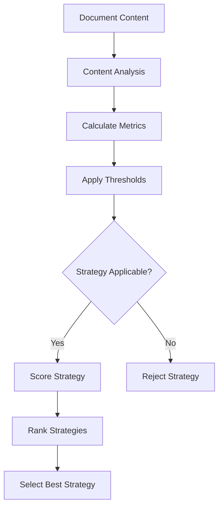
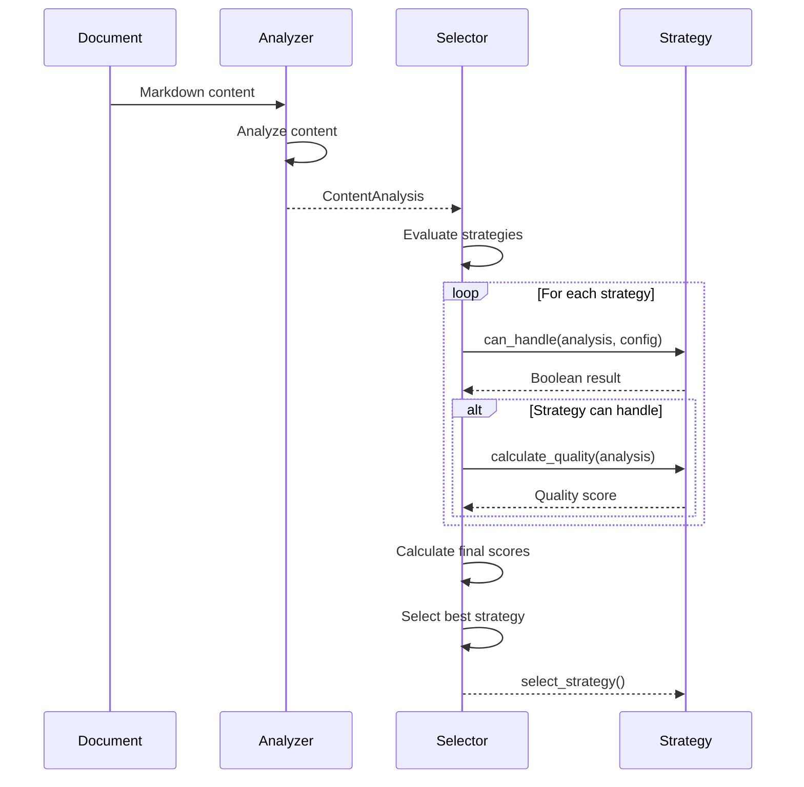
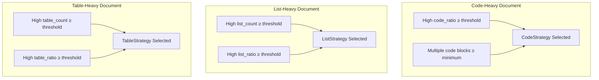
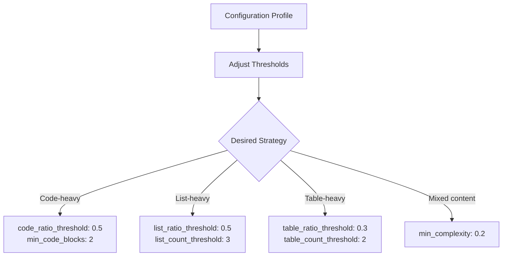

# Strategy Selection Thresholds

<cite>
**Referenced Files in This Document**   
- [selector.py](file://markdown_chunker/chunker/selector.py)
- [analyzer.py](file://markdown_chunker/parser/analyzer.py)
- [types.py](file://markdown_chunker/chunker/types.py)
- [config.py](file://markdown_chunker/parser/config.py)
- [base.py](file://markdown_chunker/chunker/strategies/base.py)
- [code_strategy.py](file://markdown_chunker/chunker/strategies/code_strategy.py)
- [list_strategy.py](file://markdown_chunker/chunker/strategies/list_strategy.py)
- [table_strategy.py](file://markdown_chunker/chunker/strategies/table_strategy.py)
- [code_heavy.md](file://tests/fixtures/code_heavy.md)
- [list_heavy.md](file://tests/fixtures/list_heavy.md)
- [table_heavy.md](file://tests/fixtures/table_heavy.md)
</cite>

## Table of Contents
1. [Introduction](#introduction)
2. [Threshold Parameters](#threshold-parameters)
3. [Strategy Selection Process](#strategy-selection-process)
4. [Default Threshold Values](#default-threshold-values)
5. [Selection Modes](#selection-modes)
6. [Real-World Examples](#real-world-examples)
7. [Strategy-Specific Threshold Logic](#strategy-specific-threshold-logic)
8. [Configuration Profiles](#configuration-profiles)
9. [Conclusion](#conclusion)

## Introduction

The strategy selection system in the Markdown chunker uses configurable thresholds to automatically determine the optimal chunking approach based on content analysis metrics. This document explains how threshold parameters govern automatic strategy selection, how the StrategySelector scores and ranks applicable strategies, and how threshold adjustments can bias selection toward specific strategies. The system analyzes content characteristics such as code ratio, list density, and table density to make intelligent decisions about the most appropriate chunking strategy for a given document.

**Section sources**
- [selector.py](file://markdown_chunker/chunker/selector.py#L1-L322)
- [analyzer.py](file://markdown_chunker/parser/analyzer.py#L1-L499)

## Threshold Parameters

The strategy selection system uses several threshold parameters to evaluate content characteristics and determine the most appropriate chunking strategy. These thresholds are used in conjunction with content analysis metrics to score and rank applicable strategies.

### Core Threshold Parameters

The primary threshold parameters that govern strategy selection are:

- **code_ratio_threshold**: Determines the minimum proportion of code content required for the CodeStrategy to be considered applicable. Documents with code content exceeding this threshold are considered code-heavy.
- **list_ratio_threshold**: Sets the minimum proportion of list content required for the ListStrategy to be applicable. Documents with list content exceeding this threshold are considered list-heavy.
- **table_ratio_threshold**: Establishes the minimum proportion of table content required for the TableStrategy to be applicable.
- **min_complexity**: Defines the minimum complexity score required for the MixedStrategy to be considered.
- **list_count_threshold**: Specifies the minimum number of lists required for the ListStrategy to be applicable regardless of list ratio.
- **table_count_threshold**: Specifies the minimum number of tables required for the TableStrategy to be applicable regardless of table ratio.
- **header_count_threshold**: Determines the minimum number of headers required for the StructuralStrategy to be applicable.

These thresholds work in combination with content analysis metrics to determine which strategies can handle a given document. For example, the CodeStrategy requires both a sufficient code ratio (≥ code_ratio_threshold) and a minimum number of code blocks (≥ min_code_blocks) to be considered applicable.



**Diagram sources**
- [analyzer.py](file://markdown_chunker/parser/analyzer.py#L27-L206)
- [selector.py](file://markdown_chunker/chunker/selector.py#L58-L77)

**Section sources**
- [types.py](file://markdown_chunker/chunker/types.py#L584-L592)
- [analyzer.py](file://markdown_chunker/parser/analyzer.py#L22-L26)

## Strategy Selection Process

The strategy selection process involves analyzing document content, calculating metrics, applying thresholds, and selecting the most appropriate strategy based on the results.

### Content Analysis and Metrics Calculation

The ContentAnalyzer in parser/analyzer.py performs comprehensive analysis of Markdown documents to extract metrics used in strategy selection. This analysis includes:

- Calculating content ratios (code, list, table, text)
- Counting structural elements (headers, lists, tables, code blocks)
- Detecting mixed content based on multiple significant content types
- Calculating document complexity score based on structural, content, and size factors
- Classifying content type (code_heavy, list_heavy, mixed, primary)

The analyzer calculates the proportion of different content types by measuring character counts for code blocks, lists, and tables, then dividing by the total document size. This provides the ratio metrics used by the threshold system.

### Strategy Scoring and Ranking

The StrategySelector uses a two-step process to select the optimal strategy:

1. **Applicability Check**: Each strategy's can_handle() method determines if it can process the content based on threshold criteria.
2. **Scoring and Selection**: Applicable strategies are scored and ranked according to the selection mode.

In weighted mode, the selector calculates a final score for each applicable strategy using a combination of priority and quality score:

```
final_score = (priority_weight × 0.5) + (quality_score × 0.5)
```

Where priority_weight = 1.0 / priority (higher priority = higher weight). The strategy with the highest final score is selected.



**Diagram sources**
- [analyzer.py](file://markdown_chunker/parser/analyzer.py#L27-L206)
- [selector.py](file://markdown_chunker/chunker/selector.py#L100-L133)

**Section sources**
- [selector.py](file://markdown_chunker/chunker/selector.py#L74-L133)
- [analyzer.py](file://markdown_chunker/parser/analyzer.py#L27-L206)

## Default Threshold Values

The default threshold values are defined in the ChunkConfig dataclass and represent balanced settings suitable for most Markdown documents. These defaults provide a sensible starting point for general use cases.

### Default Configuration

The default threshold values are:

- **code_ratio_threshold**: 0.3 (30% code content)
- **min_code_blocks**: 1 (minimum code blocks)
- **min_complexity**: 0.3 (minimum complexity score)
- **list_count_threshold**: 5 (minimum lists)
- **list_ratio_threshold**: 0.6 (60% list content)
- **table_count_threshold**: 3 (minimum tables)
- **table_ratio_threshold**: 0.4 (40% table content)
- **header_count_threshold**: 3 (minimum headers)

These values were chosen to balance sensitivity with robustness, ensuring that strategies are only selected when the document genuinely exhibits the characteristics they are designed to handle.

### Rationale for Default Values

The default threshold values reflect a conservative approach to strategy selection:

- The code_ratio_threshold of 0.3 allows the CodeStrategy to handle documents with substantial code content without requiring an extremely high proportion of code.
- The list_ratio_threshold of 0.6 ensures that only documents with a significant proportion of list content are processed by the ListStrategy.
- The table_ratio_threshold of 0.4 provides a moderate threshold for table-heavy documents.
- Count-based thresholds (list_count_threshold, table_count_threshold) provide an alternative path for strategy selection when content ratios are not sufficient but element counts are high.

These defaults can be overridden through configuration to bias selection toward specific strategies based on use case requirements.

**Section sources**
- [types.py](file://markdown_chunker/chunker/types.py#L584-L592)
- [config.py](file://markdown_chunker/parser/config.py#L15-L22)

## Selection Modes

The strategy selection system supports two modes of operation: strict and weighted. These modes determine how the selector chooses among applicable strategies.

### Strict Mode

In strict mode, the selector uses a priority-based system to select the first applicable strategy. Strategies are evaluated in order of priority (lowest number first), and the first strategy that can handle the content is selected immediately.

This mode provides deterministic behavior and ensures consistent processing for documents with clear content characteristics. It's particularly useful when processing pipelines require predictable behavior.

```python
def _select_strict(self, analysis: ContentAnalysis, config: ChunkConfig) -> BaseStrategy:
    for strategy in self.strategies:
        if strategy.can_handle(analysis, config):
            return strategy
    raise StrategySelectionError("No strategy can handle the content")
```

### Weighted Mode

In weighted mode, the selector evaluates all applicable strategies and selects the one with the highest combined score. The final score combines strategy priority and quality score:

```
final_score = (priority_weight × 0.5) + (quality_score × 0.5)
```

Where:
- priority_weight = 1.0 / priority (higher priority = higher weight)
- quality_score = strategy-specific quality assessment (0.0 to 1.0)

This mode allows for more nuanced decision-making, considering both the inherent priority of strategies and how well-suited they are to the specific content characteristics.

### Mode Selection Implications

The choice between strict and weighted modes has significant implications for processing consistency:

- **Strict mode** provides maximum consistency and predictability, always selecting the highest-priority applicable strategy.
- **Weighted mode** provides more adaptive behavior, potentially selecting different strategies for similar documents based on subtle differences in content metrics.

The mode can be configured based on the requirements of the use case, with strict mode preferred for consistent processing pipelines and weighted mode for applications requiring more adaptive behavior.

```mermaid
graph TD
A[Selection Mode] --> B{Strict?}
B --> |Yes| C[Select first applicable strategy by priority]
B --> |No| D[Score all applicable strategies]
D --> E[Calculate final score: (priority_weight × 0.5) + (quality_score × 0.5)]
E --> F[Select strategy with highest final score]
```

**Diagram sources**
- [selector.py](file://markdown_chunker/chunker/selector.py#L74-L133)

**Section sources**
- [selector.py](file://markdown_chunker/chunker/selector.py#L32-L35)
- [selector.py](file://markdown_chunker/chunker/selector.py#L74-L133)

## Real-World Examples

The strategy selection system's behavior can be demonstrated through real-world examples from test fixtures, showing how threshold-based decision making works in practice.

### Code-Heavy Document Example

The code_heavy.md test fixture contains multiple code blocks with explanatory text. Analysis of this document would yield:

- High code_ratio (approximately 0.7-0.8)
- Multiple code blocks (3+)
- Moderate list and table content
- High complexity score

With default thresholds, this document would trigger the CodeStrategy because:
- code_ratio (0.7-0.8) ≥ code_ratio_threshold (0.3)
- code_block_count (3+) ≥ min_code_blocks (1)

The CodeStrategy would be selected due to its high priority (1) and excellent fit for the content, preserving code block atomicity and maintaining context between code and explanations.

### List-Heavy Document Example

The list_heavy.md test fixture contains numerous nested lists of various types. Analysis would show:

- High list_count (5+ lists)
- High list_ratio (approximately 0.6-0.7)
- Minimal code content
- Moderate table content

This document would trigger the ListStrategy because:
- list_count (5+) ≥ list_count_threshold (5)
- list_ratio (0.6-0.7) ≥ list_ratio_threshold (0.6)

The ListStrategy would preserve list hierarchy and nesting, ensuring parent-child relationships remain intact when chunks are created.

### Table-Heavy Document Example

The table_heavy.md test fixture contains multiple complex tables. Analysis would reveal:

- High table_count (4+ tables)
- High table_ratio (approximately 0.4-0.5)
- Minimal code and list content
- High complexity due to table structure

This document would trigger the TableStrategy because:
- table_count (4+) ≥ table_count_threshold (3)
- table_ratio (0.4-0.5) ≥ table_ratio_threshold (0.4)

The TableStrategy would ensure tables remain intact and properly formatted in the resulting chunks.



**Diagram sources**
- [code_heavy.md](file://tests/fixtures/code_heavy.md)
- [list_heavy.md](file://tests/fixtures/list_heavy.md)
- [table_heavy.md](file://tests/fixtures/table_heavy.md)

**Section sources**
- [code_heavy.md](file://tests/fixtures/code_heavy.md)
- [list_heavy.md](file://tests/fixtures/list_heavy.md)
- [table_heavy.md](file://tests/fixtures/table_heavy.md)

## Strategy-Specific Threshold Logic

Each chunking strategy implements specific threshold logic in its can_handle() method to determine applicability based on content analysis metrics and configuration thresholds.

### CodeStrategy Threshold Logic

The CodeStrategy requires both a sufficient code ratio and minimum code blocks:

```python
def can_handle(self, analysis: ContentAnalysis, config: ChunkConfig) -> bool:
    return (
        analysis.code_ratio >= config.code_ratio_threshold
        and analysis.code_block_count >= config.min_code_blocks
    )
```

This dual requirement ensures that only documents with both a high proportion of code and multiple code blocks are processed by this strategy, preventing it from being selected for documents with a single large code block but otherwise text-heavy content.

### ListStrategy Threshold Logic

The ListStrategy uses an OR condition, allowing selection based on either list count or list ratio:

```python
def can_handle(self, analysis: ContentAnalysis, config: ChunkConfig) -> bool:
    return (
        analysis.list_count >= config.list_count_threshold
        or analysis.list_ratio >= config.list_ratio_threshold
    )
```

This flexible approach accommodates both documents with many small lists and documents with fewer but larger lists.

### TableStrategy Threshold Logic

Similar to the ListStrategy, the TableStrategy uses an OR condition:

```python
def can_handle(self, analysis: ContentAnalysis, config: ChunkConfig) -> bool:
    return (
        analysis.table_count >= config.table_count_threshold
        or analysis.table_ratio >= config.table_ratio_threshold
    )
```

This allows the strategy to handle both documents with multiple small tables and documents with fewer but larger tables.

### MixedStrategy Threshold Logic

The MixedStrategy considers document complexity:

```python
def can_handle(self, analysis: ContentAnalysis, config: ChunkConfig) -> bool:
    return analysis.complexity_score >= config.min_complexity
```

This ensures the strategy is only used for documents with sufficient structural or content complexity to warrant its more sophisticated processing approach.

**Section sources**
- [code_strategy.py](file://markdown_chunker/chunker/strategies/code_strategy.py#L110-L134)
- [list_strategy.py](file://markdown_chunker/chunker/strategies/list_strategy.py#L97-L100)
- [table_strategy.py](file://markdown_chunker/chunker/strategies/table_strategy.py)
- [mixed_strategy.py](file://markdown_chunker/chunker/strategies/mixed_strategy.py)

## Configuration Profiles

The system provides several configuration profiles that adjust threshold values to bias selection toward specific strategies for particular use cases.

### Predefined Configuration Profiles

Several factory methods in ChunkConfig create optimized configurations:

- **for_code_heavy()**: Optimized for technical documentation with aggressive code detection
- **for_structured_docs()**: Optimized for well-organized documentation with clear sections
- **for_large_documents()**: Optimized for books or long articles with streaming enabled
- **for_dify_rag()**: Optimized for RAG (Retrieval-Augmented Generation) systems
- **for_search_indexing()**: Optimized for search applications with small chunks

### Biasing Strategy Selection

Threshold adjustments can bias selection toward specific strategies:

- **Favoring CodeStrategy**: Lower code_ratio_threshold and min_code_blocks to make code detection more aggressive
- **Favoring ListStrategy**: Lower list_ratio_threshold and list_count_threshold
- **Favoring TableStrategy**: Lower table_ratio_threshold and table_count_threshold

For example, the for_code_heavy() profile sets:
- code_ratio_threshold to 0.5 (more aggressive detection)
- min_code_blocks to 2
- overlap_size to 300 (larger for code context)

This biases selection toward the CodeStrategy for technical documentation, API references, and tutorials with extensive code examples.



**Diagram sources**
- [types.py](file://markdown_chunker/chunker/types.py#L695-L738)
- [types.py](file://markdown_chunker/chunker/types.py#L741-L781)

**Section sources**
- [types.py](file://markdown_chunker/chunker/types.py#L695-L781)

## Conclusion

The strategy selection threshold system provides a flexible and configurable approach to automatic chunking strategy selection based on content analysis metrics. By adjusting threshold parameters such as code_ratio_threshold, list_density_threshold, and table_density_threshold, users can bias the selection process toward specific strategies that best suit their use cases.

The system's dual-mode operation (strict and weighted) offers both predictable, priority-based selection and adaptive, score-based selection, allowing users to choose the approach that best fits their processing requirements. The predefined configuration profiles provide optimized settings for common scenarios, while the underlying threshold parameters can be fine-tuned for specialized use cases.

Understanding how these thresholds interact with content analysis metrics and selection modes is crucial for effectively configuring the chunking system to handle diverse document types while maintaining processing consistency.

**Section sources**
- [selector.py](file://markdown_chunker/chunker/selector.py)
- [analyzer.py](file://markdown_chunker/parser/analyzer.py)
- [types.py](file://markdown_chunker/chunker/types.py)