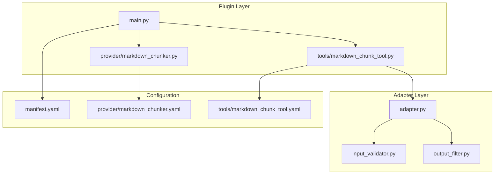
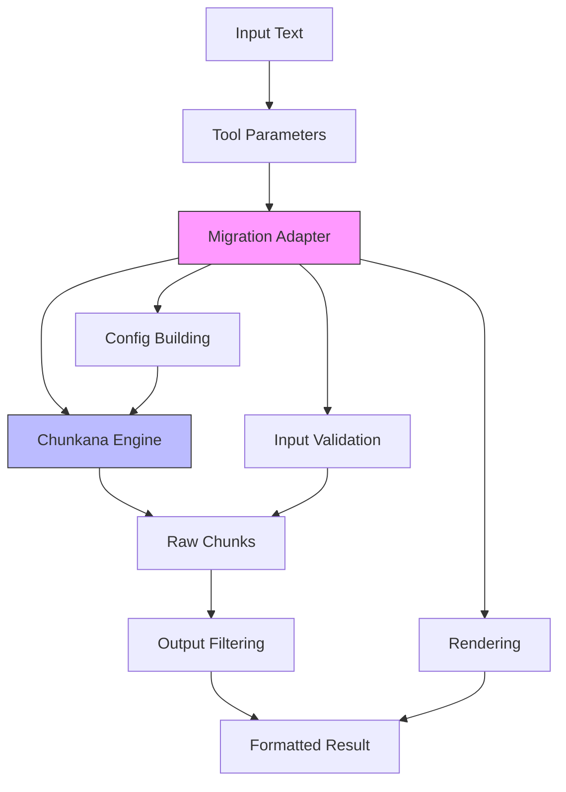
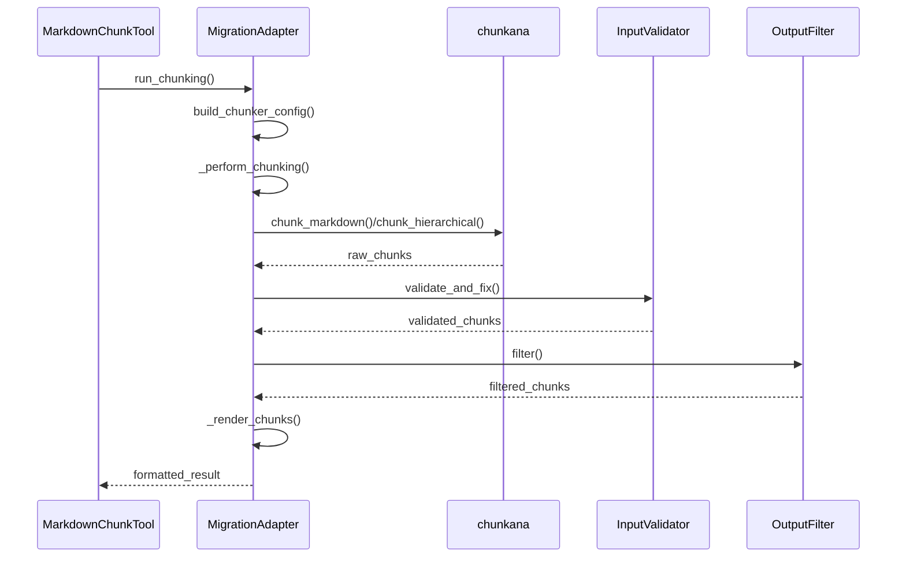
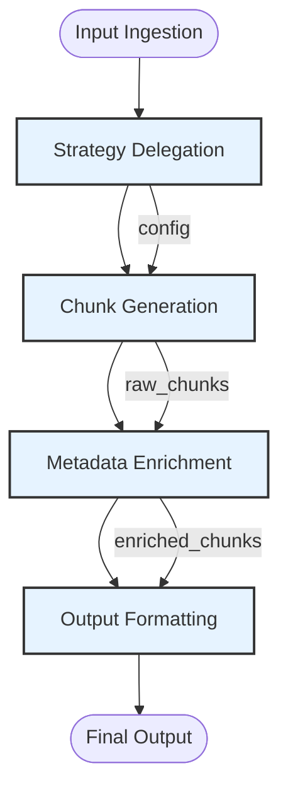
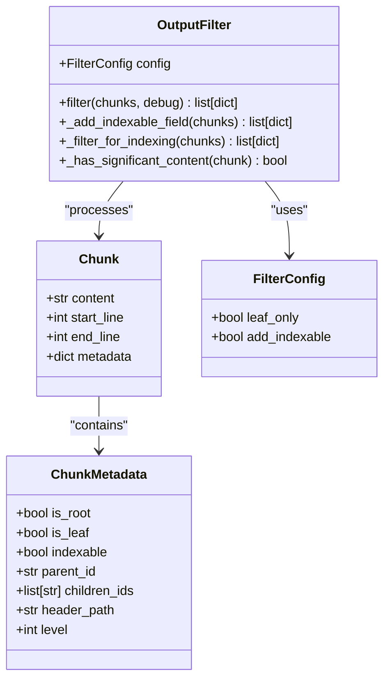
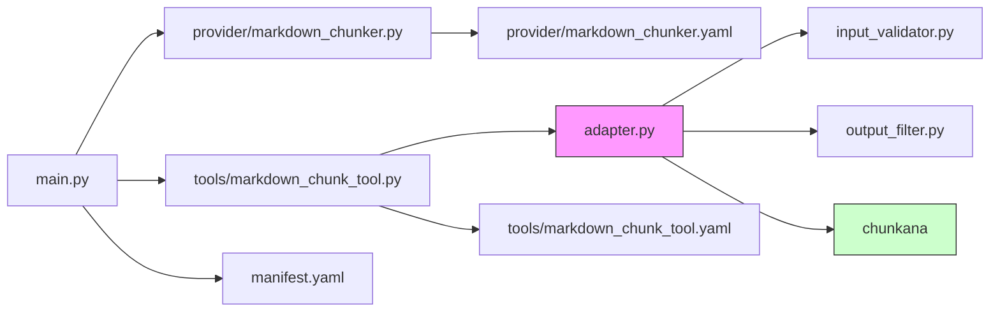

# Chunker Architecture

<cite>
**Referenced Files in This Document**   
- [main.py](file://main.py)
- [provider/markdown_chunker.py](file://provider/markdown_chunker.py)
- [tools/markdown_chunk_tool.py](file://tools/markdown_chunk_tool.py)
- [adapter.py](file://adapter.py)
- [input_validator.py](file://input_validator.py)
- [output_filter.py](file://output_filter.py)
- [manifest.yaml](file://manifest.yaml)
- [provider/markdown_chunker.yaml](file://provider/markdown_chunker.yaml)
- [tools/markdown_chunk_tool.yaml](file://tools/markdown_chunk_tool.yaml)
- [README.md](file://README.md)
</cite>

## Table of Contents
1. [Introduction](#introduction)
2. [Project Structure](#project-structure)
3. [Core Components](#core-components)
4. [Architecture Overview](#architecture-overview)
5. [Detailed Component Analysis](#detailed-component-analysis)
6. [Dependency Analysis](#dependency-analysis)
7. [Performance Considerations](#performance-considerations)
8. [Troubleshooting Guide](#troubleshooting-guide)
9. [Conclusion](#conclusion)

## Introduction
The Advanced Markdown Chunker for Dify is a sophisticated plugin designed to intelligently split Markdown documents into semantically meaningful chunks optimized for Retrieval-Augmented Generation (RAG) systems. Built on the robust chunkana engine, it provides advanced structural awareness that preserves document integrity while enabling efficient information retrieval. The chunker analyzes Markdown structure through AST parsing and automatically selects the optimal chunking strategy based on content analysis, ensuring high-quality output for various document types including technical documentation, changelogs, and API specifications.

## Project Structure
The project follows a modular architecture with clear separation between the Dify plugin interface and the underlying chunkana engine. The core functionality is organized into distinct components that handle different aspects of the chunking process.

**Diagram sources**
- [main.py](file://main.py#L1-L38)
- [provider/markdown_chunker.py](file://provider/markdown_chunker.py#L1-L36)
- [tools/markdown_chunk_tool.py](file://tools/markdown_chunk_tool.py#L1-L126)
- [adapter.py](file://adapter.py#L1-L352)
- [input_validator.py](file://input_validator.py#L1-L46)
- [output_filter.py](file://output_filter.py#L1-L116)
- [manifest.yaml](file://manifest.yaml#L1-L49)
- [provider/markdown_chunker.yaml](file://provider/markdown_chunker.yaml#L1-L23)
- [tools/markdown_chunk_tool.yaml](file://tools/markdown_chunk_tool.yaml#L1-L178)

**Section sources**
- [main.py](file://main.py#L1-L38)
- [provider/markdown_chunker.py](file://provider/markdown_chunker.py#L1-L36)
- [tools/markdown_chunk_tool.py](file://tools/markdown_chunk_tool.py#L1-L126)

## Core Components
The chunker component consists of several interconnected modules that work together to transform raw Markdown input into structured, semantically meaningful chunks. The system employs a migration adapter pattern to seamlessly integrate the chunkana library while maintaining backward compatibility with existing plugin interfaces. Key components include the entry point (main.py), provider class, tool implementation, and adapter layer that bridges the plugin interface with the chunking engine. The architecture supports hierarchical chunking with parent-child relationships, adaptive sizing based on content complexity, and multiple chunking strategies tailored to different document types.

**Section sources**
- [main.py](file://main.py#L1-L38)
- [provider/markdown_chunker.py](file://provider/markdown_chunker.py#L1-L36)
- [tools/markdown_chunk_tool.py](file://tools/markdown_chunk_tool.py#L1-L126)
- [adapter.py](file://adapter.py#L1-L352)

## Architecture Overview
The chunker architecture follows a layered approach with distinct responsibilities at each level. The system begins with input ingestion through the Dify plugin interface, proceeds through strategy delegation and chunk generation, and concludes with metadata enrichment and output formatting. The migration adapter ensures compatibility between the plugin's tool interface and the chunkana library, providing parameter mapping, input validation, and output filtering. This design enables the plugin to leverage advanced chunking capabilities while maintaining exact behavioral compatibility with previous versions.

**Diagram sources**
- [tools/markdown_chunk_tool.py](file://tools/markdown_chunk_tool.py#L47-L126)
- [adapter.py](file://adapter.py#L43-L352)

## Detailed Component Analysis

### Migration Adapter Pattern
The migration adapter is the central component that enables seamless integration between the Dify plugin interface and the chunkana library. It implements a two-stage processing pipeline that separates chunking boundaries from output formatting, ensuring consistent behavior regardless of metadata embedding settings.

**Diagram sources**
- [adapter.py](file://adapter.py#L43-L352)
- [input_validator.py](file://input_validator.py#L1-L46)
- [output_filter.py](file://output_filter.py#L1-L116)

### Chunking Pipeline Stages
The chunking process follows a well-defined pipeline with distinct stages for input processing, strategy selection, chunk generation, and output formatting. Each stage has specific responsibilities and interacts with other components through well-defined interfaces.

**Diagram sources**
- [adapter.py](file://adapter.py#L131-L234)
- [tools/markdown_chunk_tool.py](file://tools/markdown_chunk_tool.py#L73-L120)

### Hierarchical Chunking Implementation
The hierarchical chunking feature creates parent-child relationships between chunks, enabling multi-level retrieval and context navigation. This implementation supports different filtering modes based on use case requirements.

**Diagram sources**
- [adapter.py](file://adapter.py#L27-L116)
- [output_filter.py](file://output_filter.py#L1-L116)

**Section sources**
- [adapter.py](file://adapter.py#L43-L352)
- [output_filter.py](file://output_filter.py#L1-L116)
- [input_validator.py](file://input_validator.py#L1-L46)

## Dependency Analysis
The chunker component has a well-defined dependency structure with clear boundaries between the plugin interface and the underlying chunkana engine. The migration adapter serves as the primary integration point, managing dependencies between the Dify plugin system and the external library.

**Diagram sources**
- [main.py](file://main.py#L1-L38)
- [provider/markdown_chunker.py](file://provider/markdown_chunker.py#L1-L36)
- [tools/markdown_chunk_tool.py](file://tools/markdown_chunk_tool.py#L1-L126)
- [adapter.py](file://adapter.py#L1-L352)

## Performance Considerations
The chunker architecture is designed with performance and memory efficiency in mind, particularly for large documents. The streaming processing capability allows for memory-efficient processing of files larger than 10MB with minimal RAM usage. The system implements a buffer management strategy with a default 100KB window size, ensuring that memory usage stays below 50MB even for very large files. Progress tracking is supported for long-running operations, and the chunking process maintains quality through smart window boundary detection that preserves atomic blocks like code segments and tables.

## Troubleshooting Guide
The chunker includes several mechanisms for error resilience and debugging. The input validator ensures data integrity from the chunkana library, setting default values for missing fields and logging warnings. The output filter provides configurable filtering for hierarchical results, preventing accidental indexing of technical nodes like root and internal nodes. Debug mode can be enabled to include all chunk types in the results, which is useful for troubleshooting hierarchy issues. The system also includes comprehensive logging at different levels (DEBUG, INFO, WARNING, ERROR) to help diagnose problems during chunk generation.

**Section sources**
- [input_validator.py](file://input_validator.py#L1-L46)
- [output_filter.py](file://output_filter.py#L1-L116)
- [adapter.py](file://adapter.py#L131-L234)

## Conclusion
The Advanced Markdown Chunker for Dify represents a sophisticated solution for intelligent document chunking in RAG systems. By combining the power of the chunkana engine with a carefully designed migration adapter, the plugin delivers enterprise-grade chunking capabilities through a user-friendly interface. The architecture supports multiple chunking strategies, hierarchical relationships, and rich metadata enrichment, making it suitable for a wide range of document types and use cases. The system's focus on structural preservation, memory efficiency, and error resilience ensures reliable performance even with complex or large documents.