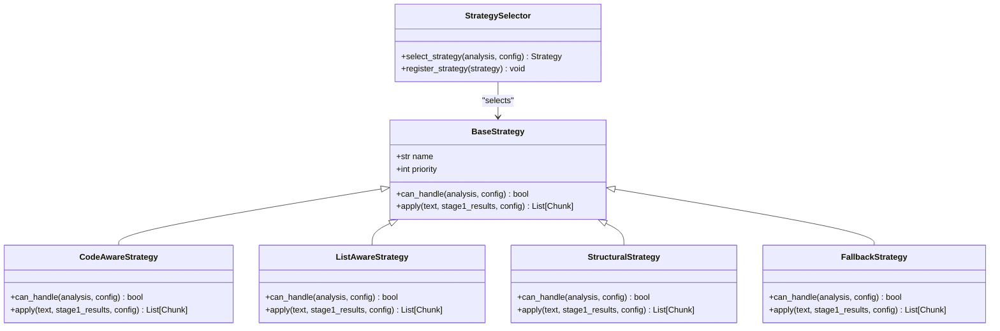
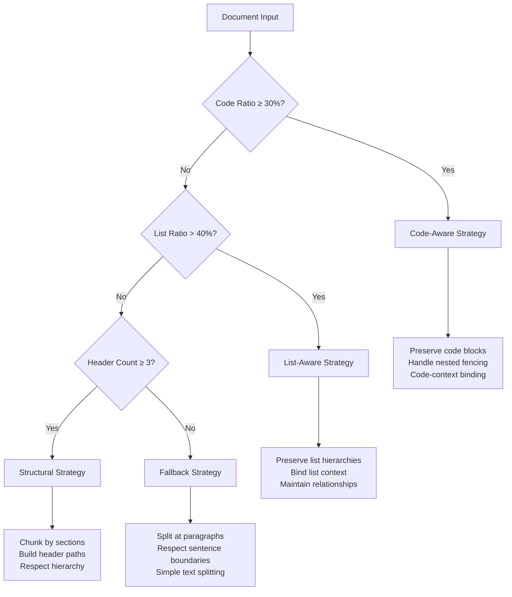
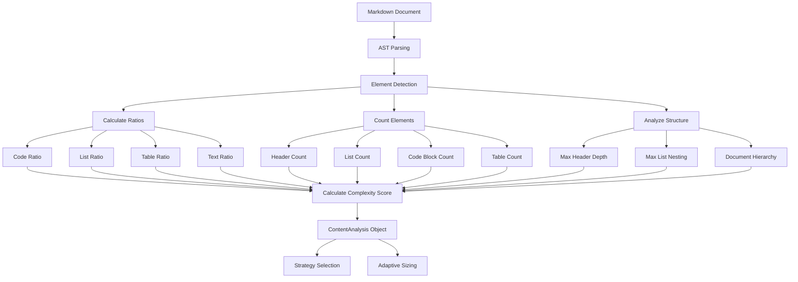
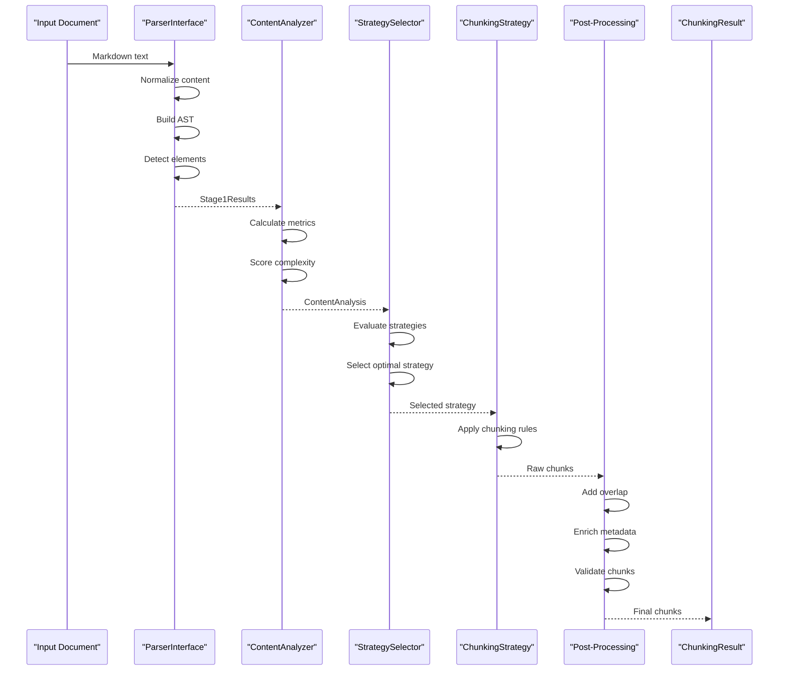
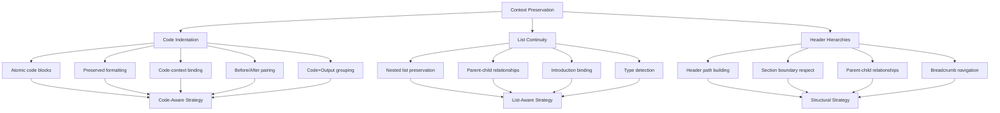
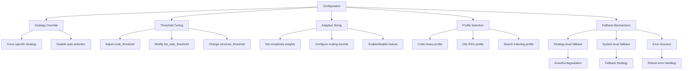

# Chunking Strategies Architecture

<cite>
**Referenced Files in This Document**   
- [README.md](file://README.md)
- [docs/architecture/strategies.md](file://docs/architecture/strategies.md)
- [docs/api/types.md](file://docs/api/types.md)
- [docs/reference/algorithms-ru.md](file://docs/reference/algorithms-ru.md)
- [docs/research/features/01-smart-list-strategy.md](file://docs/research/features/01-smart-list-strategy.md)
- [docs/research/features/09-adaptive-chunk-sizing.md](file://docs/research/features/09-adaptive-chunk-sizing.md)
- [provider/markdown_chunker.py](file://provider/markdown_chunker.py)
- [docs/guides/developer-guide.md](file://docs/guides/developer-guide.md)
</cite>

## Table of Contents
1. [Introduction](#introduction)
2. [Strategy Pattern Implementation](#strategy-pattern-implementation)
3. [Core Strategies](#core-strategies)
4. [Content Analysis Phase](#content-analysis-phase)
5. [Decision Flow](#decision-flow)
6. [Context Preservation](#context-preservation)
7. [Fallback Mechanisms and Configuration](#fallback-mechanisms-and-configuration)
8. [Performance Implications](#performance-implications)
9. [Real-World Examples](#real-world-examples)
10. [Conclusion](#conclusion)

## Introduction

The adaptive chunking strategies system in dify-markdown-chunker-1 represents a sophisticated approach to document processing that dynamically selects optimal chunking algorithms based on content analysis. This architecture leverages the Strategy Pattern to enable flexible, context-aware document segmentation that preserves semantic boundaries and structural integrity. The system is designed to handle diverse document types—from technical documentation with code blocks to changelogs with nested lists—by intelligently selecting from four specialized strategies: Code-Aware, List-Aware, Structural, and Fallback.

This documentation provides a comprehensive analysis of the chunking strategies architecture, detailing how the system analyzes document complexity, selects appropriate strategies, and preserves context across chunk boundaries. The implementation is optimized for Retrieval-Augmented Generation (RAG) systems, ensuring high-quality document segmentation that maintains the relationships between code blocks and their explanations, list hierarchies, and header structures.

**Section sources**
- [README.md](file://README.md#L38-L84)
- [docs/architecture/strategies.md](file://docs/architecture/strategies.md#L1-L22)

## Strategy Pattern Implementation

The adaptive chunking system implements the Strategy Pattern through a well-defined class hierarchy that enables dynamic selection of chunking algorithms. At the core of this implementation is the `BaseStrategy` class, which serves as the abstract base for all concrete strategy implementations. Each strategy inherits from this base class and implements two key methods: `can_handle()` and `apply()`.

The `can_handle()` method evaluates whether a strategy is appropriate for a given document based on content analysis metrics such as code ratio, list ratio, and header count. This method returns a boolean value that determines if the strategy should be considered during the selection process. The `apply()` method contains the actual chunking logic that processes the document according to the strategy's specific rules.

Strategies are prioritized in the selection process, with Code-Aware having the highest priority (1), followed by List-Aware (2), Structural (3), and Fallback (4). This priority system ensures that documents with specific characteristics are processed by the most appropriate algorithm. The StrategySelector component orchestrates this process by evaluating all registered strategies against the content analysis results and selecting the optimal one based on both priority and suitability metrics.

The implementation also supports configuration overrides, allowing users to force a specific strategy regardless of content analysis. This flexibility enables both automated adaptive behavior and manual control when specific processing requirements are known in advance.

**Diagram sources**
- [docs/guides/developer-guide.md](file://docs/guides/developer-guide.md#L223-L274)
- [docs/architecture/strategies.md](file://docs/architecture/strategies.md#L280-L307)

**Section sources**
- [docs/guides/developer-guide.md](file://docs/guides/developer-guide.md#L223-L274)
- [docs/architecture/strategies.md](file://docs/architecture/strategies.md#L280-L307)

## Core Strategies

The system implements four core chunking strategies, each optimized for specific document characteristics and content types. These strategies are designed to preserve the semantic integrity of different document structures while creating optimally sized chunks for downstream processing.

### Code-Aware Strategy

The Code-Aware Strategy is designed for documents with significant code content, including technical documentation, API references, and tutorials with code examples. This strategy prioritizes preserving code blocks as atomic units, ensuring that functions, classes, and other code structures are never split across chunk boundaries. It also handles tables and other structured data elements, keeping them intact within single chunks.

Activation occurs when the document meets any of the following conditions: code ratio ≥ 30%, presence of code blocks, or presence of tables. This strategy excels at maintaining the relationship between code and its explanatory text, grouping related code blocks with their surrounding context. It also supports advanced features like nested fencing (handling quadruple and quintuple backticks for meta-documentation) and code-context binding that recognizes Before/After patterns and Code+Output pairs.

### List-Aware Strategy

The List-Aware Strategy is optimized for documents with extensive list content, such as changelogs, feature lists, task lists, and structured outlines. This strategy preserves list hierarchies by ensuring that parent list items are never separated from their children, maintaining the nested structure across chunk boundaries.

Activation occurs when the document has a list ratio > 40% or contains at least 5 list items. For documents with strong hierarchical structure (multiple headers), both conditions must be met. This strategy intelligently binds introduction paragraphs to their associated lists, ensuring that context is preserved. It handles various list types including bullet lists, numbered lists, and checkbox lists, maintaining their structural relationships.

### Structural Strategy

The Structural Strategy is designed for documents with clear section hierarchies, such as user guides, academic papers, and long-form documentation. This strategy chunks content by sections, using headers as natural boundaries. It builds hierarchical paths (e.g., "/Chapter 1/Section 1.1") that provide context for each chunk and respects header hierarchy levels to maintain document structure.

Activation occurs when the document contains at least 3 headers with a discernible hierarchy. This strategy is particularly effective for documents that follow a traditional outline structure, as it preserves section boundaries and maintains the relationship between sections and subsections. It creates chunks that correspond to logical document sections, making it ideal for navigation and hierarchical retrieval.

### Fallback Strategy

The Fallback Strategy serves as the default option for documents that don't match the criteria for other strategies or when error recovery is needed. This strategy uses a reliable, simple approach to chunking by splitting text at paragraph and sentence boundaries while respecting size limits.

Activation occurs when none of the specialized strategies are applicable. This strategy provides graceful degradation, ensuring that all documents can be processed even if they don't have distinctive structural features. It's optimized for speed and low memory usage, making it suitable for simple text documents and as a reliable backup when other strategies fail.

**Diagram sources**
- [docs/architecture/strategies.md](file://docs/architecture/strategies.md#L292-L306)
- [README.md](file://README.md#L671-L677)

**Section sources**
- [docs/architecture/strategies.md](file://docs/architecture/strategies.md#L23-L213)
- [README.md](file://README.md#L671-L677)

## Content Analysis Phase

The content analysis phase is a critical component of the adaptive chunking system, providing the foundation for intelligent strategy selection. This phase performs comprehensive document analysis to score complexity and determine the optimal chunking strategy. The analysis generates a `ContentAnalysis` object containing multiple metrics that characterize the document's structure and content composition.

The analysis process begins with AST (Abstract Syntax Tree) parsing of the Markdown document, identifying structural elements such as headers, lists, code blocks, and tables. From this structural analysis, the system calculates several key ratios: code_ratio (percentage of content that is code), list_ratio (percentage of content that is lists), table_ratio (percentage of content that is tables), and text_ratio (percentage of plain text).

Additional metrics include the total character count, line count, maximum header depth, maximum list nesting level, and detected programming languages. These metrics are combined into a complexity_score (0.0-1.0) that represents the overall structural complexity of the document. The analysis also determines the dominant content type (code, lists, tables, or text) and classifies the document's complexity category as simple, moderate, or complex.

This comprehensive analysis enables the StrategySelector to make informed decisions about which chunking algorithm will produce the best results for a given document. The metrics are also used to support adaptive chunk sizing, where the optimal chunk size is dynamically adjusted based on content complexity.

**Diagram sources**
- [docs/api/types.md](file://docs/api/types.md#L314-L352)
- [docs/reference/algorithms-ru.md](file://docs/reference/algorithms-ru.md#L87-L107)

**Section sources**
- [docs/api/types.md](file://docs/api/types.md#L314-L352)
- [docs/reference/algorithms-ru.md](file://docs/reference/algorithms-ru.md#L87-L107)

## Decision Flow

The decision flow from parser output to strategy selection and execution follows a systematic process that ensures optimal chunking results. This flow begins with document preprocessing and parsing, followed by content analysis, strategy selection, and finally chunk application with post-processing.

The process starts with the MarkdownChunker receiving the input document and normalizing it by converting to UTF-8 encoding, normalizing line endings, and removing BOM (Byte Order Mark). The normalized content is then passed to the parser, which builds an AST and identifies structural elements. The content analyzer processes this AST to generate the ContentAnalysis object with all relevant metrics.

With the analysis complete, the StrategySelector evaluates each registered strategy in priority order, calling the `can_handle()` method to determine suitability. Strategies that pass the suitability test are considered candidates, and the selector chooses the highest-priority candidate. If configuration specifies a strategy override, that strategy is used regardless of analysis results.

Once a strategy is selected, the `apply()` method is invoked with the original text, stage 1 results, and configuration. The strategy processes the document according to its specific rules, creating chunks that respect the document's structural boundaries. Post-processing steps then add overlap, enrich metadata, and validate chunk integrity before returning the final result.

**Diagram sources**
- [docs/reference/algorithms-ru.md](file://docs/reference/algorithms-ru.md#L87-L162)
- [docs/architecture/strategies.md](file://docs/architecture/strategies.md#L280-L307)

**Section sources**
- [docs/reference/algorithms-ru.md](file://docs/reference/algorithms-ru.md#L87-L162)
- [docs/architecture/strategies.md](file://docs/architecture/strategies.md#L280-L307)

## Context Preservation

The adaptive chunking system excels at preserving context across chunk boundaries, particularly for code indentation, list continuity, and header hierarchies. This context preservation is achieved through strategy-specific algorithms that understand and maintain the relationships between different document elements.

For code blocks, the Code-Aware Strategy ensures that indentation and formatting are preserved exactly as in the original document. Code blocks are treated as atomic units that are never split, maintaining function and class boundaries. The strategy also implements code-context binding, which groups code blocks with their explanatory text, Before/After comparisons, and Code+Output pairs. This binding is reflected in enriched metadata that identifies code roles (example, setup, output, before, after, error) and relationships between related code blocks.

List continuity is preserved by the List-Aware Strategy through hierarchical preservation. Nested lists are never split across depth levels, ensuring that parent items remain with their children. The strategy also implements smart context binding, automatically attaching introduction paragraphs to their associated lists. This ensures that list context is maintained even when chunks are processed independently.

Header hierarchies are preserved by the Structural Strategy through header path building. Each chunk inherits the hierarchical path of its section (e.g., "/Chapter 1/Section 1.1"), providing context for its position in the document. The strategy respects section boundaries, never splitting sections inappropriately, and maintains parent-child relationships between chunks.

**Diagram sources**
- [README.md](file://README.md#L726-L774)
- [docs/architecture/strategies.md](file://docs/architecture/strategies.md#L317-L337)
- [docs/research/features/01-smart-list-strategy.md](file://docs/research/features/01-smart-list-strategy.md#L76-L109)

**Section sources**
- [README.md](file://README.md#L726-L774)
- [docs/architecture/strategies.md](file://docs/architecture/strategies.md#L317-L337)
- [docs/research/features/01-smart-list-strategy.md](file://docs/research/features/01-smart-list-strategy.md#L76-L109)

## Fallback Mechanisms and Configuration

The system implements robust fallback mechanisms and flexible configuration options to ensure reliable operation across diverse document types and processing requirements. The fallback architecture provides graceful degradation when primary strategies cannot be applied or when errors occur during processing.

The Fallback Strategy serves as the ultimate fallback, capable of processing any document type using simple text splitting rules. This strategy is always available and ensures that no document fails to be chunked. Additionally, each specialized strategy can fall back to simpler processing methods when encountering edge cases or malformed content.

Configuration options provide extensive control over the chunking process. Users can override automatic strategy selection by specifying a particular strategy (auto, code_aware, list_aware, structural, or fallback). Thresholds for strategy activation can be customized, allowing fine-tuning of the selection criteria. For example, the list_ratio_threshold can be lowered for changelogs to activate the List-Aware Strategy with less list content.

The system also supports adaptive chunk sizing, where the optimal chunk size is dynamically calculated based on content complexity. This feature uses configurable weights for different complexity factors (code, tables, lists, sentence length) and scaling bounds to determine the appropriate chunk size. Configuration profiles are available for common use cases, such as code-heavy documents, Dify RAG systems, and search indexing.

**Diagram sources**
- [docs/architecture/strategies.md](file://docs/architecture/strategies.md#L348-L379)
- [README.md](file://README.md#L794-L800)

**Section sources**
- [docs/architecture/strategies.md](file://docs/architecture/strategies.md#L348-L379)
- [README.md](file://README.md#L794-L800)

## Performance Implications

The adaptive chunking strategies system has distinct performance characteristics for each strategy, with trade-offs between speed, quality, and resource usage. Understanding these implications is crucial for optimizing the system for specific use cases and deployment environments.

The Code-Aware Strategy offers fast processing with very high quality, using medium memory resources. It is optimized for code and table-heavy documents, where preserving structural integrity is paramount. The List-Aware Strategy also provides fast processing with very high quality but uses low memory, making it efficient for list-heavy documents like changelogs.

The Structural Strategy processes at medium speed with very high quality and medium memory usage. It is well-suited for structured documents with clear section hierarchies. In contrast, the Fallback Strategy is very fast with medium quality and very low memory usage, making it ideal for simple text documents or situations requiring maximum performance.

The Auto strategy, which performs content analysis before selecting the optimal approach, operates at medium speed with very high quality and medium memory usage. While it incurs the overhead of analysis, it typically produces the best overall results by matching the document characteristics to the most appropriate algorithm.

Adaptive chunk sizing can impact performance by increasing chunk sizes for complex content, which may require more processing time but improves retrieval quality. Streaming processing is available for large files, enabling memory-efficient processing of documents over 10MB with minimal RAM usage.

| Strategy | Speed | Quality | Memory | Best For |
|----------|-------|---------|--------|----------|
| Code-Aware | Fast | Very High | Medium | Code/table-heavy docs |
| List-Aware | Fast | Very High | Low | List-heavy docs, changelogs |
| Structural | Medium | Very High | Medium | Structured docs |
| Fallback | Very Fast | Medium | Very Low | Simple text |
| Auto | Medium | Very High | Medium | General purpose |

**Section sources**
- [docs/architecture/strategies.md](file://docs/architecture/strategies.md#L338-L346)
- [docs/research/features/09-adaptive-chunk-sizing.md](file://docs/research/features/09-adaptive-chunk-sizing.md#L44-L94)

## Real-World Examples

The effectiveness of the adaptive chunking strategies system is demonstrated through real-world examples from the corpus tests, showing how different strategies handle various document types. These examples illustrate the practical benefits of adaptive strategy selection and context preservation.

For technical documentation with code examples, the Code-Aware Strategy successfully groups code blocks with their explanatory text, preserving the relationship between code and documentation. In API reference documents, it keeps parameter tables intact and maintains the context around code samples, ensuring that function descriptions remain with their implementations.

Changelogs and release notes processed with the List-Aware Strategy demonstrate excellent hierarchy preservation. Nested feature lists with multiple levels of indentation are kept intact, with parent features remaining with their sub-features. Introduction paragraphs are correctly bound to their associated lists, maintaining the narrative flow even when chunks are processed independently.

User guides and long-form documentation processed with the Structural Strategy show effective section-based chunking. Header paths like "/Installation/Requirements" provide clear context for each chunk, and section boundaries are respected to maintain logical groupings. This approach enables hierarchical navigation and improves retrieval quality by preserving the document's organizational structure.

Simple text documents processed with the Fallback Strategy demonstrate reliable, consistent chunking at high speed. Paragraph boundaries are respected, and sentence boundaries are used when possible to create readable chunks. This strategy provides a solid baseline for documents without distinctive structural features.

The Auto strategy consistently selects the optimal approach across mixed-content documents, combining the strengths of specialized strategies to produce high-quality results without manual configuration. This adaptive behavior makes it ideal for production systems processing diverse document collections.

**Section sources**
- [README.md](file://README.md#L678-L725)
- [docs/architecture/strategies.md](file://docs/architecture/strategies.md#L384-L416)

## Conclusion

The adaptive chunking strategies system in dify-markdown-chunker-1 represents a sophisticated solution for document processing that combines the flexibility of the Strategy Pattern with deep content analysis to deliver optimal chunking results. By dynamically selecting from four specialized strategies—Code-Aware, List-Aware, Structural, and Fallback—the system adapts to the unique characteristics of each document, preserving semantic boundaries and structural integrity.

The implementation excels at context preservation, maintaining code indentation, list continuity, and header hierarchies across chunk boundaries. This ensures that relationships between document elements are preserved, improving retrieval quality in RAG systems. The system's robust fallback mechanisms and flexible configuration options provide reliability and control, while performance characteristics are optimized for different document types and processing requirements.

Real-world examples from corpus tests demonstrate the effectiveness of the adaptive approach across diverse document types, from technical documentation with code blocks to changelogs with nested lists. The system's ability to analyze document complexity and select the optimal strategy automatically makes it a powerful tool for processing heterogeneous document collections in production environments.