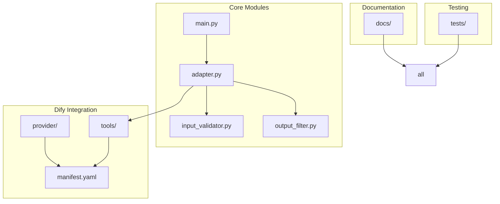
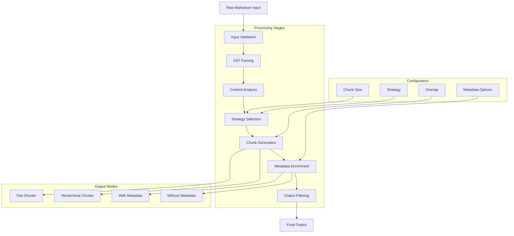
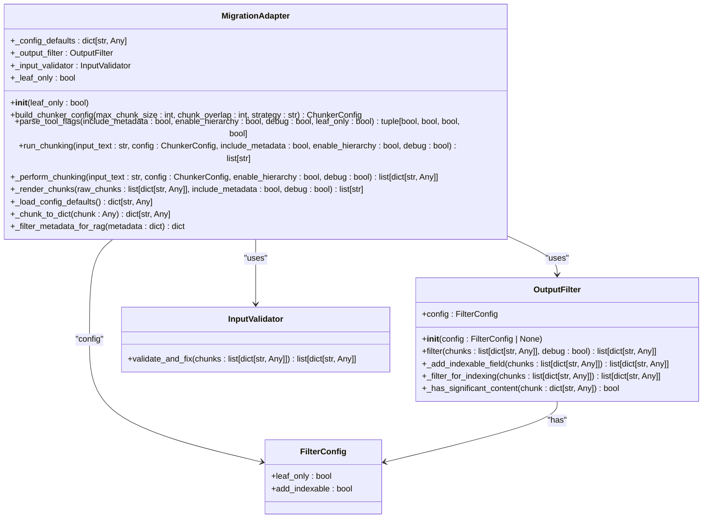
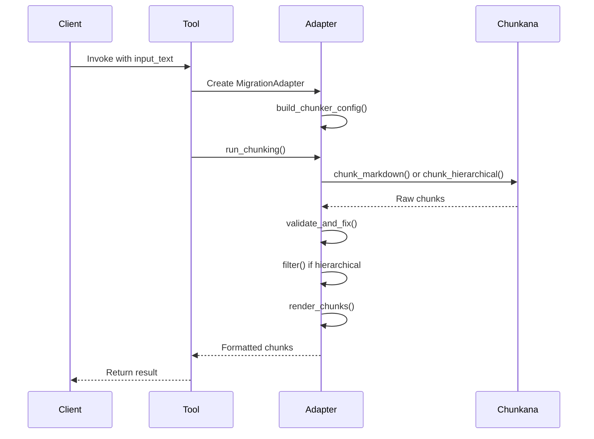
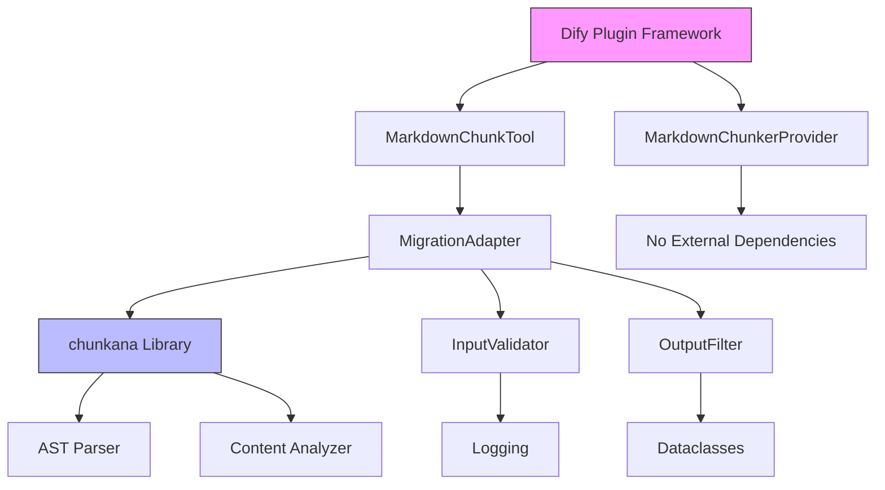

# Core Architecture

<cite>
**Referenced Files in This Document**   
- [main.py](file://main.py)
- [adapter.py](file://adapter.py)
- [input_validator.py](file://input_validator.py)
- [output_filter.py](file://output_filter.py)
- [provider/markdown_chunker.py](file://provider/markdown_chunker.py)
- [provider/markdown_chunker.yaml](file://provider/markdown_chunker.yaml)
- [tools/markdown_chunk_tool.py](file://tools/markdown_chunk_tool.py)
- [tools/markdown_chunk_tool.yaml](file://tools/markdown_chunk_tool.yaml)
- [manifest.yaml](file://manifest.yaml)
</cite>

## Table of Contents
1. [Introduction](#introduction)
2. [Project Structure](#project-structure)
3. [Core Components](#core-components)
4. [Architecture Overview](#architecture-overview)
5. [Detailed Component Analysis](#detailed-component-analysis)
6. [Dependency Analysis](#dependency-analysis)
7. [Performance Considerations](#performance-considerations)
8. [Troubleshooting Guide](#troubleshooting-guide)
9. [Conclusion](#conclusion)

## Introduction
The dify-markdown-chunker-1 is a specialized plugin designed to provide advanced, structure-aware chunking of Markdown documents for Retrieval-Augmented Generation (RAG) systems. Built on the chunkana engine, this system intelligently processes Markdown content while preserving structural integrity, semantic context, and hierarchical relationships. The architecture implements several key design patterns including Strategy Pattern for adaptive chunking, Adapter Pattern for Dify integration, Iterator Pattern for streaming, and Composite Pattern for hierarchical results. This documentation provides a comprehensive analysis of the system's architecture, component interactions, data flows, and integration points with the Dify platform.

## Project Structure
The project follows a modular structure with clear separation of concerns between components. The core functionality is organized into distinct directories: `provider/` for Dify integration, `tools/` for the main chunking logic, and root-level modules for the adapter pattern implementation. Configuration and metadata are managed through YAML files, while comprehensive documentation is provided in the `docs/` directory. The test suite in the `tests/` directory ensures backward compatibility and validates the migration from embedded chunking code to the external chunkana library.

**Diagram sources**
- [main.py](file://main.py)
- [adapter.py](file://adapter.py)
- [provider/markdown_chunker.py](file://provider/markdown_chunker.py)
- [tools/markdown_chunk_tool.py](file://tools/markdown_chunk_tool.py)
- [manifest.yaml](file://manifest.yaml)

**Section sources**
- [main.py](file://main.py)
- [adapter.py](file://adapter.py)
- [provider/markdown_chunker.py](file://provider/markdown_chunker.py)
- [tools/markdown_chunk_tool.py](file://tools/markdown_chunk_tool.py)
- [manifest.yaml](file://manifest.yaml)

## Core Components
The system's core components work together to transform raw Markdown input into structured, semantically meaningful chunks. The entry point (`main.py`) initializes the plugin environment and routes requests through the migration adapter (`adapter.py`), which serves as the bridge between the Dify platform and the chunkana engine. The adapter orchestrates the chunking process, coordinating input validation, strategy selection, and output filtering. The provider component exposes the functionality as a Dify tool, while the configuration system manages parameters and defaults. This architecture ensures backward compatibility while enabling access to enhanced features from the chunkana engine.

**Section sources**
- [main.py](file://main.py)
- [adapter.py](file://adapter.py)
- [provider/markdown_chunker.py](file://provider/markdown_chunker.py)
- [tools/markdown_chunk_tool.py](file://tools/markdown_chunk_tool.py)

## Architecture Overview
The system implements a pipeline pattern that processes Markdown documents through several stages: input parsing, content analysis, strategy selection, chunk generation, metadata enrichment, and output filtering. The architecture follows a two-stage processing model where chunk boundaries are determined independently of output formatting, ensuring consistency across different use cases. The migration adapter pattern enables seamless integration with the chunkana engine while maintaining exact behavioral compatibility with previous versions. Hierarchical chunking creates parent-child relationships between chunks, supporting multi-level retrieval and context navigation in RAG systems.

**Diagram sources**
- [adapter.py](file://adapter.py#L57-L62)
- [tools/markdown_chunk_tool.py](file://tools/markdown_chunk_tool.py#L40-L45)
- [input_validator.py](file://input_validator.py)
- [output_filter.py](file://output_filter.py)

## Detailed Component Analysis

### Entry Point and Plugin Initialization
The `main.py` file serves as the entry point for the Dify plugin, configuring the execution environment with a 300-second timeout to accommodate large documents. It creates a plugin instance using the DifyPluginEnv and runs the application, establishing the foundation for the entire chunking process. This simple yet critical component ensures the plugin can operate both in debug mode (connecting to a remote Dify instance) and in production (running as a packaged plugin within Dify).

**Section sources**
- [main.py](file://main.py#L21-L38)

### Migration Adapter Pattern
The `adapter.py` module implements the MigrationAdapter class, which provides a compatibility layer between the plugin's tool interface and the chunkana library. This adapter follows a two-stage processing model: chunking (boundary-invariant) and rendering (formatting). The chunking stage determines boundaries independently of output format, ensuring consistency, while the rendering stage handles formatting based on configuration. The adapter maintains backward compatibility by loading configuration defaults from a snapshot and provides enhanced features through the chunkana engine.

**Diagram sources**
- [adapter.py](file://adapter.py#L43-L352)
- [output_filter.py](file://output_filter.py#L16-L116)
- [input_validator.py](file://input_validator.py#L14-L46)

**Section sources**
- [adapter.py](file://adapter.py#L26-L352)

### Strategy Pattern for Adaptive Chunking
The system implements the Strategy Pattern through its adaptive chunking capabilities, automatically selecting the optimal strategy based on content analysis. The available strategies include code-aware (preserving code blocks), list-aware (preserving list hierarchy), structural (header-based), and fallback (simple splitting). When set to "auto", the system analyzes the document's content ratio, structure complexity, and other factors to determine the most appropriate strategy, ensuring optimal chunking for different document types.

**Section sources**
- [tools/markdown_chunk_tool.yaml](file://tools/markdown_chunk_tool.yaml#L68-L108)
- [adapter.py](file://adapter.py#L94-L119)

### Adapter Pattern for Dify Integration
The Adapter Pattern is implemented through the MigrationAdapter class, which bridges the gap between the Dify plugin interface and the chunkana engine. This pattern enables seamless integration by translating between the plugin's parameter schema and the chunkana library's configuration format. The adapter handles parameter mapping, input validation, output formatting, and error handling, ensuring that the external library's functionality is exposed through a consistent and compatible interface.

**Section sources**
- [adapter.py](file://adapter.py#L43-L352)
- [tools/markdown_chunk_tool.py](file://tools/markdown_chunk_tool.py#L29-L126)

### Iterator Pattern for Streaming
The system supports streaming processing through an Iterator Pattern implementation, enabling memory-efficient chunking of large documents. This pattern allows the system to process documents in chunks rather than loading the entire file into memory, making it suitable for processing large Markdown files exceeding 10MB. The streaming architecture operates through a parallel processing path that reads windows of text, identifies safe split points, and yields chunks incrementally.

**Diagram sources**
- [tools/markdown_chunk_tool.py](file://tools/markdown_chunk_tool.py#L47-L126)
- [adapter.py](file://adapter.py#L131-L233)

### Composite Pattern for Hierarchical Results
The Composite Pattern is utilized in hierarchical chunking mode, where chunks form a tree structure with parent-child relationships. Each chunk contains metadata about its position in the hierarchy (parent_id, children_ids, level, header_path), enabling multi-level retrieval and context navigation. This pattern allows the system to represent complex document structures while maintaining the ability to extract leaf-level content chunks for vector database indexing.

**Section sources**
- [tools/markdown_chunk_tool.yaml](file://tools/markdown_chunk_tool.yaml#L124-L138)
- [output_filter.py](file://output_filter.py#L49-L58)

## Dependency Analysis
The system's dependencies are carefully managed to ensure stability and compatibility. The core dependency is the chunkana library, which provides the advanced chunking algorithms. The system uses semantic versioning and configuration snapshots to maintain backward compatibility during library updates. External dependencies are minimized, with the system relying primarily on standard Python libraries and the Dify plugin framework. The migration adapter pattern isolates the integration with the chunkana library, allowing for future updates without affecting the plugin's external interface.

**Diagram sources**
- [manifest.yaml](file://manifest.yaml)
- [requirements.txt](file://requirements.txt)
- [adapter.py](file://adapter.py#L30-L34)

**Section sources**
- [manifest.yaml](file://manifest.yaml)
- [adapter.py](file://adapter.py#L30-L34)

## Performance Considerations
The architecture is designed with performance and scalability in mind. The two-stage processing model ensures that chunk boundaries are determined independently of output formatting, reducing computational overhead. For large documents, the streaming implementation significantly reduces memory usage by processing the document in windows rather than loading it entirely into memory. The system's performance scales linearly with document size, and the chunkana engine's optimized algorithms provide faster processing compared to the previous embedded implementation. Configuration options allow users to balance between processing speed, memory usage, and feature completeness based on their specific requirements.

**Section sources**
- [docs/guides/migration-to-chunkana.md](file://docs/guides/migration-to-chunkana.md#L97-L113)
- [docs/architecture/README.md](file://docs/architecture/README.md#L148-L199)

## Troubleshooting Guide
When encountering issues with the chunking process, consider the following common scenarios and solutions:

1. **Empty or missing input_text**: Ensure the input_text parameter is provided and contains valid Markdown content.
2. **Unexpected chunk boundaries**: Verify the selected strategy is appropriate for the document type; consider using "auto" for adaptive selection.
3. **Memory issues with large files**: Enable streaming mode to process large documents with reduced memory footprint.
4. **Metadata filtering issues**: Check the include_metadata and debug parameters to control metadata output.
5. **Hierarchical chunking problems**: Use the leaf_only parameter to control whether internal nodes are included in the output.

The system includes comprehensive error handling and validation, with descriptive error messages to aid in troubleshooting. Debug mode can be enabled to include all chunks (root, intermediate, and leaf) for inspection.

**Section sources**
- [tools/markdown_chunk_tool.py](file://tools/markdown_chunk_tool.py#L73-L125)
- [adapter.py](file://adapter.py#L131-L233)
- [input_validator.py](file://input_validator.py#L14-L46)

## Conclusion
The dify-markdown-chunker-1 architecture represents a sophisticated solution for advanced Markdown chunking, combining the power of the chunkana engine with seamless Dify integration. The system's implementation of key design patterns—Strategy, Adapter, Iterator, and Composite—enables adaptive, efficient, and flexible chunking of diverse document types. The migration adapter pattern ensures backward compatibility while unlocking enhanced features and improved performance. With its support for hierarchical chunking, rich metadata embedding, and streaming processing, the system is well-suited for demanding RAG applications requiring structure-preserving document segmentation. The modular design and clear separation of concerns make the system maintainable and extensible for future enhancements.