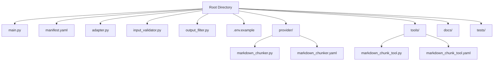
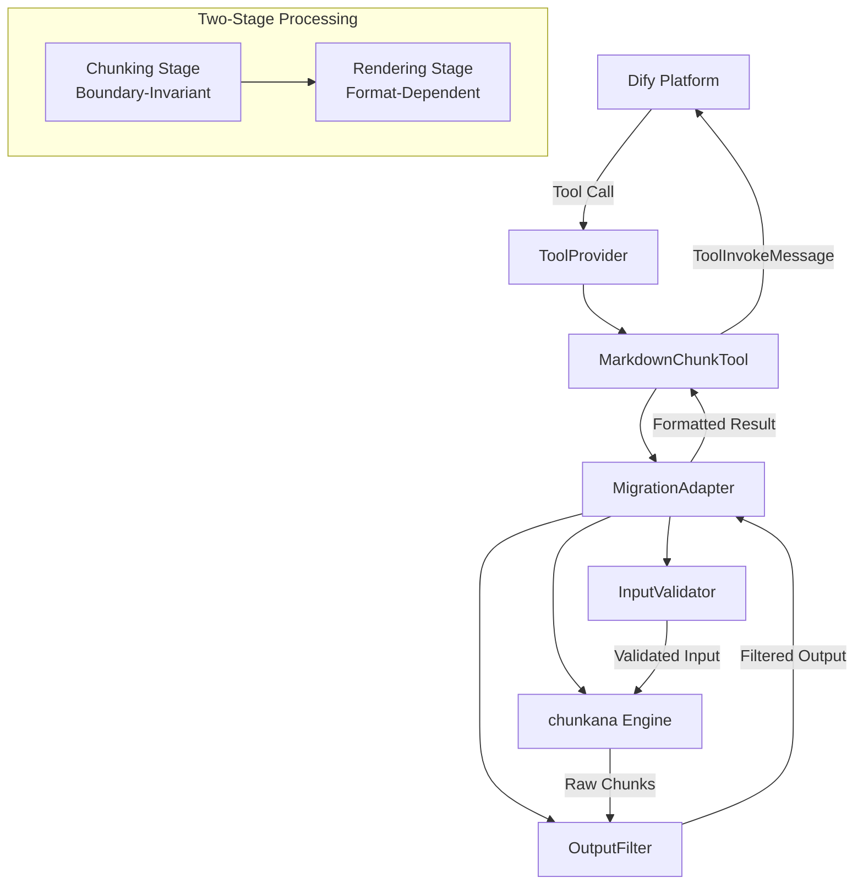
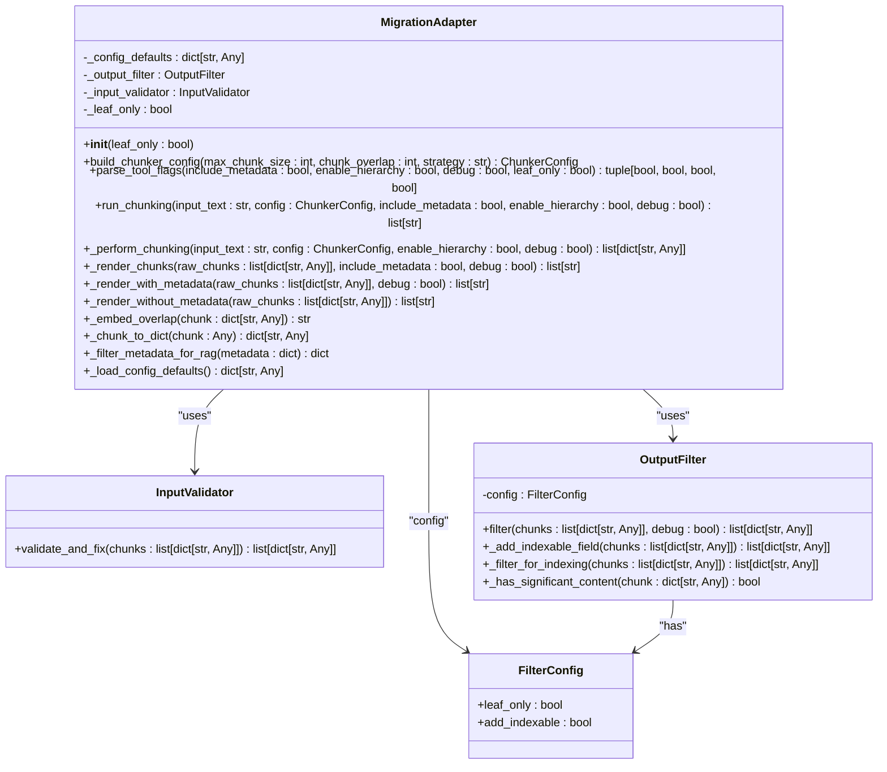
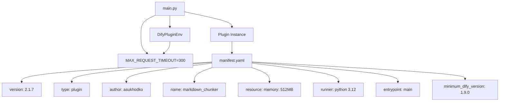
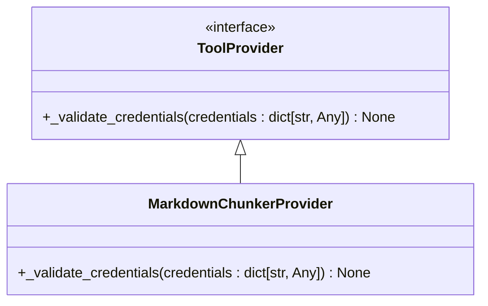
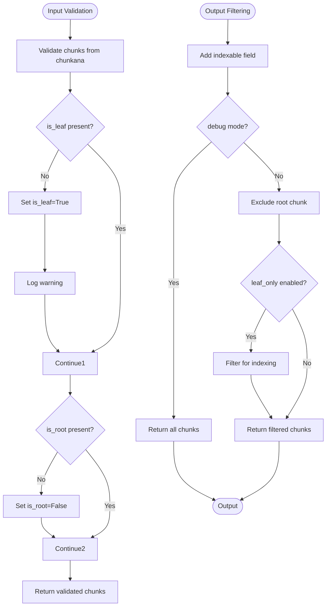
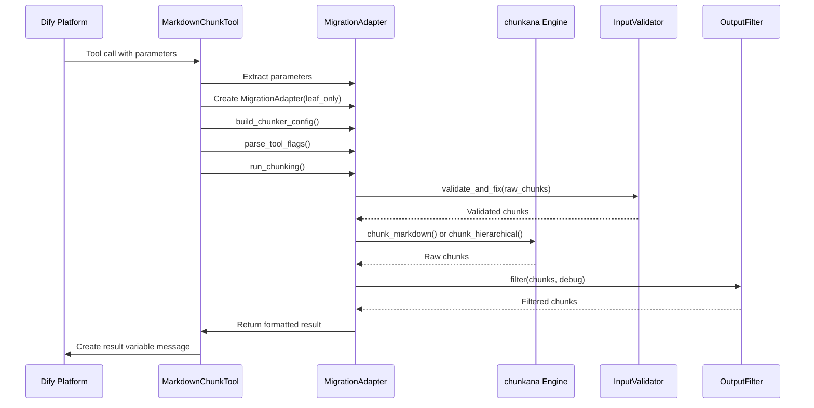
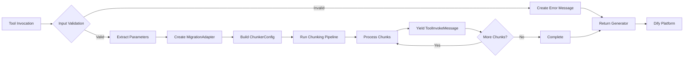
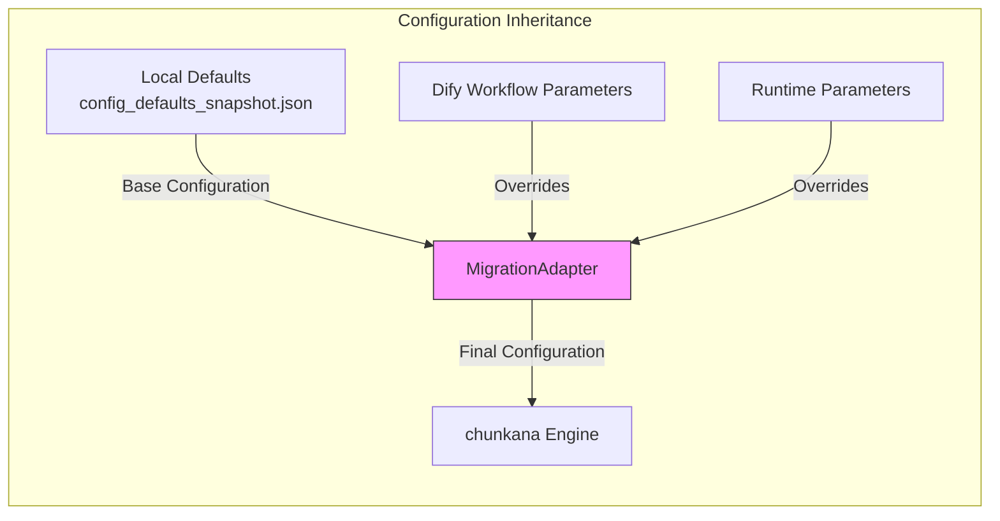
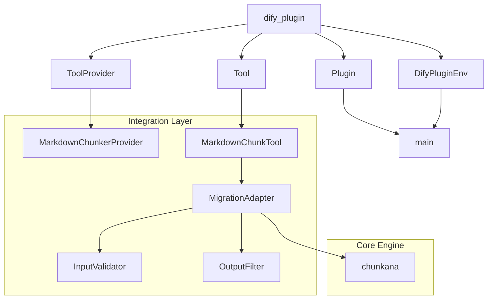

# Dify Integration Architecture

<cite>
**Referenced Files in This Document**   
- [main.py](file://main.py)
- [manifest.yaml](file://manifest.yaml)
- [adapter.py](file://adapter.py)
- [input_validator.py](file://input_validator.py)
- [output_filter.py](file://output_filter.py)
- [provider/markdown_chunker.py](file://provider/markdown_chunker.py)
- [provider/markdown_chunker.yaml](file://provider/markdown_chunker.yaml)
- [tools/markdown_chunk_tool.py](file://tools/markdown_chunk_tool.py)
- [tools/markdown_chunk_tool.yaml](file://tools/markdown_chunk_tool.yaml)
- [.env.example](file://.env.example)
</cite>

## Table of Contents
1. [Introduction](#introduction)
2. [Project Structure](#project-structure)
3. [Core Components](#core-components)
4. [Architecture Overview](#architecture-overview)
5. [Detailed Component Analysis](#detailed-component-analysis)
6. [Dependency Analysis](#dependency-analysis)
7. [Performance Considerations](#performance-considerations)
8. [Troubleshooting Guide](#troubleshooting-guide)
9. [Conclusion](#conclusion)

## Introduction
The Dify Integration Architecture document describes the implementation of the Adapter Pattern that bridges the chunkana core engine with Dify's plugin system. This integration enables advanced, structure-aware Markdown chunking capabilities within Dify workflows, providing intelligent document segmentation for improved Retrieval-Augmented Generation (RAG) performance. The architecture centers around a migration adapter that ensures backward compatibility while leveraging the enhanced features of the chunkana engine.

## Project Structure
The project follows a modular structure with clear separation of concerns between integration components and core functionality. The root directory contains the entry point (main.py), configuration files (manifest.yaml, .env.example), and core integration modules (adapter.py, input_validator.py, output_filter.py). The provider and tools directories contain Dify-specific configuration and implementation files that define the plugin interface and tool behavior.

**Diagram sources**
- [main.py](file://main.py)
- [manifest.yaml](file://manifest.yaml)
- [provider/markdown_chunker.yaml](file://provider/markdown_chunker.yaml)
- [tools/markdown_chunk_tool.yaml](file://tools/markdown_chunk_tool.yaml)

**Section sources**
- [main.py](file://main.py)
- [manifest.yaml](file://manifest.yaml)
- [provider/markdown_chunker.yaml](file://provider/markdown_chunker.yaml)
- [tools/markdown_chunk_tool.yaml](file://tools/markdown_chunk_tool.yaml)

## Core Components
The integration architecture comprises several core components that work together to provide a seamless interface between Dify's plugin system and the chunkana engine. The MigrationAdapter class serves as the central component, implementing the Adapter Pattern to translate between Dify's tool interface and the chunkana library. Input validation and output filtering components ensure data integrity and proper formatting for downstream consumers. The provider and tool configurations define the plugin's behavior within the Dify ecosystem.

**Section sources**
- [adapter.py](file://adapter.py)
- [input_validator.py](file://input_validator.py)
- [output_filter.py](file://output_filter.py)
- [provider/markdown_chunker.py](file://provider/markdown_chunker.py)
- [tools/markdown_chunk_tool.py](file://tools/markdown_chunk_tool.py)

## Architecture Overview
The Dify integration architecture implements a layered approach to bridge the chunkana core engine with Dify's plugin system. At its core, the MigrationAdapter class implements the Adapter Pattern, providing a compatibility layer that translates Dify tool parameters into chunkana configuration while maintaining backward compatibility with legacy behavior. The architecture follows a two-stage processing pipeline: chunking (boundary-invariant) and rendering (format-dependent), ensuring consistent chunk boundaries regardless of output formatting requirements.

**Diagram sources**
- [adapter.py](file://adapter.py)
- [tools/markdown_chunk_tool.py](file://tools/markdown_chunk_tool.py)
- [provider/markdown_chunker.py](file://provider/markdown_chunker.py)

## Detailed Component Analysis

### Adapter Pattern Implementation
The MigrationAdapter class implements the Adapter Pattern to bridge the chunkana core engine with Dify's plugin system. This adapter provides a compatibility layer that ensures exact behavioral compatibility with pre-migration versions while leveraging the enhanced capabilities of the chunkana engine. The adapter follows a two-stage processing pipeline that separates chunking (boundary-invariant) from rendering (format-dependent), ensuring consistent chunk boundaries regardless of output formatting requirements.

**Diagram sources**
- [adapter.py](file://adapter.py#L43-L352)
- [input_validator.py](file://input_validator.py#L14-L46)
- [output_filter.py](file://output_filter.py#L24-L116)

**Section sources**
- [adapter.py](file://adapter.py#L43-L352)

### Entry Point and Configuration
The integration entry point is defined in main.py, which serves as the bootstrap for the Dify plugin. The file configures the plugin with a 300-second timeout for processing large documents and creates a Plugin instance using DifyPluginEnv. The manifest.yaml file provides comprehensive metadata about the plugin, including version, author, resource requirements, and compatibility information. This configuration ensures the plugin meets Dify Marketplace requirements and can be properly integrated into Dify workflows.

**Diagram sources**
- [main.py](file://main.py#L1-L38)
- [manifest.yaml](file://manifest.yaml#L1-L49)

**Section sources**
- [main.py](file://main.py#L1-L38)
- [manifest.yaml](file://manifest.yaml#L1-L49)

### Provider Class Interface
The MarkdownChunkerProvider class implements the ToolProvider interface required by Dify's plugin system. As a local processing tool that doesn't require external services, the provider implements a no-op _validate_credentials method, acknowledging that no credentials are needed for operation. This design pattern allows the plugin to integrate seamlessly with Dify's authentication framework while accurately representing its local execution model.

**Diagram sources**
- [provider/markdown_chunker.py](file://provider/markdown_chunker.py#L15-L36)

**Section sources**
- [provider/markdown_chunker.py](file://provider/markdown_chunker.py#L15-L36)

### Input Validation and Output Filtering
The integration implements robust input validation and output filtering to ensure data integrity and proper formatting. The InputValidator class validates chunks from the chunkana library, setting default values for missing fields such as is_leaf and is_root. The OutputFilter class applies configurable filtering to hierarchical output, preventing accidental indexing of technical nodes (root, internal nodes) in vector databases. This two-tier validation approach ensures reliable operation across different document types and processing scenarios.

**Diagram sources**
- [input_validator.py](file://input_validator.py#L14-L46)
- [output_filter.py](file://output_filter.py#L24-L116)

**Section sources**
- [input_validator.py](file://input_validator.py#L14-L46)
- [output_filter.py](file://output_filter.py#L24-L116)

### Parameter Mapping and Transformation
The integration handles the transformation between Dify's tool call format and internal chunking requests through a comprehensive parameter mapping system. The MigrationAdapter class maps Dify tool parameters (max_chunk_size, chunk_overlap, strategy, etc.) to chunkana configuration, applying default values and validation as needed. The run_chunking method orchestrates the complete processing pipeline, handling input validation, chunking execution, and output formatting based on the requested parameters.

**Diagram sources**
- [tools/markdown_chunk_tool.py](file://tools/markdown_chunk_tool.py#L29-L126)
- [adapter.py](file://adapter.py#L43-L352)

**Section sources**
- [tools/markdown_chunk_tool.py](file://tools/markdown_chunk_tool.py#L29-L126)
- [adapter.py](file://adapter.py#L43-L352)

### Streaming Response Handling
The integration supports streaming responses through Dify's ToolInvokeMessage system, allowing for efficient processing of large documents without blocking the entire response. The MarkdownChunkTool class implements the _invoke method as a generator, yielding ToolInvokeMessage objects as chunks are processed. This approach enables real-time feedback and progress indication within Dify workflows, improving the user experience when processing extensive Markdown documents.

**Diagram sources**
- [tools/markdown_chunk_tool.py](file://tools/markdown_chunk_tool.py#L29-L126)

**Section sources**
- [tools/markdown_chunk_tool.py](file://tools/markdown_chunk_tool.py#L29-L126)

### Configuration Inheritance
The integration implements a configuration inheritance model that combines Dify workflow parameters with local defaults. The MigrationAdapter loads configuration defaults from a pre-migration snapshot (config_defaults_snapshot.json) and merges them with runtime parameters from the Dify tool call. This approach ensures backward compatibility while allowing users to override settings through the Dify interface. The configuration system prioritizes workflow parameters over defaults, enabling flexible deployment across different use cases.

**Diagram sources**
- [adapter.py](file://adapter.py#L82-L92)
- [adapter.py](file://adapter.py#L103-L117)

**Section sources**
- [adapter.py](file://adapter.py#L82-L117)

## Dependency Analysis
The integration architecture has a well-defined dependency structure that separates concerns between components. The core dependencies flow from the Dify platform through the tool provider to the migration adapter, which in turn depends on the chunkana engine and supporting validation/filtering components. External dependencies are minimized, with the primary integration point being the dify_plugin package that provides the necessary interfaces and utilities for plugin development.

**Diagram sources**
- [main.py](file://main.py#L21)
- [provider/markdown_chunker.py](file://provider/markdown_chunker.py#L12)
- [tools/markdown_chunk_tool.py](file://tools/markdown_chunk_tool.py#L23)
- [adapter.py](file://adapter.py#L30)

**Section sources**
- [main.py](file://main.py#L21)
- [provider/markdown_chunker.py](file://provider/markdown_chunker.py#L12)
- [tools/markdown_chunk_tool.py](file://tools/markdown_chunk_tool.py#L23)
- [adapter.py](file://adapter.py#L30)

## Performance Considerations
The integration is configured with a 300-second timeout to accommodate processing of large documents, reflecting the potentially intensive nature of structure-aware Markdown chunking. The architecture employs a two-stage processing pipeline that separates boundary-invariant chunking from format-dependent rendering, optimizing for consistent results across different output requirements. Resource allocation is set to 512MB of memory, providing sufficient headroom for processing complex documents with deep hierarchical structures.

**Section sources**
- [main.py](file://main.py#L24)
- [manifest.yaml](file://manifest.yaml#L20)

## Troubleshooting Guide
The integration includes comprehensive error handling and debugging capabilities to support monitoring within Dify workflows. The debug mode parameter allows inspection of all chunks (root, intermediate, and leaf) in hierarchical mode, facilitating troubleshooting of chunking behavior. The .env.example file provides configuration for debugging the plugin with a remote Dify instance, enabling development and testing without packaging requirements. Error propagation follows Dify's standard patterns, with validation and processing errors returned as text messages through the ToolInvokeMessage system.

**Section sources**
- [.env.example](file://.env.example#L1-L41)
- [tools/markdown_chunk_tool.py](file://tools/markdown_chunk_tool.py#L122-L125)
- [adapter.py](file://adapter.py#L131-L155)

## Conclusion
The Dify integration architecture for the dify-markdown-chunker-1 plugin demonstrates a robust implementation of the Adapter Pattern, successfully bridging the chunkana core engine with Dify's plugin system. The design emphasizes backward compatibility, structural integrity, and seamless integration with Dify workflows. Key strengths include the two-stage processing pipeline that ensures boundary invariance, comprehensive input validation and output filtering, and support for hierarchical chunking with configurable filtering. The architecture meets Dify Marketplace requirements while providing advanced features for improved RAG performance, making it a valuable addition to the Dify ecosystem.