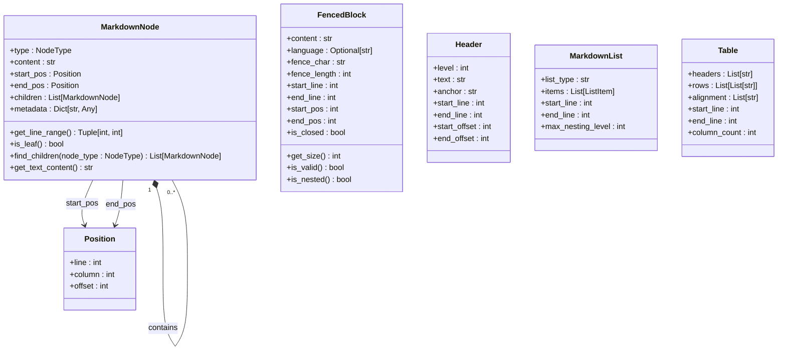
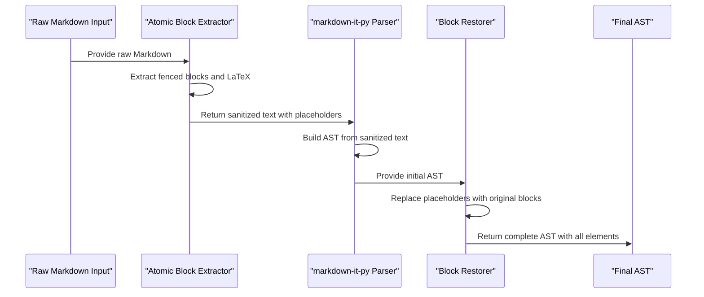
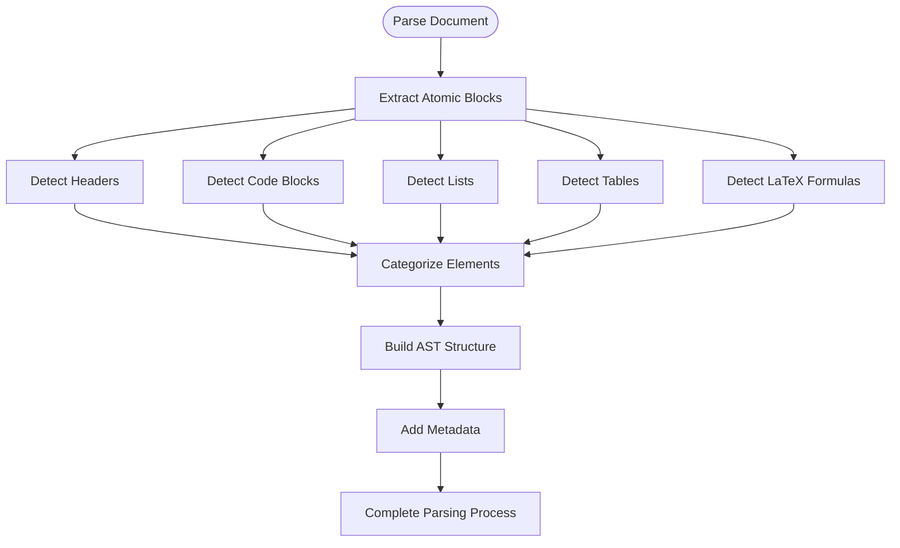
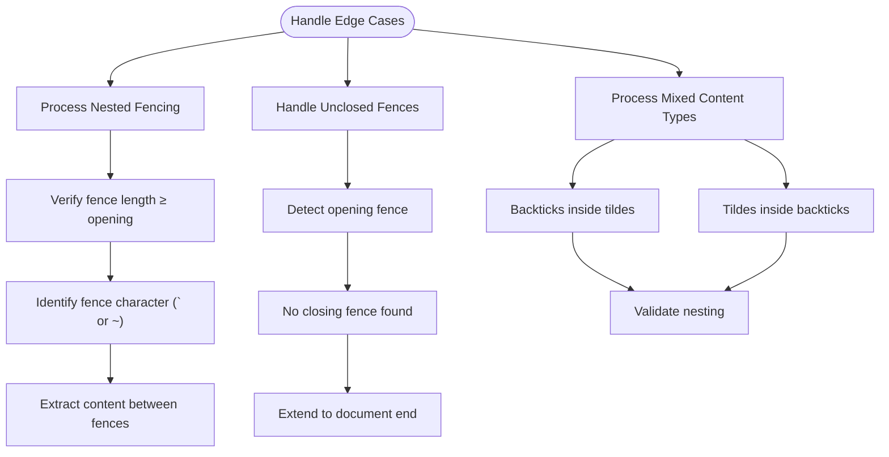

# Parser Architecture

<cite>
**Referenced Files in This Document**   
- [types.md](file://docs/api/types.md)
- [algorithms.md](file://docs/reference/algorithms.md)
- [02-nested-fencing-support.md](file://docs/research/features/02-nested-fencing-support.md)
- [12-latex-formula-handling.md](file://docs/research/09_final_report.md)
- [nested_fencing_minimal.md](file://tests/fixtures/nested_fencing_minimal.md)
- [mixed_fences_minimal.md](file://tests/fixtures/mixed_fences_minimal.md)
- [unclosed_fence.md](file://tests/fixtures/unclosed_fence.md)
</cite>

## Table of Contents
1. [Introduction](#introduction)
2. [Core Data Structures](#core-data-structures)
3. [AST-Based Parsing Approach](#ast-based-parsing-approach)
4. [Element Detection and Categorization](#element-detection-and-categorization)
5. [Positional Metadata and Semantic Boundaries](#positional-metadata-and-semantic-boundaries)
6. [Edge Case Handling](#edge-case-handling)
7. [Data Model Transformation](#data-model-transformation)
8. [Performance Considerations](#performance-considerations)
9. [Integration with Downstream Components](#integration-with-downstream-components)
10. [Test Fixture Examples](#test-fixture-examples)

## Introduction

The parser system in dify-markdown-chunker-1 implements a sophisticated AST-based approach to transform raw Markdown into structured syntax trees. Built on the markdown-it-py library, the parser analyzes document structure, identifies key elements, and extracts positional metadata essential for intelligent chunking. This architecture enables precise handling of complex Markdown documents, including edge cases like nested fencing and LaTeX formulas, while maintaining performance for large documents through streaming window parsing.

## Core Data Structures

The parser system utilizes a comprehensive set of data structures to represent parsed Markdown content. The core structure is the `MarkdownNode` class, which forms the basis of the Abstract Syntax Tree (AST). Each node contains type information, content, positional metadata, child nodes, and additional metadata. The system also defines specialized structures for different element types including `FencedBlock` for code blocks, `Header` for document headings, `MarkdownList` for lists, and `Table` for tabular data.

**Diagram sources**
- [types.md](file://docs/api/types.md#L57-L150)

**Section sources**
- [types.md](file://docs/api/types.md#L57-L150)

## AST-Based Parsing Approach

The parser system employs an AST-based approach using markdown-it-py to transform raw Markdown into structured syntax trees. The parsing process begins by constructing a hierarchical representation of the document where each node corresponds to a Markdown element. The AST preserves the document's structural hierarchy, with parent-child relationships reflecting the nesting of elements. This approach enables precise analysis of document structure and facilitates intelligent chunking decisions based on semantic boundaries rather than arbitrary character limits.

The parser processes the document in multiple stages: first extracting atomic blocks like code fences and LaTeX formulas, then building the AST from the remaining content, and finally restoring the atomic blocks into their appropriate positions within the tree. This multi-stage approach ensures that complex elements are handled correctly without interfering with the parsing of surrounding content.

**Diagram sources**
- [algorithms.md](file://docs/reference/algorithms.md#L378-L383)
- [02-nested-fencing-support.md](file://docs/research/features/02-nested-fencing-support.md#L168-L184)

**Section sources**
- [algorithms.md](file://docs/reference/algorithms.md#L378-L383)
- [02-nested-fencing-support.md](file://docs/research/features/02-nested-fencing-support.md#L168-L184)

## Element Detection and Categorization

The parser system identifies and categorizes various Markdown elements through specialized detection mechanisms. Headers are detected by analyzing hash character prefixes and their count determines the header level. Code blocks are identified by fenced regions delimited by backticks or tildes, with the parser supporting nested fencing of arbitrary depth. Lists are detected by analyzing line prefixes for bullet points or numbered items, preserving their hierarchical structure. Tables are recognized by pipe character patterns and header separator lines.

For LaTeX formulas, the system employs regex-based pattern matching to identify three types: inline math ($...$), display math ($$...$$), and equation environments (\begin{equation}...\end{equation}). Each detected element is categorized and stored with appropriate metadata, enabling downstream components to make informed decisions about chunking strategies based on content type distribution.

**Diagram sources**
- [12-latex-formula-handling.md](file://docs/research/features/12-latex-formula-handling.md#L56-L176)
- [algorithms.md](file://docs/reference/algorithms.md#L386-L397)

**Section sources**
- [12-latex-formula-handling.md](file://docs/research/features/12-latex-formula-handling.md#L56-L176)
- [algorithms.md](file://docs/reference/algorithms.md#L386-L397)

## Positional Metadata and Semantic Boundaries

The parser extracts comprehensive positional metadata for each element, including line numbers, column positions, and character offsets. This metadata is critical for intelligent chunking as it enables precise tracking of element locations within the document. The `Position` class captures line, column, and offset information for both the start and end of each element, allowing downstream components to understand the exact placement of content.

Semantic boundaries are determined by analyzing the hierarchical relationships between elements in the AST. Headers establish section boundaries, with their level indicating the hierarchy depth. Code blocks, tables, and lists are treated as atomic units that should not be split across chunks. The parser also identifies natural breakpoints such as paragraph boundaries and thematic transitions, which inform the chunking process. This semantic understanding allows the system to create chunks that preserve context and meaning rather than arbitrarily dividing text.

**Section sources**
- [types.md](file://docs/api/types.md#L13-L23)
- [types.md](file://docs/api/types.md#L68-L69)

## Edge Case Handling

The parser system implements robust handling of edge cases to ensure reliable processing of complex Markdown documents. For nested fencing, the system supports arbitrary levels of nesting by using fence length to distinguish between opening and closing delimiters. Four or more backticks can contain standard three-backtick code blocks, and this pattern extends to deeper nesting levels. The parser also handles mixed fence types, allowing both backticks and tildes to be used within the same document.

Malformed syntax is handled gracefully, with unclosed fences treated as extending to the end of the document rather than causing parsing failures. The system preserves these incomplete blocks as valid elements, ensuring that content is not lost. For LaTeX formulas, the parser uses conservative patterns to avoid false positives when dollar signs appear in regular text. Inline math detection includes safeguards to prevent misidentification when dollar signs are used in non-mathematical contexts.

**Diagram sources**
- [02-nested-fencing-support.md](file://docs/research/features/02-nested-fencing-support.md#L109-L139)
- [02-nested-fencing-support.md](file://docs/research/features/02-nested-fencing-support.md#L213-L214)

**Section sources**
- [02-nested-fencing-support.md](file://docs/research/features/02-nested-fencing-support.md#L109-L139)
- [unclosed_fence.md](file://tests/fixtures/unclosed_fence.md#L1-L10)

## Data Model Transformation

The parsed AST undergoes transformation into analysis-ready structures that facilitate downstream processing. The `Stage1Results` class consolidates the parsing output, containing the AST root, fenced blocks, structural elements, content analysis, and processing metadata. This unified structure provides a comprehensive view of the document for subsequent stages.

The transformation process enriches the raw AST with additional metadata and derived properties. For example, headers are augmented with anchor identifiers for linking, lists include completion status for task lists, and tables store alignment information for each column. The system also calculates document-level metrics such as content type ratios, complexity scores, and structural depth, which inform strategy selection for chunking.

**Section sources**
- [types.md](file://docs/api/types.md#L362-L391)

## Performance Considerations

The parser system incorporates several performance optimizations for handling large documents efficiently. The architecture supports streaming window parsing, allowing documents to be processed in chunks rather than loading the entire file into memory. This approach reduces memory footprint and enables processing of very large files that might not fit in memory.

For performance-critical operations, the system uses optimized regex patterns and avoids unnecessary string copying. The two-pass parsing approach (extract atomic blocks, parse remainder, restore blocks) minimizes the complexity of the main parsing phase. The parser also implements caching for frequently accessed properties and lazy evaluation where appropriate to defer expensive computations until needed.

**Section sources**
- [12-latex-formula-handling.md](file://docs/research/09_final_report.md#L167-L170)

## Integration with Downstream Components

The parser integrates seamlessly with downstream components such as the strategy selector and chunk generator. The structured output from the parser, particularly the `ContentAnalysis` object, provides the strategy selector with the information needed to choose the most appropriate chunking approach based on document characteristics. For example, code-heavy documents trigger the code-aware strategy, while list-heavy documents use the list-aware strategy.

The chunk generator leverages the positional metadata and semantic boundaries identified by the parser to create meaningful chunks that preserve context. Atomic elements like code blocks and tables are kept intact within single chunks, while natural breakpoints like section headers are used as chunk boundaries. The hierarchical structure of the AST also enables hierarchical chunking, where parent-child relationships between chunks reflect the document's organization.

**Section sources**
- [readme.md](file://tests/fixtures/corpus/mixed/readme.md#L394-L422)

## Test Fixture Examples

The system includes comprehensive test fixtures that demonstrate complex parsing scenarios. The `nested_fencing_minimal.md` fixture shows the simplest case of nested fencing, with a standard code block contained within a quadruple-backtick fence. This tests the parser's ability to correctly identify the nested structure and preserve the inner code block as content rather than a closing delimiter.

The `mixed_fences_minimal.md` fixture demonstrates interoperability between different fence types, showing both backticks within tildes and tildes within backticks. This verifies that the parser can handle mixed fence syntax without confusion. The `unclosed_fence.md` fixture tests graceful handling of malformed syntax, ensuring that documents with unclosed fences are processed completely rather than failing parsing.

**Section sources**
- [nested_fencing_minimal.md](file://tests/fixtures/nested_fencing_minimal.md#L1-L15)
- [mixed_fences_minimal.md](file://tests/fixtures/mixed_fences_minimal.md#L1-L24)
- [unclosed_fence.md](file://tests/fixtures/unclosed_fence.md#L1-L10)