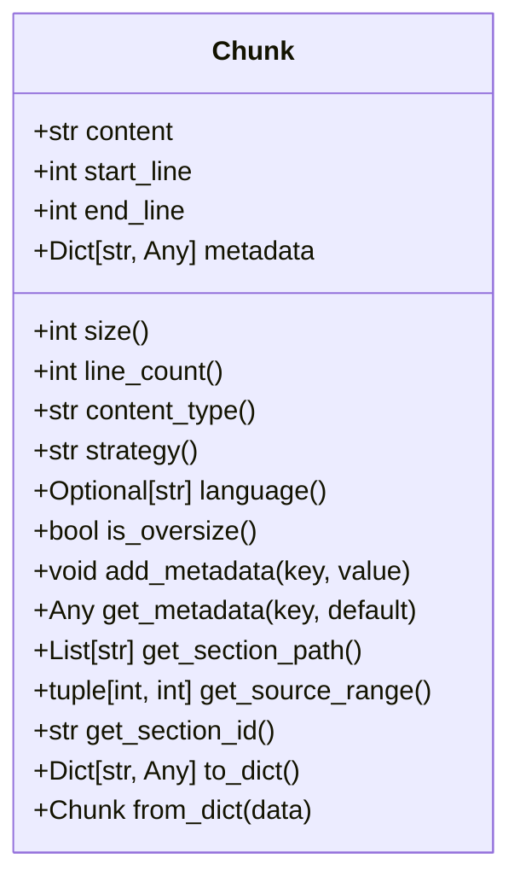
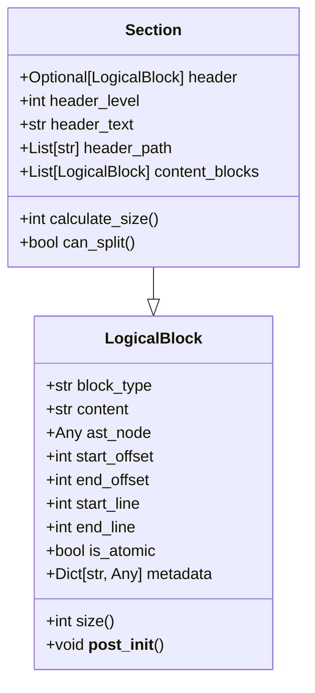
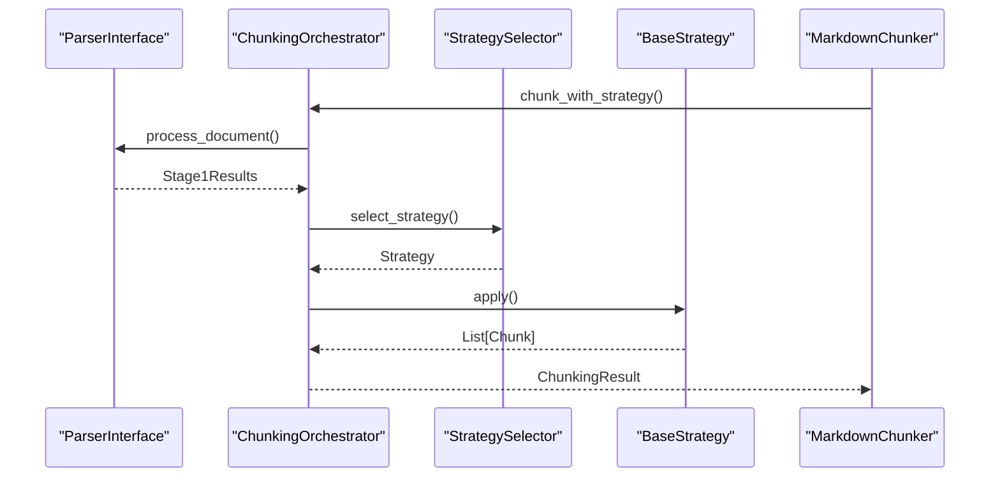
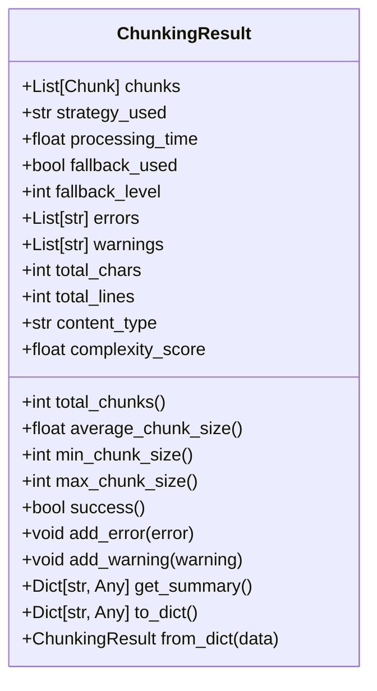

# Chunk Definition and Structure

<cite>
**Referenced Files in This Document**   
- [types.py](file://markdown_chunker/chunker/types.py)
- [logical_blocks.py](file://markdown_chunker/chunker/logical_blocks.py)
- [orchestrator.py](file://markdown_chunker/chunker/orchestrator.py)
- [core.py](file://markdown_chunker/chunker/core.py)
- [metadata_enricher.py](file://markdown_chunker/chunker/components/metadata_enricher.py)
- [overlap_manager.py](file://markdown_chunker/chunker/components/overlap_manager.py)
- [section_builder.py](file://markdown_chunker/chunker/section_builder.py)
</cite>

## Table of Contents
1. [Introduction](#introduction)
2. [Chunk Dataclass Structure](#chunk-dataclass-structure)
3. [Core Properties of a Chunk](#core-properties-of-a-chunk)
4. [Logical Block Preservation](#logical-block-preservation)
5. [AST-Based Chunk Construction](#ast-based-chunk-construction)
6. [Overlapping Strategy](#overlapping-strategy)
7. [Metadata Enrichment](#metadata-enrichment)
8. [ChunkingResult and Serialization](#chunkingresult-and-serialization)
9. [Idempotency and Integrity](#idempotency-and-integrity)
10. [Conclusion](#conclusion)

## Introduction

The chunking system in this repository is designed to break down Markdown documents into semantically meaningful fragments while preserving structural integrity and context. A "chunk" represents a coherent unit of content that maintains logical boundaries, hierarchical relationships, and metadata necessary for downstream applications such as retrieval-augmented generation (RAG). This document provides a comprehensive definition of what constitutes a chunk, focusing on the `Chunk` dataclass, its properties, construction methodology, and integration with the broader system.

**Section sources**
- [types.py](file://markdown_chunker/chunker/types.py#L36-L217)

## Chunk Dataclass Structure

The `Chunk` dataclass is the fundamental building block of the chunking system, defined in `types.py`. It encapsulates both the textual content and rich metadata required for semantic understanding and processing. The class is implemented using Python's `dataclass` decorator, ensuring immutability and type safety.

A chunk is initialized with three primary attributes: `content`, `start_line`, and `end_line`, with an optional `metadata` dictionary that defaults to an empty dictionary. The dataclass enforces validation rules through its `__post_init__` method, ensuring that line numbers are positive, end lines do not precede start lines, and content is non-empty.

**Diagram sources**
- [types.py](file://markdown_chunker/chunker/types.py#L36-L217)

**Section sources**
- [types.py](file://markdown_chunker/chunker/types.py#L36-L217)

## Core Properties of a Chunk

Each chunk exposes several computed properties that provide insight into its characteristics and context within the document:

- **size**: Returns the character count of the chunk's content.
- **line_count**: Calculates the number of lines spanned by the chunk using the formula `end_line - start_line + 1`.
- **content_type**: Retrieves the type of content from metadata, defaulting to "text" if unspecified. Common values include "code", "list", "table", and "mixed".
- **strategy**: Indicates the chunking strategy used to create the chunk, such as "code", "structural", or "sentences".
- **language**: For code chunks, returns the programming language identifier (e.g., "python", "javascript").
- **is_oversize**: A boolean indicating whether the chunk exceeds the configured `max_chunk_size`, typically allowed for indivisible elements like large code blocks.

These properties enable downstream systems to make informed decisions about how to process or display each chunk.

**Section sources**
- [types.py](file://markdown_chunker/chunker/types.py#L59-L172)

## Logical Block Preservation

To maintain semantic coherence, the system preserves logical blocks such as code, lists, and tables within individual chunks whenever possible. This behavior is governed by the `LogicalBlock` and `Section` classes defined in `logical_blocks.py`.

A `LogicalBlock` represents an atomic unit of content—such as a paragraph, list item, code block, table, or header—that should not be split across chunks. Each block contains metadata about its type, position (both line-based and character offset), and whether it can be split (`is_atomic`). The `Section` class extends `LogicalBlock` to represent hierarchical document sections, containing a header and a list of content blocks.

This design ensures that semantically related content remains intact, preserving context and improving the quality of information retrieval.

**Diagram sources**
- [logical_blocks.py](file://markdown_chunker/chunker/logical_blocks.py#L13-L157)

**Section sources**
- [logical_blocks.py](file://markdown_chunker/chunker/logical_blocks.py#L13-L157)

## AST-Based Chunk Construction

Chunks are constructed from Abstract Syntax Tree (AST) nodes generated during the parsing phase. The `ASTBuilder` processes the Markdown input into a hierarchical tree structure where each node represents a syntactic element (e.g., headers, lists, code blocks).

The chunking process begins with Stage 1 analysis, where the parser extracts structural elements and computes metrics such as code ratio, header count, and list density. Based on these metrics, the `StrategySelector` determines the optimal chunking strategy (e.g., `CodeStrategy`, `StructuralStrategy`).

The selected strategy then traverses the AST, grouping nodes into chunks while respecting boundaries defined by the configuration (e.g., `max_chunk_size`, `preserve_code_blocks`). For example, the `StructuralStrategy` respects section boundaries defined by headers, ensuring that content under a given header remains grouped.

**Diagram sources**
- [orchestrator.py](file://markdown_chunker/chunker/orchestrator.py#L23-L200)
- [core.py](file://markdown_chunker/chunker/core.py#L41-L200)

**Section sources**
- [orchestrator.py](file://markdown_chunker/chunker/orchestrator.py#L23-L200)
- [core.py](file://markdown_chunker/chunker/core.py#L41-L200)

## Overlapping Strategy

To enhance context preservation in retrieval scenarios, the system supports overlapping chunks. The `OverlapManager` component, configured via `ChunkConfig`, applies overlap by prepending a portion of the previous chunk's content to subsequent chunks.

Overlap size is determined by the minimum of `overlap_size` (absolute character count) and `chunk_size * overlap_percentage`. This ensures that context is maintained without excessively inflating chunk sizes. Overlap metadata—including `has_overlap`, `overlap_type`, and `overlap_size`—is added to affected chunks.

The system ensures that overlap does not violate atomic block boundaries, preserving the integrity of code blocks, tables, and other logical units.

**Section sources**
- [overlap_manager.py](file://markdown_chunker/chunker/components/overlap_manager.py#L44-L255)

## Metadata Enrichment

After chunk creation, the `MetadataEnricher` enhances each chunk with additional semantic information. This includes:

- Content statistics (word count, line count, character count)
- Strategy-specific metadata (e.g., `ordered_item_count` for lists, `table_row_count` for tables)
- Document context (e.g., `section_path`, `section_id`)
- Execution context (e.g., `chunk_index`, `document_id`, fallback status)

Enrichment is conditional based on the chunk's `content_type` and `strategy`. For example, code chunks receive language detection and complexity scoring, while list chunks are analyzed for nesting depth and item types.

Metadata filtering rules ensure that only semantically relevant fields are retained for RAG applications, excluding redundant or noisy data.

**Section sources**
- [metadata_enricher.py](file://markdown_chunker/chunker/components/metadata_enricher.py#L98-L129)

## ChunkingResult and Serialization

The `ChunkingResult` dataclass encapsulates the output of a chunking operation, including the list of chunks, strategy used, processing time, and any errors or warnings. It provides convenience methods for analysis, such as `total_chunks`, `average_chunk_size`, and `success`.

Both `Chunk` and `ChunkingResult` support JSON serialization through `to_dict()` and `from_dict()` methods, enabling persistence and transmission across systems. The serialization process preserves all critical data, including metadata and positional information.

Property-based tests validate that serialization round-trips are lossless, ensuring data integrity across storage and communication boundaries.

**Diagram sources**
- [types.py](file://markdown_chunker/chunker/types.py#L322-L494)

**Section sources**
- [types.py](file://markdown_chunker/chunker/types.py#L322-L494)

## Idempotency and Integrity

The system guarantees idempotency: chunking the same input twice with identical configuration produces identical results. This is enforced through deterministic parsing, strategy selection, and chunk boundary determination.

Chunk integrity is maintained through multiple mechanisms:
- Validation in `__post_init__` ensures structural correctness
- Configuration auto-adjustment prevents invalid parameter combinations
- Fallback strategies ensure robustness in edge cases
- Data completeness validation confirms no content loss

These guarantees make the system reliable for production use, particularly in applications requiring consistent and reproducible outputs.

**Section sources**
- [types.py](file://markdown_chunker/chunker/types.py#L50-L57)
- [test_idempotence_property.py](file://tests/chunker/test_idempotence_property.py#L88-L116)
- [test_serialization_roundtrip_property.py](file://tests/chunker/test_serialization_roundtrip_property.py#L86-L290)

## Conclusion

The chunking system provides a robust framework for transforming Markdown documents into semantically rich, context-preserving fragments. By leveraging AST-based parsing, logical block preservation, metadata enrichment, and configurable overlap, it ensures high-quality output suitable for advanced NLP applications. The design emphasizes correctness, reproducibility, and extensibility, making it adaptable to diverse use cases while maintaining strict integrity guarantees.