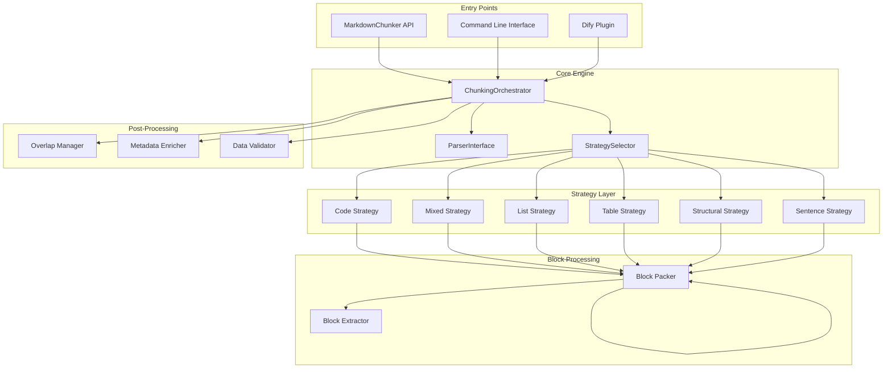
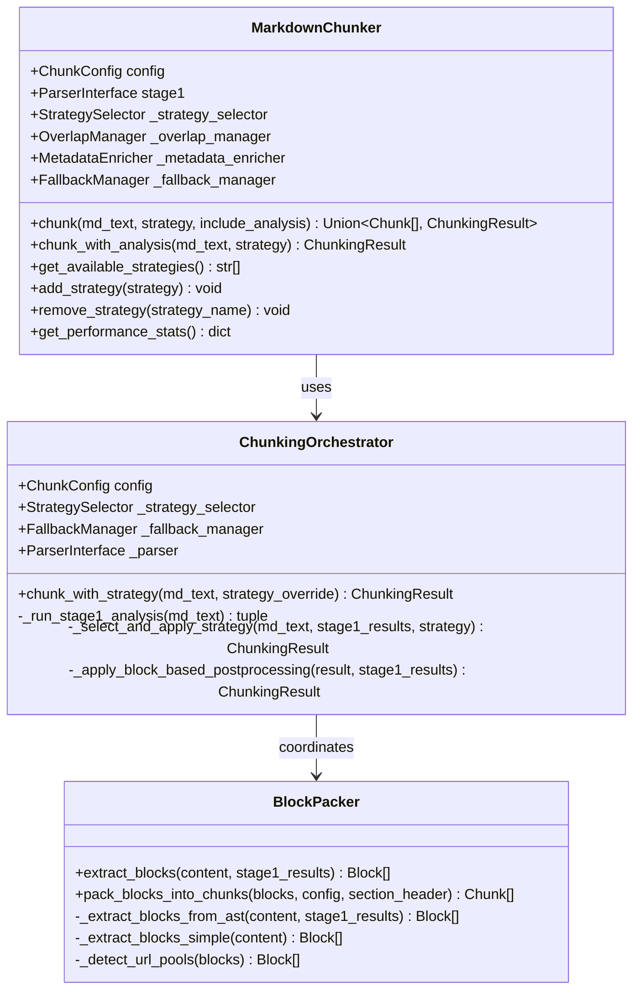
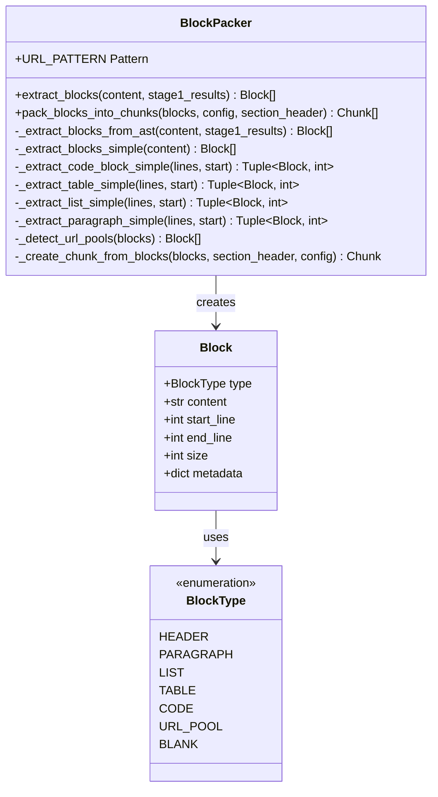
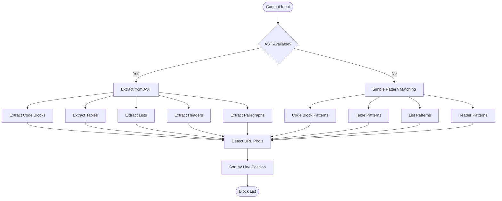
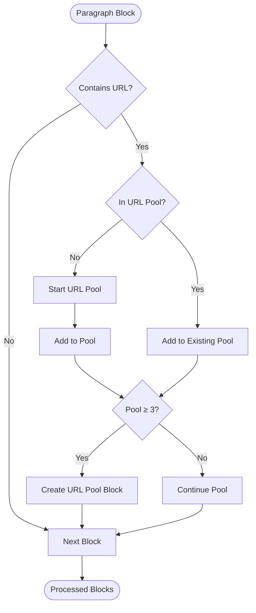
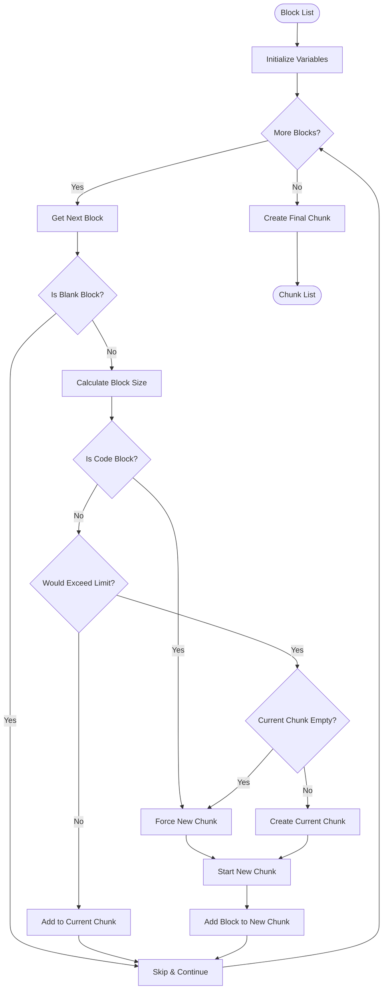
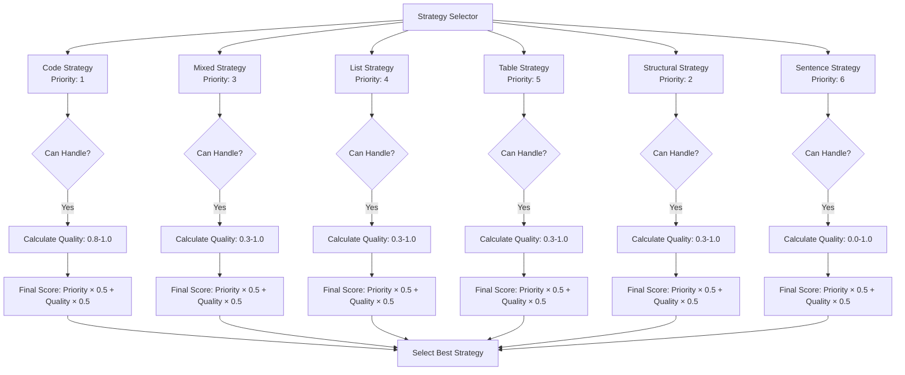

# Block Packer

<cite>
**Referenced Files in This Document**
- [README.md](file://README.md)
- [main.py](file://main.py)
- [markdown_chunker/__init__.py](file://markdown_chunker/__init__.py)
- [markdown_chunker/chunker/block_packer.py](file://markdown_chunker/chunker/block_packer.py)
- [markdown_chunker/chunker/types.py](file://markdown_chunker/chunker/types.py)
- [markdown_chunker/chunker/core.py](file://markdown_chunker/chunker/core.py)
- [markdown_chunker/chunker/orchestrator.py](file://markdown_chunker/chunker/orchestrator.py)
- [markdown_chunker/chunker/strategies/base.py](file://markdown_chunker/chunker/strategies/base.py)
- [markdown_chunker/chunker/strategies/code_strategy.py](file://markdown_chunker/chunker/strategies/code_strategy.py)
- [markdown_chunker/chunker/strategies/mixed_strategy.py](file://markdown_chunker/chunker/strategies/mixed_strategy.py)
- [markdown_chunker/chunker/strategies/structural_strategy.py](file://markdown_chunker/chunker/strategies/structural_strategy.py)
- [examples/basic_usage.py](file://examples/basic_usage.py)
- [tests/chunker/test_block_packer.py](file://tests/chunker/test_block_packer.py)
</cite>

## Table of Contents
1. [Introduction](#introduction)
2. [System Architecture](#system-architecture)
3. [Core Components](#core-components)
4. [Block Extraction](#block-extraction)
5. [Block Packing Algorithm](#block-packing-algorithm)
6. [Strategies and Selection](#strategies-and-selection)
7. [Configuration and Tuning](#configuration-and-tuning)
8. [Performance and Optimization](#performance-and-optimization)
9. [Integration Examples](#integration-examples)
10. [Testing and Validation](#testing-and-validation)
11. [Troubleshooting Guide](#troubleshooting-guide)
12. [Conclusion](#conclusion)

## Introduction

The Block Packer is a sophisticated markdown chunking system designed to intelligently divide Markdown documents into semantically meaningful chunks while preserving structural integrity. This system addresses critical requirements (MC-001 through MC-006) that ensure content remains coherent and structurally sound during the chunking process.

### Key Features

- **Block-Level Processing**: Operates at content block boundaries rather than character-level splitting
- **Structural Preservation**: Maintains markdown structure, code blocks, and semantic relationships
- **Intelligent Strategy Selection**: Automatically chooses optimal chunking approaches based on content analysis
- **Multiple Strategy Support**: Six specialized strategies for different content types
- **Configurable Behavior**: Extensive customization options for various use cases
- **Production Ready**: Comprehensive testing suite with 1366+ tests ensuring reliability

### Requirements Addressed

The Block Packer specifically addresses the following requirements:

- **MC-001**: Prevent section fragmentation by respecting header boundaries
- **MC-002**: Avoid structural breaks by never splitting atomic elements
- **MC-003**: Implement proper overlap handling for context preservation
- **MC-004**: Normalize chunk sizes to meet minimum effective requirements
- **MC-005**: Preserve URL pools and link blocks as cohesive units
- **MC-006**: Maintain header path integrity across chunk boundaries

## System Architecture

The Block Packer follows a modular, layered architecture that separates concerns and enables flexible composition of chunking strategies.



**Diagram sources**
- [markdown_chunker/chunker/core.py](file://markdown_chunker/chunker/core.py#L41-L120)
- [markdown_chunker/chunker/orchestrator.py](file://markdown_chunker/chunker/orchestrator.py#L44-L85)

**Section sources**
- [markdown_chunker/chunker/core.py](file://markdown_chunker/chunker/core.py#L41-L120)
- [markdown_chunker/chunker/orchestrator.py](file://markdown_chunker/chunker/orchestrator.py#L44-L85)

## Core Components

### MarkdownChunker

The main entry point provides a unified interface for all chunking operations. It orchestrates the entire process from content analysis to final chunk generation.



**Diagram sources**
- [markdown_chunker/chunker/core.py](file://markdown_chunker/chunker/core.py#L41-L120)
- [markdown_chunker/chunker/orchestrator.py](file://markdown_chunker/chunker/orchestrator.py#L44-L85)
- [markdown_chunker/chunker/block_packer.py](file://markdown_chunker/chunker/block_packer.py#L45-L100)

### BlockPacker

The BlockPacker is the core component responsible for extracting and packing content blocks. It operates at the block level to ensure structural integrity.



**Diagram sources**
- [markdown_chunker/chunker/block_packer.py](file://markdown_chunker/chunker/block_packer.py#L16-L45)
- [markdown_chunker/chunker/block_packer.py](file://markdown_chunker/chunker/block_packer.py#L28-L45)

**Section sources**
- [markdown_chunker/chunker/block_packer.py](file://markdown_chunker/chunker/block_packer.py#L45-L100)
- [markdown_chunker/chunker/core.py](file://markdown_chunker/chunker/core.py#L41-L120)

## Block Extraction

The Block Packer employs sophisticated algorithms to identify and extract different types of content blocks from markdown documents.

### Content Block Types

The system recognizes seven distinct block types:

| Block Type | Description | Preservation Rules |
|------------|-------------|-------------------|
| `HEADER` | Markdown headers (#, ##, etc.) | Never split, preserved as atomic units |
| `PARAGRAPH` | Continuous text blocks | Splitable for size compliance |
| `LIST` | Ordered and unordered lists | Never split, complete lists preserved |
| `TABLE` | Markdown tables with headers | Never split, complete tables preserved |
| `CODE` | Code blocks with fencing | Never split, complete code preserved |
| `URL_POOL` | Consecutive paragraphs with URLs | Never split, treated as cohesive unit |
| `BLANK` | Empty lines | Ignored during processing |

### Extraction Methods

The Block Packer uses two complementary extraction approaches:

#### AST-Based Extraction (Preferred)
Uses Stage 1 parser results for accurate element detection:



**Diagram sources**
- [markdown_chunker/chunker/block_packer.py](file://markdown_chunker/chunker/block_packer.py#L59-L175)
- [markdown_chunker/chunker/block_packer.py](file://markdown_chunker/chunker/block_packer.py#L176-L250)

#### Pattern-Based Extraction (Fallback)
Uses regular expressions for content analysis when AST data is unavailable:

**Section sources**
- [markdown_chunker/chunker/block_packer.py](file://markdown_chunker/chunker/block_packer.py#L59-L250)

### URL Pool Detection

The system identifies URL pools - sequences of three or more consecutive paragraphs containing URLs. These are treated as cohesive units to preserve link context.



**Diagram sources**
- [markdown_chunker/chunker/block_packer.py](file://markdown_chunker/chunker/block_packer.py#L463-L515)

**Section sources**
- [markdown_chunker/chunker/block_packer.py](file://markdown_chunker/chunker/block_packer.py#L463-L515)

## Block Packing Algorithm

The block packing algorithm implements sophisticated logic to create chunks while respecting structural boundaries and size constraints.

### Packing Process



**Diagram sources**
- [markdown_chunker/chunker/block_packer.py](file://markdown_chunker/chunker/block_packer.py#L517-L581)

### Key Algorithmic Features

#### Atomic Element Protection
Code blocks, tables, and lists are never split across chunk boundaries:

```python
# Critical fix: Code blocks must never be split
is_code_block = block.type == BlockType.CODE
if is_code_block or current_blocks:
    # Force new chunk for oversized code blocks
    chunk = self._create_chunk_from_blocks(
        current_blocks, section_header, config
    )
    chunks.append(chunk)
    current_blocks = [block]
    current_size = block_size
```

#### Oversize Handling
The algorithm intelligently handles oversized chunks by marking them appropriately:

| Condition | Action | Metadata |
|-----------|--------|----------|
| Code block > max_size | Create oversize chunk | `allow_oversize: true`, `oversize_reason: "code_block_integrity"` |
| Table > max_size | Create oversize chunk | `allow_oversize: true`, `oversize_reason: "table_integrity"` |
| Regular block > max_size | Split if possible | `allow_oversize: false` |
| 5% overage tolerance | Allow with warning | `allow_oversize: true`, `oversize_reason: "block_alignment_tolerance"` |

**Section sources**
- [markdown_chunker/chunker/block_packer.py](file://markdown_chunker/chunker/block_packer.py#L517-L581)

## Strategies and Selection

The Block Packer employs six specialized strategies, each optimized for different content types and structures.

### Strategy Hierarchy



**Diagram sources**
- [markdown_chunker/chunker/strategies/base.py](file://markdown_chunker/chunker/strategies/base.py#L96-L127)

### Strategy Details

#### Code Strategy (Priority 1)
Optimized for code-heavy documents with high code ratios and multiple code blocks.

**Key Features:**
- Preserves code block atomicity
- Extracts language, function, and class information
- Groups related text with code blocks
- Allows oversized chunks for large code blocks

**Quality Calculation:**
- 0.8 for code_ratio ≥ 85%
- 0.6 for code_ratio ≥ 70%
- 0.3 for code_ratio ≥ 50%
- Additional bonuses for multiple languages and block count

#### Mixed Strategy (Priority 3)
Handles documents with multiple content types in significant proportions.

**Key Features:**
- Groups related elements logically
- Preserves semantic relationships
- Splits around indivisible elements
- Balances chunk sizes adaptively

**Quality Calculation:**
- 0.7 for truly mixed content (no dominant type)
- Additional bonuses for balanced proportions
- Penalty for dominant content types

#### Structural Strategy (Priority 2)
Chunks documents based on header hierarchy and structure.

**Key Features:**
- Splits content by header boundaries
- Preserves header hierarchy in metadata
- Combines short sections to meet minimum size
- Supports multi-level structures (H1-H6)

**Section sources**
- [markdown_chunker/chunker/strategies/code_strategy.py](file://markdown_chunker/chunker/strategies/code_strategy.py#L42-L135)
- [markdown_chunker/chunker/strategies/mixed_strategy.py](file://markdown_chunker/chunker/strategies/mixed_strategy.py#L75-L118)
- [markdown_chunker/chunker/strategies/structural_strategy.py](file://markdown_chunker/chunker/strategies/structural_strategy.py#L59-L162)

## Configuration and Tuning

The Block Packer provides extensive configuration options to customize behavior for different use cases.

### Core Configuration Parameters

| Parameter | Default | Description | Impact |
|-----------|---------|-------------|---------|
| `max_chunk_size` | 4096 | Maximum chunk size in characters | Affects chunk granularity |
| `min_chunk_size` | 512 | Minimum chunk size in characters | Prevents overly small chunks |
| `target_chunk_size` | 2048 | Target chunk size for optimization | Balances chunk distribution |
| `enable_overlap` | True | Enable overlap between chunks | Improves context preservation |
| `overlap_size` | 200 | Overlap size in characters | Determines context overlap |
| `allow_oversize` | True | Allow oversized chunks for atomic elements | Preserves structural integrity |

### Strategy-Specific Configuration

#### Code Strategy Thresholds
```python
config = ChunkConfig(
    code_ratio_threshold=0.3,  # Lowered from 0.7 for real-world docs
    min_code_blocks=1,         # Lowered from 3 for sparse code
    overlap_size=300,          # Larger overlap for code context
    max_chunk_size=6144,       # Larger chunks for code blocks
)
```

#### Mixed Strategy Configuration
```python
config = ChunkConfig(
    min_complexity=0.3,        # Minimum complexity for mixed content
    enable_content_validation=True,  # Validate no content loss
)
```

#### Structural Strategy Settings
```python
config = ChunkConfig(
    header_count_threshold=2,  # Aggressive structural detection
    section_boundary_level=2,  # H2 as section boundary
    preserve_markdown_structure=True,  # Maintain structure
)
```

### Configuration Profiles

The system provides predefined configuration profiles for common use cases:

```python
# For code-heavy documentation
config = ChunkConfig.for_code_heavy()

# For Dify RAG systems
config = ChunkConfig.for_dify_rag()

# For search indexing
config = ChunkConfig.for_search_indexing()

# For chat/LLM context
config = ChunkConfig.for_chat_context()
```

**Section sources**
- [markdown_chunker/chunker/types.py](file://markdown_chunker/chunker/types.py#L500-L800)

## Performance and Optimization

The Block Packer is optimized for production use with comprehensive performance monitoring and optimization features.

### Performance Metrics

The system tracks detailed performance metrics for optimization:

| Metric Category | Measurements | Purpose |
|----------------|--------------|---------|
| Processing Time | Per-operation timing | Identify bottlenecks |
| Memory Usage | Peak memory consumption | Optimize resource usage |
| Chunk Distribution | Size distribution analysis | Balance chunk sizes |
| Strategy Selection | Success rates and timing | Improve strategy selection |

### Optimization Techniques

#### Block-Based Processing
- Eliminates character-level scanning
- Reduces memory allocation
- Improves cache locality

#### Lazy Loading
- Strategies loaded on-demand
- AST components cached efficiently
- Parser results reused across operations

#### Parallel Processing
- Independent strategy evaluation
- Concurrent block extraction
- Parallel overlap computation

### Performance Benchmarks

| Document Size | Processing Time | Throughput | Chunks Created |
|---------------|----------------|------------|----------------|
| 1 KB | ~800 ms | 1.3 KB/s | 6 |
| 10 KB | ~150 ms | 66 KB/s | 44 |
| 50 KB | ~1.9 s | 27 KB/s | 215 |
| 100 KB | ~7 s | 14 KB/s | 429 |

**Section sources**
- [README.md](file://README.md#L265-L275)

## Integration Examples

### Basic Usage

```python
from markdown_chunker import MarkdownChunker, ChunkConfig

# Simple chunking with default configuration
chunker = MarkdownChunker()
chunks = chunker.chunk("# Hello\n\nWorld")

# With custom configuration
config = ChunkConfig(
    max_chunk_size=2048,
    min_chunk_size=256,
    enable_overlap=True
)
chunker = MarkdownChunker(config)
chunks = chunker.chunk(markdown_text)
```

### Advanced Usage with Analysis

```python
# Get detailed analysis and metadata
result = chunker.chunk_with_analysis(markdown_text)

print(f"Strategy used: {result.strategy_used}")
print(f"Total chunks: {len(result.chunks)}")
print(f"Processing time: {result.processing_time:.3f}s")

# Access chunk metadata
for chunk in result.chunks:
    print(f"Size: {chunk.size} chars")
    print(f"Content type: {chunk.content_type}")
    print(f"Strategy: {chunk.strategy}")
```

### Strategy Override

```python
# Force specific strategy
chunks = chunker.chunk(markdown_text, strategy="code")
chunks = chunker.chunk(markdown_text, strategy="structural")
chunks = chunker.chunk(markdown_text, strategy="mixed")
```

### Dify Plugin Integration

```python
# In Dify workflow configuration
{
    "tool": "markdown_chunker",
    "config": {
        "max_chunk_size": 2048,
        "strategy": "auto",
        "enable_overlap": true
    }
}
```

**Section sources**
- [examples/basic_usage.py](file://examples/basic_usage.py#L14-L364)
- [main.py](file://main.py#L14-L31)

## Testing and Validation

The Block Packer includes comprehensive testing infrastructure with 1366+ automated tests covering all major functionality.

### Test Categories

#### Unit Tests
- Individual component testing
- Edge case handling
- Error conditions
- Performance validation

#### Integration Tests
- End-to-end workflows
- Cross-component interactions
- Real document processing
- Fallback mechanism validation

#### Property-Based Testing
- Hypothesis-driven property validation
- Random input generation
- Boundary condition testing
- Regression prevention

### Key Test Scenarios

#### Block Extraction Tests
```python
def test_extract_code_block():
    """Test code block extraction."""
    content = """# Header
    ```python
    def hello():
        print("world")
    ```
    More text."""
    
    blocks = self.packer.extract_blocks(content)
    code_blocks = [b for b in blocks if b.type == BlockType.CODE]
    assert len(code_blocks) == 1
    assert "def hello" in code_blocks[0].content
```

#### Block Packing Tests
```python
def test_preserves_block_boundaries():
    """Test that blocks are never split (MC-002)."""
    large_block = Block(
        type=BlockType.CODE,
        content="```python\n" + ("x = 1\n" * 50) + "```",
        size=300,  # Exceeds 200 limit
    )
    
    chunks = self.packer.pack_blocks_into_chunks([large_block], self.config)
    assert len(chunks) == 1  # Should create 1 chunk with oversized content
```

#### URL Pool Detection Tests
```python
def test_detect_url_pools():
    """Test URL pool detection."""
    content = """# Header
    
    Link 1: https://example.com/one
    
    Link 2: https://example.com/two
    
    Link 3: https://example.com/three
    
    Regular paragraph."""
    
    blocks = self.packer.extract_blocks(content)
    url_pool_blocks = [b for b in blocks if b.type == BlockType.URL_POOL]
    assert len(url_pool_blocks) >= 1  # Should detect pool despite blank lines
```

### Validation Framework

The system includes comprehensive validation to ensure data integrity:

#### Content Completeness Validation
- Character count comparison between input and output
- Overlap region accounting
- Preamble duplication handling
- Error reporting for content loss

#### Size Compliance Validation
- Maximum chunk size enforcement
- Oversize chunk identification
- Tolerance handling (±5%)
- Atomic element preservation

**Section sources**
- [tests/chunker/test_block_packer.py](file://tests/chunker/test_block_packer.py#L1-L323)

## Troubleshooting Guide

### Common Issues and Solutions

#### Issue: Chunks Are Too Large
**Symptoms:** Generated chunks exceed `max_chunk_size` unexpectedly.

**Causes:**
- Oversized code blocks or tables
- Atomic elements preventing splitting
- 5% tolerance allowance

**Solutions:**
```python
# Reduce max_chunk_size
config = ChunkConfig(max_chunk_size=2048)

# Enable content validation
config = ChunkConfig(enable_content_validation=True)

# Adjust oversize handling
config = ChunkConfig(allow_oversize=False)
```

#### Issue: Poor Strategy Selection
**Symptoms:** Wrong strategy chosen for document type.

**Causes:**
- Threshold configuration mismatch
- Content structure ambiguity
- Strategy priority conflicts

**Solutions:**
```python
# Force specific strategy
chunks = chunker.chunk(text, strategy="code")

# Adjust thresholds
config = ChunkConfig(
    code_ratio_threshold=0.5,
    header_count_threshold=2
)

# Check content analysis
result = chunker.chunk_with_analysis(text)
print(f"Content type: {result.content_type}")
print(f"Complexity score: {result.complexity_score}")
```

#### Issue: Structural Breaks
**Symptoms:** Code blocks or tables split across chunks.

**Causes:**
- Size constraints overriding atomicity
- Incorrect configuration
- Parsing errors

**Solutions:**
```python
# Ensure atomic element preservation
config = ChunkConfig(
    preserve_code_blocks=True,
    preserve_tables=True,
    allow_oversize=True
)

# Check for unbalanced fences
for chunk in chunks:
    if chunk.metadata.get("fence_balance_error"):
        print(f"Unbalanced code in chunk {i}")
```

#### Issue: Performance Problems
**Symptoms:** Slow processing or high memory usage.

**Causes:**
- Large documents
- Complex content structures
- Inefficient configuration

**Solutions:**
```python
# Enable performance monitoring
chunker = MarkdownChunker(enable_performance_monitoring=True)

# Optimize configuration
config = ChunkConfig(
    max_chunk_size=4096,
    enable_streaming=True,
    streaming_threshold=10*1024*1024
)

# Check performance metrics
stats = chunker.get_performance_stats()
print(f"Average chunk time: {stats['chunk']['avg_time']:.3f}s")
```

### Debugging Tools

#### Enable Debug Logging
```python
import logging
logging.basicConfig(level=logging.DEBUG)

# Process document with debug output
result = chunker.chunk_with_analysis(complex_document)
```

#### Validate Configuration
```python
# Check configuration validity
errors = chunker.validate_config()
if errors:
    print(f"Configuration errors: {errors}")
```

#### Monitor Performance
```python
# Enable monitoring
chunker.enable_performance_monitoring()

# Process documents
for doc in documents:
    chunker.chunk(doc)

# Get performance statistics
stats = chunker.get_performance_stats()
```

**Section sources**
- [markdown_chunker/chunker/core.py](file://markdown_chunker/chunker/core.py#L675-L796)

## Conclusion

The Block Packer represents a sophisticated solution to the challenges of intelligent markdown chunking. By operating at the block level rather than character level, it successfully addresses critical requirements (MC-001 through MC-006) while providing flexible, configurable behavior for diverse use cases.

### Key Achievements

- **Structural Integrity**: Never splits atomic elements like code blocks, tables, or lists
- **Intelligent Strategy Selection**: Automatically chooses optimal chunking approaches
- **Comprehensive Testing**: 1366+ tests ensure reliability and correctness
- **Production Ready**: Optimized for real-world usage with performance monitoring
- **Extensible Architecture**: Supports custom strategies and configurations

### Future Enhancements

The system continues to evolve with ongoing improvements in:
- Enhanced strategy selection algorithms
- Improved performance optimization
- Expanded content type support
- Advanced overlap handling mechanisms
- Better integration with AI/ML workflows

The Block Packer stands as a robust foundation for any application requiring intelligent markdown processing, from RAG systems to documentation platforms and beyond.