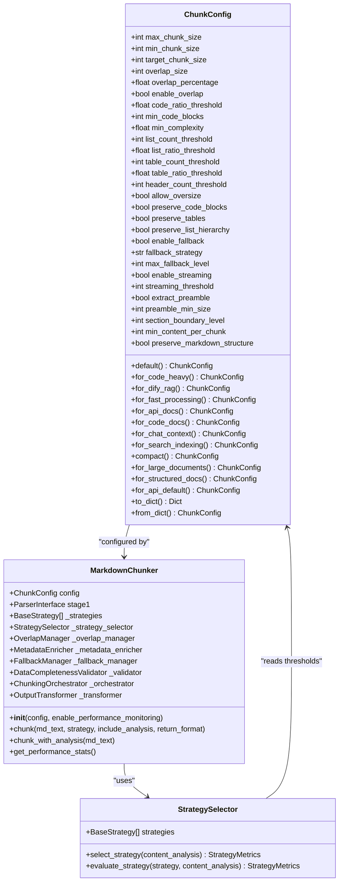
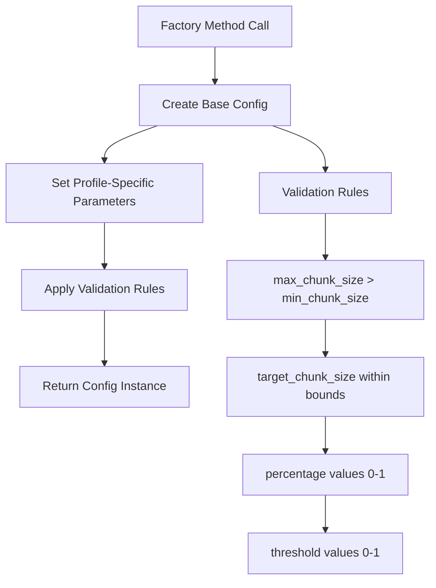
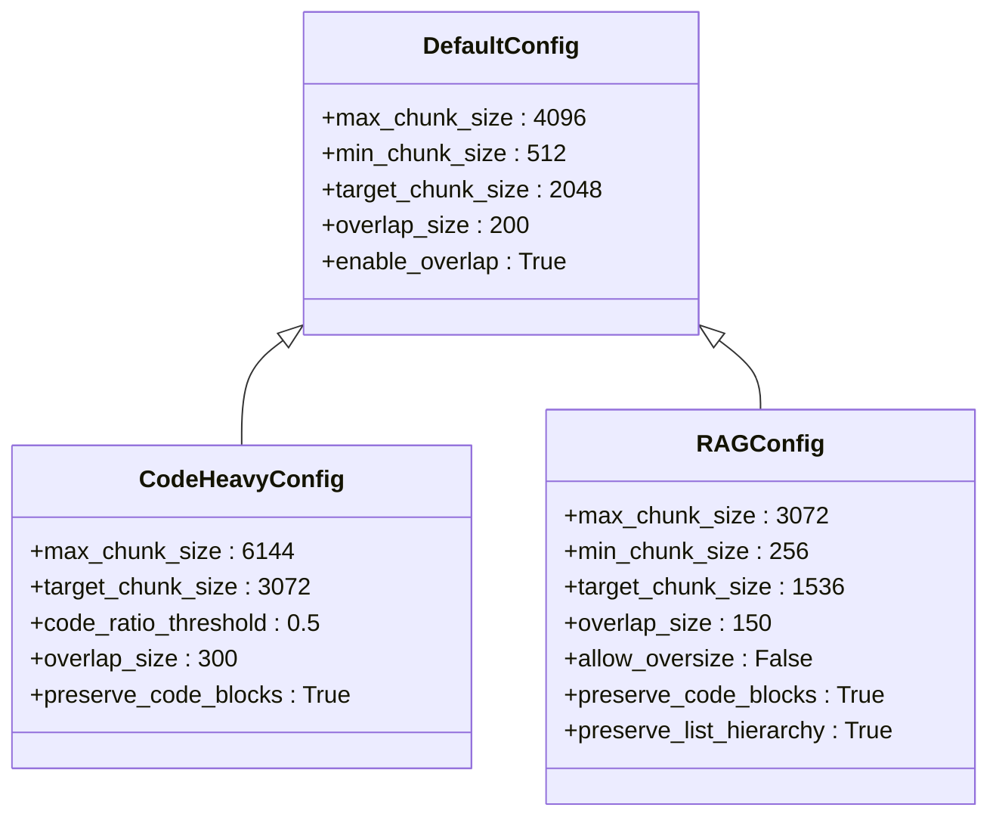
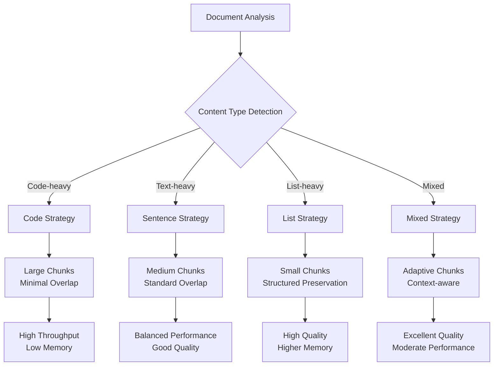

# Configuration Profiles

<cite>
**Referenced Files in This Document**
- [markdown_chunker/chunker/types.py](file://markdown_chunker/chunker/types.py)
- [markdown_chunker/chunker/core.py](file://markdown_chunker/chunker/core.py)
- [tests/chunker/test_config_profiles.py](file://tests/chunker/test_config_profiles.py)
- [examples/basic_usage.py](file://examples/basic_usage.py)
- [tests/fixtures/mixed.md](file://tests/fixtures/mixed.md)
- [tests/fixtures/code_heavy.md](file://tests/fixtures/code_heavy.md)
- [tests/integration/test_full_api_flow.py](file://tests/integration/test_full_api_flow.py)
- [examples/rag_integration.py](file://examples/rag_integration.py)
</cite>

## Table of Contents
1. [Introduction](#introduction)
2. [Configuration Architecture](#configuration-architecture)
3. [Predefined Profiles](#predefined-profiles)
4. [Profile Factory Methods](#profile-factory-methods)
5. [Custom Profile Creation](#custom-profile-creation)
6. [Profile Inheritance and Extension](#profile-inheritance-and-extension)
7. [Performance Implications](#performance-implications)
8. [Best Practices](#best-practices)
9. [Implementation Examples](#implementation-examples)
10. [Troubleshooting](#troubleshooting)

## Introduction

The Dify Markdown Chunker provides a sophisticated configuration system that allows users to tailor chunking behavior to specific document types and use cases through predefined profiles. These profiles encapsulate sets of parameters including chunk size limits, overlap settings, strategy thresholds, and enabled strategies, optimizing the chunking process for different content types and application requirements.

The configuration system follows a factory pattern with built-in profiles that serve as templates for common use cases, while also providing flexibility for custom configurations through programmatic extension and inheritance mechanisms.

## Configuration Architecture

The core configuration system is built around the `ChunkConfig` dataclass, which serves as the foundation for all chunking behavior customization. This configuration object controls every aspect of the chunking process through carefully designed parameters.



**Diagram sources**
- [markdown_chunker/chunker/types.py](file://markdown_chunker/chunker/types.py#L498-L1061)
- [markdown_chunker/chunker/core.py](file://markdown_chunker/chunker/core.py#L41-L200)

**Section sources**
- [markdown_chunker/chunker/types.py](file://markdown_chunker/chunker/types.py#L498-L1061)
- [markdown_chunker/chunker/core.py](file://markdown_chunker/chunker/core.py#L41-L200)

## Predefined Profiles

The system provides several predefined profiles optimized for common use cases. Each profile encapsulates a specific set of parameters designed to achieve optimal chunking results for particular document types and application requirements.

### Available Profiles

| Profile | Purpose | Key Characteristics |
|---------|---------|-------------------|
| `for_api_default()` | General API usage | Balanced settings (4096 max, 200 overlap) |
| `for_dify_rag()` | RAG systems | Moderate chunks (3072 max, overlap enabled) |
| `for_fast_processing()` | High throughput | Large chunks (8192 max, no overlap) |
| `for_code_heavy()` | Code documentation | Large chunks (6144 max, aggressive code detection) |
| `for_structured_docs()` | Well-organized docs | Medium chunks (3072 max, header-focused) |
| `for_large_documents()` | Big documents | Streaming enabled, large chunks (8192 max) |
| `compact()` | Fine-grained processing | Small chunks (2048 max, many chunks) |
| `for_api_docs()` | API documentation | Balanced with code emphasis |
| `for_code_docs()` | Pure code docs | Minimal overlap, smaller chunks |
| `for_chat_context()` | LLM context | Small chunks (1536 max) |
| `for_search_indexing()` | Search applications | Small chunks with overlap |

### Profile Comparison Matrix


**Section sources**
- [markdown_chunker/chunker/types.py](file://markdown_chunker/chunker/types.py#L870-L1001)
- [tests/chunker/test_config_profiles.py](file://tests/chunker/test_config_profiles.py#L1-L70)

## Profile Factory Methods

Each predefined profile is implemented as a class method on the `ChunkConfig` class, following a consistent naming convention and providing clear documentation for each configuration's intended use case.

### Factory Method Implementation Pattern

The factory methods follow a standardized pattern that ensures consistency and reliability across all profiles:



**Diagram sources**
- [markdown_chunker/chunker/types.py](file://markdown_chunker/chunker/types.py#L667-L1001)

### Profile Parameter Details

Each profile optimizes specific parameters for its intended use case:

#### Code-Heavy Profile (`for_code_heavy`)
- **Max Chunk Size**: 6144 (larger for complete code blocks)
- **Target Chunk Size**: 3072
- **Code Ratio Threshold**: 0.5 (more aggressive detection)
- **Min Code Blocks**: 2
- **Overlap Size**: 300 (larger for code context)
- **Preserve Code Blocks**: True

#### RAG Profile (`for_dify_rag`)
- **Max Chunk Size**: 3072
- **Min Chunk Size**: 256
- **Target Chunk Size**: 1536
- **Overlap Size**: 150
- **Allow Oversize**: False (strict limits)
- **Preserve Code Blocks**: True
- **Preserve List Hierarchy**: True

#### Fast Processing Profile (`for_fast_processing`)
- **Max Chunk Size**: 8192
- **Min Chunk Size**: 1024
- **Target Chunk Size**: 4096
- **Overlap Size**: 100
- **Enable Overlap**: False
- **Enable Streaming**: True

**Section sources**
- [markdown_chunker/chunker/types.py](file://markdown_chunker/chunker/types.py#L695-L1001)

## Custom Profile Creation

Users can create custom profiles by instantiating `ChunkConfig` with specific parameters or by extending existing profiles. The configuration system provides multiple approaches for customization.

### Direct Instantiation

The simplest approach is to create a custom configuration by directly instantiating `ChunkConfig` with desired parameters:

```python
# Custom configuration example
custom_config = ChunkConfig(
    max_chunk_size=2500,
    min_chunk_size=300,
    target_chunk_size=1200,
    overlap_size=150,
    enable_overlap=True,
    code_ratio_threshold=0.4,
    preserve_code_blocks=True
)
```

### Profile Extension Pattern

For more complex customizations, users can extend existing profiles by inheriting from them and overriding specific parameters:

```python
# Extension pattern example
class CustomRAGConfig(ChunkConfig):
    @classmethod
    def for_custom_rag(cls):
        config = super().for_dify_rag()
        config.max_chunk_size = 2500  # Custom size
        config.overlap_size = 120     # Custom overlap
        config.code_ratio_threshold = 0.5  # Adjusted threshold
        return config
```

### Dynamic Configuration Generation

The system supports dynamic configuration generation based on runtime conditions:

```python
# Runtime configuration example
def create_optimized_config(document_type: str, content_length: int):
    if document_type == "code":
        return ChunkConfig.for_code_heavy()
    elif document_type == "api":
        return ChunkConfig.for_api_docs()
    elif content_length > 100000:  # Large document
        return ChunkConfig.for_large_documents()
    else:
        return ChunkConfig.default()
```

**Section sources**
- [markdown_chunker/chunker/types.py](file://markdown_chunker/chunker/types.py#L1003-L1061)
- [examples/basic_usage.py](file://examples/basic_usage.py#L115-L130)

## Profile Inheritance and Extension

The configuration system supports inheritance and extension mechanisms that allow users to build upon existing profiles while maintaining type safety and configuration validation.

### Inheritance Mechanism

The factory methods implement a clean inheritance pattern where each profile can be seen as an extension of the default configuration:



**Diagram sources**
- [markdown_chunker/chunker/types.py](file://markdown_chunker/chunker/types.py#L667-L1001)

### Parameter Override Strategy

When extending profiles, the system follows a clear override strategy:

1. **Default Values**: Start with base configuration defaults
2. **Profile Overrides**: Apply profile-specific parameter changes
3. **Validation**: Ensure all parameters remain within valid ranges
4. **Consistency**: Maintain logical parameter relationships

### Advanced Extension Patterns

For complex use cases, users can implement advanced extension patterns:

```python
# Multi-level extension example
class ProductionConfig(ChunkConfig):
    @classmethod
    def for_production(cls):
        config = super().for_dify_rag()
        # Production optimizations
        config.enable_fallback = True
        config.max_fallback_level = 3
        config.streaming_threshold = 5 * 1024 * 1024  # 5MB
        return config

class DebugConfig(ProductionConfig):
    @classmethod
    def for_debugging(cls):
        config = super().for_production()
        # Debug-specific settings
        config.extract_preamble = True
        config.separate_preamble_chunk = True
        return config
```

**Section sources**
- [markdown_chunker/chunker/types.py](file://markdown_chunker/chunker/types.py#L667-L1001)

## Performance Implications

Different configuration profiles have varying performance characteristics that impact processing speed, memory usage, and chunk quality. Understanding these implications helps users select the most appropriate profile for their specific requirements.

### Performance Characteristics by Profile

| Profile | Processing Speed | Memory Usage | Chunk Quality | Best Use Case |
|---------|------------------|--------------|---------------|---------------|
| Fast Processing | Highest | Lowest | Good | Batch processing, high volume |
| Code Heavy | Very High | Low | Excellent | Technical documentation |
| RAG | Medium | Medium | Excellent | Retrieval systems |
| API Docs | Medium | Medium | Good | API documentation |
| Search Indexing | Low | High | Excellent | Search applications |
| Compact | Low | High | Excellent | Precise matching |

### Performance Optimization Strategies



**Diagram sources**
- [markdown_chunker/chunker/types.py](file://markdown_chunker/chunker/types.py#L584-L620)

### Memory Usage Patterns

Different profiles exhibit distinct memory usage patterns:

- **Fast Processing**: Minimal memory due to large chunks and no overlap
- **Code Heavy**: Moderate memory for preserving code blocks
- **Search Indexing**: Higher memory for small chunks with overlap
- **Large Documents**: Streaming reduces memory pressure for big files

### Processing Time Analysis

The relationship between configuration parameters and processing time follows predictable patterns:

- **Chunk Size**: Larger chunks generally process faster
- **Overlap**: Enabling overlap increases processing time linearly
- **Strategy Complexity**: Code strategy is fastest, mixed strategy is slowest
- **Fallback**: Enabled fallback strategies add processing overhead

**Section sources**
- [markdown_chunker/chunker/types.py](file://markdown_chunker/chunker/types.py#L584-L620)
- [tests/chunker/test_performance_benchmarks.py](file://tests/chunker/test_performance_benchmarks.py#L311-L356)

## Best Practices

Effective use of configuration profiles requires understanding the trade-offs between different parameter combinations and aligning them with specific use case requirements.

### Selection Guidelines

Choose profiles based on these criteria:

#### Content Type Matching
- **Code Documentation**: Use `for_code_docs()` or `for_code_heavy()`
- **API Documentation**: Use `for_api_docs()` or `for_dify_rag()`
- **Technical Tutorials**: Use `for_code_heavy()` with custom adjustments
- **General Documentation**: Use `for_structured_docs()` or default
- **Large Documents**: Use `for_large_documents()` with streaming

#### Application Requirements
- **High Throughput**: Use `for_fast_processing()` or custom large chunk sizes
- **Quality Focus**: Use profiles with overlap and strict limits
- **Memory Constraints**: Use compact or fast processing profiles
- **Search Applications**: Use `for_search_indexing()` or custom small chunks

### Configuration Validation

Always validate configurations before deployment:

```python
# Validation example
def validate_config(config: ChunkConfig) -> List[str]:
    errors = []
    
    # Size validation
    if config.max_chunk_size <= config.min_chunk_size:
        errors.append("max_chunk_size must be greater than min_chunk_size")
    
    # Overlap validation
    if config.enable_overlap and config.overlap_size <= 0:
        errors.append("overlap_size must be positive when overlap is enabled")
    
    # Threshold validation
    thresholds = [
        ("code_ratio_threshold", config.code_ratio_threshold),
        ("list_ratio_threshold", config.list_ratio_threshold),
        ("table_ratio_threshold", config.table_ratio_threshold)
    ]
    
    for name, value in thresholds:
        if not (0.0 <= value <= 1.0):
            errors.append(f"{name} must be between 0.0 and 1.0")
    
    return errors
```

### Monitoring and Tuning

Implement monitoring for configuration effectiveness:

- **Chunk Size Distribution**: Monitor average and maximum chunk sizes
- **Strategy Usage**: Track which strategies are selected most frequently
- **Fallback Frequency**: Monitor fallback usage rates
- **Processing Time**: Track processing performance trends

### Common Pitfalls to Avoid

1. **Overly Aggressive Code Detection**: Setting thresholds too low can miss code blocks
2. **Insufficient Overlap**: Too little overlap can break contextual continuity
3. **Inappropriate Chunk Sizes**: Using sizes that don't match downstream requirements
4. **Ignoring Content Type**: Using generic profiles for specialized content

**Section sources**
- [tests/chunker/test_config_profiles.py](file://tests/chunker/test_config_profiles.py#L45-L70)
- [examples/basic_usage.py](file://examples/basic_usage.py#L115-L130)

## Implementation Examples

This section provides practical examples of using configuration profiles in real-world scenarios, demonstrating both basic usage and advanced customization techniques.

### Basic Profile Usage

Simple implementation using predefined profiles:

```python
# Basic usage examples
from markdown_chunker import MarkdownChunker, ChunkConfig

# API documentation processing
api_config = ChunkConfig.for_api_docs()
api_chunker = MarkdownChunker(api_config)
api_result = api_chunker.chunk_with_analysis(api_documentation)

# Code documentation processing  
code_config = ChunkConfig.for_code_docs()
code_chunker = MarkdownChunker(code_config)
code_result = code_chunker.chunk_with_analysis(code_documentation)

# RAG system processing
rag_config = ChunkConfig.for_dify_rag()
rag_chunker = MarkdownChunker(rag_config)
rag_result = rag_chunker.chunk_with_analysis(rag_documentation)
```

### Advanced Customization Examples

More sophisticated customization scenarios:

```python
# Custom profile with inheritance
class TechnicalDocumentationConfig(ChunkConfig):
    @classmethod
    def for_technical_docs(cls):
        config = super().for_code_heavy()
        config.target_chunk_size = 2500
        config.overlap_size = 250
        config.code_ratio_threshold = 0.4  # Less aggressive
        return config

# Dynamic configuration based on document analysis
def create_optimized_config(document: str, document_type: str):
    word_count = len(document.split())
    
    if document_type == "technical":
        if word_count > 5000:
            return ChunkConfig.for_large_documents()
        else:
            return TechnicalDocumentationConfig.for_technical_docs()
    elif document_type == "api":
        return ChunkConfig.for_api_docs()
    elif document_type == "tutorial":
        return ChunkConfig.for_code_heavy()
    else:
        return ChunkConfig.default()

# Configuration with external factors
def create_environment_aware_config(environment: str):
    base_config = ChunkConfig.for_dify_rag()
    
    if environment == "production":
        base_config.enable_fallback = True
        base_config.max_fallback_level = 2
    elif environment == "development":
        base_config.enable_fallback = False
        base_config.extract_preamble = True
    
    return base_config
```

### Integration Examples

Real-world integration patterns:

```python
# Dify workflow integration
workflow_config = {
    "max_chunk_size": 2048,
    "min_chunk_size": 256,
    "overlap_size": 100,
    "enable_overlap": True,
    "code_ratio_threshold": 0.6
}

# Convert to ChunkConfig
config = ChunkConfig.from_dict(workflow_config)
chunker = MarkdownChunker(config)

# RAG pipeline integration
def prepare_for_rag(markdown_content: str, profile: str = "dify_rag"):
    if profile == "dify_rag":
        config = ChunkConfig.for_dify_rag()
    elif profile == "custom":
        config = ChunkConfig(
            max_chunk_size=2500,
            overlap_size=150,
            enable_overlap=True
        )
    
    chunker = MarkdownChunker(config)
    result = chunker.chunk_with_analysis(markdown_content)
    
    # Prepare for embedding
    embeddings_data = []
    for chunk in result.chunks:
        metadata = {
            "content_type": chunk.content_type,
            "strategy": chunk.strategy,
            "chunk_index": result.chunks.index(chunk),
            "has_code": "language" in chunk.metadata,
            "has_list": chunk.metadata.get("list_type", None) is not None,
            "has_table": chunk.metadata.get("column_count", None) is not None
        }
        
        embeddings_data.append({
            "text": chunk.content,
            "metadata": metadata
        })
    
    return embeddings_data
```

**Section sources**
- [examples/basic_usage.py](file://examples/basic_usage.py#L168-L218)
- [examples/rag_integration.py](file://examples/rag_integration.py#L359-L431)
- [tests/integration/test_full_api_flow.py](file://tests/integration/test_full_api_flow.py#L197-L241)

## Troubleshooting

Common issues and solutions when working with configuration profiles, along with diagnostic techniques for identifying and resolving problems.

### Common Configuration Issues

#### Profile Not Working as Expected

**Problem**: Selected profile produces unexpected chunking results
**Diagnosis Steps**:
1. Check parameter values against profile documentation
2. Verify content type detection accuracy
3. Review strategy selection logic

**Solution**: 
```python
# Diagnostic approach
def diagnose_profile_issue(config: ChunkConfig, content: str):
    print(f"Configuration: {config}")
    
    # Check thresholds
    print(f"Code ratio threshold: {config.code_ratio_threshold}")
    print(f"List ratio threshold: {config.list_ratio_threshold}")
    print(f"Table ratio threshold: {config.table_ratio_threshold}")
    
    # Test with different strategies
    chunker = MarkdownChunker(config)
    result = chunker.chunk_with_analysis(content)
    
    print(f"Strategy used: {result.strategy_used}")
    print(f"Total chunks: {len(result.chunks)}")
    print(f"Average chunk size: {result.average_chunk_size:.0f}")
```

#### Performance Issues

**Problem**: Slow processing or high memory usage
**Diagnostic Approach**:
1. Profile processing time with different configurations
2. Monitor chunk size distribution
3. Analyze strategy selection patterns

**Solutions**:
- Use `for_fast_processing()` for high-volume scenarios
- Increase chunk sizes to reduce total chunk count
- Disable overlap when not needed
- Enable streaming for large documents

#### Memory Problems

**Problem**: Out-of-memory errors with large documents
**Solutions**:
- Use `for_large_documents()` profile
- Reduce chunk sizes with `compact()` profile
- Enable streaming with custom streaming thresholds
- Process documents in smaller batches

### Validation and Testing

Implement comprehensive validation for configuration issues:

```python
# Configuration validation
def validate_chunk_config(config: ChunkConfig) -> List[str]:
    issues = []
    
    # Size validation
    if config.max_chunk_size <= config.min_chunk_size:
        issues.append("max_chunk_size must be greater than min_chunk_size")
    
    # Overlap validation
    if config.enable_overlap and config.overlap_size <= 0:
        issues.append("overlap_size must be positive when overlap is enabled")
    
    # Threshold validation
    thresholds = [
        ("code_ratio_threshold", config.code_ratio_threshold),
        ("list_ratio_threshold", config.list_ratio_threshold),
        ("table_ratio_threshold", config.table_ratio_threshold)
    ]
    
    for name, value in thresholds:
        if not (0.0 <= value <= 1.0):
            issues.append(f"{name} must be between 0.0 and 1.0")
    
    # Strategy validation
    if config.min_code_blocks <= 0:
        issues.append("min_code_blocks must be positive")
    if config.list_count_threshold <= 0:
        issues.append("list_count_threshold must be positive")
    if config.table_count_threshold <= 0:
        issues.append("table_count_threshold must be positive")
    
    return issues

# Testing configuration effectiveness
def test_profile_effectiveness(profile_method, test_content):
    config = profile_method()
    chunker = MarkdownChunker(config)
    result = chunker.chunk_with_analysis(test_content)
    
    print(f"Profile: {profile_method.__name__}")
    print(f"Strategy: {result.strategy_used}")
    print(f"Chunks: {len(result.chunks)}")
    print(f"Average size: {result.average_chunk_size:.0f}")
    print(f"Min size: {result.min_chunk_size}")
    print(f"Max size: {result.max_chunk_size}")
    print(f"Complexity: {result.complexity_score:.2f}")
    
    return result
```

### Debugging Tools

Create debugging utilities for configuration analysis:

```python
# Configuration debugging
def debug_configuration(config: ChunkConfig, content: str):
    print("=== Configuration Debug ===")
    print(f"Max chunk size: {config.max_chunk_size}")
    print(f"Min chunk size: {config.min_chunk_size}")
    print(f"Target chunk size: {config.target_chunk_size}")
    print(f"Overlap enabled: {config.enable_overlap}")
    print(f"Overlap size: {config.overlap_size}")
    print(f"Code ratio threshold: {config.code_ratio_threshold}")
    print(f"List ratio threshold: {config.list_ratio_threshold}")
    print(f"Table ratio threshold: {config.table_ratio_threshold}")
    print(f"Allow oversize: {config.allow_oversize}")
    print(f"Preserve code blocks: {config.preserve_code_blocks}")
    print(f"Preserve tables: {config.preserve_tables}")
    print(f"Preserve list hierarchy: {config.preserve_list_hierarchy}")
    
    print("\n=== Strategy Thresholds ===")
    print(f"Min code blocks: {config.min_code_blocks}")
    print(f"Min complexity: {config.min_complexity}")
    print(f"List count threshold: {config.list_count_threshold}")
    print(f"Table count threshold: {config.table_count_threshold}")
    print(f"Header count threshold: {config.header_count_threshold}")
    
    print("\n=== Performance Settings ===")
    print(f"Enable fallback: {config.enable_fallback}")
    print(f"Fallback strategy: {config.fallback_strategy}")
    print(f"Max fallback level: {config.max_fallback_level}")
    print(f"Enable streaming: {config.enable_streaming}")
    print(f"Streaming threshold: {config.streaming_threshold}")
```

**Section sources**
- [tests/chunker/test_config_profiles.py](file://tests/chunker/test_config_profiles.py#L45-L70)
- [examples/basic_usage.py](file://examples/basic_usage.py#L115-L130)