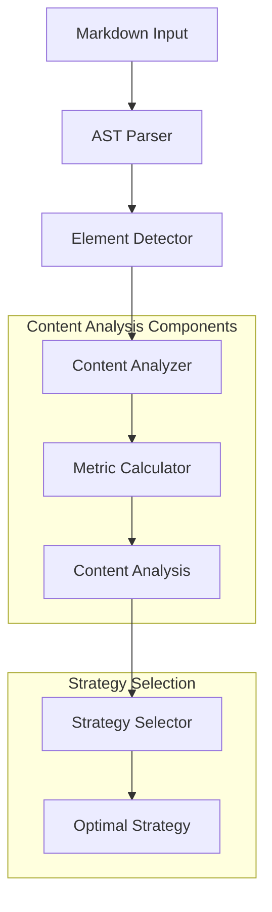
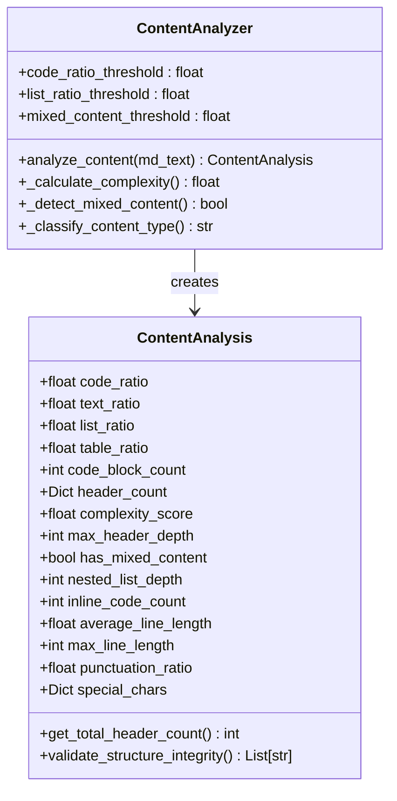
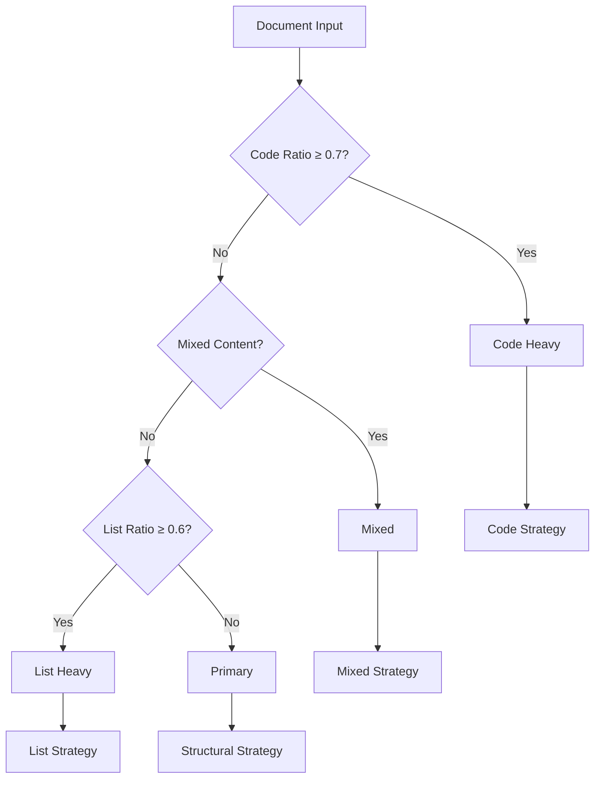
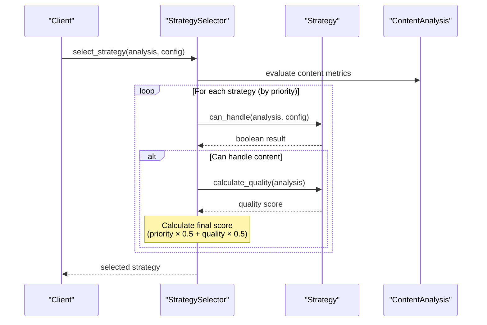
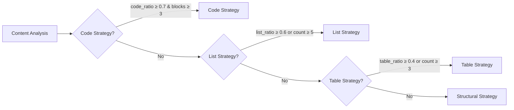

# Content Analysis Metrics

<cite>
**Referenced Files in This Document**
- [analyzer.py](file://markdown_chunker/parser/analyzer.py)
- [types.py](file://markdown_chunker/parser/types.py)
- [selector.py](file://markdown_chunker/chunker/selector.py)
- [base.py](file://markdown_chunker/chunker/strategies/base.py)
- [code_strategy.py](file://markdown_chunker/chunker/strategies/code_strategy.py)
- [list_strategy.py](file://markdown_chunker/chunker/strategies/list_strategy.py)
- [table_strategy.py](file://markdown_chunker/chunker/strategies/table_strategy.py)
- [structural_strategy.py](file://markdown_chunker/chunker/strategies/structural_strategy.py)
- [types.py](file://markdown_chunker/chunker/types.py)
- [test_content_analysis_properties.py](file://tests/parser/test_content_analysis_properties.py)
- [api_documentation.md](file://tests/fixtures/real_documents/api_documentation.md)
- [blog_post.md](file://tests/fixtures/real_documents/blog_post.md)
- [code_heavy.md](file://tests/fixtures/code_heavy.md)
- [list_heavy.md](file://tests/fixtures/list_heavy.md)
</cite>

## Table of Contents
1. [Introduction](#introduction)
2. [Content Analysis Architecture](#content-analysis-architecture)
3. [Core Metrics Calculation](#core-metrics-calculation)
4. [Content Type Classification](#content-type-classification)
5. [Strategy Selection System](#strategy-selection-system)
6. [Document Type Profiles](#document-type-profiles)
7. [Threshold-Based Decision Logic](#threshold-based-decision-logic)
8. [Configuration and Customization](#configuration-and-customization)
9. [Performance Considerations](#performance-considerations)
10. [Optimization Strategies](#optimization-strategies)
11. [Troubleshooting Guide](#troubleshooting-guide)
12. [Conclusion](#conclusion)

## Introduction

The Markdown Chunker employs a sophisticated content analysis system that drives intelligent strategy selection for optimal document chunking. At its core lies the ContentAnalysis dataclass, which encapsulates comprehensive metrics extracted from the Abstract Syntax Tree (AST) of Markdown documents. These metrics serve as the foundation for determining the most appropriate chunking strategy based on document characteristics such as code density, structural complexity, and content distribution.

The system operates through a multi-stage pipeline where Stage 1 performs content analysis and generates metrics, while Stage 2 applies strategy selection based on these metrics. This approach ensures that documents are chunked according to their inherent structure and content type, maximizing semantic coherence and retrieval effectiveness.

## Content Analysis Architecture

The content analysis system is built around a centralized ContentAnalyzer class that processes Markdown documents through multiple analytical stages. The architecture follows a modular design pattern that separates concerns between content detection, metric calculation, and result generation.



**Diagram sources**
- [analyzer.py](file://markdown_chunker/parser/analyzer.py#L18-L499)
- [selector.py](file://markdown_chunker/chunker/selector.py#L23-L322)

The ContentAnalyzer serves as the central orchestrator, coordinating between AST parsing, element detection, and metric computation. It leverages the enhanced AST builder to extract structural information while maintaining position tracking for precise metric calculations.

**Section sources**
- [analyzer.py](file://markdown_chunker/parser/analyzer.py#L18-L499)

## Core Metrics Calculation

The ContentAnalysis dataclass encapsulates 25+ metrics that comprehensively describe document characteristics. These metrics are calculated during the content analysis phase and form the basis for strategy selection decisions.

### Fundamental Metrics

The system calculates several fundamental metrics that provide essential document characteristics:

| Metric Category | Key Metrics | Purpose |
|----------------|-------------|---------|
| **Content Distribution** | `code_ratio`, `text_ratio`, `list_ratio`, `table_ratio` | Measure content type proportions |
| **Element Counts** | `code_block_count`, `list_count`, `table_count`, `header_count` | Quantify structural elements |
| **Complexity Indicators** | `complexity_score`, `max_header_depth`, `nested_list_depth` | Assess structural complexity |
| **Text Properties** | `average_line_length`, `max_line_length`, `punctuation_ratio` | Analyze text characteristics |
| **Content Type Flags** | `has_mixed_content`, `has_tables`, `has_nested_lists` | Boolean indicators |

### Advanced Metrics

Beyond basic counts and ratios, the system computes sophisticated metrics that capture document structure and complexity:



**Diagram sources**
- [types.py](file://markdown_chunker/parser/types.py#L437-L704)
- [analyzer.py](file://markdown_chunker/parser/analyzer.py#L18-L499)

### Metric Calculation Process

The metric calculation process involves several sophisticated algorithms:

1. **Content Size Calculation**: Determines character distribution across content types
2. **Ratio Computation**: Calculates normalized ratios ensuring sum-to-one constraint
3. **Complexity Scoring**: Computes structural and content complexity scores
4. **Threshold Evaluation**: Applies business logic to determine applicability

**Section sources**
- [analyzer.py](file://markdown_chunker/parser/analyzer.py#L41-L256)

## Content Type Classification

The system employs a multi-tier content classification system that categorizes documents into distinct types based on their predominant characteristics. This classification drives strategy selection by identifying documents that share similar structural patterns and processing requirements.

### Classification Hierarchy



**Diagram sources**
- [analyzer.py](file://markdown_chunker/parser/analyzer.py#L277-L294)

### Content Type Definitions

Each content type represents a distinct processing paradigm:

- **Code Heavy**: Documents with ≥70% code content, requiring specialized code preservation
- **Mixed**: Documents containing multiple content types requiring adaptive strategies
- **List Heavy**: Documents with extensive list structures requiring hierarchy preservation
- **Primary**: Documents dominated by text content with standard structural patterns

**Section sources**
- [analyzer.py](file://markdown_chunker/parser/analyzer.py#L277-L294)

## Strategy Selection System

The StrategySelector implements a priority-based selection system that evaluates multiple strategies against content analysis metrics to determine the optimal chunking approach. The system supports both strict and weighted selection modes.

### Selection Modes

The system operates in two primary modes:

1. **Strict Mode**: Selects the first applicable strategy by priority order
2. **Weighted Mode**: Combines priority and quality scores for optimal selection



**Diagram sources**
- [selector.py](file://markdown_chunker/chunker/selector.py#L58-L133)

### Strategy Metrics

Each strategy evaluation produces comprehensive metrics:

| Metric | Description | Range |
|--------|-------------|-------|
| **Priority** | Strategy priority (1=highest) | 1-6 |
| **Quality Score** | Strategy suitability for content | 0.0-1.0 |
| **Final Score** | Combined priority × 0.5 + quality × 0.5 | 0.0-1.0 |
| **Can Handle** | Whether strategy applies to content | boolean |

**Section sources**
- [selector.py](file://markdown_chunker/chunker/selector.py#L58-L133)
- [base.py](file://markdown_chunker/chunker/strategies/base.py#L96-L127)

## Document Type Profiles

Different document types exhibit distinct metric profiles that influence strategy selection. Understanding these profiles helps optimize chunking for specific use cases.

### API Documentation Profile

API documentation typically exhibits the following metric profile:

| Metric | Typical Value | Impact on Strategy |
|--------|---------------|-------------------|
| **Code Ratio** | 0.65-0.85 | High likelihood of Code Strategy |
| **List Ratio** | 0.15-0.25 | Moderate list presence |
| **Table Ratio** | 0.20-0.30 | Structured parameter tables |
| **Header Depth** | 3-4 | Hierarchical endpoint organization |
| **Complexity Score** | 0.6-0.8 | Moderate structural complexity |

### Blog Post Profile

Blog posts demonstrate contrasting characteristics:

| Metric | Typical Value | Impact on Strategy |
|--------|---------------|-------------------|
| **Code Ratio** | 0.10-0.20 | Low code content |
| **List Ratio** | 0.30-0.40 | Extensive lists and bullet points |
| **Table Ratio** | 0.05-0.10 | Minimal tabular data |
| **Header Depth** | 2-3 | Simple hierarchical structure |
| **Complexity Score** | 0.3-0.5 | Low structural complexity |

### Code Documentation Profile

Technical documentation heavily focused on code exhibits:

| Metric | Typical Value | Impact on Strategy |
|--------|---------------|-------------------|
| **Code Ratio** | 0.80-0.95 | Dominant code content |
| **List Ratio** | 0.05-0.15 | Minimal lists |
| **Table Ratio** | 0.10-0.20 | Parameter and method tables |
| **Header Depth** | 4-5 | Deep structural hierarchy |
| **Complexity Score** | 0.7-0.9 | High structural complexity |

**Section sources**
- [api_documentation.md](file://tests/fixtures/real_documents/api_documentation.md#L1-L298)
- [blog_post.md](file://tests/fixtures/real_documents/blog_post.md#L1-L240)
- [code_heavy.md](file://tests/fixtures/code_heavy.md#L1-L74)

## Threshold-Based Decision Logic

The strategy selection system employs configurable thresholds that balance sensitivity with robustness. These thresholds are carefully tuned to handle real-world document variations while maintaining reliable strategy selection.

### Strategy-Specific Thresholds

Each strategy implements tailored thresholds based on its processing requirements:



**Diagram sources**
- [code_strategy.py](file://markdown_chunker/chunker/strategies/code_strategy.py#L109-L134)
- [list_strategy.py](file://markdown_chunker/chunker/strategies/list_strategy.py#L89-L100)
- [table_strategy.py](file://markdown_chunker/chunker/strategies/table_strategy.py#L85-L96)

### Quality Scoring Algorithm

Strategies employ sophisticated quality scoring algorithms that consider multiple factors:

**Code Strategy Quality**:
- Code ratio contributions: 0.8 (≥85%), 0.6 (≥70%), 0.3 (≥50%)
- Block count bonuses: 0.2 (≥10), 0.15 (≥5), 0.1 (≥3)
- Multi-language bonus: +0.1 for multiple languages

**List Strategy Quality**:
- List count contributions: 0.8 (≥10), 0.6 (≥5), 0.4 (≥3)
- List ratio contributions: 0.3 (≥70%), 0.2 (≥50%), 0.1 (≥30%)
- Nested list bonus: +0.2 for nested structures

**Table Strategy Quality**:
- Table count contributions: 0.8 (≥5), 0.6 (≥3), 0.4 (≥2)
- Table ratio contributions: 0.3 (≥50%), 0.2 (≥30%), 0.1 (≥20%)

**Section sources**
- [code_strategy.py](file://markdown_chunker/chunker/strategies/code_strategy.py#L136-L185)
- [list_strategy.py](file://markdown_chunker/chunker/strategies/list_strategy.py#L102-L133)
- [table_strategy.py](file://markdown_chunker/chunker/strategies/table_strategy.py#L98-L125)

## Configuration and Customization

The system provides extensive configuration options that allow users to customize sensitivity thresholds and strategy behavior. These configurations enable fine-tuning for specific document types and use cases.

### ChunkConfig Parameters

Key configuration parameters include:

| Parameter | Default | Purpose | Customization Options |
|-----------|---------|---------|---------------------|
| **code_ratio_threshold** | 0.3 | Code strategy activation | 0.1-0.9 |
| **list_ratio_threshold** | 0.6 | List strategy activation | 0.1-0.9 |
| **table_ratio_threshold** | 0.4 | Table strategy activation | 0.1-0.9 |
| **min_code_blocks** | 1 | Minimum code blocks | 1-10 |
| **list_count_threshold** | 5 | Minimum list count | 1-20 |
| **table_count_threshold** | 3 | Minimum table count | 1-15 |

### Predefined Configurations

The system provides factory methods for common use cases:

```python
# Code-heavy documentation
config = ChunkConfig.for_code_heavy()

# RAG system optimization  
config = ChunkConfig.for_dify_rag()

# Chat/LLM context optimization
config = ChunkConfig.for_chat_context()

# General-purpose configuration
config = ChunkConfig.default()
```

### Custom Strategy Integration

Users can add custom strategies with specific thresholds:

```python
# Custom strategy with tailored thresholds
class CustomStrategy(BaseStrategy):
    @property
    def priority(self) -> int:
        return 2
    
    def can_handle(self, analysis: ContentAnalysis, config: ChunkConfig) -> bool:
        return (analysis.code_ratio >= 0.4 and 
                analysis.code_block_count >= 2)
```

**Section sources**
- [types.py](file://markdown_chunker/chunker/types.py#L573-L800)
- [selector.py](file://markdown_chunker/chunker/selector.py#L274-L306)

## Performance Considerations

Content analysis introduces computational overhead that scales with document complexity. Understanding performance characteristics enables optimization for large-scale processing.

### Computational Complexity

The analysis process exhibits the following complexity characteristics:

- **Time Complexity**: O(n) where n is the document length
- **Space Complexity**: O(m) where m is the number of structural elements
- **Memory Usage**: Primarily driven by AST construction and metric storage

### Scalability Factors

Several factors impact analysis performance:

1. **Document Size**: Linear scaling with content length
2. **Structural Complexity**: Quadratic scaling with nesting depth
3. **Element Density**: Proportional to element count
4. **Regex Operations**: Constant-time pattern matching

### Memory Optimization

The system employs several memory optimization strategies:

- **Lazy Evaluation**: Metrics computed only when needed
- **Streaming Processing**: Reduced memory footprint for large documents
- **Efficient Data Structures**: Optimized collections for metric storage
- **Garbage Collection**: Automatic cleanup of intermediate objects

**Section sources**
- [analyzer.py](file://markdown_chunker/parser/analyzer.py#L18-L499)

## Optimization Strategies

Several strategies can improve content analysis performance while maintaining accuracy:

### Early Termination

Implement early termination for clearly dominant content types:

```python
# Early exit for code-heavy documents
if analysis.code_ratio > 0.8:
    return "code"  # Skip other evaluations
```

### Metric Caching

Cache frequently accessed metrics to avoid recomputation:

```python
# Cache header count calculation
@property
def total_header_count(self):
    if not hasattr(self, '_cached_header_count'):
        self._cached_header_count = sum(self.header_count.values())
    return self._cached_header_count
```

### Parallel Processing

Leverage parallel processing for independent metric calculations:

```python
# Parallel metric computation
metrics = {
    'content_size': compute_content_size(),
    'element_counts': compute_element_counts(),
    'complexity': compute_complexity()
}
```

### Streaming Analysis

For very large documents, implement streaming analysis:

```python
# Streaming approach for large documents
def stream_analyze_large_document(file_path):
    analyzer = ContentAnalyzer()
    for chunk in read_in_chunks(file_path):
        partial_analysis = analyzer.analyze_content(chunk)
        # Merge partial results
```

## Troubleshooting Guide

Common issues and solutions for content analysis and strategy selection:

### Low Strategy Selection Accuracy

**Symptoms**: Incorrect strategy chosen for document type
**Causes**: 
- Thresholds too restrictive or permissive
- Document structure differs from training data
- Metric calculation errors

**Solutions**:
1. Adjust sensitivity thresholds in ChunkConfig
2. Review document structure and content patterns
3. Validate metric calculations using debug mode

### Performance Issues

**Symptoms**: Slow analysis on large documents
**Causes**:
- Excessive structural complexity
- Large number of elements
- Inefficient regex patterns

**Solutions**:
1. Implement streaming analysis for large documents
2. Reduce analysis precision for performance-critical paths
3. Cache frequently accessed metrics

### Memory Consumption

**Symptoms**: High memory usage during analysis
**Causes**:
- Large AST construction
- Excessive metric storage
- Inefficient data structures

**Solutions**:
1. Use memory-efficient data structures
2. Implement lazy loading for large documents
3. Clear temporary objects promptly

**Section sources**
- [test_content_analysis_properties.py](file://tests/parser/test_content_analysis_properties.py#L100-L200)

## Conclusion

The content analysis metrics system forms the cornerstone of intelligent strategy selection in the Markdown Chunker. Through comprehensive metric calculation, sophisticated threshold-based decision logic, and flexible configuration options, the system delivers optimal chunking results across diverse document types.

The modular architecture enables easy extension and customization while maintaining robust performance characteristics. By understanding the metric profiles of different document types and configuring appropriate thresholds, users can achieve highly effective document chunking that maximizes semantic coherence and retrieval performance.

Future enhancements may include machine learning-based strategy selection, dynamic threshold adjustment, and enhanced support for multimodal content analysis. The current implementation provides a solid foundation for these advanced capabilities while delivering immediate value for production use cases.