# Core Concepts

<cite>
**Referenced Files in This Document**
- [markdown_chunker/chunker/types.py](file://markdown_chunker/chunker/types.py)
- [markdown_chunker/parser/types.py](file://markdown_chunker/parser/types.py)
- [markdown_chunker/chunker/orchestrator.py](file://markdown_chunker/chunker/orchestrator.py)
- [markdown_chunker/chunker/selector.py](file://markdown_chunker/chunker/selector.py)
- [markdown_chunker/parser/analyzer.py](file://markdown_chunker/parser/analyzer.py)
- [markdown_chunker/chunker/strategies/base.py](file://markdown_chunker/chunker/strategies/base.py)
- [markdown_chunker/chunker/strategies/code_strategy.py](file://markdown_chunker/chunker/strategies/code_strategy.py)
- [markdown_chunker/chunker/strategies/mixed_strategy.py](file://markdown_chunker/chunker/strategies/mixed_strategy.py)
- [markdown_chunker/chunker/strategies/structural_strategy.py](file://markdown_chunker/chunker/strategies/structural_strategy.py)
- [examples/basic_usage.py](file://examples/basic_usage.py)
- [examples/api_usage.py](file://examples/api_usage.py)
- [tests/fixtures/code_heavy.md](file://tests/fixtures/code_heavy.md)
- [tests/fixtures/mixed.md](file://tests/fixtures/mixed.md)
- [tests/fixtures/structural.md](file://tests/fixtures/structural.md)
</cite>

## Table of Contents
1. [Introduction](#introduction)
2. [Markdown AST Parsing Fundamentals](#markdown-ast-parsing-fundamentals)
3. [Understanding Chunks and Logical Blocks](#understanding-chunks-and-logical-blocks)
4. [Content Analysis Metrics](#content-analysis-metrics)
5. [Strategy Scoring and Selection](#strategy-scoring-and-selection)
6. [Configuration Profiles](#configuration-profiles)
7. [Header Paths and Metadata Enrichment](#header-paths-and-metadata-enrichment)
8. [Idempotent Processing](#idempotent-processing)
9. [Practical Implementation Examples](#practical-implementation-examples)
10. [Advanced Concepts](#advanced-concepts)

## Introduction

The Markdown Chunker system represents a sophisticated approach to breaking down Markdown documents into semantically meaningful fragments. At its core, this system combines **Abstract Syntax Tree (AST) parsing**, **intelligent content analysis**, and **adaptive strategy selection** to produce chunks that preserve document structure while optimizing for downstream applications like Retrieval-Augmented Generation (RAG), search indexing, and chat contexts.

The system operates in two distinct phases:
- **Stage 1 (Analysis)**: Content analysis and metrics calculation
- **Stage 2 (Chunking)**: Strategy selection and chunk generation

This dual-phase approach ensures that documents are processed according to their inherent structure and content characteristics, resulting in chunks that maintain semantic coherence and contextual relevance.

## Markdown AST Parsing Fundamentals

### What is an Abstract Syntax Tree?

An Abstract Syntax Tree (AST) is a hierarchical representation of a document's structure, where each node corresponds to a specific element in the Markdown document. Unlike plain text parsing, AST parsing captures the semantic relationships between different components, enabling intelligent chunking decisions.

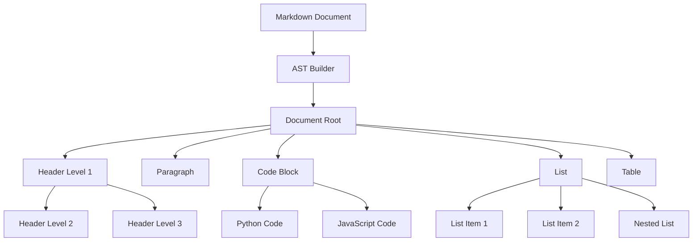

**Diagram sources**
- [markdown_chunker/parser/types.py](file://markdown_chunker/parser/types.py#L58-L118)
- [markdown_chunker/parser/analyzer.py](file://markdown_chunker/parser/analyzer.py#L18-L499)

### AST Node Types

The system recognizes several fundamental node types that form the building blocks of Markdown documents:

| Node Type | Description | Example |
|-----------|-------------|---------|
| `DOCUMENT` | Root container for the entire document | Entire Markdown file |
| `HEADER` | Heading elements (H1-H6) | `# Main Title`, `## Section` |
| `PARAGRAPH` | Text paragraphs | Normal flowing text |
| `CODE_BLOCK` | Fenced code blocks | ```python<br/>def func():<br/>    pass<br/>``` |
| `LIST` | Ordered or unordered lists | `- Item 1`, `1. Step 1` |
| `LIST_ITEM` | Individual list entries | Child nodes of LIST |
| `TABLE` | Tabular data structure | Markdown tables with headers |
| `BLOCKQUOTE` | Quoted text blocks | `> Important note` |
| `TEXT` | Inline text content | Plain text within elements |

### Enhanced AST Features

The system extends basic AST functionality with enhanced capabilities:

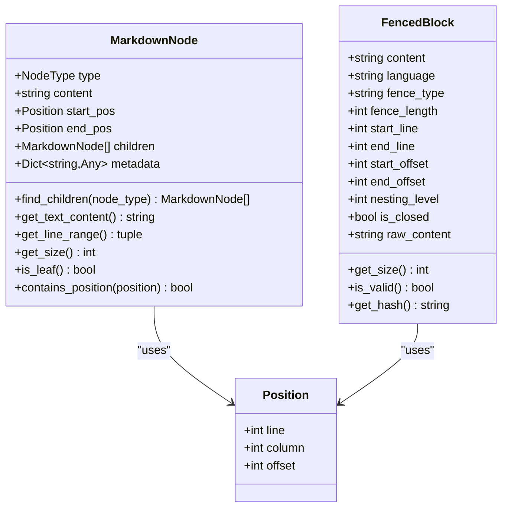

**Diagram sources**
- [markdown_chunker/parser/types.py](file://markdown_chunker/parser/types.py#L58-L118)
- [markdown_chunker/parser/types.py](file://markdown_chunker/parser/types.py#L217-L249)

**Section sources**
- [markdown_chunker/parser/types.py](file://markdown_chunker/parser/types.py#L58-L118)
- [markdown_chunker/parser/types.py](file://markdown_chunker/parser/types.py#L217-L249)

## Understanding Chunks and Logical Blocks

### What is a Chunk?

A **chunk** represents a semantically meaningful fragment of a Markdown document that preserves context while fitting within size constraints. Each chunk contains not just the text content, but comprehensive metadata that describes its origin, structure, and relationships.

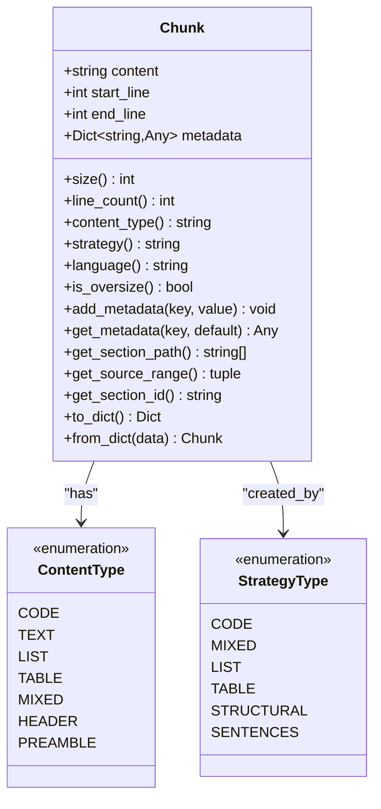

**Diagram sources**
- [markdown_chunker/chunker/types.py](file://markdown_chunker/chunker/types.py#L36-L321)

### Logical Block Preservation

The system distinguishes between different types of content blocks and applies appropriate preservation strategies:

| Block Type | Preservation Strategy | Reasoning |
|------------|----------------------|-----------|
| **Code Blocks** | Atomic preservation | Code integrity depends on complete context |
| **Tables** | Atomic preservation | Table structure broken by splitting |
| **Lists** | Hierarchical preservation | List items depend on parent-child relationships |
| **Headers** | Boundary preservation | Headers define document sections |
| **Paragraphs** | Semantic splitting | Can be split at natural boundaries |

### Chunk Properties and Metadata

Each chunk carries rich metadata that enables downstream applications to understand its context:

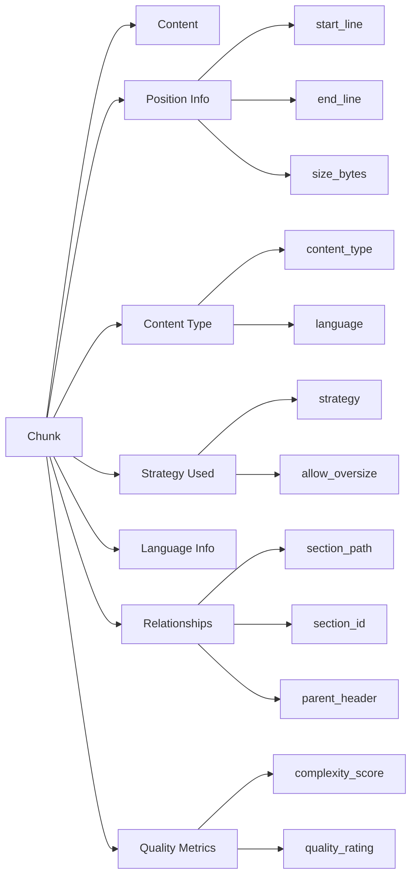

**Diagram sources**
- [markdown_chunker/chunker/types.py](file://markdown_chunker/chunker/types.py#L36-L321)

**Section sources**
- [markdown_chunker/chunker/types.py](file://markdown_chunker/chunker/types.py#L36-L321)

## Content Analysis Metrics

### Fundamental Metrics

The content analysis system calculates comprehensive metrics that characterize document structure and content distribution:

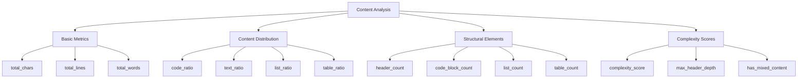

**Diagram sources**
- [markdown_chunker/parser/analyzer.py](file://markdown_chunker/parser/analyzer.py#L28-L499)

### Code Ratio Calculation

The code ratio metric determines the proportion of code content versus other content types:

```python
# Formula: code_chars / total_chars
code_ratio = code_chars / total_chars if total_chars > 0 else 0
```

**Thresholds for Strategy Selection:**
- **Code-heavy**: `code_ratio >= 0.7` → Code strategy
- **Mixed**: `0.3 <= code_ratio < 0.7` → Mixed strategy  
- **Text-heavy**: `code_ratio < 0.3` → Sentence strategy

### List Density Analysis

List density measures the concentration of list content relative to overall document size:

```python
# Formula: list_chars / total_chars
list_density = list_chars / total_chars if total_chars > 0 else 0
```

**Strategic Implications:**
- High list density (`> 0.6`) favors list strategy
- Moderate density (`0.3-0.6`) considered in mixed strategy
- Low density (`< 0.3`) ignored for list strategy

### Structural Complexity Scoring

The complexity score combines multiple factors to assess document intricacy:

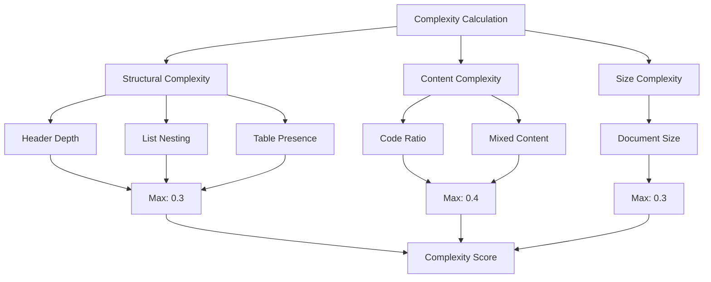

**Diagram sources**
- [markdown_chunker/parser/analyzer.py](file://markdown_chunker/parser/analyzer.py#L245-L276)

**Section sources**
- [markdown_chunker/parser/analyzer.py](file://markdown_chunker/parser/analyzer.py#L28-L499)

## Strategy Scoring and Selection

### Strategy Selection Framework

The system employs a sophisticated selection mechanism that evaluates multiple strategies against content characteristics:

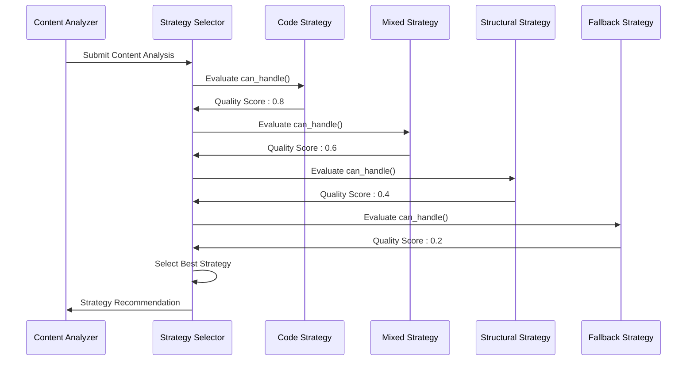

**Diagram sources**
- [markdown_chunker/chunker/selector.py](file://markdown_chunker/chunker/selector.py#L58-L322)
- [markdown_chunker/chunker/orchestrator.py](file://markdown_chunker/chunker/orchestrator.py#L169-L340)

### Strategy Metrics System

Each strategy produces comprehensive metrics for evaluation:

| Metric | Description | Range | Purpose |
|--------|-------------|-------|---------|
| `can_handle` | Strategy applicability | `true/false` | Determines eligibility |
| `quality_score` | Content fit assessment | `0.0-1.0` | Measures suitability |
| `priority` | Strategy precedence | `1-6` | Resolution for ties |
| `final_score` | Combined evaluation | `0.0-1.0` | Primary selection criterion |

### Threshold-Based Selection

The selection process uses configurable thresholds to determine strategy applicability:

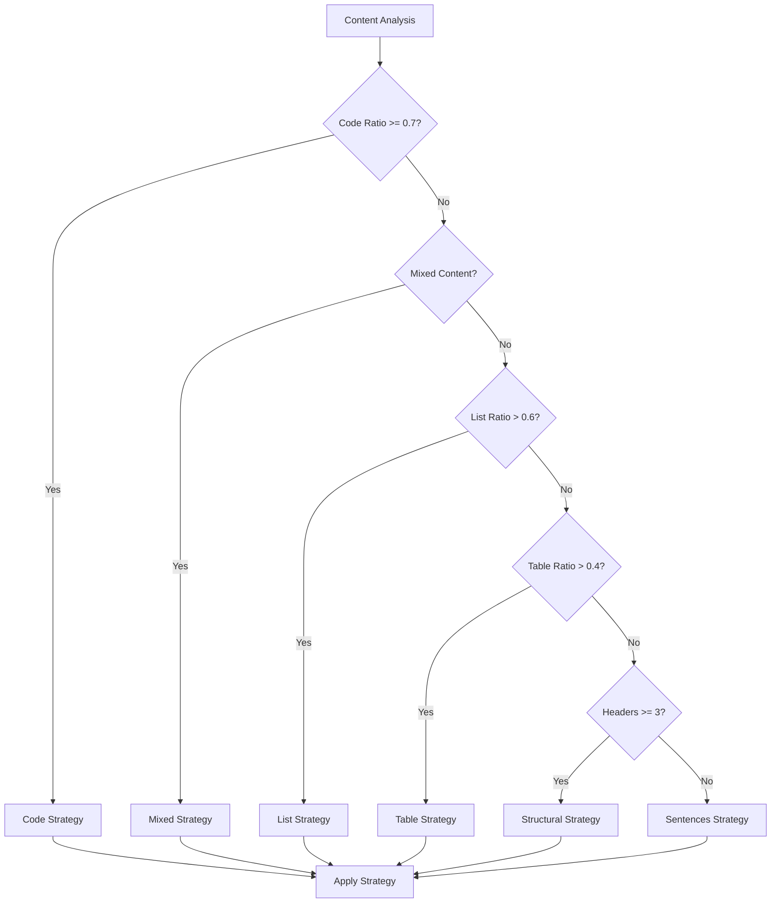

**Diagram sources**
- [markdown_chunker/chunker/selector.py](file://markdown_chunker/chunker/selector.py#L58-L322)

**Section sources**
- [markdown_chunker/chunker/selector.py](file://markdown_chunker/chunker/selector.py#L58-L322)

## Configuration Profiles

### Predefined Configuration Profiles

The system provides specialized configuration profiles optimized for different use cases:

| Profile | Use Case | Key Characteristics |
|---------|----------|-------------------|
| `for_code_heavy()` | API documentation, tutorials | Large chunks, aggressive code detection |
| `for_structured_docs()` | User manuals, documentation | Medium chunks, header preservation |
| `for_dify_rag()` | RAG systems | Balanced chunks, overlap support |
| `for_chat_context()` | Chat/LLM contexts | Small chunks, high overlap |
| `for_search_indexing()` | Search applications | Small chunks, granular content |

### Configuration Parameter Impact

Each configuration parameter affects chunking behavior differently:

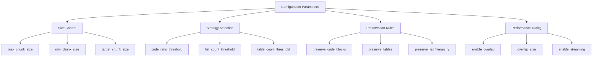

**Diagram sources**
- [markdown_chunker/chunker/types.py](file://markdown_chunker/chunker/types.py#L498-L1061)

### Custom Configuration Examples

**Code Documentation Profile:**
```python
config = ChunkConfig(
    max_chunk_size=2048,      # Smaller for atomic code blocks
    min_chunk_size=128,       # Minimum code block size
    overlap_size=100,         # Minimal overlap
    code_ratio_threshold=0.8, # Aggressive code detection
    preserve_code_blocks=True, # Keep code atomic
    list_count_threshold=8,   # Handle dense lists
    table_count_threshold=5   # Handle complex tables
)
```

**Chat Context Profile:**
```python
config = ChunkConfig(
    max_chunk_size=1536,      # Fits LLM context windows
    min_chunk_size=200,       # Minimum meaningful content
    overlap_size=200,         # Preserve context
    enable_overlap=True,      # Context preservation
    code_ratio_threshold=0.5, # Balanced approach
    list_count_threshold=4,   # Moderate list handling
    table_count_threshold=2   # Simple table support
)
```

**Section sources**
- [markdown_chunker/chunker/types.py](file://markdown_chunker/chunker/types.py#L498-L1061)

## Header Paths and Metadata Enrichment

### Hierarchical Header Path Construction

The system builds comprehensive header paths that enable precise navigation and semantic understanding:

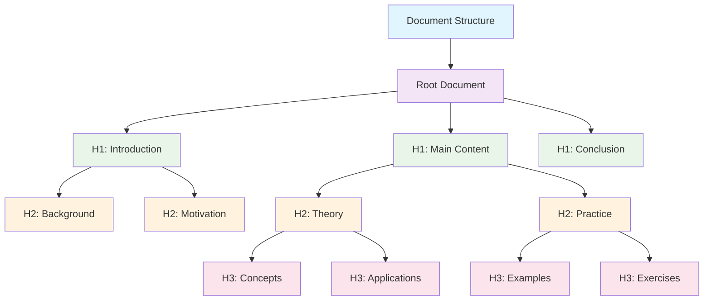

**Diagram sources**
- [markdown_chunker/chunker/strategies/structural_strategy.py](file://markdown_chunker/chunker/strategies/structural_strategy.py#L22-L53)

### Metadata Enrichment Features

The system enriches chunks with comprehensive metadata for downstream applications:

| Metadata Field | Purpose | Example Value |
|----------------|---------|---------------|
| `section_path` | Hierarchical navigation | `["Introduction", "Setup"]` |
| `section_id` | Unique identification | `"introduction-setup"` |
| `header_level` | Structural depth | `2` |
| `header_text` | Title content | `"Installation Guide"` |
| `parent_header_path` | Parent relationships | `["Introduction"]` |
| `has_subsections` | Structural awareness | `true` |
| `content_type` | Chunk categorization | `"code"`, `"text"`, `"list"` |

### Phase 2 Semantic Quality Improvements

The system implements advanced semantic quality features in Phase 2:

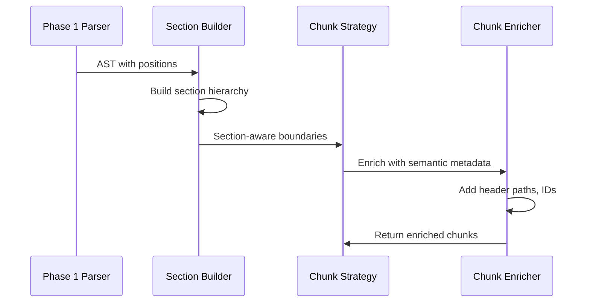

**Diagram sources**
- [markdown_chunker/chunker/strategies/structural_strategy.py](file://markdown_chunker/chunker/strategies/structural_strategy.py#L77-L102)

**Section sources**
- [markdown_chunker/chunker/strategies/structural_strategy.py](file://markdown_chunker/chunker/strategies/structural_strategy.py#L22-L53)

## Idempotent Processing

### Definition and Importance

**Idempotent processing** ensures that applying the chunker multiple times to the same document produces identical results, maintaining consistency and reliability.

### Implementation Strategies

The system achieves idempotency through several mechanisms:

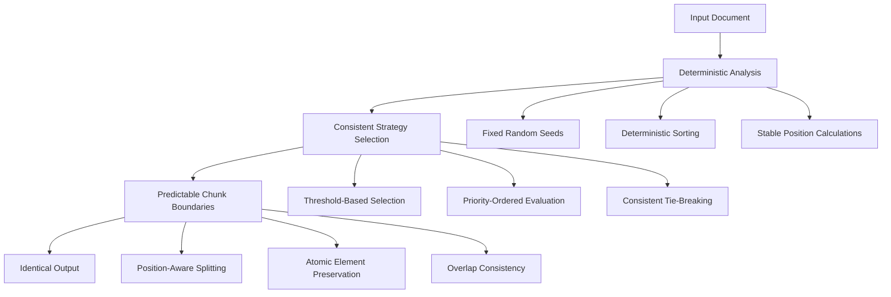

### Testing Idempotency

The system includes comprehensive tests to verify idempotent behavior:

```python
# Example idempotency test pattern
def test_idempotence():
    initial_result = chunker.chunk(document)
    second_result = chunker.chunk(document)
    
    # Compare results
    assert len(initial_result.chunks) == len(second_result.chunks)
    for chunk1, chunk2 in zip(initial_result.chunks, second_result.chunks):
        assert chunk1.content == chunk2.content
        assert chunk1.start_line == chunk2.start_line
        assert chunk1.end_line == chunk2.end_line
        assert chunk1.metadata == chunk2.metadata
```

**Section sources**
- [markdown_chunker/chunker/orchestrator.py](file://markdown_chunker/chunker/orchestrator.py#L98-L101)

## Practical Implementation Examples

### Basic Usage Patterns

The system provides multiple interfaces for different use cases:

```python
# Simple chunking with default configuration
chunker = MarkdownChunker()
chunks = chunker.chunk(markdown_text)

# Chunking with analysis and metrics
result = chunker.chunk_with_analysis(markdown_text)
print(f"Strategy used: {result.strategy_used}")
print(f"Complexity score: {result.complexity_score}")

# Custom configuration
config = ChunkConfig(max_chunk_size=1000, enable_overlap=True)
chunker = MarkdownChunker(config)
chunks = chunker.chunk(markdown_text)
```

### Strategy Override Examples

Manually specifying strategies for specific use cases:

```python
# Force code strategy for code-heavy documents
chunks = chunker.chunk(markdown_text, strategy="code")

# Force structural strategy for well-structured documents  
chunks = chunker.chunk(markdown_text, strategy="structural")

# Force sentences strategy for simple text
chunks = chunker.chunk(markdown_text, strategy="sentences")
```

### Configuration Profile Usage

Using predefined profiles for common scenarios:

```python
# API documentation optimization
config = ChunkConfig.for_api_docs()
chunker = MarkdownChunker(config)
chunks = chunker.chunk(api_documentation)

# Chat context optimization
config = ChunkConfig.for_chat_context()
chunker = MarkdownChunker(config)
chunks = chunker.chunk(chat_documentation)
```

**Section sources**
- [examples/basic_usage.py](file://examples/basic_usage.py#L14-L364)
- [examples/api_usage.py](file://examples/api_usage.py#L16-L356)

## Advanced Concepts

### Multi-Strategy Coordination

The system coordinates multiple strategies through a sophisticated orchestration framework:

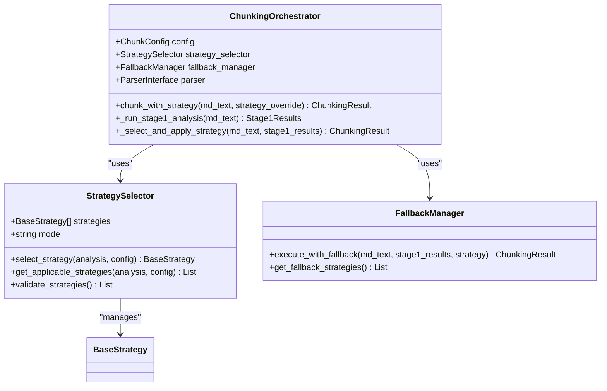

**Diagram sources**
- [markdown_chunker/chunker/orchestrator.py](file://markdown_chunker/chunker/orchestrator.py#L23-L340)
- [markdown_chunker/chunker/selector.py](file://markdown_chunker/chunker/selector.py#L19-L322)

### Error Handling and Recovery

The system implements robust error handling with fallback mechanisms:

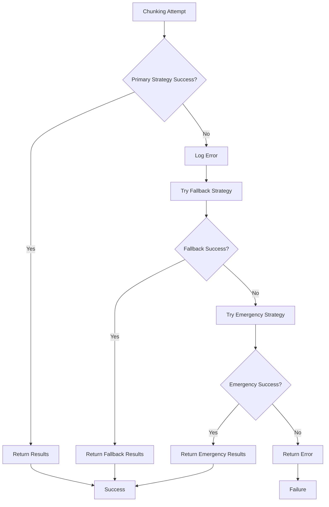

**Diagram sources**
- [markdown_chunker/chunker/orchestrator.py](file://markdown_chunker/chunker/orchestrator.py#L276-L340)

### Performance Optimization

The system includes several performance optimization features:

| Optimization | Purpose | Implementation |
|--------------|---------|----------------|
| **Streaming** | Memory efficiency for large documents | Configurable threshold (10MB default) |
| **Overlap Management** | Context preservation | Configurable overlap size and percentage |
| **Lazy Loading** | Reduced memory footprint | On-demand AST construction |
| **Caching** | Repeated analysis optimization | Memoized analysis results |

**Section sources**
- [markdown_chunker/chunker/orchestrator.py](file://markdown_chunker/chunker/orchestrator.py#L23-L340)
- [markdown_chunker/chunker/selector.py](file://markdown_chunker/chunker/selector.py#L19-L322)