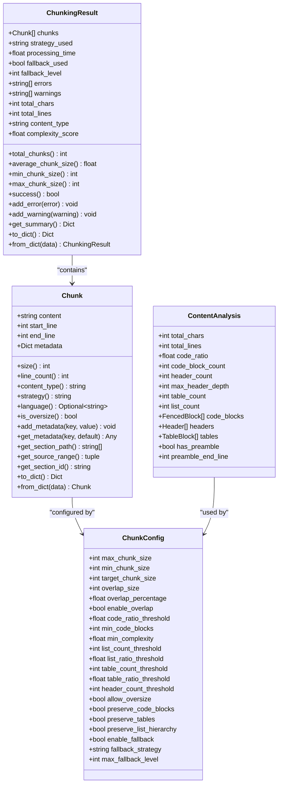
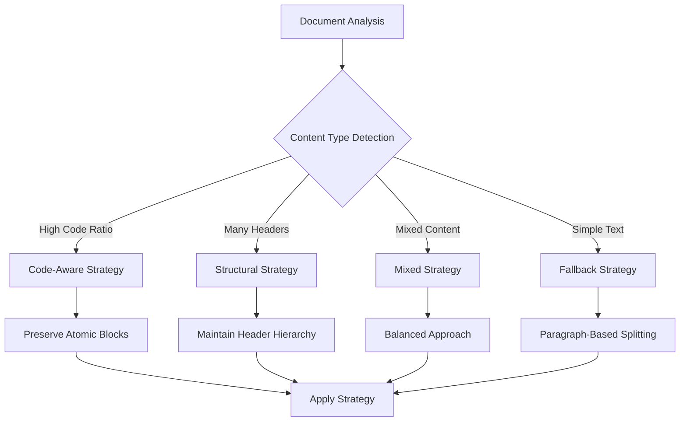
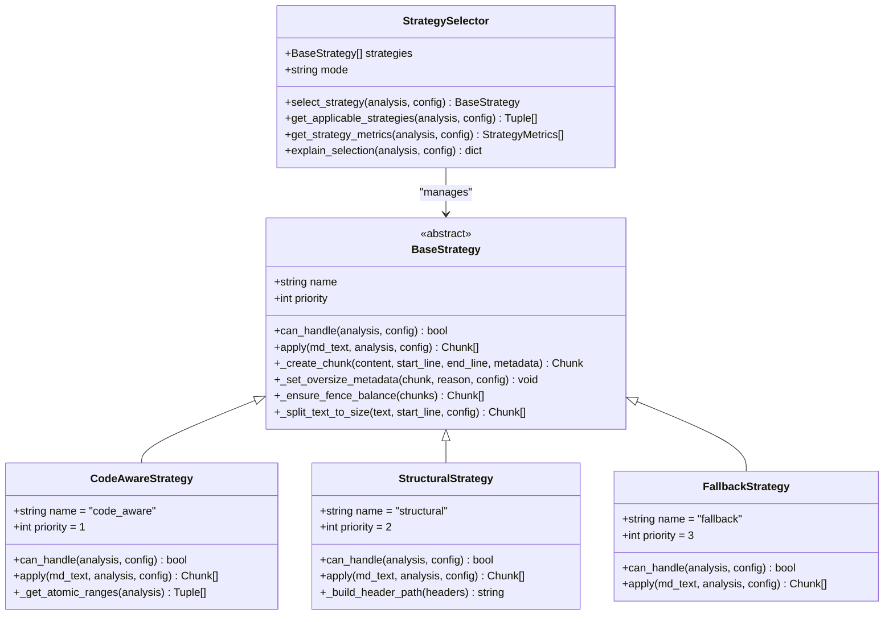
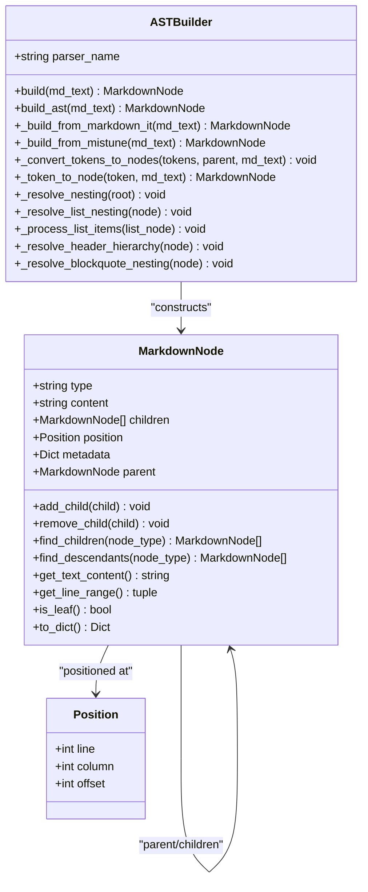
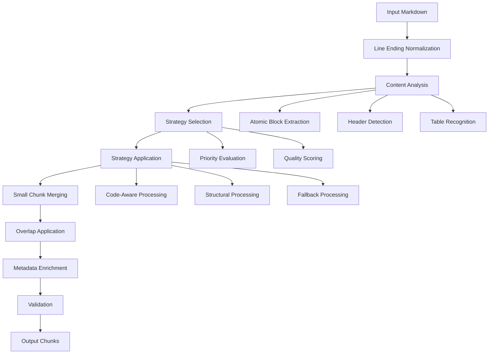
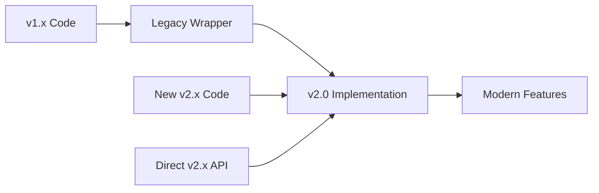

# Core Concepts

<cite>
**Referenced Files in This Document**
- [markdown_chunker/chunker/types.py](file://markdown_chunker/chunker/types.py)
- [markdown_chunker_legacy/chunker/types.py](file://markdown_chunker_legacy/chunker/types.py)
- [markdown_chunker_v2/types.py](file://markdown_chunker_v2/types.py)
- [markdown_chunker_v2/config.py](file://markdown_chunker_v2/config.py)
- [markdown_chunker_legacy/parser/ast.py](file://markdown_chunker_legacy/parser/ast.py)
- [markdown_chunker_v2/chunker.py](file://markdown_chunker_v2/chunker.py)
- [markdown_chunker_legacy/chunker/selector.py](file://markdown_chunker_legacy/chunker/selector.py)
- [markdown_chunker_v2/strategies/base.py](file://markdown_chunker_v2/strategies/base.py)
- [markdown_chunker_v2/strategies/code_aware.py](file://markdown_chunker_v2/strategies/code_aware.py)
- [markdown_chunker_v2/strategies/structural.py](file://markdown_chunker_v2/strategies/structural.py)
- [markdown_chunker_v2/strategies/fallback.py](file://markdown_chunker_v2/strategies/fallback.py)
- [markdown_chunker_v2/parser.py](file://markdown_chunker_v2/parser.py)
- [markdown_chunker_v2/compat.py](file://markdown_chunker_v2/compat.py)
</cite>

## Table of Contents
1. [Introduction](#introduction)
2. [Fundamental Data Models](#fundamental-data-models)
3. [Content Analysis and Metrics](#content-analysis-and-metrics)
4. [Strategy Selection System](#strategy-selection-system)
5. [Abstract Syntax Tree (AST) Architecture](#abstract-syntax-tree-ast-architecture)
6. [Chunking Pipeline Stages](#chunking-pipeline-stages)
7. [Metadata Enrichment](#metadata-enrichment)
8. [Preserving Semantic Meaning](#preserving-semantic-meaning)
9. [Version Evolution](#version-evolution)
10. [Best Practices](#best-practices)

## Introduction

The Markdown chunking system is a sophisticated content processing framework designed to intelligently divide Markdown documents into semantically meaningful fragments while preserving structural integrity and contextual relationships. At its core, the system employs content-aware strategy selection, leveraging Abstract Syntax Trees (ASTs) for deep structural analysis, and implements a multi-stage pipeline that ensures semantic preservation throughout the chunking process.

The system operates on the principle that different types of content (code, text, tables, lists) require specialized handling approaches to maintain their semantic meaning and functional integrity. By analyzing document structure and content characteristics, the system automatically selects the most appropriate chunking strategy for each document type.

## Fundamental Data Models

### Core Data Structures

The chunking system is built around several fundamental data models that define the structure and behavior of processed content.

#### Chunk Data Model

The `Chunk` class represents the basic unit of processed content, containing both textual data and metadata about its origin and characteristics.

**Diagram sources**
- [markdown_chunker_v2/types.py](file://markdown_chunker_v2/types.py#L99-L272)
- [markdown_chunker_legacy/chunker/types.py](file://markdown_chunker_legacy/chunker/types.py#L36-L1080)
- [markdown_chunker_v2/config.py](file://markdown_chunker_v2/config.py#L12-L170)

#### Content Analysis Model

The `ContentAnalysis` class encapsulates the results of document analysis, providing metrics and extracted structural elements that drive strategy selection decisions.

Key analysis components include:
- **Content ratios**: Proportions of different content types (code, text, tables, lists)
- **Element counts**: Quantities of structural elements (headers, code blocks, tables, lists)
- **Extracted elements**: Detailed information about identified structural components
- **Preamble detection**: Identification of introductory content before the first header

#### Configuration Model

The `ChunkConfig` class provides comprehensive control over chunking behavior, including size limits, strategy thresholds, overlap settings, and behavioral flags. The configuration system supports both simplified v2 configurations and legacy v1 configurations with automatic migration.

**Section sources**
- [markdown_chunker_v2/types.py](file://markdown_chunker_v2/types.py#L68-L272)
- [markdown_chunker_legacy/chunker/types.py](file://markdown_chunker_legacy/chunker/types.py#L36-L1080)
- [markdown_chunker_v2/config.py](file://markdown_chunker_v2/config.py#L12-L170)

## Content Analysis and Metrics

### Strategy Selection Criteria

The system employs sophisticated metrics to determine the optimal chunking strategy for each document. These metrics are derived from content analysis and influence strategy selection through configurable thresholds.

#### Content Density Metrics

| Metric | Purpose | Calculation | Strategy Impact |
|--------|---------|-------------|-----------------|
| `code_ratio` | Proportion of code content | `code_characters / total_characters` | Higher values favor code-aware strategies |
| `list_ratio` | Proportion of list content | `list_characters / total_characters` | Higher values suggest list strategies |
| `table_ratio` | Proportion of table content | `table_characters / total_characters` | Higher values favor table strategies |
| `header_count` | Number of structural headers | Count of markdown headers (#) | Influences structural strategy selection |
| `complexity_score` | Overall document complexity | Weighted combination of element types | Guides fallback strategy selection |

#### Threshold-Based Selection

The strategy selection system uses configurable thresholds to determine the most appropriate approach:

**Diagram sources**
- [markdown_chunker_legacy/chunker/selector.py](file://markdown_chunker_legacy/chunker/selector.py#L238-L278)
- [markdown_chunker_v2/strategies/code_aware.py](file://markdown_chunker_v2/strategies/code_aware.py#L33-L42)

### Content Type Classification

The system classifies content into distinct categories that inform strategy selection:

- **Code**: Documents with substantial code content requiring preservation of syntax integrity
- **Text**: Pure prose content suitable for sentence-based splitting
- **Lists**: Documents dominated by ordered or unordered lists
- **Tables**: Documents containing tabular data requiring structural preservation
- **Mixed**: Documents combining multiple content types requiring adaptive strategies

**Section sources**
- [markdown_chunker_v2/parser.py](file://markdown_chunker_v2/parser.py#L38-L81)
- [markdown_chunker_legacy/chunker/selector.py](file://markdown_chunker_legacy/chunker/selector.py#L238-L278)

## Strategy Selection System

### Strategy Architecture

The strategy selection system implements a priority-based approach with fallback mechanisms to ensure reliable chunking across all document types.

**Diagram sources**
- [markdown_chunker_v2/strategies/base.py](file://markdown_chunker_v2/strategies/base.py#L12-L233)
- [markdown_chunker_v2/strategies/code_aware.py](file://markdown_chunker_v2/strategies/code_aware.py#L15-L149)
- [markdown_chunker_v2/strategies/structural.py](file://markdown_chunker_v2/strategies/structural.py#L15-L151)
- [markdown_chunker_v2/strategies/fallback.py](file://markdown_chunker_v2/strategies/fallback.py#L15-L96)

### Strategy Priorities and Selection Logic

The strategy selection follows a hierarchical priority system:

1. **Code-Aware Strategy (Priority 1)**: Handles documents with code blocks or tables, preserving atomic elements
2. **Structural Strategy (Priority 2)**: Manages documents with hierarchical headers, maintaining structure
3. **Fallback Strategy (Priority 3)**: Universal strategy for all other content types

The selection process considers content density, structural elements, and complexity metrics to choose the most appropriate strategy.

**Section sources**
- [markdown_chunker_v2/strategies/base.py](file://markdown_chunker_v2/strategies/base.py#L12-L233)
- [markdown_chunker_v2/strategies/code_aware.py](file://markdown_chunker_v2/strategies/code_aware.py#L15-L149)
- [markdown_chunker_v2/strategies/structural.py](file://markdown_chunker_v2/strategies/structural.py#L15-L151)
- [markdown_chunker_v2/strategies/fallback.py](file://markdown_chunker_v2/strategies/fallback.py#L15-L96)

## Abstract Syntax Tree (AST) Architecture

### AST Construction and Analysis

The system employs a sophisticated Abstract Syntax Tree (AST) architecture for deep document analysis and structural understanding.

**Diagram sources**
- [markdown_chunker_legacy/parser/ast.py](file://markdown_chunker_legacy/parser/ast.py#L30-L293)

### Nesting Resolution and Hierarchical Analysis

The AST builder performs comprehensive nesting resolution to understand document structure:

- **List Nesting**: Determines list hierarchy and indentation levels
- **Header Hierarchy**: Establishes document outline structure
- **Blockquote Nesting**: Handles nested quote structures
- **Code Block Boundaries**: Identifies fenced code block boundaries

This hierarchical analysis enables intelligent strategy selection and preserves structural relationships during chunking.

**Section sources**
- [markdown_chunker_legacy/parser/ast.py](file://markdown_chunker_legacy/parser/ast.py#L30-L293)

## Chunking Pipeline Stages

### Unified Processing Pipeline

The modern chunking system implements a streamlined pipeline with seven essential stages:

**Diagram sources**
- [markdown_chunker_v2/chunker.py](file://markdown_chunker_v2/chunker.py#L43-L91)

### Stage-by-Stage Processing

#### 1. Line Ending Normalization
Ensures consistent line ending treatment by converting all endings to Unix-style (`\n`), establishing a uniform processing foundation.

#### 2. Content Analysis
Performs comprehensive document analysis to extract structural elements and calculate content metrics that drive strategy selection.

#### 3. Strategy Selection
Evaluates content characteristics against strategy capabilities to select the optimal chunking approach.

#### 4. Strategy Application
Applies the chosen strategy to generate initial chunks while preserving structural integrity.

#### 5. Small Chunk Merging
Combines chunks below the minimum size threshold with adjacent chunks to meet size requirements.

#### 6. Overlap Application
Adds contextual overlap between chunks to maintain continuity for downstream applications like RAG systems.

#### 7. Metadata Enrichment
Enhances chunks with additional information about content type, strategy used, and structural relationships.

#### 8. Validation
Ensures chunking quality through content completeness checks and size compliance validation.

**Section sources**
- [markdown_chunker_v2/chunker.py](file://markdown_chunker_v2/chunker.py#L43-L357)

## Metadata Enrichment

### Rich Metadata Structure

Each chunk receives comprehensive metadata that enhances downstream processing and enables sophisticated filtering and analysis.

#### Standard Metadata Fields

| Field | Type | Purpose | Example Value |
|-------|------|---------|---------------|
| `chunk_index` | int | Sequential chunk identifier | `0, 1, 2, ...` |
| `content_type` | string | Primary content classification | `"code"`, `"text"`, `"table"` |
| `has_code` | boolean | Presence of code blocks | `true`, `false` |
| `strategy` | string | Applied chunking strategy | `"code_aware"`, `"structural"` |
| `allow_oversize` | boolean | Oversize chunk indicator | `true` for large atomic blocks |
| `oversize_reason` | string | Reason for oversized chunks | `"code_block_integrity"` |
| `header_path` | List[string] | Hierarchical header path | `["Chapter 1", "Section 1.1"]` |
| `header_level` | int | Current header level | `2` for H2 headers |

#### Advanced Metadata Features

The system supports sophisticated metadata enrichment including:

- **Contextual Overlap**: Previous and next content segments for continuity
- **Source Position Tracking**: Character and line position information
- **Content Type Detection**: Automatic classification of mixed content
- **Strategy Attribution**: Detailed information about processing decisions

**Section sources**
- [markdown_chunker_v2/chunker.py](file://markdown_chunker_v2/chunker.py#L321-L357)

## Preserving Semantic Meaning

### Structural Integrity Preservation

The chunking system implements multiple mechanisms to preserve semantic meaning and structural relationships:

#### Atomic Block Preservation
Large code blocks, tables, and other atomic elements are preserved intact to maintain functional integrity. When chunks exceed size limits, they are marked appropriately with metadata indicating the preservation reason.

#### Header Hierarchy Maintenance
Structural strategies maintain header relationships and generate hierarchical paths that preserve document organization.

#### Content Type Awareness
Different content types receive specialized treatment:
- **Code blocks**: Preserve syntax integrity and language identification
- **Tables**: Maintain column relationships and data structure
- **Lists**: Preserve nesting and ordering relationships
- **Headers**: Maintain hierarchical relationships and navigation context

#### Contextual Continuity
Overlap mechanisms ensure that chunks maintain contextual relationships, particularly important for downstream applications like Retrieval-Augmented Generation (RAG).

### Quality Assurance Mechanisms

The system implements comprehensive quality assurance through:

- **Content Completeness Validation**: Ensures no content loss during chunking
- **Size Compliance Monitoring**: Tracks oversized chunks and their reasons
- **Structure Integrity Checks**: Validates preservation of atomic elements
- **Metadata Consistency**: Maintains accurate position and relationship information

**Section sources**
- [markdown_chunker_v2/chunker.py](file://markdown_chunker_v2/chunker.py#L206-L357)

## Version Evolution

### Architecture Redesign Philosophy

The system underwent significant architectural redesign to address complexity and improve maintainability while enhancing functionality.

#### Key Improvements in v2.0

1. **Unified Pipeline**: Single-pass processing eliminates redundant analysis
2. **Simplified Configuration**: Reduced parameter count from 32 to 8 core parameters
3. **Streamlined Strategies**: Consolidated multiple strategies into focused approaches
4. **Enhanced Compatibility**: Backward-compatible API layer maintains existing integrations

#### Migration Path

The compatibility layer provides seamless migration from v1.x to v2.0:

**Diagram sources**
- [markdown_chunker_v2/compat.py](file://markdown_chunker_v2/compat.py#L17-L106)

**Section sources**
- [markdown_chunker_v2/compat.py](file://markdown_chunker_v2/compat.py#L17-L106)

## Best Practices

### Configuration Guidelines

#### Size Management
- Set `max_chunk_size` based on downstream requirements (typically 4096 characters)
- Configure `min_chunk_size` to avoid excessively small chunks
- Use `overlap_size` for RAG applications to maintain context

#### Strategy Selection
- Use `code_threshold` to optimize for code-heavy documents
- Adjust `structure_threshold` based on document complexity
- Enable `preserve_atomic_blocks` for technical documentation

#### Performance Tuning
- Monitor processing time for large documents
- Consider streaming for very large inputs
- Use appropriate fallback strategies for edge cases

### Integration Patterns

#### RAG Applications
- Enable overlap with 200-300 character overlaps
- Use structural strategies for documentation
- Implement content type filtering

#### Code Documentation
- Set aggressive code detection thresholds
- Preserve atomic blocks for API references
- Maintain header hierarchies for navigation

#### General Documentation
- Use balanced configuration for mixed content
- Enable preamble extraction for introductions
- Implement quality validation for production use

The Markdown chunking system represents a sophisticated approach to intelligent content processing, combining deep structural analysis with flexible strategy selection to deliver high-quality, semantically meaningful chunks for diverse use cases.