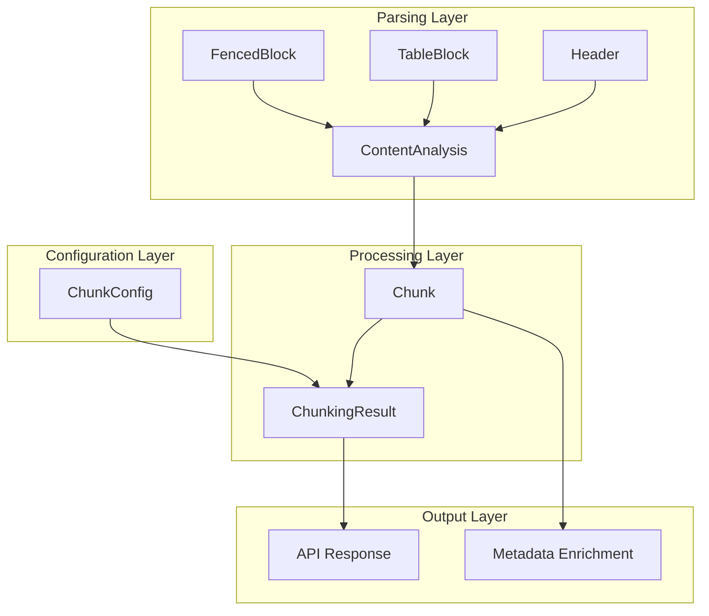
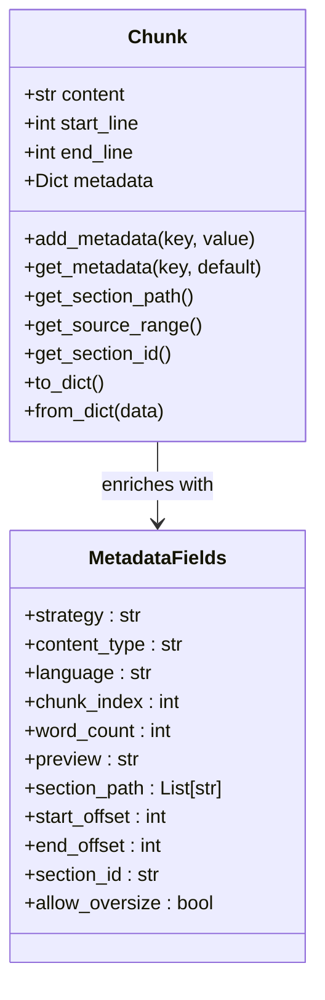
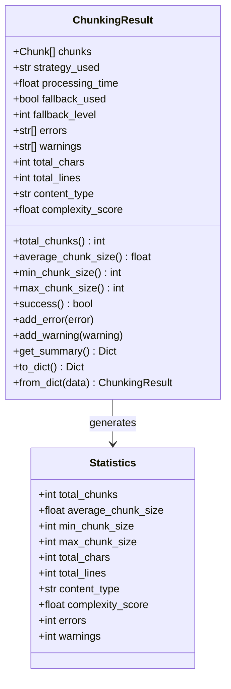
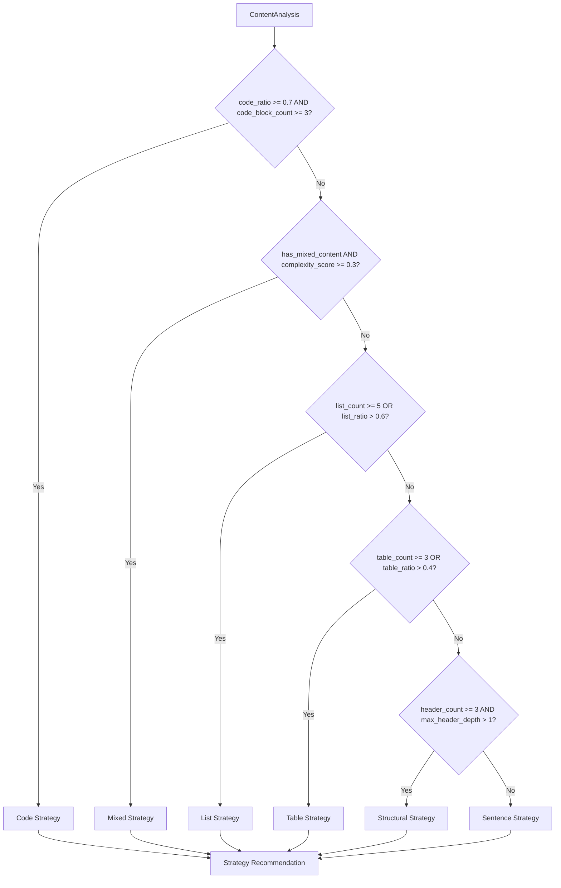
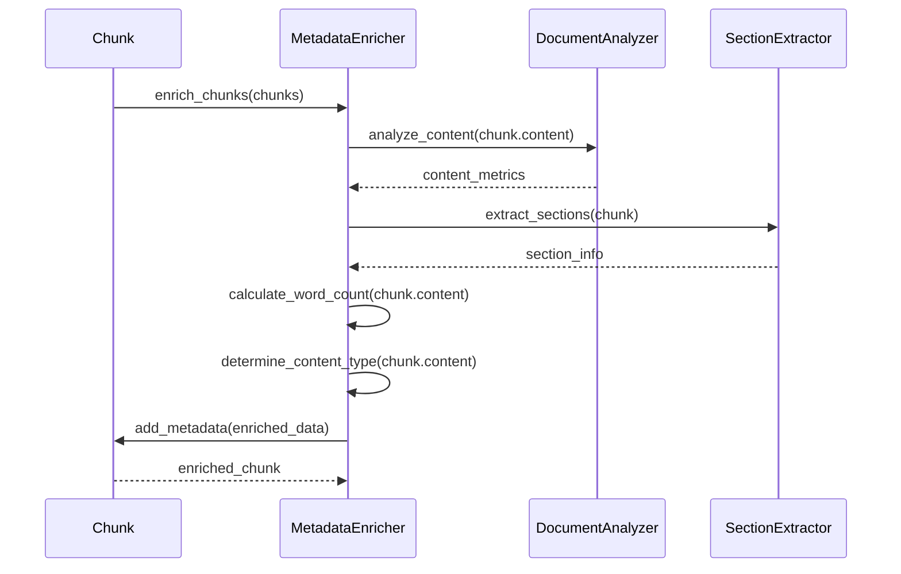
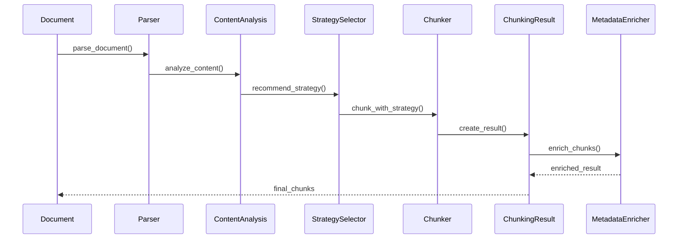

# Data Models

<cite>
**Referenced Files in This Document**
- [markdown_chunker/chunker/types.py](file://markdown_chunker/chunker/types.py)
- [markdown_chunker_legacy/chunker/types.py](file://markdown_chunker_legacy/chunker/types.py)
- [markdown_chunker_v2/types.py](file://markdown_chunker_v2/types.py)
- [markdown_chunker_v2/config.py](file://markdown_chunker_v2/config.py)
- [markdown_chunker_legacy/parser/types.py](file://markdown_chunker_legacy/parser/types.py)
- [examples/basic_usage.py](file://examples/basic_usage.py)
- [examples/api_usage.py](file://examples/api_usage.py)
- [tests/chunker/test_components/test_metadata_enricher.py](file://tests/chunker/test_components/test_metadata_enricher.py)
</cite>

## Table of Contents
1. [Introduction](#introduction)
2. [Core Data Model Architecture](#core-data-model-architecture)
3. [Chunk Model](#chunk-model)
4. [ChunkingResult Model](#chunkingresult-model)
5. [ChunkConfig Model](#chunkconfig-model)
6. [ContentAnalysis Model](#contentanalysis-model)
7. [Metadata Enrichment System](#metadata-enrichment-system)
8. [Model Interactions](#model-interactions)
9. [Configuration Profiles](#configuration-profiles)
10. [Best Practices](#best-practices)

## Introduction

The Markdown chunking system is built around four core data models that form the foundation of the entire chunking pipeline. These models work together to represent, analyze, configure, and process markdown documents into semantically meaningful chunks. Each model serves a specific purpose in the chunking workflow, from representing individual chunks to driving strategy selection based on content analysis.

The system supports multiple versions of the core types, with the legacy implementation providing comprehensive features and the v2 implementation offering a streamlined, simplified approach. Both versions maintain backward compatibility while introducing modern design patterns and improved performance characteristics.

## Core Data Model Architecture

The data model architecture follows a layered approach where each model has distinct responsibilities:



**Diagram sources**
- [markdown_chunker_legacy/parser/types.py](file://markdown_chunker_legacy/parser/types.py#L436-L500)
- [markdown_chunker_legacy/chunker/types.py](file://markdown_chunker_legacy/chunker/types.py#L36-L100)
- [markdown_chunker_v2/types.py](file://markdown_chunker_v2/types.py#L68-L100)

## Chunk Model

The Chunk model represents a single semantically meaningful fragment of a markdown document. It serves as the fundamental building block of the chunking system, encapsulating content along with metadata that provides context and enables intelligent processing.

### Core Fields

The Chunk model consists of four essential fields:

| Field | Type | Description | Constraints |
|-------|------|-------------|-------------|
| `content` | `str` | The actual text content of the chunk | Non-empty, must contain meaningful content |
| `start_line` | `int` | Starting line number (1-indexed) | Must be >= 1 |
| `end_line` | `int` | Ending line number (1-indexed) | Must be >= start_line |
| `metadata` | `Dict[str, Any]` | Additional information about the chunk | JSON-serializable values |

### Invariants and Validation

The Chunk model enforces several critical invariants to ensure data integrity:

```mermaid
flowchart TD
A[Chunk Creation] --> B{start_line >= 1?}
B --> |No| C[Raise ValueError]
B --> |Yes| D{end_line >= start_line?}
D --> |No| E[Raise ValueError]
D --> |Yes| F{content.strip() != ""?}
F --> |No| G[Raise ValueError]
F --> |Yes| H[Validation Passed]
C --> I[Invalid Chunk]
E --> I
G --> I
H --> J[Valid Chunk]
```

**Diagram sources**
- [markdown_chunker_legacy/chunker/types.py](file://markdown_chunker_legacy/chunker/types.py#L50-L57)
- [markdown_chunker_v2/types.py](file://markdown_chunker_v2/types.py#L115-L122)

### Properties and Computed Values

The Chunk model provides several computed properties that offer valuable insights into the chunk's characteristics:

| Property | Type | Description | Calculation |
|----------|------|-------------|-------------|
| `size` | `int` | Character count of content | `len(content)` |
| `line_count` | `int` | Number of lines spanned | `end_line - start_line + 1` |
| `content_type` | `str` | Type of content | `metadata.get("content_type", "text")` |
| `strategy` | `str` | Strategy used for chunking | `metadata.get("strategy", "unknown")` |
| `is_oversize` | `bool` | Whether chunk exceeds size limits | `metadata.get("allow_oversize", False)` |

### Metadata Enrichment

The metadata field serves as a flexible container for additional information that enhances the chunk's utility:



**Diagram sources**
- [markdown_chunker_legacy/chunker/types.py](file://markdown_chunker_legacy/chunker/types.py#L174-L260)
- [tests/chunker/test_components/test_metadata_enricher.py](file://tests/chunker/test_components/test_metadata_enricher.py#L293-L371)

**Section sources**
- [markdown_chunker_legacy/chunker/types.py](file://markdown_chunker_legacy/chunker/types.py#L36-L320)
- [markdown_chunker_v2/types.py](file://markdown_chunker_v2/types.py#L99-L187)

## ChunkingResult Model

The ChunkingResult model encapsulates the complete output of the chunking process, serving as a comprehensive report that includes the generated chunks, analysis information, performance metrics, and error tracking.

### Core Structure

The ChunkingResult model contains several key components:

| Component | Type | Purpose |
|-----------|------|---------|
| `chunks` | `List[Chunk]` | The generated chunks |
| `strategy_used` | `str` | Strategy that was applied |
| `processing_time` | `float` | Time taken in seconds |
| `fallback_used` | `bool` | Whether fallback strategy was used |
| `fallback_level` | `int` | Level of fallback used |
| `errors` | `List[str]` | Error messages encountered |
| `warnings` | `List[str]` | Warning messages generated |

### Analysis Information

Beyond the chunks themselves, ChunkingResult includes comprehensive analysis data:

| Field | Type | Description |
|-------|------|-------------|
| `total_chars` | `int` | Total character count in original document |
| `total_lines` | `int` | Total line count in original document |
| `content_type` | `str` | Classified content type ("code_heavy", "mixed", "text_heavy") |
| `complexity_score` | `float` | Content complexity rating (0.0-1.0) |

### Statistical Properties

The model provides several statistical properties for analysis:



**Diagram sources**
- [markdown_chunker_legacy/chunker/types.py](file://markdown_chunker_legacy/chunker/types.py#L325-L497)
- [markdown_chunker_v2/types.py](file://markdown_chunker_v2/types.py#L239-L272)

### Quality Metrics

The ChunkingResult model also supports quality metrics through the ChunkingMetrics companion class, which provides statistical analysis of chunk sizes and distribution patterns.

**Section sources**
- [markdown_chunker_legacy/chunker/types.py](file://markdown_chunker_legacy/chunker/types.py#L325-L497)
- [markdown_chunker_v2/types.py](file://markdown_chunker_v2/types.py#L239-L272)

## ChunkConfig Model

The ChunkConfig model controls all aspects of the chunking behavior through a comprehensive set of configuration parameters. It provides fine-grained control over size limits, strategy selection thresholds, overlap settings, and behavioral flags.

### Core Configuration Parameters

The ChunkConfig model organizes parameters into logical groups:

#### Size Management Parameters

| Parameter | Type | Default | Description |
|-----------|------|---------|-------------|
| `max_chunk_size` | `int` | 4096 | Maximum size in characters per chunk |
| `min_chunk_size` | `int` | 512 | Minimum size in characters per chunk |
| `target_chunk_size` | `int` | 2048 | Target size aiming for optimal chunks |

#### Overlap Configuration

| Parameter | Type | Default | Description |
|-----------|------|---------|-------------|
| `overlap_size` | `int` | 200 | Size of overlap in characters |
| `overlap_percentage` | `float` | 0.1 | Maximum overlap as percentage of chunk size |
| `enable_overlap` | `bool` | True | Whether to create overlapping chunks |

#### Strategy Selection Thresholds

| Parameter | Type | Default | Purpose |
|-----------|------|---------|---------|
| `code_ratio_threshold` | `float` | 0.3 | Threshold for code strategy selection |
| `min_code_blocks` | `int` | 1 | Minimum code blocks for code strategy |
| `min_complexity` | `float` | 0.3 | Minimum complexity for mixed strategy |
| `list_count_threshold` | `int` | 5 | Minimum lists for list strategy |
| `list_ratio_threshold` | `float` | 0.6 | Threshold for list strategy |
| `table_count_threshold` | `int` | 3 | Minimum tables for table strategy |
| `table_ratio_threshold` | `float` | 0.4 | Threshold for table strategy |
| `header_count_threshold` | `int` | 3 | Minimum headers for structural strategy |

### Behavioral Flags

The configuration includes several behavioral flags that control chunking behavior:

| Flag | Type | Default | Impact |
|------|------|---------|--------|
| `allow_oversize` | `bool` | True | Allow chunks larger than max_chunk_size |
| `preserve_code_blocks` | `bool` | True | Keep code blocks intact |
| `preserve_tables` | `bool` | True | Keep tables intact |
| `preserve_list_hierarchy` | `bool` | True | Maintain list structure |
| `enable_fallback` | `bool` | True | Enable fallback strategies |
| `enable_streaming` | `bool` | False | Enable streaming for large documents |

### Validation and Auto-Adjustment

The ChunkConfig model includes comprehensive validation logic that automatically adjusts invalid configurations:

```mermaid
flowchart TD
A[Configuration Input] --> B{max_chunk_size > 0?}
B --> |No| C[Error: Positive value required]
B --> |Yes| D{min_chunk_size > 0?}
D --> |No| E[Error: Positive value required]
D --> |Yes| F{min_chunk_size >= max_chunk_size?}
F --> |Yes| G[Auto-adjust min_chunk_size]
F --> |No| H[Validate overlap_percentage]
G --> H
H --> I{overlap_percentage in [0,1]?}
I --> |No| J[Error: Percentage range]
I --> |Yes| K[Validation Complete]
C --> L[Configuration Invalid]
E --> L
J --> L
K --> M[Configuration Valid]
```

**Diagram sources**
- [markdown_chunker_legacy/chunker/types.py](file://markdown_chunker_legacy/chunker/types.py#L636-L684)

### Factory Methods and Profiles

The ChunkConfig model provides several factory methods for common use cases:

#### Default Configuration
- Balanced settings suitable for most markdown documents
- `max_chunk_size: 4096`
- `min_chunk_size: 512`
- `target_chunk_size: 2048`
- `enable_overlap: True`

#### Code-Heavy Documents
- Optimized for technical documentation with extensive code examples
- `max_chunk_size: 6144`
- `code_ratio_threshold: 0.5`
- `preserve_code_blocks: True`
- `overlap_size: 300`

#### RAG Applications
- Optimized for Retrieval-Augmented Generation systems
- `max_chunk_size: 2048`
- `enable_overlap: True`
- `overlap_size: 200`

**Section sources**
- [markdown_chunker_legacy/chunker/types.py](file://markdown_chunker_legacy/chunker/types.py#L500-L790)
- [markdown_chunker_v2/config.py](file://markdown_chunker_v2/config.py#L12-L170)

## ContentAnalysis Model

The ContentAnalysis model represents the output of the parsing phase, containing comprehensive metrics and extracted elements that drive strategy selection decisions. It serves as the bridge between document analysis and chunking strategy determination.

### Core Analysis Fields

The ContentAnalysis model captures essential metrics about the document structure:

| Category | Fields | Description |
|----------|--------|-------------|
| **Basic Metrics** | `total_chars`, `total_lines`, `total_words` | Fundamental document characteristics |
| **Content Ratios** | `code_ratio`, `text_ratio`, `list_ratio`, `table_ratio` | Proportions of different content types |
| **Element Counts** | `code_block_count`, `header_count`, `list_count`, `table_count` | Quantities of structural elements |
| **Content Classification** | `content_type` | Overall content categorization |
| **Complexity Metrics** | `complexity_score`, `max_header_depth`, `has_mixed_content` | Document complexity assessment |

### Advanced Analysis Features

The ContentAnalysis model includes several advanced features for sophisticated content analysis:

#### Header Depth Analysis
- Tracks maximum header depth (1-6)
- Maintains granular header count by level
- Supports hierarchical content structure analysis

#### Language Detection
- Identifies programming languages in code blocks
- Maintains occurrence counts for each language
- Enables language-aware chunking strategies

#### Structural Element Tracking
- Comprehensive tracking of lists, tables, and headers
- Nested list depth analysis
- Table structure information

### Strategy Recommendation Engine

The ContentAnalysis model includes intelligent strategy recommendation capabilities:



**Diagram sources**
- [markdown_chunker_legacy/parser/types.py](file://markdown_chunker_legacy/parser/types.py#L636-L649)

### Validation and Consistency Checking

The ContentAnalysis model includes comprehensive validation mechanisms:

#### Internal Consistency
- Ratio normalization to ensure sums to 1.0
- Element count validation against calculated totals
- Content type consistency verification

#### Cross-Component Validation
- AST structure consistency checking
- Fenced block count verification
- Element collection validation

**Section sources**
- [markdown_chunker_legacy/parser/types.py](file://markdown_chunker_legacy/parser/types.py#L436-L932)

## Metadata Enrichment System

The metadata enrichment system enhances chunks with contextual information that improves their utility in downstream applications. This system operates throughout the chunking pipeline, adding valuable metadata that enables intelligent processing and retrieval.

### Enrichment Categories

The metadata enrichment system adds information across several categories:

#### Content Analysis Metadata
- Word count and character count
- Content type classification
- Language identification for code blocks
- Strategy information

#### Structural Metadata
- Section path and hierarchy
- Source position information
- Section identifiers
- Document positioning

#### Quality and Processing Metadata
- Chunk index within document
- Processing timestamps
- Error and warning indicators
- Performance metrics

### Enrichment Process



**Diagram sources**
- [tests/chunker/test_components/test_metadata_enricher.py](file://tests/chunker/test_components/test_metadata_enricher.py#L293-L371)

### Metadata Validation

The enrichment system includes validation mechanisms to ensure metadata quality:

#### Format Validation
- JSON-serializable metadata structure
- Proper data type enforcement
- Range and constraint validation

#### Content Validation
- Metadata completeness checking
- Cross-reference validation
- Consistency verification

**Section sources**
- [tests/chunker/test_components/test_metadata_enricher.py](file://tests/chunker/test_components/test_metadata_enricher.py#L293-L371)

## Model Interactions

The core data models interact in a coordinated manner throughout the chunking pipeline, with each model serving specific roles in the overall process.

### Pipeline Flow



**Diagram sources**
- [markdown_chunker_legacy/chunker/types.py](file://markdown_chunker_legacy/chunker/types.py#L325-L497)
- [markdown_chunker_legacy/parser/types.py](file://markdown_chunker_legacy/parser/types.py#L436-L500)

### Data Flow Patterns

The models follow specific data flow patterns:

#### Forward Propagation
- ContentAnalysis → StrategySelection → Chunking
- ChunkConfig → Chunking → ChunkingResult

#### Backward Propagation
- ChunkingResult → MetadataEnrichment → EnhancedChunks
- StrategySelection → ContentAnalysis → StrategyRecommendation

#### Bidirectional Communication
- ChunkConfig ↔ StrategySelection (threshold validation)
- ContentAnalysis ↔ StrategySelection (metric exchange)

## Configuration Profiles

The system provides several predefined configuration profiles optimized for specific use cases, each with carefully tuned parameters for optimal performance.

### Available Profiles

#### Default Profile
- **Purpose**: General-purpose chunking for typical markdown documents
- **Characteristics**: Balanced size limits, moderate overlap, comprehensive strategy detection
- **Use Cases**: Documentation websites, general content processing

#### Code-Heavy Profile
- **Purpose**: Technical documentation with extensive code examples
- **Characteristics**: Larger chunks, aggressive code detection, preserved code blocks
- **Use Cases**: API documentation, technical manuals, code tutorials

#### RAG Profile
- **Purpose**: Retrieval-Augmented Generation applications
- **Characteristics**: Moderate chunks, enabled overlap for context preservation
- **Use Cases**: AI chatbots, knowledge bases, search systems

#### Search Indexing Profile
- **Purpose**: Search engine optimization and indexing
- **Characteristics**: Small chunks, minimal overlap, focused content extraction
- **Use Cases**: SEO optimization, content discovery, search engines

#### Chat Context Profile
- **Purpose**: Conversational AI and chat applications
- **Characteristics**: Medium-sized chunks with substantial overlap
- **Use Cases**: Virtual assistants, FAQ systems, interactive documentation

### Profile Comparison

| Profile | max_chunk_size | overlap_size | code_threshold | structure_threshold |
|---------|----------------|--------------|----------------|-------------------|
| Default | 4096 | 200 | 0.3 | 3 |
| Code-Heavy | 6144 | 300 | 0.5 | 2 |
| RAG | 2048 | 200 | 0.3 | 3 |
| Search | 1024 | 0 | 0.3 | 3 |
| Chat | 1536 | 200 | 0.3 | 3 |

**Section sources**
- [markdown_chunker_v2/config.py](file://markdown_chunker_v2/config.py#L142-L170)
- [examples/basic_usage.py](file://examples/basic_usage.py#L168-L218)

## Best Practices

### Configuration Guidelines

#### Size Management
- **Max Chunk Size**: Choose based on downstream application requirements
  - RAG systems: 1024-2048 characters
  - General use: 2048-4096 characters
  - Code documentation: 4096-8192 characters

#### Strategy Selection
- **Code-Rich Documents**: Lower code_threshold (0.2-0.3) for early code strategy adoption
- **Structured Documents**: Higher structure_threshold (3-5) for structural strategy preference
- **Mixed Content**: Balanced thresholds for mixed strategy consideration

#### Overlap Configuration
- **RAG Applications**: Enable overlap with 10-20% overlap percentage
- **Search Applications**: Disable overlap for focused content extraction
- **Chat Systems**: Moderate overlap (15-25%) for context preservation

### Performance Optimization

#### Memory Management
- Use streaming for large documents (>10MB)
- Monitor chunk count to prevent excessive memory usage
- Implement chunk batching for batch processing

#### Processing Efficiency
- Leverage ContentAnalysis caching for repeated processing
- Use appropriate configuration profiles for specific use cases
- Implement proper error handling and fallback strategies

### Quality Assurance

#### Validation Strategies
- Implement comprehensive error handling
- Use validation profiles for testing
- Monitor chunk quality metrics
- Implement regression testing for configuration changes

#### Metadata Management
- Ensure metadata completeness and accuracy
- Validate JSON serialization compatibility
- Implement proper metadata enrichment
- Monitor metadata consistency across chunks