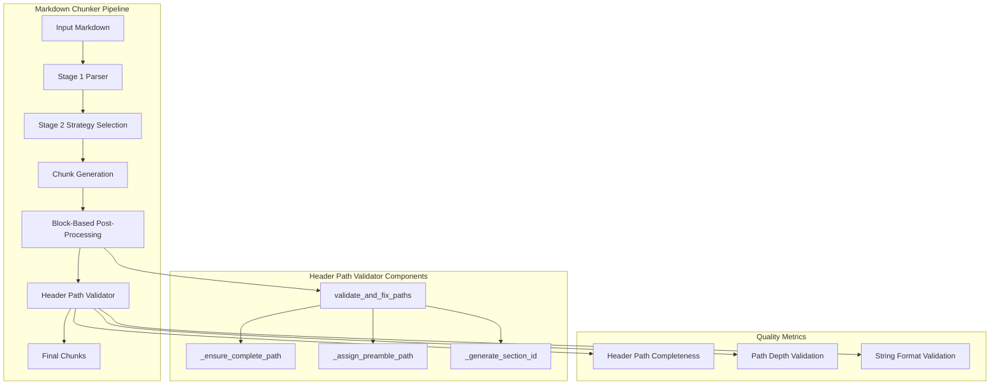
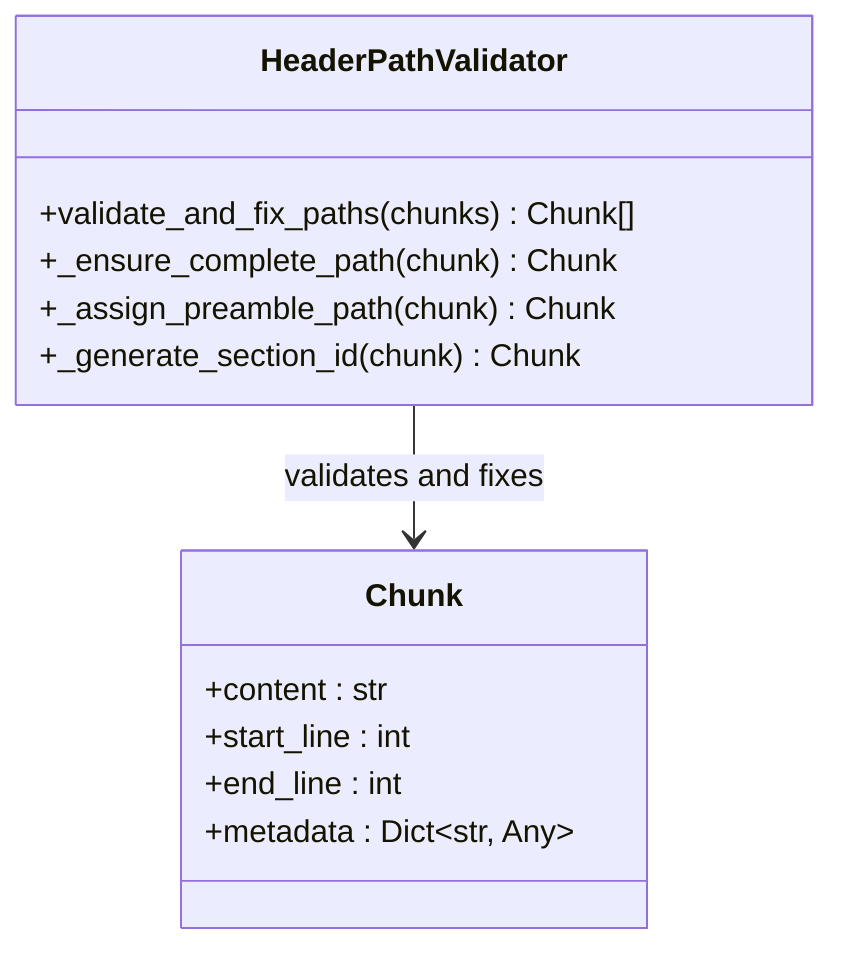
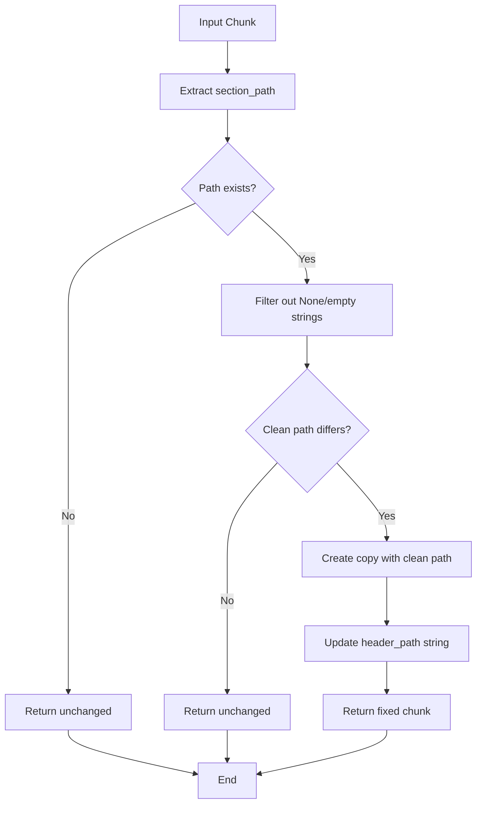
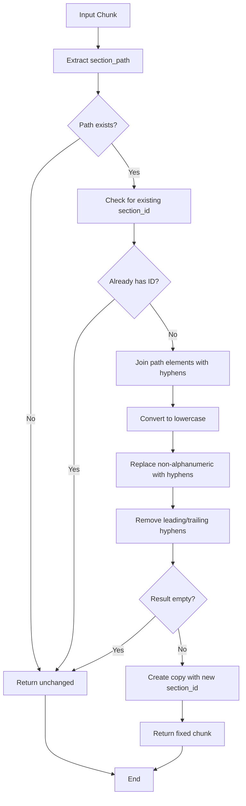
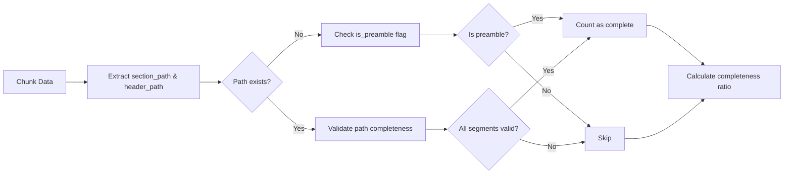
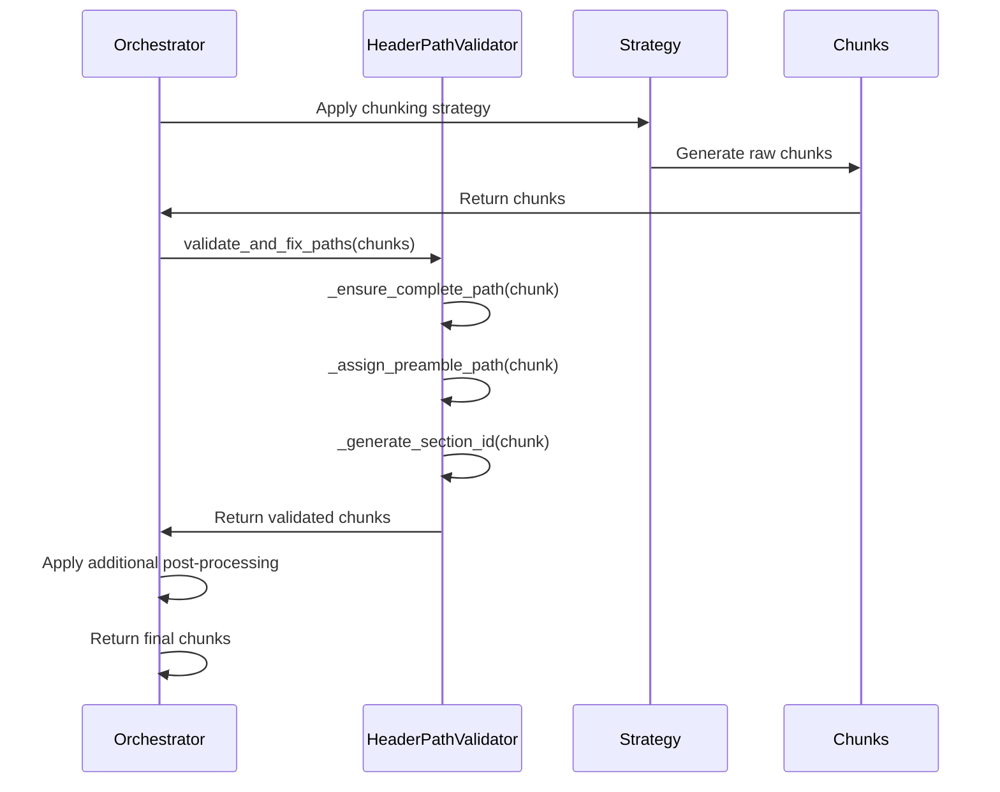

# Header Path Validator

<cite>
**Referenced Files in This Document**
- [header_path_validator.py](file://markdown_chunker/chunker/header_path_validator.py)
- [types.py](file://markdown_chunker/chunker/types.py)
- [orchestrator.py](file://markdown_chunker/chunker/orchestrator.py)
- [test_header_path_property.py](file://tests/chunker/test_header_path_property.py)
- [test_data_completeness_validator.py](file://tests/chunker/test_data_completeness_validator.py)
- [quality_metrics.py](file://tests/quality_metrics.py)
- [structural_strategy.py](file://markdown_chunker/chunker/strategies/structural_strategy.py)
- [metadata_enricher.py](file://markdown_chunker/chunker/components/metadata_enricher.py)
- [basic_usage.py](file://examples/basic_usage.py)
</cite>

## Table of Contents
1. [Introduction](#introduction)
2. [Architecture Overview](#architecture-overview)
3. [Core Components](#core-components)
4. [Implementation Details](#implementation-details)
5. [Quality Assurance](#quality-assurance)
6. [Integration Points](#integration-points)
7. [Performance Considerations](#performance-considerations)
8. [Testing Framework](#testing-framework)
9. [Best Practices](#best-practices)
10. [Troubleshooting Guide](#troubleshooting-guide)

## Introduction

The Header Path Validator is a critical component of the markdown-chunker system that ensures all chunks maintain complete, consistent header paths (MC-006 fix). This validator addresses the requirement for hierarchical document structure preservation during the chunking process, providing reliable metadata for downstream applications like RAG systems and search engines.

The validator operates as part of the block-based post-processing pipeline, applying three core transformations to chunk metadata: path completion, preamble assignment, and section ID generation. These operations ensure that every chunk has proper contextual information about its position within the document hierarchy.

## Architecture Overview

The Header Path Validator follows a modular design pattern within the markdown-chunker ecosystem, integrating seamlessly with the orchestrator and various chunking strategies.



**Diagram sources**
- [orchestrator.py](file://markdown_chunker/chunker/orchestrator.py#L548-L559)
- [header_path_validator.py](file://markdown_chunker/chunker/header_path_validator.py#L15-L31)

**Section sources**
- [orchestrator.py](file://markdown_chunker/chunker/orchestrator.py#L548-L559)
- [header_path_validator.py](file://markdown_chunker/chunker/header_path_validator.py#L1-L135)

## Core Components

### HeaderPathValidator Class

The main validator class encapsulates three primary validation and correction methods, each addressing specific aspects of header path integrity.



**Diagram sources**
- [header_path_validator.py](file://markdown_chunker/chunker/header_path_validator.py#L11-L133)
- [types.py](file://markdown_chunker/chunker/types.py#L36-L261)

### Validation Pipeline

The validator implements a three-stage pipeline that processes chunks sequentially:

1. **Path Completion**: Ensures section paths contain no missing levels or gaps
2. **Preamble Assignment**: Provides synthetic paths for preamble content
3. **Section ID Generation**: Creates stable identifiers from header paths

**Section sources**
- [header_path_validator.py](file://markdown_chunker/chunker/header_path_validator.py#L15-L31)

## Implementation Details

### Path Completion Logic

The `_ensure_complete_path` method addresses the core requirement of maintaining hierarchical integrity by filtering out null or empty path segments.



**Diagram sources**
- [header_path_validator.py](file://markdown_chunker/chunker/header_path_validator.py#L34-L67)

The path completion algorithm employs defensive programming practices, ensuring that only valid, non-empty strings contribute to the final header path. This prevents issues with malformed metadata and maintains consistency across the chunk collection.

**Section sources**
- [header_path_validator.py](file://markdown_chunker/chunker/header_path_validator.py#L34-L67)

### Preamble Path Assignment

The `_assign_preamble_path` method handles special cases where chunks contain introductory content without explicit headers.

```mermaid
flowchart TD
A[Input Chunk] --> B[Check has_preamble flag]
B --> C{Has preamble?}
C --> |No| D[Check section_path empty AND start_line=1]
D --> E{Both conditions met?}
E --> |No| F[Return unchanged]
E --> |Yes| G[Mark as preamble chunk]
C --> |Yes| G
G --> H[Set section_path = ['__preamble__']
H --> I[Set header_path = '/__preamble__']
I --> J[Set section_id = 'preamble']
J --> K[Return fixed chunk]
F --> L[End]
K --> L
```

**Diagram sources**
- [header_path_validator.py](file://markdown_chunker/chunker/header_path_validator.py#L70-L97)

This logic ensures that preamble content receives appropriate metadata treatment, preventing it from being lost in the chunking process while maintaining consistent path structure.

**Section sources**
- [header_path_validator.py](file://markdown_chunker/chunker/header_path_validator.py#L70-L97)

### Section ID Generation

The `_generate_section_id` method creates stable, URL-friendly identifiers from header paths using a consistent transformation algorithm.



**Diagram sources**
- [header_path_validator.py](file://markdown_chunker/chunker/header_path_validator.py#L100-L133)

The ID generation process follows web standards for URL safety, ensuring compatibility with various downstream systems that consume the chunk metadata.

**Section sources**
- [header_path_validator.py](file://markdown_chunker/chunker/header_path_validator.py#L100-L133)

## Quality Assurance

### Property-Based Testing

The validator undergoes rigorous property-based testing to ensure compliance with quality requirements. The test suite validates multiple aspects of header path behavior:

| Property | Description | Validation Method |
|----------|-------------|-------------------|
| Header Path Accuracy | Paths reflect document hierarchy | String format and depth validation |
| Path Consistency | Adjacent chunks maintain hierarchy | Cross-chunk comparison |
| Single Header Paths | Individual headers have correct paths | Content extraction and verification |
| Path Completeness | No missing levels in paths | Null and empty string filtering |

**Section sources**
- [test_header_path_property.py](file://tests/chunker/test_header_path_property.py#L126-L418)

### Quality Metrics

The system tracks header path completeness as part of its quality assurance framework, measuring the percentage of chunks with valid hierarchical paths.



**Diagram sources**
- [quality_metrics.py](file://tests/quality_metrics.py#L303-L328)

**Section sources**
- [quality_metrics.py](file://tests/quality_metrics.py#L303-L328)

## Integration Points

### Orchestrator Integration

The Header Path Validator integrates with the orchestrator as part of the block-based post-processing pipeline, ensuring that all chunks receive proper metadata treatment regardless of the selected strategy.



**Diagram sources**
- [orchestrator.py](file://markdown_chunker/chunker/orchestrator.py#L548-L559)
- [header_path_validator.py](file://markdown_chunker/chunker/header_path_validator.py#L15-L31)

**Section sources**
- [orchestrator.py](file://markdown_chunker/chunker/orchestrator.py#L548-L559)

### Strategy Compatibility

The validator works seamlessly with all chunking strategies, providing consistent metadata regardless of whether structural, code, list, or mixed strategies are employed. This ensures that downstream consumers receive uniform data structures.

**Section sources**
- [structural_strategy.py](file://markdown_chunker/chunker/strategies/structural_strategy.py#L1034-L1063)

## Performance Considerations

### Computational Efficiency

The Header Path Validator operates with linear time complexity O(n) where n is the number of chunks, making it suitable for processing large document collections efficiently. Each validation method processes individual chunks independently, allowing for potential parallelization in future implementations.

### Memory Management

The validator employs defensive copying patterns, creating new chunk instances only when modifications are necessary. This approach minimizes memory overhead while ensuring thread safety and immutability of input data.

### Error Handling

The validator implements graceful degradation, continuing processing even when individual chunks encounter issues. This robustness ensures that partial failures don't compromise the overall chunking process.

## Testing Framework

### Unit Tests

The validator includes comprehensive unit tests covering edge cases and boundary conditions:

- **Empty paths**: Handling of chunks with no section path
- **Malformed paths**: Filtering of null and empty string segments  
- **Preamble detection**: Correct identification of preamble content
- **ID generation**: Validation of stable section ID creation
- **Path depth limits**: Enforcement of reasonable hierarchy depth

**Section sources**
- [test_header_path_property.py](file://tests/chunker/test_header_path_property.py#L126-L418)

### Integration Tests

Integration tests verify the validator's behavior within the broader chunking pipeline, ensuring compatibility with various document types and chunking strategies.

**Section sources**
- [test_data_completeness_validator.py](file://tests/chunker/test_data_completeness_validator.py#L1-L200)

## Best Practices

### Metadata Design Guidelines

When working with the Header Path Validator, follow these best practices:

1. **Consistent Path Structure**: Ensure section paths maintain hierarchical relationships
2. **Proper Preamble Flags**: Use the `has_preamble` flag correctly for introductory content
3. **Path Validation**: Validate header paths meet the required format requirements
4. **ID Uniqueness**: Rely on the validator's ID generation for consistent section identification

### Error Prevention

Common issues and their prevention strategies:

- **Missing Path Segments**: Ensure all header levels are represented in section paths
- **Invalid Characters**: The validator automatically sanitizes paths for URL compatibility
- **Depth Exceedances**: Monitor path depth to prevent overly complex hierarchies
- **Preamble Ambiguity**: Use clear indicators for preamble content identification

### Performance Optimization

For optimal performance when processing large document collections:

- **Batch Processing**: Process chunks in batches to leverage vectorized operations
- **Memory Monitoring**: Track memory usage during validation of large datasets
- **Parallel Execution**: Consider parallel processing for independent chunk validation
- **Caching Strategies**: Implement caching for frequently accessed path computations

## Troubleshooting Guide

### Common Issues and Solutions

| Issue | Symptoms | Solution |
|-------|----------|----------|
| Missing Header Paths | Empty or None section_path | Verify strategy selection and document structure |
| Malformed Path Strings | Invalid header_path format | Check path completion logic and string concatenation |
| Preamble Detection Failures | Missing preamble chunks | Validate has_preamble flag and chunk positioning |
| Section ID Conflicts | Duplicate or invalid section IDs | Review ID generation algorithm and path uniqueness |
| Performance Degradation | Slow validation on large datasets | Optimize batch processing and memory management |

### Debugging Techniques

1. **Log Analysis**: Enable detailed logging to trace validation steps
2. **Path Inspection**: Examine section_path and header_path values directly
3. **Chunk Comparison**: Compare before/after states to identify modifications
4. **Unit Test Isolation**: Test individual validation methods separately
5. **Performance Profiling**: Use profiling tools to identify bottlenecks

### Recovery Procedures

When validation failures occur:

1. **Graceful Degradation**: Continue processing with original chunks when possible
2. **Fallback Strategies**: Implement alternative path generation methods
3. **Error Reporting**: Provide detailed error messages for debugging
4. **State Restoration**: Maintain consistent state across validation attempts
5. **Retry Mechanisms**: Implement retry logic for transient failures

**Section sources**
- [test_data_completeness_validator.py](file://tests/chunker/test_data_completeness_validator.py#L1-L200)