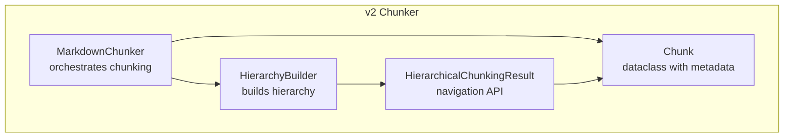
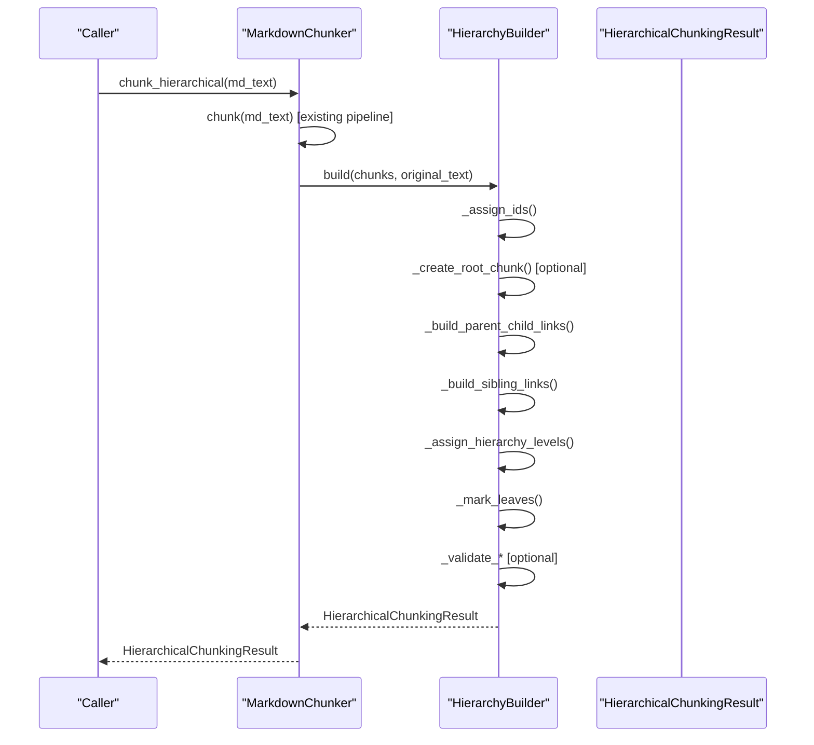
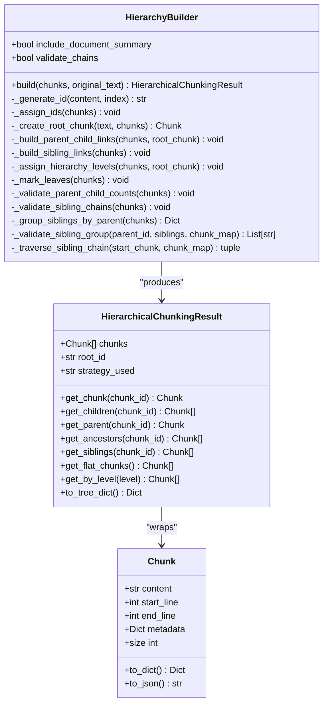
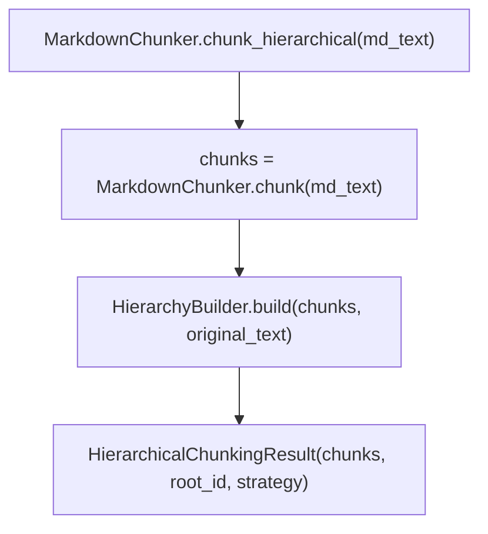
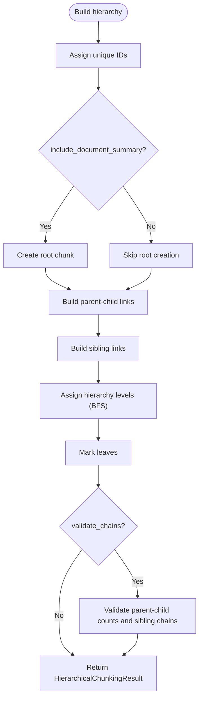

# HierarchyBuilder

<cite>
**Referenced Files in This Document**
- [hierarchy.py](file://markdown_chunker_v2/hierarchy.py)
- [chunker.py](file://markdown_chunker_v2/chunker.py)
- [types.py](file://markdown_chunker_v2/types.py)
- [test_hierarchical_chunking.py](file://tests/chunker/test_hierarchical_chunking.py)
- [test_hierarchy_fixes.py](file://tests/integration/test_hierarchy_fixes.py)
- [11-hierarchical-chunking.md](file://docs/research/features/11-hierarchical-chunking.md)
</cite>

## Table of Contents
1. [Introduction](#introduction)
2. [Project Structure](#project-structure)
3. [Core Components](#core-components)
4. [Architecture Overview](#architecture-overview)
5. [Detailed Component Analysis](#detailed-component-analysis)
6. [Dependency Analysis](#dependency-analysis)
7. [Performance Considerations](#performance-considerations)
8. [Troubleshooting Guide](#troubleshooting-guide)
9. [Conclusion](#conclusion)

## Introduction
This document explains the HierarchyBuilder component that constructs hierarchical relationships among chunks produced by the markdown chunker. It adds parent-child and sibling links, assigns hierarchy levels, marks leaves, and optionally creates a document-level root chunk. The result is a flat list of chunks augmented with navigational metadata and a lightweight result wrapper that exposes convenient navigation APIs.

## Project Structure
The hierarchical chunking feature lives in the v2 chunker module and integrates with the main chunker pipeline. The key files are:
- HierarchyBuilder and HierarchicalChunkingResult: [hierarchy.py](file://markdown_chunker_v2/hierarchy.py)
- MarkdownChunker integration and orchestration: [chunker.py](file://markdown_chunker_v2/chunker.py)
- Shared data structures (Chunk): [types.py](file://markdown_chunker_v2/types.py)
- Tests validating behavior and fixes: [test_hierarchical_chunking.py](file://tests/chunker/test_hierarchical_chunking.py), [test_hierarchy_fixes.py](file://tests/integration/test_hierarchy_fixes.py)
- Feature design and usage guidance: [11-hierarchical-chunking.md](file://docs/research/features/11-hierarchical-chunking.md)

**Diagram sources**
- [chunker.py](file://markdown_chunker_v2/chunker.py#L176-L207)
- [hierarchy.py](file://markdown_chunker_v2/hierarchy.py#L199-L276)
- [types.py](file://markdown_chunker_v2/types.py#L186-L242)

**Section sources**
- [chunker.py](file://markdown_chunker_v2/chunker.py#L176-L207)
- [hierarchy.py](file://markdown_chunker_v2/hierarchy.py#L199-L276)
- [types.py](file://markdown_chunker_v2/types.py#L186-L242)

## Core Components
- HierarchyBuilder: Post-processes a flat list of chunks to add parent-child and sibling links, assign hierarchy levels, mark leaves, and optionally create a root document chunk. It also validates relationships when enabled.
- HierarchicalChunkingResult: A lightweight wrapper around the chunk list that provides O(1) lookup by ID and navigation methods (get_chunk, get_children, get_parent, get_ancestors, get_siblings, get_flat_chunks, get_by_level, to_tree_dict).
- Chunk: The shared data structure carrying content, line ranges, and metadata including header_path, header_level, and others used by HierarchyBuilder.

Key responsibilities:
- Assign unique IDs to chunks.
- Build parent-child relationships using header_path.
- Build sibling chains ordered by start_line.
- Compute hierarchy levels based on tree depth (not header_level).
- Mark leaf nodes.
- Optionally create a root document chunk with a meaningful summary.
- Validate parent-child counts and sibling chain integrity.

**Section sources**
- [hierarchy.py](file://markdown_chunker_v2/hierarchy.py#L14-L197)
- [hierarchy.py](file://markdown_chunker_v2/hierarchy.py#L199-L738)
- [types.py](file://markdown_chunker_v2/types.py#L186-L242)

## Architecture Overview
The hierarchical chunking pipeline is a post-processing step appended to the standard chunking flow. MarkdownChunker performs parsing, strategy selection, chunking, overlap, and metadata enrichment, then delegates to HierarchyBuilder to construct the hierarchy.

**Diagram sources**
- [chunker.py](file://markdown_chunker_v2/chunker.py#L176-L207)
- [hierarchy.py](file://markdown_chunker_v2/hierarchy.py#L223-L276)

## Detailed Component Analysis

### HierarchyBuilder
Responsibilities:
- Unique ID assignment: Generates compact IDs from content and index.
- Root creation: Creates a document-level chunk with a title and summary when enabled.
- Parent-child linking: Resolves parents using header_path semantics; preamble and orphaned chunks link to root.
- Sibling linking: Sorts siblings by start_line and sets prev/next sibling IDs.
- Hierarchy level assignment: Computes levels via BFS from root; levels map to 0(document), 1(section), 2(subsection), 3(paragraph).
- Leaf marking: Sets is_leaf based on children_ids.
- Validation: Optional checks for parent-child counts and sibling chain integrity.

Complexity characteristics:
- Orchestrator method build(): < 8
- _assign_ids(): < 5
- _create_root_chunk(): < 8
- _build_parent_child_links(): < 10
- _build_sibling_links(): < 7
- _assign_hierarchy_levels(): < 7
- _mark_leaves(): < 4
- Validation helpers: < 9–10

Behavioral guarantees validated by tests:
- Bidirectional parent-child links.
- Sibling order by start_line.
- Correct hierarchy levels reflecting tree depth.
- No orphans (non-root chunks have valid parents).
- No circular references in ancestor chains.
- get_by_level() returns correct chunks after fix #2.

**Diagram sources**
- [hierarchy.py](file://markdown_chunker_v2/hierarchy.py#L14-L197)
- [hierarchy.py](file://markdown_chunker_v2/hierarchy.py#L199-L738)
- [types.py](file://markdown_chunker_v2/types.py#L186-L242)

**Section sources**
- [hierarchy.py](file://markdown_chunker_v2/hierarchy.py#L199-L738)
- [test_hierarchical_chunking.py](file://tests/chunker/test_hierarchical_chunking.py#L1-L465)
- [test_hierarchy_fixes.py](file://tests/integration/test_hierarchy_fixes.py#L1-L328)

### HierarchicalChunkingResult Navigation Methods
- get_chunk(chunk_id): O(1) lookup via internal index.
- get_children(chunk_id): Returns children by reading children_ids.
- get_parent(chunk_id): Returns parent by reading parent_id.
- get_ancestors(chunk_id): Traverses upward until root.
- get_siblings(chunk_id): Returns all siblings under the same parent.
- get_flat_chunks(): Returns only leaf chunks (no children).
- get_by_level(level): Filters chunks by hierarchy_level.
- to_tree_dict(): Serializes the hierarchy using IDs to avoid circular references.

These methods enable multi-level retrieval and breadcrumb-style navigation.

**Section sources**
- [hierarchy.py](file://markdown_chunker_v2/hierarchy.py#L14-L197)
- [test_hierarchical_chunking.py](file://tests/chunker/test_hierarchical_chunking.py#L147-L271)

### Integration with MarkdownChunker
MarkdownChunker.chunk_hierarchical() performs the standard chunking pipeline and then passes the resulting chunks to HierarchyBuilder. The builder augments metadata and returns a HierarchicalChunkingResult with navigation capabilities.

**Diagram sources**
- [chunker.py](file://markdown_chunker_v2/chunker.py#L176-L207)
- [hierarchy.py](file://markdown_chunker_v2/hierarchy.py#L223-L276)

**Section sources**
- [chunker.py](file://markdown_chunker_v2/chunker.py#L176-L207)

### Algorithmic Details and Edge Cases
- Parent resolution: Uses header_path segments to walk up the tree; preamble and orphaned chunks link to root.
- Sibling ordering: Deterministic by start_line within each parent group.
- Level assignment: BFS from root yields levels 0/1/2/3; header_level mapping was corrected to reflect tree depth.
- Root summary: Extracts meaningful summary avoiding preamble duplication; includes strategy metadata.
- Validation: Optional checks ensure declared children counts match actual children and sibling chains are complete and acyclic.

**Diagram sources**
- [hierarchy.py](file://markdown_chunker_v2/hierarchy.py#L223-L276)
- [hierarchy.py](file://markdown_chunker_v2/hierarchy.py#L342-L488)
- [hierarchy.py](file://markdown_chunker_v2/hierarchy.py#L565-L738)

**Section sources**
- [hierarchy.py](file://markdown_chunker_v2/hierarchy.py#L223-L276)
- [hierarchy.py](file://markdown_chunker_v2/hierarchy.py#L342-L488)
- [hierarchy.py](file://markdown_chunker_v2/hierarchy.py#L565-L738)

## Dependency Analysis
- HierarchyBuilder depends on:
  - Chunk metadata fields (chunk_id, parent_id, children_ids, prev_sibling_id, next_sibling_id, hierarchy_level, is_leaf, header_path, header_level, content_type).
  - The builder is invoked by MarkdownChunker.chunk_hierarchical().
- HierarchicalChunkingResult depends on Chunk and maintains an internal index keyed by chunk_id for O(1) lookups.

**Diagram sources**
- [hierarchy.py](file://markdown_chunker_v2/hierarchy.py#L14-L197)
- [hierarchy.py](file://markdown_chunker_v2/hierarchy.py#L199-L276)
- [chunker.py](file://markdown_chunker_v2/chunker.py#L176-L207)
- [types.py](file://markdown_chunker_v2/types.py#L186-L242)

**Section sources**
- [hierarchy.py](file://markdown_chunker_v2/hierarchy.py#L14-L197)
- [hierarchy.py](file://markdown_chunker_v2/hierarchy.py#L199-L276)
- [chunker.py](file://markdown_chunker_v2/chunker.py#L176-L207)
- [types.py](file://markdown_chunker_v2/types.py#L186-L242)

## Performance Considerations
- Complexity targets: The builder’s orchestrator and individual steps are bounded to keep overall complexity low (< 10).
- O(1) navigation: HierarchicalChunkingResult builds an internal index keyed by chunk_id.
- BFS for levels: Assigning hierarchy levels uses a queue-based traversal; typical documents have manageable fan-out.
- Compact IDs: Short hashed IDs reduce memory overhead compared to UUIDs.
- Validation cost: Enabled by default to catch structural issues early; can be disabled for performance-sensitive scenarios.

[No sources needed since this section provides general guidance]

## Troubleshooting Guide
Common issues and diagnostics:
- Orphaned chunks: Ensure header_path is set; preamble and orphaned chunks link to root. If missing, verify chunking pipeline populated header_path.
- Broken sibling chains: Validate sibling groups; first sibling must have no prev_sibling_id, last must have no next_sibling_id, and chain must be continuous and cycle-free.
- Parent-child mismatch: Declared children count must equal actual children count; validation raises errors if mismatch detected.
- Unexpected hierarchy levels: After fix #2, levels reflect tree depth; verify header_path correctness and that root is created when enabled.
- Circular references: Ancestors traversal should terminate; tests enforce depth limits and last ancestor is root.

Relevant validations and tests:
- Bidirectional parent-child links.
- Sibling ordering by start_line.
- get_by_level() correctness.
- No circular references in ancestor chains.
- Parent-child counts and sibling chain integrity.

**Section sources**
- [hierarchy.py](file://markdown_chunker_v2/hierarchy.py#L565-L738)
- [test_hierarchical_chunking.py](file://tests/chunker/test_hierarchical_chunking.py#L376-L465)
- [test_hierarchy_fixes.py](file://tests/integration/test_hierarchy_fixes.py#L181-L328)

## Conclusion
HierarchyBuilder transforms flat chunks into a navigable, multi-level structure using header_path metadata. It adds robust parent-child and sibling relationships, computes meaningful hierarchy levels, and provides a rich navigation API through HierarchicalChunkingResult. The design emphasizes correctness, performance, and backward compatibility, enabling multi-level retrieval and breadcrumb navigation while maintaining a flat chunk list for systems that do not support hierarchy.