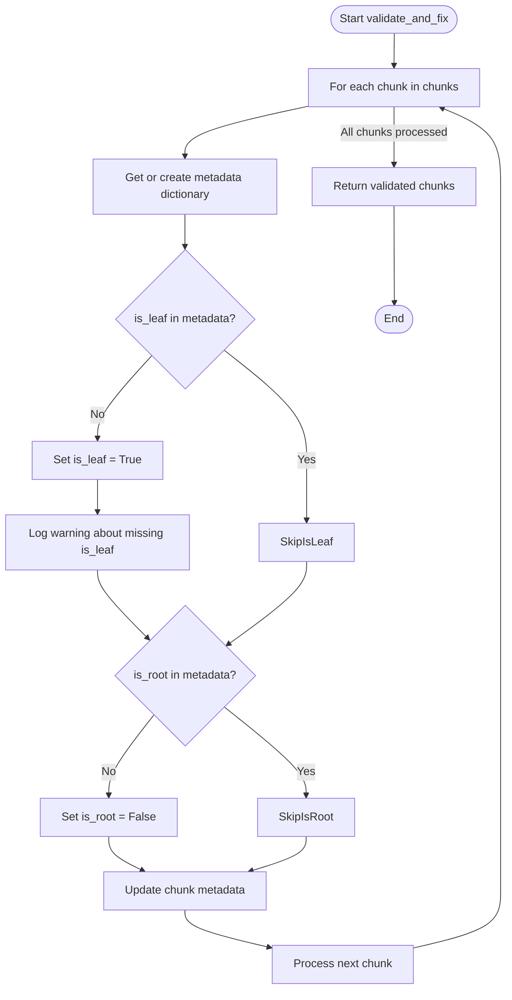
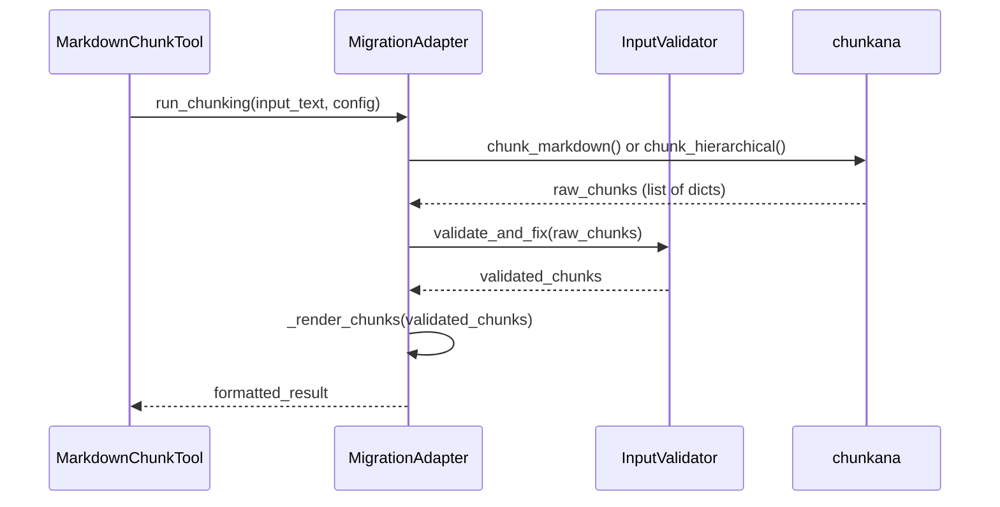
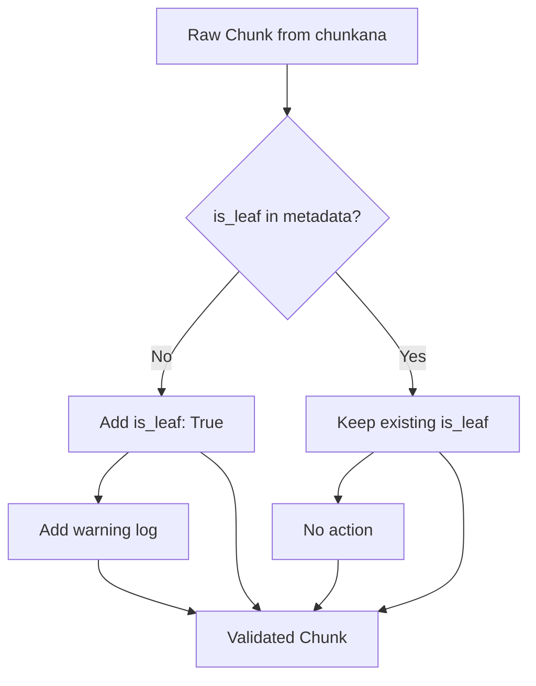

# Input Validator

<cite>
**Referenced Files in This Document**   
- [input_validator.py](file://input_validator.py)
- [adapter.py](file://adapter.py)
- [tools/markdown_chunk_tool.py](file://tools/markdown_chunk_tool.py)
</cite>

## Table of Contents
1. [Introduction](#introduction)
2. [Core Functionality](#core-functionality)
3. [Implementation Details](#implementation-details)
4. [Integration with Processing Pipeline](#integration-with-processing-pipeline)
5. [Error Handling and Validation](#error-handling-and-validation)
6. [Usage Examples](#usage-examples)
7. [Best Practices](#best-practices)

## Introduction

The Input Validator component is a critical part of the Advanced Markdown Chunker system, responsible for ensuring data integrity and resilience when processing chunks from the chunkana library. This component acts as a safeguard against potential inconsistencies or missing fields that might arise from library changes or edge cases in the chunking process.

The validator operates as part of a larger processing pipeline that transforms Markdown documents into semantically meaningful chunks optimized for RAG (Retrieval-Augmented Generation) systems. Its primary role is to validate and fix raw chunk data before it proceeds to subsequent processing stages, ensuring consistent and reliable output regardless of variations in the input from the underlying chunking library.

This documentation provides a comprehensive overview of the Input Validator's architecture, functionality, and integration within the overall system, highlighting its importance in maintaining data quality and system reliability.

## Core Functionality

The Input Validator provides essential validation and normalization services for chunk data generated by the chunkana library. Its primary responsibility is to ensure that all chunks contain required metadata fields with appropriate default values, even when the source library omits them.

The validator specifically addresses two critical metadata fields that are essential for the proper functioning of the chunking system:
- **is_leaf**: Indicates whether a chunk is a leaf node in a hierarchical structure
- **is_root**: Indicates whether a chunk represents the root of a document hierarchy

When these fields are missing from incoming chunk data, the validator applies sensible defaults to maintain system consistency. For missing `is_leaf` fields, it defaults to `True`, treating chunks as leaf nodes unless otherwise specified. For missing `is_root` fields, it defaults to `False`, assuming chunks are not root nodes unless explicitly marked.

This validation process is crucial for maintaining backward compatibility and system resilience, particularly when integrating with evolving versions of the chunkana library that might change their output format or omit certain fields under specific conditions.

**Section sources**
- [input_validator.py](file://input_validator.py#L14-L45)

## Implementation Details

The Input Validator is implemented as a simple yet effective class that processes lists of chunk dictionaries. The core implementation consists of a single method, `validate_and_fix`, which iterates through each chunk in the input list and ensures the presence of required metadata fields.

The implementation follows a straightforward pattern of checking for missing fields and applying defaults:
1. For each chunk, it accesses or creates a metadata dictionary
2. It checks for the presence of the `is_leaf` field, applying a default of `True` if missing
3. It checks for the presence of the `is_root` field, applying a default of `False` if missing
4. It updates the chunk with the modified metadata
5. It returns the validated list of chunks

The validator also includes logging functionality to record when default values are applied, providing visibility into potential data inconsistencies. When a chunk is missing the `is_leaf` field, a warning is logged with the chunk index, helping developers identify and address potential issues in the chunking process.

**Diagram sources**
- [input_validator.py](file://input_validator.py#L17-L45)

**Section sources**
- [input_validator.py](file://input_validator.py#L14-L45)

## Integration with Processing Pipeline

The Input Validator is tightly integrated into the main processing pipeline through the MigrationAdapter class, which serves as a compatibility layer between the plugin interface and the chunkana library. This integration ensures that all chunk data is validated before proceeding to subsequent processing stages.

The validator is instantiated during the initialization of the MigrationAdapter and is stored as an instance variable (`_input_validator`). It is then applied during the `_perform_chunking` phase of processing, after chunks are generated by the chunkana library but before they undergo rendering and output formatting.

The integration follows a two-stage processing architecture:
1. **Chunking Stage**: Raw chunks are generated by the chunkana library
2. **Validation Stage**: The Input Validator processes the raw chunks to ensure data integrity

This integration point is critical because it ensures that validation occurs before any rendering decisions are made, allowing the system to make consistent decisions about output format based on complete and reliable metadata.

**Diagram sources**
- [adapter.py](file://adapter.py#L78-L80)
- [adapter.py](file://adapter.py#L184-L185)

**Section sources**
- [adapter.py](file://adapter.py#L78-L80)
- [adapter.py](file://adapter.py#L184-L185)

## Error Handling and Validation

The Input Validator implements a defensive programming approach to handle potential data inconsistencies from the chunkana library. Rather than failing when expected fields are missing, it applies sensible defaults to ensure the processing pipeline can continue uninterrupted.

The validation process includes specific error handling for missing metadata fields:
- When `is_leaf` is missing, it defaults to `True` and logs a warning
- When `is_root` is missing, it defaults to `False` without logging (as this is a more common case)

The warning for missing `is_leaf` fields serves as an early detection mechanism for potential issues in the chunking process, alerting developers to investigate why this critical field might be absent. This logging provides valuable diagnostic information while maintaining system resilience.

The validator's error handling strategy follows the principle of graceful degradation, where the system continues to function even when encountering incomplete or inconsistent data. This approach is particularly important in a production environment where the plugin must handle a wide variety of input documents and potential edge cases.

The integration with the broader error handling system is evident in the main tool implementation, which uses try-except blocks to catch and handle exceptions at the highest level, ensuring that validation issues do not cause the entire processing pipeline to fail.

**Section sources**
- [input_validator.py](file://input_validator.py#L33-L37)
- [tools/markdown_chunk_tool.py](file://tools/markdown_chunk_tool.py#L122-L125)

## Usage Examples

The Input Validator operates transparently within the processing pipeline and does not require direct interaction from end users. However, understanding its behavior is important for developers working with the system.

When processing a document, the validator ensures consistent metadata even when the underlying chunking library produces incomplete data. For example, if the chunkana library returns chunks without `is_leaf` metadata, the validator will automatically add this information:

This ensures that downstream components can reliably use the `is_leaf` and `is_root` fields for decision-making, such as determining which chunks to include in hierarchical navigation or which chunks represent actual content versus structural elements.

The validator's operation is particularly important when processing complex documents with nested structures, code blocks, or other elements that might affect how the chunking library generates metadata. By normalizing the data format, the validator enables consistent processing regardless of document complexity.

**Diagram sources**
- [input_validator.py](file://input_validator.py#L33-L37)

**Section sources**
- [input_validator.py](file://input_validator.py#L17-L45)

## Best Practices

When working with the Input Validator and the broader chunking system, several best practices should be followed:

1. **Monitor Validation Warnings**: Pay attention to warnings about missing `is_leaf` fields, as they may indicate issues with the chunking process that should be investigated.

2. **Ensure Backward Compatibility**: When modifying the chunking library or its output format, ensure that critical metadata fields are preserved to avoid triggering validation defaults.

3. **Test with Edge Cases**: Validate the system with documents that have complex structures, nested elements, or unusual formatting to ensure the validator handles all scenarios correctly.

4. **Maintain Metadata Consistency**: When developing new chunking strategies or modifying existing ones, ensure that all required metadata fields are populated to minimize reliance on validation defaults.

5. **Review Processing Pipeline**: Understand how the validator fits into the overall processing flow, particularly its position between chunk generation and rendering stages.

These practices help ensure the reliability and effectiveness of the Input Validator in maintaining data integrity throughout the chunking process.

**Section sources**
- [input_validator.py](file://input_validator.py#L14-L45)
- [adapter.py](file://adapter.py#L184-L185)